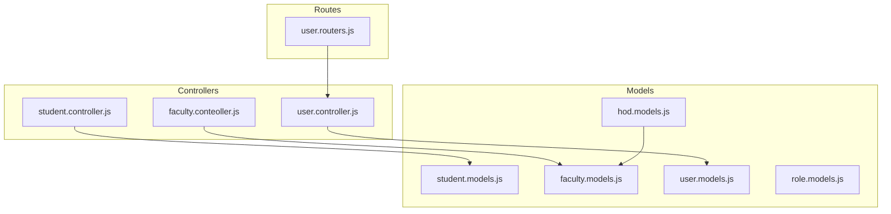
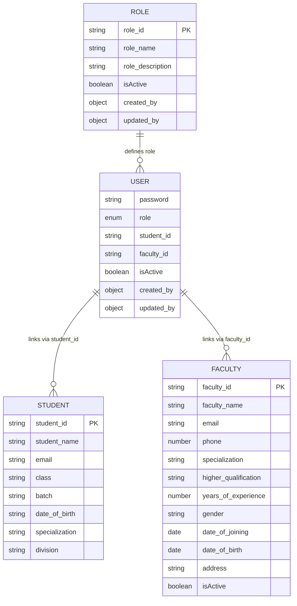
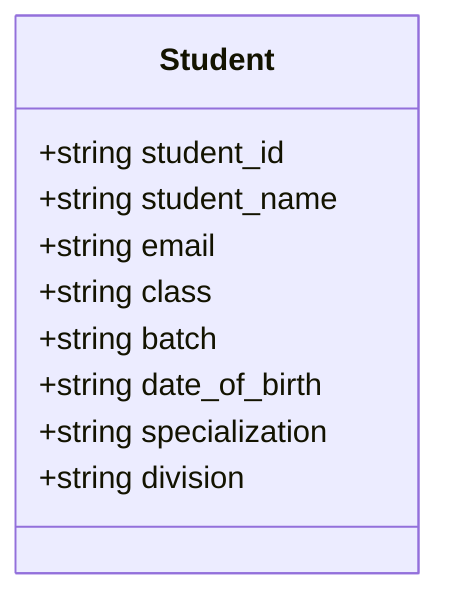
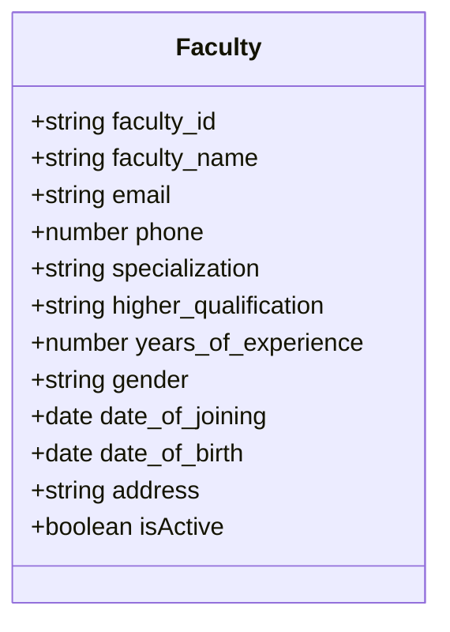
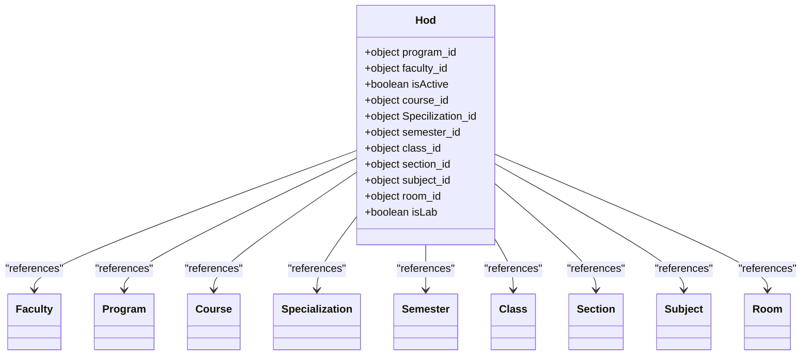
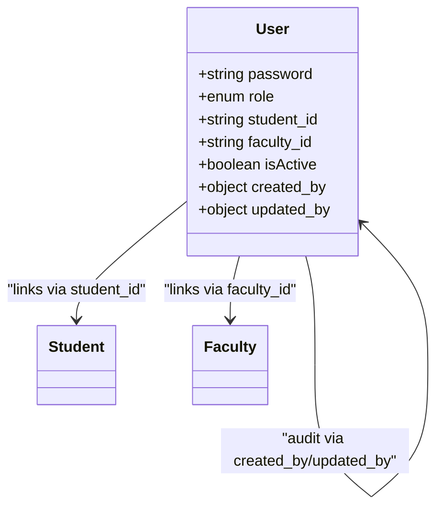
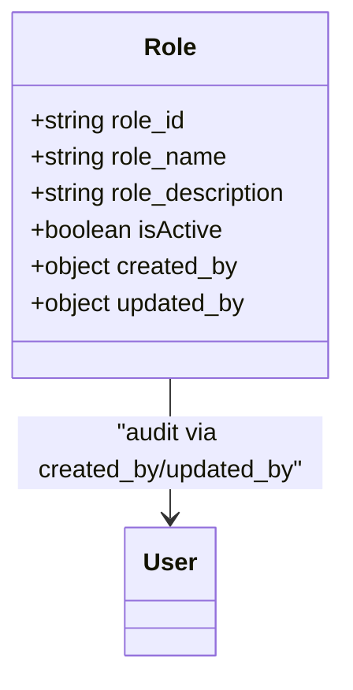
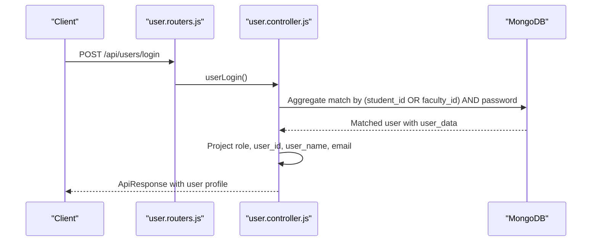
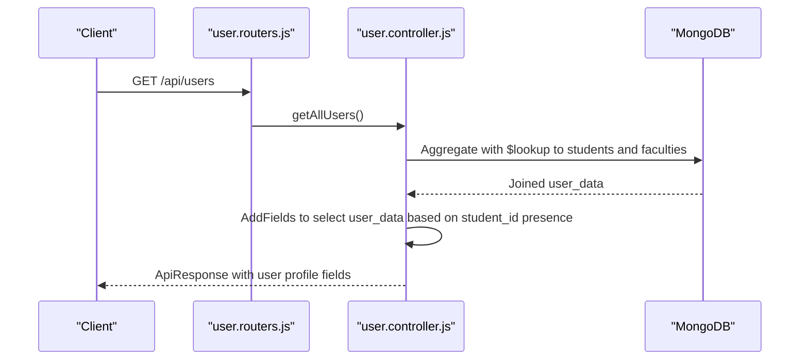
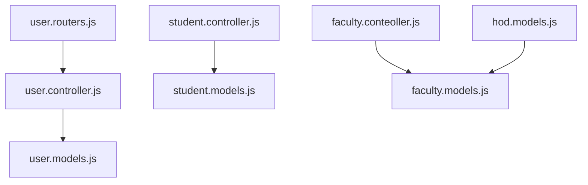

# Personnel Models

<cite>
**Referenced Files in This Document**
- [student.models.js](file://Backend/src/models/student.models.js)
- [faculty.models.js](file://Backend/src/models/faculty.models.js)
- [hod.models.js](file://Backend/src/models/hod.models.js)
- [user.models.js](file://Backend/src/models/user.models.js)
- [role.models.js](file://Backend/src/models/role.models.js)
- [student.controller.js](file://Backend/src/controllers/student.controller.js)
- [faculty.conteoller.js](file://Backend/src/controllers/faculty.conteoller.js)
- [user.controller.js](file://Backend/src/controllers/user.controller.js)
- [user.routers.js](file://Backend/src/routes/user.routers.js)
</cite>

## Table of Contents
1. [Introduction](#introduction)
2. [Project Structure](#project-structure)
3. [Core Components](#core-components)
4. [Architecture Overview](#architecture-overview)
5. [Detailed Component Analysis](#detailed-component-analysis)
6. [Dependency Analysis](#dependency-analysis)
7. [Performance Considerations](#performance-considerations)
8. [Troubleshooting Guide](#troubleshooting-guide)
9. [Conclusion](#conclusion)

## Introduction
This document provides comprehensive data model documentation for academic personnel in the system, focusing on three primary models: Student, Faculty, and HOD (Head of Department). It explains schema differences between student and faculty records, highlights the HOD model’s relationship to departmental structures, and documents the linking mechanism between User and Personnel models via student_id and faculty_id fields. Business constraints, validation rules, and role-based access patterns are included to guide correct usage and integration.

## Project Structure
The relevant models and controllers for academic personnel are organized under the Backend/src directory:
- Models define the data schemas for Student, Faculty, HOD, User, and Role.
- Controllers implement CRUD operations and business logic for these models.
- Routes connect HTTP endpoints to controller actions.

**Diagram sources**
- [student.models.js](file://Backend/src/models/student.models.js)
- [faculty.models.js](file://Backend/src/models/faculty.models.js)
- [hod.models.js](file://Backend/src/models/hod.models.js)
- [user.models.js](file://Backend/src/models/user.models.js)
- [role.models.js](file://Backend/src/models/role.models.js)
- [student.controller.js](file://Backend/src/controllers/student.controller.js)
- [faculty.conteoller.js](file://Backend/src/controllers/faculty.conteoller.js)
- [user.controller.js](file://Backend/src/controllers/user.controller.js)
- [user.routers.js](file://Backend/src/routes/user.routers.js)

**Section sources**
- [student.models.js](file://Backend/src/models/student.models.js)
- [faculty.models.js](file://Backend/src/models/faculty.models.js)
- [hod.models.js](file://Backend/src/models/hod.models.js)
- [user.models.js](file://Backend/src/models/user.models.js)
- [role.models.js](file://Backend/src/models/role.models.js)
- [student.controller.js](file://Backend/src/controllers/student.controller.js)
- [faculty.conteoller.js](file://Backend/src/controllers/faculty.conteoller.js)
- [user.controller.js](file://Backend/src/controllers/user.controller.js)
- [user.routers.js](file://Backend/src/routes/user.routers.js)

## Core Components
This section outlines the core models and their roles in the academic personnel ecosystem.

- Student Model
  - Purpose: Stores student identity and academic attributes.
  - Key fields: student_id, student_name, email, class, batch, date_of_birth, specialization, division.
  - Validation: Required fields enforced at schema level; uniqueness constraints on identifiers.
  - Indexing: Name field indexed for efficient lookups.

- Faculty Model
  - Purpose: Stores faculty identity, contact, qualification, and employment details.
  - Key fields: faculty_id, faculty_name, email, phone, specialization, higher_qualification, years_of_experience, gender, date_of_joining, date_of_birth, address, isActive.
  - Validation: Required fields enforced; uniqueness constraints on identifiers; numeric phone validation.
  - Defaults: date_of_joining defaults to current date; isActive defaults to true.

- HOD Model
  - Purpose: Represents Head of Department assignments across academic structures.
  - Key fields: program_id, faculty_id, isActive, course_id, Specilization_id, semester_id, class_id, section_id, subject_id, room_id, isLab.
  - Relationships: References Program, Faculty, Course, Specialization, Semester, Class, Section, Subject, Room via ObjectId.
  - Defaults: isActive defaults to true; isLab defaults to false.

- User Model
  - Purpose: Central authentication and authorization entity linking to personnel.
  - Key fields: password, role, student_id, faculty_id, isActive, created_by, updated_by.
  - Validation: Enumerated role values; mutual exclusivity enforced by requiring either student_id or faculty_id; optional linkage to another User for audit fields.
  - Defaults: isActive defaults to true.

- Role Model
  - Purpose: Defines roles with metadata and audit fields.
  - Key fields: role_id, role_name, role_description, isActive, created_by, updated_by.
  - Defaults: isActive defaults to true.

**Section sources**
- [student.models.js](file://Backend/src/models/student.models.js)
- [faculty.models.js](file://Backend/src/models/faculty.models.js)
- [hod.models.js](file://Backend/src/models/hod.models.js)
- [user.models.js](file://Backend/src/models/user.models.js)
- [role.models.js](file://Backend/src/models/role.models.js)

## Architecture Overview
The system links Users to Academic Personnel (Students/Faculty) through cross-model references. Authentication and authorization are role-based, with User serving as the central identity provider. HOD encapsulates departmental leadership and structural associations.

**Diagram sources**
- [user.models.js](file://Backend/src/models/user.models.js)
- [student.models.js](file://Backend/src/models/student.models.js)
- [faculty.models.js](file://Backend/src/models/faculty.models.js)
- [role.models.js](file://Backend/src/models/role.models.js)

## Detailed Component Analysis

### Student Model Analysis
- Schema characteristics
  - Unique identifiers: student_id, email.
  - Normalized casing: uppercase for identifiers, lowercase for textual fields; trimming enforced.
  - Academic fields: class, batch, specialization, division.
  - Timestamps enabled for creation/update tracking.
- Validation and constraints
  - Required fields enforced at schema level.
  - Uniqueness enforced for student_id and email.
  - Index on student_name for optimized queries.
- Business constraints
  - Academic grouping via class and batch.
  - Optional division for cohort segmentation.

**Diagram sources**
- [student.models.js](file://Backend/src/models/student.models.js)

**Section sources**
- [student.models.js](file://Backend/src/models/student.models.js)
- [student.controller.js](file://Backend/src/controllers/student.controller.js)

### Faculty Model Analysis
- Schema characteristics
  - Unique identifiers: faculty_id, email, phone.
  - Qualifications and experience: higher_qualification, years_of_experience.
  - Employment metadata: date_of_joining, isActive.
  - Contact and personal info: address, gender, date_of_birth.
- Validation and constraints
  - Required fields enforced; phone validated as numeric and unique.
  - Defaults applied for date_of_joining and isActive.
- Business constraints
  - Employment lifecycle tracked via isActive flag.
  - Specialization and qualification fields support academic role alignment.

**Diagram sources**
- [faculty.models.js](file://Backend/src/models/faculty.models.js)

**Section sources**
- [faculty.models.js](file://Backend/src/models/faculty.models.js)
- [faculty.conteoller.js](file://Backend/src/controllers/faculty.conteoller.js)

### HOD Model Analysis
- Schema characteristics
  - Cross-references to academic structures: Program, Course, Specialization, Semester, Class, Section, Subject, Room.
  - Leadership indicator: isActive.
  - Structural granularity: isLab flag for lab-based departments.
- Relationships
  - faculty_id references Faculty.
  - program_id references Program.
  - Additional fields link to Course, Specialization, Semester, Class, Section, Subject, Room.
- Business constraints
  - isActive indicates current assignment validity.
  - isLab distinguishes lab-focused departments.

**Diagram sources**
- [hod.models.js](file://Backend/src/models/hod.models.js)

**Section sources**
- [hod.models.js](file://Backend/src/models/hod.models.js)

### User Model Analysis
- Schema characteristics
  - Authentication: password.
  - Authorization: role with enumerated values.
  - Linkage: student_id or faculty_id (mutually exclusive via controller logic).
  - Audit: created_by, updated_by referencing User.
  - Status: isActive.
- Validation and constraints
  - Enumerated role values enforced.
  - Either student_id or faculty_id required.
  - Defaults for isActive and optional audit fields.
- Business constraints
  - Single-persona linkage: a User belongs to either a Student or a Faculty record.
  - Role determines access patterns across the system.

**Diagram sources**
- [user.models.js](file://Backend/src/models/user.models.js)

**Section sources**
- [user.models.js](file://Backend/src/models/user.models.js)
- [user.controller.js](file://Backend/src/controllers/user.controller.js)

### Role Model Analysis
- Schema characteristics
  - Role definition: role_id, role_name, role_description.
  - Audit: created_by, updated_by referencing User.
  - Status: isActive.
- Business constraints
  - Enforces standardized role taxonomy across the system.

**Diagram sources**
- [role.models.js](file://Backend/src/models/role.models.js)

**Section sources**
- [role.models.js](file://Backend/src/models/role.models.js)

### Authentication and Authorization Flow
The User model integrates with Student and Faculty records to provide unified authentication and role-based access. The login flow demonstrates how user credentials are matched against either student_id or faculty_id and how user_data is projected for session usage.

**Diagram sources**
- [user.routers.js](file://Backend/src/routes/user.routers.js)
- [user.controller.js](file://Backend/src/controllers/user.controller.js)

**Section sources**
- [user.controller.js](file://Backend/src/controllers/user.controller.js)
- [user.routers.js](file://Backend/src/routes/user.routers.js)

### Data Retrieval and Projection Flow
The getAllUsers and getUserById controllers demonstrate how User documents are enriched with either Student or Faculty details depending on the presence of student_id or faculty_id.

**Diagram sources**
- [user.routers.js](file://Backend/src/routes/user.routers.js)
- [user.controller.js](file://Backend/src/controllers/user.controller.js)

**Section sources**
- [user.controller.js](file://Backend/src/controllers/user.controller.js)

### Field Definitions, Validation Rules, and Business Constraints

- Student
  - Fields: student_id (required, unique, uppercase), student_name (required, lowercase, trimmed, indexed), email (required, unique, lowercase, trimmed), class (required, lowercase, trimmed), batch (required, lowercase, trimmed), date_of_birth (required, lowercase, trimmed), specialization (required, lowercase, trimmed), division (optional, uppercase, trimmed).
  - Validation: Schema-level required and unique constraints; trimming and casing normalization.
  - Business: Academic grouping via class/batch; optional division for cohorting.

- Faculty
  - Fields: faculty_id (required, uppercase), faculty_name (required, lowercase, trimmed, indexed), email (required, unique, lowercase, trimmed), phone (required, numeric, unique), specialization (required, lowercase, trimmed), higher_qualification (required, lowercase, trimmed), years_of_experience (required, numeric), gender (required, lowercase, trimmed), date_of_joining (optional, default now), date_of_birth (optional, date), address (required, trimmed), isActive (optional, default true).
  - Validation: Numeric phone constraint; required fields; defaults applied.
  - Business: Employment lifecycle managed by isActive; specialization and qualification align with academic roles.

- HOD
  - Fields: program_id (optional, ObjectId), faculty_id (optional, ObjectId), isActive (optional, default true), course_id (optional, ObjectId), Specilization_id (optional, ObjectId), semester_id (optional, ObjectId), class_id (optional, ObjectId), section_id (optional, ObjectId), subject_id (optional, ObjectId), room_id (optional, ObjectId), isLab (optional, default false).
  - Relationships: References to Program, Faculty, Course, Specialization, Semester, Class, Section, Subject, Room.
  - Business: Captures departmental leadership and structural mapping.

- User
  - Fields: password (required), role (required, enum: admin, faculty, student, coordinator, hod), student_id (optional), faculty_id (optional), isActive (optional, default true), created_by (optional, ObjectId), updated_by (optional, ObjectId).
  - Validation: Enumerated role values; either student_id or faculty_id required.
  - Business: Single-persona linkage; audit trail via created_by/updated_by.

- Role
  - Fields: role_id (required, unique, uppercase), role_name (required, lowercase, trimmed, indexed), role_description (required, lowercase, trimmed), isActive (optional, default true), created_by (optional, ObjectId), updated_by (optional, ObjectId).
  - Business: Standardized role taxonomy.

**Section sources**
- [student.models.js](file://Backend/src/models/student.models.js)
- [faculty.models.js](file://Backend/src/models/faculty.models.js)
- [hod.models.js](file://Backend/src/models/hod.models.js)
- [user.models.js](file://Backend/src/models/user.models.js)
- [role.models.js](file://Backend/src/models/role.models.js)

### Examples of Personnel Document Structures
Below are representative structures for each model. Replace bracketed placeholders with actual values.

- Student Document
  - Example keys: student_id, student_name, email, class, batch, date_of_birth, specialization, division.
  - Notes: student_id and email must be unique; class/batch indicate academic grouping.

- Faculty Document
  - Example keys: faculty_id, faculty_name, email, phone, specialization, higher_qualification, years_of_experience, gender, date_of_joining, date_of_birth, address, isActive.
  - Notes: faculty_id, email, and phone must be unique; isActive reflects employment status.

- HOD Document
  - Example keys: program_id, faculty_id, isActive, course_id, Specilization_id, semester_id, class_id, section_id, subject_id, room_id, isLab.
  - Notes: Links to academic structures; isLab indicates lab-focused departments.

- User Document
  - Example keys: password, role, student_id, faculty_id, isActive, created_by, updated_by.
  - Notes: Either student_id or faculty_id must be present; role defines access level.

- Role Document
  - Example keys: role_id, role_name, role_description, isActive, created_by, updated_by.
  - Notes: role_id must be unique; role_name is indexed for quick lookup.

**Section sources**
- [student.models.js](file://Backend/src/models/student.models.js)
- [faculty.models.js](file://Backend/src/models/faculty.models.js)
- [hod.models.js](file://Backend/src/models/hod.models.js)
- [user.models.js](file://Backend/src/models/user.models.js)
- [role.models.js](file://Backend/src/models/role.models.js)

### Role-Based Access Patterns
- Roles supported: admin, faculty, student, coordinator, hod.
- Access determination:
  - Authentication: userLogin aggregates user data and projects role, user_id, user_name, and email.
  - Authorization: role dictates permitted operations across controllers and routes.
- Practical implications:
  - Admin: broad administrative privileges.
  - Faculty: access aligned with teaching and timetable responsibilities.
  - Student: access aligned with viewing schedules and academic details.
  - Coordinator/HOD: elevated access for departmental coordination and oversight.

**Section sources**
- [user.controller.js](file://Backend/src/controllers/user.controller.js)
- [user.models.js](file://Backend/src/models/user.models.js)

## Dependency Analysis
The following diagram illustrates dependencies among models and controllers involved in personnel management.

**Diagram sources**
- [user.controller.js](file://Backend/src/controllers/user.controller.js)
- [user.models.js](file://Backend/src/models/user.models.js)
- [student.controller.js](file://Backend/src/controllers/student.controller.js)
- [student.models.js](file://Backend/src/models/student.models.js)
- [faculty.conteoller.js](file://Backend/src/controllers/faculty.conteoller.js)
- [faculty.models.js](file://Backend/src/models/faculty.models.js)
- [hod.models.js](file://Backend/src/models/hod.models.js)
- [user.routers.js](file://Backend/src/routes/user.routers.js)

**Section sources**
- [user.controller.js](file://Backend/src/controllers/user.controller.js)
- [user.models.js](file://Backend/src/models/user.models.js)
- [student.controller.js](file://Backend/src/controllers/student.controller.js)
- [student.models.js](file://Backend/src/models/student.models.js)
- [faculty.conteoller.js](file://Backend/src/controllers/faculty.conteoller.js)
- [faculty.models.js](file://Backend/src/models/faculty.models.js)
- [hod.models.js](file://Backend/src/models/hod.models.js)
- [user.routers.js](file://Backend/src/routes/user.routers.js)

## Performance Considerations
- Indexing: student_name is indexed in the Student model to optimize lookups.
- Aggregation: User retrieval uses $lookup and $addFields to merge Student or Faculty data efficiently.
- Uniqueness checks: Controllers pre-check existence by student_id, email, and phone to avoid duplicates and reduce write conflicts.
- Defaults: Using defaults (e.g., isActive, date_of_joining) reduces validation overhead during writes.

[No sources needed since this section provides general guidance]

## Troubleshooting Guide
- Duplicate entries
  - Symptoms: Registration errors indicating existing records.
  - Causes: Duplicate student_id, email, or phone.
  - Resolution: Filter unique records before insertion; verify uniqueness constraints.
- Missing linkage
  - Symptoms: User without associated Student or Faculty record.
  - Causes: Missing student_id or faculty_id.
  - Resolution: Ensure either student_id or faculty_id is provided during User registration.
- Role validation
  - Symptoms: Errors indicating unsupported role values.
  - Causes: Non-enumerated role values.
  - Resolution: Use one of the supported roles: admin, faculty, student, coordinator, hod.
- Login failures
  - Symptoms: Invalid credentials errors.
  - Causes: Incorrect user_id or password.
  - Resolution: Verify user_id matches either student_id or faculty_id and ensure password correctness.

**Section sources**
- [student.controller.js](file://Backend/src/controllers/student.controller.js)
- [faculty.conteoller.js](file://Backend/src/controllers/faculty.conteoller.js)
- [user.controller.js](file://Backend/src/controllers/user.controller.js)
- [user.models.js](file://Backend/src/models/user.models.js)

## Conclusion
The personnel models form a cohesive foundation for academic identity and access control. Students and Faculty are modeled distinctly to reflect their different roles, while the HOD model captures departmental leadership and structural relationships. The User model unifies authentication and authorization, enforcing role-based access and linking to the appropriate personnel record. Adhering to the documented validations, constraints, and access patterns ensures data integrity and predictable behavior across the system.