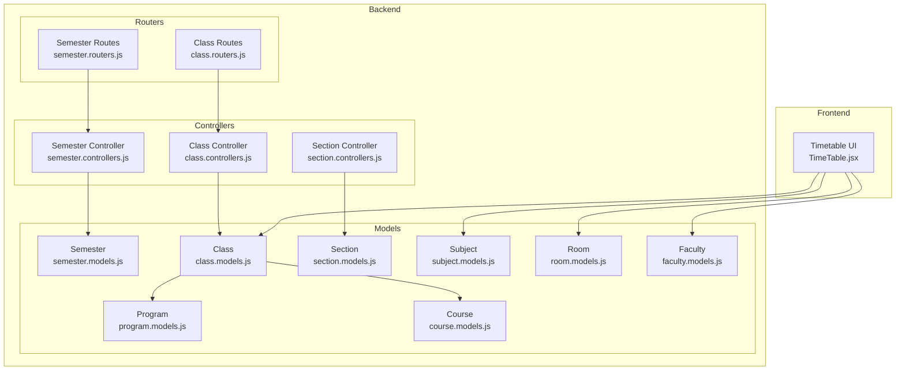
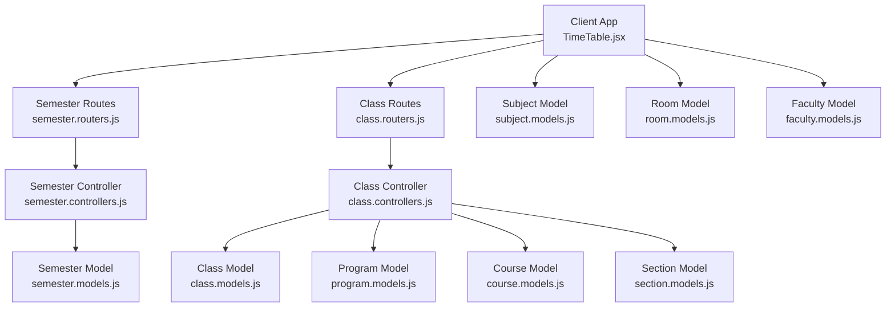
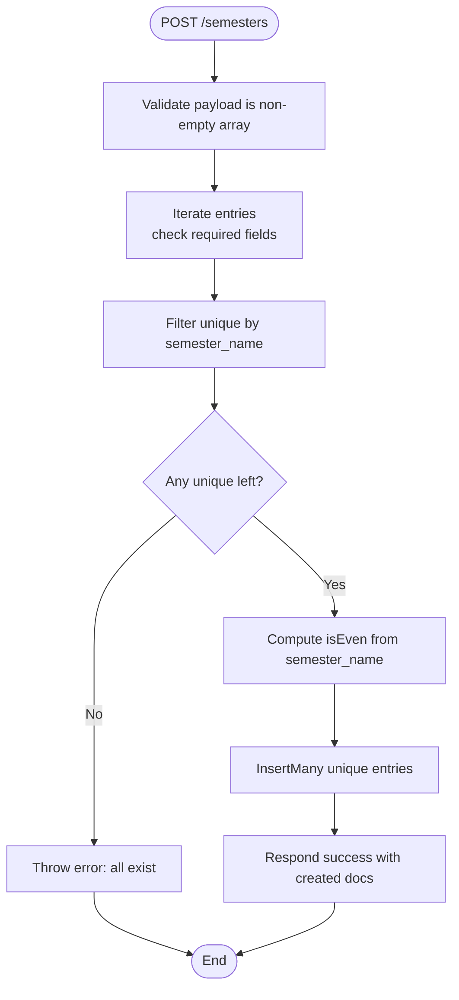
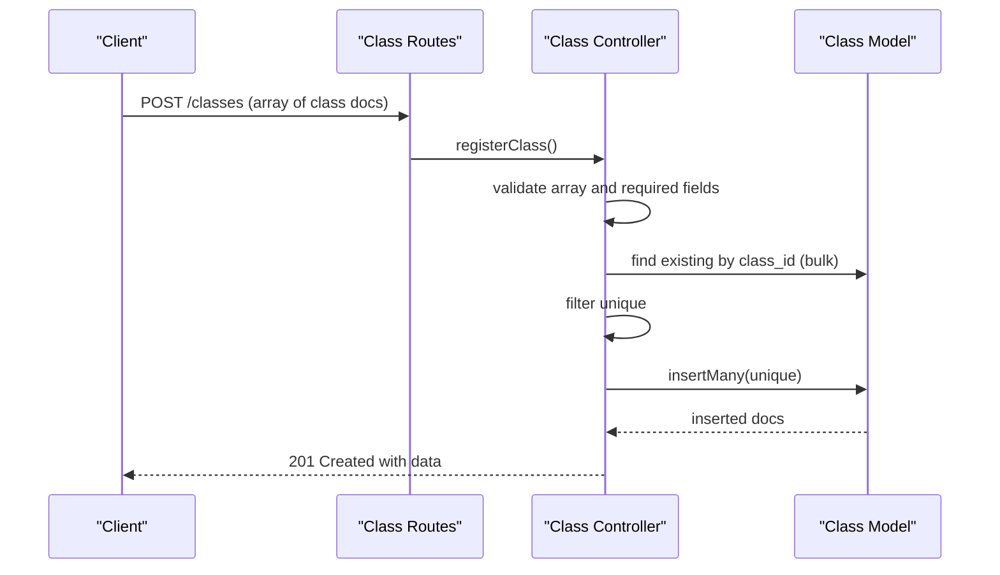
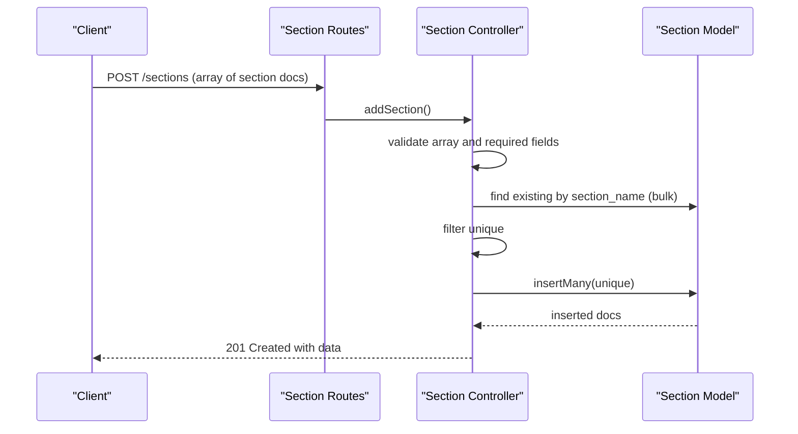
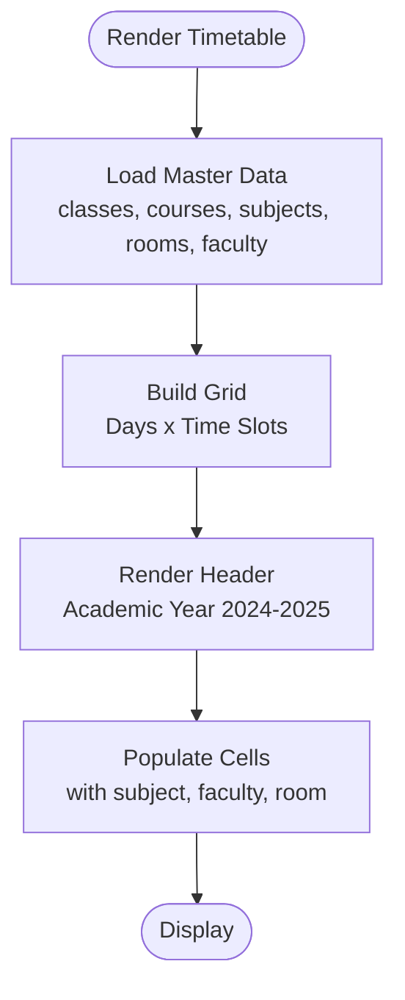

# Temporal Models

<cite>
**Referenced Files in This Document**
- [semester.models.js](file://Backend/src/models/semester.models.js)
- [semester.controllers.js](file://Backend/src/controllers/semester.controllers.js)
- [semester.routers.js](file://Backend/src/routes/semester.routers.js)
- [class.models.js](file://Backend/src/models/class.models.js)
- [class.controllers.js](file://Backend/src/controllers/class.controllers.js)
- [class.routers.js](file://Backend/src/routes/class.routers.js)
- [section.models.js](file://Backend/src/models/section.models.js)
- [section.controllers.js](file://Backend/src/controllers/section.controllers.js)
- [program.models.js](file://Backend/src/models/program.models.js)
- [course.models.js](file://Backend/src/models/course.models.js)
- [subject.models.js](file://Backend/src/models/subject.models.js)
- [room.models.js](file://Backend/src/models/room.models.js)
- [faculty.models.js](file://Backend/src/models/faculty.models.js)
- [TimeTable.jsx](file://Client/src/components/deshboard/TimeTable.jsx)
</cite>

## Table of Contents
1. [Introduction](#introduction)
2. [Project Structure](#project-structure)
3. [Core Components](#core-components)
4. [Architecture Overview](#architecture-overview)
5. [Detailed Component Analysis](#detailed-component-analysis)
6. [Dependency Analysis](#dependency-analysis)
7. [Performance Considerations](#performance-considerations)
8. [Troubleshooting Guide](#troubleshooting-guide)
9. [Conclusion](#conclusion)
10. [Appendices](#appendices)

## Introduction
This document provides comprehensive data model documentation for temporal models in the academic scheduling system, focusing on Semesters and Classes. It explains how the Semester model captures academic calendar semantics (even/odd designation) and how the Class model anchors scheduling units linked to programs and courses. It also clarifies how Sections relate to Classes and how the frontend renders a weekly timetable grid aligned with fixed time slots and days. The document outlines field definitions, validation rules, and temporal constraints, and demonstrates how these models support academic scheduling requirements.

## Project Structure
The backend is organized by domain-focused modules: models define schemas, controllers implement CRUD operations, and routers bind endpoints. The frontend defines a fixed weekly timetable grid with time slots and days, which aligns with the scheduling domain.



**Diagram sources**
- [semester.models.js:1-28](file://Backend/src/models/semester.models.js#L1-L28)
- [semester.controllers.js:1-99](file://Backend/src/controllers/semester.controllers.js#L1-L99)
- [semester.routers.js:1-19](file://Backend/src/routes/semester.routers.js#L1-L19)
- [class.models.js:1-32](file://Backend/src/models/class.models.js#L1-L32)
- [class.controllers.js:1-179](file://Backend/src/controllers/class.controllers.js#L1-L179)
- [class.routers.js:1-24](file://Backend/src/routes/class.routers.js#L1-L24)
- [section.models.js:1-31](file://Backend/src/models/section.models.js#L1-L31)
- [section.controllers.js:1-137](file://Backend/src/controllers/section.controllers.js#L1-L137)
- [program.models.js:1-24](file://Backend/src/models/program.models.js#L1-L24)
- [course.models.js:1-33](file://Backend/src/models/course.models.js#L1-L33)
- [subject.models.js:1-33](file://Backend/src/models/subject.models.js#L1-L33)
- [room.models.js:1-28](file://Backend/src/models/room.models.js#L1-L28)
- [faculty.models.js:1-77](file://Backend/src/models/faculty.models.js#L1-L77)
- [TimeTable.jsx:23-37](file://Client/src/components/deshboard/TimeTable.jsx#L23-L37)

**Section sources**
- [semester.models.js:1-28](file://Backend/src/models/semester.models.js#L1-L28)
- [class.models.js:1-32](file://Backend/src/models/class.models.js#L1-L32)
- [section.models.js:1-31](file://Backend/src/models/section.models.js#L1-L31)
- [program.models.js:1-24](file://Backend/src/models/program.models.js#L1-L24)
- [course.models.js:1-33](file://Backend/src/models/course.models.js#L1-L33)
- [subject.models.js:1-33](file://Backend/src/models/subject.models.js#L1-L33)
- [room.models.js:1-28](file://Backend/src/models/room.models.js#L1-L28)
- [faculty.models.js:1-77](file://Backend/src/models/faculty.models.js#L1-L77)
- [TimeTable.jsx:23-37](file://Client/src/components/deshboard/TimeTable.jsx#L23-L37)

## Core Components
This section documents the core temporal and scheduling models and their relationships.

- Semester Model
  - Purpose: Represents academic semesters with even/odd designation derived from numeric identifiers.
  - Fields:
    - semester_name: Number (required, unique, uppercase, trimmed)
    - isEven: Boolean (default false)
  - Validation and Constraints:
    - Unique constraint on semester_name.
    - Even/odd flag computed from semester_name value.
  - Temporal Semantics:
    - Encodes academic calendar grouping via numeric identifiers and parity.

- Class Model
  - Purpose: Serves as a scheduling unit container linked to Program and Course.
  - Fields:
    - class_id: String (required, unique, uppercase, trimmed)
    - program_id: ObjectId referencing Program
    - year: Number (required, trimmed)
    - course_id: ObjectId referencing Course
  - Validation and Constraints:
    - Required fields: class_id, year.
    - Unique constraint on class_id.
  - Temporal Semantics:
    - year indicates academic year alignment for the class cohort.

- Section Model
  - Purpose: Divisions within a Class for scheduling granularity.
  - Fields:
    - section_name: String (required, lowercase, trimmed)
    - class_id: ObjectId referencing Class
    - description: String (required, lowercase, trimmed)
  - Validation and Constraints:
    - Required fields: class_id, section_name.
  - Temporal Semantics:
    - Inherits temporal context from parent Class (year).

- Program and Course Models
  - Program: Academic program classification with program_id and program_name enum.
  - Course: Course metadata including course_id, course_name, course_duration, and isActive.

- Subject, Room, Faculty Models
  - Subject: Subject identity with credits and activity flag.
  - Room: Room identifier with floor and wing.
  - Faculty: Personnel record with personal and employment details.

**Section sources**
- [semester.models.js:12-22](file://Backend/src/models/semester.models.js#L12-L22)
- [class.models.js:5-22](file://Backend/src/models/class.models.js#L5-L22)
- [section.models.js:11-26](file://Backend/src/models/section.models.js#L11-L26)
- [program.models.js:5-18](file://Backend/src/models/program.models.js#L5-L18)
- [course.models.js:5-29](file://Backend/src/models/course.models.js#L5-L29)
- [subject.models.js:5-27](file://Backend/src/models/subject.models.js#L5-L27)
- [room.models.js:5-22](file://Backend/src/models/room.models.js#L5-L22)
- [faculty.models.js:5-69](file://Backend/src/models/faculty.models.js#L5-L69)

## Architecture Overview
The backend exposes REST endpoints for Semesters and Classes, with Controllers implementing validation and persistence. The frontend renders a fixed weekly timetable grid aligned with time slots and days, consuming master data such as Classes, Courses, Subjects, Rooms, and Faculty.



**Diagram sources**
- [semester.routers.js:1-19](file://Backend/src/routes/semester.routers.js#L1-L19)
- [class.routers.js:1-24](file://Backend/src/routes/class.routers.js#L1-L24)
- [semester.controllers.js:1-99](file://Backend/src/controllers/semester.controllers.js#L1-L99)
- [class.controllers.js:1-179](file://Backend/src/controllers/class.controllers.js#L1-L179)
- [semester.models.js:1-28](file://Backend/src/models/semester.models.js#L1-L28)
- [class.models.js:1-32](file://Backend/src/models/class.models.js#L1-L32)
- [section.models.js:1-31](file://Backend/src/models/section.models.js#L1-L31)
- [program.models.js:1-24](file://Backend/src/models/program.models.js#L1-L24)
- [course.models.js:1-33](file://Backend/src/models/course.models.js#L1-L33)
- [subject.models.js:1-33](file://Backend/src/models/subject.models.js#L1-L33)
- [room.models.js:1-28](file://Backend/src/models/room.models.js#L1-L28)
- [faculty.models.js:1-77](file://Backend/src/models/faculty.models.js#L1-L77)
- [TimeTable.jsx:23-37](file://Client/src/components/deshboard/TimeTable.jsx#L23-L37)

## Detailed Component Analysis

### Semester Model Analysis
- Schema and Fields
  - semester_name: Number (required, unique, uppercase, trimmed)
  - isEven: Boolean (default false)
- Validation Rules
  - Unique constraint enforced via schema definition.
  - Even/odd flag is computed from semester_name during creation.
- Processing Logic
  - Controller validates incoming batch data and filters duplicates.
  - Parity is set per record based on numeric semester_name.
  - Bulk insertion persists unique records.



**Diagram sources**
- [semester.controllers.js:6-40](file://Backend/src/controllers/semester.controllers.js#L6-L40)
- [semester.models.js:12-22](file://Backend/src/models/semester.models.js#L12-L22)

**Section sources**
- [semester.models.js:12-22](file://Backend/src/models/semester.models.js#L12-L22)
- [semester.controllers.js:6-40](file://Backend/src/controllers/semester.controllers.js#L6-L40)
- [semester.routers.js:11-16](file://Backend/src/routes/semester.routers.js#L11-L16)

### Class Model Analysis
- Schema and Fields
  - class_id: String (required, unique, uppercase, trimmed)
  - program_id: ObjectId referencing Program
  - year: Number (required, trimmed)
  - course_id: ObjectId referencing Course
- Validation Rules
  - Required fields: class_id, year.
  - Unique constraint on class_id.
  - Controller enforces array input and absence of duplicates.
- Processing Logic
  - Controller validates input, deduplicates by class_id, and inserts unique records.
  - Aggregation joins with Program and Course for retrieval.



**Diagram sources**
- [class.routers.js:13-13](file://Backend/src/routes/class.routers.js#L13-L13)
- [class.controllers.js:6-37](file://Backend/src/controllers/class.controllers.js#L6-L37)
- [class.models.js:5-22](file://Backend/src/models/class.models.js#L5-L22)

**Section sources**
- [class.models.js:5-22](file://Backend/src/models/class.models.js#L5-L22)
- [class.controllers.js:6-37](file://Backend/src/controllers/class.controllers.js#L6-L37)
- [class.routers.js:13-13](file://Backend/src/routes/class.routers.js#L13-L13)

### Section Model Analysis
- Schema and Fields
  - section_name: String (required, lowercase, trimmed)
  - class_id: ObjectId referencing Class
  - description: String (required, lowercase, trimmed)
- Validation Rules
  - Required fields: class_id, section_name.
  - Controller deduplicates by section_name before insertion.
- Processing Logic
  - Controller validates input, deduplicates, and inserts unique sections.
  - Population of class_id enables downstream scheduling queries.



**Diagram sources**
- [section.controllers.js:6-47](file://Backend/src/controllers/section.controllers.js#L6-L47)
- [section.models.js:11-26](file://Backend/src/models/section.models.js#L11-L26)

**Section sources**
- [section.models.js:11-26](file://Backend/src/models/section.models.js#L11-L26)
- [section.controllers.js:6-47](file://Backend/src/controllers/section.controllers.js#L6-L47)

### Frontend Timetable Rendering
- Fixed Weekly Grid
  - Days: Monday to Saturday
  - Time Slots: 9:00–10:00 to 16:00–17:00 with short break and lunch break
- Academic Year Reference
  - UI displays Academic Year 2024–2025 in the timetable header
- Data Consumption
  - Uses master data: classes, courses, subjects, rooms, faculty
  - Generates sample timetable entries per time slot and day



**Diagram sources**
- [TimeTable.jsx:23-37](file://Client/src/components/deshboard/TimeTable.jsx#L23-L37)
- [TimeTable.jsx:246-248](file://Client/src/components/deshboard/TimeTable.jsx#L246-L248)
- [TimeTable.jsx:40-60](file://Client/src/components/deshboard/TimeTable.jsx#L40-L60)

**Section sources**
- [TimeTable.jsx:23-37](file://Client/src/components/deshboard/TimeTable.jsx#L23-L37)
- [TimeTable.jsx:246-248](file://Client/src/components/deshboard/TimeTable.jsx#L246-L248)

## Dependency Analysis
The Class model references Program and Course, while Sections reference Classes. The Class Controller aggregates with Program and Course for richer views. The frontend consumes these models to render a structured weekly timetable.

```mermaid
erDiagram
SEMESTER {
number semester_name
boolean isEven
}
CLASS {
string class_id
number year
objectid program_id
objectid course_id
}
SECTION {
string section_name
string description
objectid class_id
}
PROGRAM {
string program_id
enum program_name
}
COURSE {
string course_id
string course_name
number course_duration
boolean isActive
}
SUBJECT {
string subject_id
string subject_name
number credit
boolean isActive
}
ROOM {
string room_no
number floor_no
string wing
}
FACULTY {
string faculty_id
string faculty_name
string email
number phone
string specialization
string higher_qualification
number years_of_Experience
string gender
date date_of_joining
date date_of_birth
string address
boolean isActive
}
CLASS }o--|| PROGRAM : "references"
CLASS }o--|| COURSE : "references"
SECTION }o--|| CLASS : "belongs_to"
```

**Diagram sources**
- [semester.models.js:12-22](file://Backend/src/models/semester.models.js#L12-L22)
- [class.models.js:5-22](file://Backend/src/models/class.models.js#L5-L22)
- [section.models.js:11-26](file://Backend/src/models/section.models.js#L11-L26)
- [program.models.js:5-18](file://Backend/src/models/program.models.js#L5-L18)
- [course.models.js:5-29](file://Backend/src/models/course.models.js#L5-L29)
- [subject.models.js:5-27](file://Backend/src/models/subject.models.js#L5-L27)
- [room.models.js:5-22](file://Backend/src/models/room.models.js#L5-L22)
- [faculty.models.js:5-69](file://Backend/src/models/faculty.models.js#L5-L69)

**Section sources**
- [class.models.js:13-27](file://Backend/src/models/class.models.js#L13-L27)
- [section.models.js:17-20](file://Backend/src/models/section.models.js#L17-L20)
- [class.controllers.js:41-70](file://Backend/src/controllers/class.controllers.js#L41-L70)

## Performance Considerations
- Indexing
  - Consider adding indexes on frequently queried fields such as class_id, course_id, program_id, and semester_name to optimize lookups and uniqueness checks.
- Aggregation Efficiency
  - The Class Controller uses aggregation with $lookup and $unwind; ensure indexes exist on foreign keys to minimize pipeline cost.
- Batch Operations
  - Use bulk write operations for inserting unique Semesters and Classes to reduce round trips.
- Frontend Rendering
  - Precompute subject-to-color mapping and memoize filtered class lists to avoid unnecessary re-renders.

## Troubleshooting Guide
- Semester Creation
  - Symptom: Error indicating all semesters already exist.
  - Cause: Provided semester_name values match existing records.
  - Resolution: Ensure unique semester_name values; parity is computed automatically.
- Class Registration
  - Symptom: Error indicating missing required fields.
  - Cause: Missing class_id or year in request payload.
  - Resolution: Provide both fields; class_id must be unique.
- Section Addition
  - Symptom: No new sections created despite valid input.
  - Cause: All section_name values already exist.
  - Resolution: Change section_name to unique values.
- Class Retrieval
  - Symptom: Empty results when fetching classes.
  - Cause: No classes exist or incorrect filtering.
  - Resolution: Verify existence and use correct query parameters.

**Section sources**
- [semester.controllers.js:9-23](file://Backend/src/controllers/semester.controllers.js#L9-L23)
- [class.controllers.js:9-28](file://Backend/src/controllers/class.controllers.js#L9-L28)
- [section.controllers.js:9-34](file://Backend/src/controllers/section.controllers.js#L9-L34)
- [class.controllers.js:72-74](file://Backend/src/controllers/class.controllers.js#L72-L74)

## Conclusion
The temporal models capture essential academic scheduling semantics: Semesters encode even/odd academic cycles, Classes anchor scheduling units with year and program/course links, and Sections provide division-level granularity. Together with supporting models for Subjects, Rooms, and Faculty, and the frontend’s fixed weekly timetable grid, the system provides a robust foundation for academic scheduling. Proper indexing, validation, and batch operations will further enhance reliability and performance.

## Appendices

### Example Semester Configurations
- Odd Semester: semester_name = 1 → isEven = false
- Even Semester: semester_name = 2 → isEven = true
- Additional odd/even semesters follow the same parity rule.

**Section sources**
- [semester.controllers.js:25-28](file://Backend/src/controllers/semester.controllers.js#L25-L28)
- [semester.models.js:19-22](file://Backend/src/models/semester.models.js#L19-L22)

### Temporal Constraints Summary
- Semester
  - Unique identifier: semester_name (Number)
  - Derived property: isEven (Boolean)
- Class
  - Unique identifier: class_id (String)
  - Cohort year: year (Number)
  - Links: program_id (ObjectId), course_id (ObjectId)
- Section
  - Unique identifier: section_name (String)
  - Link: class_id (ObjectId)

**Section sources**
- [semester.models.js:12-22](file://Backend/src/models/semester.models.js#L12-L22)
- [class.models.js:5-22](file://Backend/src/models/class.models.js#L5-L22)
- [section.models.js:11-20](file://Backend/src/models/section.models.js#L11-L20)