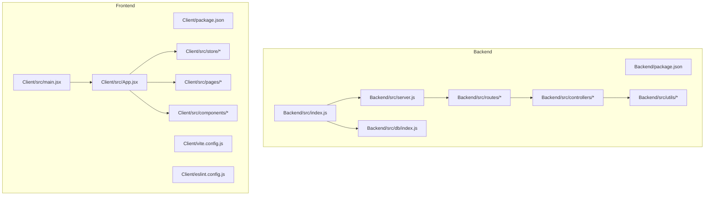
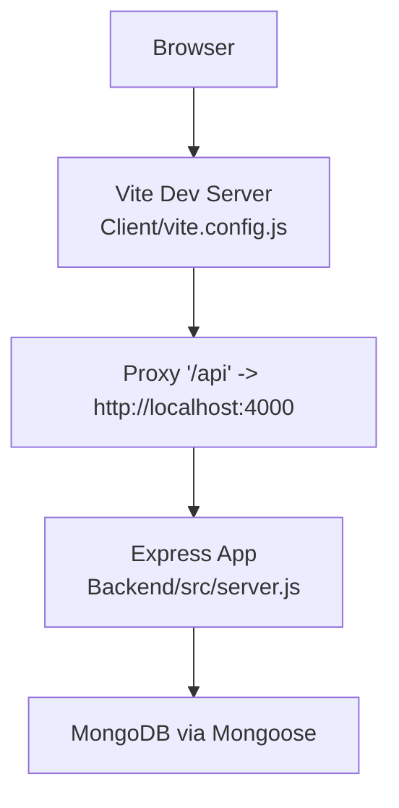
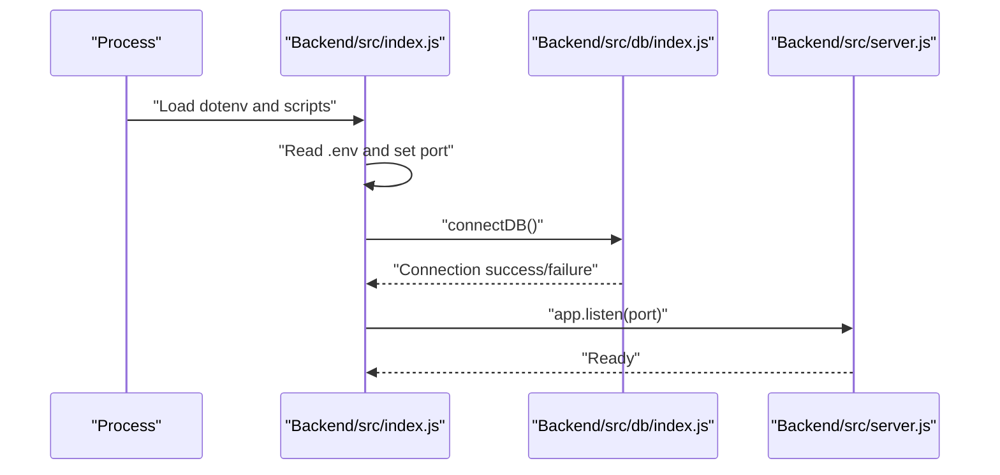
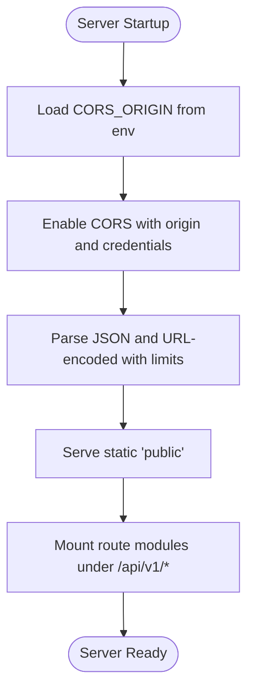
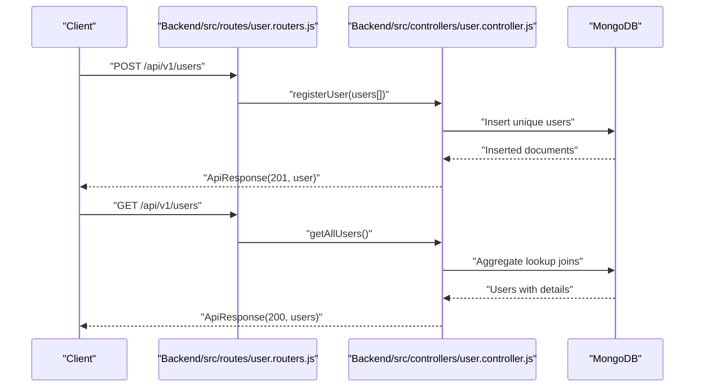
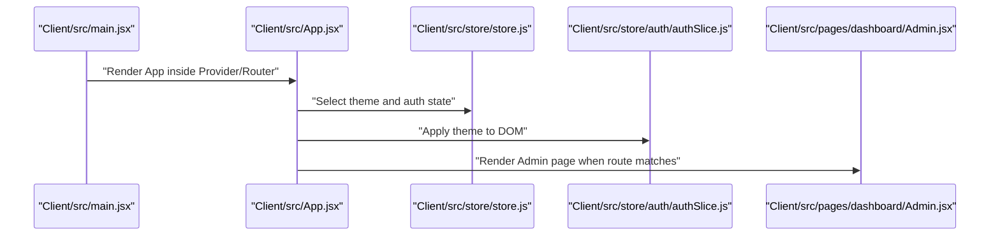
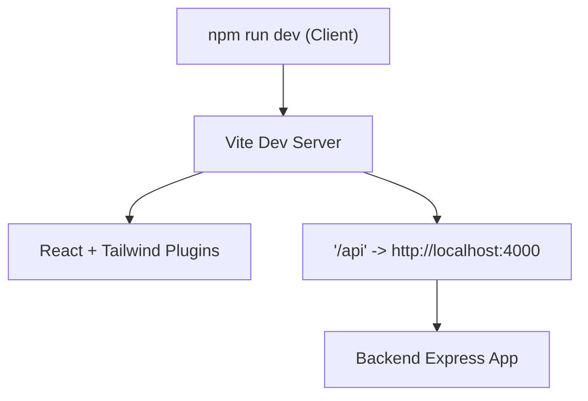
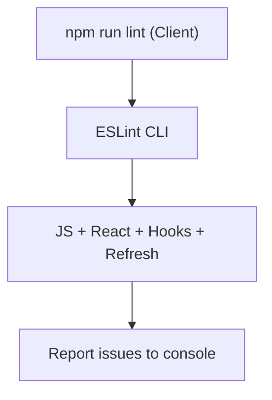
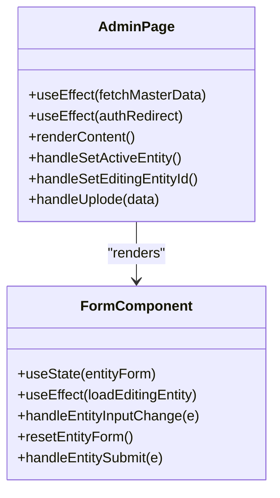
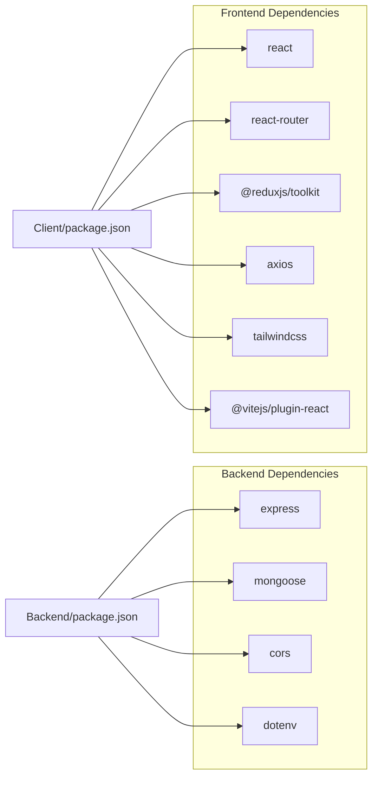

# Development Workflow

<cite>
**Referenced Files in This Document**
- [Backend package.json](file://Backend/package.json)
- [Backend src/index.js](file://Backend/src/index.js)
- [Backend src/server.js](file://Backend/src/server.js)
- [Backend src/db/index.js](file://Backend/src/db/index.js)
- [Backend src/utils/ApiError.js](file://Backend/src/utils/ApiError.js)
- [Backend src/utils/ApiResponse.js](file://Backend/src/utils/ApiResponse.js)
- [Backend src/utils/asyncHandler.js](file://Backend/src/utils/asyncHandler.js)
- [Backend src/controllers/user.controller.js](file://Backend/src/controllers/user.controller.js)
- [Backend src/routes/user.routers.js](file://Backend/src/routes/user.routers.js)
- [Client package.json](file://Client/package.json)
- [Client vite.config.js](file://Client/vite.config.js)
- [Client eslint.config.js](file://Client/eslint.config.js)
- [Client src/main.jsx](file://Client/src/main.jsx)
- [Client src/App.jsx](file://Client/src/App.jsx)
- [Client src/store/store.js](file://Client/src/store/store.js)
- [Client src/store/auth/authSlice.js](file://Client/src/store/auth/authSlice.js)
- [Client src/components/deshboard/Form.jsx](file://Client/src/components/deshboard/Form.jsx)
- [Client src/pages/dashboard/Admin.jsx](file://Client/src/pages/dashboard/Admin.jsx)
</cite>

## Table of Contents
1. [Introduction](#introduction)
2. [Project Structure](#project-structure)
3. [Core Components](#core-components)
4. [Architecture Overview](#architecture-overview)
5. [Detailed Component Analysis](#detailed-component-analysis)
6. [Dependency Analysis](#dependency-analysis)
7. [Performance Considerations](#performance-considerations)
8. [Troubleshooting Guide](#troubleshooting-guide)
9. [Conclusion](#conclusion)
10. [Appendices](#appendices)

## Introduction
This document describes the development workflow and project configuration for a full-stack timetable management application. It covers project structure guidelines, coding standards, development best practices, Vite configuration for frontend development, backend Express server setup, ESLint configuration, Git workflow, testing strategies, debugging and performance profiling, deployment configuration, environment variables, and release management.

## Project Structure
The project follows a clear separation of concerns:
- Backend: Node.js with Express and MongoDB via Mongoose, organized by controllers, models, routes, utilities, and database initialization.
- Frontend: React 19 with Redux Toolkit, organized by components, pages, store slices, and shared utilities.

**Diagram sources**
- [Backend src/index.js:1-18](file://Backend/src/index.js#L1-L18)
- [Backend src/server.js:1-54](file://Backend/src/server.js#L1-L54)
- [Backend src/db/index.js:1-19](file://Backend/src/db/index.js#L1-L19)
- [Backend src/utils/ApiError.js:1-21](file://Backend/src/utils/ApiError.js#L1-L21)
- [Backend src/utils/ApiResponse.js:1-10](file://Backend/src/utils/ApiResponse.js#L1-L10)
- [Backend src/utils/asyncHandler.js:1-4](file://Backend/src/utils/asyncHandler.js#L1-L4)
- [Backend src/controllers/user.controller.js:1-355](file://Backend/src/controllers/user.controller.js#L1-L355)
- [Backend src/routes/user.routers.js:1-19](file://Backend/src/routes/user.routers.js#L1-L19)
- [Client src/main.jsx:1-18](file://Client/src/main.jsx#L1-L18)
- [Client src/App.jsx:1-41](file://Client/src/App.jsx#L1-L41)
- [Client src/store/store.js:1-15](file://Client/src/store/store.js#L1-L15)
- [Client package.json:1-36](file://Client/package.json#L1-L36)
- [Client vite.config.js:1-17](file://Client/vite.config.js#L1-L17)
- [Client eslint.config.js:1-30](file://Client/eslint.config.js#L1-L30)

**Section sources**
- [Backend package.json:1-22](file://Backend/package.json#L1-L22)
- [Client package.json:1-36](file://Client/package.json#L1-L36)

## Core Components
- Backend server initialization and environment configuration.
- Database connection abstraction with Mongoose.
- Centralized error and response utilities.
- Async handler wrapper for cleaner route handlers.
- REST endpoints for user management and CORS configuration.
- Frontend bootstrapping with React Router and Redux Toolkit.
- Admin dashboard with dynamic forms and data tables.
- ESLint flat config for recommended rules and React-specific plugins.
- Vite dev server with proxy to backend API.

**Section sources**
- [Backend src/index.js:1-18](file://Backend/src/index.js#L1-L18)
- [Backend src/db/index.js:1-19](file://Backend/src/db/index.js#L1-L19)
- [Backend src/utils/ApiError.js:1-21](file://Backend/src/utils/ApiError.js#L1-L21)
- [Backend src/utils/ApiResponse.js:1-10](file://Backend/src/utils/ApiResponse.js#L1-L10)
- [Backend src/utils/asyncHandler.js:1-4](file://Backend/src/utils/asyncHandler.js#L1-L4)
- [Backend src/server.js:1-54](file://Backend/src/server.js#L1-L54)
- [Backend src/controllers/user.controller.js:1-355](file://Backend/src/controllers/user.controller.js#L1-L355)
- [Backend src/routes/user.routers.js:1-19](file://Backend/src/routes/user.routers.js#L1-L19)
- [Client src/main.jsx:1-18](file://Client/src/main.jsx#L1-L18)
- [Client src/App.jsx:1-41](file://Client/src/App.jsx#L1-L41)
- [Client src/store/store.js:1-15](file://Client/src/store/store.js#L1-L15)
- [Client src/store/auth/authSlice.js:1-32](file://Client/src/store/auth/authSlice.js#L1-L32)
- [Client src/components/deshboard/Form.jsx:1-127](file://Client/src/components/deshboard/Form.jsx#L1-L127)
- [Client src/pages/dashboard/Admin.jsx:1-617](file://Client/src/pages/dashboard/Admin.jsx#L1-L617)
- [Client eslint.config.js:1-30](file://Client/eslint.config.js#L1-L30)
- [Client vite.config.js:1-17](file://Client/vite.config.js#L1-L17)

## Architecture Overview
High-level architecture:
- Frontend runs on Vite dev server and proxies API requests to the backend.
- Backend exposes REST endpoints under /api/v1/* and serves static assets.
- Frontend consumes APIs via Axios and manages state with Redux Toolkit.
- Authentication state persists in localStorage and is reflected in the UI.

**Diagram sources**
- [Client vite.config.js:1-17](file://Client/vite.config.js#L1-L17)
- [Backend src/server.js:1-54](file://Backend/src/server.js#L1-L54)
- [Backend src/db/index.js:1-19](file://Backend/src/db/index.js#L1-L19)

## Detailed Component Analysis

### Backend Initialization and Environment
- Loads environment variables from a .env file.
- Initializes the Express app and connects to MongoDB.
- Starts the server on a fixed port and logs lifecycle events.

**Diagram sources**
- [Backend src/index.js:1-18](file://Backend/src/index.js#L1-L18)
- [Backend src/db/index.js:1-19](file://Backend/src/db/index.js#L1-L19)
- [Backend src/server.js:1-54](file://Backend/src/server.js#L1-L54)

**Section sources**
- [Backend src/index.js:1-18](file://Backend/src/index.js#L1-L18)
- [Backend package.json:1-22](file://Backend/package.json#L1-L22)

### Backend CORS and Middleware
- Configures CORS dynamically from environment variable.
- Parses JSON and URL-encoded bodies with size limits.
- Serves static files and mounts route modules.

**Diagram sources**
- [Backend src/server.js:1-54](file://Backend/src/server.js#L1-L54)

**Section sources**
- [Backend src/server.js:1-54](file://Backend/src/server.js#L1-L54)

### User Controller and API Contracts
- Implements CRUD operations for users with aggregation pipelines for joins.
- Uses centralized error and response utilities.
- Exposes endpoints for registration, listing, retrieval, updates, deletion, and login.

**Diagram sources**
- [Backend src/routes/user.routers.js:1-19](file://Backend/src/routes/user.routers.js#L1-L19)
- [Backend src/controllers/user.controller.js:1-355](file://Backend/src/controllers/user.controller.js#L1-L355)
- [Backend src/utils/ApiError.js:1-21](file://Backend/src/utils/ApiError.js#L1-L21)
- [Backend src/utils/ApiResponse.js:1-10](file://Backend/src/utils/ApiResponse.js#L1-L10)

**Section sources**
- [Backend src/controllers/user.controller.js:1-355](file://Backend/src/controllers/user.controller.js#L1-L355)
- [Backend src/routes/user.routers.js:1-19](file://Backend/src/routes/user.routers.js#L1-L19)
- [Backend src/utils/ApiError.js:1-21](file://Backend/src/utils/ApiError.js#L1-L21)
- [Backend src/utils/ApiResponse.js:1-10](file://Backend/src/utils/ApiResponse.js#L1-L10)

### Frontend Bootstrapping and Routing
- React application bootstrapped with Redux Provider and Router.
- Theme synchronization with localStorage and dark mode support.
- Admin dashboard orchestrates master data management and timetable views.

**Diagram sources**
- [Client src/main.jsx:1-18](file://Client/src/main.jsx#L1-L18)
- [Client src/App.jsx:1-41](file://Client/src/App.jsx#L1-L41)
- [Client src/store/store.js:1-15](file://Client/src/store/store.js#L1-L15)
- [Client src/store/auth/authSlice.js:1-32](file://Client/src/store/auth/authSlice.js#L1-L32)
- [Client src/pages/dashboard/Admin.jsx:1-617](file://Client/src/pages/dashboard/Admin.jsx#L1-L617)

**Section sources**
- [Client src/main.jsx:1-18](file://Client/src/main.jsx#L1-L18)
- [Client src/App.jsx:1-41](file://Client/src/App.jsx#L1-L41)
- [Client src/store/store.js:1-15](file://Client/src/store/store.js#L1-L15)
- [Client src/store/auth/authSlice.js:1-32](file://Client/src/store/auth/authSlice.js#L1-L32)
- [Client src/pages/dashboard/Admin.jsx:1-617](file://Client/src/pages/dashboard/Admin.jsx#L1-L617)

### Vite Configuration and Hot Reload
- React plugin enabled for fast refresh.
- Tailwind integration via @tailwindcss/vite.
- Proxy configured to forward /api requests to the backend server.

**Diagram sources**
- [Client package.json:1-36](file://Client/package.json#L1-L36)
- [Client vite.config.js:1-17](file://Client/vite.config.js#L1-L17)

**Section sources**
- [Client vite.config.js:1-17](file://Client/vite.config.js#L1-L17)
- [Client package.json:1-36](file://Client/package.json#L1-L36)

### ESLint Configuration and Code Quality
- Flat config with recommended JS and React rules.
- React Hooks and React Refresh plugins included.
- Global ignores for dist folder; module parsing for JSX.

**Diagram sources**
- [Client eslint.config.js:1-30](file://Client/eslint.config.js#L1-L30)
- [Client package.json:1-36](file://Client/package.json#L1-L36)

**Section sources**
- [Client eslint.config.js:1-30](file://Client/eslint.config.js#L1-L30)
- [Client package.json:1-36](file://Client/package.json#L1-L36)

### Admin Dashboard Components
- Dynamic form generation based on entity configuration.
- CRUD actions dispatched to Redux slices.
- CSV upload helper and timetable toggle.

**Diagram sources**
- [Client src/pages/dashboard/Admin.jsx:1-617](file://Client/src/pages/dashboard/Admin.jsx#L1-L617)
- [Client src/components/deshboard/Form.jsx:1-127](file://Client/src/components/deshboard/Form.jsx#L1-L127)

**Section sources**
- [Client src/pages/dashboard/Admin.jsx:1-617](file://Client/src/pages/dashboard/Admin.jsx#L1-L617)
- [Client src/components/deshboard/Form.jsx:1-127](file://Client/src/components/deshboard/Form.jsx#L1-L127)

## Dependency Analysis
- Backend depends on Express, Mongoose, CORS, and dotenv.
- Frontend depends on React, React Router, Redux Toolkit, Axios, Tailwind, and Vite ecosystem.
- Frontend proxy depends on backend base URL and route prefixes.

**Diagram sources**
- [Backend package.json:1-22](file://Backend/package.json#L1-L22)
- [Client package.json:1-36](file://Client/package.json#L1-L36)

**Section sources**
- [Backend package.json:1-22](file://Backend/package.json#L1-L22)
- [Client package.json:1-36](file://Client/package.json#L1-L36)

## Performance Considerations
- Prefer aggregation pipelines for joins to reduce round trips.
- Use streaming and pagination for large datasets.
- Minimize payload sizes by projecting only required fields.
- Enable gzip compression at the web server level for production builds.
- Use React.lazy and Suspense for code-splitting in the frontend.
- Monitor bundle size with Vite’s built-in analyzer.

[No sources needed since this section provides general guidance]

## Troubleshooting Guide
- Backend database connection failures: check MONGODB_URI and DB_NAME environment variables; verify network and credentials.
- CORS errors: confirm CORS_ORIGIN matches the frontend origin and credentials flag is set appropriately.
- Proxy not working: ensure Vite proxy target matches backend port and route prefixes align with backend routes.
- ESLint errors: resolve reported issues or adjust rules in the flat config as needed.
- Redux state not persisting: verify localStorage availability and auth slice reducers.

**Section sources**
- [Backend src/db/index.js:1-19](file://Backend/src/db/index.js#L1-L19)
- [Backend src/server.js:1-54](file://Backend/src/server.js#L1-L54)
- [Client vite.config.js:1-17](file://Client/vite.config.js#L1-L17)
- [Client eslint.config.js:1-30](file://Client/eslint.config.js#L1-L30)
- [Client src/store/auth/authSlice.js:1-32](file://Client/src/store/auth/authSlice.js#L1-L32)

## Conclusion
This project establishes a robust development workflow with clear separation between frontend and backend, standardized error and response utilities, and a configurable build pipeline. Following the outlined practices ensures maintainable code, efficient development, and smooth deployment.

[No sources needed since this section summarizes without analyzing specific files]

## Appendices

### Environment Variables
- Backend:
  - MONGODB_URI: MongoDB connection string.
  - DB_NAME: Target database name.
  - CORS_ORIGIN: Allowed origin for CORS.
  - PORT: Server port (default 4000).
- Frontend:
  - Proxy target: http://localhost:4000 for /api routes.

**Section sources**
- [Backend src/db/index.js:1-19](file://Backend/src/db/index.js#L1-L19)
- [Backend src/server.js:1-54](file://Backend/src/server.js#L1-L54)
- [Backend src/index.js:1-18](file://Backend/src/index.js#L1-L18)
- [Client vite.config.js:1-17](file://Client/vite.config.js#L1-L17)

### Git Workflow and Collaboration
- Branching model:
  - main: protected, requires pull requests.
  - develop: integration branch for features.
  - feature/<issue>: feature branches prefixed with feature/.
  - hotfix/<issue>: urgent fixes prefixed with hotfix/.
- Commit messages: present tense, concise, include issue number.
- Pull requests: require at least one review, passing CI checks, and clean diffs.
- Code reviews: focus on correctness, readability, performance, and security.

[No sources needed since this section provides general guidance]

### Testing Strategies
- Unit tests: Jest/React Testing Library for frontend components and Redux slices.
- Integration tests: Supertest for backend endpoints.
- End-to-end tests: Cypress or Playwright for critical user flows.
- Mock external services (Axios, database) during tests.

[No sources needed since this section provides general guidance]

### Debugging and Profiling
- Frontend:
  - React DevTools for component tree inspection.
  - Redux DevTools for state transitions.
  - Network tab to inspect API calls and proxy behavior.
- Backend:
  - Node inspector for breakpoints.
  - Morgan or Winston for structured logging.
  - Profiling with --prof and flame graphs.

[No sources needed since this section provides general guidance]

### Deployment Configuration
- Build artifacts:
  - Frontend: Vite build outputs to dist; serve statically behind a reverse proxy.
  - Backend: transpile as needed; keep dependencies minimal in production.
- Reverse proxy:
  - Route /api to backend service.
  - Serve frontend static files from backend or CDN.
- Environment:
  - Set production NODE_ENV.
  - Provide secrets via environment variables, not source code.

[No sources needed since this section provides general guidance]

### Release Management
- Versioning: semantic versioning (SemVer).
- Changelog: summarize breaking changes, features, fixes.
- Tagging: tag releases on main branch.
- CI/CD: automated linting, tests, build, and deploy on tagged releases.

[No sources needed since this section provides general guidance]