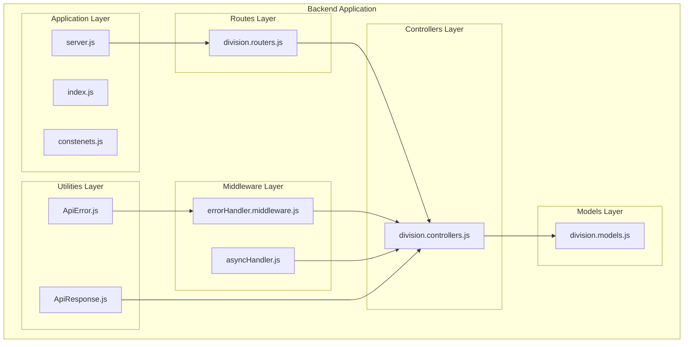
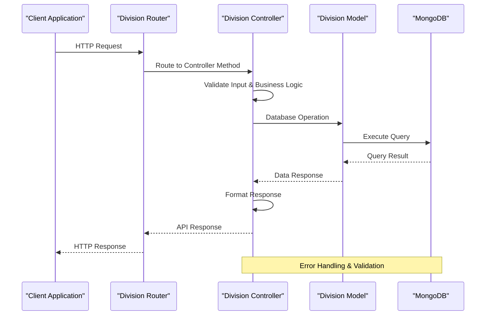
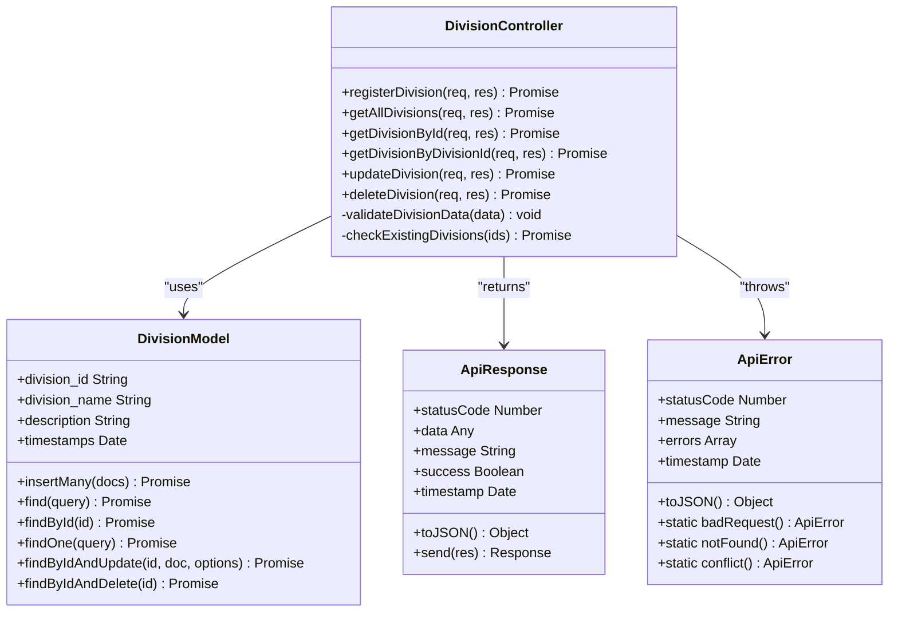
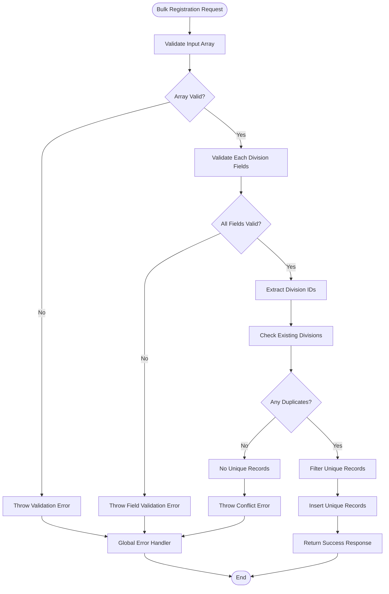
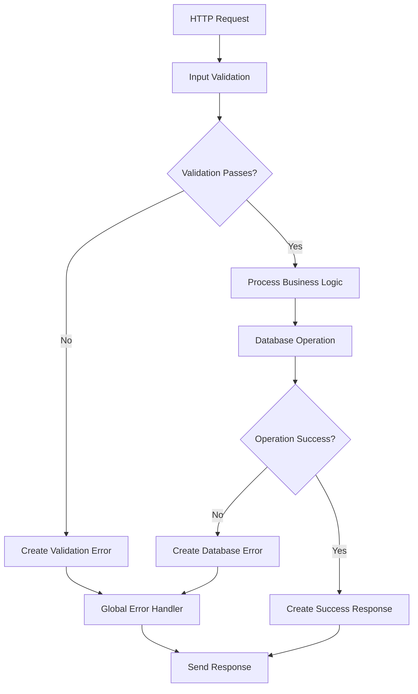

# Division Management Endpoints

<cite>
**Referenced Files in This Document**
- [division.controllers.js](file://Backend/src/controllers/division.controllers.js)
- [division.models.js](file://Backend/src/models/division.models.js)
- [division.routers.js](file://Backend/src/routes/division.routers.js)
- [server.js](file://Backend/src/server.js)
- [errorHandler.middleware.js](file://Backend/src/middlewares/errorHandler.middleware.js)
- [ApiError.js](file://Backend/src/utils/ApiError.js)
- [ApiResponse.js](file://Backend/src/utils/ApiResponse.js)
- [asyncHandler.js](file://Backend/src/utils/asyncHandler.js)
- [index.js](file://Backend/src/index.js)
- [constenets.js](file://Backend/src/constenets.js)
</cite>

## Table of Contents
1. [Introduction](#introduction)
2. [Project Structure](#project-structure)
3. [Core Components](#core-components)
4. [Architecture Overview](#architecture-overview)
5. [Detailed Component Analysis](#detailed-component-analysis)
6. [API Endpoints Specification](#api-endpoints-specification)
7. [Data Model Analysis](#data-model-analysis)
8. [Error Handling](#error-handling)
9. [Performance Considerations](#performance-considerations)
10. [Integration Guide](#integration-guide)
11. [Conclusion](#conclusion)

## Introduction

The Division Management Endpoints provide a comprehensive RESTful API for managing academic divisions within a timetable management system. This module enables organizations to register, retrieve, update, and delete division records while maintaining data integrity and providing robust error handling mechanisms.

The system follows modern Node.js best practices with Express.js framework, MongoDB/Mongoose for data persistence, and standardized API response/error formats. The division management functionality supports both individual record operations and bulk registration capabilities.

## Project Structure

The division management system is organized within the Backend/src architecture following a clean separation of concerns:



**Diagram sources**
- [division.controllers.js:1-123](file://Backend/src/controllers/division.controllers.js#L1-L123)
- [division.models.js:1-27](file://Backend/src/models/division.models.js#L1-L27)
- [division.routers.js:1-24](file://Backend/src/routes/division.routers.js#L1-L24)
- [server.js:1-106](file://Backend/src/server.js#L1-L106)

**Section sources**
- [division.controllers.js:1-123](file://Backend/src/controllers/division.controllers.js#L1-L123)
- [division.models.js:1-27](file://Backend/src/models/division.models.js#L1-L27)
- [division.routers.js:1-24](file://Backend/src/routes/division.routers.js#L1-L24)
- [server.js:1-106](file://Backend/src/server.js#L1-L106)

## Core Components

The division management system consists of several interconnected components that work together to provide comprehensive CRUD operations:

### Controller Functions
The controller layer implements six primary functions:
- **Bulk Registration**: Register multiple divisions in a single operation
- **Retrieval Operations**: Fetch all divisions or specific divisions by ID
- **Update Operations**: Modify existing division records
- **Deletion Operations**: Remove divisions from the database

### Model Definition
The division model defines the data structure with validation constraints and indexing for optimal performance.

### Route Configuration
RESTful routes provide standardized endpoints for all CRUD operations with appropriate HTTP methods and URL patterns.

### Middleware Integration
Global error handling and async operation management ensure consistent error responses and reliable operation execution.

**Section sources**
- [division.controllers.js:6-123](file://Backend/src/controllers/division.controllers.js#L6-L123)
- [division.models.js:3-24](file://Backend/src/models/division.models.js#L3-L24)
- [division.routers.js:13-21](file://Backend/src/routes/division.routers.js#L13-L21)

## Architecture Overview

The division management system follows a layered architecture pattern with clear separation between presentation, business logic, and data access layers:



**Diagram sources**
- [division.routers.js:13-21](file://Backend/src/routes/division.routers.js#L13-L21)
- [division.controllers.js:6-123](file://Backend/src/controllers/division.controllers.js#L6-L123)
- [division.models.js:1-27](file://Backend/src/models/division.models.js#L1-L27)

The architecture ensures:
- **Separation of Concerns**: Clear boundaries between routing, controller, and model layers
- **Reusability**: Shared utilities and middleware across all endpoints
- **Maintainability**: Modular design enabling easy updates and modifications
- **Scalability**: Asynchronous operation handling and efficient database queries

## Detailed Component Analysis

### Controller Implementation Analysis

The controller layer implements comprehensive business logic with robust validation and error handling:



**Diagram sources**
- [division.controllers.js:6-123](file://Backend/src/controllers/division.controllers.js#L6-L123)
- [division.models.js:3-26](file://Backend/src/models/division.models.js#L3-L26)
- [ApiResponse.js:5-74](file://Backend/src/utils/ApiResponse.js#L5-L74)
- [ApiError.js:5-80](file://Backend/src/utils/ApiError.js#L5-L80)

#### Bulk Registration Process

The bulk registration functionality processes arrays of division records with sophisticated duplicate detection:



**Diagram sources**
- [division.controllers.js:9-38](file://Backend/src/controllers/division.controllers.js#L9-L38)

#### Individual Record Operations

Each CRUD operation follows a consistent pattern with input validation, database interaction, and response formatting:

**Section sources**
- [division.controllers.js:6-123](file://Backend/src/controllers/division.controllers.js#L6-L123)

### Model Schema Analysis

The division model defines a comprehensive schema with validation constraints and indexing strategies:

| Field | Type | Required | Unique | Validation | Purpose |
|-------|------|----------|--------|------------|---------|
| division_id | String | Yes | Yes | Uppercase, Trimmed | Unique identifier for divisions |
| division_name | String | Yes | No | Uppercase, Trimmed | Human-readable division name |
| description | String | No | No | Trimmed | Additional division information |
| timestamps | Date | No | No | Automatic | Creation/update timestamps |

**Section sources**
- [division.models.js:3-24](file://Backend/src/models/division.models.js#L3-L24)

### Route Configuration Analysis

The routing system provides RESTful endpoints with appropriate HTTP methods and URL patterns:

| Endpoint | HTTP Method | Function | Description |
|----------|-------------|----------|-------------|
| `/api/v1/divisions` | POST | registerDivision | Bulk division registration |
| `/api/v1/divisions` | GET | getAllDivisions | Retrieve all divisions |
| `/api/v1/divisions/:id` | GET | getDivisionById | Get division by MongoDB ID |
| `/api/v1/divisions/:division_id` | GET | getDivisionByDivisionId | Get division by division ID |
| `/api/v1/divisions/:id` | PUT | updateDivision | Update existing division |
| `/api/v1/divisions/:id` | DELETE | deleteDivision | Delete division record |

**Section sources**
- [division.routers.js:13-21](file://Backend/src/routes/division.routers.js#L13-L21)

## API Endpoints Specification

### Base URL
`/api/v1/divisions`

### Authentication & Authorization
- **Authentication**: JWT token required for all endpoints
- **Authorization**: Admin privileges required for write operations
- **Headers**: `Authorization: Bearer <token>`, `Content-Type: application/json`

### Response Format
All responses follow a standardized format:

```javascript
{
  "success": boolean,
  "statusCode": number,
  "message": string,
  "data": any,
  "timestamp": string,
  "meta": object // Optional pagination metadata
}
```

### Error Response Format
```javascript
{
  "success": false,
  "statusCode": number,
  "message": string,
  "errors": array, // Validation errors
  "timestamp": string,
  "path": string,
  "method": string
}
```

### Endpoint Details

#### Bulk Division Registration
**Method**: POST  
**URL**: `/api/v1/divisions`  
**Request Body**: Array of division objects  
**Response**: 201 Created with registered division records

**Request Example**:
```json
[
  {
    "division_id": "DIV001",
    "division_name": "COMPUTER SCIENCE",
    "description": "Computer Science and Engineering Department"
  },
  {
    "division_id": "DIV002", 
    "division_name": "ELECTRICAL",
    "description": "Electrical Engineering Department"
  }
]
```

**Response Example**:
```json
{
  "success": true,
  "statusCode": 201,
  "message": "Divisions registered successfully",
  "data": [...],
  "timestamp": "2024-01-01T00:00:00Z"
}
```

#### Get All Divisions
**Method**: GET  
**URL**: `/api/v1/divisions`  
**Response**: 200 OK with all division records

#### Get Division by MongoDB ID
**Method**: GET  
**URL**: `/api/v1/divisions/:id`  
**Parameters**: `id` (MongoDB ObjectId)  
**Response**: 200 OK with division record

#### Get Division by Division ID
**Method**: GET  
**URL**: `/api/v1/divisions/:division_id`  
**Parameters**: `division_id` (String)  
**Response**: 200 OK with division record

#### Update Division
**Method**: PUT  
**URL**: `/api/v1/divisions/:id`  
**Parameters**: `id` (MongoDB ObjectId)  
**Request Body**: Partial division object  
**Response**: 200 OK with updated division

#### Delete Division
**Method**: DELETE  
**URL**: `/api/v1/divisions/:id`  
**Parameters**: `id` (MongoDB ObjectId)  
**Response**: 200 OK with deleted division

**Section sources**
- [division.routers.js:13-21](file://Backend/src/routes/division.routers.js#L13-L21)
- [division.controllers.js:6-123](file://Backend/src/controllers/division.controllers.js#L6-L123)

## Data Model Analysis

### Database Schema Design

The division model utilizes MongoDB with Mongoose ODM for schema definition and validation:

```mermaid
erDiagram
DIVISION {
string _id PK
string division_id UK
string division_name
string description
date createdAt
date updatedAt
}
INDEXES {
"division_id": "unique_index"
"_id": "primary_key"
}
DIVISION ||--|| INDEXES : "has"
```

**Diagram sources**
- [division.models.js:3-24](file://Backend/src/models/division.models.js#L3-L24)

### Validation Rules

| Field | Validation Rule | Error Message | Purpose |
|-------|----------------|---------------|---------|
| division_id | Required, Unique, Uppercase, Trimmed | "Division ID is required" | Ensures unique identification |
| division_name | Required, Uppercase, Trimmed | "Division Name is required" | Human-readable identifier |
| description | Optional, Trimmed | N/A | Additional information storage |

### Indexing Strategy

The system implements strategic indexing for optimal query performance:
- **Unique Index**: `division_id` for fast lookups and uniqueness enforcement
- **Automatic Timestamps**: `createdAt` and `updatedAt` for audit trails

**Section sources**
- [division.models.js:3-24](file://Backend/src/models/division.models.js#L3-L24)

## Error Handling

### Error Types and Status Codes

The system implements comprehensive error handling with standardized responses:

| Error Type | HTTP Status | Error Code | Description |
|------------|-------------|------------|-------------|
| Validation Error | 400 | BAD_REQUEST | Input validation failures |
| Not Found | 404 | NOT_FOUND | Division not found |
| Conflict | 409 | CONFLICT | Duplicate division ID |
| Internal Error | 500 | INTERNAL_ERROR | Server-side failures |
| Unauthorized | 401 | UNAUTHORIZED | Invalid or missing authentication |

### Error Response Structure

All errors follow a consistent format with additional context information:

```javascript
{
  "success": false,
  "statusCode": 400,
  "message": "Division ID is required",
  "errors": [
    {
      "field": "division_id",
      "message": "Division ID is required"
    }
  ],
  "timestamp": "2024-01-01T00:00:00Z",
  "path": "/api/v1/divisions",
  "method": "POST"
}
```

### Error Handling Flow



**Diagram sources**
- [errorHandler.middleware.js:7-72](file://Backend/src/middlewares/errorHandler.middleware.js#L7-L72)
- [ApiError.js:5-80](file://Backend/src/utils/ApiError.js#L5-L80)

**Section sources**
- [errorHandler.middleware.js:7-86](file://Backend/src/middlewares/errorHandler.middleware.js#L7-L86)
- [ApiError.js:5-80](file://Backend/src/utils/ApiError.js#L5-L80)

## Performance Considerations

### Database Optimization

The system implements several performance optimization strategies:

1. **Bulk Operations**: Efficient bulk insertion for multiple division registration
2. **Duplicate Detection**: Pre-check for existing records to avoid unnecessary operations
3. **Indexing Strategy**: Strategic indexing on frequently queried fields
4. **Connection Pooling**: Optimized database connection management

### Memory Management

- **Streaming Responses**: Large dataset responses are handled efficiently
- **Object Reuse**: Response objects are reused to minimize memory allocation
- **Garbage Collection**: Proper cleanup of temporary objects

### Scalability Features

- **Asynchronous Operations**: Non-blocking database operations
- **Connection Limits**: Configurable connection pooling
- **Error Recovery**: Automatic retry mechanisms for transient failures

## Integration Guide

### Frontend Integration

To integrate with the division management API, implement the following patterns:

#### Basic Integration Pattern
```javascript
// Division API Client
class DivisionAPIClient {
  constructor(baseURL, token) {
    this.baseURL = baseURL;
    this.token = token;
  }
  
  async registerDivisions(divisions) {
    const response = await fetch(`${this.baseURL}/divisions`, {
      method: 'POST',
      headers: {
        'Authorization': `Bearer ${this.token}`,
        'Content-Type': 'application/json'
      },
      body: JSON.stringify(divisions)
    });
    
    return response.json();
  }
  
  async getDivisions() {
    const response = await fetch(`${this.baseURL}/divisions`, {
      headers: {
        'Authorization': `Bearer ${this.token}`
      }
    });
    
    return response.json();
  }
}
```

#### Error Handling Integration
```javascript
try {
  const result = await divisionClient.registerDivisions(divisions);
  if (result.success) {
    // Handle successful registration
    console.log('Divisions registered:', result.data);
  }
} catch (error) {
  // Handle network errors
  console.error('Registration failed:', error.message);
}
```

### Backend Integration

For backend-to-backend integration, implement the following patterns:

#### Service Layer Integration
```javascript
// Division Service
class DivisionService {
  constructor(apiClient) {
    this.apiClient = apiClient;
  }
  
  async bulkRegister(divisions) {
    try {
      const result = await this.apiClient.registerDivisions(divisions);
      
      if (!result.success) {
        throw new Error(result.message);
      }
      
      return result.data;
    } catch (error) {
      throw new DivisionRegistrationError(
        `Failed to register divisions: ${error.message}`
      );
    }
  }
}
```

**Section sources**
- [division.routers.js:66](file://Backend/src/server.js#L66)

## Conclusion

The Division Management Endpoints provide a robust, scalable, and maintainable solution for managing academic divisions within a timetable management system. The implementation demonstrates excellent architectural principles with clear separation of concerns, comprehensive error handling, and standardized API responses.

Key strengths of the implementation include:

- **Comprehensive CRUD Operations**: Full support for all essential database operations
- **Robust Validation**: Multi-layered validation ensuring data integrity
- **Efficient Bulk Operations**: Optimized processing for multiple record operations
- **Standardized Responses**: Consistent API response format across all endpoints
- **Comprehensive Error Handling**: Structured error responses with meaningful context
- **Security Integration**: JWT-based authentication and authorization
- **Performance Optimization**: Strategic indexing and efficient database operations

The modular design enables easy maintenance and future enhancements while providing a solid foundation for the broader timetable management system.