# Enhanced Error Handling System

<cite>
**Referenced Files in This Document**
- [errorHandler.middleware.js](file://Backend/src/middlewares/errorHandler.middleware.js)
- [ApiError.js](file://Backend/src/utils/ApiError.js)
- [ApiResponse.js](file://Backend/src/utils/ApiResponse.js)
- [asyncHandler.js](file://Backend/src/utils/asyncHandler.js)
- [auth.middleware.js](file://Backend/src/middlewares/auth.middleware.js)
- [server.js](file://Backend/src/server.js)
- [user.controller.js](file://Backend/src/controllers/user.controller.js)
- [faculty.conteoller.js](file://Backend/src/controllers/faculty.conteoller.js)
- [student.controller.js](file://Backend/src/controllers/student.controller.js)
- [user.models.js](file://Backend/src/models/user.models.js)
- [student.models.js](file://Backend/src/models/student.models.js)
- [user.routers.js](file://Backend/src/routes/user.routers.js)
- [Token.js](file://Backend/src/utils/Token.js)
- [index.js](file://Backend/src/index.js)
- [package.json](file://Backend/package.json)
</cite>

## Table of Contents
1. [Introduction](#introduction)
2. [System Architecture](#system-architecture)
3. [Core Error Handling Components](#core-error-handling-components)
4. [Error Classification and Handling](#error-classification-and-handling)
5. [Middleware Integration](#middleware-integration)
6. [Controller Implementation Patterns](#controller-implementation-patterns)
7. [Authentication Error Handling](#authentication-error-handling)
8. [Model Validation Integration](#model-validation-integration)
9. [Error Response Standardization](#error-response-standardization)
10. [Development and Production Behavior](#development-and-production-behavior)
11. [Performance Considerations](#performance-considerations)
12. [Troubleshooting Guide](#troubleshooting-guide)
13. [Best Practices](#best-practices)
14. [Conclusion](#conclusion)

## Introduction

The Enhanced Error Handling System is a comprehensive error management framework designed for the Timetable Management Application backend. This system provides consistent, structured error responses across all API endpoints while maintaining security and developer productivity. The system integrates multiple layers of error handling including global error middleware, custom error classes, async handler wrappers, and authentication-specific error management.

The framework addresses common error scenarios in web applications including validation failures, database conflicts, authentication issues, authorization problems, and unexpected runtime errors. It ensures that all error responses follow a standardized format while providing appropriate context for both development and production environments.

## System Architecture

The error handling system follows a layered architecture pattern with clear separation of concerns:

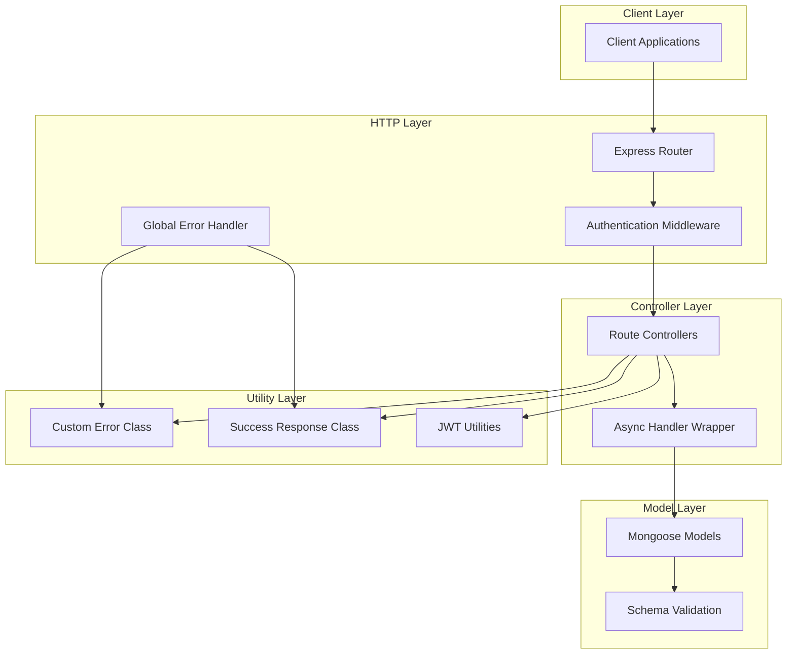

**Diagram sources**
- [server.js:1-106](file://Backend/src/server.js#L1-L106)
- [errorHandler.middleware.js:1-86](file://Backend/src/middlewares/errorHandler.middleware.js#L1-L86)
- [asyncHandler.js:1-47](file://Backend/src/utils/asyncHandler.js#L1-L47)

The architecture ensures that errors propagate consistently through the system while maintaining proper separation between error handling logic and business logic.

## Core Error Handling Components

### Custom Error Class (ApiError)

The `ApiError` class serves as the foundation for all error handling in the system. It extends JavaScript's native `Error` class and provides structured error responses with standardized properties.

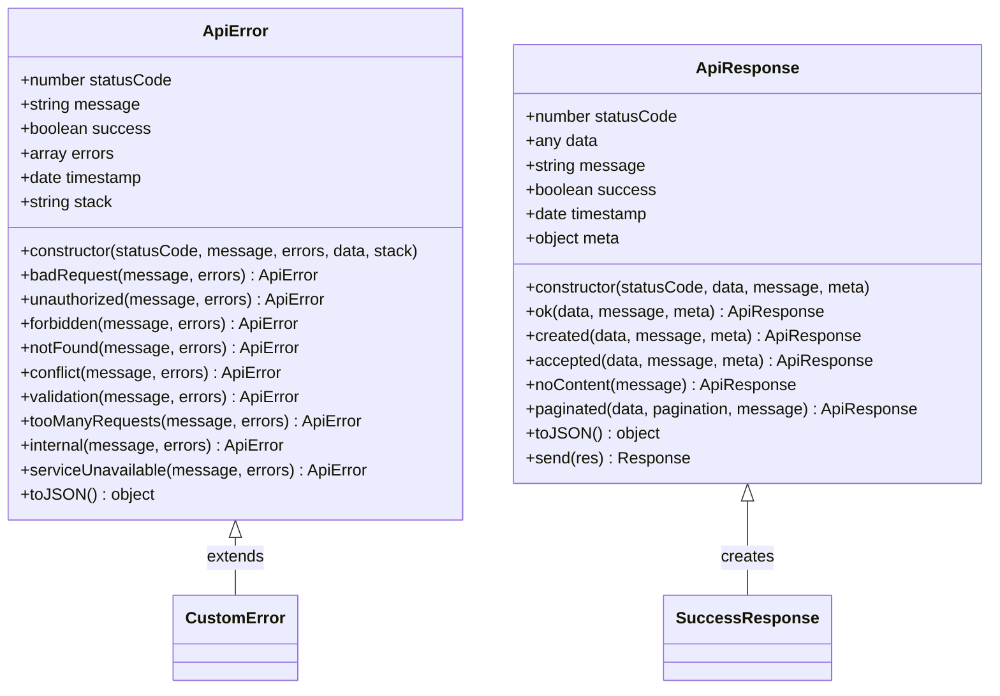

**Diagram sources**
- [ApiError.js:1-80](file://Backend/src/utils/ApiError.js#L1-L80)
- [ApiResponse.js:1-74](file://Backend/src/utils/ApiResponse.js#L1-L74)

The `ApiError` class provides static factory methods for common HTTP status codes, ensuring consistency across the application. Each error instance includes metadata such as timestamp, path, and method for comprehensive logging and debugging.

**Section sources**
- [ApiError.js:1-80](file://Backend/src/utils/ApiError.js#L1-L80)
- [ApiResponse.js:1-74](file://Backend/src/utils/ApiResponse.js#L1-L74)

### Async Handler Wrapper

The async handler wrapper eliminates the need for try-catch blocks in controllers by automatically catching asynchronous errors and passing them to the error handling middleware.

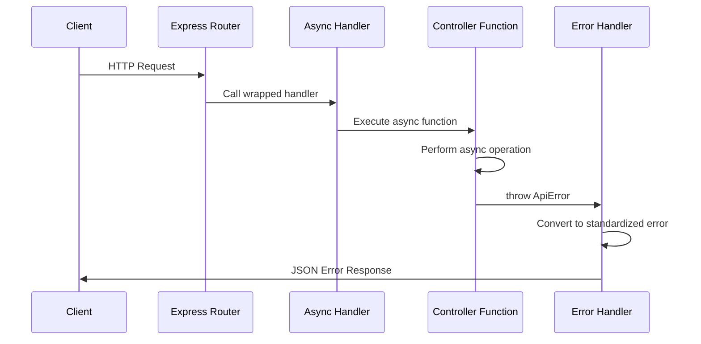

**Diagram sources**
- [asyncHandler.js:8-19](file://Backend/src/utils/asyncHandler.js#L8-L19)
- [user.controller.js:14-127](file://Backend/src/controllers/user.controller.js#L14-L127)

**Section sources**
- [asyncHandler.js:1-47](file://Backend/src/utils/asyncHandler.js#L1-L47)

## Error Classification and Handling

### Database Error Types

The system handles various types of database-related errors with specific handling strategies:

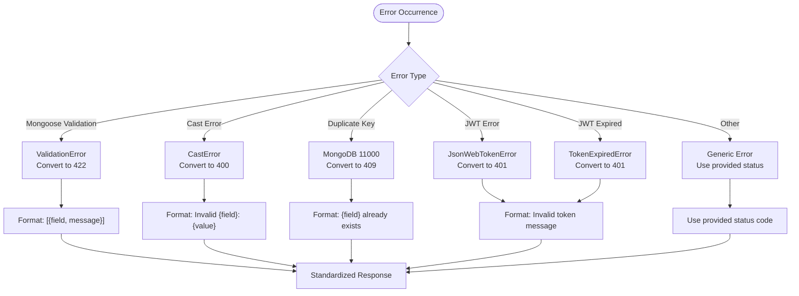

**Diagram sources**
- [errorHandler.middleware.js:16-41](file://Backend/src/middlewares/errorHandler.middleware.js#L16-L41)

**Section sources**
- [errorHandler.middleware.js:1-86](file://Backend/src/middlewares/errorHandler.middleware.js#L1-L86)

### HTTP Status Code Standards

The system maintains consistent HTTP status code usage across all endpoints:

| Error Type | Status Code | Purpose |
|------------|-------------|---------|
| Bad Request | 400 | Invalid input data, missing parameters |
| Unauthorized | 401 | Authentication failure, invalid tokens |
| Forbidden | 403 | Authorization denied, insufficient permissions |
| Not Found | 404 | Resource does not exist |
| Conflict | 409 | Resource conflicts, duplicate entries |
| Validation | 422 | Data validation failures |
| Too Many Requests | 429 | Rate limiting exceeded |
| Internal Error | 500 | Unexpected server errors |
| Service Unavailable | 503 | Temporary service unavailability |

**Section sources**
- [ApiError.js:28-63](file://Backend/src/utils/ApiError.js#L28-L63)

## Middleware Integration

### Global Error Handler

The global error handler middleware serves as the final line of defense for error processing in the application:

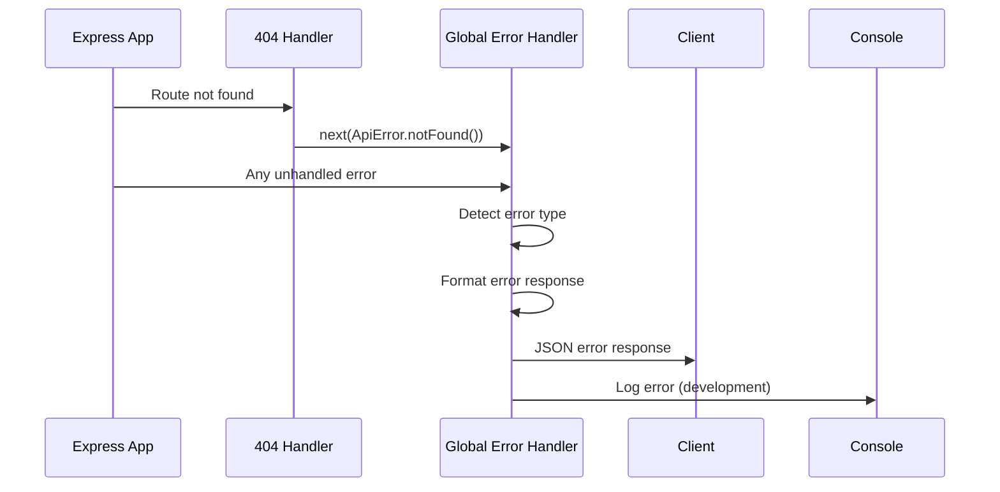

**Diagram sources**
- [server.js:99-103](file://Backend/src/server.js#L99-L103)
- [errorHandler.middleware.js:78-83](file://Backend/src/middlewares/errorHandler.middleware.js#L78-L83)

**Section sources**
- [server.js:1-106](file://Backend/src/server.js#L1-L106)
- [errorHandler.middleware.js:1-86](file://Backend/src/middlewares/errorHandler.middleware.js#L1-L86)

### Authentication Error Integration

Authentication middleware seamlessly integrates with the error handling system:

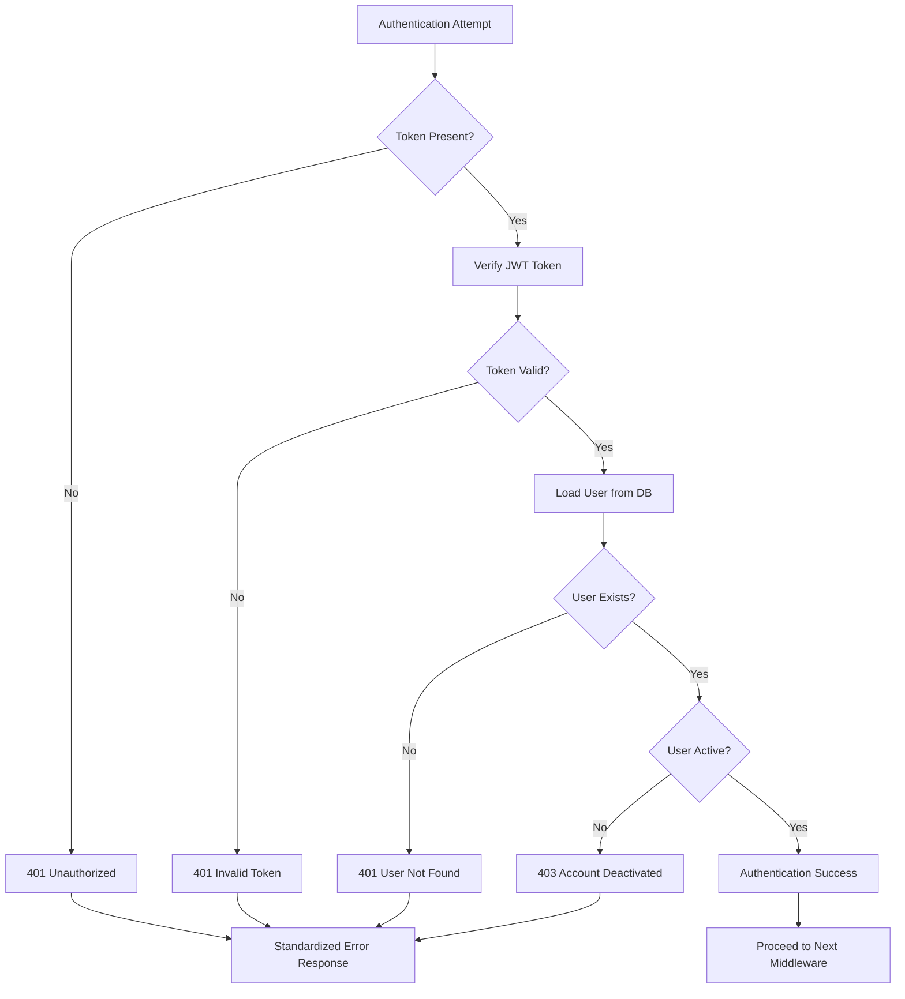

**Diagram sources**
- [auth.middleware.js:7-43](file://Backend/src/middlewares/auth.middleware.js#L7-L43)

**Section sources**
- [auth.middleware.js:1-120](file://Backend/src/middlewares/auth.middleware.js#L1-L120)

## Controller Implementation Patterns

### Consistent Error Throwing Pattern

Controllers implement a consistent pattern for error handling using the `ApiError` class:

```mermaid
flowchart TD
ControllerStart[Controller Function Entry] --> ValidateInput[Validate Input Parameters]
ValidateInput --> InputValid{Input Valid?}
InputValid --> |No| ThrowBadRequest[throw ApiError.badRequest()]
InputValid --> |Yes| ProcessBusinessLogic[Execute Business Logic]
ProcessBusinessLogic --> OperationSuccess{Operation Success?}
OperationSuccess --> |No| ThrowSpecificError[throw ApiError.specificType()]
OperationSuccess --> |Yes| ReturnSuccess[Return ApiResponse.ok()]
ThrowBadRequest --> ErrorHandler[Global Error Handler]
ThrowSpecificError --> ErrorHandler
ErrorHandler --> StandardizedResponse[Standardized Error Response]
ReturnSuccess --> SuccessResponse[Standardized Success Response]
```

**Diagram sources**
- [user.controller.js:14-127](file://Backend/src/controllers/user.controller.js#L14-L127)

**Section sources**
- [user.controller.js:1-576](file://Backend/src/controllers/user.controller.js#L1-L576)
- [faculty.conteoller.js:1-203](file://Backend/src/controllers/faculty.conteoller.js#L1-L203)
- [student.controller.js:1-202](file://Backend/src/controllers/student.controller.js#L1-L202)

### Bulk Operations Error Handling

Bulk operations implement specialized error handling for array-based data processing:

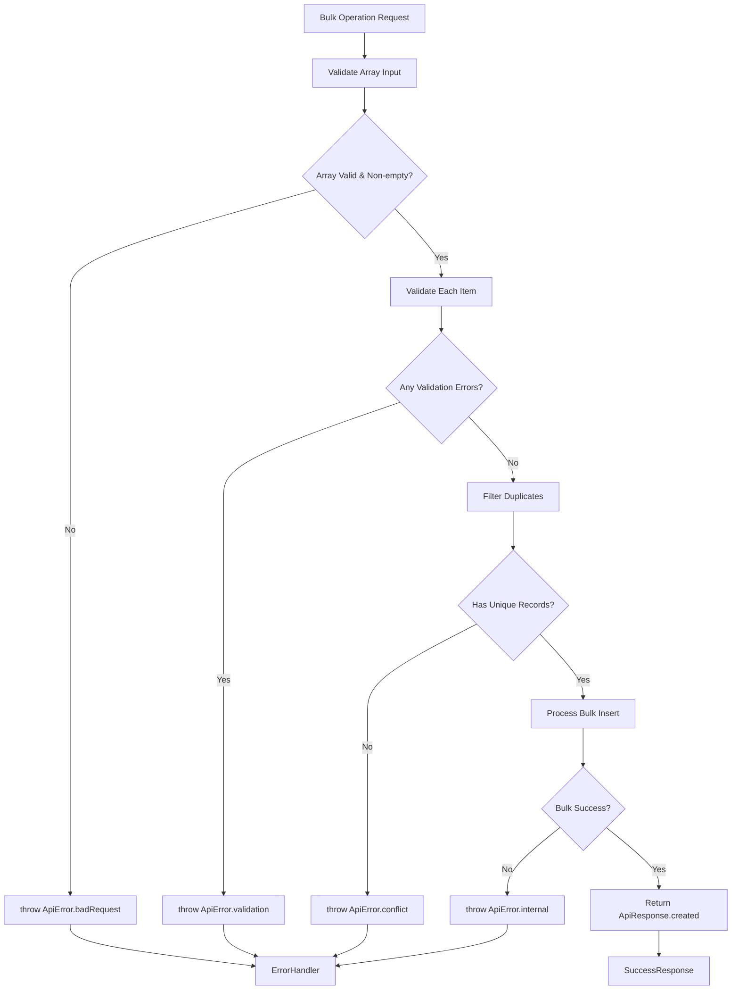

**Diagram sources**
- [user.controller.js:63-127](file://Backend/src/controllers/user.controller.js#L63-L127)

**Section sources**
- [user.controller.js:63-127](file://Backend/src/controllers/user.controller.js#L63-L127)

## Authentication Error Handling

### JWT Token Error Management

The authentication system handles JWT-related errors with specific error types:

| Error Scenario | Error Type | Status Code | Message |
|----------------|------------|-------------|---------|
| Missing Token | 401 Unauthorized | 401 | "Unauthorized request - No token provided" |
| Invalid Token | 401 Unauthorized | 401 | "Invalid or expired access token" |
| Expired Token | 401 Unauthorized | 401 | "Token expired. Please login again." |
| User Not Found | 401 Unauthorized | 401 | "User not found" |
| Insufficient Role | 403 Forbidden | 403 | "Role ({role}) is not allowed to access this resource" |

**Section sources**
- [auth.middleware.js:14-42](file://Backend/src/middlewares/auth.middleware.js#L14-L42)
- [Token.js:37-52](file://Backend/src/utils/Token.js#L37-L52)

### Role-Based Authorization Errors

The authorization middleware provides granular error handling for different role levels:

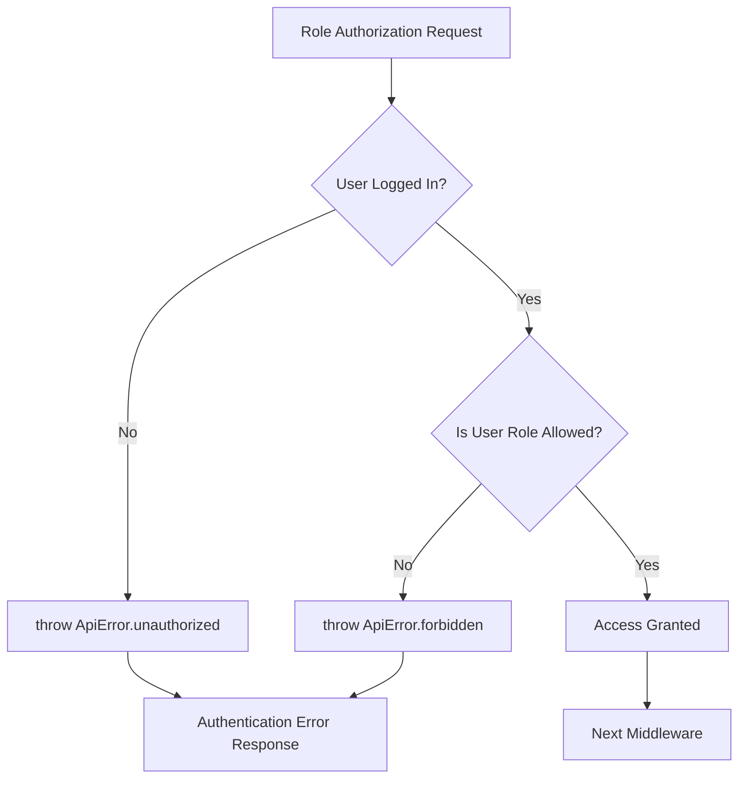

**Diagram sources**
- [auth.middleware.js:46-61](file://Backend/src/middlewares/auth.middleware.js#L46-L61)

**Section sources**
- [auth.middleware.js:46-91](file://Backend/src/middlewares/auth.middleware.js#L46-L91)

## Model Validation Integration

### Mongoose Schema Validation

The system leverages Mongoose schema validation to prevent invalid data from reaching controllers:

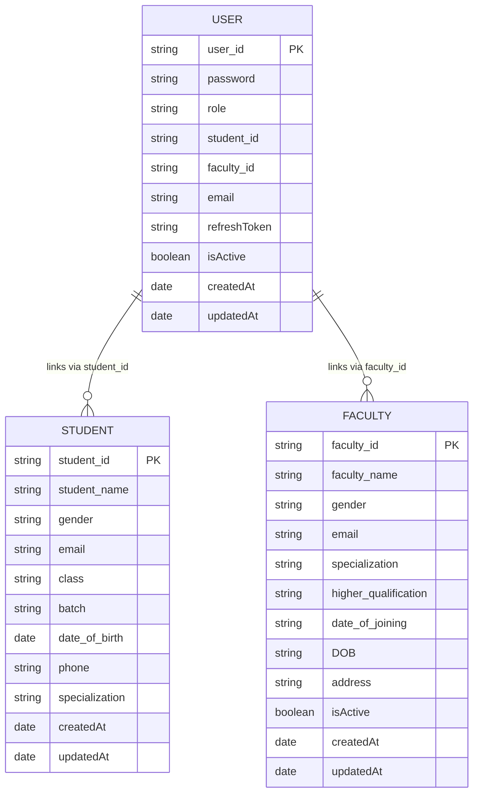

**Diagram sources**
- [user.models.js:4-79](file://Backend/src/models/user.models.js#L4-L79)
- [student.models.js:3-68](file://Backend/src/models/student.models.js#L3-L68)

**Section sources**
- [user.models.js:1-112](file://Backend/src/models/user.models.js#L1-L112)
- [student.models.js:1-71](file://Backend/src/models/student.models.js#L1-L71)

### Pre-Save Validation Hooks

Mongoose pre-save hooks provide automatic validation and data processing:

| Hook | Trigger | Validation | Processing |
|------|---------|------------|------------|
| Password Hashing | `pre("save")` | Length >= 6 characters | Hash with bcrypt |
| User ID Generation | `pre("save")` | New documents only | Generate STU_/FAC_ prefix |
| Email Validation | `pre("save")` | Regex pattern match | Normalize email format |

**Section sources**
- [user.models.js:82-109](file://Backend/src/models/user.models.js#L82-L109)

## Error Response Standardization

### Response Format Structure

All error responses follow a standardized JSON structure:

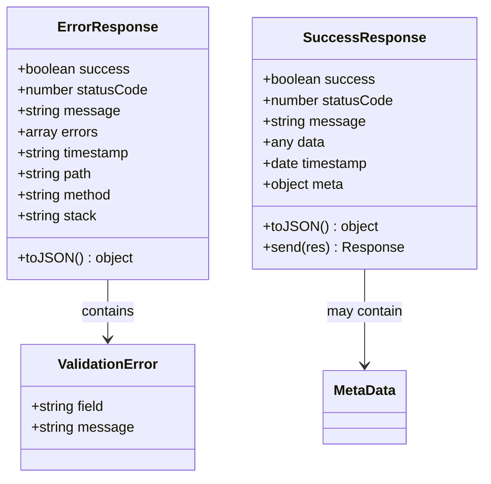

**Diagram sources**
- [errorHandler.middleware.js:44-56](file://Backend/src/middlewares/errorHandler.middleware.js#L44-L56)
- [ApiResponse.js:50-64](file://Backend/src/utils/ApiResponse.js#L50-L64)

### Development vs Production Behavior

The system adapts error response content based on environment:

| Environment | Stack Trace | Debug Information | Error Details |
|-------------|-------------|-------------------|---------------|
| Development | Included | Full error details | Complete stack trace |
| Production | Hidden | Minimal information | Generic error messages |

**Section sources**
- [errorHandler.middleware.js:58-69](file://Backend/src/middlewares/errorHandler.middleware.js#L58-L69)

## Development and Production Behavior

### Environment Configuration

The error handling system respects environment-specific configurations:

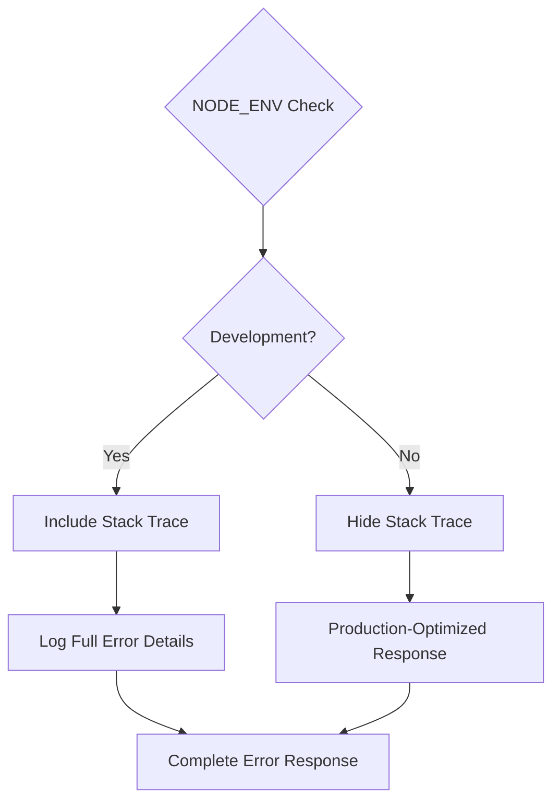

**Diagram sources**
- [errorHandler.middleware.js:58-69](file://Backend/src/middlewares/errorHandler.middleware.js#L58-L69)

**Section sources**
- [errorHandler.middleware.js:58-69](file://Backend/src/middlewares/errorHandler.middleware.js#L58-L69)

### Logging and Monitoring

The system provides comprehensive logging capabilities for debugging and monitoring:

| Log Level | Information Included | Use Case |
|-----------|---------------------|----------|
| Error | Full stack trace, request context | Debugging, error analysis |
| Warning | Error summary, affected endpoints | Performance monitoring |
| Info | Successful operations, response times | System health monitoring |

## Performance Considerations

### Error Handler Optimization

The error handling system is designed for minimal performance impact:

- **Early Error Detection**: Errors are caught and processed as early as possible in the request lifecycle
- **Memory Efficiency**: Error objects are lightweight and don't retain unnecessary data
- **Response Time**: Error responses are generated quickly without additional database queries
- **Logging Overhead**: Development logging is optimized to minimize performance impact

### Caching Strategies

The system benefits from Express caching mechanisms:

- **Static Content**: Compression middleware reduces response sizes
- **API Responses**: Consistent error formats enable efficient client-side error handling
- **Database Queries**: Proper error handling prevents cascading failures that could impact performance

## Troubleshooting Guide

### Common Error Scenarios and Solutions

| Error Type | Symptoms | Solution |
|------------|----------|----------|
| 400 Bad Request | Invalid input validation errors | Check request payload format |
| 401 Unauthorized | Authentication failures | Verify JWT token validity |
| 403 Forbidden | Authorization denied | Check user role permissions |
| 404 Not Found | Resource not found | Verify resource ID and URL |
| 409 Conflict | Data conflicts | Check for duplicate entries |
| 500 Internal Error | Unexpected server errors | Review server logs and error traces |

### Debugging Techniques

1. **Enable Development Mode**: Set `NODE_ENV=development` for detailed error information
2. **Check Request Context**: Review error objects for path and method information
3. **Database Validation**: Verify Mongoose schema validation rules
4. **Authentication Flow**: Trace JWT token lifecycle and verification steps

**Section sources**
- [errorHandler.middleware.js:62-68](file://Backend/src/middlewares/errorHandler.middleware.js#L62-L68)

### Error Recovery Strategies

The system implements graceful degradation for error recovery:

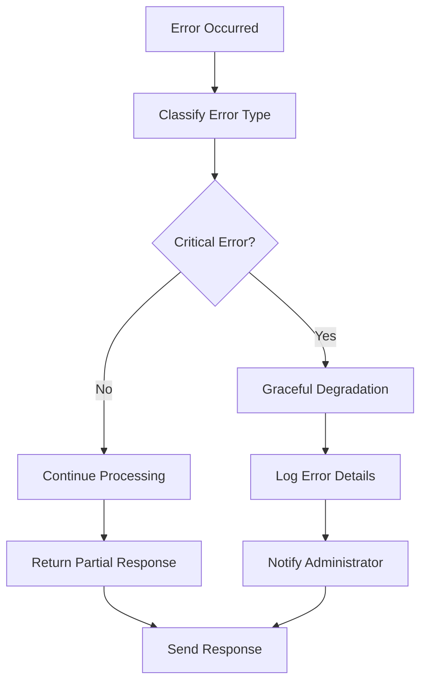

## Best Practices

### Error Handling Guidelines

1. **Consistent Error Throwing**: Always use `ApiError` class for error responses
2. **Descriptive Messages**: Provide clear, actionable error messages
3. **Proper Status Codes**: Use appropriate HTTP status codes for different error types
4. **Input Validation**: Validate all input data before processing
5. **Security Considerations**: Never expose sensitive error information in production

### Controller Implementation Standards

1. **Async Handler Usage**: Wrap all controller functions with `asyncHandler`
2. **Error Specificity**: Use specific error types for different scenarios
3. **Response Consistency**: Always return `ApiResponse` instances for successful operations
4. **Input Validation**: Validate inputs before database operations
5. **Transaction Safety**: Use transaction-aware async handlers for complex operations

### Middleware Integration Patterns

1. **Order Matters**: Place error handlers after all routes and middleware
2. **Specific to General**: Place specific error handlers before generic ones
3. **Context Preservation**: Ensure error objects maintain request context
4. **Environment Awareness**: Adapt behavior based on deployment environment

## Conclusion

The Enhanced Error Handling System provides a robust, scalable foundation for error management in the Timetable Management Application. By implementing standardized error responses, comprehensive error classification, and seamless integration with authentication and validation systems, the framework ensures consistent user experiences while maintaining developer productivity.

Key strengths of the system include:

- **Consistency**: Standardized error responses across all API endpoints
- **Security**: Appropriate error information disclosure based on environment
- **Maintainability**: Clear separation of concerns and reusable error handling components
- **Scalability**: Efficient error processing with minimal performance impact
- **Developer Experience**: Comprehensive logging and debugging capabilities

The system successfully addresses common web application error scenarios while providing extensibility for future enhancements. Its modular design allows for easy maintenance and updates as the application evolves.