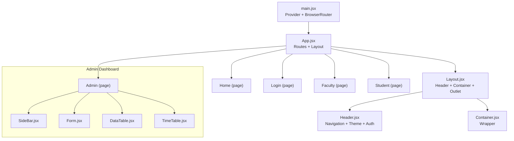
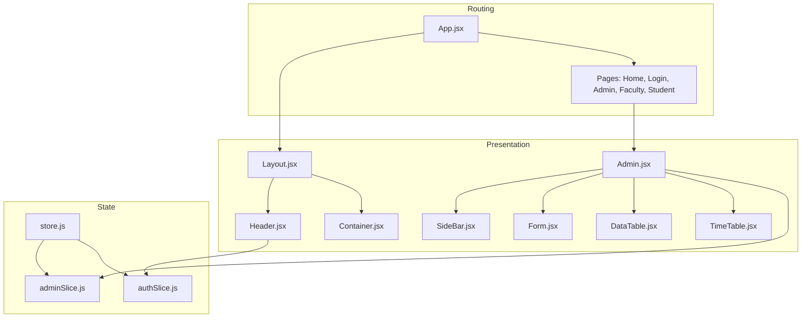
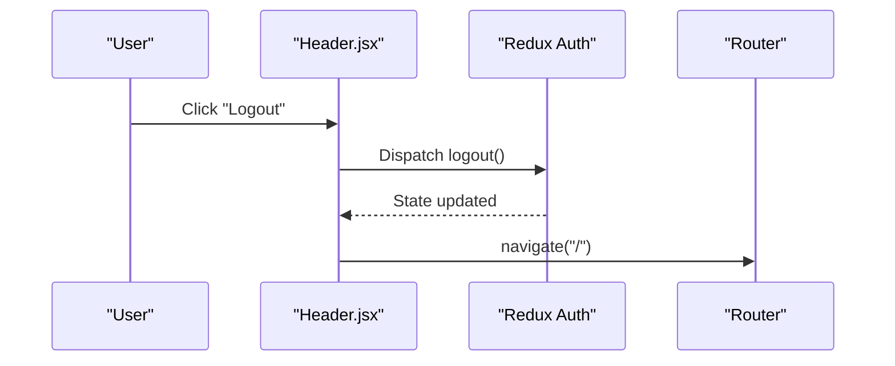
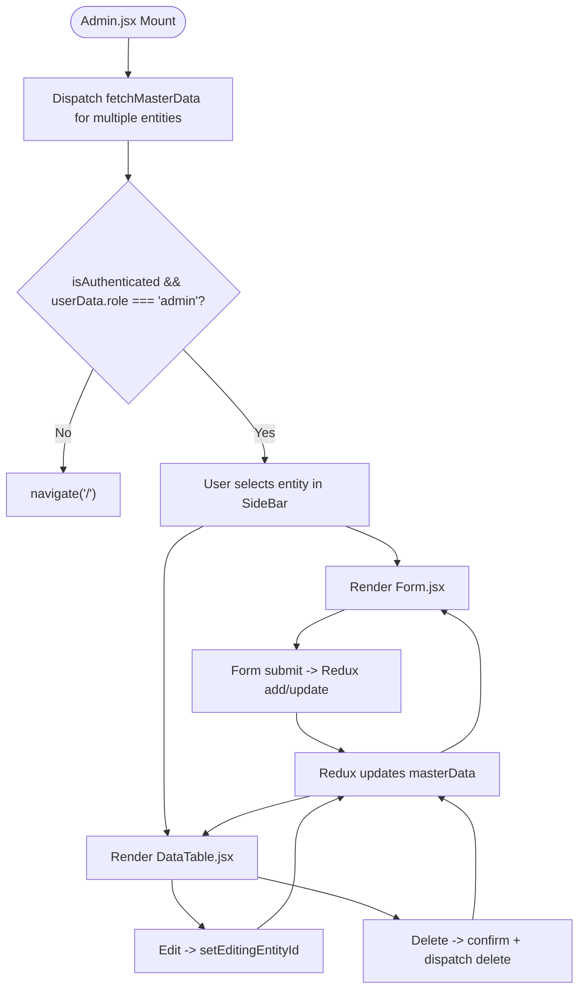
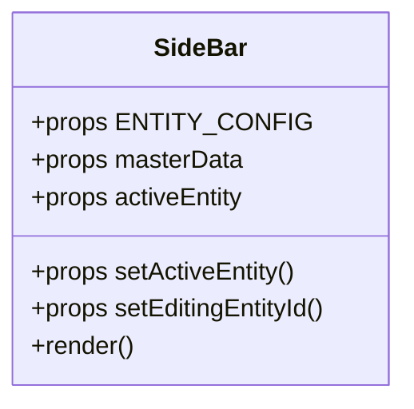
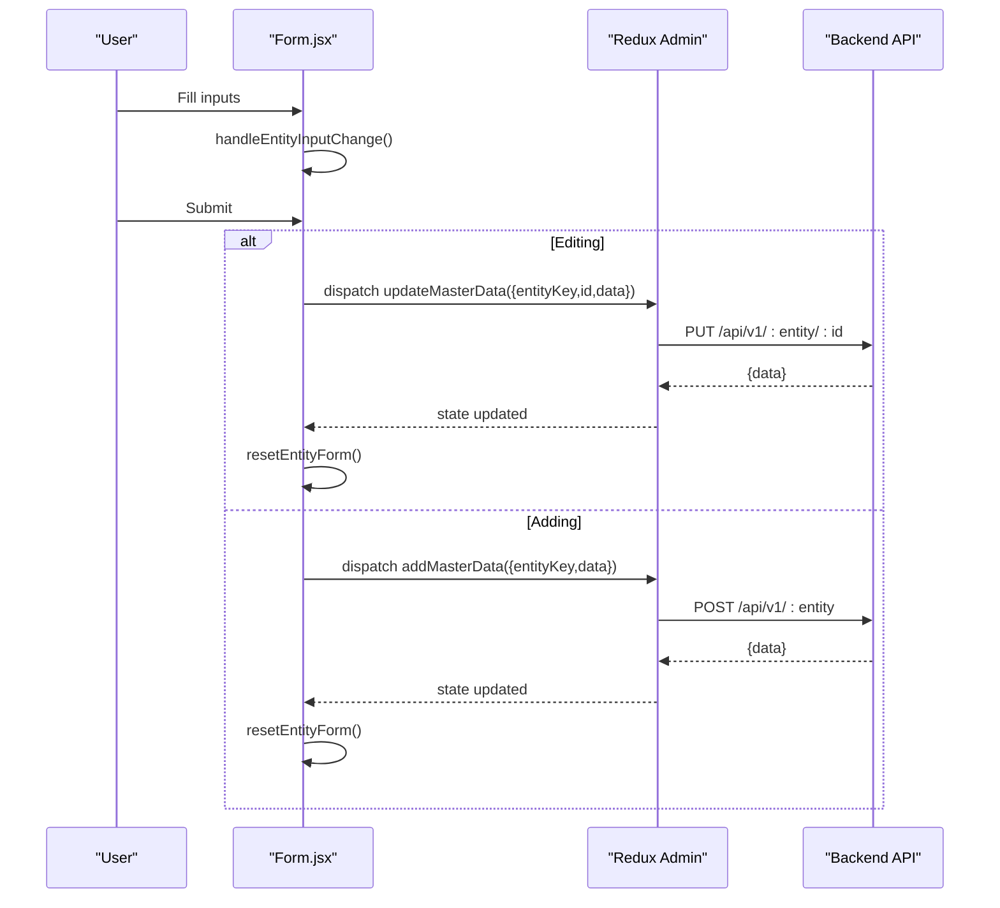
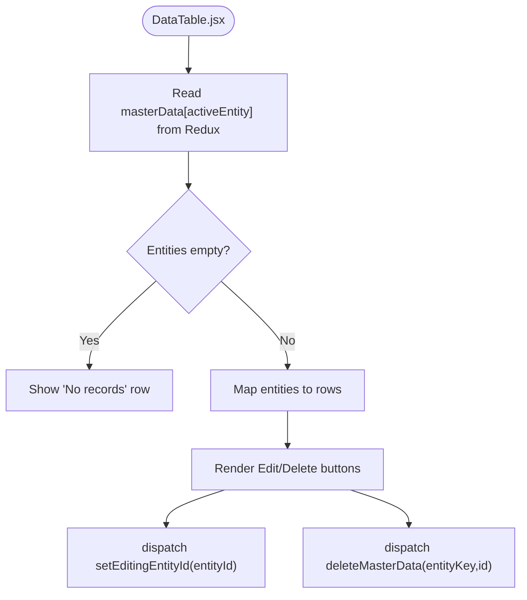
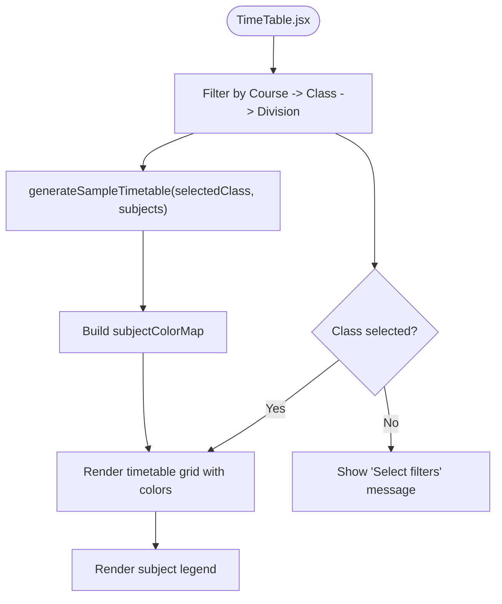
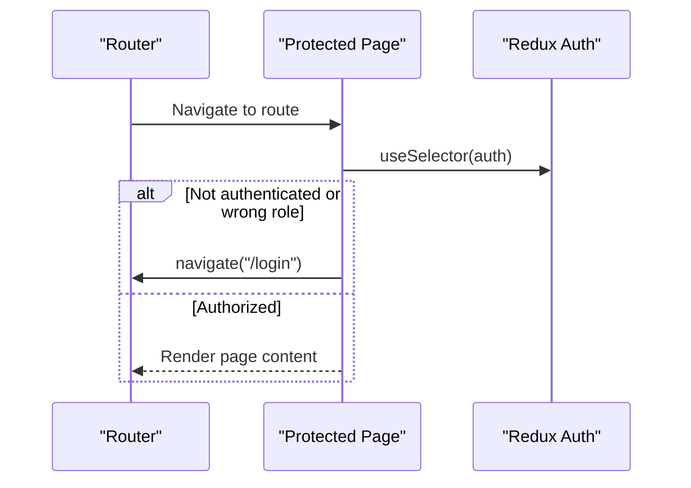
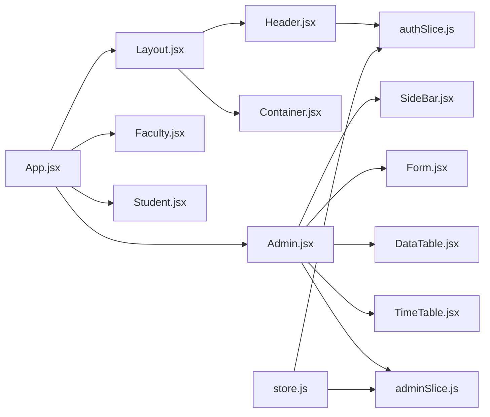

# Component Hierarchy & Structure

<cite>
**Referenced Files in This Document**
- [App.jsx](file://Client/src/App.jsx)
- [main.jsx](file://Client/src/main.jsx)
- [Layout.jsx](file://Client/src/components/Layout.jsx)
- [Header.jsx](file://Client/src/components/Header.jsx)
- [Container.jsx](file://Client/src/components/Container.jsx)
- [SideBar.jsx](file://Client/src/components/deshboard/SideBar.jsx)
- [DataTable.jsx](file://Client/src/components/deshboard/DataTable.jsx)
- [Form.jsx](file://Client/src/components/deshboard/Form.jsx)
- [TimeTable.jsx](file://Client/src/components/deshboard/TimeTable.jsx)
- [Admin.jsx](file://Client/src/pages/dashboard/Admin.jsx)
- [Faculty.jsx](file://Client/src/pages/dashboard/Faculty.jsx)
- [Student.jsx](file://Client/src/pages/dashboard/Student.jsx)
- [store.js](file://Client/src/store/store.js)
- [adminSlice.js](file://Client/src/store/admin/adminSlice.js)
- [authSlice.js](file://Client/src/store/auth/authSlice.js)
</cite>

## Table of Contents
1. [Introduction](#introduction)
2. [Project Structure](#project-structure)
3. [Core Components](#core-components)
4. [Architecture Overview](#architecture-overview)
5. [Detailed Component Analysis](#detailed-component-analysis)
6. [Dependency Analysis](#dependency-analysis)
7. [Performance Considerations](#performance-considerations)
8. [Troubleshooting Guide](#troubleshooting-guide)
9. [Conclusion](#conclusion)

## Introduction
This document explains the React component hierarchy and structure of the Timetable Project’s client application. It focuses on the root-to-UI component flow, the layout system, and the dashboard components. It also covers component composition patterns, prop passing strategies, state sharing via Redux, lifecycle management, event handling, conditional rendering, and dynamic component loading based on user roles.

## Project Structure
The client app is bootstrapped with React and Redux, and routed with react-router. The routing defines top-level pages and nested layouts. The layout composes a global header and a container that renders page-specific content.

**Diagram sources**
- [main.jsx:1-18](file://Client/src/main.jsx#L1-L18)
- [App.jsx:13-38](file://Client/src/App.jsx#L13-L38)
- [Layout.jsx:7-20](file://Client/src/components/Layout.jsx#L7-L20)
- [Header.jsx:8-121](file://Client/src/components/Header.jsx#L8-L121)
- [Container.jsx:3-5](file://Client/src/components/Container.jsx#L3-L5)
- [Admin.jsx:17-614](file://Client/src/pages/dashboard/Admin.jsx#L17-L614)
- [SideBar.jsx:3-48](file://Client/src/components/deshboard/SideBar.jsx#L3-L48)
- [Form.jsx:5-126](file://Client/src/components/deshboard/Form.jsx#L5-L126)
- [DataTable.jsx:5-85](file://Client/src/components/deshboard/DataTable.jsx#L5-L85)
- [TimeTable.jsx:62-367](file://Client/src/components/deshboard/TimeTable.jsx#L62-L367)

**Section sources**
- [main.jsx:1-18](file://Client/src/main.jsx#L1-L18)
- [App.jsx:13-38](file://Client/src/App.jsx#L13-L38)
- [Layout.jsx:7-20](file://Client/src/components/Layout.jsx#L7-L20)
- [Header.jsx:8-121](file://Client/src/components/Header.jsx#L8-L121)
- [Container.jsx:3-5](file://Client/src/components/Container.jsx#L3-L5)

## Core Components
- Root and Routing
  - App.jsx defines routes and applies theme effects based on Redux state.
  - main.jsx wires Redux Provider and BrowserRouter around the app.
- Layout System
  - Layout.jsx wraps the page content with a theme-aware container and renders the outlet for nested routes.
  - Header.jsx provides navigation links, theme toggling, and authentication actions.
  - Container.jsx is a lightweight wrapper for consistent spacing and alignment.
- Dashboard Pages
  - Admin.jsx orchestrates master data CRUD, entity selection, and optional timetable view.
  - Faculty.jsx and Student.jsx enforce role-based access and redirect unauthorized users.

**Section sources**
- [App.jsx:13-38](file://Client/src/App.jsx#L13-L38)
- [main.jsx:9-17](file://Client/src/main.jsx#L9-L17)
- [Layout.jsx:7-20](file://Client/src/components/Layout.jsx#L7-L20)
- [Header.jsx:8-121](file://Client/src/components/Header.jsx#L8-L121)
- [Container.jsx:3-5](file://Client/src/components/Container.jsx#L3-L5)
- [Admin.jsx:17-614](file://Client/src/pages/dashboard/Admin.jsx#L17-L614)
- [Faculty.jsx:5-21](file://Client/src/pages/dashboard/Faculty.jsx#L5-L21)
- [Student.jsx:5-22](file://Client/src/pages/dashboard/Student.jsx#L5-L22)

## Architecture Overview
The app follows a layered architecture:
- Presentation Layer: App, Layout, Header, Container, and dashboard components.
- Business Logic Layer: Page components (Admin, Faculty, Student) orchestrate data fetching and navigation.
- Data Layer: Redux slices manage authentication, theme, and admin master data operations.
- Routing Layer: React Router v6 manages route nesting and outlet rendering.

**Diagram sources**
- [App.jsx:27-36](file://Client/src/App.jsx#L27-L36)
- [Layout.jsx:10-18](file://Client/src/components/Layout.jsx#L10-L18)
- [Header.jsx:10-18](file://Client/src/components/Header.jsx#L10-L18)
- [Admin.jsx:17-614](file://Client/src/pages/dashboard/Admin.jsx#L17-L614)
- [SideBar.jsx:3-48](file://Client/src/components/deshboard/SideBar.jsx#L3-L48)
- [Form.jsx:5-126](file://Client/src/components/deshboard/Form.jsx#L5-L126)
- [DataTable.jsx:5-85](file://Client/src/components/deshboard/DataTable.jsx#L5-L85)
- [TimeTable.jsx:62-367](file://Client/src/components/deshboard/TimeTable.jsx#L62-L367)
- [store.js:7-14](file://Client/src/store/store.js#L7-L14)
- [adminSlice.js:88-172](file://Client/src/store/admin/adminSlice.js#L88-L172)
- [authSlice.js:10-31](file://Client/src/store/auth/authSlice.js#L10-L31)

## Detailed Component Analysis

### Layout and Navigation System
- Layout.jsx
  - Applies theme class to the root element and renders Header, Container, and Outlet.
  - Uses Redux to read theme state.
- Header.jsx
  - Provides navigation links and handles theme toggle and logout/login actions.
  - Reads authentication state and redirects accordingly.
- Container.jsx
  - Minimal wrapper component for consistent layout spacing.

**Diagram sources**
- [Header.jsx:14-18](file://Client/src/components/Header.jsx#L14-L18)
- [authSlice.js:20-25](file://Client/src/store/auth/authSlice.js#L20-L25)

**Section sources**
- [Layout.jsx:7-20](file://Client/src/components/Layout.jsx#L7-L20)
- [Header.jsx:8-121](file://Client/src/components/Header.jsx#L8-L121)
- [Container.jsx:3-5](file://Client/src/components/Container.jsx#L3-L5)
- [authSlice.js:10-31](file://Client/src/store/auth/authSlice.js#L10-L31)

### Admin Dashboard Orchestration
- Admin.jsx
  - Loads master data for multiple entities on mount.
  - Enforces admin role access and redirects unauthenticated or non-admin users.
  - Defines ENTITY_CONFIG for all master entities and passes it to child components.
  - Toggles between master data view and timetable view via a boolean state.
  - Renders SideBar, Form, and DataTable for the active entity.
  - Integrates Excel upload button and delegates upload to Redux actions.

**Diagram sources**
- [Admin.jsx:28-44](file://Client/src/pages/dashboard/Admin.jsx#L28-L44)
- [Admin.jsx:408-424](file://Client/src/pages/dashboard/Admin.jsx#L408-L424)
- [Admin.jsx:437-548](file://Client/src/pages/dashboard/Admin.jsx#L437-L548)
- [adminSlice.js:24-78](file://Client/src/store/admin/adminSlice.js#L24-L78)

**Section sources**
- [Admin.jsx:17-614](file://Client/src/pages/dashboard/Admin.jsx#L17-L614)
- [adminSlice.js:88-172](file://Client/src/store/admin/adminSlice.js#L88-L172)

### SideBar.jsx
- Purpose: Entity navigation and selection.
- Props: ENTITY_CONFIG, masterData, activeEntity, setActiveEntity, setEditingEntityId.
- Behavior: Builds a list of master entities from ENTITY_CONFIG, shows counts from masterData, and sets activeEntity on click.

**Diagram sources**
- [SideBar.jsx:3-48](file://Client/src/components/deshboard/SideBar.jsx#L3-L48)

**Section sources**
- [SideBar.jsx:3-48](file://Client/src/components/deshboard/SideBar.jsx#L3-L48)

### Form.jsx
- Purpose: Dynamic CRUD form for the active entity.
- Props: currentEntityConfig, activeEntity.
- State: local entityForm derived from Redux masterData when editing.
- Events: handles input changes, submits either add or update, resets form after success.

**Diagram sources**
- [Form.jsx:12-50](file://Client/src/components/deshboard/Form.jsx#L12-L50)
- [adminSlice.js:38-78](file://Client/src/store/admin/adminSlice.js#L38-L78)

**Section sources**
- [Form.jsx:5-126](file://Client/src/components/deshboard/Form.jsx#L5-L126)
- [adminSlice.js:88-172](file://Client/src/store/admin/adminSlice.js#L88-L172)

### DataTable.jsx
- Purpose: List existing entities with edit/delete actions.
- Props: currentEntityConfig, activeEntity.
- Behavior: Reads masterData from Redux, renders a table with dynamic headers, and triggers edit/delete actions via Redux.

**Diagram sources**
- [DataTable.jsx:5-85](file://Client/src/components/deshboard/DataTable.jsx#L5-L85)
- [adminSlice.js:67-78](file://Client/src/store/admin/adminSlice.js#L67-L78)

**Section sources**
- [DataTable.jsx:5-85](file://Client/src/components/deshboard/DataTable.jsx#L5-L85)
- [adminSlice.js:104-167](file://Client/src/store/admin/adminSlice.js#L104-L167)

### TimeTable.jsx
- Purpose: Visualize timetable for selected class/division/course filters.
- Props: onClose (optional callback to return to dashboard).
- State: selectedClass, selectedCourse, selectedDivision.
- Behavior: Generates a grid with days and time slots, assigns subject colors, and displays legend.

**Diagram sources**
- [TimeTable.jsx:62-367](file://Client/src/components/deshboard/TimeTable.jsx#L62-L367)

**Section sources**
- [TimeTable.jsx:62-367](file://Client/src/components/deshboard/TimeTable.jsx#L62-L367)

### Role-Based Conditional Rendering and Access Control
- Faculty.jsx and Student.jsx check authentication and role, redirecting to login if unauthorized.
- Admin.jsx enforces admin role and redirects otherwise.

**Diagram sources**
- [Faculty.jsx:10-14](file://Client/src/pages/dashboard/Faculty.jsx#L10-L14)
- [Student.jsx:10-14](file://Client/src/pages/dashboard/Student.jsx#L10-L14)
- [authSlice.js:10-31](file://Client/src/store/auth/authSlice.js#L10-L31)

**Section sources**
- [Faculty.jsx:5-21](file://Client/src/pages/dashboard/Faculty.jsx#L5-L21)
- [Student.jsx:5-22](file://Client/src/pages/dashboard/Student.jsx#L5-L22)
- [authSlice.js:10-31](file://Client/src/store/auth/authSlice.js#L10-L31)

## Dependency Analysis
- Component Dependencies
  - App.jsx depends on Layout and page components.
  - Layout.jsx depends on Header and Container and uses Outlet for nested rendering.
  - Admin.jsx depends on SideBar, Form, DataTable, TimeTable, and Redux slices.
  - Header.jsx depends on Redux for theme and auth state.
- Redux Store
  - store.js composes auth, theme, admin, and form reducers.
  - adminSlice.js manages master data CRUD via async thunks and exposes actions.
  - authSlice.js manages authentication state and persistence.

**Diagram sources**
- [App.jsx:27-36](file://Client/src/App.jsx#L27-L36)
- [Layout.jsx:10-18](file://Client/src/components/Layout.jsx#L10-L18)
- [Header.jsx:10-18](file://Client/src/components/Header.jsx#L10-L18)
- [Admin.jsx:17-614](file://Client/src/pages/dashboard/Admin.jsx#L17-L614)
- [store.js:7-14](file://Client/src/store/store.js#L7-L14)
- [adminSlice.js:88-172](file://Client/src/store/admin/adminSlice.js#L88-L172)
- [authSlice.js:10-31](file://Client/src/store/auth/authSlice.js#L10-L31)

**Section sources**
- [store.js:7-14](file://Client/src/store/store.js#L7-L14)
- [adminSlice.js:88-172](file://Client/src/store/admin/adminSlice.js#L88-L172)
- [authSlice.js:10-31](file://Client/src/store/auth/authSlice.js#L10-L31)

## Performance Considerations
- Memoization
  - TimeTable.jsx uses useMemo for subjectColorMap, filteredClasses, filteredDivisions, and timetableData to avoid unnecessary recalculations.
- Conditional Rendering
  - Admin.jsx conditionally renders TimeTable vs. master data forms to reduce DOM and computation overhead.
- Lazy Loading
  - Consider code-splitting routes for heavy pages (e.g., Admin) to improve initial load performance.
- Event Handling
  - Prefer stable callbacks via useCallback for handlers passed to child components to prevent re-renders.
- CSS Classes
  - Use Tailwind utilities consistently to minimize custom CSS and keep styles predictable.

[No sources needed since this section provides general guidance]

## Troubleshooting Guide
- Theme Toggle Not Persisting
  - Verify theme state updates and localStorage writes in App.jsx and theme toggle handler in Header.jsx.
- Unauthorized Access
  - Confirm authSlice persists authentication and that protected pages check role and redirect appropriately.
- Master Data Not Loading
  - Check adminSlice async thunks and ENTITY_ENDPOINTS mapping; ensure backend responds with expected shape.
- Edit/Delete Failures
  - Inspect Redux error handling and confirm IDs match backend expectations.

**Section sources**
- [App.jsx:16-24](file://Client/src/App.jsx#L16-L24)
- [Header.jsx:25-28](file://Client/src/components/Header.jsx#L25-L28)
- [authSlice.js:14-25](file://Client/src/store/auth/authSlice.js#L14-L25)
- [adminSlice.js:24-78](file://Client/src/store/admin/adminSlice.js#L24-L78)

## Conclusion
The application employs a clean component hierarchy with a robust layout system and a centralized Redux store. Admin.jsx orchestrates master data operations and optional timetable visualization, while role-based pages enforce access control. The dashboard components are reusable and driven by configuration, enabling easy extension to new entities. Adopting memoization and code splitting will further enhance performance.