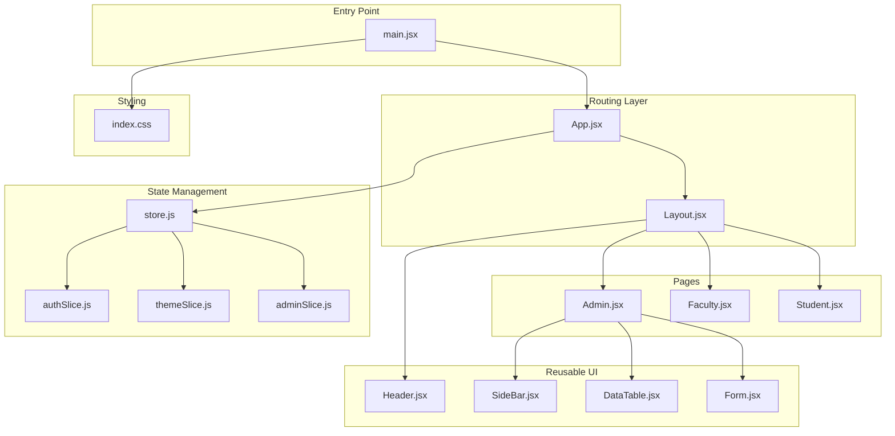
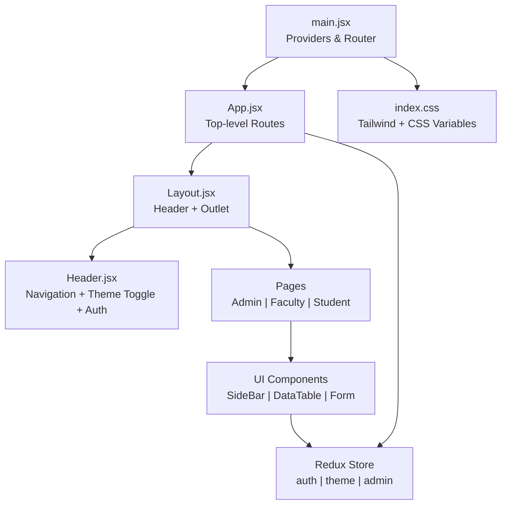
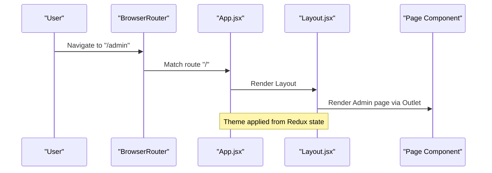
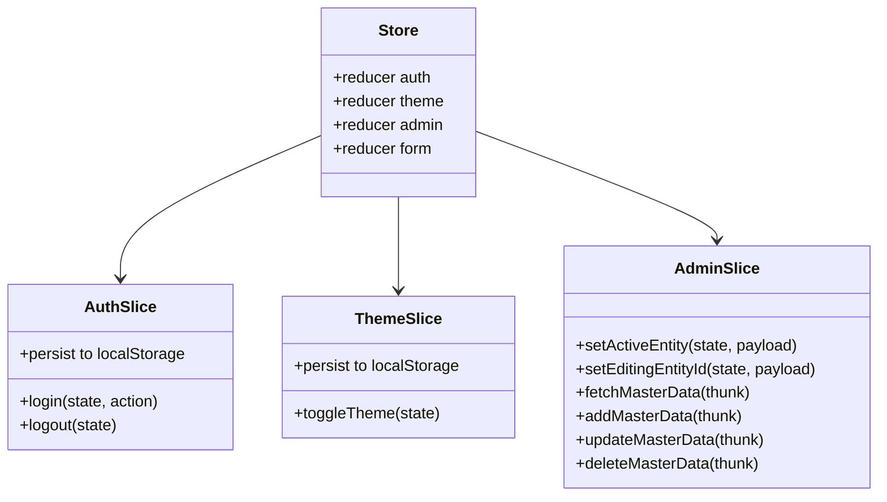
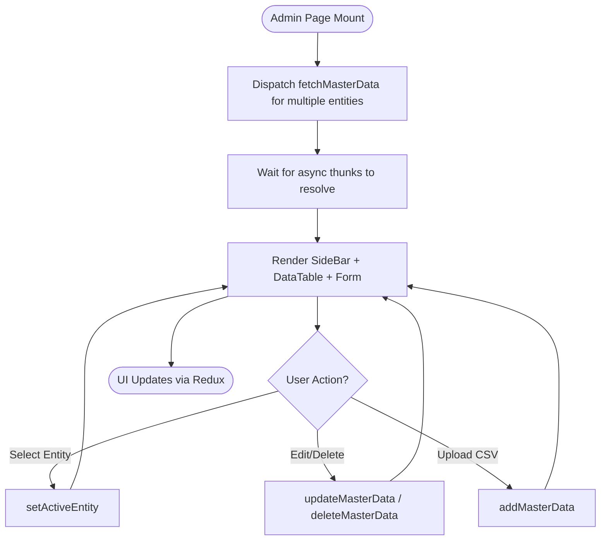
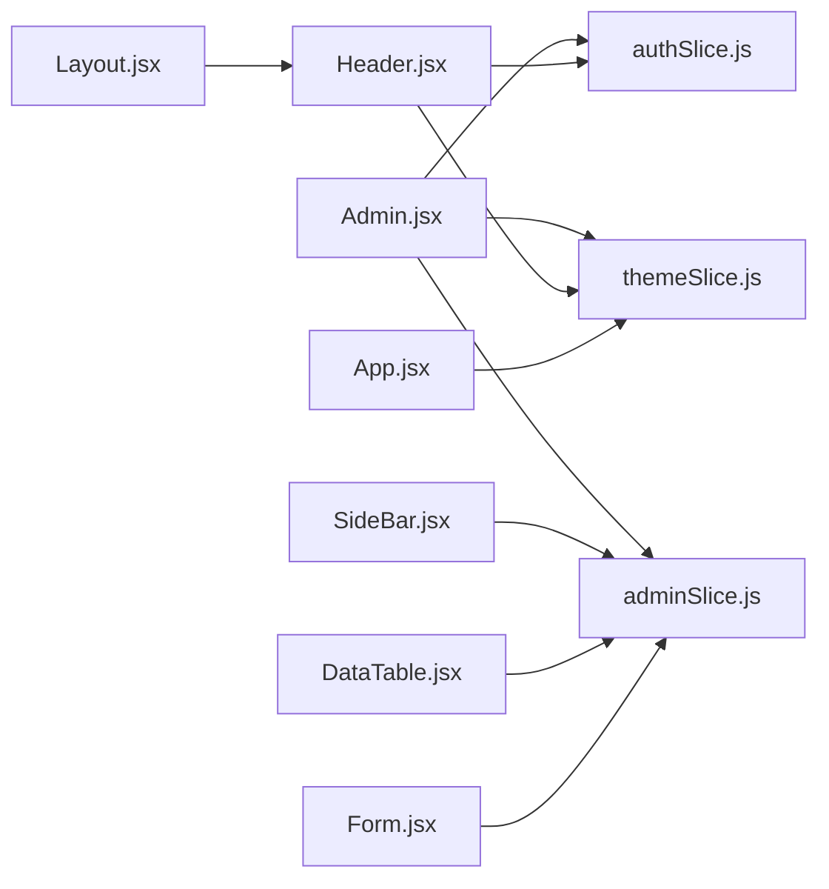

# Frontend Architecture

<cite>
**Referenced Files in This Document**
- [main.jsx](file://Client/src/main.jsx)
- [App.jsx](file://Client/src/App.jsx)
- [Layout.jsx](file://Client/src/components/Layout.jsx)
- [Header.jsx](file://Client/src/components/Header.jsx)
- [Admin.jsx](file://Client/src/pages/dashboard/Admin.jsx)
- [Faculty.jsx](file://Client/src/pages/dashboard/Faculty.jsx)
- [Student.jsx](file://Client/src/pages/dashboard/Student.jsx)
- [store.js](file://Client/src/store/store.js)
- [adminSlice.js](file://Client/src/store/admin/adminSlice.js)
- [authSlice.js](file://Client/src/store/auth/authSlice.js)
- [themeSlice.js](file://Client/src/store/theme/themeSlice.js)
- [SideBar.jsx](file://Client/src/components/deshboard/SideBar.jsx)
- [DataTable.jsx](file://Client/src/components/deshboard/DataTable.jsx)
- [Form.jsx](file://Client/src/components/deshboard/Form.jsx)
- [index.css](file://Client/src/index.css)
</cite>

## Table of Contents
1. [Introduction](#introduction)
2. [Project Structure](#project-structure)
3. [Core Components](#core-components)
4. [Architecture Overview](#architecture-overview)
5. [Detailed Component Analysis](#detailed-component-analysis)
6. [Dependency Analysis](#dependency-analysis)
7. [Performance Considerations](#performance-considerations)
8. [Troubleshooting Guide](#troubleshooting-guide)
9. [Conclusion](#conclusion)
10. [Appendices](#appendices)

## Introduction
This document describes the frontend architecture of the React-based Timetable Management application. It covers the component hierarchy, layout structure, routing configuration, Redux Toolkit state management, reusable UI components, page-level components, layout wrappers, role-based routing, styling with Tailwind CSS and responsive design, the application entry point and provider configuration, development workflow, component composition patterns, and state management best practices.

## Project Structure
The frontend is organized around a clear separation of concerns:
- Entry point initializes providers and router.
- App defines top-level routes and theme synchronization.
- Layout composes Header, Container, and Outlet for nested routes.
- Pages implement role-specific dashboards.
- Store organizes slices for auth, theme, admin master data, and a generic form slice.
- Reusable components under components/deshboard encapsulate admin UI patterns.

**Diagram sources**
- [main.jsx:1-18](file://Client/src/main.jsx#L1-L18)
- [App.jsx:1-41](file://Client/src/App.jsx#L1-L41)
- [Layout.jsx:1-22](file://Client/src/components/Layout.jsx#L1-L22)
- [Header.jsx:1-122](file://Client/src/components/Header.jsx#L1-L122)
- [Admin.jsx:1-617](file://Client/src/pages/dashboard/Admin.jsx#L1-L617)
- [Faculty.jsx:1-22](file://Client/src/pages/dashboard/Faculty.jsx#L1-L22)
- [Student.jsx:1-23](file://Client/src/pages/dashboard/Student.jsx#L1-L23)
- [store.js:1-15](file://Client/src/store/store.js#L1-L15)
- [authSlice.js:1-32](file://Client/src/store/auth/authSlice.js#L1-L32)
- [themeSlice.js:1-29](file://Client/src/store/theme/themeSlice.js#L1-L29)
- [adminSlice.js:1-173](file://Client/src/store/admin/adminSlice.js#L1-L173)
- [index.css:1-42](file://Client/src/index.css#L1-L42)

**Section sources**
- [main.jsx:1-18](file://Client/src/main.jsx#L1-L18)
- [App.jsx:1-41](file://Client/src/App.jsx#L1-L41)
- [Layout.jsx:1-22](file://Client/src/components/Layout.jsx#L1-L22)
- [store.js:1-15](file://Client/src/store/store.js#L1-L15)
- [index.css:1-42](file://Client/src/index.css#L1-L42)

## Core Components
- Application entry point initializes React, Redux Provider, and Browser Router, then renders the root App component.
- App sets up routes for Login, Home, and role-based dashboards under a shared Layout wrapper.
- Layout composes Header, Container, and Outlet to render nested routes with a consistent header and outlet area.
- Reusable UI components include SideBar for master entity navigation, DataTable for listing records, and Form for CRUD operations.

Key responsibilities:
- Entry and Providers: [main.jsx:1-18](file://Client/src/main.jsx#L1-L18)
- Routing and Theme Sync: [App.jsx:1-41](file://Client/src/App.jsx#L1-L41)
- Layout Composition: [Layout.jsx:1-22](file://Client/src/components/Layout.jsx#L1-L22)
- Role Guards: [Faculty.jsx:1-22](file://Client/src/pages/dashboard/Faculty.jsx#L1-L22), [Student.jsx:1-23](file://Client/src/pages/dashboard/Student.jsx#L1-L23)
- Admin Dashboard: [Admin.jsx:1-617](file://Client/src/pages/dashboard/Admin.jsx#L1-L617)
- Reusable UI: [SideBar.jsx:1-49](file://Client/src/components/deshboard/SideBar.jsx#L1-L49), [DataTable.jsx:1-86](file://Client/src/components/deshboard/DataTable.jsx#L1-L86), [Form.jsx:1-127](file://Client/src/components/deshboard/Form.jsx#L1-L127)

**Section sources**
- [main.jsx:1-18](file://Client/src/main.jsx#L1-L18)
- [App.jsx:1-41](file://Client/src/App.jsx#L1-L41)
- [Layout.jsx:1-22](file://Client/src/components/Layout.jsx#L1-L22)
- [Admin.jsx:1-617](file://Client/src/pages/dashboard/Admin.jsx#L1-L617)
- [SideBar.jsx:1-49](file://Client/src/components/deshboard/SideBar.jsx#L1-L49)
- [DataTable.jsx:1-86](file://Client/src/components/deshboard/DataTable.jsx#L1-L86)
- [Form.jsx:1-127](file://Client/src/components/deshboard/Form.jsx#L1-L127)

## Architecture Overview
The frontend follows a layered architecture:
- Presentation Layer: App, Layout, Header, and page components.
- Domain/UI Components: SideBar, DataTable, Form.
- State Management: Redux slices for auth, theme, and admin master data.
- Styling: Tailwind CSS with CSS variables for theme tokens and dark mode support.

**Diagram sources**
- [main.jsx:1-18](file://Client/src/main.jsx#L1-L18)
- [App.jsx:1-41](file://Client/src/App.jsx#L1-L41)
- [Layout.jsx:1-22](file://Client/src/components/Layout.jsx#L1-L22)
- [Header.jsx:1-122](file://Client/src/components/Header.jsx#L1-L122)
- [Admin.jsx:1-617](file://Client/src/pages/dashboard/Admin.jsx#L1-L617)
- [store.js:1-15](file://Client/src/store/store.js#L1-L15)
- [index.css:1-42](file://Client/src/index.css#L1-L42)

## Detailed Component Analysis

### Routing System and Navigation Patterns
- Top-level routes define Login, Home, and nested routes for Admin, Faculty, and Student under Layout.
- Layout uses Outlet to render nested routes and applies a shared theme class to the root container.
- Role guards redirect unauthenticated or unauthorized users to appropriate destinations.

**Diagram sources**
- [App.jsx:26-37](file://Client/src/App.jsx#L26-L37)
- [Layout.jsx:10-19](file://Client/src/components/Layout.jsx#L10-L19)

**Section sources**
- [App.jsx:1-41](file://Client/src/App.jsx#L1-L41)
- [Layout.jsx:1-22](file://Client/src/components/Layout.jsx#L1-L22)
- [Faculty.jsx:1-22](file://Client/src/pages/dashboard/Faculty.jsx#L1-L22)
- [Student.jsx:1-23](file://Client/src/pages/dashboard/Student.jsx#L1-L23)

### Redux Toolkit State Management
Store configuration aggregates reducers for auth, theme, admin, and a generic form slice. The admin slice manages master data CRUD via async thunks and maintains active entity and editing state. Auth and theme slices manage authentication state and theme toggling with persistence.

**Diagram sources**
- [store.js:7-14](file://Client/src/store/store.js#L7-L14)
- [authSlice.js:10-27](file://Client/src/store/auth/authSlice.js#L10-L27)
- [themeSlice.js:15-24](file://Client/src/store/theme/themeSlice.js#L15-L24)
- [adminSlice.js:88-172](file://Client/src/store/admin/adminSlice.js#L88-L172)

**Section sources**
- [store.js:1-15](file://Client/src/store/store.js#L1-L15)
- [authSlice.js:1-32](file://Client/src/store/auth/authSlice.js#L1-L32)
- [themeSlice.js:1-29](file://Client/src/store/theme/themeSlice.js#L1-L29)
- [adminSlice.js:1-173](file://Client/src/store/admin/adminSlice.js#L1-L173)

### Admin Dashboard Component Architecture
The Admin page orchestrates master data management:
- Dispatches multiple async thunks to load master entities on mount.
- Uses SideBar to switch active entity and DataTable/Form to render CRUD UI.
- Supports CSV upload via a reusable button component and toggles timetable view.

**Diagram sources**
- [Admin.jsx:28-44](file://Client/src/pages/dashboard/Admin.jsx#L28-L44)
- [adminSlice.js:24-78](file://Client/src/store/admin/adminSlice.js#L24-L78)
- [SideBar.jsx:3-46](file://Client/src/components/deshboard/SideBar.jsx#L3-L46)
- [DataTable.jsx:10-18](file://Client/src/components/deshboard/DataTable.jsx#L10-L18)
- [Form.jsx:37-50](file://Client/src/components/deshboard/Form.jsx#L37-L50)

**Section sources**
- [Admin.jsx:1-617](file://Client/src/pages/dashboard/Admin.jsx#L1-L617)
- [SideBar.jsx:1-49](file://Client/src/components/deshboard/SideBar.jsx#L1-L49)
- [DataTable.jsx:1-86](file://Client/src/components/deshboard/DataTable.jsx#L1-L86)
- [Form.jsx:1-127](file://Client/src/components/deshboard/Form.jsx#L1-L127)

### Reusable UI Components
- SideBar: Renders master entity list with counts and selection state.
- DataTable: Displays entity rows with edit/delete actions and loading/error indicators.
- Form: Handles creation and updates with controlled inputs and validation hints.

Composition patterns:
- Props-driven rendering: currentEntityConfig and activeEntity drive UI generation.
- Callback props: setActiveEntity, setEditingEntityId, and handlers for actions.
- Controlled state: Form uses local state synchronized with Redux editingEntityId.

**Section sources**
- [SideBar.jsx:1-49](file://Client/src/components/deshboard/SideBar.jsx#L1-L49)
- [DataTable.jsx:1-86](file://Client/src/components/deshboard/DataTable.jsx#L1-L86)
- [Form.jsx:1-127](file://Client/src/components/deshboard/Form.jsx#L1-L127)

### Styling Approach and Responsive Design
- Tailwind CSS is configured with CSS variables for theme tokens.
- Dark mode is supported via a .dark class toggled by the theme slice and persisted in localStorage.
- Responsive utilities are used across components for mobile-first layouts.

**Section sources**
- [index.css:1-42](file://Client/src/index.css#L1-L42)
- [Header.jsx:66-115](file://Client/src/components/Header.jsx#L66-L115)
- [Layout.jsx:10-19](file://Client/src/components/Layout.jsx#L10-L19)

### Application Entry Point and Provider Configuration
- Root renders StrictMode, Provider wrapping the Redux store, and BrowserRouter around the App.
- App sets up routes and synchronizes theme to document root and localStorage.

**Section sources**
- [main.jsx:1-18](file://Client/src/main.jsx#L1-L18)
- [App.jsx:16-24](file://Client/src/App.jsx#L16-L24)

## Dependency Analysis
The frontend exhibits low coupling and high cohesion:
- Pages depend on Redux for state and react-router for navigation.
- UI components depend on Redux actions and selectors, minimizing prop drilling.
- Store slices encapsulate domain logic and async flows.

**Diagram sources**
- [Admin.jsx:1-617](file://Client/src/pages/dashboard/Admin.jsx#L1-L617)
- [adminSlice.js:1-173](file://Client/src/store/admin/adminSlice.js#L1-L173)
- [authSlice.js:1-32](file://Client/src/store/auth/authSlice.js#L1-L32)
- [themeSlice.js:1-29](file://Client/src/store/theme/themeSlice.js#L1-L29)
- [SideBar.jsx:1-49](file://Client/src/components/deshboard/SideBar.jsx#L1-L49)
- [DataTable.jsx:1-86](file://Client/src/components/deshboard/DataTable.jsx#L1-L86)
- [Form.jsx:1-127](file://Client/src/components/deshboard/Form.jsx#L1-L127)
- [Header.jsx:1-122](file://Client/src/components/Header.jsx#L1-L122)
- [App.jsx:1-41](file://Client/src/App.jsx#L1-L41)
- [Layout.jsx:1-22](file://Client/src/components/Layout.jsx#L1-L22)

**Section sources**
- [store.js:1-15](file://Client/src/store/store.js#L1-L15)
- [adminSlice.js:1-173](file://Client/src/store/admin/adminSlice.js#L1-L173)
- [authSlice.js:1-32](file://Client/src/store/auth/authSlice.js#L1-L32)
- [themeSlice.js:1-29](file://Client/src/store/theme/themeSlice.js#L1-L29)

## Performance Considerations
- Prefer memoized selectors and component boundaries to avoid unnecessary re-renders.
- Lazy-load heavy components if needed; current pages are rendered inline.
- Debounce or batch rapid state updates in forms to reduce re-renders.
- Keep async thunks focused and avoid redundant network requests by checking cached data first.

## Troubleshooting Guide
Common issues and resolutions:
- Theme not persisting: Verify theme slice persists to localStorage and App.jsx applies the class to documentElement.
- Role guard failures: Ensure auth slice persists authentication state and pages check role before rendering.
- Async thunk errors: Inspect rejected payloads from adminSlice thunks and display user-friendly messages.
- Styling inconsistencies: Confirm Tailwind is generating styles and CSS variables match theme tokens.

**Section sources**
- [themeSlice.js:3-9](file://Client/src/store/theme/themeSlice.js#L3-L9)
- [App.jsx:16-24](file://Client/src/App.jsx#L16-L24)
- [authSlice.js:4-8](file://Client/src/store/auth/authSlice.js#L4-L8)
- [adminSlice.js:104-168](file://Client/src/store/admin/adminSlice.js#L104-L168)
- [index.css:15-35](file://Client/src/index.css#L15-L35)

## Conclusion
The frontend employs a clean, layered architecture with clear separation between routing, layout, reusable UI, and state management. Redux slices encapsulate domain logic and async flows, while Tailwind CSS and CSS variables enable consistent theming and responsive design. Role-based routing and guards ensure secure navigation, and component composition minimizes prop drilling through centralized state.

## Appendices
- Development Workflow: Use Vite for fast builds and HMR; lint with ESLint; commit with .gitignore configured.
- Best Practices:
  - Keep slices small and focused.
  - Use createAsyncThunk for side effects and handle pending/fulfilled/rejected states.
  - Prefer controlled components for forms and derive state from Redux where appropriate.
  - Centralize theme logic and apply dark/light classes consistently.