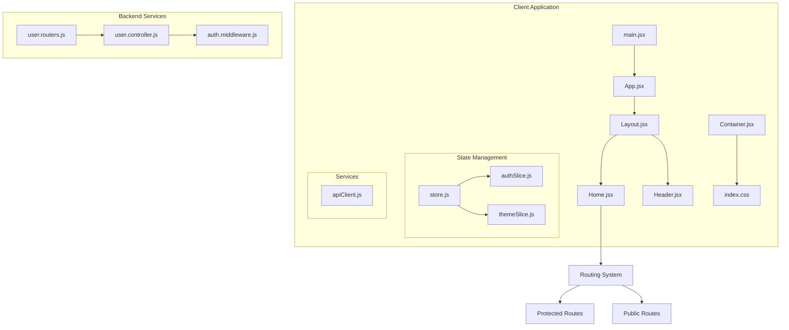
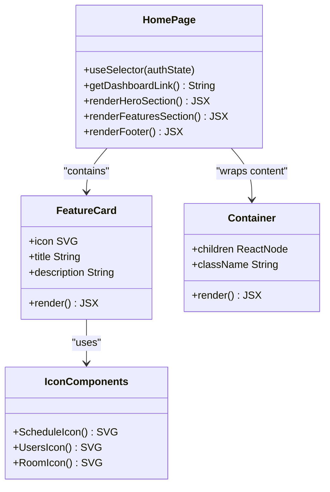
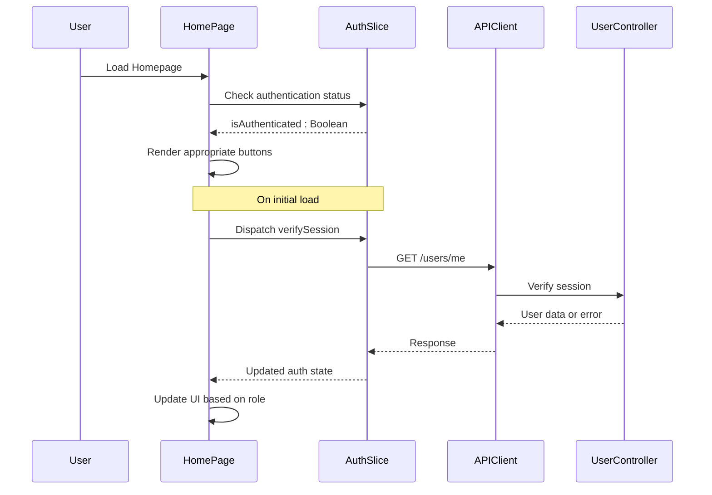
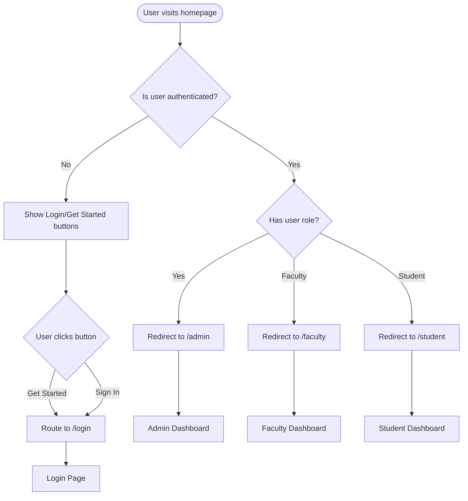
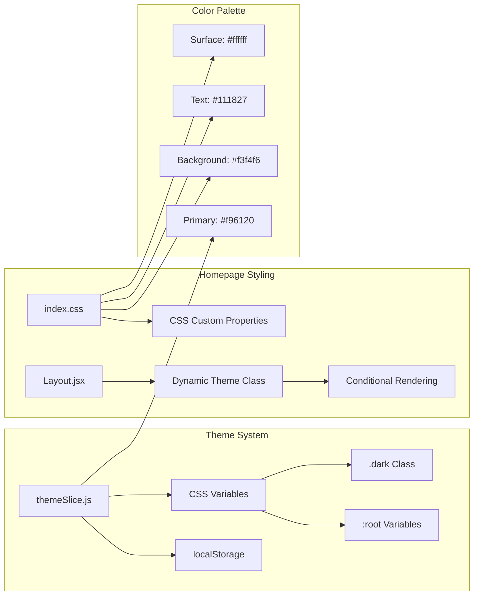
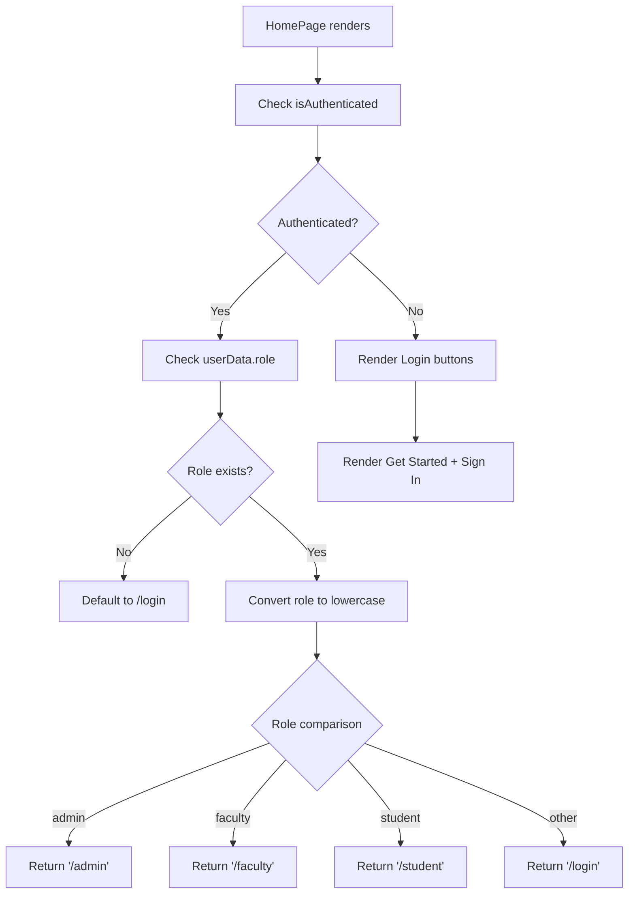
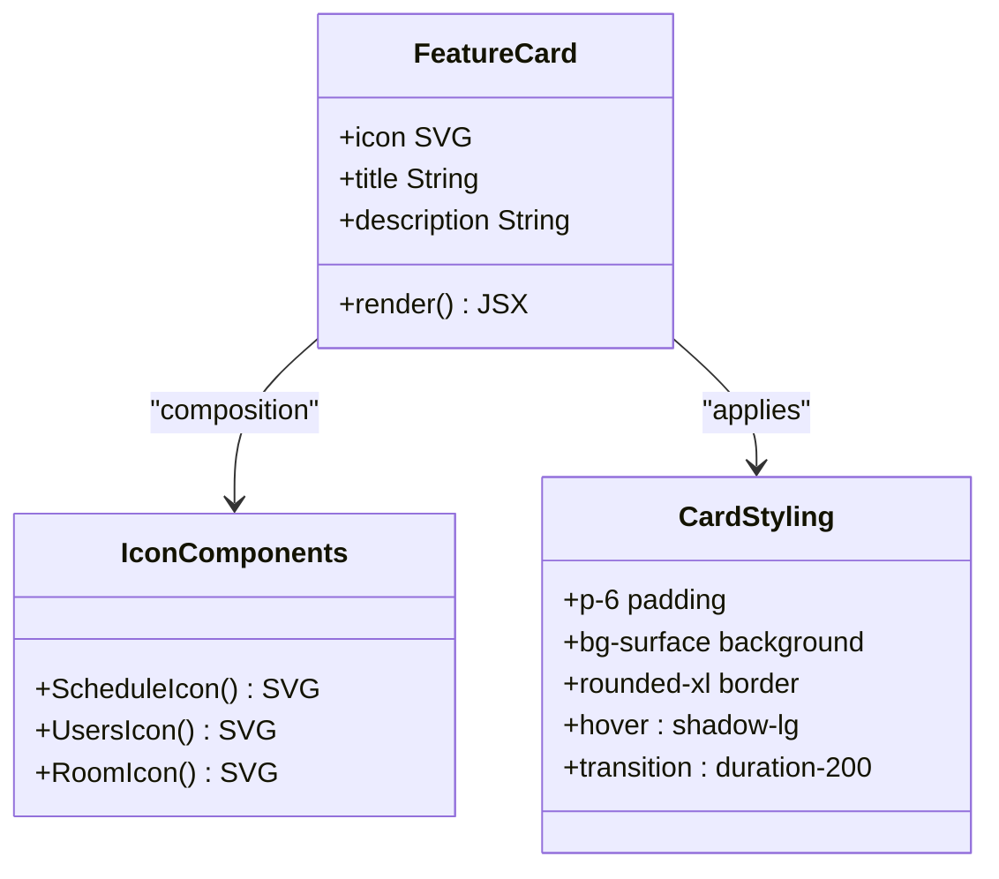
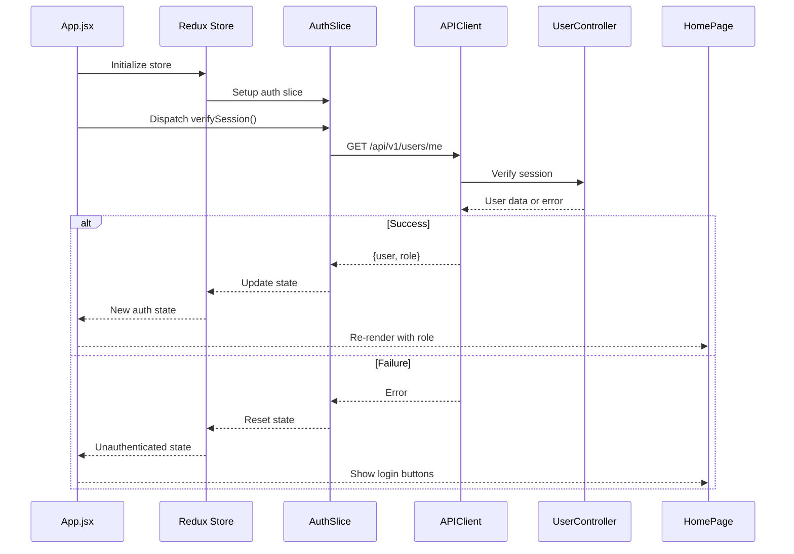
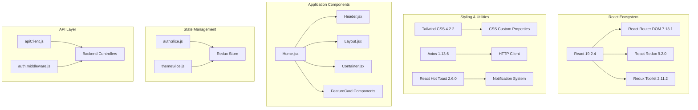
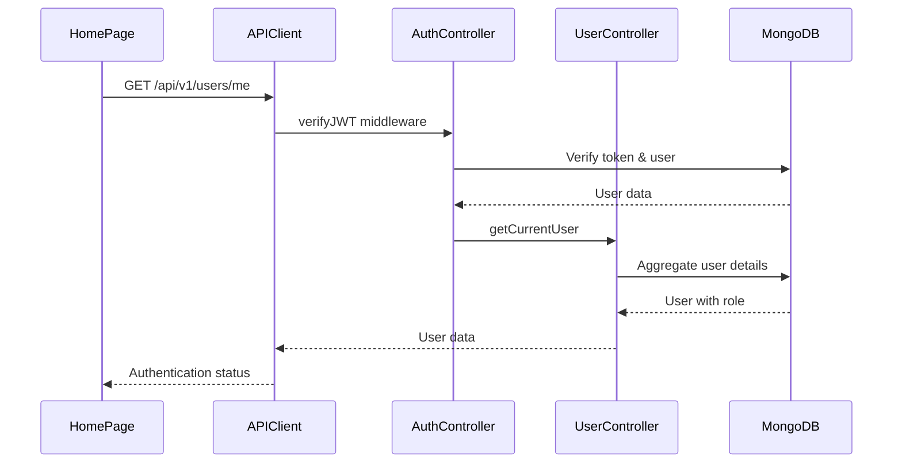

# Homepage Landing Page

<cite>
**Referenced Files in This Document**
- [Home.jsx](file://Client/src/pages/Home.jsx)
- [App.jsx](file://Client/src/App.jsx)
- [Layout.jsx](file://Client/src/components/Layout.jsx)
- [Header.jsx](file://Client/src/components/Header.jsx)
- [Container.jsx](file://Client/src/components/Container.jsx)
- [index.css](file://Client/src/index.css)
- [authSlice.js](file://Client/src/store/auth/authSlice.js)
- [themeSlice.js](file://Client/src/store/theme/themeSlice.js)
- [store.js](file://Client/src/store/store.js)
- [apiClient.js](file://Client/src/services/apiClient.js)
- [main.jsx](file://Client/src/main.jsx)
- [user.controller.js](file://Backend/src/controllers/user.controller.js)
- [user.routers.js](file://Backend/src/routes/user.routers.js)
- [auth.middleware.js](file://Backend/src/middlewares/auth.middleware.js)
</cite>

## Table of Contents
1. [Introduction](#introduction)
2. [Project Structure](#project-structure)
3. [Core Components](#core-components)
4. [Architecture Overview](#architecture-overview)
5. [Detailed Component Analysis](#detailed-component-analysis)
6. [Dependency Analysis](#dependency-analysis)
7. [Performance Considerations](#performance-considerations)
8. [Troubleshooting Guide](#troubleshooting-guide)
9. [Conclusion](#conclusion)

## Introduction
The Homepage Landing Page serves as the primary entry point for the TimeTable Manager application. It provides users with an engaging introduction to the platform's capabilities while seamlessly integrating authentication flows and responsive design principles. The landing page showcases key features, offers intuitive navigation options, and demonstrates the application's modern UI/UX design philosophy.

## Project Structure
The homepage implementation follows a modular React architecture with clear separation of concerns between presentation, state management, and routing components.

**Diagram sources**
- [main.jsx:1-19](file://Client/src/main.jsx#L1-L19)
- [App.jsx:52-116](file://Client/src/App.jsx#L52-L116)
- [Layout.jsx:7-18](file://Client/src/components/Layout.jsx#L7-L18)
- [Home.jsx:6-92](file://Client/src/pages/Home.jsx#L6-L92)

**Section sources**
- [main.jsx:1-19](file://Client/src/main.jsx#L1-L19)
- [App.jsx:52-116](file://Client/src/App.jsx#L52-L116)
- [Layout.jsx:7-18](file://Client/src/components/Layout.jsx#L7-L18)

## Core Components

### Homepage Component Architecture
The homepage implements a sophisticated component hierarchy that balances functionality with maintainability:

**Diagram sources**
- [Home.jsx:6-125](file://Client/src/pages/Home.jsx#L6-L125)
- [Container.jsx:3-5](file://Client/src/components/Container.jsx#L3-L5)

### Authentication Integration
The homepage seamlessly integrates with the authentication system to provide personalized user experiences:

**Diagram sources**
- [Home.jsx:7-16](file://Client/src/pages/Home.jsx#L7-L16)
- [authSlice.js:12-57](file://Client/src/store/auth/authSlice.js#L12-L57)
- [apiClient.js:14-21](file://Client/src/services/apiClient.js#L14-L21)
- [user.controller.js:596-665](file://Backend/src/controllers/user.controller.js#L596-L665)

**Section sources**
- [Home.jsx:6-125](file://Client/src/pages/Home.jsx#L6-L125)
- [authSlice.js:1-63](file://Client/src/store/auth/authSlice.js#L1-63)

## Architecture Overview

### Routing and Navigation Flow
The homepage participates in a comprehensive routing system that manages both public and protected content:

**Diagram sources**
- [Home.jsx:9-16](file://Client/src/pages/Home.jsx#L9-L16)
- [App.jsx:106-112](file://Client/src/App.jsx#L106-L112)
- [App.jsx:23-50](file://Client/src/App.jsx#L23-L50)

### Theme and Styling System
The homepage leverages a sophisticated theming system that supports both light and dark modes:

**Diagram sources**
- [themeSlice.js:3-22](file://Client/src/store/theme/themeSlice.js#L3-L22)
- [index.css:15-35](file://Client/src/index.css#L15-L35)
- [Layout.jsx:10-17](file://Client/src/components/Layout.jsx#L10-L17)

**Section sources**
- [App.jsx:52-116](file://Client/src/App.jsx#L52-L116)
- [index.css:1-42](file://Client/src/index.css#L1-L42)
- [themeSlice.js:1-29](file://Client/src/store/theme/themeSlice.js#L1-L29)

## Detailed Component Analysis

### Homepage Component Implementation
The homepage component demonstrates modern React patterns with hooks, conditional rendering, and responsive design principles.

#### Hero Section Analysis
The hero section implements a compelling value proposition with dynamic button generation based on user authentication state:

**Diagram sources**
- [Home.jsx:9-16](file://Client/src/pages/Home.jsx#L9-L16)
- [Home.jsx:31-53](file://Client/src/pages/Home.jsx#L31-L53)

#### Feature Cards Implementation
The feature cards demonstrate reusable component patterns with consistent styling and interactive hover effects:

**Diagram sources**
- [Home.jsx:95-103](file://Client/src/pages/Home.jsx#L95-L103)
- [Home.jsx:106-122](file://Client/src/pages/Home.jsx#L106-L122)

**Section sources**
- [Home.jsx:6-125](file://Client/src/pages/Home.jsx#L6-L125)

### Authentication State Management
The homepage integrates deeply with Redux Toolkit for centralized state management and authentication flow:

**Diagram sources**
- [App.jsx:56-59](file://Client/src/App.jsx#L56-L59)
- [authSlice.js:12-57](file://Client/src/store/auth/authSlice.js#L12-L57)
- [apiClient.js:14-21](file://Client/src/services/apiClient.js#L14-L21)

**Section sources**
- [authSlice.js:1-63](file://Client/src/store/auth/authSlice.js#L1-L63)
- [store.js:1-15](file://Client/src/store/store.js#L1-L15)

### Responsive Design Implementation
The homepage employs Tailwind CSS utility classes for comprehensive responsive behavior across device sizes.

#### Breakpoint Strategy
The design implements a mobile-first approach with strategic breakpoints:
- Mobile: Base styles apply to all screen sizes
- Tablet: sm: 640px breakpoint for medium screens
- Desktop: lg: 1024px breakpoint for large screens

#### Typography Hierarchy
The typography system establishes clear visual hierarchy:
- Hero heading: text-4xl on mobile, text-5xl on tablet, text-6xl on desktop
- Subheading: text-lg on mobile, text-xl on tablet
- Feature titles: text-lg with font-semibold weight
- Feature descriptions: text-sm with 70% opacity

**Section sources**
- [Home.jsx:21-56](file://Client/src/pages/Home.jsx#L21-L56)
- [index.css:15-41](file://Client/src/index.css#L15-L41)

## Dependency Analysis

### Frontend Component Dependencies
The homepage relies on several key dependencies for optimal functionality:

**Diagram sources**
- [Home.jsx:1-5](file://Client/src/pages/Home.jsx#L1-L5)
- [package.json:12-24](file://Client/package.json#L12-L24)
- [authSlice.js:1-2](file://Client/src/store/auth/authSlice.js#L1-L2)

### Backend Integration Points
The homepage communicates with backend services through well-defined API endpoints:

**Diagram sources**
- [apiClient.js:14-21](file://Client/src/services/apiClient.js#L14-L21)
- [user.routers.js:31](file://Backend/src/routes/user.routers.js#L31)
- [user.controller.js:596-665](file://Backend/src/controllers/user.controller.js#L596-L665)

**Section sources**
- [package.json:1-37](file://Client/package.json#L1-L37)
- [user.routers.js:1-41](file://Backend/src/routes/user.routers.js#L1-L41)

## Performance Considerations

### Caching Strategy
The API client implements intelligent caching mechanisms to optimize performance:

- **Cache Duration**: 5-minute TTL for GET requests
- **Cacheable Methods**: Only GET requests are cached
- **Cache Keys**: Generated from method, URL, and parameters
- **Cache Invalidation**: Automatic invalidation on mutations

### Request Optimization
The application employs several optimization techniques:

- **Concurrent Loading**: Multiple components can fetch data independently
- **Loading States**: Graceful loading indicators during authentication verification
- **Error Boundaries**: Robust error handling for network failures
- **Memory Management**: Proper cleanup of event listeners and subscriptions

### Bundle Optimization
The frontend utilizes modern bundling strategies:

- **Tree Shaking**: Unused code elimination
- **Code Splitting**: Route-based lazy loading
- **Asset Optimization**: Image and font optimization
- **Critical CSS**: Essential styles loaded inline

## Troubleshooting Guide

### Authentication Issues
Common authentication problems and solutions:

#### Session Verification Failures
- **Symptoms**: Homepage shows login buttons despite being authenticated
- **Causes**: Expired tokens, network issues, backend errors
- **Solutions**: Clear browser cookies, check network connectivity, verify backend health

#### Role-Based Redirection Problems
- **Symptoms**: Incorrect dashboard redirection
- **Causes**: Role mismatch, missing user data
- **Solutions**: Verify user role in database, check authentication flow

### Styling and Theming Issues
#### Theme Switching Problems
- **Symptoms**: Theme doesn't persist or toggle incorrectly
- **Causes**: Local storage issues, CSS variable conflicts
- **Solutions**: Clear browser cache, check CSS specificity, verify theme slice actions

#### Responsive Design Breakdown
- **Symptoms**: Layout breaks on specific screen sizes
- **Causes**: Tailwind configuration issues, custom CSS overrides
- **Solutions**: Check breakpoint values, verify CSS order, inspect computed styles

### Performance Troubleshooting
#### Slow Initial Load
- **Symptoms**: Delayed homepage rendering
- **Causes**: Large bundle size, slow API responses
- **Solutions**: Analyze bundle composition, implement lazy loading, optimize API calls

#### Memory Leaks
- **Symptoms**: Increasing memory usage over time
- **Causes**: Event listener leaks, unclosed subscriptions
- **Solutions**: Audit component lifecycle methods, clean up subscriptions properly

**Section sources**
- [authSlice.js:43-56](file://Client/src/store/auth/authSlice.js#L43-L56)
- [apiClient.js:120-214](file://Client/src/services/apiClient.js#L120-L214)
- [index.css:26-35](file://Client/src/index.css#L26-L35)

## Conclusion
The Homepage Landing Page represents a well-architected component that effectively combines modern React patterns with robust state management and responsive design principles. Its integration with the authentication system ensures seamless user experiences while maintaining security and performance standards.

The component demonstrates excellent separation of concerns through its modular architecture, clear dependency management, and comprehensive error handling strategies. The implementation of caching, theme switching, and responsive design showcases best practices in contemporary web development.

Future enhancements could include progressive web app capabilities, enhanced accessibility features, and additional analytics integration to track user engagement and conversion metrics.