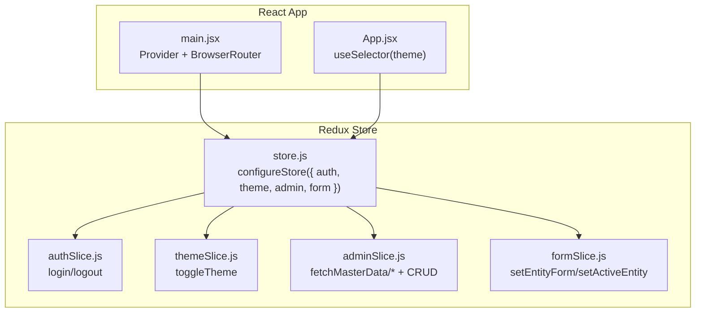
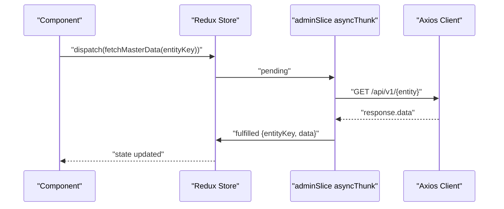
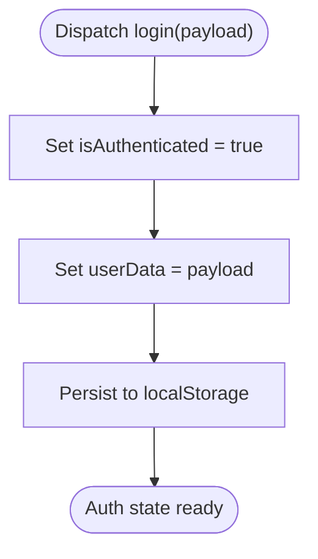
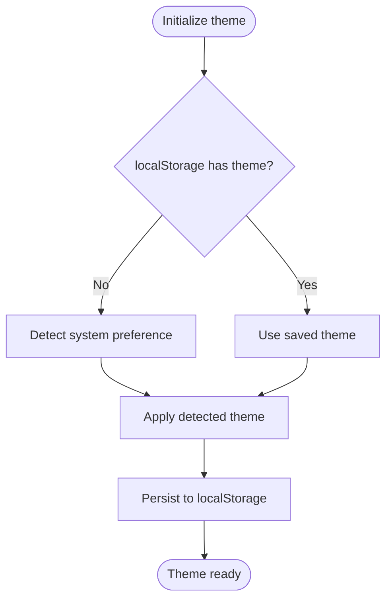
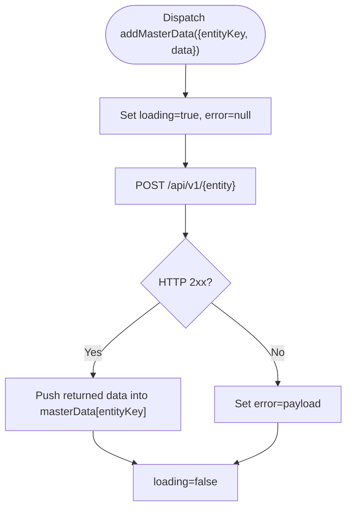
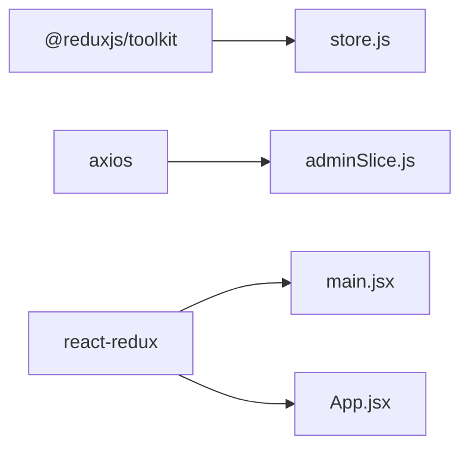

# Redux Toolkit State Management

<cite>
**Referenced Files in This Document**
- [store.js](file://Client/src/store/store.js)
- [adminSlice.js](file://Client/src/store/admin/adminSlice.js)
- [authSlice.js](file://Client/src/store/auth/authSlice.js)
- [themeSlice.js](file://Client/src/store/theme/themeSlice.js)
- [formSlice.js](file://Client/src/store/formSlice.js)
- [main.jsx](file://Client/src/main.jsx)
- [App.jsx](file://Client/src/App.jsx)
- [package.json](file://Client/package.json)
</cite>

## Table of Contents
1. [Introduction](#introduction)
2. [Project Structure](#project-structure)
3. [Core Components](#core-components)
4. [Architecture Overview](#architecture-overview)
5. [Detailed Component Analysis](#detailed-component-analysis)
6. [Dependency Analysis](#dependency-analysis)
7. [Performance Considerations](#performance-considerations)
8. [Troubleshooting Guide](#troubleshooting-guide)
9. [Conclusion](#conclusion)

## Introduction
This document explains the Redux Toolkit state management implementation in the client application. It covers store configuration, middleware defaults, slice integration, asynchronous data flows via async thunks, reducer patterns, state normalization strategies, loading and error handling, and persistence using localStorage. It also provides best practices for dispatching actions, selecting state in components, and managing side effects with Redux Thunk.

## Project Structure
The Redux state is organized under a dedicated store directory with four slices:
- Authentication state: [authSlice.js](file://Client/src/store/auth/authSlice.js)
- Theme/UI state: [themeSlice.js](file://Client/src/store/theme/themeSlice.js)
- Administrative master data and CRUD operations: [adminSlice.js](file://Client/src/store/admin/adminSlice.js)
- Form state for entity forms and editing: [formSlice.js](file://Client/src/store/formSlice.js)

The store is configured in [store.js](file://Client/src/store/store.js) and connected to the React app in [main.jsx](file://Client/src/main.jsx). The application reads the current theme from Redux in [App.jsx](file://Client/src/App.jsx).

**Diagram sources**
- [store.js:1-15](file://Client/src/store/store.js#L1-L15)
- [main.jsx:1-18](file://Client/src/main.jsx#L1-L18)
- [App.jsx:1-41](file://Client/src/App.jsx#L1-L41)
- [authSlice.js:1-32](file://Client/src/store/auth/authSlice.js#L1-L32)
- [themeSlice.js:1-29](file://Client/src/store/theme/themeSlice.js#L1-L29)
- [adminSlice.js:1-173](file://Client/src/store/admin/adminSlice.js#L1-L173)
- [formSlice.js:1-24](file://Client/src/store/formSlice.js#L1-L24)

**Section sources**
- [store.js:1-15](file://Client/src/store/store.js#L1-L15)
- [main.jsx:1-18](file://Client/src/main.jsx#L1-L18)
- [App.jsx:1-41](file://Client/src/App.jsx#L1-L41)

## Core Components
- Store configuration: Centralized in [store.js](file://Client/src/store/store.js) using Redux Toolkit’s configureStore with reducers for auth, theme, admin, and form.
- Middleware: No custom middleware is configured; Redux Toolkit defaults apply.
- Persistence: localStorage is used directly inside slices for auth and theme state hydration and updates.

Key responsibilities:
- authSlice: Manages authentication state and persists user data and flag to localStorage.
- themeSlice: Manages UI theme selection with initial detection from localStorage or system preference.
- adminSlice: Provides normalized master data storage keyed by entity type and exposes async thunks for CRUD operations.
- formSlice: Holds transient form state and editing identifiers per active entity.

**Section sources**
- [store.js:1-15](file://Client/src/store/store.js#L1-L15)
- [authSlice.js:1-32](file://Client/src/store/auth/authSlice.js#L1-L32)
- [themeSlice.js:1-29](file://Client/src/store/theme/themeSlice.js#L1-L29)
- [adminSlice.js:1-173](file://Client/src/store/admin/adminSlice.js#L1-L173)
- [formSlice.js:1-24](file://Client/src/store/formSlice.js#L1-L24)

## Architecture Overview
The store integrates with React via react-redux Provider. Components select state from Redux and dispatch actions. Async operations are handled by async thunks in the admin slice, which communicate with backend endpoints via an axios client configured with credentials.

**Diagram sources**
- [adminSlice.js:24-36](file://Client/src/store/admin/adminSlice.js#L24-L36)
- [adminSlice.js:104-118](file://Client/src/store/admin/adminSlice.js#L104-L118)

## Detailed Component Analysis

### Store Configuration and Integration
- Store creation: [store.js](file://Client/src/store/store.js) defines reducers for auth, theme, admin, and form.
- Provider setup: [main.jsx](file://Client/src/main.jsx) wraps the app with Provider and BrowserRouter.
- Dependencies: [package.json](file://Client/package.json) includes @reduxjs/toolkit, react-redux, and axios.

Best practices:
- Keep reducers pure and deterministic.
- Use Redux Toolkit defaults for middleware; avoid unnecessary customization unless needed.

**Section sources**
- [store.js:1-15](file://Client/src/store/store.js#L1-L15)
- [main.jsx:1-18](file://Client/src/main.jsx#L1-L18)
- [package.json:12-22](file://Client/package.json#L12-L22)

### Authentication Slice (authSlice.js)
Purpose:
- Manage authentication state and persist user data and login flag in localStorage.

State shape:
- isAuthenticated: boolean
- userData: object or null

Actions:
- login: sets authenticated flag and user data, persists to localStorage.
- logout: clears authentication state and removes entries from localStorage.

Persistence strategy:
- Hydration on initialization from localStorage.
- Updates on login/logout events.

**Diagram sources**
- [authSlice.js:14-25](file://Client/src/store/auth/authSlice.js#L14-L25)

**Section sources**
- [authSlice.js:1-32](file://Client/src/store/auth/authSlice.js#L1-L32)

### Theme Slice (themeSlice.js)
Purpose:
- Manage UI theme selection with automatic detection of system preference if no saved theme exists.

State shape:
- theme: "light" | "dark"

Actions:
- toggleTheme: flips between light and dark themes and persists to localStorage.

Initialization:
- Reads saved theme from localStorage; otherwise detects system preference.

**Diagram sources**
- [themeSlice.js:3-9](file://Client/src/store/theme/themeSlice.js#L3-L9)
- [themeSlice.js:19-22](file://Client/src/store/theme/themeSlice.js#L19-L22)

**Section sources**
- [themeSlice.js:1-29](file://Client/src/store/theme/themeSlice.js#L1-L29)

### Admin Slice (adminSlice.js)
Purpose:
- Normalize and manage master data for multiple entities (program, course, room, classes, section, subject, Specialization, faculty, student).
- Provide CRUD operations via async thunks backed by axios.

Async thunks:
- fetchMasterData(entityKey): loads all records for an entity.
- addMasterData({ entityKey, data }): creates a new record.
- updateMasterData({ entityKey, id, data }): updates an existing record.
- deleteMasterData({ entityKey, id }): deletes a record.

State shape:
- masterData: object keyed by entity type containing arrays of normalized records.
- activeEntity: currently selected entity type.
- editingEntityId: ID of the record being edited.
- loading: boolean indicating ongoing async operation.
- error: string or null representing last error message.

Reducer patterns:
- Pending: sets loading true and clears error.
- Fulfilled: updates normalized masterData for the entity.
- Rejected: sets loading false and stores error payload.

Normalization strategy:
- Records are stored in arrays under entity keys.
- Updates replace items by matching either _id or id.
- Deletions filter out items by matching either _id or id.

**Diagram sources**
- [adminSlice.js:38-50](file://Client/src/store/admin/adminSlice.js#L38-L50)
- [adminSlice.js:119-134](file://Client/src/store/admin/adminSlice.js#L119-L134)

**Section sources**
- [adminSlice.js:1-173](file://Client/src/store/admin/adminSlice.js#L1-L173)

### Form Slice (formSlice.js)
Purpose:
- Hold transient form state and editing identifiers for the active entity.

State shape:
- entityForm: object holding current form data.
- editingEntityId: number or null indicating the record being edited.
- activeEntity: string identifying the current entity type.

Actions:
- setEntityForm: replaces form data.
- setEditingEntityId: sets the editing identifier.
- setActiveEntity: switches the active entity type.

Usage pattern:
- Components set entityForm when editing or creating.
- setActiveEntity determines which normalized data to operate on in the admin slice.

**Section sources**
- [formSlice.js:1-24](file://Client/src/store/formSlice.js#L1-L24)

### Component Integration Examples
- Theme binding in App.jsx: Selects theme from Redux and applies a class to the document root, while persisting the theme to localStorage.
- Provider wiring in main.jsx: Wraps the entire app with Provider so useSelector and useDispatch are available.

**Section sources**
- [App.jsx:14-24](file://Client/src/App.jsx#L14-L24)
- [main.jsx:9-16](file://Client/src/main.jsx#L9-L16)

## Dependency Analysis
External dependencies relevant to state management:
- @reduxjs/toolkit: Provides configureStore, createSlice, createAsyncThunk.
- react-redux: Connects React components to Redux store.
- axios: Used by adminSlice async thunks to call backend endpoints.

**Diagram sources**
- [package.json:12-22](file://Client/package.json#L12-L22)
- [store.js:1-15](file://Client/src/store/store.js#L1-L15)
- [adminSlice.js:1-3](file://Client/src/store/admin/adminSlice.js#L1-L3)
- [main.jsx:6-7](file://Client/src/main.jsx#L6-L7)
- [App.jsx:5](file://Client/src/App.jsx#L5)

**Section sources**
- [package.json:12-22](file://Client/package.json#L12-L22)
- [store.js:1-15](file://Client/src/store/store.js#L1-L15)
- [adminSlice.js:1-3](file://Client/src/store/admin/adminSlice.js#L1-L3)

## Performance Considerations
- Prefer normalized state: The admin slice stores arrays keyed by entity type, enabling efficient updates and deletions.
- Minimize re-renders: Use useSelector to select only the needed slice of state in components.
- Avoid heavy work in reducers: Keep reducers synchronous; async logic belongs in async thunks.
- Debounce or batch UI updates: When updating form state frequently, consider throttling updates to reduce renders.
- Use shallow equality checks: Spread operators and immutable updates help maintain referential stability.

## Troubleshooting Guide
Common issues and resolutions:
- Async thunk errors: The admin slice returns error messages via rejectWithValue; components should read state.error and display user-friendly messages.
- Loading states: Components should show loading indicators when state.loading is true during pending async thunks.
- State hydration: authSlice and themeSlice hydrate from localStorage on initialization; ensure localStorage is available and not corrupted.
- Entity mismatch: Admin updates/deletes match by _id or id; ensure backend returns consistent identifiers.

Action and selector tips:
- Dispatch actions from components using useDispatch hook.
- Select state with useSelector using the slice key (e.g., state.auth, state.theme, state.admin, state.form).
- For async thunks, handle pending/fulfilled/rejected branches to update UI accordingly.

**Section sources**
- [adminSlice.js:104-167](file://Client/src/store/admin/adminSlice.js#L104-L167)
- [authSlice.js:3-8](file://Client/src/store/auth/authSlice.js#L3-L8)
- [themeSlice.js:3-9](file://Client/src/store/theme/themeSlice.js#L3-L9)

## Conclusion
The Redux Toolkit implementation organizes state cleanly across four focused slices, with localStorage-backed persistence for authentication and theme. The admin slice leverages async thunks and normalized state to manage CRUD operations efficiently. Following the best practices outlined here will help maintain predictable state transitions, robust error handling, and scalable performance as the application grows.