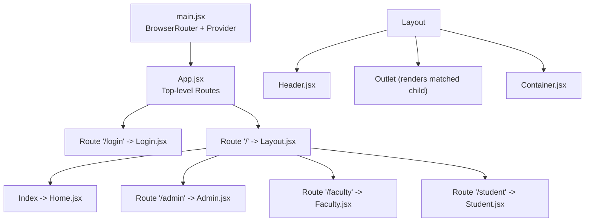
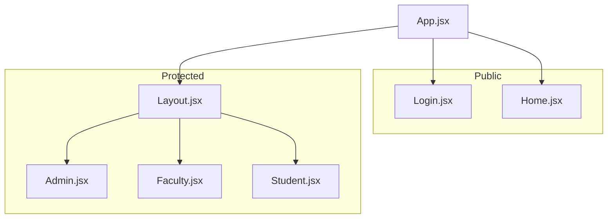
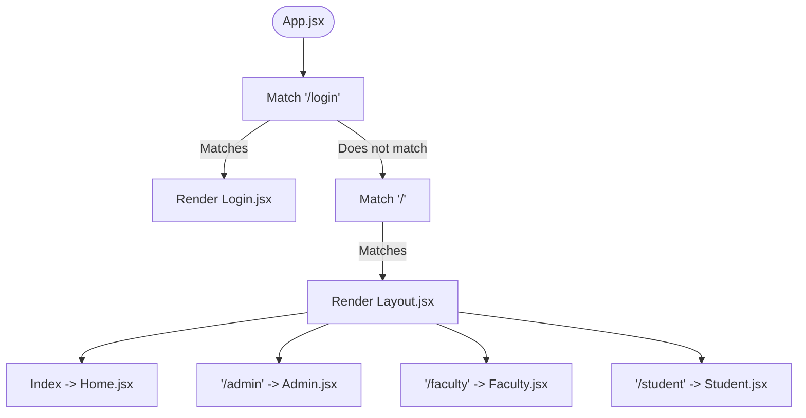
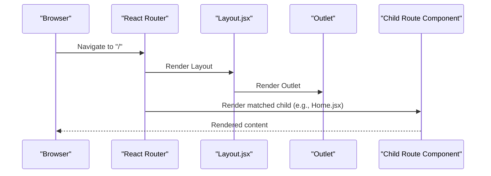
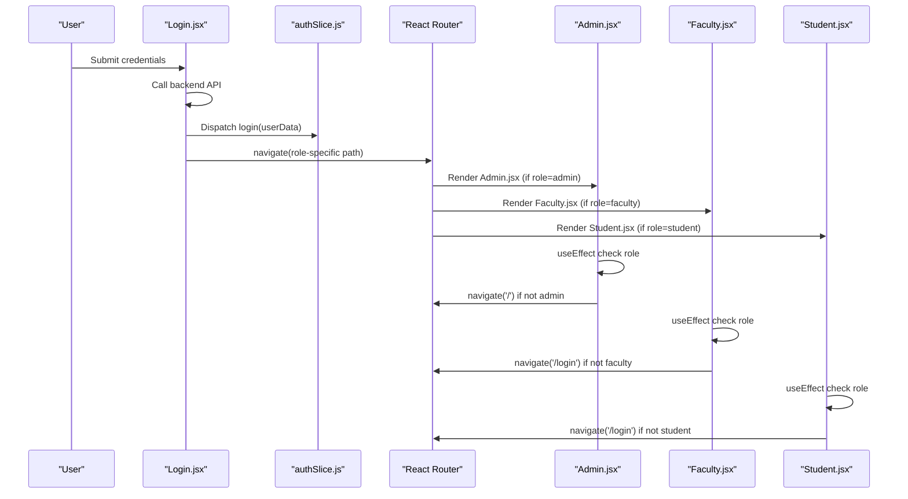
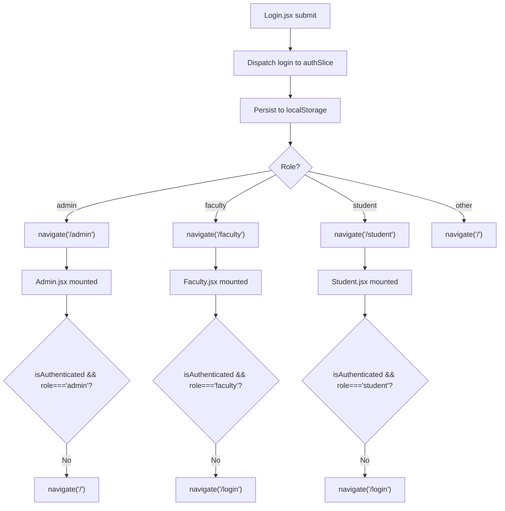
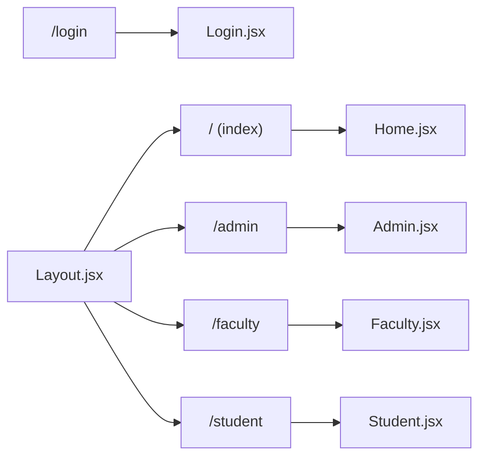
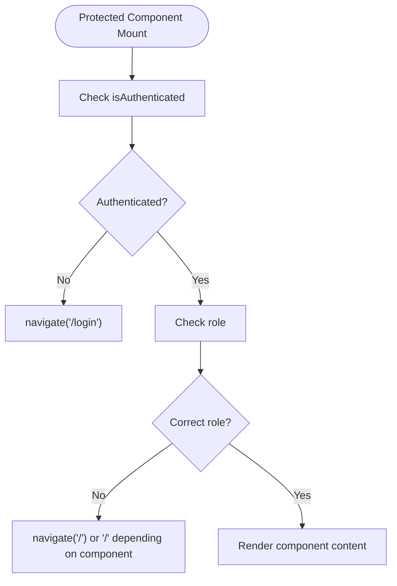
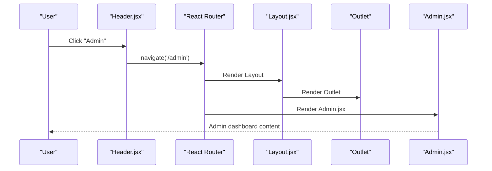
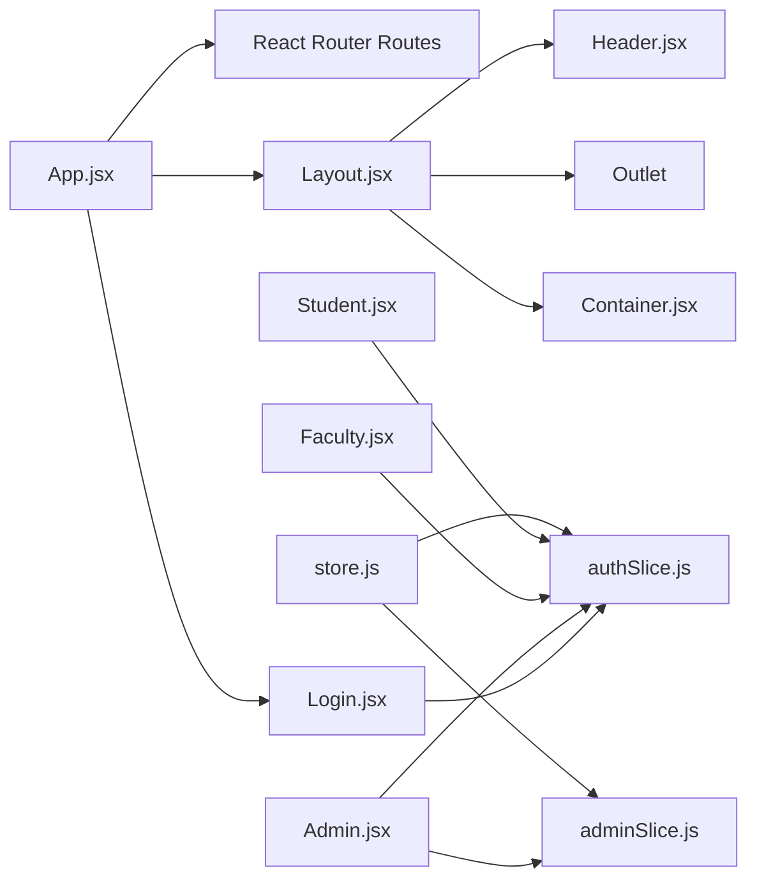

# Routing System & Navigation

<cite>
**Referenced Files in This Document**
- [App.jsx](file://Client/src/App.jsx)
- [main.jsx](file://Client/src/main.jsx)
- [Layout.jsx](file://Client/src/components/Layout.jsx)
- [Header.jsx](file://Client/src/components/Header.jsx)
- [Container.jsx](file://Client/src/components/Container.jsx)
- [Home.jsx](file://Client/src/pages/Home.jsx)
- [Login.jsx](file://Client/src/pages/Login.jsx)
- [Admin.jsx](file://Client/src/pages/dashboard/Admin.jsx)
- [Faculty.jsx](file://Client/src/pages/dashboard/Faculty.jsx)
- [Student.jsx](file://Client/src/pages/dashboard/Student.jsx)
- [authSlice.js](file://Client/src/store/auth/authSlice.js)
- [store.js](file://Client/src/store/store.js)
- [adminSlice.js](file://Client/src/store/admin/adminSlice.js)
- [SideBar.jsx](file://Client/src/components/deshboard/SideBar.jsx)
</cite>

## Table of Contents
1. [Introduction](#introduction)
2. [Project Structure](#project-structure)
3. [Core Components](#core-components)
4. [Architecture Overview](#architecture-overview)
5. [Detailed Component Analysis](#detailed-component-analysis)
6. [Dependency Analysis](#dependency-analysis)
7. [Performance Considerations](#performance-considerations)
8. [Troubleshooting Guide](#troubleshooting-guide)
9. [Conclusion](#conclusion)

## Introduction
This document explains the React Router implementation and navigation system used in the timetable project. It covers route configuration, nested routing with a shared layout, role-based access control, and authentication-dependent navigation. It also documents how public and protected routes are structured for different user roles (admin, faculty, student) and how programmatic navigation, route parameters, and query strings are handled. Finally, it describes how layouts wrap application sections and how components relate to routes.

## Project Structure
The client-side routing is configured at the application root and rendered inside a Redux Provider and BrowserRouter. The main application component defines top-level routes and a nested layout for authenticated sections.

**Diagram sources**
- [main.jsx:9-17](file://Client/src/main.jsx#L9-L17)
- [App.jsx:26-37](file://Client/src/App.jsx#L26-L37)
- [Layout.jsx:10-19](file://Client/src/components/Layout.jsx#L10-L19)

**Section sources**
- [main.jsx:9-17](file://Client/src/main.jsx#L9-L17)
- [App.jsx:26-37](file://Client/src/App.jsx#L26-L37)

## Core Components
- App.jsx: Declares top-level routes and nested routes under a shared layout.
- Layout.jsx: Provides a shared layout with a header, outlet for nested routes, and a container wrapper.
- Header.jsx: Supplies navigation links and actions (login/logout, theme toggle).
- Container.jsx: A simple wrapper component for consistent layout spacing.
- Home.jsx, Login.jsx, Admin.jsx, Faculty.jsx, Student.jsx: Page components bound to specific routes.
- authSlice.js: Authentication state persisted in localStorage and exposed via Redux.
- store.js: Central Redux store combining auth, theme, admin, and form slices.
- adminSlice.js: Admin dashboard data fetching and CRUD operations.
- SideBar.jsx: Sidebar used within the Admin dashboard to switch master data entities.

**Section sources**
- [App.jsx:26-37](file://Client/src/App.jsx#L26-L37)
- [Layout.jsx:7-19](file://Client/src/components/Layout.jsx#L7-L19)
- [Header.jsx:8-121](file://Client/src/components/Header.jsx#L8-L121)
- [Container.jsx:3-5](file://Client/src/components/Container.jsx#L3-L5)
- [Home.jsx:4-11](file://Client/src/pages/Home.jsx#L4-L11)
- [Login.jsx](file://Client/src/pages/Login.jsx)
- [Admin.jsx:17-49](file://Client/src/pages/dashboard/Admin.jsx#L17-L49)
- [Faculty.jsx:5-21](file://Client/src/pages/dashboard/Faculty.jsx#L5-L21)
- [Student.jsx:5-22](file://Client/src/pages/dashboard/Student.jsx#L5-L22)
- [authSlice.js:1-32](file://Client/src/store/auth/authSlice.js#L1-L32)
- [store.js:7-14](file://Client/src/store/store.js#L7-L14)
- [adminSlice.js:1-173](file://Client/src/store/admin/adminSlice.js#L1-L173)
- [SideBar.jsx:3-46](file://Client/src/components/deshboard/SideBar.jsx#L3-L46)

## Architecture Overview
The routing architecture separates public and protected areas:
- Public routes: Login page and home page.
- Protected routes: Admin, Faculty, and Student dashboards, accessed after authentication and role verification.
- Shared layout: A single layout wraps the protected area to provide consistent header and outlet rendering.

**Diagram sources**
- [App.jsx:26-37](file://Client/src/App.jsx#L26-L37)
- [Layout.jsx:10-19](file://Client/src/components/Layout.jsx#L10-L19)
- [Admin.jsx:17-49](file://Client/src/pages/dashboard/Admin.jsx#L17-L49)
- [Faculty.jsx:5-21](file://Client/src/pages/dashboard/Faculty.jsx#L5-L21)
- [Student.jsx:5-22](file://Client/src/pages/dashboard/Student.jsx#L5-L22)

## Detailed Component Analysis

### Route Configuration and Nested Routing
- Top-level routes:
  - Route "/login" renders the Login page.
  - Route "/" renders Layout, which becomes the parent for nested routes.
- Nested routes under Layout:
  - Index route renders Home.
  - Route "/admin" renders Admin.
  - Route "/faculty" renders Faculty.
  - Route "/student" renders Student.

**Diagram sources**
- [App.jsx:26-37](file://Client/src/App.jsx#L26-L37)
- [Layout.jsx:10-19](file://Client/src/components/Layout.jsx#L10-L19)

**Section sources**
- [App.jsx:26-37](file://Client/src/App.jsx#L26-L37)

### Layout and Outlet Behavior
- Layout.jsx composes Header and Container around an Outlet. The Outlet renders whichever nested route matches under "/".
- This pattern centralizes shared UI (header, theme) while allowing route-specific content to render dynamically.

**Diagram sources**
- [Layout.jsx:10-19](file://Client/src/components/Layout.jsx#L10-L19)

**Section sources**
- [Layout.jsx:7-19](file://Client/src/components/Layout.jsx#L7-L19)

### Role-Based Access Control and Programmatic Navigation
- Login.jsx handles authentication submission, determines user role, navigates to the appropriate dashboard, and updates Redux state.
- Admin.jsx, Faculty.jsx, and Student.jsx enforce role checks using Redux state and redirect unauthenticated or unauthorized users.

**Diagram sources**
- [Login.jsx:15-44](file://Client/src/pages/Login.jsx#L15-L44)
- [authSlice.js:14-25](file://Client/src/store/auth/authSlice.js#L14-L25)
- [Admin.jsx:40-49](file://Client/src/pages/dashboard/Admin.jsx#L40-L49)
- [Faculty.jsx:10-14](file://Client/src/pages/dashboard/Faculty.jsx#L10-L14)
- [Student.jsx:10-14](file://Client/src/pages/dashboard/Student.jsx#L10-L14)

**Section sources**
- [Login.jsx:15-44](file://Client/src/pages/Login.jsx#L15-L44)
- [authSlice.js:14-25](file://Client/src/store/auth/authSlice.js#L14-L25)
- [Admin.jsx:40-49](file://Client/src/pages/dashboard/Admin.jsx#L40-L49)
- [Faculty.jsx:10-14](file://Client/src/pages/dashboard/Faculty.jsx#L10-L14)
- [Student.jsx:10-14](file://Client/src/pages/dashboard/Student.jsx#L10-L14)

### Navigation Patterns and Authentication-Dependent Routing
- Programmatic navigation:
  - Login.jsx uses navigate to send users to role-specific paths after successful login.
  - Admin.jsx, Faculty.jsx, and Student.jsx use navigate to redirect on failed role checks.
  - Header.jsx uses navigate for login/logout actions.
- Authentication-dependent routing:
  - Login.jsx reads authentication state from Redux and persists it to localStorage.
  - Protected components rely on Redux state to decide whether to render content or redirect.

**Diagram sources**
- [Login.jsx:36-44](file://Client/src/pages/Login.jsx#L36-L44)
- [authSlice.js:14-25](file://Client/src/store/auth/authSlice.js#L14-L25)
- [Admin.jsx:40-49](file://Client/src/pages/dashboard/Admin.jsx#L40-L49)
- [Faculty.jsx:10-14](file://Client/src/pages/dashboard/Faculty.jsx#L10-L14)
- [Student.jsx:10-14](file://Client/src/pages/dashboard/Student.jsx#L10-L14)

**Section sources**
- [Login.jsx:36-44](file://Client/src/pages/Login.jsx#L36-L44)
- [authSlice.js:14-25](file://Client/src/store/auth/authSlice.js#L14-L25)
- [Header.jsx:14-28](file://Client/src/components/Header.jsx#L14-L28)

### Relationship Between Routes and Page Components
- "/login" → Login.jsx
- "/" (index under Layout) → Home.jsx
- "/admin" → Admin.jsx
- "/faculty" → Faculty.jsx
- "/student" → Student.jsx
- Layout.jsx wraps Home, Admin, Faculty, and Student under the "/" route.

**Diagram sources**
- [App.jsx:26-37](file://Client/src/App.jsx#L26-L37)
- [Layout.jsx:10-19](file://Client/src/components/Layout.jsx#L10-L19)

**Section sources**
- [App.jsx:26-37](file://Client/src/App.jsx#L26-L37)
- [Layout.jsx:10-19](file://Client/src/components/Layout.jsx#L10-L19)

### Protected Routes and Role-Based Access Patterns
- Admin.jsx enforces admin-only access using Redux state and redirects otherwise.
- Faculty.jsx and Student.jsx enforce their respective roles similarly.
- Login.jsx performs role-based redirection after successful authentication.

**Diagram sources**
- [Admin.jsx:40-49](file://Client/src/pages/dashboard/Admin.jsx#L40-L49)
- [Faculty.jsx:10-14](file://Client/src/pages/dashboard/Faculty.jsx#L10-L14)
- [Student.jsx:10-14](file://Client/src/pages/dashboard/Student.jsx#L10-L14)

**Section sources**
- [Admin.jsx:40-49](file://Client/src/pages/dashboard/Admin.jsx#L40-L49)
- [Faculty.jsx:10-14](file://Client/src/pages/dashboard/Faculty.jsx#L10-L14)
- [Student.jsx:10-14](file://Client/src/pages/dashboard/Student.jsx#L10-L14)

### Examples of Programmatic Navigation, Route Parameters, and Query Strings
- Programmatic navigation:
  - Login.jsx uses navigate to move users to role-specific paths after login.
  - Protected components use navigate to redirect on authentication failures.
  - Header.jsx uses navigate for login/logout actions.
- Route parameters and query strings:
  - The current implementation does not define routes with dynamic segments or query parsing hooks. If future enhancements are needed, route parameters and query strings can be integrated using router APIs and state management.

**Section sources**
- [Login.jsx:36-44](file://Client/src/pages/Login.jsx#L36-L44)
- [Admin.jsx:40-49](file://Client/src/pages/dashboard/Admin.jsx#L40-L49)
- [Faculty.jsx:10-14](file://Client/src/pages/dashboard/Faculty.jsx#L10-L14)
- [Student.jsx:10-14](file://Client/src/pages/dashboard/Student.jsx#L10-L14)
- [Header.jsx:14-28](file://Client/src/components/Header.jsx#L14-L28)

### Nested Route Handling and Layout Wrapping
- The nested routing under Layout.jsx allows Home, Admin, Faculty, and Student to share a common header and outlet.
- Outlet renders the currently matched child route, enabling seamless transitions between dashboards without re-rendering shared UI.

**Diagram sources**
- [Header.jsx:20-23](file://Client/src/components/Header.jsx#L20-L23)
- [Layout.jsx:10-19](file://Client/src/components/Layout.jsx#L10-L19)
- [Admin.jsx:17-49](file://Client/src/pages/dashboard/Admin.jsx#L17-L49)

**Section sources**
- [Header.jsx:20-23](file://Client/src/components/Header.jsx#L20-L23)
- [Layout.jsx:10-19](file://Client/src/components/Layout.jsx#L10-L19)

## Dependency Analysis
- App.jsx depends on:
  - React Router for route declarations.
  - Redux for theme selection (not directly for auth here).
  - Page components for route elements.
- Layout.jsx depends on:
  - Header.jsx for navigation and actions.
  - Outlet from React Router for nested rendering.
  - Container.jsx for consistent layout.
- Protected components depend on:
  - Redux auth state (isAuthenticated, userData).
  - React Router navigate for redirection.
- Store integrates:
  - authSlice for authentication state.
  - adminSlice for admin dashboard data operations.

**Diagram sources**
- [App.jsx:26-37](file://Client/src/App.jsx#L26-L37)
- [Layout.jsx:10-19](file://Client/src/components/Layout.jsx#L10-L19)
- [Header.jsx:8-121](file://Client/src/components/Header.jsx#L8-L121)
- [authSlice.js:1-32](file://Client/src/store/auth/authSlice.js#L1-L32)
- [adminSlice.js:1-173](file://Client/src/store/admin/adminSlice.js#L1-L173)
- [store.js:7-14](file://Client/src/store/store.js#L7-L14)

**Section sources**
- [store.js:7-14](file://Client/src/store/store.js#L7-L14)
- [authSlice.js:1-32](file://Client/src/store/auth/authSlice.js#L1-L32)
- [adminSlice.js:1-173](file://Client/src/store/admin/adminSlice.js#L1-L173)

## Performance Considerations
- Keep protected components lightweight; avoid heavy computations during initial mount.
- Use React Router lazy loading for large dashboard bundles if needed.
- Persist minimal authentication state in localStorage to reduce overhead.
- Debounce or batch Redux updates in admin dashboards to minimize re-renders.

## Troubleshooting Guide
- Users stuck on blank screen after login:
  - Verify authentication state is dispatched and persisted correctly.
  - Ensure role-based navigation occurs immediately after login.
- Redirect loops to "/" or "/login":
  - Confirm isAuthenticated and userData.role are accurate in Redux state.
  - Check useEffect guards in protected components.
- Layout not rendering nested content:
  - Ensure Outlet is present in Layout.jsx and nested routes are declared under "/".
- Theme not persisting:
  - Confirm theme updates are dispatched and stored in Redux.

**Section sources**
- [authSlice.js:14-25](file://Client/src/store/auth/authSlice.js#L14-L25)
- [Login.jsx:36-44](file://Client/src/pages/Login.jsx#L36-L44)
- [Admin.jsx:40-49](file://Client/src/pages/dashboard/Admin.jsx#L40-L49)
- [Faculty.jsx:10-14](file://Client/src/pages/dashboard/Faculty.jsx#L10-L14)
- [Student.jsx:10-14](file://Client/src/pages/dashboard/Student.jsx#L10-L14)
- [Layout.jsx:10-19](file://Client/src/components/Layout.jsx#L10-L19)

## Conclusion
The routing system uses a clean separation between public and protected routes, with a shared layout wrapping authenticated sections. Role-based access is enforced both at the navigation level (login redirection) and at the component level (runtime guards). Programmatic navigation ensures smooth transitions between dashboards, while Redux provides centralized state for authentication and UI preferences. The current implementation focuses on straightforward nested routing and does not include dynamic route parameters or query string handling, but can be extended to support these patterns as requirements evolve.