# Routing System & Navigation

<cite>
**Referenced Files in This Document**
- [App.jsx](file://Client/src/App.jsx)
- [main.jsx](file://Client/src/main.jsx)
- [Layout.jsx](file://Client/src/components/Layout.jsx)
- [Header.jsx](file://Client/src/components/Header.jsx)
- [Container.jsx](file://Client/src/components/Container.jsx)
- [Home.jsx](file://Client/src/pages/Home.jsx)
- [Login.jsx](file://Client/src/pages/Login.jsx)
- [Admin.jsx](file://Client/src/pages/dashboard/Admin.jsx)
- [Faculty.jsx](file://Client/src/pages/dashboard/Faculty.jsx)
- [Student.jsx](file://Client/src/pages/dashboard/Student.jsx)
- [authSlice.js](file://Client/src/store/auth/authSlice.js)
- [store.js](file://Client/src/store/store.js)
- [adminSlice.js](file://Client/src/store/admin/adminSlice.js)
- [SideBar.jsx](file://Client/src/components/deshboard/SideBar.jsx)
</cite>

## Update Summary
**Changes Made**
- Implemented ProtectedRoute and PublicRoute components for centralized authentication-based navigation
- Replaced manual redirect logic with centralized route protection
- Added session verification on app load using verifySession async thunk
- Improved navigation flow with loading states and better error handling
- Enhanced route protection with requireAuth prop for login page

## Table of Contents
1. [Introduction](#introduction)
2. [Project Structure](#project-structure)
3. [Core Components](#core-components)
4. [Architecture Overview](#architecture-overview)
5. [Detailed Component Analysis](#detailed-component-analysis)
6. [Dependency Analysis](#dependency-analysis)
7. [Performance Considerations](#performance-considerations)
8. [Troubleshooting Guide](#troubleshooting-guide)
9. [Conclusion](#conclusion)

## Introduction
This document explains the React Router implementation and navigation system used in the timetable project. The system has been enhanced with centralized route protection through ProtectedRoute and PublicRoute components, replacing manual redirect logic with a more robust and maintainable approach. It covers route configuration, nested routing with a shared layout, role-based access control, and authentication-dependent navigation. The implementation now includes automatic session verification on app load and improved navigation flow for different user roles (admin, faculty, student).

## Project Structure
The client-side routing is configured at the application root and rendered inside a Redux Provider and BrowserRouter. The main application component defines top-level routes with centralized protection through ProtectedRoute and PublicRoute components. Session verification occurs automatically on app load using the verifySession async thunk.

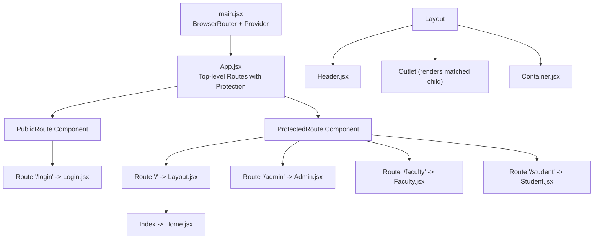

**Diagram sources**
- [main.jsx:9-17](file://Client/src/main.jsx#L9-L17)
- [App.jsx:22-50](file://Client/src/App.jsx#L22-L50)
- [App.jsx:105-115](file://Client/src/App.jsx#L105-L115)
- [Layout.jsx:10-19](file://Client/src/components/Layout.jsx#L10-L19)

**Section sources**
- [main.jsx:9-17](file://Client/src/main.jsx#L9-L17)
- [App.jsx:22-50](file://Client/src/App.jsx#L22-L50)
- [App.jsx:105-115](file://Client/src/App.jsx#L105-L115)

## Core Components
- **App.jsx**: Implements centralized route protection using ProtectedRoute and PublicRoute components, with automatic session verification on app load.
- **ProtectedRoute**: A reusable component that protects routes by checking authentication status and redirecting unauthenticated users to login.
- **PublicRoute**: A reusable component that protects the login page by redirecting authenticated users to their respective dashboards.
- **Layout.jsx**: Provides a shared layout with a header, outlet for nested routes, and a container wrapper.
- **Header.jsx**: Supplies navigation links and actions (login/logout, theme toggle).
- **Container.jsx**: A simple wrapper component for consistent layout spacing.
- **Home.jsx, Login.jsx, Admin.jsx, Faculty.jsx, Student.jsx**: Page components bound to specific routes with built-in loading states.
- **authSlice.js**: Authentication state with verifySession async thunk for session verification and loading state management.
- **store.js**: Central Redux store combining auth, theme, admin, and form slices.
- **adminSlice.js**: Admin dashboard data fetching and CRUD operations.
- **SideBar.jsx**: Sidebar used within the Admin dashboard to switch master data entities.

**Section sources**
- [App.jsx:22-50](file://Client/src/App.jsx#L22-L50)
- [App.jsx:105-115](file://Client/src/App.jsx#L105-L115)
- [Layout.jsx:7-19](file://Client/src/components/Layout.jsx#L7-L19)
- [Header.jsx:8-121](file://Client/src/components/Header.jsx#L8-L121)
- [Container.jsx:3-5](file://Client/src/components/Container.jsx#L3-L5)
- [Home.jsx:4-11](file://Client/src/pages/Home.jsx#L4-L11)
- [Login.jsx:56-85](file://Client/src/pages/Login.jsx#L56-L85)
- [Admin.jsx:17-71](file://Client/src/pages/dashboard/Admin.jsx#L17-L71)
- [Faculty.jsx:5-35](file://Client/src/pages/dashboard/Faculty.jsx#L5-L35)
- [Student.jsx:5-35](file://Client/src/pages/dashboard/Student.jsx#L5-L35)
- [authSlice.js:11-22](file://Client/src/store/auth/authSlice.js#L11-L22)
- [authSlice.js:24-61](file://Client/src/store/auth/authSlice.js#L24-L61)
- [store.js:7-14](file://Client/src/store/store.js#L7-L14)
- [adminSlice.js:1-173](file://Client/src/store/admin/adminSlice.js#L1-L173)
- [SideBar.jsx:3-46](file://Client/src/components/deshboard/SideBar.jsx#L3-L46)

## Architecture Overview
The routing architecture now uses centralized route protection through dedicated components:
- **Public routes**: Login page with automatic redirection for authenticated users.
- **Protected routes**: Admin, Faculty, and Student dashboards with automatic authentication checks.
- **Centralized protection**: ProtectedRoute and PublicRoute components handle authentication logic.
- **Session verification**: Automatic session verification on app load with loading states.
- **Shared layout**: A single layout wraps the protected area to provide consistent header and outlet rendering.

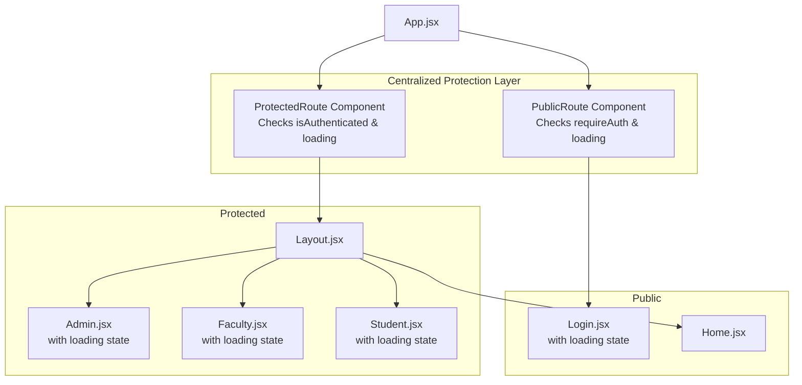

**Diagram sources**
- [App.jsx:22-50](file://Client/src/App.jsx#L22-L50)
- [App.jsx:105-115](file://Client/src/App.jsx#L105-L115)
- [Login.jsx:72-85](file://Client/src/pages/Login.jsx#L72-L85)
- [Admin.jsx:54-67](file://Client/src/pages/dashboard/Admin.jsx#L54-L67)
- [Faculty.jsx:18-31](file://Client/src/pages/dashboard/Faculty.jsx#L18-L31)
- [Student.jsx:18-31](file://Client/src/pages/dashboard/Student.jsx#L18-L31)

## Detailed Component Analysis

### Centralized Route Protection Implementation
The routing system now uses two reusable components for authentication-based navigation:

**ProtectedRoute Component**:
- Checks authentication status and loading state from Redux store
- Displays loading spinner while verifying session
- Redirects unauthenticated users to login with location state preservation
- Wraps all protected routes (admin, faculty, student dashboards)

**PublicRoute Component**:
- Handles login page protection with requireAuth parameter
- Redirects authenticated users to their respective dashboards
- Displays loading spinner during session verification
- Supports role-based redirection based on user data

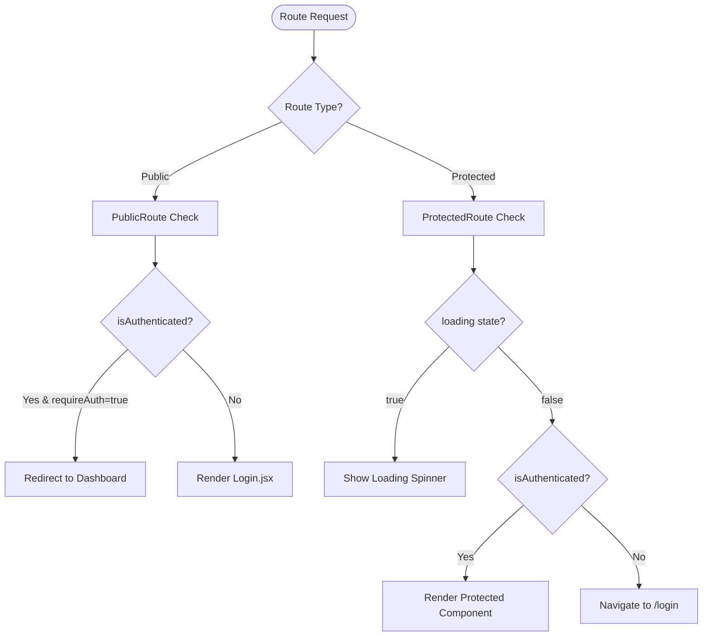

**Diagram sources**
- [App.jsx:22-50](file://Client/src/App.jsx#L22-L50)
- [App.jsx:105-115](file://Client/src/App.jsx#L105-L115)

**Section sources**
- [App.jsx:22-50](file://Client/src/App.jsx#L22-L50)
- [App.jsx:105-115](file://Client/src/App.jsx#L105-L115)

### Session Verification and Loading States
The system implements automatic session verification on app load:

**App.jsx**:
- Uses verifySession async thunk to check existing sessions
- Displays loading spinner during session verification
- Sets up theme persistence and Redux store integration

**authSlice.js**:
- verifySession async thunk handles backend session validation
- Manages loading states for better UX
- Updates authentication state based on verification results

**Protected Components**:
- Implement dual-layer protection with both route-level and component-level checks
- Show loading spinners while session verification is in progress
- Provide fallback navigation if verification fails

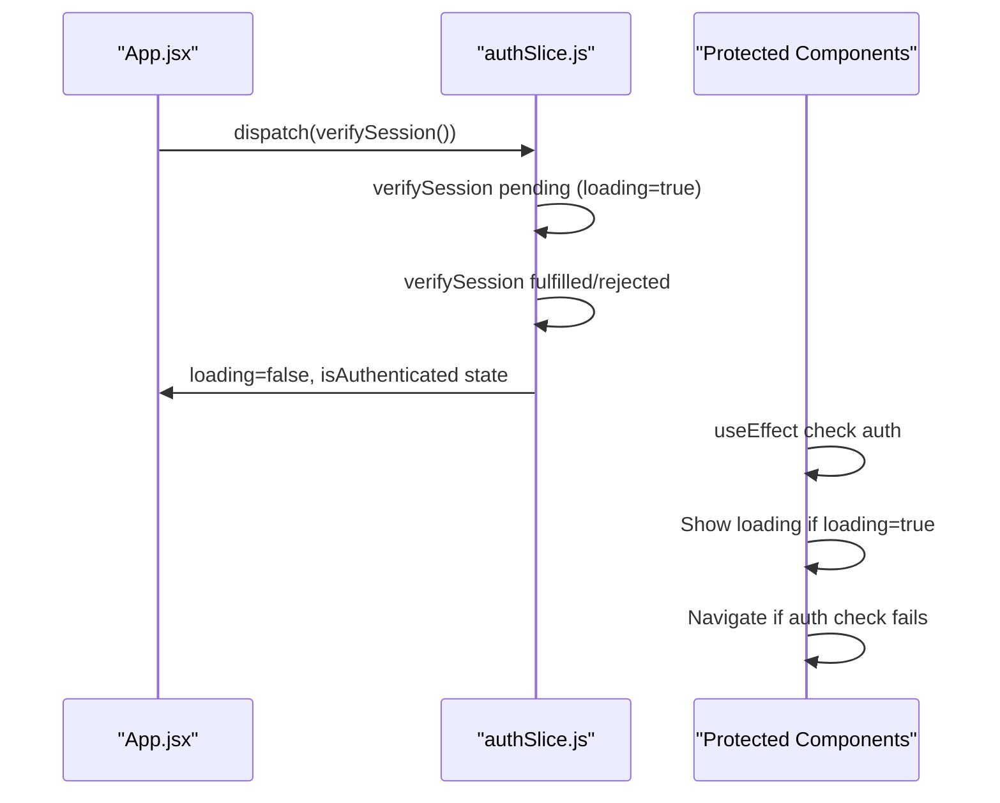

**Diagram sources**
- [App.jsx:56-59](file://Client/src/App.jsx#L56-L59)
- [authSlice.js:11-22](file://Client/src/store/auth/authSlice.js#L11-L22)
- [authSlice.js:39-55](file://Client/src/store/auth/authSlice.js#L39-L55)
- [Admin.jsx:47-52](file://Client/src/pages/dashboard/Admin.jsx#L47-L52)
- [Faculty.jsx:11-16](file://Client/src/pages/dashboard/Faculty.jsx#L11-L16)
- [Student.jsx:11-16](file://Client/src/pages/dashboard/Student.jsx#L11-L16)

**Section sources**
- [App.jsx:56-59](file://Client/src/App.jsx#L56-L59)
- [authSlice.js:11-22](file://Client/src/store/auth/authSlice.js#L11-L22)
- [authSlice.js:39-55](file://Client/src/store/auth/authSlice.js#L39-L55)
- [Admin.jsx:47-52](file://Client/src/pages/dashboard/Admin.jsx#L47-L52)
- [Faculty.jsx:11-16](file://Client/src/pages/dashboard/Faculty.jsx#L11-L16)
- [Student.jsx:11-16](file://Client/src/pages/dashboard/Student.jsx#L11-L16)

### Route Configuration and Nested Routing
The route configuration now uses centralized protection components:

**Top-level routes**:
- Route "/login" wrapped with PublicRoute component
- Route "/" renders Layout for nested protected routes
- Protected routes for "/admin", "/faculty", and "/student"

**Nested routes under Layout**:
- Index route renders Home component
- Protected routes for admin, faculty, and student dashboards

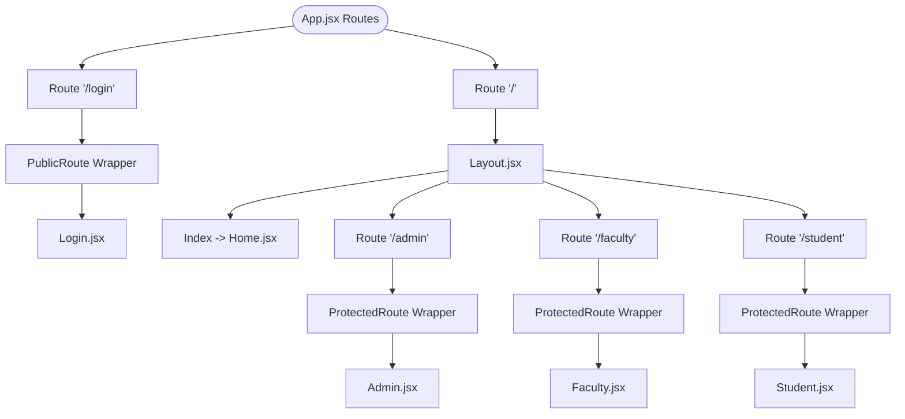

**Diagram sources**
- [App.jsx:105-115](file://Client/src/App.jsx#L105-L115)
- [Layout.jsx:10-19](file://Client/src/components/Layout.jsx#L10-L19)

**Section sources**
- [App.jsx:105-115](file://Client/src/App.jsx#L105-L115)

### Layout and Outlet Behavior
- Layout.jsx composes Header and Container around an Outlet. The Outlet renders whichever nested route matches under "/".
- The layout maintains consistent theming and provides a fixed header with navigation controls.
- Protected components implement their own loading states while the global loading state is managed centrally.

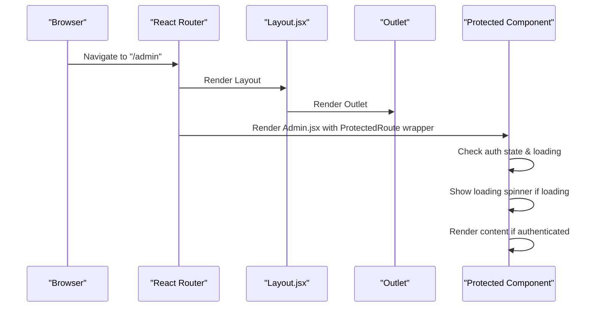

**Diagram sources**
- [Layout.jsx:10-19](file://Client/src/components/Layout.jsx#L10-L19)

**Section sources**
- [Layout.jsx:7-19](file://Client/src/components/Layout.jsx#L7-L19)

### Role-Based Access Control and Programmatic Navigation
The system now provides enhanced role-based access control:

**Login.jsx**:
- Handles authentication submission and role determination
- Performs immediate role-based redirection after successful login
- Shows loading states during session verification

**Protected Components**:
- Implement dual-layer protection (route-level + component-level)
- Show loading spinners while session verification is in progress
- Provide fallback navigation if authentication fails
- Admin component fetches comprehensive master data on successful authentication

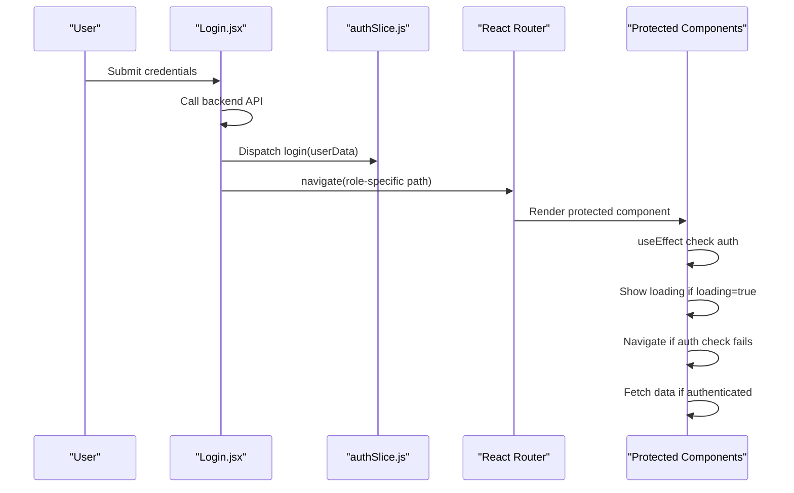

**Diagram sources**
- [Login.jsx:167-178](file://Client/src/pages/Login.jsx#L167-L178)
- [authSlice.js:28-37](file://Client/src/store/auth/authSlice.js#L28-L37)
- [Admin.jsx:29-45](file://Client/src/pages/dashboard/Admin.jsx#L29-L45)
- [Faculty.jsx:11-16](file://Client/src/pages/dashboard/Faculty.jsx#L11-L16)
- [Student.jsx:11-16](file://Client/src/pages/dashboard/Student.jsx#L11-L16)

**Section sources**
- [Login.jsx:167-178](file://Client/src/pages/Login.jsx#L167-L178)
- [authSlice.js:28-37](file://Client/src/store/auth/authSlice.js#L28-L37)
- [Admin.jsx:29-45](file://Client/src/pages/dashboard/Admin.jsx#L29-L45)
- [Faculty.jsx:11-16](file://Client/src/pages/dashboard/Faculty.jsx#L11-L16)
- [Student.jsx:11-16](file://Client/src/pages/dashboard/Student.jsx#L11-L16)

### Navigation Patterns and Authentication-Dependent Routing
The navigation system now provides improved authentication-dependent routing:

**Programmatic navigation**:
- Login.jsx uses navigate to send users to role-specific paths after successful login
- Protected components use navigate to redirect on failed authentication checks
- Header.jsx uses navigate for login/logout actions

**Enhanced authentication flow**:
- Centralized route protection through ProtectedRoute and PublicRoute components
- Automatic session verification on app load
- Loading states throughout the authentication process
- Role-based redirection with requireAuth parameter

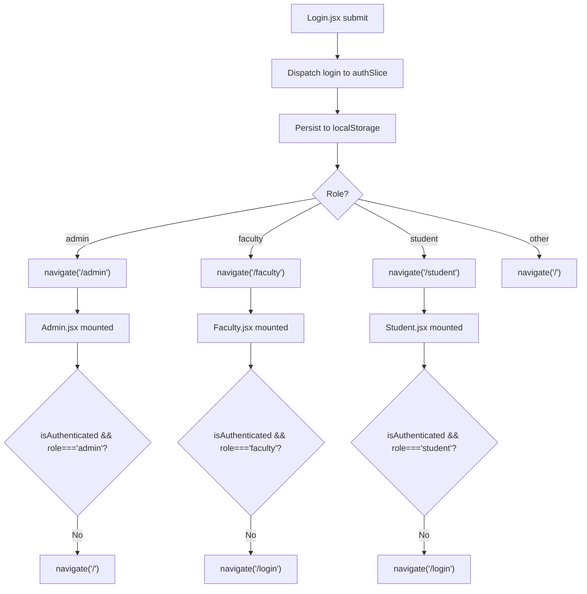

**Diagram sources**
- [Login.jsx:167-178](file://Client/src/pages/Login.jsx#L167-L178)
- [authSlice.js:28-37](file://Client/src/store/auth/authSlice.js#L28-L37)
- [Admin.jsx:47-52](file://Client/src/pages/dashboard/Admin.jsx#L47-L52)
- [Faculty.jsx:11-16](file://Client/src/pages/dashboard/Faculty.jsx#L11-L16)
- [Student.jsx:11-16](file://Client/src/pages/dashboard/Student.jsx#L11-L16)

**Section sources**
- [Login.jsx:167-178](file://Client/src/pages/Login.jsx#L167-L178)
- [authSlice.js:28-37](file://Client/src/store/auth/authSlice.js#L28-L37)
- [Header.jsx:16-36](file://Client/src/components/Header.jsx#L16-L36)

### Relationship Between Routes and Page Components
The route-to-component mapping now includes centralized protection:

- **"/login"** → PublicRoute wrapper → Login.jsx
- **"/" (index under Layout)** → Layout.jsx → Home.jsx
- **"/admin"** → ProtectedRoute wrapper → Admin.jsx
- **"/faculty"** → ProtectedRoute wrapper → Faculty.jsx
- **"/student"** → ProtectedRoute wrapper → Student.jsx
- **Layout.jsx** wraps Home, Admin, Faculty, and Student under the "/" route with centralized protection

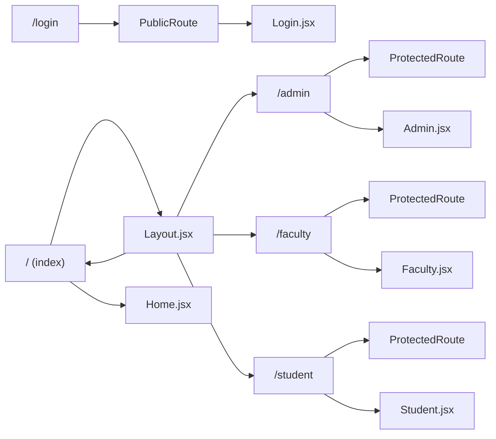

**Diagram sources**
- [App.jsx:105-115](file://Client/src/App.jsx#L105-L115)
- [Layout.jsx:10-19](file://Client/src/components/Layout.jsx#L10-L19)

**Section sources**
- [App.jsx:105-115](file://Client/src/App.jsx#L105-L115)
- [Layout.jsx:10-19](file://Client/src/components/Layout.jsx#L10-L19)

### Protected Routes and Role-Based Access Patterns
The centralized protection system provides enhanced security:

**ProtectedRoute Pattern**:
- Wraps all protected routes with authentication checks
- Handles loading states and redirects appropriately
- Preserves location state for seamless navigation

**PublicRoute Pattern**:
- Protects the login page with requireAuth parameter
- Redirects authenticated users to appropriate dashboards
- Prevents authenticated users from accessing login page

**Component-Level Guards**:
- Admin.jsx, Faculty.jsx, and Student.jsx implement additional runtime checks
- Show loading spinners during session verification
- Provide fallback navigation if authentication fails

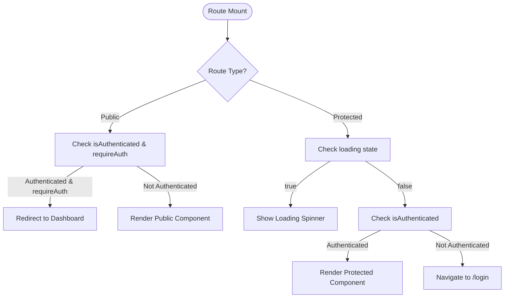

**Diagram sources**
- [App.jsx:22-50](file://Client/src/App.jsx#L22-L50)
- [App.jsx:34-50](file://Client/src/App.jsx#L34-L50)
- [Admin.jsx:47-52](file://Client/src/pages/dashboard/Admin.jsx#L47-L52)
- [Faculty.jsx:11-16](file://Client/src/pages/dashboard/Faculty.jsx#L11-L16)
- [Student.jsx:11-16](file://Client/src/pages/dashboard/Student.jsx#L11-L16)

**Section sources**
- [App.jsx:22-50](file://Client/src/App.jsx#L22-L50)
- [App.jsx:34-50](file://Client/src/App.jsx#L34-L50)
- [Admin.jsx:47-52](file://Client/src/pages/dashboard/Admin.jsx#L47-L52)
- [Faculty.jsx:11-16](file://Client/src/pages/dashboard/Faculty.jsx#L11-L16)
- [Student.jsx:11-16](file://Client/src/pages/dashboard/Student.jsx#L11-L16)

### Examples of Programmatic Navigation, Route Parameters, and Query Strings
The system provides enhanced programmatic navigation capabilities:

**Programmatic navigation**:
- Login.jsx uses navigate to move users to role-specific paths after login
- Protected components use navigate to redirect on authentication failures
- Header.jsx uses navigate for login/logout actions
- Location state preservation for seamless navigation flow

**Route parameters and query strings**:
- The current implementation focuses on role-based routing rather than dynamic parameters
- Route parameters and query strings can be integrated using React Router APIs
- State management for route parameters can be handled through Redux if needed

**Enhanced navigation flow**:
- Centralized route protection reduces code duplication
- Loading states improve user experience during authentication
- Session verification prevents stale authentication states

**Section sources**
- [Login.jsx:167-178](file://Client/src/pages/Login.jsx#L167-L178)
- [Admin.jsx:47-52](file://Client/src/pages/dashboard/Admin.jsx#L47-L52)
- [Faculty.jsx:11-16](file://Client/src/pages/dashboard/Faculty.jsx#L11-L16)
- [Student.jsx:11-16](file://Client/src/pages/dashboard/Student.jsx#L11-L16)
- [Header.jsx:16-36](file://Client/src/components/Header.jsx#L16-L36)

### Nested Route Handling and Layout Wrapping
The nested routing system now includes centralized protection:

**Layout wrapping**:
- The nested routing under Layout.jsx allows Home, Admin, Faculty, and Student to share a common header and outlet
- ProtectedRoute components wrap each nested route for authentication
- Outlet renders the currently matched child route with protection

**Protection flow**:
- Layout renders with Header and Outlet
- ProtectedRoute checks authentication before rendering child components
- Loading states are handled at both route and component levels

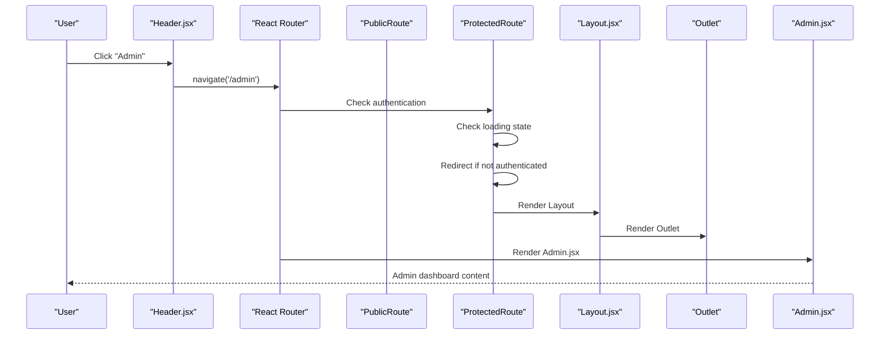

**Diagram sources**
- [Header.jsx:16-36](file://Client/src/components/Header.jsx#L16-L36)
- [App.jsx:22-50](file://Client/src/App.jsx#L22-L50)
- [Layout.jsx:10-19](file://Client/src/components/Layout.jsx#L10-L19)
- [Admin.jsx:17-71](file://Client/src/pages/dashboard/Admin.jsx#L17-L71)

**Section sources**
- [Header.jsx:16-36](file://Client/src/components/Header.jsx#L16-L36)
- [App.jsx:22-50](file://Client/src/App.jsx#L22-L50)
- [Layout.jsx:10-19](file://Client/src/components/Layout.jsx#L10-L19)

## Dependency Analysis
The routing system now includes enhanced dependencies for centralized protection:

**App.jsx dependencies**:
- React Router for route declarations and navigation
- Redux for authentication state management
- ProtectedRoute and PublicRoute components for centralized protection
- verifySession async thunk for session verification

**ProtectedRoute dependencies**:
- useSelector hook for authentication state
- useLocation hook for preserving navigation state
- Navigate component for programmatic redirection

**PublicRoute dependencies**:
- requireAuth prop for login page protection
- Role-based redirection logic
- Loading state handling

**Protected components dependencies**:
- Component-level useEffect hooks for runtime authentication checks
- Loading state management for better UX
- Data fetching logic for authenticated users

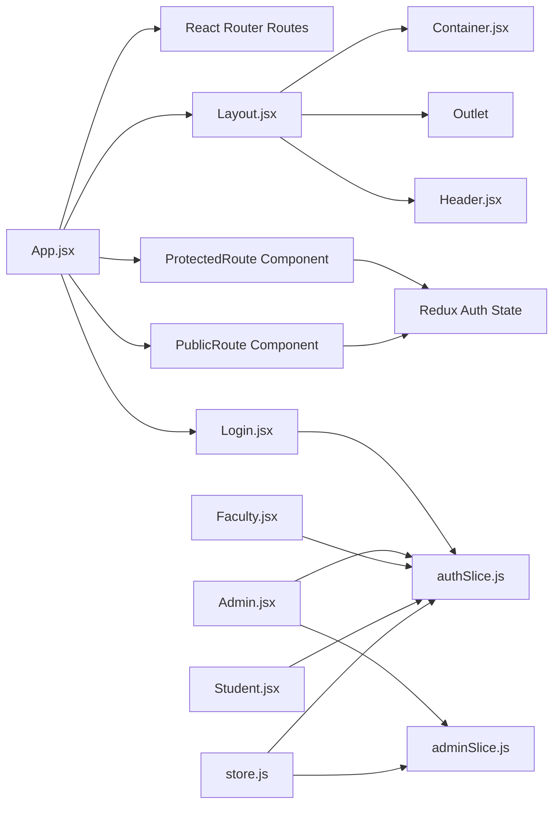

**Diagram sources**
- [App.jsx:22-50](file://Client/src/App.jsx#L22-L50)
- [App.jsx:105-115](file://Client/src/App.jsx#L105-L115)
- [Layout.jsx:10-19](file://Client/src/components/Layout.jsx#L10-L19)
- [Header.jsx:8-121](file://Client/src/components/Header.jsx#L8-L121)
- [authSlice.js:11-22](file://Client/src/store/auth/authSlice.js#L11-L22)
- [authSlice.js:24-61](file://Client/src/store/auth/authSlice.js#L24-L61)
- [adminSlice.js:1-173](file://Client/src/store/admin/adminSlice.js#L1-L173)
- [store.js:7-14](file://Client/src/store/store.js#L7-L14)

**Section sources**
- [store.js:7-14](file://Client/src/store/store.js#L7-L14)
- [authSlice.js:11-22](file://Client/src/store/auth/authSlice.js#L11-L22)
- [authSlice.js:24-61](file://Client/src/store/auth/authSlice.js#L24-L61)
- [adminSlice.js:1-173](file://Client/src/store/admin/adminSlice.js#L1-L173)

## Performance Considerations
The centralized protection system provides several performance benefits:

**Optimized authentication checks**:
- Centralized route protection reduces code duplication
- Loading states prevent unnecessary re-renders during authentication
- Session verification occurs only once on app load

**Improved user experience**:
- Loading spinners provide visual feedback during authentication
- Location state preservation maintains navigation context
- Role-based redirection prevents unnecessary route transitions

**Memory efficiency**:
- ProtectedRoute and PublicRoute components are reusable
- Loading states are managed centrally
- Authentication state is persisted in Redux for quick access

**Scalability considerations**:
- Easy addition of new protected routes
- Consistent authentication behavior across all protected components
- Centralized error handling for authentication failures

## Troubleshooting Guide
The centralized protection system provides better error handling and debugging:

**Authentication issues**:
- Verify session verification is working correctly
- Check loading states during authentication process
- Ensure ProtectedRoute and PublicRoute components are properly wrapped

**Navigation problems**:
- Verify route protection is applied to all protected routes
- Check location state preservation for seamless navigation
- Ensure requireAuth prop is correctly set for login page

**Loading state issues**:
- Verify verifySession async thunk is properly dispatched
- Check loading state management in authSlice
- Ensure protected components handle loading states correctly

**Session verification failures**:
- Check backend session validation endpoint
- Verify authentication tokens are properly stored
- Ensure Redux state is correctly updated after verification

**Component-level authentication failures**:
- Verify useEffect hooks are properly implemented
- Check authentication state in Redux store
- Ensure navigation logic is correctly implemented

**Section sources**
- [authSlice.js:11-22](file://Client/src/store/auth/authSlice.js#L11-L22)
- [authSlice.js:39-55](file://Client/src/store/auth/authSlice.js#L39-L55)
- [App.jsx:22-50](file://Client/src/App.jsx#L22-L50)
- [App.jsx:34-50](file://Client/src/App.jsx#L34-L50)
- [Admin.jsx:47-52](file://Client/src/pages/dashboard/Admin.jsx#L47-L52)
- [Faculty.jsx:11-16](file://Client/src/pages/dashboard/Faculty.jsx#L11-L16)
- [Student.jsx:11-16](file://Client/src/pages/dashboard/Student.jsx#L11-L16)

## Conclusion
The routing system has been significantly enhanced with centralized route protection through ProtectedRoute and PublicRoute components. The implementation replaces manual redirect logic with a more robust and maintainable approach, providing better security and user experience. Key improvements include automatic session verification on app load, loading states throughout the authentication process, and role-based redirection with requireAuth parameter.

The system now provides a clean separation between public and protected routes with centralized protection, while maintaining the shared layout pattern for authenticated sections. The dual-layer protection (route-level and component-level) ensures comprehensive authentication coverage, and the loading states improve user experience during authentication transitions.

The current implementation focuses on straightforward nested routing with centralized protection and does not include dynamic route parameters or query string handling, but can be extended to support these patterns as requirements evolve. The centralized protection approach makes the system more maintainable and scalable for future enhancements.