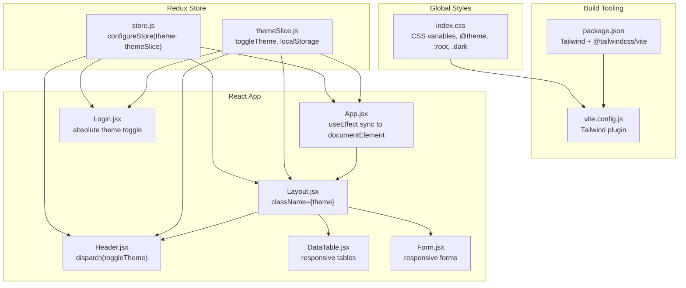
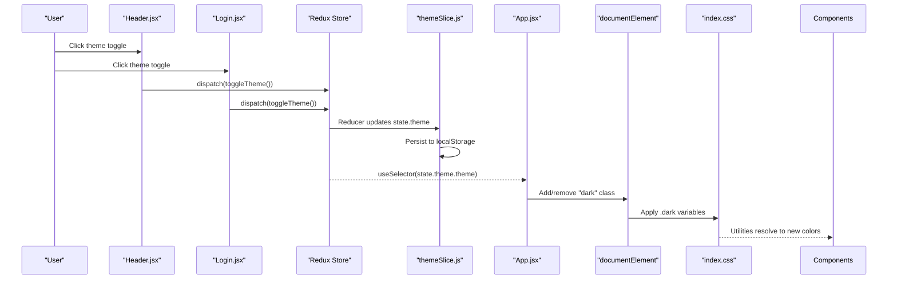
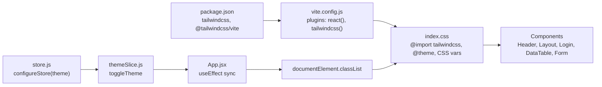

# Styling & Theming System

<cite>
**Referenced Files in This Document**
- [themeSlice.js](file://Client/src/store/theme/themeSlice.js)
- [App.jsx](file://Client/src/App.jsx)
- [index.css](file://Client/src/index.css)
- [store.js](file://Client/src/store/store.js)
- [Layout.jsx](file://Client/src/components/Layout.jsx)
- [Header.jsx](file://Client/src/components/Header.jsx)
- [Login.jsx](file://Client/src/pages/Login.jsx)
- [DataTable.jsx](file://Client/src/components/deshboard/DataTable.jsx)
- [Form.jsx](file://Client/src/components/deshboard/Form.jsx)
- [vite.config.js](file://Client/vite.config.js)
- [package.json](file://Client/package.json)
</cite>

## Table of Contents
1. [Introduction](#introduction)
2. [Project Structure](#project-structure)
3. [Core Components](#core-components)
4. [Architecture Overview](#architecture-overview)
5. [Detailed Component Analysis](#detailed-component-analysis)
6. [Dependency Analysis](#dependency-analysis)
7. [Performance Considerations](#performance-considerations)
8. [Troubleshooting Guide](#troubleshooting-guide)
9. [Conclusion](#conclusion)

## Introduction
This document explains the styling and theming system used throughout the application. It covers the Tailwind CSS configuration, the utility-first styling approach, the dark/light theme implementation, responsive design patterns, custom CSS utilities, and how Redux state integrates with DOM classes to affect component rendering and user experience.

## Project Structure
The styling and theming system spans three layers:
- Global styles and theme tokens in CSS
- Tailwind configuration via Vite plugin
- Redux-based theme state management and DOM class synchronization

**Diagram sources**
- [index.css:1-42](file://Client/src/index.css#L1-L42)
- [vite.config.js:1-17](file://Client/vite.config.js#L1-L17)
- [package.json:1-36](file://Client/package.json#L1-L36)
- [store.js:1-15](file://Client/src/store/store.js#L1-L15)
- [themeSlice.js:1-29](file://Client/src/store/theme/themeSlice.js#L1-L29)
- [App.jsx:13-24](file://Client/src/App.jsx#L13-L24)
- [Layout.jsx:7-11](file://Client/src/components/Layout.jsx#L7-L11)
- [Header.jsx:25-28](file://Client/src/components/Header.jsx#L25-L28)
- [Login.jsx:49-64](file://Client/src/pages/Login.jsx#L49-L64)
- [DataTable.jsx:27-81](file://Client/src/components/deshboard/DataTable.jsx#L27-L81)
- [Form.jsx:64-123](file://Client/src/components/deshboard/Form.jsx#L64-L123)

**Section sources**
- [index.css:1-42](file://Client/src/index.css#L1-L42)
- [vite.config.js:1-17](file://Client/vite.config.js#L1-L17)
- [package.json:12-22](file://Client/package.json#L12-L22)
- [store.js:7-14](file://Client/src/store/store.js#L7-L14)
- [themeSlice.js:1-29](file://Client/src/store/theme/themeSlice.js#L1-L29)
- [App.jsx:13-24](file://Client/src/App.jsx#L13-L24)
- [Layout.jsx:7-11](file://Client/src/components/Layout.jsx#L7-L11)
- [Header.jsx:25-28](file://Client/src/components/Header.jsx#L25-L28)
- [Login.jsx:49-64](file://Client/src/pages/Login.jsx#L49-L64)
- [DataTable.jsx:27-81](file://Client/src/components/deshboard/DataTable.jsx#L27-L81)
- [Form.jsx:64-123](file://Client/src/components/deshboard/Form.jsx#L64-L123)

## Core Components
- Tailwind CSS and CSS variables: Centralized color tokens and theme-aware variables are defined globally and consumed by Tailwind utilities.
- Redux theme slice: Manages theme state, persists to localStorage, and exposes a toggle action.
- DOM class synchronization: The root App component listens to theme changes and toggles the "dark" class on document.documentElement.
- Component-level usage: Components apply Tailwind utilities with CSS variable-based colors and responsive modifiers.

Key implementation references:
- Theme state initialization and persistence: [themeSlice.js:3-22](file://Client/src/store/theme/themeSlice.js#L3-L22)
- Redux store composition: [store.js:7-14](file://Client/src/store/store.js#L7-L14)
- DOM class switching: [App.jsx:16-24](file://Client/src/App.jsx#L16-L24)
- Global CSS variables and @theme: [index.css:4-41](file://Client/src/index.css#L4-L41)

**Section sources**
- [themeSlice.js:1-29](file://Client/src/store/theme/themeSlice.js#L1-L29)
- [store.js:1-15](file://Client/src/store/store.js#L1-L15)
- [App.jsx:13-24](file://Client/src/App.jsx#L13-L24)
- [index.css:4-41](file://Client/src/index.css#L4-L41)

## Architecture Overview
The theming pipeline connects Redux state to DOM classes and CSS variables, enabling Tailwind utilities to switch color schemes automatically.

**Diagram sources**
- [Header.jsx:25-28](file://Client/src/components/Header.jsx#L25-L28)
- [Login.jsx:50-54](file://Client/src/pages/Login.jsx#L50-L54)
- [themeSlice.js:19-22](file://Client/src/store/theme/themeSlice.js#L19-L22)
- [App.jsx:16-24](file://Client/src/App.jsx#L16-L24)
- [index.css:26-35](file://Client/src/index.css#L26-L35)

## Detailed Component Analysis

### Tailwind CSS Configuration and Utility-First Approach
- CSS variables and @theme: The global stylesheet defines CSS variables for text, background, primary, secondary, accent, surface, surface-hover, and border. The @theme block maps Tailwind color utilities to these variables.
- Root and dark mode overrides: :root sets light-mode defaults; .dark overrides the same variables for dark mode. This ensures Tailwind utilities like bg-background, text-text, border-border, and ring-primary consistently reflect the active theme.
- Font stack: Inter is imported and applied globally for consistent typography.

Implementation references:
- Variable definitions and @theme: [index.css:4-13](file://Client/src/index.css#L4-L13)
- Light defaults: [index.css:15-24](file://Client/src/index.css#L15-L24)
- Dark overrides: [index.css:26-35](file://Client/src/index.css#L26-L35)
- Body font and background: [index.css:37-41](file://Client/src/index.css#L37-L41)

**Section sources**
- [index.css:4-41](file://Client/src/index.css#L4-L41)

### Theme State Management (Redux)
- Initial theme detection: Reads from localStorage; falls back to system preference (prefers-color-scheme).
- Toggle reducer: Switches between "light" and "dark", persisting the choice to localStorage.
- Exported action: toggleTheme is used by components to trigger theme changes.

Implementation references:
- Initial theme resolution: [themeSlice.js:3-9](file://Client/src/store/theme/themeSlice.js#L3-L9)
- Initial state: [themeSlice.js:11-13](file://Client/src/store/theme/themeSlice.js#L11-L13)
- Toggle reducer and persistence: [themeSlice.js:19-22](file://Client/src/store/theme/themeSlice.js#L19-L22)
- Action export: [themeSlice.js:26](file://Client/src/store/theme/themeSlice.js#L26)

**Section sources**
- [themeSlice.js:1-29](file://Client/src/store/theme/themeSlice.js#L1-L29)

### Automatic DOM Class Switching (App.jsx)
- Effect hook listens to theme changes and synchronizes documentElement.classList with the "dark" class.
- Persists the chosen theme to localStorage during the effect to maintain consistency across reloads.

Implementation references:
- Theme selection and effect: [App.jsx:14](file://Client/src/App.jsx#L14)
- DOM class manipulation: [App.jsx:16-24](file://Client/src/App.jsx#L16-L24)

**Section sources**
- [App.jsx:13-24](file://Client/src/App.jsx#L13-L24)

### Theme-Aware Components

#### Layout.jsx
- Applies the theme as a className to the root layout wrapper, ensuring descendant components inherit the correct CSS variable context.
- Uses Tailwind utilities with CSS variables for backgrounds, borders, and spacing.

Implementation references:
- Theme className on layout: [Layout.jsx:11](file://Client/src/components/Layout.jsx#L11)
- Background and border utilities: [Layout.jsx:13-17](file://Client/src/components/Layout.jsx#L13-L17)

**Section sources**
- [Layout.jsx:7-19](file://Client/src/components/Layout.jsx#L7-L19)

#### Header.jsx
- Dispatches toggleTheme on click to flip the theme.
- Uses CSS variable-based utilities for text, backgrounds, and hover states.
- Responsive navigation with mobile-first classes and dark-mode icons.

Implementation references:
- Theme toggle handler: [Header.jsx:25-28](file://Client/src/components/Header.jsx#L25-L28)
- Text and hover utilities: [Header.jsx:68](file://Client/src/components/Header.jsx#L68)
- Responsive breakpoints and icons: [Header.jsx:47-106](file://Client/src/components/Header.jsx#L47-L106)

**Section sources**
- [Header.jsx:8-122](file://Client/src/components/Header.jsx#L8-L122)

#### Login.jsx
- Provides an absolute-positioned theme toggle button with dark/light SVG icons.
- Uses CSS variable-based utilities for background, border, text, and focus states.
- Responsive container and form layout with grid-like spacing.

Implementation references:
- Theme toggle button: [Login.jsx:50-64](file://Client/src/pages/Login.jsx#L50-L64)
- Background and form utilities: [Login.jsx:48](file://Client/src/pages/Login.jsx#L48)
- Input and button utilities: [Login.jsx:77-103](file://Client/src/pages/Login.jsx#L77-L103)

**Section sources**
- [Login.jsx:9-116](file://Client/src/pages/Login.jsx#L9-L116)

#### DataTable.jsx
- Responsive table with horizontal scrolling on small screens.
- Uses CSS variable-based utilities for header, rows, borders, and hover states.
- Conditional dark variant classes for break rows.

Implementation references:
- Scroll container and table utilities: [DataTable.jsx:27-81](file://Client/src/components/deshboard/DataTable.jsx#L27-L81)
- Row hover and border utilities: [DataTable.jsx:53](file://Client/src/components/deshboard/DataTable.jsx#L53)
- Dark variant for break slots: [DataTable.jsx:283](file://Client/src/components/deshboard/DataTable.jsx#L283)

**Section sources**
- [DataTable.jsx:1-86](file://Client/src/components/deshboard/DataTable.jsx#L1-L86)

#### Form.jsx
- Responsive grid layout for form fields across small, medium, and large screens.
- Uses CSS variable-based utilities for inputs, labels, buttons, and borders.
- Focus states and transitions for interactive elements.

Implementation references:
- Grid and field utilities: [Form.jsx:64-96](file://Client/src/components/deshboard/Form.jsx#L64-L96)
- Input focus and placeholder utilities: [Form.jsx:92](file://Client/src/components/deshboard/Form.jsx#L92)
- Button utilities and transitions: [Form.jsx:104-122](file://Client/src/components/deshboard/Form.jsx#L104-L122)

**Section sources**
- [Form.jsx:1-127](file://Client/src/components/deshboard/Form.jsx#L1-L127)

### Responsive Design Patterns
- Mobile-first approach: Base styles apply to small screens; modifiers for larger breakpoints (sm, md, lg).
- Navigation visibility: Desktop navigation appears at md breakpoint; mobile menu behavior is implicit in the layout.
- Table responsiveness: Horizontal overflow scroll for small screens; column widths adapt via min-w and responsive padding.
- Form responsiveness: Grid layout adjusts from single column to multiple columns based on screen size.

Examples:
- Header navigation breakpoint: [Header.jsx:47](file://Client/src/components/Header.jsx#L47)
- DataTable horizontal scroll: [DataTable.jsx:264](file://Client/src/components/deshboard/DataTable.jsx#L264)
- Form grid breakpoints: [Form.jsx:64](file://Client/src/components/deshboard/Form.jsx#L64)

**Section sources**
- [Header.jsx:47-106](file://Client/src/components/Header.jsx#L47-L106)
- [DataTable.jsx:264-278](file://Client/src/components/deshboard/DataTable.jsx#L264-L278)
- [Form.jsx:64-96](file://Client/src/components/deshboard/Form.jsx#L64-L96)

### Color Schemes and Typography Scaling
- Color scheme: Primary, secondary, accent, background, text, surface, surface-hover, and border are defined as CSS variables and mapped to Tailwind utilities via @theme.
- Typography: Inter font is applied globally; text sizes and weights are controlled via Tailwind utilities (e.g., text-2xl, font-bold, text-sm).

References:
- @theme mapping: [index.css:4-13](file://Client/src/index.css#L4-L13)
- Variables: [index.css:15-35](file://Client/src/index.css#L15-L35)
- Global font: [index.css:40](file://Client/src/index.css#L40)

**Section sources**
- [index.css:4-41](file://Client/src/index.css#L4-L41)

### Breakpoint Management
- Tailwind default breakpoints are used implicitly via utilities (sm, md, lg).
- Components apply responsive prefixes to control layout and spacing across devices.

References:
- Header responsive classes: [Header.jsx:39](file://Client/src/components/Header.jsx#L39)
- DataTable responsive headers: [DataTable.jsx:271-278](file://Client/src/components/deshboard/DataTable.jsx#L271-L278)
- Form grid classes: [Form.jsx:64](file://Client/src/components/deshboard/Form.jsx#L64)

**Section sources**
- [Header.jsx:39](file://Client/src/components/Header.jsx#L39)
- [DataTable.jsx:271-278](file://Client/src/components/deshboard/DataTable.jsx#L271-L278)
- [Form.jsx:64](file://Client/src/components/deshboard/Form.jsx#L64)

## Dependency Analysis
The theming system depends on:
- Tailwind CSS and the Tailwind Vite plugin for utility generation
- Redux Toolkit for state management
- localStorage for persistence
- React hooks for effect-driven DOM synchronization

**Diagram sources**
- [package.json:12-22](file://Client/package.json#L12-L22)
- [vite.config.js:3](file://Client/vite.config.js#L3)
- [index.css:1](file://Client/src/index.css#L1)
- [store.js:7-14](file://Client/src/store/store.js#L7-L14)
- [themeSlice.js:19-22](file://Client/src/store/theme/themeSlice.js#L19-L22)
- [App.jsx:16-24](file://Client/src/App.jsx#L16-L24)
- [Header.jsx:25-28](file://Client/src/components/Header.jsx#L25-L28)
- [Login.jsx:50-54](file://Client/src/pages/Login.jsx#L50-L54)

**Section sources**
- [package.json:12-22](file://Client/package.json#L12-L22)
- [vite.config.js:1-17](file://Client/vite.config.js#L1-L17)
- [index.css:1-42](file://Client/src/index.css#L1-L42)
- [store.js:1-15](file://Client/src/store/store.js#L1-L15)
- [themeSlice.js:1-29](file://Client/src/store/theme/themeSlice.js#L1-L29)
- [App.jsx:13-24](file://Client/src/App.jsx#L13-L24)
- [Header.jsx:25-28](file://Client/src/components/Header.jsx#L25-L28)
- [Login.jsx:50-54](file://Client/src/pages/Login.jsx#L50-L54)

## Performance Considerations
- CSS variable-based theming avoids generating theme-specific utility variants, reducing bundle size compared to duplicating classes for each theme.
- Tailwind JIT compilation via the Vite plugin optimizes utility generation at build time.
- Minimal JavaScript logic for theme switching reduces re-renders; the effect runs only when theme state changes.

[No sources needed since this section provides general guidance]

## Troubleshooting Guide
- Theme does not persist after refresh:
  - Verify localStorage keys and initial theme resolution logic.
  - Confirm the effect in App.jsx adds/removes the "dark" class based on state.
  - References: [themeSlice.js:3-9](file://Client/src/store/theme/themeSlice.js#L3-L9), [App.jsx:16-24](file://Client/src/App.jsx#L16-L24)
- Dark mode icons not visible:
  - Ensure the "dark" class is present on documentElement so .dark variables apply.
  - References: [index.css:26-35](file://Client/src/index.css#L26-L35), [App.jsx:16-24](file://Client/src/App.jsx#L16-L24)
- Components not respecting theme colors:
  - Confirm components use CSS variable-based utilities (e.g., bg-background, text-text).
  - References: [Header.jsx:68](file://Client/src/components/Header.jsx#L68), [Login.jsx:48](file://Client/src/pages/Login.jsx#L48)
- Responsive layout issues:
  - Check responsive prefixes (sm, md, lg) on layout containers and tables.
  - References: [Header.jsx:39](file://Client/src/components/Header.jsx#L39), [DataTable.jsx:264](file://Client/src/components/deshboard/DataTable.jsx#L264)

**Section sources**
- [themeSlice.js:3-9](file://Client/src/store/theme/themeSlice.js#L3-L9)
- [App.jsx:16-24](file://Client/src/App.jsx#L16-L24)
- [index.css:26-35](file://Client/src/index.css#L26-L35)
- [Header.jsx:39](file://Client/src/components/Header.jsx#L39)
- [DataTable.jsx:264](file://Client/src/components/deshboard/DataTable.jsx#L264)

## Conclusion
The application employs a clean, scalable theming system:
- Tailwind CSS with CSS variables and @theme enables consistent, theme-aware utilities.
- Redux manages theme state and persistence, while a simple effect synchronizes the DOM class.
- Components uniformly adopt responsive and theme-aware classes, ensuring cohesive visuals across light and dark modes.

[No sources needed since this section summarizes without analyzing specific files]