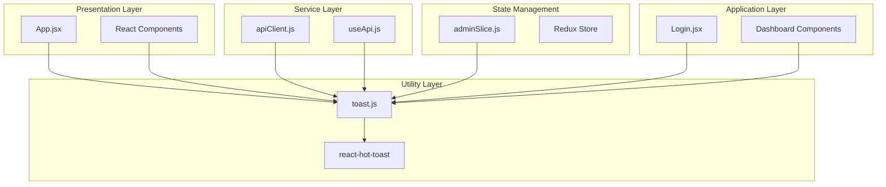
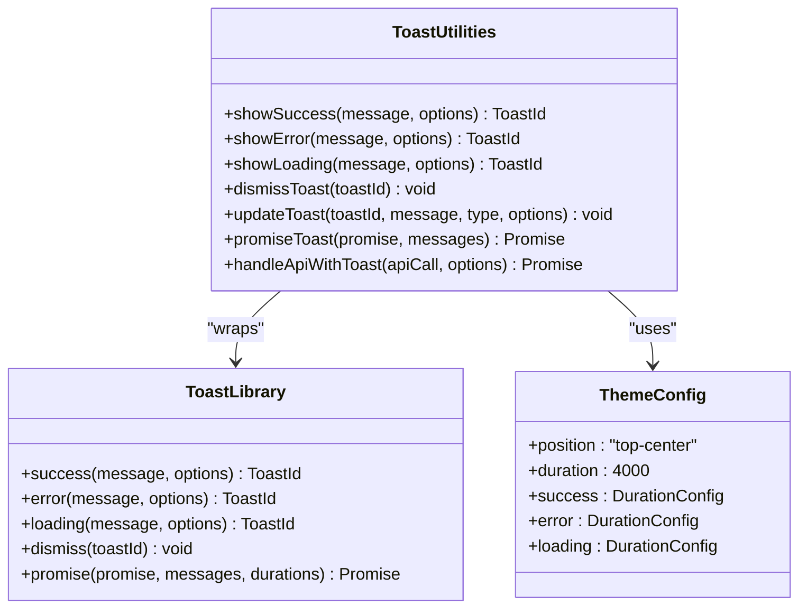
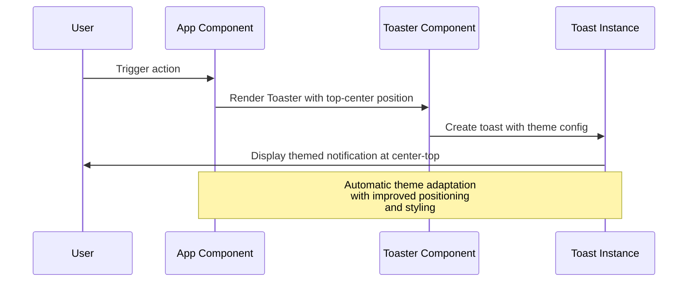
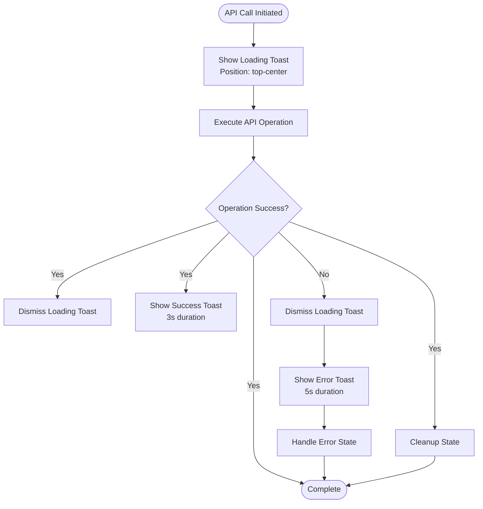
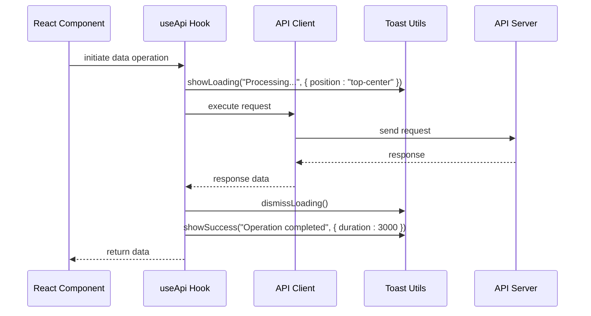
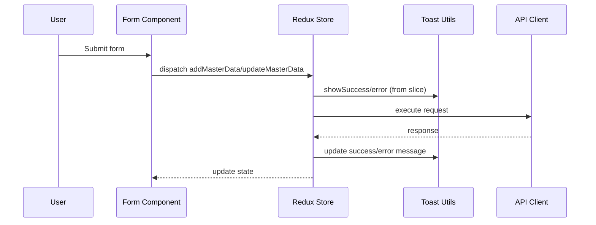
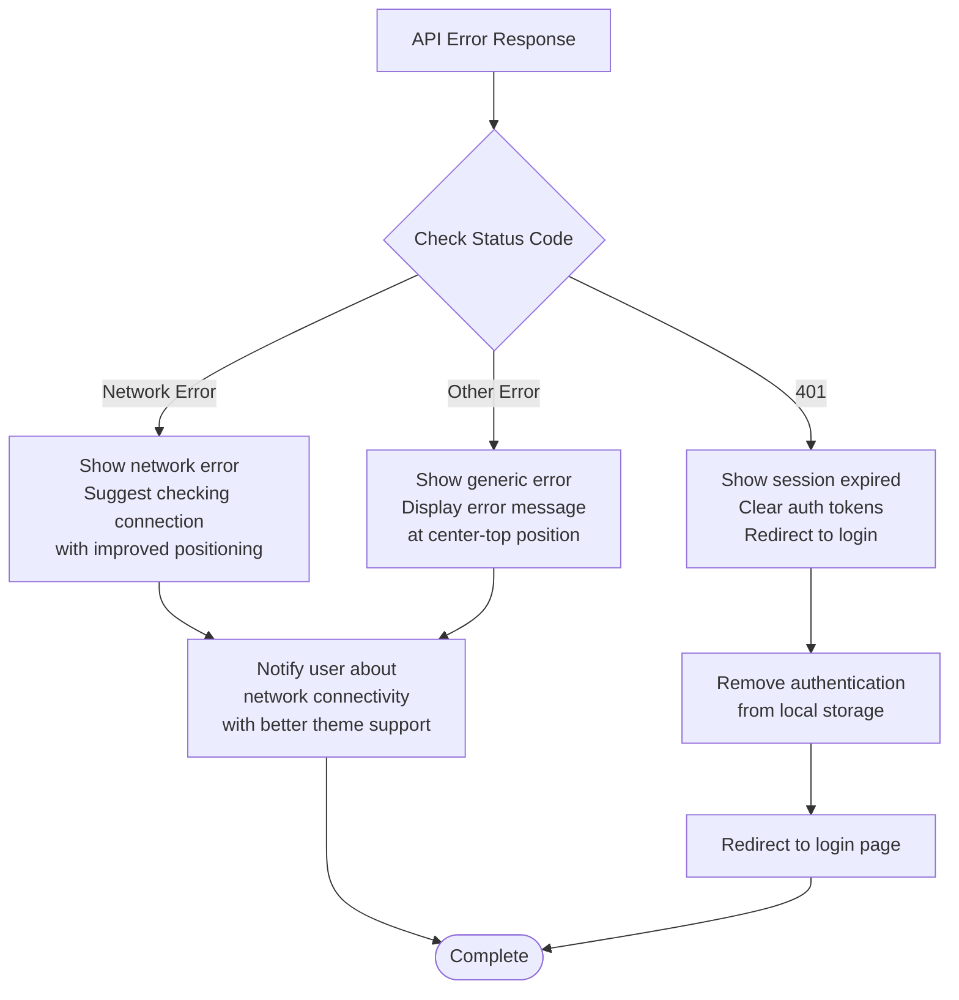

# Toast Notification System

<cite>
**Referenced Files in This Document**
- [toast.js](file://Client/src/utils/toast.js)
- [App.jsx](file://Client/src/App.jsx)
- [apiClient.js](file://Client/src/services/apiClient.js)
- [useApi.js](file://Client/src/hooks/useApi.js)
- [adminSlice.js](file://Client/src/store/admin/adminSlice.js)
- [Login.jsx](file://Client/src/pages/Login.jsx)
- [DataTable.jsx](file://Client/src/components/deshboard/DataTable.jsx)
- [package.json](file://Client/package.json)
</cite>

## Update Summary
**Changes Made**
- Updated toast positioning from 'top-right' to 'top-center' for improved user experience
- Enhanced theme integration with better dark/light mode support and improved styling
- Refined notification timing configurations with optimized durations
- Updated architecture diagrams to reflect current implementation

## Table of Contents
1. [Introduction](#introduction)
2. [System Architecture](#system-architecture)
3. [Core Components](#core-components)
4. [Notification Types and Behavior](#notification-types-and-behavior)
5. [Integration Points](#integration-points)
6. [Usage Patterns](#usage-patterns)
7. [Error Handling](#error-handling)
8. [Performance Considerations](#performance-considerations)
9. [Troubleshooting Guide](#troubleshooting-guide)
10. [Best Practices](#best-practices)
11. [Conclusion](#conclusion)

## Introduction

The Toast Notification System is a comprehensive notification framework built for the Timetable Management Application using React Hot Toast library. This system provides consistent, user-friendly feedback mechanisms across all application interactions, from API operations to user actions. The implementation follows modern React patterns with centralized configuration and flexible integration points.

The system is designed to enhance user experience by providing timely, non-intrusive notifications that automatically disappear after appropriate durations while maintaining accessibility and visual consistency across light and dark themes. Recent improvements have optimized toast positioning and theme integration for better user experience.

## System Architecture

The toast notification system follows a layered architecture with clear separation of concerns:



**Diagram sources**
- [App.jsx:29-60](file://Client/src/App.jsx#L29-L60)
- [toast.js:1-135](file://Client/src/utils/toast.js#L1-L135)
- [apiClient.js:1-220](file://Client/src/services/apiClient.js#L1-L220)

## Core Components

### Toast Utility Library

The central toast utility module provides a comprehensive set of notification functions with consistent behavior and configuration.



**Diagram sources**
- [toast.js:8-135](file://Client/src/utils/toast.js#L8-L135)
- [App.jsx:29-60](file://Client/src/App.jsx#L29-L60)

**Section sources**
- [toast.js:1-135](file://Client/src/utils/toast.js#L1-L135)
- [App.jsx:29-60](file://Client/src/App.jsx#L29-L60)

### Enhanced Theme Integration

The system integrates seamlessly with the application's theming system, automatically adapting toast appearance to match the current theme with improved styling and positioning.



**Diagram sources**
- [App.jsx:15-25](file://Client/src/App.jsx#L15-L25)
- [App.jsx:33-59](file://Client/src/App.jsx#L33-L59)

**Section sources**
- [App.jsx:15-25](file://Client/src/App.jsx#L15-L25)
- [App.jsx:33-59](file://Client/src/App.jsx#L33-L59)

## Notification Types and Behavior

### Standard Notifications

The system supports three primary notification types with distinct visual treatments and optimized durations:

| Type | Duration | Icon Color | Use Case |
|------|----------|------------|----------|
| Success | 3 seconds | Green (#10b981) | Successful operations, confirmations |
| Error | 5 seconds | Red (#ef4444) | Failed operations, warnings |
| Loading | Infinite | Blue (#3b82f6) | Long-running operations |

### Advanced Features



**Diagram sources**
- [toast.js:93-125](file://Client/src/utils/toast.js#L93-L125)

**Section sources**
- [toast.js:8-135](file://Client/src/utils/toast.js#L8-L135)

## Integration Points

### API Client Integration

The toast system integrates deeply with the API client for automatic notification handling during data operations.



**Diagram sources**
- [useApi.js:39-112](file://Client/src/hooks/useApi.js#L39-L112)
- [toast.js:93-125](file://Client/src/utils/toast.js#L93-L125)

### Redux Integration

The system integrates with Redux for state management of toast notifications in master data operations.



**Diagram sources**
- [adminSlice.js:133-145](file://Client/src/store/admin/adminSlice.js#L133-L145)
- [adminSlice.js:149-165](file://Client/src/store/admin/adminSlice.js#L149-L165)

**Section sources**
- [useApi.js:39-112](file://Client/src/hooks/useApi.js#L39-L112)
- [adminSlice.js:133-145](file://Client/src/store/admin/adminSlice.js#L133-L145)

## Usage Patterns

### Component-Level Usage

Components can directly import and use toast utilities for immediate feedback:

```javascript
// Example usage pattern
const handleSubmit = async () => {
  const toastId = toast.loading("Saving data...", { position: "top-center" });
  
  try {
    const result = await saveData();
    toast.dismiss(toastId);
    toast.success("Data saved successfully!", { duration: 3000 });
  } catch (error) {
    toast.dismiss(toastId);
    toast.error("Failed to save data", { duration: 5000 });
  }
};
```

### Hook-Based Usage

Custom hooks provide structured approaches for different use cases:

| Hook | Purpose | Typical Usage |
|------|---------|---------------|
| `useApi` | Data fetching with caching | CRUD operations, data retrieval |
| `useMutation` | Single mutations | Create, update, delete operations |
| `useBatchOperation` | Bulk operations | Mass data updates, imports |

**Section sources**
- [Login.jsx:27-56](file://Client/src/pages/Login.jsx#L27-L56)
- [DataTable.jsx:14-18](file://Client/src/components/deshboard/DataTable.jsx#L14-L18)

## Error Handling

The system implements comprehensive error handling across multiple layers:



**Diagram sources**
- [apiClient.js:128-158](file://Client/src/services/apiClient.js#L128-L158)

**Section sources**
- [apiClient.js:128-158](file://Client/src/services/apiClient.js#L128-L158)

## Performance Considerations

### Toast Lifecycle Management

The system implements efficient toast lifecycle management to prevent memory leaks and optimize performance:

- **Automatic Cleanup**: Toasts automatically dismiss after configured durations
- **Manual Control**: Functions to programmatically dismiss specific toasts
- **Memory Management**: Proper cleanup of toast instances and references

### Enhanced Theme Performance

The theme integration is optimized to minimize re-renders with improved positioning:

- **Optimized Positioning**: Center-top positioning reduces visual clutter
- **Conditional Rendering**: Theme changes trigger minimal component updates
- **CSS Classes**: Dynamic class switching for theme transitions
- **Local Storage**: Efficient theme persistence without blocking operations

**Section sources**
- [App.jsx:17-25](file://Client/src/App.jsx#L17-L25)

## Troubleshooting Guide

### Common Issues and Solutions

| Issue | Symptoms | Solution |
|-------|----------|----------|
| Toasts not appearing | No notifications visible | Check Toaster component rendering in App.jsx with top-center position |
| Incorrect timing | Toasts dismiss too quickly/slowly | Verify duration configurations in toast.js and App.jsx |
| Theme mismatch | Wrong colors/appearance | Confirm theme state synchronization and improved styling |
| Position issues | Notifications appear in wrong location | Ensure position is set to "top-center" in Toaster component |

### Debugging Steps

1. **Verify Dependencies**: Ensure react-hot-toast is properly installed
2. **Check Import Paths**: Confirm correct import statements
3. **Validate Configuration**: Review toast options and theme settings with new positioning
4. **Monitor Console**: Look for JavaScript errors in browser console

**Section sources**
- [package.json:18](file://Client/package.json#L18)

## Best Practices

### Implementation Guidelines

1. **Consistent Messaging**: Use clear, concise messages that inform rather than confuse
2. **Optimized Timing**: Choose durations that match user expectations (3s for success, 5s for error)
3. **Accessibility**: Ensure sufficient contrast and readable text with improved theme support
4. **Error Recovery**: Provide actionable error messages with recovery options
5. **Performance**: Avoid excessive toast creation in loops or frequent updates
6. **Positioning**: Use center-top positioning for optimal user experience

### Design Principles

- **User-Centered**: Focus on user needs and mental models with improved positioning
- **Consistency**: Maintain uniform behavior across similar operations
- **Feedback Loops**: Provide immediate acknowledgment for user actions
- **Graceful Degradation**: Handle failures gracefully without breaking UX
- **Theme Harmony**: Ensure notifications blend seamlessly with application theme

## Conclusion

The Toast Notification System provides a robust, scalable solution for user feedback in the Timetable Management Application. Its architecture ensures consistency, performance, and maintainability while offering flexibility for various use cases.

The system's integration with React Hot Toast, combined with custom utility functions and comprehensive error handling, creates a reliable notification framework that enhances user experience without compromising application performance. The recent improvements to toast positioning, theme integration, and timing configurations demonstrate ongoing commitment to user experience optimization.

Key strengths include automatic theme adaptation with improved styling, comprehensive error handling, efficient lifecycle management, seamless integration with existing application patterns, and optimized positioning for better user experience. This foundation supports both simple notifications and complex operation workflows with consistent user experience.

The enhanced theme integration with better dark/light mode support and improved notification timing configurations ensures that users receive appropriate feedback regardless of their theme preference or the complexity of the operation being performed.