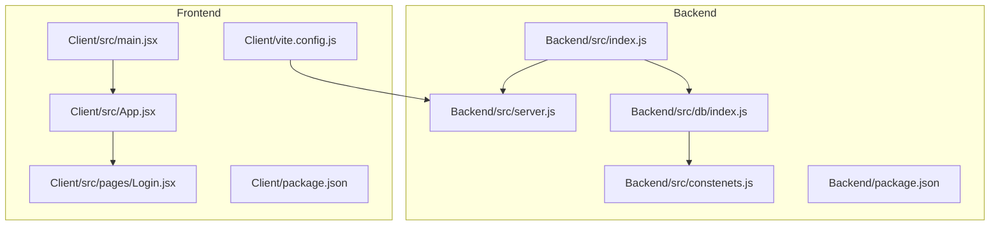
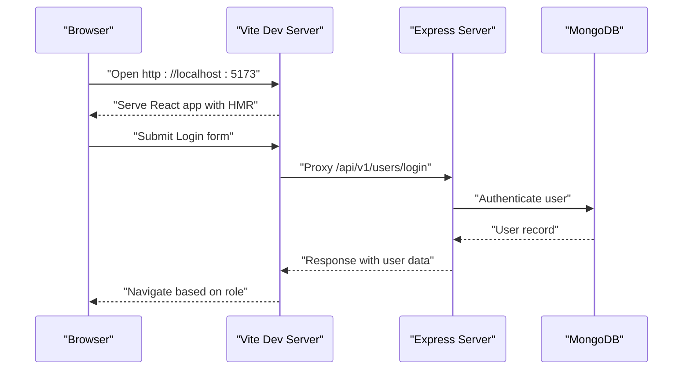

# Getting Started

<cite>
**Referenced Files in This Document**
- [Backend/package.json](file://Backend/package.json)
- [Backend/src/index.js](file://Backend/src/index.js)
- [Backend/src/db/index.js](file://Backend/src/db/index.js)
- [Backend/src/constenets.js](file://Backend/src/constenets.js)
- [Backend/src/server.js](file://Backend/src/server.js)
- [Backend/src/controllers/user.controller.js](file://Backend/src/controllers/user.controller.js)
- [Backend/src/models/user.models.js](file://Backend/src/models/user.models.js)
- [Client/package.json](file://Client/package.json)
- [Client/vite.config.js](file://Client/vite.config.js)
- [Client/src/main.jsx](file://Client/src/main.jsx)
- [Client/src/App.jsx](file://Client/src/App.jsx)
- [Client/src/pages/Login.jsx](file://Client/src/pages/Login.jsx)
- [Client/README.md](file://Client/README.md)
</cite>

## Table of Contents
1. [Introduction](#introduction)
2. [Prerequisites](#prerequisites)
3. [Project Structure](#project-structure)
4. [Environment Setup](#environment-setup)
5. [Installation Instructions](#installation-instructions)
6. [Database Setup](#database-setup)
7. [Running the Application](#running-the-application)
8. [Verification Steps](#verification-steps)
9. [Common Setup Issues and Solutions](#common-setup-issues-and-solutions)
10. [Development Workflow](#development-workflow)
11. [Architecture Overview](#architecture-overview)
12. [Troubleshooting Guide](#troubleshooting-guide)
13. [Conclusion](#conclusion)

## Introduction
This guide helps you set up and run the Timetable Management System locally. It covers prerequisites, environment configuration, installation of backend and frontend dependencies, database setup, and development workflow with hot reload and debugging.

## Prerequisites
Before installing the system, ensure you have:
- Node.js and npm installed (LTS recommended)
- MongoDB installed and running locally or access to a MongoDB instance
- Basic understanding of React and Redux Toolkit
- Familiarity with REST APIs and Express.js concepts
- Git for cloning the repository

## Project Structure
The project consists of:
- Backend: Node.js + Express + MongoDB/Mongoose application under Backend/
- Frontend: React + Vite + TailwindCSS application under Client/

**Diagram sources**
- [Backend/src/index.js:1-18](file://Backend/src/index.js#L1-L18)
- [Backend/src/server.js:1-54](file://Backend/src/server.js#L1-L54)
- [Backend/src/db/index.js:1-19](file://Backend/src/db/index.js#L1-L19)
- [Backend/src/constenets.js:1-2](file://Backend/src/constenets.js#L1-L2)
- [Client/src/main.jsx:1-18](file://Client/src/main.jsx#L1-L18)
- [Client/src/App.jsx:1-41](file://Client/src/App.jsx#L1-L41)
- [Client/src/pages/Login.jsx:1-116](file://Client/src/pages/Login.jsx#L1-L116)
- [Client/vite.config.js:1-17](file://Client/vite.config.js#L1-L17)

**Section sources**
- [Backend/src/index.js:1-18](file://Backend/src/index.js#L1-L18)
- [Backend/src/server.js:1-54](file://Backend/src/server.js#L1-L54)
- [Client/src/main.jsx:1-18](file://Client/src/main.jsx#L1-L18)
- [Client/src/App.jsx:1-41](file://Client/src/App.jsx#L1-L41)

## Environment Setup
Create environment files for both backend and frontend:

Backend environment variables (.env):
- MONGODB_URI: MongoDB connection string (e.g., mongodb://127.0.0.1:27017)
- CORS_ORIGIN: Allowed origin for CORS (e.g., http://localhost:5173)
- PORT: Server port (default 4000)

Frontend environment variables (.env):
- VITE_API_BASE_URL: Base URL for API requests (e.g., http://localhost:4000)

Note: The backend expects a .env file in the Backend/ directory. The frontend reads environment variables prefixed with VITE_ during build-time.

**Section sources**
- [Backend/src/index.js:5-6](file://Backend/src/index.js#L5-L6)
- [Backend/src/db/index.js:6-8](file://Backend/src/db/index.js#L6-L8)
- [Backend/src/server.js:6-19](file://Backend/src/server.js#L6-L19)
- [Client/vite.config.js:8-13](file://Client/vite.config.js#L8-L13)

## Installation Instructions
Follow these steps to install and configure the system:

1. Clone the repository to your machine.
2. Navigate to the Backend directory and install dependencies:
   - Run: npm install
3. Navigate to the Client directory and install dependencies:
   - Run: npm install
4. Verify installation by checking that both package-lock.json files are generated.

**Section sources**
- [Backend/package.json:1-22](file://Backend/package.json#L1-L22)
- [Client/package.json:1-36](file://Client/package.json#L1-L36)

## Database Setup
The backend connects to MongoDB using Mongoose. The database name is configured via constants.

Steps:
1. Ensure MongoDB is running locally or accessible via the configured URI.
2. Confirm the database name matches the constant value used by the backend.
3. The backend will automatically connect when the server starts.

Key configuration points:
- Database name constant: [Backend/src/constenets.js:1-2](file://Backend/src/constenets.js#L1-L2)
- Connection logic: [Backend/src/db/index.js:4-16](file://Backend/src/db/index.js#L4-L16)

**Section sources**
- [Backend/src/constenets.js:1-2](file://Backend/src/constenets.js#L1-L2)
- [Backend/src/db/index.js:4-16](file://Backend/src/db/index.js#L4-L16)

## Running the Application
Start the backend and frontend servers:

Backend:
1. From the Backend directory, run the development script:
   - npm run dev
   - This uses nodemon with dotenv configuration to restart on changes.

Frontend:
1. From the Client directory, run the development script:
   - npm run dev
   - Vite serves the React app with hot module replacement.

Proxy configuration:
- The frontend proxies API calls to the backend server at http://localhost:4000.

**Section sources**
- [Backend/package.json:9-12](file://Backend/package.json#L9-L12)
- [Backend/src/index.js:5-17](file://Backend/src/index.js#L5-L17)
- [Client/vite.config.js:7-16](file://Client/vite.config.js#L7-L16)

## Verification Steps
After starting both servers, verify the setup:

1. Backend verification:
   - Check terminal logs for successful MongoDB connection and server startup messages.
   - Confirm the server listens on the configured port.

2. Frontend verification:
   - Open http://localhost:5173 in your browser.
   - Ensure the React app loads without build errors.

3. API connectivity:
   - Open the browser's Network tab and submit the login form.
   - Verify requests are proxied to http://localhost:4000/api/v1/users/login.

4. Login flow:
   - Submit credentials in the Login page.
   - Observe role-based navigation after successful authentication.

**Section sources**
- [Backend/src/index.js:9-17](file://Backend/src/index.js#L9-L17)
- [Client/src/pages/Login.jsx:15-45](file://Client/src/pages/Login.jsx#L15-L45)
- [Client/src/App.jsx:26-37](file://Client/src/App.jsx#L26-L37)

## Common Setup Issues and Solutions
- MongoDB connection fails:
  - Ensure MongoDB is running locally or update MONGODB_URI to point to a valid instance.
  - Confirm the database name constant matches your intended database.

- CORS errors in the browser:
  - Set CORS_ORIGIN in the backend .env to match the frontend origin (http://localhost:5173).

- Proxy not forwarding API requests:
  - Verify Vite proxy configuration targets http://localhost:4000.
  - Ensure the backend server is running before testing API calls.

- Port conflicts:
  - Change PORT in the backend .env if port 4000 is in use.
  - Adjust Vite port in vite.config.js if port 5173 is unavailable.

- Missing environment variables:
  - Ensure both backend and frontend .env files exist with required keys.
  - For the backend, confirm MONGODB_URI and CORS_ORIGIN are present.

**Section sources**
- [Backend/src/db/index.js:6-8](file://Backend/src/db/index.js#L6-L8)
- [Backend/src/server.js:15-19](file://Backend/src/server.js#L15-L19)
- [Client/vite.config.js:8-13](file://Client/vite.config.js#L8-L13)
- [Backend/src/index.js:5-6](file://Backend/src/index.js#L5-L6)

## Development Workflow
Enable hot reload and efficient development:

- Backend:
  - Use npm run dev to start with nodemon for automatic restarts on file changes.
  - Scripts are defined in the backend package.json.

- Frontend:
  - Use npm run dev to start Vite with HMR.
  - ESLint and React Refresh are configured for improved DX.

- Debugging:
  - Backend: Attach a Node.js debugger to the running process.
  - Frontend: Use browser developer tools to debug React components and network requests.

- Linting:
  - Run npm run lint in the Client directory to check code quality.

**Section sources**
- [Backend/package.json:9-12](file://Backend/package.json#L9-L12)
- [Client/package.json:6-11](file://Client/package.json#L6-L11)
- [Client/README.md:1-17](file://Client/README.md#L1-L17)

## Architecture Overview
High-level flow of the application:

**Diagram sources**
- [Client/vite.config.js:8-13](file://Client/vite.config.js#L8-L13)
- [Client/src/pages/Login.jsx:23-33](file://Client/src/pages/Login.jsx#L23-L33)
- [Backend/src/server.js:40-50](file://Backend/src/server.js#L40-L50)
- [Backend/src/db/index.js:6-11](file://Backend/src/db/index.js#L6-L11)

## Troubleshooting Guide
- Backend startup errors:
  - Check for MongoDB connection failures and correct MONGODB_URI.
  - Review error logs for database connection issues.

- Frontend build or runtime errors:
  - Clear node_modules and reinstall dependencies if builds fail.
  - Verify VITE_API_BASE_URL and proxy settings.

- Authentication issues:
  - Confirm user credentials and roles in the database.
  - Inspect login controller logic for expected payload structure.

**Section sources**
- [Backend/src/db/index.js:12-15](file://Backend/src/db/index.js#L12-L15)
- [Backend/src/controllers/user.controller.js:281-354](file://Backend/src/controllers/user.controller.js#L281-L354)
- [Client/src/pages/Login.jsx:15-45](file://Client/src/pages/Login.jsx#L15-L45)

## Conclusion
You now have the Timetable Management System running locally with hot reload and proxy support. Use the verification steps to confirm everything works, and refer to the troubleshooting section for common issues. For further development, leverage the provided scripts and environment configurations.