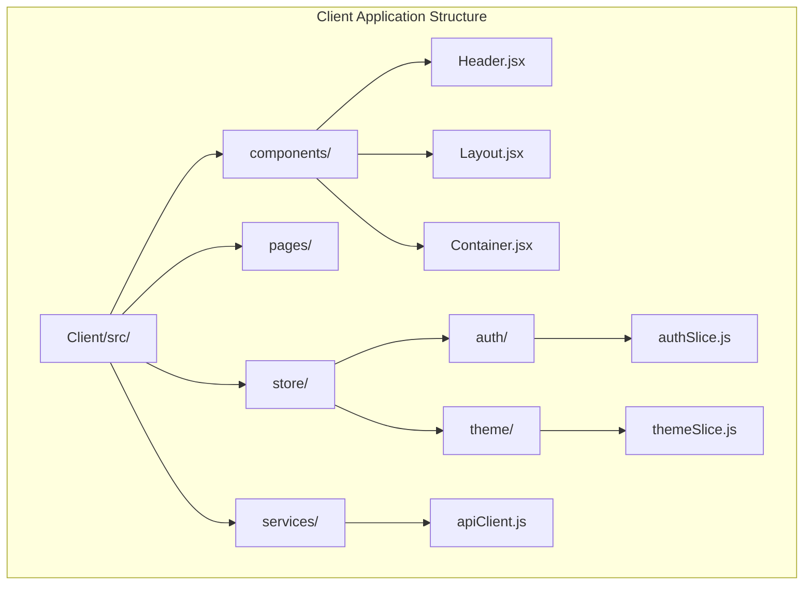
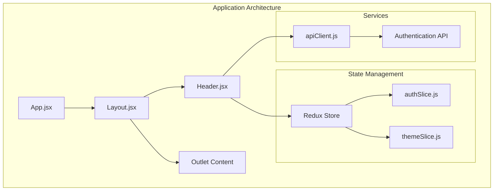
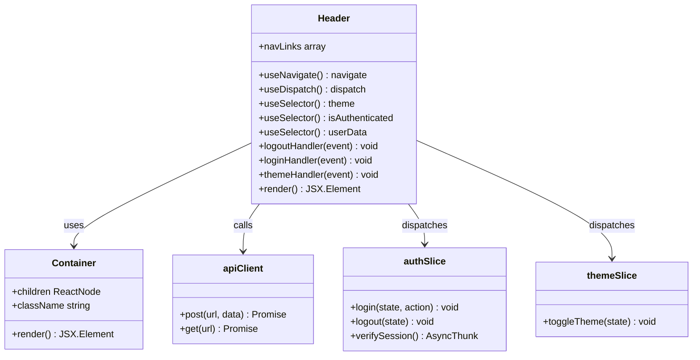
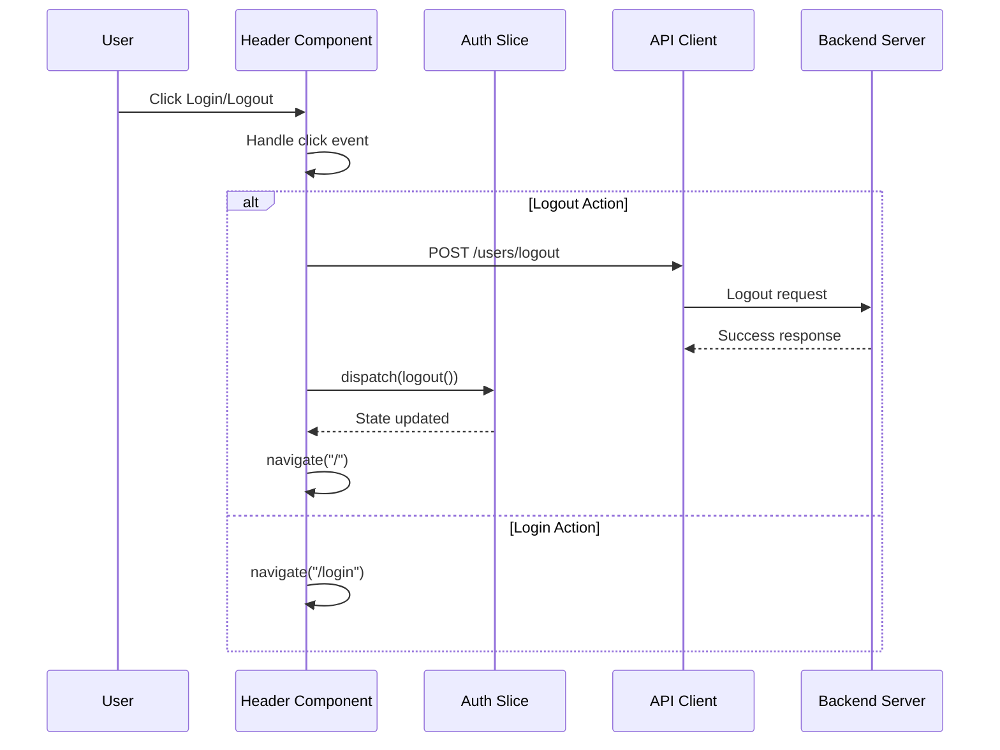
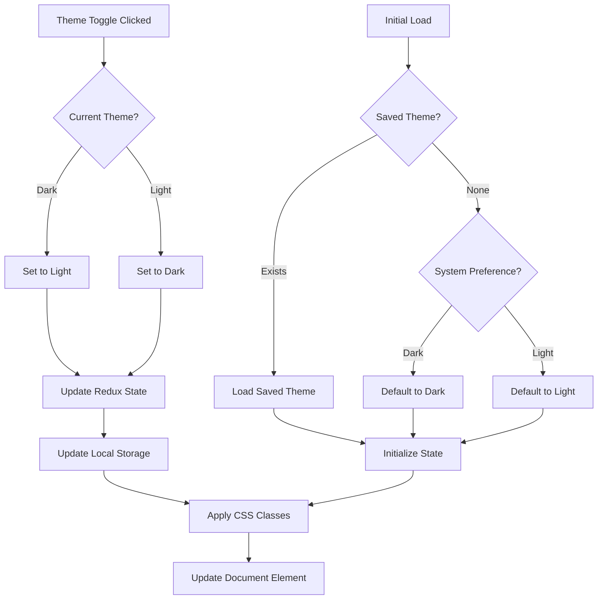
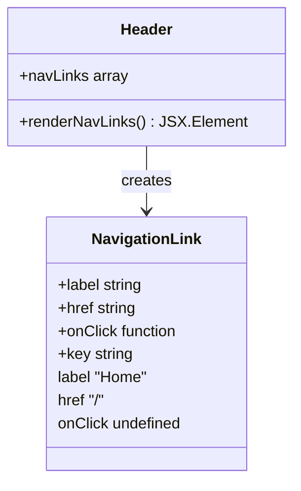
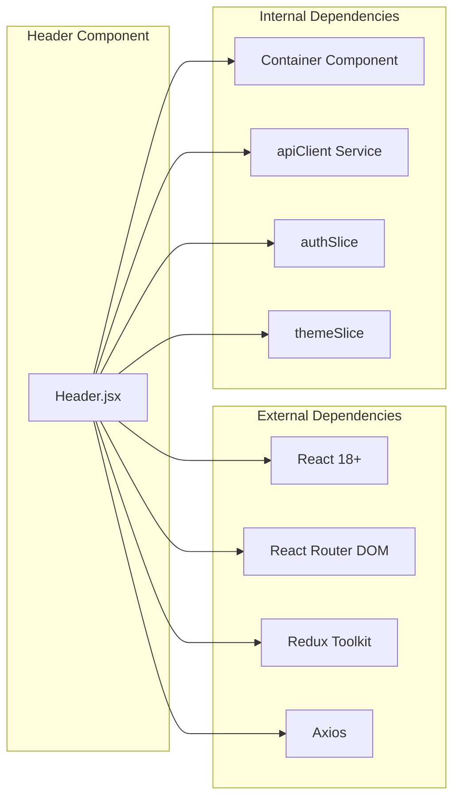

# Header Component

<cite>
**Referenced Files in This Document**
- [Header.jsx](file://Client/src/components/Header.jsx)
- [Layout.jsx](file://Client/src/components/Layout.jsx)
- [App.jsx](file://Client/src/App.jsx)
- [authSlice.js](file://Client/src/store/auth/authSlice.js)
- [themeSlice.js](file://Client/src/store/theme/themeSlice.js)
- [apiClient.js](file://Client/src/services/apiClient.js)
- [Container.jsx](file://Client/src/components/Container.jsx)
- [store.js](file://Client/src/store/store.js)
- [Login.jsx](file://Client/src/pages/Login.jsx)
- [Admin.jsx](file://Client/src/pages/dashboard/Admin.jsx)
- [Faculty.jsx](file://Client/src/pages/dashboard/Faculty.jsx)
- [Student.jsx](file://Client/src/pages/dashboard/Student.jsx)
</cite>

## Table of Contents
1. [Introduction](#introduction)
2. [Project Structure](#project-structure)
3. [Core Components](#core-components)
4. [Architecture Overview](#architecture-overview)
5. [Detailed Component Analysis](#detailed-component-analysis)
6. [Dependency Analysis](#dependency-analysis)
7. [Performance Considerations](#performance-considerations)
8. [Troubleshooting Guide](#troubleshooting-guide)
9. [Conclusion](#conclusion)

## Introduction
The Header Component is a crucial part of the Timetable Management System's frontend, providing essential navigation, authentication controls, and theme switching functionality. Built with React and integrated with Redux for state management, this component serves as the primary interface control center for users interacting with the timetable application.

The header displays the application logo, navigation links, theme toggle functionality, and authentication controls that adapt based on user session status. It integrates seamlessly with the routing system and provides a responsive design that works across different screen sizes.

## Project Structure
The Header Component is organized within the Client-side React application structure, positioned alongside other UI components and integrated with the application's state management system.

**Diagram sources**
- [Header.jsx:1-135](file://Client/src/components/Header.jsx#L1-L135)
- [Layout.jsx:1-20](file://Client/src/components/Layout.jsx#L1-L20)
- [store.js:1-15](file://Client/src/store/store.js#L1-L15)

**Section sources**
- [Header.jsx:1-135](file://Client/src/components/Header.jsx#L1-L135)
- [Layout.jsx:1-20](file://Client/src/components/Layout.jsx#L1-L20)
- [store.js:1-15](file://Client/src/store/store.js#L1-L15)

## Core Components
The Header Component consists of several interconnected parts that work together to provide a cohesive user interface experience:

### Primary Features
- **Navigation System**: Dynamic navigation links with responsive design
- **Authentication Controls**: Login/logout functionality with user state management
- **Theme Switching**: Light/dark mode toggle with persistent storage
- **Responsive Design**: Mobile-friendly layout with adaptive components
- **Integration Layer**: Seamless connection with Redux state and API services

### State Management Integration
The component leverages Redux for managing:
- Authentication state (login/logout status)
- Theme preferences (light/dark mode)
- User data and session information
- Global application state coordination

### API Integration
Direct integration with the backend API through:
- Authentication endpoints for login/logout
- Session verification on application load
- Real-time state synchronization

**Section sources**
- [Header.jsx:9-135](file://Client/src/components/Header.jsx#L9-L135)
- [authSlice.js:1-61](file://Client/src/store/auth/authSlice.js#L1-L61)
- [themeSlice.js:1-29](file://Client/src/store/theme/themeSlice.js#L1-L29)

## Architecture Overview
The Header Component operates within a well-structured React application architecture that emphasizes separation of concerns and state management.

**Diagram sources**
- [App.jsx:52-119](file://Client/src/App.jsx#L52-L119)
- [Layout.jsx:7-18](file://Client/src/components/Layout.jsx#L7-L18)
- [Header.jsx:9-135](file://Client/src/components/Header.jsx#L9-L135)

The architecture follows a unidirectional data flow pattern where the Header Component receives state from Redux, triggers actions through dispatch, and communicates with backend services through the API client.

**Section sources**
- [App.jsx:52-119](file://Client/src/App.jsx#L52-L119)
- [Layout.jsx:7-18](file://Client/src/components/Layout.jsx#L7-L18)
- [store.js:7-14](file://Client/src/store/store.js#L7-L14)

## Detailed Component Analysis

### Header Component Implementation
The Header Component is implemented as a functional React component that manages multiple stateful behaviors through React hooks and Redux integration.

**Diagram sources**
- [Header.jsx:9-135](file://Client/src/components/Header.jsx#L9-L135)
- [Container.jsx:3-5](file://Client/src/components/Container.jsx#L3-L5)
- [authSlice.js:24-56](file://Client/src/store/auth/authSlice.js#L24-L56)
- [themeSlice.js:15-24](file://Client/src/store/theme/themeSlice.js#L15-L24)

### Authentication Flow
The authentication system implements a robust login/logout mechanism with proper error handling and state management.

**Diagram sources**
- [Header.jsx:16-36](file://Client/src/components/Header.jsx#L16-L36)
- [authSlice.js:33-37](file://Client/src/store/auth/authSlice.js#L33-L37)
- [apiClient.js:134-151](file://Client/src/services/apiClient.js#L134-L151)

### Theme Management System
The theme system provides seamless light/dark mode switching with persistent storage and automatic preference detection.

**Diagram sources**
- [themeSlice.js:3-22](file://Client/src/store/theme/themeSlice.js#L3-L22)
- [App.jsx:61-69](file://Client/src/App.jsx#L61-L69)

### Navigation System
The navigation component provides dynamic link generation with responsive design capabilities.

**Diagram sources**
- [Header.jsx:43-48](file://Client/src/components/Header.jsx#L43-L48)

**Section sources**
- [Header.jsx:9-135](file://Client/src/components/Header.jsx#L9-L135)
- [authSlice.js:12-22](file://Client/src/store/auth/authSlice.js#L12-L22)
- [themeSlice.js:19-22](file://Client/src/store/theme/themeSlice.js#L19-L22)

## Dependency Analysis
The Header Component has well-defined dependencies that contribute to its functionality and maintainability.

**Diagram sources**
- [Header.jsx:1-8](file://Client/src/components/Header.jsx#L1-L8)
- [store.js:1-6](file://Client/src/store/store.js#L1-L6)

### Component Dependencies
The Header Component depends on several key modules:

- **React and React Router**: For component rendering and navigation
- **Redux Toolkit**: For state management and global state access
- **Custom Services**: For API communication and data fetching
- **Styled Components**: For responsive design and theming

### State Dependencies
The component maintains dependencies on multiple Redux slices:

- **Auth State**: Authentication status and user information
- **Theme State**: Current theme preference and toggle functionality
- **Global State**: Application-wide state coordination

**Section sources**
- [Header.jsx:1-8](file://Client/src/components/Header.jsx#L1-L8)
- [store.js:7-14](file://Client/src/store/store.js#L7-L14)

## Performance Considerations
The Header Component is designed with performance optimization in mind, implementing several strategies to ensure efficient rendering and operation.

### Optimization Strategies
- **Memoization**: Uses React.memo for component optimization
- **Lazy Loading**: Conditional rendering based on authentication state
- **Efficient State Updates**: Minimal re-renders through selective state updates
- **Responsive Design**: Optimized for mobile devices with adaptive layouts

### Memory Management
- **Event Handler Cleanup**: Proper cleanup of event listeners
- **Conditional Rendering**: Avoids unnecessary component mounting
- **State Normalization**: Efficient state structure for quick access

### API Performance
- **Request Caching**: Integrated caching for API responses
- **Error Handling**: Robust error handling to prevent memory leaks
- **Timeout Management**: Configured timeouts for network requests

## Troubleshooting Guide

### Common Issues and Solutions

#### Authentication Problems
**Issue**: Logout functionality not working properly
**Solution**: Verify backend logout endpoint and cookie clearing mechanism

**Issue**: Login state not persisting
**Solution**: Check Redux state persistence and localStorage configuration

#### Theme Switching Issues
**Issue**: Theme not applying correctly
**Solution**: Verify CSS variable updates and localStorage persistence

**Issue**: Theme toggle not responding
**Solution**: Check event handler binding and state updates

#### Navigation Problems
**Issue**: Links not working in mobile view
**Solution**: Verify responsive design breakpoints and mobile navigation

#### API Communication Issues
**Issue**: Header not receiving authentication data
**Solution**: Check API client configuration and authentication middleware

**Section sources**
- [Header.jsx:16-36](file://Client/src/components/Header.jsx#L16-L36)
- [authSlice.js:33-37](file://Client/src/store/auth/authSlice.js#L33-L37)
- [themeSlice.js:19-22](file://Client/src/store/theme/themeSlice.js#L19-L22)

## Conclusion
The Header Component represents a well-architected solution for managing application navigation, authentication, and theming in the Timetable Management System. Its implementation demonstrates best practices in React development, including proper state management, component composition, and integration with external services.

The component successfully balances functionality with performance, providing a responsive and accessible user interface that adapts to different user needs and device capabilities. Through its integration with Redux and the API client, it ensures consistent state management and reliable communication with backend services.

Future enhancements could include expanded navigation options, additional accessibility features, and improved error handling mechanisms. The current implementation provides a solid foundation for these potential improvements while maintaining code clarity and maintainability.