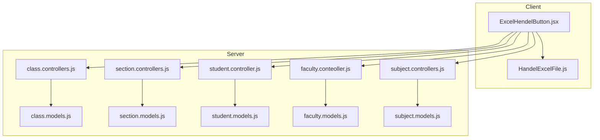
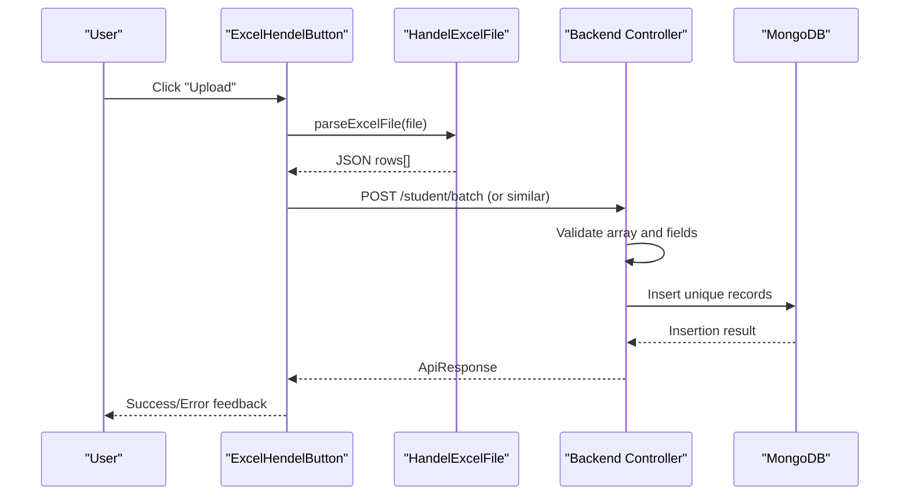
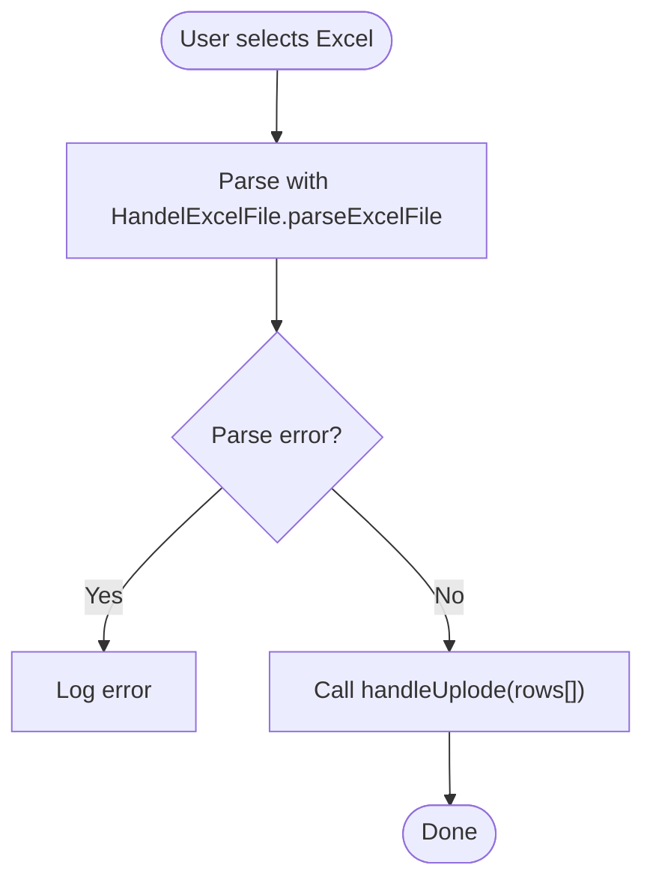
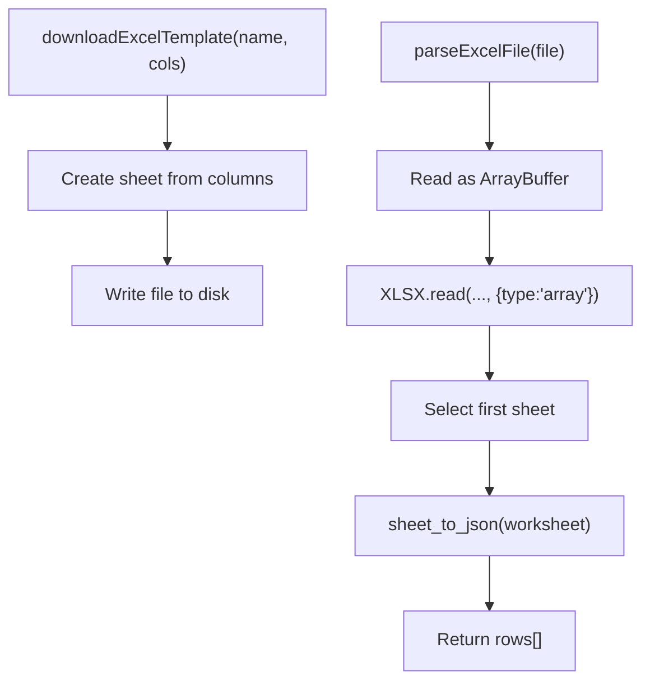
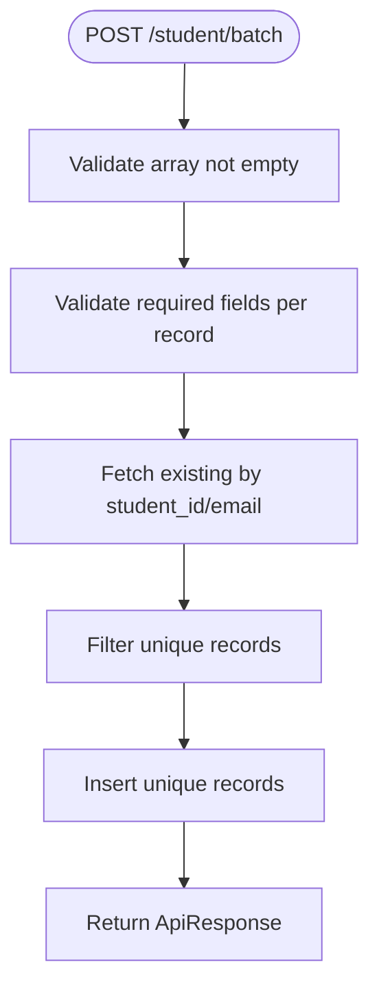
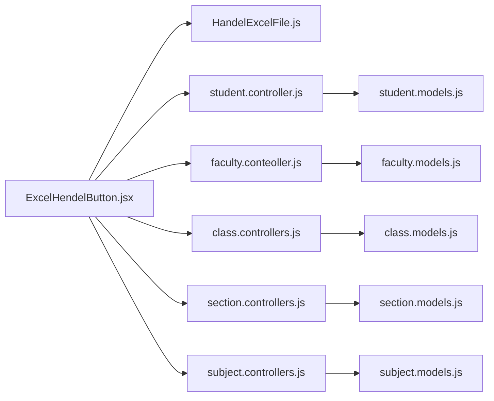

# CSV Data Import/Export Operations

<cite>
**Referenced Files in This Document**
- [ExcelHendelButton.jsx](file://Client/src/components/ExcelHendelButton.jsx)
- [HandelExcelFile.js](file://Client/src/utils/HandelExcelFile.js)
- [class.controllers.js](file://Backend/src/controllers/class.controllers.js)
- [section.controllers.js](file://Backend/src/controllers/section.controllers.js)
- [student.controller.js](file://Backend/src/controllers/student.controller.js)
- [faculty.conteoller.js](file://Backend/src/controllers/faculty.conteoller.js)
- [subject.controllers.js](file://Backend/src/controllers/subject.controllers.js)
- [class.models.js](file://Backend/src/models/class.models.js)
- [section.models.js](file://Backend/src/models/section.models.js)
- [student.models.js](file://Backend/src/models/student.models.js)
- [faculty.models.js](file://Backend/src/models/faculty.models.js)
- [subject.models.js](file://Backend/src/models/subject.models.js)
</cite>

## Table of Contents
1. [Introduction](#introduction)
2. [Project Structure](#project-structure)
3. [Core Components](#core-components)
4. [Architecture Overview](#architecture-overview)
5. [Detailed Component Analysis](#detailed-component-analysis)
6. [Dependency Analysis](#dependency-analysis)
7. [Performance Considerations](#performance-considerations)
8. [Security Measures](#security-measures)
9. [Troubleshooting Guide](#troubleshooting-guide)
10. [Conclusion](#conclusion)

## Introduction
This document explains the CSV and Excel import/export capabilities implemented in the project. It covers:
- Frontend Excel handling and template generation
- Backend batch processing for importing large datasets
- Data validation and error handling
- Export/download mechanisms
- Integration patterns via the ExcelHendelButton component
- Supported formats, validation rules, and user feedback

## Project Structure
The import/export functionality spans the client-side utility and component for Excel handling and the backend controllers and models for batch ingestion and persistence.

**Diagram sources**
- [ExcelHendelButton.jsx:1-85](file://Client/src/components/ExcelHendelButton.jsx#L1-L85)
- [HandelExcelFile.js:1-35](file://Client/src/utils/HandelExcelFile.js#L1-L35)
- [class.controllers.js:1-179](file://Backend/src/controllers/class.controllers.js#L1-L179)
- [section.controllers.js:1-137](file://Backend/src/controllers/section.controllers.js#L1-L137)
- [student.controller.js:1-209](file://Backend/src/controllers/student.controller.js#L1-L209)
- [faculty.conteoller.js:1-229](file://Backend/src/controllers/faculty.conteoller.js#L1-L229)
- [subject.controllers.js:1-130](file://Backend/src/controllers/subject.controllers.js#L1-L130)
- [class.models.js:1-32](file://Backend/src/models/class.models.js#L1-L32)
- [section.models.js:1-31](file://Backend/src/models/section.models.js#L1-L31)
- [student.models.js:1-66](file://Backend/src/models/student.models.js#L1-L66)
- [faculty.models.js:1-77](file://Backend/src/models/faculty.models.js#L1-L77)
- [subject.models.js:1-33](file://Backend/src/models/subject.models.js#L1-L33)

**Section sources**
- [ExcelHendelButton.jsx:1-85](file://Client/src/components/ExcelHendelButton.jsx#L1-L85)
- [HandelExcelFile.js:1-35](file://Client/src/utils/HandelExcelFile.js#L1-L35)
- [class.controllers.js:1-179](file://Backend/src/controllers/class.controllers.js#L1-L179)
- [section.controllers.js:1-137](file://Backend/src/controllers/section.controllers.js#L1-L137)
- [student.controller.js:1-209](file://Backend/src/controllers/student.controller.js#L1-L209)
- [faculty.conteoller.js:1-229](file://Backend/src/controllers/faculty.conteoller.js#L1-L229)
- [subject.controllers.js:1-130](file://Backend/src/controllers/subject.controllers.js#L1-L130)

## Core Components
- ExcelHendelButton: Provides “Download Template” and “Upload” actions for Excel files (.xlsx/.xls). It delegates parsing to a utility and forwards parsed data to a caller-provided handler.
- HandelExcelFile: Implements Excel template download and file parsing using SheetJS. Parsing converts the first sheet into JSON for downstream consumption.
- Backend Controllers: Implement batch insert endpoints for Students, Faculty, Classes, Sections, and Subjects. They validate incoming arrays, deduplicate based on unique identifiers, and persist only unique records.
- Backend Models: Define schema-level validations and constraints for each entity.

Key behaviors:
- Template download: Generates a spreadsheet with column headers derived from the provided field mapping.
- Upload parsing: Reads binary Excel data, extracts the first worksheet, and returns an array of row objects.
- Batch import: Validates each record, checks uniqueness against the database, and inserts only unique records.

**Section sources**
- [ExcelHendelButton.jsx:7-84](file://Client/src/components/ExcelHendelButton.jsx#L7-L84)
- [HandelExcelFile.js:6-34](file://Client/src/utils/HandelExcelFile.js#L6-L34)
- [student.controller.js:13-91](file://Backend/src/controllers/student.controller.js#L13-L91)
- [faculty.conteoller.js:14-103](file://Backend/src/controllers/faculty.conteoller.js#L14-L103)
- [class.controllers.js:9-37](file://Backend/src/controllers/class.controllers.js#L9-L37)
- [section.controllers.js:9-47](file://Backend/src/controllers/section.controllers.js#L9-L47)
- [subject.controllers.js:11-41](file://Backend/src/controllers/subject.controllers.js#L11-L41)

## Architecture Overview
End-to-end flow for Excel-based import:

**Diagram sources**
- [ExcelHendelButton.jsx:19-31](file://Client/src/components/ExcelHendelButton.jsx#L19-L31)
- [HandelExcelFile.js:16-34](file://Client/src/utils/HandelExcelFile.js#L16-L34)
- [student.controller.js:6-91](file://Backend/src/controllers/student.controller.js#L6-L91)
- [faculty.conteoller.js:7-103](file://Backend/src/controllers/faculty.conteoller.js#L7-L103)
- [class.controllers.js:6-37](file://Backend/src/controllers/class.controllers.js#L6-L37)
- [section.controllers.js:6-47](file://Backend/src/controllers/section.controllers.js#L6-L47)
- [subject.controllers.js:6-41](file://Backend/src/controllers/subject.controllers.js#L6-L41)

## Detailed Component Analysis

### ExcelHendelButton Component
Responsibilities:
- Render two actions: “Format” (download template) and “Upload” (parse and forward data).
- Accept props for field mapping, upload handler, and filename.
- Restrict accepted file types to Excel formats.

Processing logic:
- On upload, read the selected file and parse it asynchronously.
- Forward parsed rows to the provided handler callback.
- Surface errors during parsing to the console.

Integration patterns:
- Consumers pass a handler that performs the HTTP request to the appropriate backend endpoint.
- The component is reusable across entities by supplying different field mappings.

**Diagram sources**
- [ExcelHendelButton.jsx:19-31](file://Client/src/components/ExcelHendelButton.jsx#L19-L31)
- [HandelExcelFile.js:16-34](file://Client/src/utils/HandelExcelFile.js#L16-L34)

**Section sources**
- [ExcelHendelButton.jsx:7-84](file://Client/src/components/ExcelHendelButton.jsx#L7-L84)

### HandelExcelFile Utility
Capabilities:
- Template download: Creates a workbook with a single sheet containing column headers and writes it to disk.
- Excel parsing: Uses FileReader to load the file as ArrayBuffer, parses with SheetJS, reads the first sheet, and converts to JSON.

**Diagram sources**
- [HandelExcelFile.js:6-34](file://Client/src/utils/HandelExcelFile.js#L6-L34)

**Section sources**
- [HandelExcelFile.js:1-35](file://Client/src/utils/HandelExcelFile.js#L1-L35)

### Backend Batch Import Controllers

#### Student Batch Import
- Validates that the payload is a non-empty array.
- Enforces presence of required fields per record.
- Deduplicates by checking existing student_id and email combinations.
- Inserts only unique records and returns success with inserted documents.

**Diagram sources**
- [student.controller.js:13-91](file://Backend/src/controllers/student.controller.js#L13-L91)
- [student.models.js:5-61](file://Backend/src/models/student.models.js#L5-L61)

**Section sources**
- [student.controller.js:6-91](file://Backend/src/controllers/student.controller.js#L6-L91)
- [student.models.js:1-66](file://Backend/src/models/student.models.js#L1-L66)

#### Faculty Batch Import
- Validates array and presence of required fields.
- Deduplicates by faculty_id, email, and phone.
- Inserts unique records with unordered bulk option.

**Section sources**
- [faculty.conteoller.js:14-103](file://Backend/src/controllers/faculty.conteoller.js#L14-L103)
- [faculty.models.js:5-72](file://Backend/src/models/faculty.models.js#L5-L72)

#### Class Batch Import
- Validates array and required fields (class_id, year).
- Deduplicates by class_id.
- Inserts unique records.

**Section sources**
- [class.controllers.js:9-37](file://Backend/src/controllers/class.controllers.js#L9-L37)
- [class.models.js:5-29](file://Backend/src/models/class.models.js#L5-L29)

#### Section Batch Import
- Validates array and required fields (class_id, section_name).
- Deduplicates by section_name.
- Inserts unique records.

**Section sources**
- [section.controllers.js:9-47](file://Backend/src/controllers/section.controllers.js#L9-L47)
- [section.models.js:11-26](file://Backend/src/models/section.models.js#L11-L26)

#### Subject Batch Import
- Validates array and required fields (subject_id, subject_name, credit).
- Inserts unique records.

**Section sources**
- [subject.controllers.js:11-41](file://Backend/src/controllers/subject.controllers.js#L11-L41)
- [subject.models.js:5-27](file://Backend/src/models/subject.models.js#L5-L27)

### Data Validation Processes
- Client-side:
  - ExcelHendelButton triggers parsing; errors are logged.
  - HandelExcelFile handles parsing exceptions.
- Server-side:
  - Controllers validate payload shape and required fields.
  - Models define schema-level constraints (required, unique, transforms).
  - Deduplication queries check existing records before insertion.

Validation coverage:
- Required fields per entity (e.g., student_id, student_name, email; faculty_id, faculty_name, email, phone, specialization, etc.).
- Uniqueness constraints enforced via database queries and model schema.

**Section sources**
- [student.controller.js:18-42](file://Backend/src/controllers/student.controller.js#L18-L42)
- [faculty.conteoller.js:19-53](file://Backend/src/controllers/faculty.conteoller.js#L19-L53)
- [class.controllers.js:13-16](file://Backend/src/controllers/class.controllers.js#L13-L16)
- [section.controllers.js:12-16](file://Backend/src/controllers/section.controllers.js#L12-L16)
- [subject.controllers.js:15-19](file://Backend/src/controllers/subject.controllers.js#L15-L19)
- [student.models.js:5-61](file://Backend/src/models/student.models.js#L5-L61)
- [faculty.models.js:5-72](file://Backend/src/models/faculty.models.js#L5-L72)
- [class.models.js:5-29](file://Backend/src/models/class.models.js#L5-L29)
- [section.models.js:11-26](file://Backend/src/models/section.models.js#L11-L26)
- [subject.models.js:5-27](file://Backend/src/models/subject.models.js#L5-L27)

### Export Functionality and Download Mechanisms
- Template download: The utility creates a workbook with a header row and writes it to the user’s downloads folder.
- No server-side export endpoints were identified in the examined files; therefore, export is currently handled client-side via the template generator.

Supported formats:
- Excel (.xlsx/.xls) for upload and template generation.

**Section sources**
- [HandelExcelFile.js:6-11](file://Client/src/utils/HandelExcelFile.js#L6-L11)

### Examples of Supported CSV Formats
Note: The current implementation works with Excel files. The following column sets represent typical templates used by the ExcelHendelButton component to guide users.

- Student template columns: student_id, student_name, email, class, batch, date_of_birth, specialization
- Faculty template columns: faculty_id, faculty_name, email, phone, specialization, higher_qualification, years_of_Experience, gender, date_of_joining, date_of_birth, address
- Class template columns: class_id, year
- Section template columns: class_id, section_name, discraption
- Subject template columns: subject_id, subject_name, credit

These templates are generated dynamically using the provided field mapping and downloaded as Excel files.

**Section sources**
- [ExcelHendelButton.jsx:8-18](file://Client/src/components/ExcelHendelButton.jsx#L8-L18)
- [HandelExcelFile.js:6-11](file://Client/src/utils/HandelExcelFile.js#L6-L11)

### Error Handling for Malformed Data
- Client-side:
  - Parsing errors are caught and logged.
  - The component does not render a visible error; consumers can attach their own UI feedback around the handler.
- Server-side:
  - Controllers throw structured errors for invalid payloads, missing fields, duplicates, and failures.
  - Responses use a consistent ApiResponse pattern.

Common error scenarios:
- Empty or non-array payload
- Missing required fields
- Duplicate entries (already present in DB)
- Insert failure

**Section sources**
- [ExcelHendelButton.jsx:27-29](file://Client/src/components/ExcelHendelButton.jsx#L27-L29)
- [student.controller.js:13-16](file://Backend/src/controllers/student.controller.js#L13-L16)
- [faculty.conteoller.js:14-16](file://Backend/src/controllers/faculty.conteoller.js#L14-L16)
- [class.controllers.js:9-11](file://Backend/src/controllers/class.controllers.js#L9-L11)
- [section.controllers.js:9-10](file://Backend/src/controllers/section.controllers.js#L9-L10)
- [subject.controllers.js:11-12](file://Backend/src/controllers/subject.controllers.js#L11-L12)

### User Feedback Mechanisms
- Console logging is used for client-side parsing errors.
- Backend controllers return structured responses indicating success or failure, including messages and data where applicable.
- Consumers of ExcelHendelButton can integrate toast notifications or modals around the handleUplode callback to inform users of progress and outcomes.

**Section sources**
- [ExcelHendelButton.jsx:28-29](file://Client/src/components/ExcelHendelButton.jsx#L28-L29)
- [student.controller.js:82-90](file://Backend/src/controllers/student.controller.js#L82-L90)
- [faculty.conteoller.js:98-102](file://Backend/src/controllers/faculty.conteoller.js#L98-L102)
- [class.controllers.js:32-36](file://Backend/src/controllers/class.controllers.js#L32-L36)
- [section.controllers.js:42-46](file://Backend/src/controllers/section.controllers.js#L42-L46)
- [subject.controllers.js:36-40](file://Backend/src/controllers/subject.controllers.js#L36-L40)

## Dependency Analysis
- ExcelHendelButton depends on HandelExcelFile for parsing and template creation.
- Controllers depend on models for schema validation and persistence.
- Controllers depend on shared utilities for error and response handling.

**Diagram sources**
- [ExcelHendelButton.jsx:1-85](file://Client/src/components/ExcelHendelButton.jsx#L1-L85)
- [HandelExcelFile.js:1-35](file://Client/src/utils/HandelExcelFile.js#L1-L35)
- [student.controller.js:1-209](file://Backend/src/controllers/student.controller.js#L1-L209)
- [faculty.conteoller.js:1-229](file://Backend/src/controllers/faculty.conteoller.js#L1-L229)
- [class.controllers.js:1-179](file://Backend/src/controllers/class.controllers.js#L1-L179)
- [section.controllers.js:1-137](file://Backend/src/controllers/section.controllers.js#L1-L137)
- [subject.controllers.js:1-130](file://Backend/src/controllers/subject.controllers.js#L1-L130)
- [student.models.js:1-66](file://Backend/src/models/student.models.js#L1-L66)
- [faculty.models.js:1-77](file://Backend/src/models/faculty.models.js#L1-L77)
- [class.models.js:1-32](file://Backend/src/models/class.models.js#L1-L32)
- [section.models.js:1-31](file://Backend/src/models/section.models.js#L1-L31)
- [subject.models.js:1-33](file://Backend/src/models/subject.models.js#L1-L33)

**Section sources**
- [ExcelHendelButton.jsx:1-85](file://Client/src/components/ExcelHendelButton.jsx#L1-L85)
- [HandelExcelFile.js:1-35](file://Client/src/utils/HandelExcelFile.js#L1-L35)
- [student.controller.js:1-209](file://Backend/src/controllers/student.controller.js#L1-L209)
- [faculty.conteoller.js:1-229](file://Backend/src/controllers/faculty.conteoller.js#L1-L229)
- [class.controllers.js:1-179](file://Backend/src/controllers/class.controllers.js#L1-L179)
- [section.controllers.js:1-137](file://Backend/src/controllers/section.controllers.js#L1-L137)
- [subject.controllers.js:1-130](file://Backend/src/controllers/subject.controllers.js#L1-L130)

## Performance Considerations
- Client-side:
  - Large Excel files can cause memory pressure when read via FileReader. Consider streaming or chunked processing if very large files are anticipated.
  - Avoid blocking UI during parsing; keep parsing asynchronous and provide loading indicators.
- Server-side:
  - Bulk insertions are performed via insertMany. For extremely large datasets, consider:
    - Paginating batches to reduce memory usage and transaction overhead.
    - Using ordered: false for non-critical ordering to improve throughput.
    - Indexing frequently queried fields (as seen in models) to speed up duplicate checks.
  - De-duplication queries use $in; ensure appropriate indexes exist on unique fields (e.g., student_id, email, faculty_id, phone, subject_id).

[No sources needed since this section provides general guidance]

## Security Measures
- File type restriction: The upload input accepts only Excel types (.xlsx, .xls).
- Payload validation: Controllers enforce array shape and required fields.
- Model-level constraints: Unique and required constraints prevent duplicate or malformed records at persistence time.
- Error handling: Structured errors are thrown for invalid inputs, preventing partial or inconsistent writes.

[No sources needed since this section provides general guidance]

## Troubleshooting Guide
- Excel parsing fails:
  - Verify the file is a valid .xlsx/.xls and not password-protected.
  - Check browser console for parsing errors.
- Upload succeeds but no records inserted:
  - Confirm that all records are unique; duplicates are filtered out.
  - Ensure required fields are present in the uploaded data.
- Backend returns validation errors:
  - Review the error messages returned by the API for missing fields or duplicates.
  - Align the uploaded data with the template headers.

**Section sources**
- [ExcelHendelButton.jsx:27-29](file://Client/src/components/ExcelHendelButton.jsx#L27-L29)
- [student.controller.js:13-16](file://Backend/src/controllers/student.controller.js#L13-L16)
- [faculty.conteoller.js:14-16](file://Backend/src/controllers/faculty.conteoller.js#L14-L16)
- [class.controllers.js:9-11](file://Backend/src/controllers/class.controllers.js#L9-L11)
- [section.controllers.js:9-10](file://Backend/src/controllers/section.controllers.js#L9-L10)
- [subject.controllers.js:11-12](file://Backend/src/controllers/subject.controllers.js#L11-L12)

## Conclusion
The project implements a robust Excel-based import pipeline with reusable client-side components and server-side batch processing. The ExcelHendelButton component integrates seamlessly with backend controllers to support batch ingestion for Students, Faculty, Classes, Sections, and Subjects. While the current export capability is client-side (template download), the architecture supports extension to server-side exports. Validation and error handling are consistently applied across the stack, and performance can be tuned for large datasets through batching and indexing strategies.