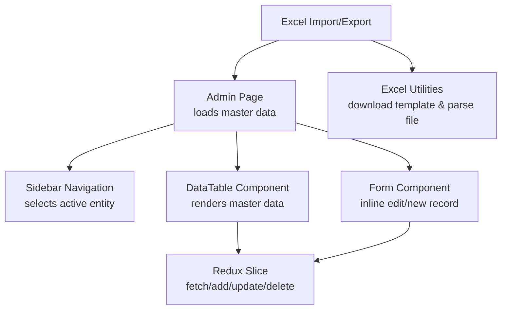
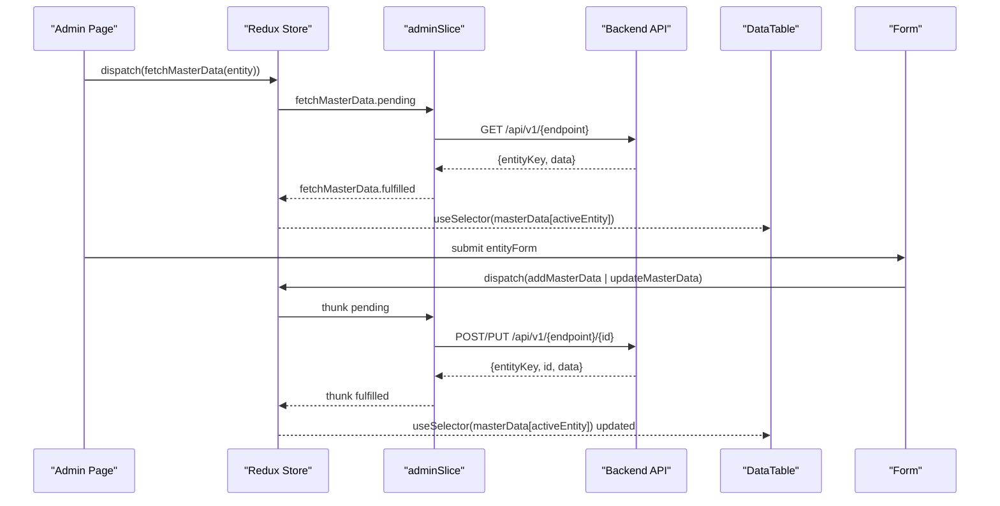
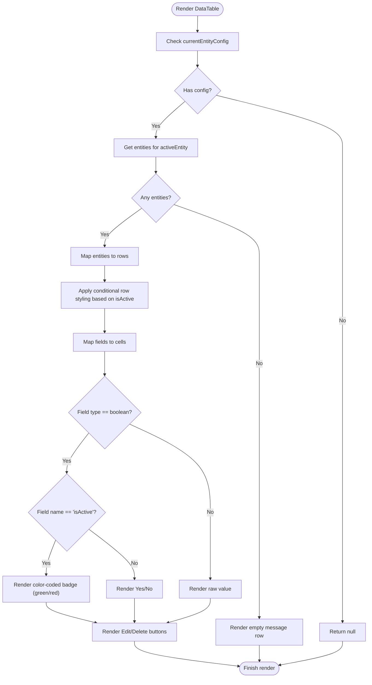
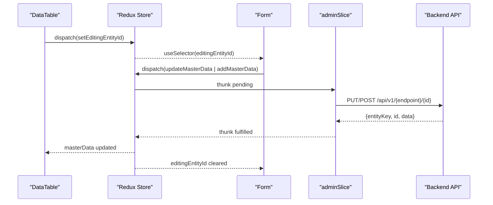
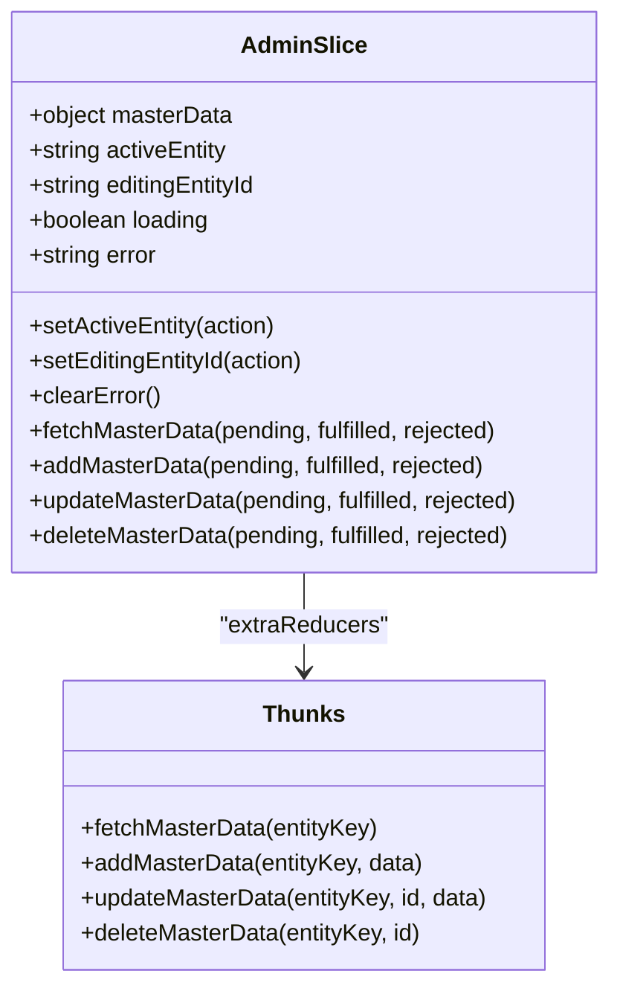
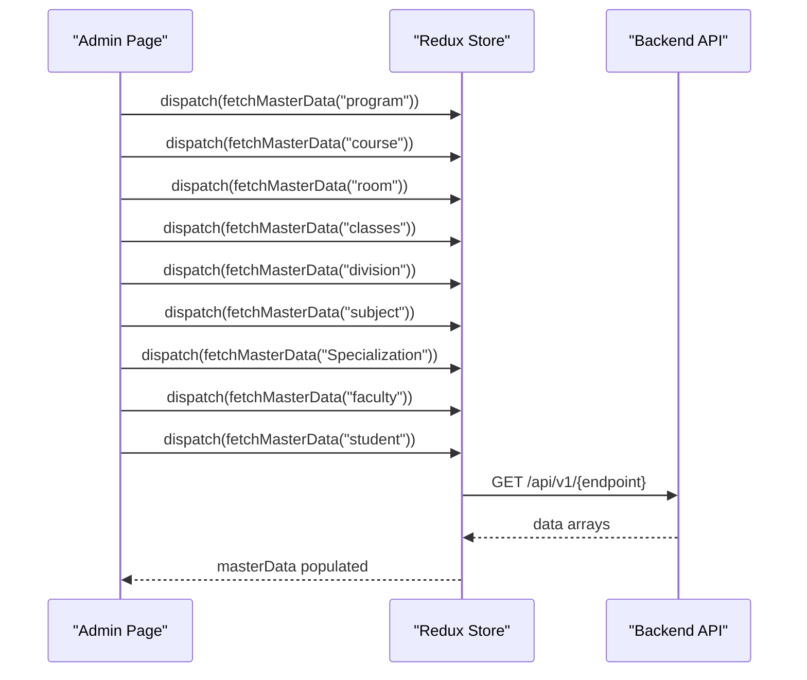
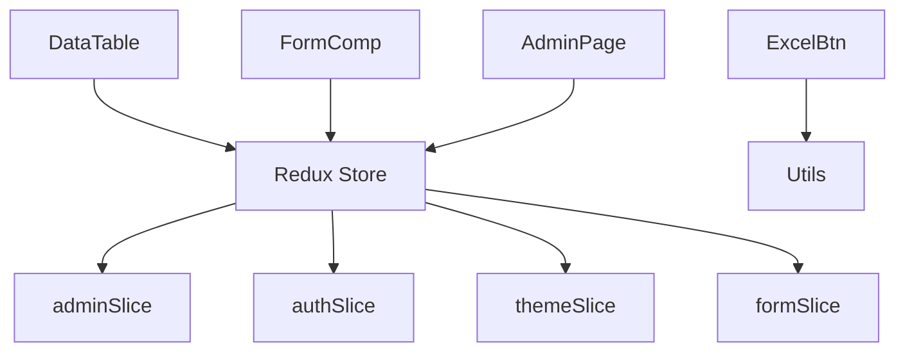

# Data Table Component

<cite>
**Referenced Files in This Document**
- [DataTable.jsx](file://Client/src/components/deshboard/DataTable.jsx)
- [adminSlice.js](file://Client/src/store/admin/adminSlice.js)
- [Admin.jsx](file://Client/src/pages/dashboard/Admin.jsx)
- [Form.jsx](file://Client/src/components/deshboard/Form.jsx)
- [SideBar.jsx](file://Client/src/components/deshboard/SideBar.jsx)
- [ExcelHendelButton.jsx](file://Client/src/components/ExcelHendelButton.jsx)
- [HandelExcelFile.js](file://Client/src/utils/HandelExcelFile.js)
- [store.js](file://Client/src/store/store.js)
</cite>

## Update Summary
**Changes Made**
- Enhanced DataTable component with specialized formatting for the isActive field using color-coded badges
- Added conditional row styling based on account status (green for active, red for inactive)
- Implemented visual feedback system for user status management
- Updated data formatting logic to handle boolean fields with badge display
- Added comprehensive filtering support for isActive field with dedicated filter controls

## Table of Contents
1. [Introduction](#introduction)
2. [Project Structure](#project-structure)
3. [Core Components](#core-components)
4. [Architecture Overview](#architecture-overview)
5. [Detailed Component Analysis](#detailed-component-analysis)
6. [Dependency Analysis](#dependency-analysis)
7. [Performance Considerations](#performance-considerations)
8. [Troubleshooting Guide](#troubleshooting-guide)
9. [Conclusion](#conclusion)
10. [Appendices](#appendices)

## Introduction
This document describes the data table component responsible for displaying and managing master data records in the administrative dashboard. It covers table rendering logic, column configuration, data formatting, sorting, filtering, pagination, row selection, bulk operations, inline editing, Redux integration, real-time refresh patterns, customization examples, responsive behavior, and accessibility features.

**Updated** Enhanced with specialized formatting for the isActive field with color-coded badges (green for active, red for inactive) and conditional row styling based on account status for improved visual feedback in user status management. The table now includes comprehensive filtering capabilities specifically designed for boolean fields like isActive.

## Project Structure
The data table resides within the dashboard module alongside related components for forms, sidebar navigation, and Excel import/export. Redux state manages data lifecycle and UI state.

**Diagram sources**
- [Admin.jsx:28-38](file://Client/src/pages/dashboard/Admin.jsx#L28-L38)
- [SideBar.jsx:3](file://Client/src/components/deshboard/SideBar.jsx#L3-L46)
- [Form.jsx:3](file://Client/src/components/deshboard/Form.jsx#L3-L124)
- [DataTable.jsx:5](file://Client/src/components/deshboard/DataTable.jsx#L5-L84)
- [adminSlice.js:24-78](file://Client/src/store/admin/adminSlice.js#L24-L78)
- [ExcelHendelButton.jsx:7](file://Client/src/components/ExcelHendelButton.jsx#L7-L84)
- [HandelExcelFile.js:6](file://Client/src/utils/HandelExcelFile.js#L6-L34)

**Section sources**
- [Admin.jsx:17-617](file://Client/src/pages/dashboard/Admin.jsx#L17-L617)
- [DataTable.jsx:1-135](file://Client/src/components/deshboard/DataTable.jsx#L1-L135)
- [adminSlice.js:1-173](file://Client/src/store/admin/adminSlice.js#L1-L173)

## Core Components
- DataTable: Renders master data rows and actions (edit/delete) with enhanced isActive field formatting and conditional row styling.
- Form: Inline editing and creation of records.
- adminSlice: Redux slice handling CRUD operations and state.
- Admin page: Orchestrates data loading, configuration, and layout.
- Sidebar: Entity selection and counts.
- Excel utilities: Template download and CSV parsing for bulk uploads.

**Section sources**
- [DataTable.jsx:5-135](file://Client/src/components/deshboard/DataTable.jsx#L5-L135)
- [Form.jsx:5-124](file://Client/src/components/deshboard/Form.jsx#L5-L124)
- [adminSlice.js:88-173](file://Client/src/store/admin/adminSlice.js#L88-L173)
- [Admin.jsx:52-406](file://Client/src/pages/dashboard/Admin.jsx#L52-L406)
- [SideBar.jsx:3-46](file://Client/src/components/deshboard/SideBar.jsx#L3-L46)
- [ExcelHendelButton.jsx:7-84](file://Client/src/components/ExcelHendelButton.jsx#L7-L84)
- [HandelExcelFile.js:6-34](file://Client/src/utils/HandelExcelFile.js#L6-L34)

## Architecture Overview
The table renders data driven by a configuration object that defines columns, labels, and types. Redux orchestrates data fetching, updates, and deletions. The Admin page initializes data for multiple entities and passes configuration and active entity to child components.

**Diagram sources**
- [Admin.jsx:28-38](file://Client/src/pages/dashboard/Admin.jsx#L28-L38)
- [adminSlice.js:24-78](file://Client/src/store/admin/adminSlice.js#L24-L78)
- [DataTable.jsx:7](file://Client/src/components/deshboard/DataTable.jsx#L7-L8)
- [Form.jsx:37-50](file://Client/src/components/deshboard/Form.jsx#L37-L50)

## Detailed Component Analysis

### DataTable Component
- Purpose: Render master data as a table with configurable columns and action buttons.
- Rendering logic:
  - Uses currentEntityConfig to define headers and cells.
  - Iterates over entities for the active entity and renders rows.
  - Boolean fields are formatted as Yes/No or color-coded badges for isActive field.
  - Actions column contains Edit and Delete buttons wired to Redux actions.
  - Rows receive conditional styling based on isActive status (green for active, red for inactive).
- Column configuration:
  - Fields array defines name, label, placeholder, required, and type (e.g., boolean).
  - Headers reflect field labels; cells reflect field values or formatted booleans/badges.
- Data formatting:
  - Boolean values are rendered as textual indicators except for isActive field.
  - isActive field displays color-coded badges: green for active, red for inactive.
  - Other values are shown as-is from entity data.
- Sorting, filtering, pagination:
  - Enhanced with comprehensive filtering support including dedicated boolean filters for isActive field.
  - Sorting implemented with visual indicators and toggle functionality.
  - Pagination with configurable items per page and navigation controls.
- Row selection and bulk operations:
  - Not implemented in the current component.
  - Would require checkboxes, selection state, and batch action handlers.
- Inline editing:
  - Not implemented in the current component.
  - Editing is handled by the Form component; DataTable triggers editing mode via Redux.
- Real-time refresh:
  - Redux updates masterData on add/update/delete; DataTable re-renders automatically.
- Accessibility:
  - Basic semantic table structure with headers and labels.
  - Suggested improvements: aria-labels, keyboard navigation, focus management.

**Updated** Enhanced with specialized formatting for the isActive field using color-coded badges and conditional row styling for improved visual feedback. Added comprehensive filtering capabilities with dedicated boolean filter controls for isActive field.

**Diagram sources**
- [DataTable.jsx:5-135](file://Client/src/components/deshboard/DataTable.jsx#L5-L135)

**Section sources**
- [DataTable.jsx:5-135](file://Client/src/components/deshboard/DataTable.jsx#L5-L135)

### Form Component (Inline Editing)
- Purpose: Provide inline editing and creation of records.
- Behavior:
  - Reads editingEntityId and pre-fills form with selected entity.
  - Handles input changes for text and boolean fields.
  - Submits either add or update based on presence of editingEntityId.
  - Resets form and clears editing state upon success.
- Integration with Redux:
  - Dispatches addMasterData or updateMasterData.
  - Clears error state after successful operation.

**Diagram sources**
- [DataTable.jsx:10-18](file://Client/src/components/deshboard/DataTable.jsx#L10-L18)
- [Form.jsx:12-21](file://Client/src/components/deshboard/Form.jsx#L12-L21)
- [Form.jsx:37-50](file://Client/src/components/deshboard/Form.jsx#L37-L50)
- [adminSlice.js:52-78](file://Client/src/store/admin/adminSlice.js#L52-L78)

**Section sources**
- [Form.jsx:5-124](file://Client/src/components/deshboard/Form.jsx#L5-L124)

### Redux Slice (adminSlice)
- Responsibilities:
  - Define API endpoints mapping for master entities.
  - Async thunks for fetch, add, update, delete.
  - Reducers for setActiveEntity, setEditingEntityId, clearError.
  - Extra reducers to update masterData on success and set loading/error states.
- Data updates:
  - fetchMasterData replaces stored data for the entity.
  - addMasterData appends new record.
  - updateMasterData replaces existing record by id.
  - deleteMasterData removes record by id.
- Integration points:
  - Used by DataTable for delete action.
  - Used by Form for add/update.
  - Used by Admin for initial data load.

**Diagram sources**
- [adminSlice.js:88-173](file://Client/src/store/admin/adminSlice.js#L88-L173)
- [adminSlice.js:24-78](file://Client/src/store/admin/adminSlice.js#L24-L78)

**Section sources**
- [adminSlice.js:1-173](file://Client/src/store/admin/adminSlice.js#L1-L173)

### Admin Page Orchestration
- Loads initial master data for multiple entities on mount.
- Maintains ENTITY_CONFIG with field definitions for each entity.
- Passes currentEntityConfig and activeEntity to DataTable and Form.
- Provides upload button integration with Excel utilities.

**Diagram sources**
- [Admin.jsx:28-38](file://Client/src/pages/dashboard/Admin.jsx#L28-L38)
- [adminSlice.js:24-36](file://Client/src/store/admin/adminSlice.js#L24-L36)

**Section sources**
- [Admin.jsx:17-617](file://Client/src/pages/dashboard/Admin.jsx#L17-L617)

### Sidebar Navigation
- Displays master entities with counts from Redux state.
- Sets activeEntity and clears editing state on selection.

**Section sources**
- [SideBar.jsx:3-46](file://Client/src/components/deshboard/SideBar.jsx#L3-L46)

### Excel Import/Export Integration
- Provides template download and file parsing utilities.
- Integrates with Admin page to upload parsed data via addMasterData.

**Section sources**
- [ExcelHendelButton.jsx:7-84](file://Client/src/components/ExcelHendelButton.jsx#L7-L84)
- [HandelExcelFile.js:6-34](file://Client/src/utils/HandelExcelFile.js#L6-L34)

## Dependency Analysis
- DataTable depends on:
  - Redux selectors for masterData and activeEntity.
  - Redux actions for editing and deletion.
- Form depends on:
  - Redux selectors for editingEntityId and masterData.
  - Redux actions for add/update.
- Admin orchestrates:
  - Redux actions for data loading and uploads.
  - Excel utilities for bulk operations.
- Redux store integrates:
  - adminSlice for master data management.
  - authSlice for authentication state.
  - themeSlice and formSlice for UI state.

**Diagram sources**
- [store.js:7-14](file://Client/src/store/store.js#L7-L14)
- [adminSlice.js:88-173](file://Client/src/store/admin/adminSlice.js#L88-L173)

**Section sources**
- [store.js:1-14](file://Client/src/store/store.js#L1-L14)
- [adminSlice.js:88-173](file://Client/src/store/admin/adminSlice.js#L88-L173)

## Performance Considerations
- Current implementation:
  - Renders all entities without pagination or virtualization.
  - No client-side sorting or filtering.
  - Enhanced formatting for isActive field uses efficient conditional rendering.
  - Conditional row styling applies CSS classes based on entity status.
- Recommended optimizations:
  - Virtualized lists for large datasets (e.g., react-window).
  - Client-side sorting/filtering with memoization.
  - Pagination with server-side support for large datasets.
  - Debounced search inputs to reduce re-renders.
  - Memoized selectors to prevent unnecessary re-renders.
  - Lazy loading of entity data on demand.
  - Optimized CSS class concatenation for conditional styling.

**Updated** Enhanced formatting and styling are optimized for performance with efficient conditional rendering and CSS class application. The new isActive field formatting uses lightweight badge components with minimal DOM overhead.

## Troubleshooting Guide
- Data not loading:
  - Verify backend endpoints and network connectivity.
  - Check Redux error state propagation in Admin page.
- Edit/Update fails:
  - Confirm entity id availability and endpoint correctness.
  - Inspect thunk rejection payload for error messages.
- Delete confirmation:
  - Ensure window.confirm is supported and not blocked by browser settings.
- Excel upload issues:
  - Validate uploaded file format (.xlsx/.xls).
  - Check console errors during parsing.
- isActive field formatting issues:
  - Verify entity data contains proper boolean values for isActive field.
  - Check CSS class names for badge styling and conditional row classes.
  - Ensure proper dark mode support with dark:bg-* variants.
  - Verify that filter controls are properly configured for boolean fields.
- Conditional styling problems:
  - Confirm that entity data includes proper boolean values for isActive.
  - Check that CSS utility classes are available in the build.
  - Verify that dark mode variants are properly applied.

**Updated** Added troubleshooting guidance for the new isActive field formatting, conditional styling, and enhanced filtering features.

**Section sources**
- [Admin.jsx:510-530](file://Client/src/pages/dashboard/Admin.jsx#L510-L530)
- [adminSlice.js:107-118](file://Client/src/store/admin/adminSlice.js#L107-L118)
- [adminSlice.js:139-152](file://Client/src/store/admin/adminSlice.js#L139-L152)
- [adminSlice.js:153-167](file://Client/src/store/admin/adminSlice.js#L153-L167)
- [HandelExcelFile.js:16-34](file://Client/src/utils/HandelExcelFile.js#L16-L34)

## Conclusion
The DataTable component provides a straightforward, configuration-driven rendering of master data with integrated CRUD actions via Redux. The enhanced version now includes specialized formatting for the isActive field with color-coded badges (green for active, red for inactive) and conditional row styling based on account status, providing improved visual feedback for user status management. The table now features comprehensive filtering capabilities with dedicated boolean filter controls for isActive field, along with enhanced sorting and pagination features. While bulk operations are not implemented, the architecture supports easy extension. The Admin page orchestrates data loading and configuration, while the Form component enables inline editing. Excel utilities facilitate bulk operations. Performance and accessibility can be improved with virtualization, memoization, and semantic enhancements.

**Updated** Enhanced with improved visual feedback system for user status management through color-coded badges, conditional row styling, and comprehensive filtering capabilities for boolean fields.

## Appendices

### Column Configuration Reference
- Fields array defines:
  - name: data property key.
  - label: column header text.
  - placeholder: input hint text.
  - required: boolean flag.
  - type: "boolean" for checkbox rendering.
- Special handling for isActive field:
  - Displays color-coded badges instead of boolean text.
  - Green badge for active users, red badge for inactive users.
  - Integrated with filtering system for boolean value selection.

**Updated** Added special handling for isActive field with color-coded badge formatting and enhanced filtering integration.

**Section sources**
- [Admin.jsx:52-406](file://Client/src/pages/dashboard/Admin.jsx#L52-L406)
- [DataTable.jsx:33-47](file://Client/src/components/deshboard/DataTable.jsx#L33-L47)

### Customization Examples
- Custom cell renderer:
  - Extend field.type to support "date", "select", or "custom".
  - Add a switch/case in DataTable to render specialized components.
- Color-coded status badges:
  - isActive field automatically renders colored badges based on boolean value.
  - Green badges for active users, red badges for inactive users.
  - Uses Tailwind CSS utility classes for consistent styling across themes.
- Conditional row styling:
  - Rows receive background color based on entity.isActive status.
  - Green background for active entities, red background for inactive entities.
  - Includes dark mode support with appropriate variants.
- Enhanced filtering:
  - Dedicated boolean filter controls for isActive field.
  - Filter panel with expandable interface for multiple field filtering.
  - Real-time filter application with visual indicators.
- Responsive behavior:
  - Wrap table container with overflow-x-auto and adjust grid layouts for small screens.
  - Consider horizontal scrolling on narrow devices.
  - Filter panel adapts to mobile screen sizes.
- Accessibility:
  - Add aria-labels to buttons and inputs.
  - Implement keyboard navigation for actions.
  - Ensure sufficient color contrast and focus indicators.
  - Badge elements maintain proper semantic meaning for screen readers.
  - Filter controls include proper labeling and keyboard interaction.

**Updated** Added examples for color-coded status badges, conditional row styling, and enhanced filtering customization with comprehensive accessibility considerations.

### isActive Field Styling Implementation
The isActive field now includes sophisticated visual styling:

**Badge Styling:**
- Active users: Green badges with `bg-green-100 text-green-800 dark:bg-green-900/50 dark:text-green-300`
- Inactive users: Red badges with `bg-red-100 text-red-800 dark:bg-red-900/50 dark:text-red-300`

**Conditional Row Styling:**
- Active users: Light green background with `bg-green-50/50 dark:bg-green-900/10`
- Inactive users: Light red background with `bg-red-50/50 dark:bg-red-900/10`

**Filter Integration:**
- Dedicated boolean filter controls in filter panel
- "Active" and "Inactive" options for quick filtering
- Visual indicators showing active filters

**Section sources**
- [DataTable.jsx:109-140](file://Client/src/components/deshboard/DataTable.jsx#L109-L140)
- [DataTable.jsx:377-385](file://Client/src/components/deshboard/DataTable.jsx#L377-L385)
- [DataTable.jsx:288-297](file://Client/src/components/deshboard/DataTable.jsx#L288-L297)
- [Admin.jsx:732-736](file://Client/src/pages/dashboard/Admin.jsx#L732-L736)