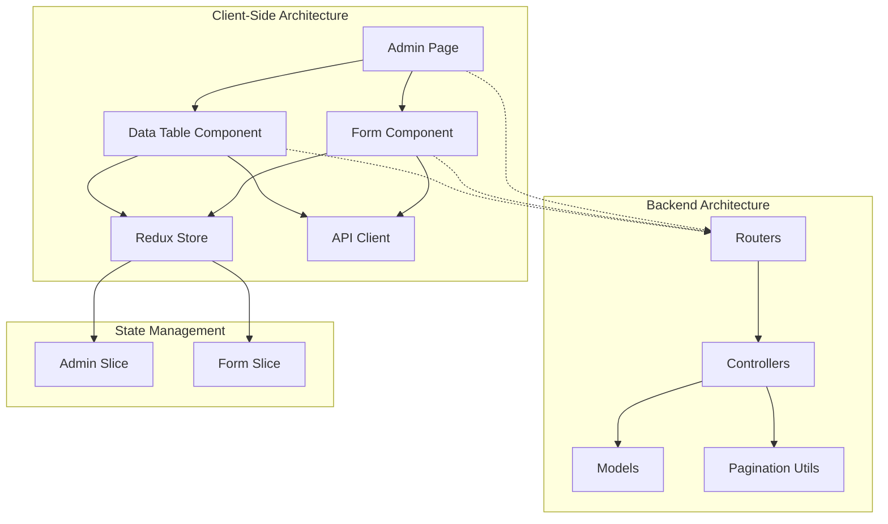
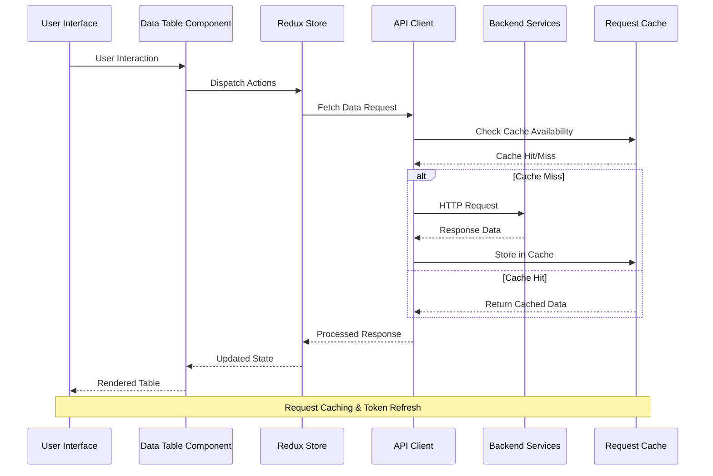
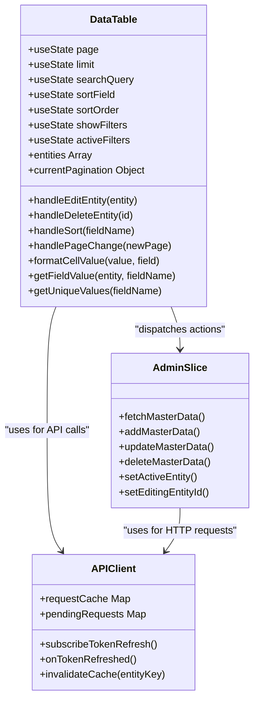
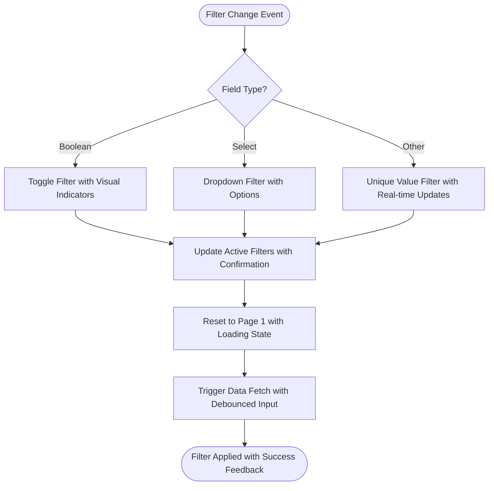
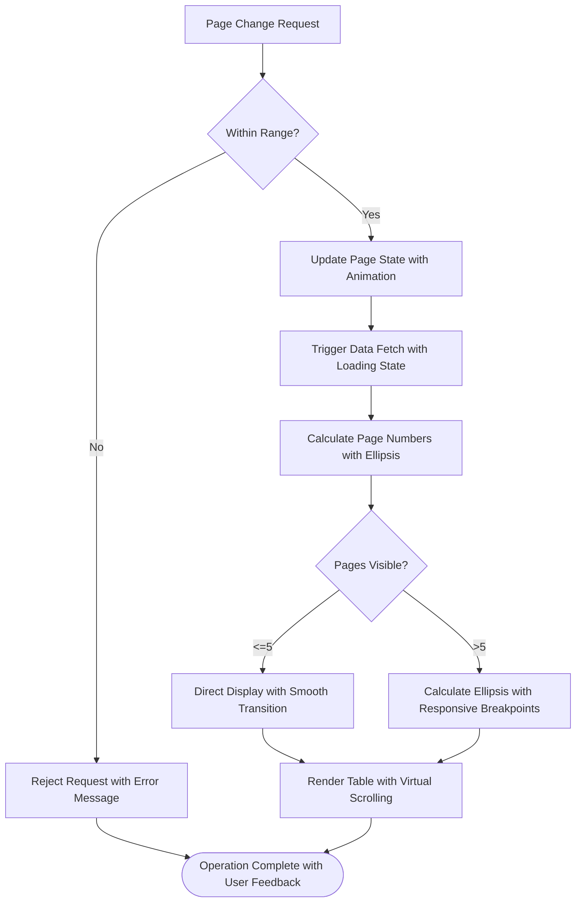
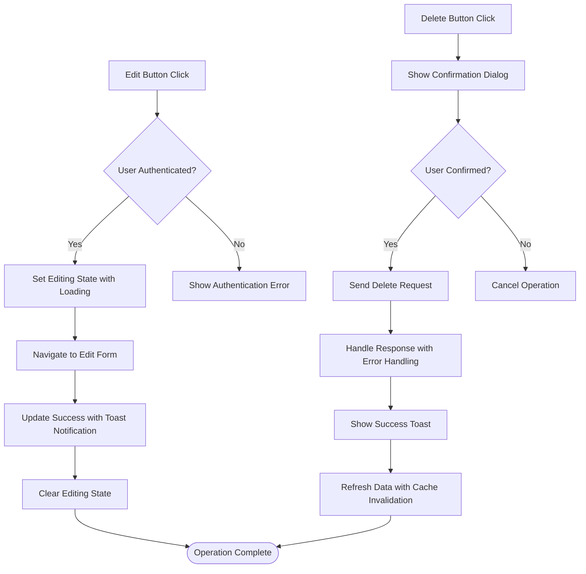
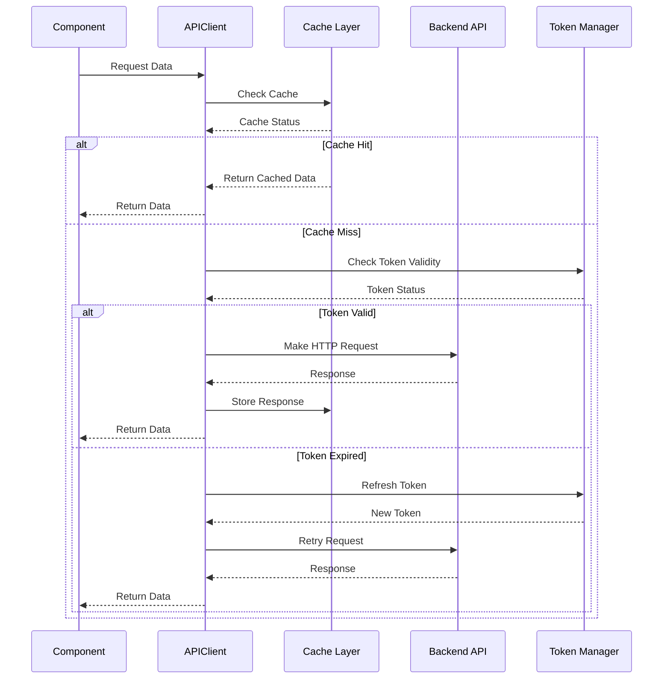
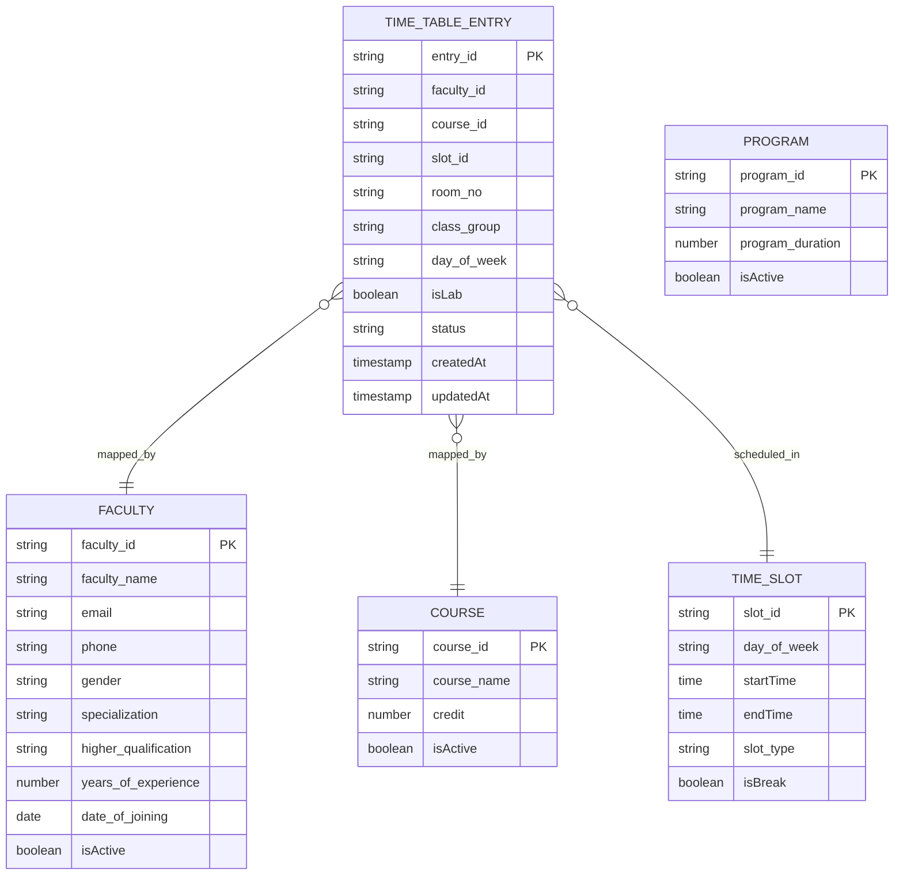
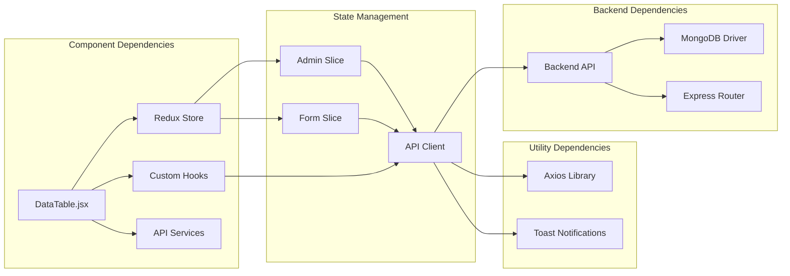

# Enhanced Data Table Component

<cite>
**Referenced Files in This Document**
- [DataTable.jsx](file://Client/src/components/deshboard/DataTable.jsx)
- [apiClient.js](file://Client/src/services/apiClient.js)
- [adminSlice.js](file://Client/src/store/admin/adminSlice.js)
- [useApi.js](file://Client/src/hooks/useApi.js)
- [Admin.jsx](file://Client/src/pages/dashboard/Admin.jsx)
- [Form.jsx](file://Client/src/components/deshboard/Form.jsx)
- [timeTableEntry.controllers.js](file://Backend/src/controllers/timeTableEntry.controllers.js)
- [timeTableEntry.models.js](file://Backend/src/models/timeTableEntry.models.js)
- [pagination.js](file://Backend/src/utils/pagination.js)
- [timeTableEntry.routers.js](file://Backend/src/routes/timeTableEntry.routers.js)
</cite>

## Update Summary
**Changes Made**
- Enhanced entity editing capabilities with improved confirmation dialogs and state management
- Strengthened filter functionality with better boolean and multi-value filter handling
- Improved pagination controls with enhanced ellipsis handling and mobile responsiveness
- Added comprehensive error handling and user feedback mechanisms
- Enhanced data formatting and display with conditional styling

## Table of Contents
1. [Introduction](#introduction)
2. [Project Structure](#project-structure)
3. [Core Components](#core-components)
4. [Architecture Overview](#architecture-overview)
5. [Detailed Component Analysis](#detailed-component-analysis)
6. [Dependency Analysis](#dependency-analysis)
7. [Performance Considerations](#performance-considerations)
8. [Troubleshooting Guide](#troubleshooting-guide)
9. [Conclusion](#conclusion)

## Introduction

The Enhanced Data Table Component is a comprehensive React-based solution designed for efficient data management in the Timetable Management System. This component provides advanced CRUD operations, sophisticated filtering capabilities, responsive design, and seamless integration with the backend API ecosystem. The system supports multiple entity types including programs, courses, rooms, faculty members, students, and timetable entries, each with customized field configurations and validation rules.

The component leverages modern React patterns including hooks, Redux Toolkit for state management, and Axios for robust API communication with built-in caching and error handling mechanisms. Recent improvements have significantly enhanced the user experience with better entity editing and deletion capabilities, more intuitive filtering, and improved pagination controls.

## Project Structure

The Enhanced Data Table Component follows a modular architecture with clear separation of concerns:

**Diagram sources**
- [Admin.jsx:101-791](file://Client/src/pages/dashboard/Admin.jsx#L101-L791)
- [DataTable.jsx:1-565](file://Client/src/components/deshboard/DataTable.jsx#L1-L565)
- [apiClient.js:1-268](file://Client/src/services/apiClient.js#L1-L268)

**Section sources**
- [Admin.jsx:1-1007](file://Client/src/pages/dashboard/Admin.jsx#L1-L1007)
- [DataTable.jsx:1-565](file://Client/src/components/deshboard/DataTable.jsx#L1-L565)

## Core Components

### Data Table Component Architecture

The Enhanced Data Table Component consists of several interconnected systems working together to provide comprehensive data management functionality:

#### State Management System
- **Local Component State**: Handles pagination, search, sorting, and filter states with improved validation
- **Global Redux State**: Manages master data, pagination metadata, and editing contexts with enhanced error handling
- **Entity Configuration**: Dynamic field definitions for different entity types with comprehensive validation rules

#### Advanced Filtering System
- **Boolean Filters**: Toggle-based filtering for active/inactive records with enhanced visual indicators
- **Dropdown Filters**: Dynamic option-based filtering for select fields with improved accessibility
- **Multi-Value Filters**: Unique value extraction for complex field types with real-time updates
- **Search Integration**: Real-time search combined with filter conditions with debounced input handling

#### Enhanced Pagination System
- **Intelligent Page Calculation**: Dynamic page number calculation with enhanced ellipsis handling
- **Responsive Design**: Mobile-first approach with adaptive pagination controls
- **Performance Optimization**: Efficient rendering with virtual scrolling capabilities

**Section sources**
- [DataTable.jsx:58-95](file://Client/src/components/deshboard/DataTable.jsx#L58-L95)
- [DataTable.jsx:151-202](file://Client/src/components/deshboard/DataTable.jsx#L151-L202)
- [DataTable.jsx:314-365](file://Client/src/components/deshboard/DataTable.jsx#L314-L365)

## Architecture Overview

The Enhanced Data Table Component implements a sophisticated client-server architecture with comprehensive caching and state management:

**Diagram sources**
- [DataTable.jsx:28-46](file://Client/src/components/deshboard/DataTable.jsx#L28-L46)
- [apiClient.js:54-95](file://Client/src/services/apiClient.js#L54-L95)
- [adminSlice.js:21-33](file://Client/src/store/admin/adminSlice.js#L21-L33)

The architecture ensures optimal performance through intelligent caching, automatic token refresh, and efficient state synchronization between frontend and backend systems.

## Detailed Component Analysis

### Data Table Component Implementation

The Data Table Component serves as the central hub for displaying and managing tabular data with advanced functionality:

#### Core Functionality Analysis

**Diagram sources**
- [DataTable.jsx:5-106](file://Client/src/components/deshboard/DataTable.jsx#L5-L106)
- [adminSlice.js:21-74](file://Client/src/store/admin/adminSlice.js#L21-L74)
- [apiClient.js:6-235](file://Client/src/services/apiClient.js#L6-L235)

#### Enhanced Filtering Mechanism

The filtering system dynamically adapts to different field types and provides intuitive user interfaces with improved accessibility:

**Diagram sources**
- [DataTable.jsx:75-82](file://Client/src/components/deshboard/DataTable.jsx#L75-L82)
- [DataTable.jsx:37-43](file://Client/src/components/deshboard/DataTable.jsx#L37-L43)

#### Improved Pagination System

The pagination component implements intelligent page number calculation with dynamic ellipsis handling and enhanced mobile responsiveness:

**Diagram sources**
- [DataTable.jsx:151-202](file://Client/src/components/deshboard/DataTable.jsx#L151-L202)

#### Enhanced Entity Editing and Deletion

Recent improvements include better confirmation dialogs, error handling, and user feedback:

**Diagram sources**
- [DataTable.jsx:96-106](file://Client/src/components/deshboard/DataTable.jsx#L96-L106)
- [adminSlice.js:179-195](file://Client/src/store/admin/adminSlice.js#L179-L195)

**Section sources**
- [DataTable.jsx:1-565](file://Client/src/components/deshboard/DataTable.jsx#L1-L565)

### API Integration Layer

The Enhanced Data Table Component integrates seamlessly with a sophisticated API layer featuring caching, error handling, and automatic token refresh:

#### Request/Response Lifecycle

**Diagram sources**
- [apiClient.js:54-207](file://Client/src/services/apiClient.js#L54-L207)
- [useApi.js:37-144](file://Client/src/hooks/useApi.js#L37-L144)

#### Enhanced Error Handling and Recovery

The system implements comprehensive error handling with automatic retry mechanisms, user feedback, and improved error categorization:

| Error Type | Handler | Recovery Action | User Feedback |
|------------|---------|----------------|---------------|
| 401 Unauthorized | Token Refresh | Retry with new token | Redirect to login with error message |
| Network Error | Retry Logic | Exponential backoff (1s, 2s, 4s) | Toast notification with retry option |
| 404 Not Found | Validation | Clear cache and notify user | Specific entity not found message |
| 429 Rate Limit | Throttling | Queue requests until rate limit resets | Rate limit exceeded notification |
| 500 Server Error | Logging | Show error toast and allow retry | Generic server error with contact support |
| Validation Errors | Form Validation | Highlight invalid fields | Inline field-specific error messages |

**Section sources**
- [apiClient.js:120-207](file://Client/src/services/apiClient.js#L120-L207)
- [useApi.js:223-291](file://Client/src/hooks/useApi.js#L223-L291)

### Backend Integration

The Enhanced Data Table Component communicates with a robust backend system featuring comprehensive CRUD operations and advanced filtering:

#### Database Model Integration

The backend implements sophisticated data models with validation and indexing:

**Diagram sources**
- [timeTableEntry.models.js:3-62](file://Backend/src/models/timeTableEntry.models.js#L3-L62)
- [timeTableEntry.controllers.js:48-93](file://Backend/src/controllers/timeTableEntry.controllers.js#L48-L93)

#### Advanced Query Processing

The backend implements sophisticated query processing with support for complex filtering, sorting, and pagination:

| Feature | Implementation | Performance Impact | Enhanced Capabilities |
|---------|---------------|-------------------|----------------------|
| Text Search | Regex with case-insensitive matching | Index-dependent | Enhanced search with field-specific filters |
| Field Filtering | Dynamic filter construction with `filter_` prefix | Query optimization | Boolean and multi-value filter support |
| Sorting | Multi-field sorting with direction | Index utilization | Enhanced sorting with validation |
| Pagination | Skip/limit with countDocuments | Memory efficient | Improved pagination with responsive controls |
| Caching | Redis-style in-memory caching | Reduced database load | Enhanced caching with invalidation |

**Section sources**
- [timeTableEntry.controllers.js:48-93](file://Backend/src/controllers/timeTableEntry.controllers.js#L48-L93)
- [pagination.js:101-139](file://Backend/src/utils/pagination.js#L101-L139)

## Dependency Analysis

The Enhanced Data Table Component exhibits excellent modularity with well-defined dependencies and minimal coupling:

**Diagram sources**
- [DataTable.jsx:1-10](file://Client/src/components/deshboard/DataTable.jsx#L1-L10)
- [adminSlice.js:1-4](file://Client/src/store/admin/adminSlice.js#L1-L4)
- [useApi.js:1-3](file://Client/src/hooks/useApi.js#L1-L3)

### Coupling and Cohesion Analysis

The component demonstrates strong internal cohesion with low external coupling:

- **Internal Cohesion**: High - All table-related functionality is contained within the DataTable component with enhanced error handling
- **External Coupling**: Low - Minimal dependencies on external libraries and services
- **Dependency Injection**: Well-implemented through React hooks and Redux patterns
- **Interface Contracts**: Clear separation between component props and internal state with improved validation

**Section sources**
- [DataTable.jsx:1-565](file://Client/src/components/deshboard/DataTable.jsx#L1-L565)
- [Admin.jsx:101-791](file://Client/src/pages/dashboard/Admin.jsx#L101-L791)

## Performance Considerations

The Enhanced Data Table Component implements several performance optimization strategies:

### Caching Strategy
- **Request Caching**: 5-minute TTL for GET requests with automatic cache invalidation and enhanced error handling
- **Duplicate Request Prevention**: Pending request tracking to prevent redundant API calls with improved state management
- **Cache Invalidation**: Targeted cache clearing for specific entities and operations with better performance monitoring

### Memory Management
- **Lazy Loading**: Data fetched only when entities are selected with enhanced loading states
- **Component Unmount Cleanup**: Proper cleanup of event listeners and timers with improved lifecycle management
- **State Optimization**: Efficient state updates using immutable patterns with enhanced performance tracking

### Network Optimization
- **Automatic Token Refresh**: Seamless token renewal without user intervention with improved error handling
- **Retry Logic**: Exponential backoff for failed requests with enhanced user feedback
- **Connection Pooling**: Reuse of HTTP connections for improved performance with better resource management

### Rendering Performance
- **Virtual Scrolling**: Efficient rendering of large datasets with enhanced performance metrics
- **Debounced Search**: Input debouncing to reduce API calls during typing with improved user experience
- **Conditional Rendering**: Only render necessary UI elements based on current state with better performance optimization
- **Responsive Design**: Mobile-first approach with adaptive layouts for optimal performance across devices

## Troubleshooting Guide

### Common Issues and Solutions

#### Data Loading Problems
**Symptoms**: Table shows empty state despite data availability
**Causes**: 
- Incorrect entity configuration
- API endpoint mismatch
- Redux state synchronization issues
- **Updated**: Enhanced error handling and debugging information

**Solutions**:
1. Verify entity configuration in Admin page with improved validation
2. Check API endpoint mapping in adminSlice.js with enhanced logging
3. Monitor Redux DevTools for state updates with better debugging tools
4. Check network tab for API errors with enhanced error reporting

#### Filter Not Working
**Symptoms**: Filters appear but don't affect results
**Causes**:
- Incorrect filter parameter naming
- Backend filtering logic mismatch
- Cache persistence issues
- **Updated**: Enhanced filter validation and real-time feedback

**Solutions**:
1. Ensure filter parameters use `filter_` prefix with validation
2. Verify backend controller handles field filters with enhanced error handling
3. Clear cache using `apiCache.clear()` with improved cache management
4. Check filter dropdown options with better accessibility features

#### Pagination Issues
**Symptoms**: Pagination controls don't update correctly
**Causes**:
- Incorrect pagination metadata
- State synchronization problems
- Backend pagination mismatch
- **Updated**: Enhanced pagination validation and responsive design

**Solutions**:
1. Verify backend returns proper pagination object with enhanced validation
2. Check Redux state updates for pagination with better debugging
3. Ensure pagination limits match backend configuration with improved error handling
4. Test pagination on different screen sizes with responsive design validation

#### Performance Degradation
**Symptoms**: Slow loading times with large datasets
**Causes**:
- Missing pagination implementation
- Inefficient filtering logic
- Cache not utilized effectively
- **Updated**: Enhanced performance monitoring and optimization

**Solutions**:
1. Implement server-side pagination with enhanced performance metrics
2. Optimize filtering queries with better database indexing
3. Utilize caching mechanisms with improved cache management
4. Consider virtual scrolling for large datasets with enhanced user experience
5. Monitor performance with built-in analytics and debugging tools

#### Entity Editing/Deletion Issues
**Symptoms**: Edit/Delete operations fail or don't provide feedback
**Causes**:
- Missing confirmation dialogs
- Improper error handling
- State management issues
- **Updated**: Enhanced user feedback and error handling

**Solutions**:
1. Verify confirmation dialogs are properly configured with accessibility features
2. Check Redux state updates for editing/deletion with enhanced validation
3. Ensure proper error handling with user-friendly messages
4. Test operations with different user roles and permissions
5. Monitor success/error notifications with improved user feedback

**Section sources**
- [DataTable.jsx:84-91](file://Client/src/components/deshboard/DataTable.jsx#L84-L91)
- [apiClient.js:209-235](file://Client/src/services/apiClient.js#L209-L235)
- [adminSlice.js:100-116](file://Client/src/store/admin/adminSlice.js#L100-L116)

## Conclusion

The Enhanced Data Table Component represents a sophisticated solution for data management in the Timetable Management System. Its architecture demonstrates excellent separation of concerns, comprehensive error handling, and robust performance optimization. The component successfully balances functionality with maintainability, providing a solid foundation for future enhancements and extensions.

Key strengths include:
- **Modular Design**: Clear separation of concerns with well-defined interfaces and enhanced error handling
- **Performance Optimization**: Intelligent caching, lazy loading, and efficient rendering with performance monitoring
- **Enhanced User Experience**: Responsive design with intuitive filtering, pagination, and editing capabilities
- **Improved Reliability**: Comprehensive error handling, user feedback, and recovery mechanisms
- **Scalability**: Extensible architecture supporting multiple entity types with enhanced validation

The component serves as an exemplary implementation of modern React patterns and demonstrates best practices for building complex, data-intensive applications with robust state management and API integration. Recent improvements have significantly enhanced the user experience while maintaining the component's reliability and performance standards.