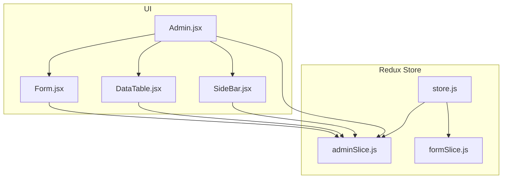
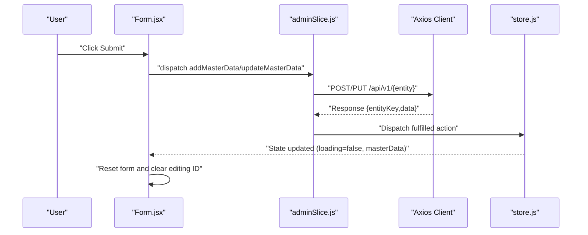
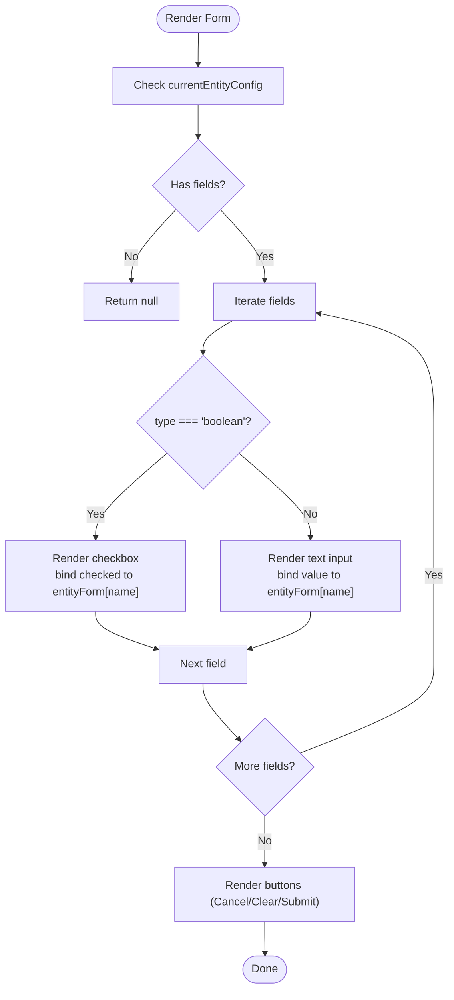
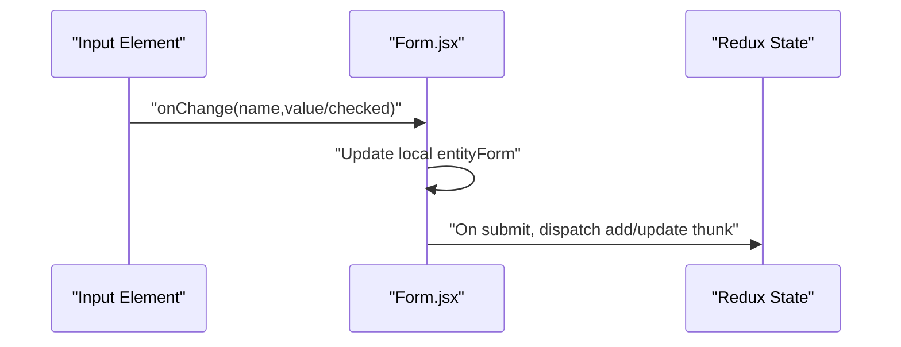
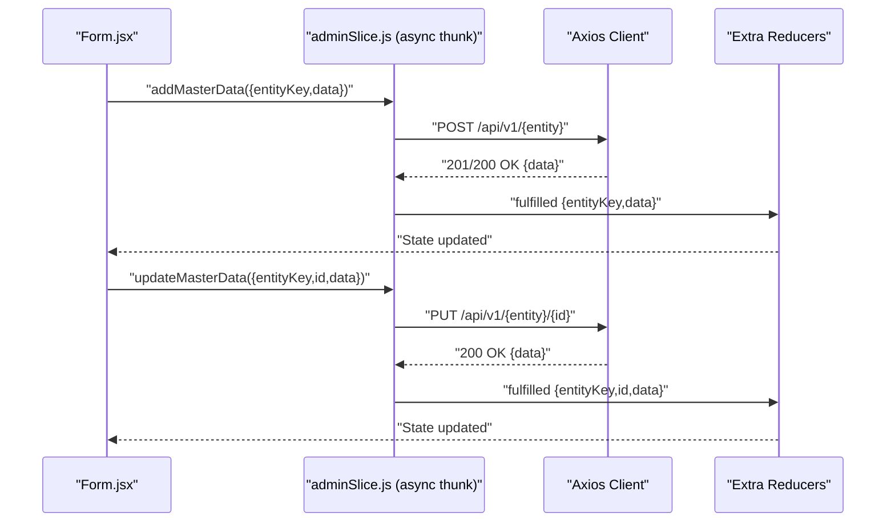
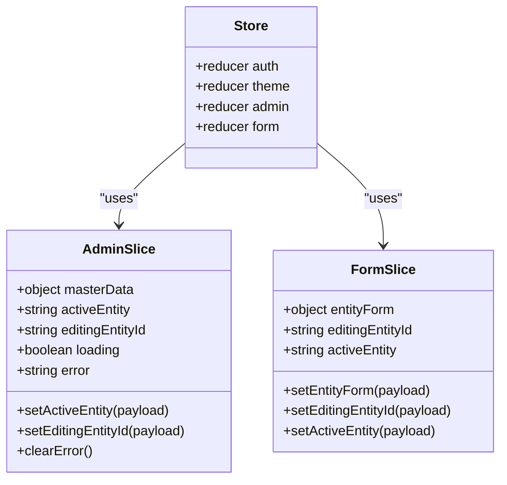
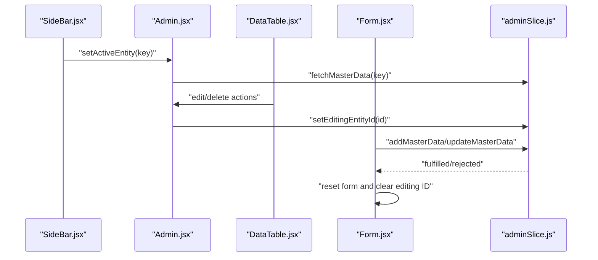
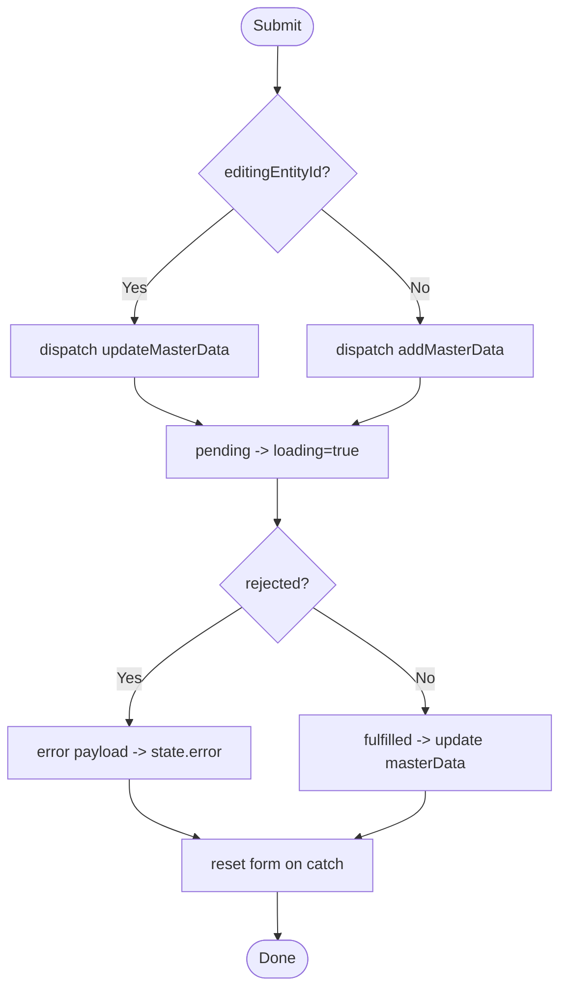
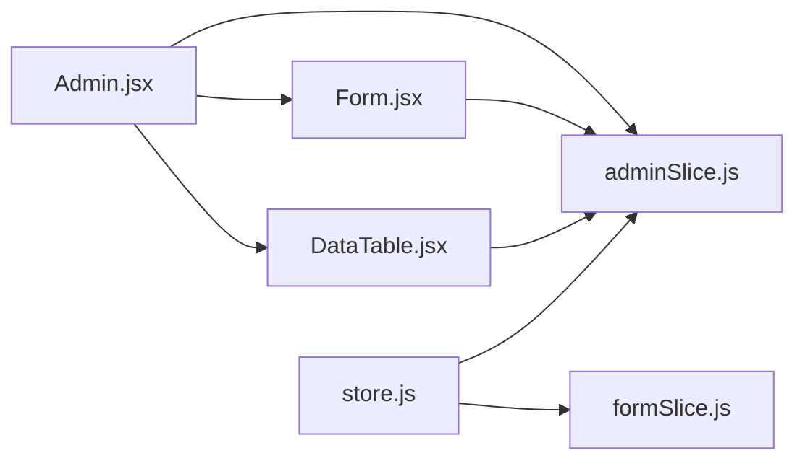

# Form Handling System

<cite>
**Referenced Files in This Document**
- [formSlice.js](file://Client/src/store/formSlice.js)
- [adminSlice.js](file://Client/src/store/admin/adminSlice.js)
- [store.js](file://Client/src/store/store.js)
- [Form.jsx](file://Client/src/components/deshboard/Form.jsx)
- [DataTable.jsx](file://Client/src/components/deshboard/DataTable.jsx)
- [SideBar.jsx](file://Client/src/components/deshboard/SideBar.jsx)
- [Admin.jsx](file://Client/src/pages/dashboard/Admin.jsx)
</cite>

## Table of Contents
1. [Introduction](#introduction)
2. [Project Structure](#project-structure)
3. [Core Components](#core-components)
4. [Architecture Overview](#architecture-overview)
5. [Detailed Component Analysis](#detailed-component-analysis)
6. [Dependency Analysis](#dependency-analysis)
7. [Performance Considerations](#performance-considerations)
8. [Troubleshooting Guide](#troubleshooting-guide)
9. [Conclusion](#conclusion)
10. [Appendices](#appendices)

## Introduction
This document explains the form handling system that powers dynamic master data entry across multiple entity types (programs, courses, rooms, classes, sections, subjects, specializations, faculties, students). It covers:
- Dynamic form generation driven by entity configuration
- Input field mapping and data binding patterns
- Async thunk-based submission with robust error handling and success feedback
- Redux slice state management for forms and admin operations
- Integration with master data CRUD operations
- Accessibility, responsive design, and UX patterns

## Project Structure
The form system spans UI components, Redux slices, and page-level orchestration:
- Store configuration wires together auth, theme, admin, and form slices
- Admin slice encapsulates async CRUD operations and state transitions
- Form component renders dynamic forms based on entity configuration
- DataTable and SideBar support selection, editing, and deletion
- Admin page composes all pieces and supplies entity configurations

**Diagram sources**
- [store.js:1-15](file://Client/src/store/store.js#L1-L15)
- [adminSlice.js:1-173](file://Client/src/store/admin/adminSlice.js#L1-L173)
- [formSlice.js:1-24](file://Client/src/store/formSlice.js#L1-L24)
- [Admin.jsx:1-617](file://Client/src/pages/dashboard/Admin.jsx#L1-L617)
- [SideBar.jsx:1-49](file://Client/src/components/deshboard/SideBar.jsx#L1-L49)
- [Form.jsx:1-127](file://Client/src/components/deshboard/Form.jsx#L1-L127)
- [DataTable.jsx:1-86](file://Client/src/components/deshboard/DataTable.jsx#L1-L86)

**Section sources**
- [store.js:1-15](file://Client/src/store/store.js#L1-L15)
- [adminSlice.js:1-173](file://Client/src/store/admin/adminSlice.js#L1-L173)
- [formSlice.js:1-24](file://Client/src/store/formSlice.js#L1-L24)
- [Admin.jsx:1-617](file://Client/src/pages/dashboard/Admin.jsx#L1-L617)
- [SideBar.jsx:1-49](file://Client/src/components/deshboard/SideBar.jsx#L1-L49)
- [Form.jsx:1-127](file://Client/src/components/deshboard/Form.jsx#L1-L127)
- [DataTable.jsx:1-86](file://Client/src/components/deshboard/DataTable.jsx#L1-L86)

## Core Components
- Admin slice: Async thunks for fetching, adding, updating, and deleting master data; manages loading/error states and updates local masterData cache per entity.
- Form component: Renders dynamic forms from entity configuration, binds inputs to local state, and dispatches async thunks for submit/cancel/reset.
- DataTable component: Lists existing entities, supports edit and delete actions via Redux.
- SideBar component: Entity navigation and counts derived from masterData.
- Store wiring: Combines auth, theme, admin, and form slices under a single store.

Key responsibilities:
- Dynamic rendering: Field definitions drive input types and labels
- Data binding: Controlled inputs update local form state; submission dispatches async thunks
- State transitions: Pending/fulfilled/rejected states update loading and error flags
- Editing lifecycle: Selecting an entity populates the form for editing

**Section sources**
- [adminSlice.js:1-173](file://Client/src/store/admin/adminSlice.js#L1-L173)
- [Form.jsx:1-127](file://Client/src/components/deshboard/Form.jsx#L1-L127)
- [DataTable.jsx:1-86](file://Client/src/components/deshboard/DataTable.jsx#L1-L86)
- [SideBar.jsx:1-49](file://Client/src/components/deshboard/SideBar.jsx#L1-L49)
- [store.js:1-15](file://Client/src/store/store.js#L1-L15)

## Architecture Overview
The form handling system follows a unidirectional data flow:
- UI triggers actions (set active entity, set editing ID, submit form)
- Async thunks perform network requests and update Redux state
- UI re-renders based on state changes (loading, error, masterData)

**Diagram sources**
- [Form.jsx:37-50](file://Client/src/components/deshboard/Form.jsx#L37-L50)
- [adminSlice.js:38-78](file://Client/src/store/admin/adminSlice.js#L38-L78)
- [store.js:7-14](file://Client/src/store/store.js#L7-L14)

## Detailed Component Analysis

### Dynamic Form Generation
- Entity configuration defines label, plural label, and fields for each master entity.
- Fields specify name, label, placeholder, required flag, and optional type (e.g., boolean).
- The Form component iterates over fields to render inputs:
  - Text inputs for string fields
  - Checkbox inputs for boolean fields
- Required fields render asterisks and HTML required attributes.

**Diagram sources**
- [Admin.jsx:52-406](file://Client/src/pages/dashboard/Admin.jsx#L52-L406)
- [Form.jsx:65-96](file://Client/src/components/deshboard/Form.jsx#L65-L96)

**Section sources**
- [Admin.jsx:52-406](file://Client/src/pages/dashboard/Admin.jsx#L52-L406)
- [Form.jsx:52-127](file://Client/src/components/deshboard/Form.jsx#L52-L127)

### Input Field Mapping and Data Binding
- Controlled components: Each input’s value is bound to local state (entityForm[name]).
- Change handler updates entityForm with name/value or checked for checkboxes.
- On submit, entityForm is dispatched to the appropriate async thunk.

**Diagram sources**
- [Form.jsx:23-29](file://Client/src/components/deshboard/Form.jsx#L23-L29)
- [Form.jsx:37-50](file://Client/src/components/deshboard/Form.jsx#L37-L50)

**Section sources**
- [Form.jsx:10-35](file://Client/src/components/deshboard/Form.jsx#L10-L35)
- [Form.jsx:23-29](file://Client/src/components/deshboard/Form.jsx#L23-L29)

### Async Thunk Implementation for Form Submissions
- addMasterData: Posts new records to the backend endpoint for the active entity.
- updateMasterData: Patches an existing record by ID.
- Both thunks:
  - Accept { entityKey, data } for add and { entityKey, id, data } for update
  - Use axios client with credentials
  - Return { entityKey, data } on success; payload includes error messages on rejection
- Extra reducers manage pending/fulfilled/rejected transitions and update masterData accordingly.

**Diagram sources**
- [adminSlice.js:38-78](file://Client/src/store/admin/adminSlice.js#L38-L78)
- [adminSlice.js:104-168](file://Client/src/store/admin/adminSlice.js#L104-L168)

**Section sources**
- [adminSlice.js:38-78](file://Client/src/store/admin/adminSlice.js#L38-L78)
- [adminSlice.js:104-168](file://Client/src/store/admin/adminSlice.js#L104-L168)

### Form State Management Through Redux Slices
- admin slice:
  - Manages activeEntity, editingEntityId, loading, error, and masterData cache
  - Provides setActiveEntity, setEditingEntityId, clearError
  - Extra reducers update state on async thunk outcomes
- form slice:
  - Holds entityForm, editingEntityId, and activeEntity for form-scoped state
  - Exposes setters for entityForm, editingEntityId, and activeEntity

**Diagram sources**
- [adminSlice.js:80-173](file://Client/src/store/admin/adminSlice.js#L80-L173)
- [formSlice.js:3-24](file://Client/src/store/formSlice.js#L3-L24)
- [store.js:7-14](file://Client/src/store/store.js#L7-L14)

**Section sources**
- [adminSlice.js:80-173](file://Client/src/store/admin/adminSlice.js#L80-L173)
- [formSlice.js:3-24](file://Client/src/store/formSlice.js#L3-L24)
- [store.js:7-14](file://Client/src/store/store.js#L7-L14)

### Integration With Master Data CRUD Operations
- SideBar selects an active entity and clears editing ID
- DataTable lists entities and triggers edit/delete actions
- Form reads editingEntityId and masterData to prefill for editing
- Submission dispatches add/update thunks; successful outcomes update masterData and reset form

**Diagram sources**
- [SideBar.jsx:30-37](file://Client/src/components/deshboard/SideBar.jsx#L30-L37)
- [Admin.jsx:408-423](file://Client/src/pages/dashboard/Admin.jsx#L408-L423)
- [DataTable.jsx:10-18](file://Client/src/components/deshboard/DataTable.jsx#L10-L18)
- [Form.jsx:37-50](file://Client/src/components/deshboard/Form.jsx#L37-L50)
- [adminSlice.js:104-168](file://Client/src/store/admin/adminSlice.js#L104-L168)

**Section sources**
- [SideBar.jsx:1-49](file://Client/src/components/deshboard/SideBar.jsx#L1-L49)
- [Admin.jsx:408-423](file://Client/src/pages/dashboard/Admin.jsx#L408-L423)
- [DataTable.jsx:1-86](file://Client/src/components/deshboard/DataTable.jsx#L1-L86)
- [Form.jsx:12-35](file://Client/src/components/deshboard/Form.jsx#L12-L35)
- [adminSlice.js:104-168](file://Client/src/store/admin/adminSlice.js#L104-L168)

### Examples of Form Field Configurations
- Program: Two text fields (program_id, program_name), both required
- Course: Four text fields (course_id, course_name, course_duration), plus a boolean isActive
- Room: Three text fields (room_no, floor_no, wing), all required
- Classes: Four text fields (class_id, course_id, program_id, year), all required
- Subject: Subject code, name, credits (optional), and boolean isActive (optional)
- Specialization: Specialization code, name, related program and course codes, optional isActive
- Faculty: Multiple fields including personal info, contact, qualification, experience, joining date, gender, date of birth, address, and boolean isActive
- Student: Enrollment number, name, class, batch (optional), specialization (optional), email (optional), division (optional), date of birth (optional)

These configurations define labels, placeholders, required flags, and boolean toggles rendered by the Form component.

**Section sources**
- [Admin.jsx:52-406](file://Client/src/pages/dashboard/Admin.jsx#L52-L406)
- [Form.jsx:65-96](file://Client/src/components/deshboard/Form.jsx#L65-L96)

### Validation Rules and Input Mapping
- Required fields: Rendered with required attribute and asterisk indicators
- Boolean fields: Rendered as checkboxes with “Is Active” label
- Text fields: Single-line inputs bound to entityForm[name]
- Placeholder values: Derived from entity configuration for user guidance

Note: There is no client-side validation schema in the provided code. Required fields rely on HTML required attributes and backend validation.

**Section sources**
- [Admin.jsx:52-406](file://Client/src/pages/dashboard/Admin.jsx#L52-L406)
- [Form.jsx:67-94](file://Client/src/components/deshboard/Form.jsx#L67-L94)

### Submission Workflows
- Add mode: Dispatch addMasterData with { entityKey, data: [entityForm] }; on fulfillment, push new record into masterData and reset form
- Edit mode: Dispatch updateMasterData with { entityKey, id, data }; on fulfillment, replace the matching record and reset form
- Error handling: Rejected payloads populate error state; UI displays error messaging
- Success feedback: Loading flags indicate progress; successful outcomes update UI

**Diagram sources**
- [Form.jsx:37-50](file://Client/src/components/deshboard/Form.jsx#L37-L50)
- [adminSlice.js:104-168](file://Client/src/store/admin/adminSlice.js#L104-L168)

**Section sources**
- [Form.jsx:37-50](file://Client/src/components/deshboard/Form.jsx#L37-L50)
- [adminSlice.js:104-168](file://Client/src/store/admin/adminSlice.js#L104-L168)

### Accessibility, Responsive Design, and UX Patterns
- Accessibility:
  - Labels associated with inputs improve screen reader support
  - Required fields marked with asterisks and HTML required attributes
- Responsive design:
  - Grid layout adjusts from single column on small screens to multiple columns on larger screens
  - Consistent spacing and typography scales across breakpoints
- UX patterns:
  - Clear and cancel buttons reset form state
  - Loading indicators and error banners inform users of operation status
  - Edit/Delete actions in the data table streamline entity lifecycle

**Section sources**
- [Form.jsx:54-127](file://Client/src/components/deshboard/Form.jsx#L54-L127)
- [DataTable.jsx:22-86](file://Client/src/components/deshboard/DataTable.jsx#L22-L86)
- [Admin.jsx:470-548](file://Client/src/pages/dashboard/Admin.jsx#L470-L548)

## Dependency Analysis
- Form depends on:
  - adminSlice for async thunks and state (activeEntity, editingEntityId, masterData)
  - Redux hooks to read and write state
- Admin page orchestrates:
  - Entity configuration and activeEntity selection
  - Fetching master data on mount and when switching entities
  - Passing currentEntityConfig and activeEntity to Form and DataTable
- Store wires:
  - admin and form slices together for cohesive form state and CRUD operations

**Diagram sources**
- [Admin.jsx:13-16](file://Client/src/pages/dashboard/Admin.jsx#L13-L16)
- [Form.jsx:2-4](file://Client/src/components/deshboard/Form.jsx#L2-L4)
- [DataTable.jsx:2-3](file://Client/src/components/deshboard/DataTable.jsx#L2-L3)
- [store.js:7-14](file://Client/src/store/store.js#L7-L14)

**Section sources**
- [Admin.jsx:13-16](file://Client/src/pages/dashboard/Admin.jsx#L13-L16)
- [Form.jsx:2-4](file://Client/src/components/deshboard/Form.jsx#L2-L4)
- [DataTable.jsx:2-3](file://Client/src/components/deshboard/DataTable.jsx#L2-L3)
- [store.js:7-14](file://Client/src/store/store.js#L7-L14)

## Performance Considerations
- Prefer minimal re-renders by keeping entityForm local to the Form component and only dispatching on submit
- Use memoized selectors to avoid unnecessary recomputation in connected components
- Debounce or batch frequent updates if forms grow more complex
- Keep entity configurations concise to reduce DOM rendering overhead

## Troubleshooting Guide
Common issues and resolutions:
- Empty or stale masterData:
  - Ensure fetchMasterData is dispatched for the active entity on mount and when switching entities
- Edit not prefilling:
  - Verify editingEntityId is set and matches an entity in masterData
- Submit errors:
  - Check rejected payload in error state; confirm backend endpoint availability and credentials
- Duplicate or missing fields:
  - Confirm entity configuration includes all required fields and correct types

**Section sources**
- [Admin.jsx:28-44](file://Client/src/pages/dashboard/Admin.jsx#L28-L44)
- [Admin.jsx:408-412](file://Client/src/pages/dashboard/Admin.jsx#L408-L412)
- [Form.jsx:12-21](file://Client/src/components/deshboard/Form.jsx#L12-L21)
- [adminSlice.js:104-168](file://Client/src/store/admin/adminSlice.js#L104-L168)

## Conclusion
The form handling system provides a scalable, dynamic solution for managing master data across diverse entity types. By separating concerns—configuration-driven rendering, async thunks for persistence, and Redux slices for state—developers can extend support to new entities with minimal effort. The current implementation emphasizes simplicity and clarity, with straightforward async flows and basic HTML validation. Future enhancements could include client-side validation schemas, richer accessibility attributes, and improved error surfaces.

## Appendices
- Entity configuration examples are defined in Admin.jsx and consumed by Form.jsx and DataTable.jsx
- Async endpoints are mapped in adminSlice.js and invoked via axios with credentials