# Enhanced Form Component

<cite>
**Referenced Files in This Document**
- [Form.jsx](file://Client/src/components/deshboard/Form.jsx)
- [adminSlice.js](file://Client/src/store/admin/adminSlice.js)
- [formSlice.js](file://Client/src/store/formSlice.js)
- [DataTable.jsx](file://Client/src/components/deshboard/DataTable.jsx)
- [Admin.jsx](file://Client/src/pages/dashboard/Admin.jsx)
- [useApi.js](file://Client/src/hooks/useApi.js)
- [apiClient.js](file://Client/src/services/apiClient.js)
- [syncService.js](file://Client/src/services/syncService.js)
- [HandelExcelFile.js](file://Client/src/utils/HandelExcelFile.js)
- [ExcelHendelButton.jsx](file://Client/src/components/ExcelHendelButton.jsx)
- [store.js](file://Client/src/store/store.js)
- [App.jsx](file://Client/src/App.jsx)
- [user.controller.js](file://Backend/src/controllers/user.controller.js)
- [user.models.js](file://Backend/src/models/user.models.js)
- [user.routers.js](file://Backend/src/routes/user.routers.js)
</cite>

## Update Summary
**Changes Made**
- Enhanced form handling with improved input change handling for nested fields
- Improved entity submission logic with better error handling
- Added comprehensive form reset functionality
- Enhanced nested field support with dot notation handling
- Improved form state management and validation

## Table of Contents
1. [Introduction](#introduction)
2. [Project Structure](#project-structure)
3. [Core Components](#core-components)
4. [Architecture Overview](#architecture-overview)
5. [Detailed Component Analysis](#detailed-component-analysis)
6. [Dependency Analysis](#dependency-analysis)
7. [Performance Considerations](#performance-considerations)
8. [Troubleshooting Guide](#troubleshooting-guide)
9. [Conclusion](#conclusion)

## Introduction

The Enhanced Form Component is a comprehensive data management system built for the Timetable Management Application. This system provides dynamic form generation, real-time data synchronization, and robust CRUD operations across multiple entity types including Programs, Courses, Rooms, Students, Faculty, and Users.

The component architecture follows modern React patterns with Redux Toolkit for state management, Axios for API communication, and comprehensive error handling mechanisms. It supports advanced features like offline synchronization, batch operations, and Excel-based data import/export capabilities.

**Updated** Enhanced form handling now includes improved input change processing, better nested field support, and comprehensive form reset functionality.

## Project Structure

The Enhanced Form Component is structured across three main layers: Frontend React Components, Redux State Management, and Backend API Services.

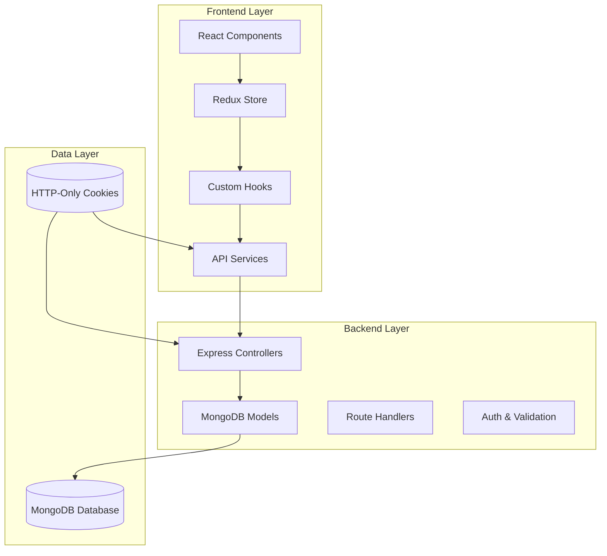

**Diagram sources**
- [store.js:1-15](file://Client/src/store/store.js#L1-L15)
- [App.jsx:1-119](file://Client/src/App.jsx#L1-L119)
- [user.controller.js:1-705](file://Backend/src/controllers/user.controller.js#L1-L705)

**Section sources**
- [store.js:1-15](file://Client/src/store/store.js#L1-L15)
- [App.jsx:1-119](file://Client/src/App.jsx#L1-L119)

## Core Components

### Form Component Architecture

The Enhanced Form Component consists of several interconnected parts working together to provide seamless data management functionality.

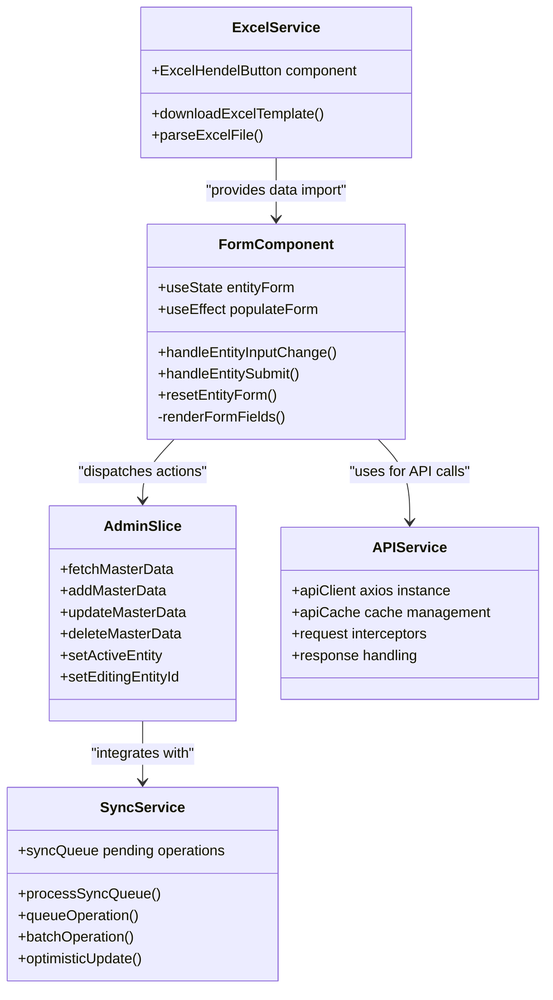

**Diagram sources**
- [Form.jsx:1-171](file://Client/src/components/deshboard/Form.jsx#L1-L171)
- [adminSlice.js:1-201](file://Client/src/store/admin/adminSlice.js#L1-L201)
- [apiClient.js:1-268](file://Client/src/services/apiClient.js#L1-L268)
- [syncService.js:1-281](file://Client/src/services/syncService.js#L1-L281)
- [HandelExcelFile.js:1-35](file://Client/src/utils/HandelExcelFile.js#L1-L35)

### Entity Configuration System

The system supports 13 different entity types through a centralized configuration object that defines field properties, validation rules, and display characteristics.

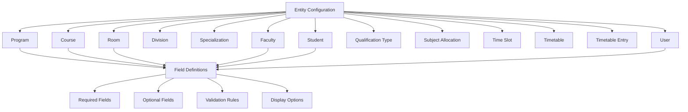

**Diagram sources**
- [Admin.jsx:102-791](file://Client/src/pages/dashboard/Admin.jsx#L102-L791)

**Section sources**
- [Admin.jsx:102-791](file://Client/src/pages/dashboard/Admin.jsx#L102-L791)
- [Form.jsx:1-171](file://Client/src/components/deshboard/Form.jsx#L1-L171)

## Architecture Overview

The Enhanced Form Component implements a sophisticated architecture combining frontend React components with backend Express services and MongoDB data persistence.

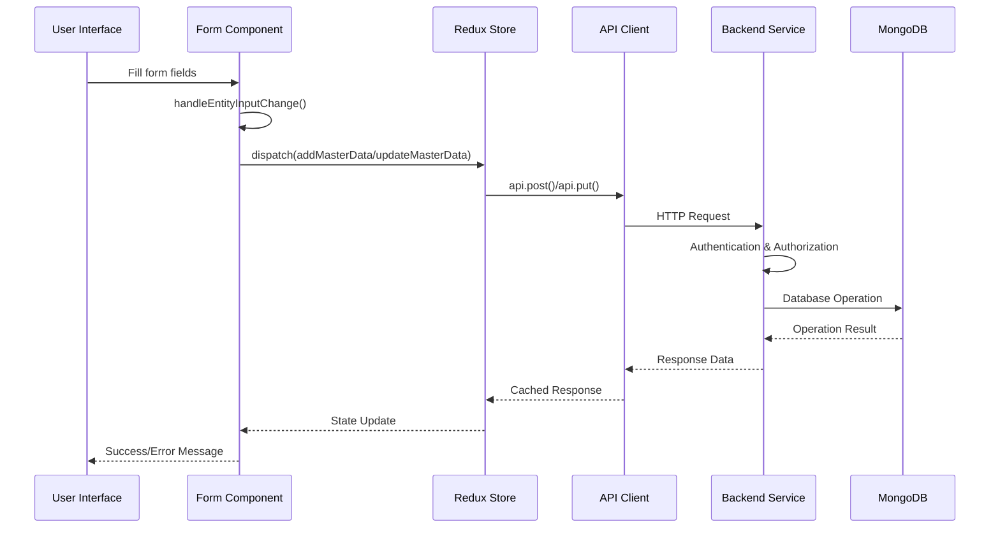

**Diagram sources**
- [Form.jsx:64-77](file://Client/src/components/deshboard/Form.jsx#L64-L77)
- [adminSlice.js:35-74](file://Client/src/store/admin/adminSlice.js#L35-L74)
- [apiClient.js:238-265](file://Client/src/services/apiClient.js#L238-L265)

### Data Flow Architecture

The system implements a unidirectional data flow pattern with comprehensive error handling and state management.

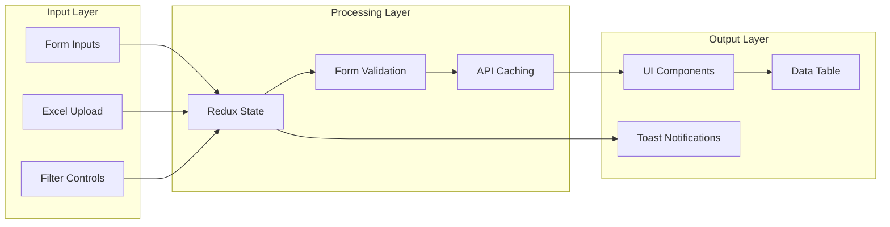

**Diagram sources**
- [DataTable.jsx:1-565](file://Client/src/components/deshboard/DataTable.jsx#L1-L565)
- [useApi.js:1-370](file://Client/src/hooks/useApi.js#L1-L370)

**Section sources**
- [DataTable.jsx:1-565](file://Client/src/components/deshboard/DataTable.jsx#L1-L565)
- [useApi.js:1-370](file://Client/src/hooks/useApi.js#L1-L370)

## Detailed Component Analysis

### Form Component Implementation

The Form Component serves as the primary interface for data entry and modification across all entity types.

#### Enhanced Form State Management

The component maintains form state through React's useState hook with sophisticated nested object handling for complex data structures.

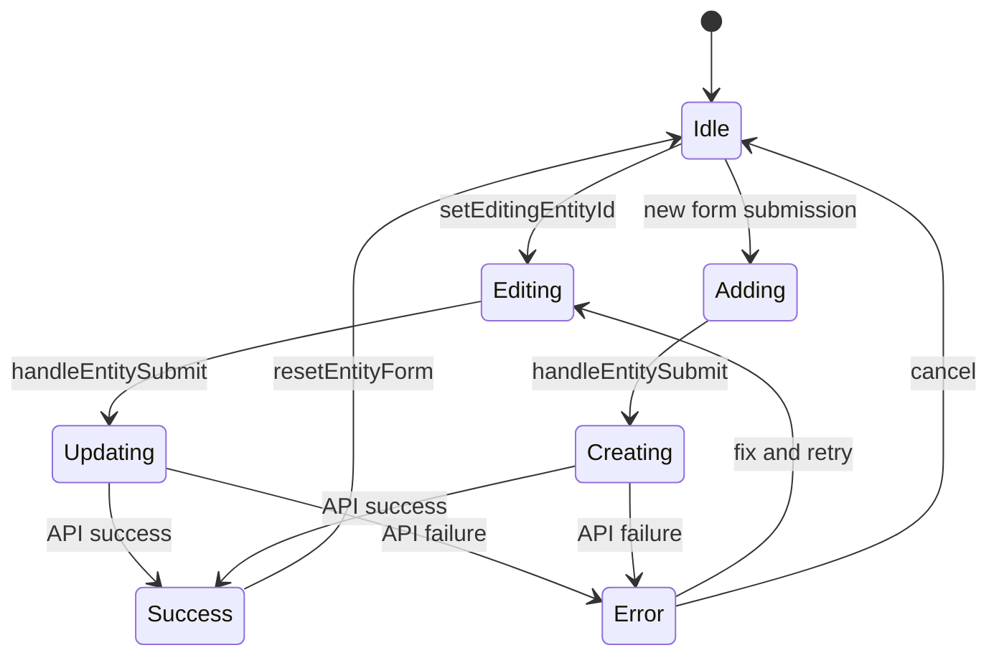

**Diagram sources**
- [Form.jsx:10-77](file://Client/src/components/deshboard/Form.jsx#L10-L77)

#### Enhanced Field Type Handling

The system supports multiple input field types with specialized rendering logic and improved nested field support:

| Field Type | Input Component | Special Handling |
|------------|----------------|------------------|
| text | HTML input | Standard text validation |
| number | HTML input | Numeric validation |
| email | HTML input | Email format validation |
| tel | HTML input | Phone number formatting |
| date | HTML date picker | ISO date conversion |
| time | HTML time picker | Time formatting |
| select | HTML select | Option rendering |
| boolean | Checkbox | Boolean state management |
| nested object | Nested structure | Dot notation handling |

**Updated** Enhanced nested field support now properly handles dot notation for complex objects like `ltpHours.l`, `ltpHours.t`, and `ltpHours.p`.

**Section sources**
- [Form.jsx:94-168](file://Client/src/components/deshboard/Form.jsx#L94-L168)

### Enhanced Form Input Change Handling

The form now includes sophisticated input change handling with improved nested field support:

```mermaid
flowchart TD
InputEvent[Input Change Event] --> CheckNested{Check for Dot Notation}
CheckNested --> |Contains "."| SplitFields[Split Parent.Child]
CheckNested --> |No Dot| DirectUpdate[Direct Field Update]
SplitFields --> CreateNested[Create Nested Object]
CreateNested --> MergeObjects[Merge with Existing State]
DirectUpdate --> MergeObjects
MergeObjects --> UpdateState[Update Form State]
UpdateState --> TriggerSubmit[Trigger Form Submit]
```

**Diagram sources**
- [Form.jsx:35-54](file://Client/src/components/deshboard/Form.jsx#L35-L54)

**Section sources**
- [Form.jsx:35-54](file://Client/src/components/deshboard/Form.jsx#L35-L54)

### Enhanced Form Reset Functionality

The form now includes comprehensive reset functionality:

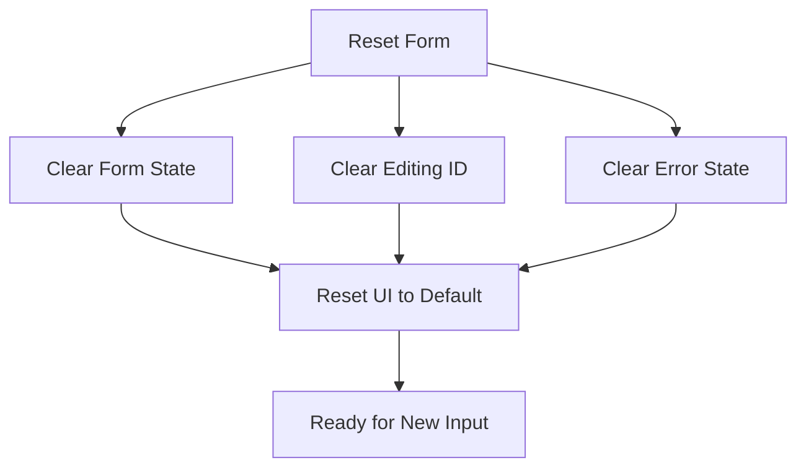

**Diagram sources**
- [Form.jsx:57-61](file://Client/src/components/deshboard/Form.jsx#L57-L61)

**Section sources**
- [Form.jsx:57-61](file://Client/src/components/deshboard/Form.jsx#L57-L61)

### Enhanced Entity Submission Logic

The form submission logic has been improved with better error handling and state management:

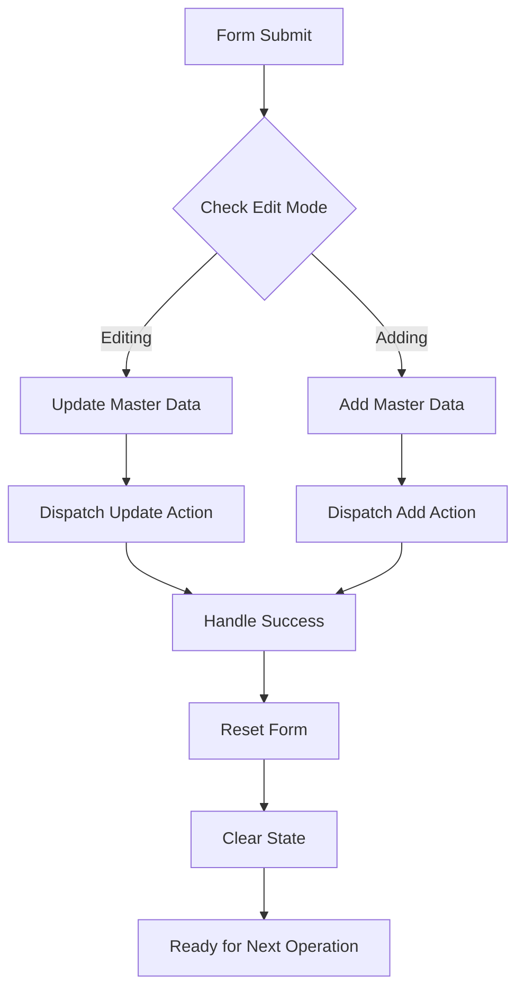

**Diagram sources**
- [Form.jsx:64-77](file://Client/src/components/deshboard/Form.jsx#L64-L77)

**Section sources**
- [Form.jsx:64-77](file://Client/src/components/deshboard/Form.jsx#L64-L77)

### Redux State Management

The Redux store architecture implements a comprehensive state management solution with separate slices for different concerns.

#### Admin Slice Architecture

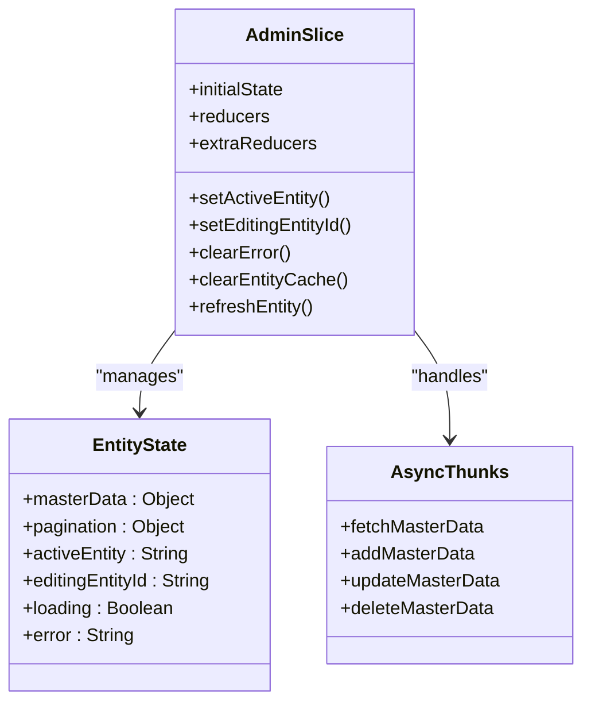

**Diagram sources**
- [adminSlice.js:76-196](file://Client/src/store/admin/adminSlice.js#L76-L196)

#### Form Slice Integration

The form slice provides dedicated state management for form-specific operations and maintains separation of concerns.

**Section sources**
- [adminSlice.js:1-201](file://Client/src/store/admin/adminSlice.js#L1-L201)
- [formSlice.js:1-24](file://Client/src/store/formSlice.js#L1-L24)

### API Service Architecture

The API service layer implements sophisticated caching, error handling, and authentication mechanisms.

#### Request/Response Interceptor Chain

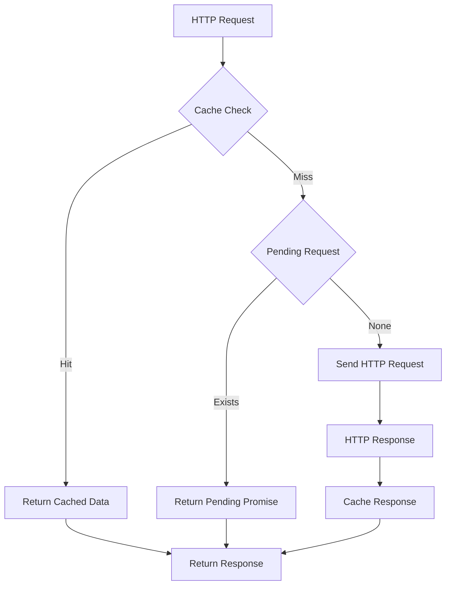

**Diagram sources**
- [apiClient.js:54-120](file://Client/src/services/apiClient.js#L54-L120)

#### Authentication Flow

The system implements a robust authentication mechanism using HTTP-only cookies for enhanced security.

**Section sources**
- [apiClient.js:1-268](file://Client/src/services/apiClient.js#L1-L268)

### Data Table Component

The DataTable component provides comprehensive data visualization with sorting, filtering, and pagination capabilities.

#### Advanced Filtering System

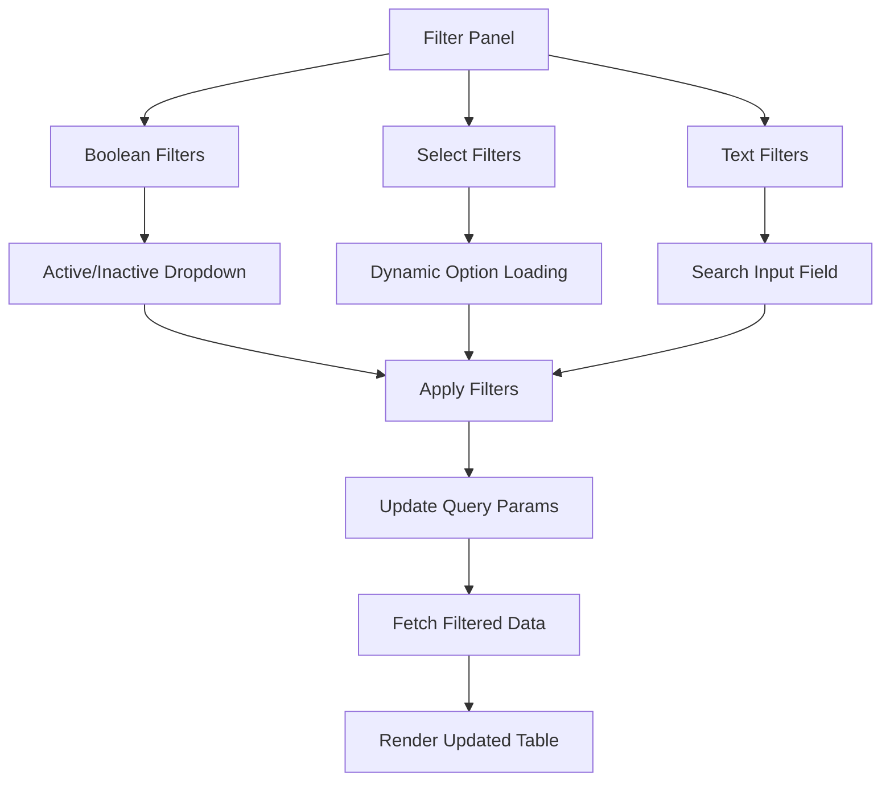

**Diagram sources**
- [DataTable.jsx:58-94](file://Client/src/components/deshboard/DataTable.jsx#L58-L94)

**Section sources**
- [DataTable.jsx:1-565](file://Client/src/components/deshboard/DataTable.jsx#L1-L565)

### Excel Integration

The Excel integration system enables bulk data import and export operations with template-based formatting.

#### Excel Processing Pipeline

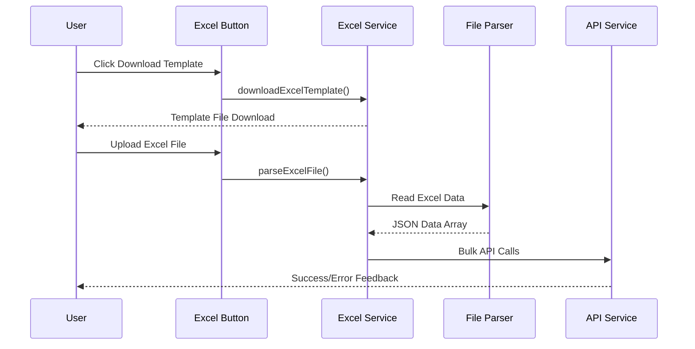

**Diagram sources**
- [HandelExcelFile.js:6-34](file://Client/src/utils/HandelExcelFile.js#L6-L34)
- [ExcelHendelButton.jsx:1-85](file://Client/src/components/ExcelHendelButton.jsx#L1-L85)

**Section sources**
- [HandelExcelFile.js:1-35](file://Client/src/utils/HandelExcelFile.js#L1-L35)
- [ExcelHendelButton.jsx:1-85](file://Client/src/components/ExcelHendelButton.jsx#L1-L85)

## Dependency Analysis

The Enhanced Form Component exhibits strong modularity with well-defined dependencies between components.

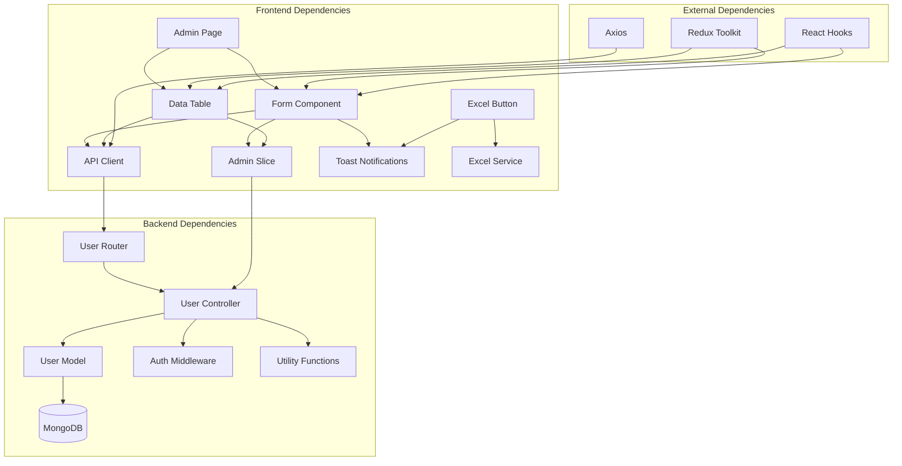

**Diagram sources**
- [Admin.jsx:1-1007](file://Client/src/pages/dashboard/Admin.jsx#L1-L1007)
- [user.controller.js:1-705](file://Backend/src/controllers/user.controller.js#L1-L705)
- [user.models.js:1-105](file://Backend/src/models/user.models.js#L1-L105)
- [user.routers.js:1-41](file://Backend/src/routes/user.routers.js#L1-L41)

### Component Coupling Analysis

The system demonstrates low coupling between major components, enabling maintainability and extensibility.

**Section sources**
- [Admin.jsx:1-1007](file://Client/src/pages/dashboard/Admin.jsx#L1-L1007)
- [user.controller.js:1-705](file://Backend/src/controllers/user.controller.js#L1-L705)

## Performance Considerations

The Enhanced Form Component implements several performance optimization strategies:

### Caching Strategy

The API client implements intelligent caching with configurable expiration times and cache invalidation mechanisms.

### Request Deduplication

Duplicate requests are automatically deduplicated to prevent unnecessary network traffic.

### Lazy Loading

Components implement lazy loading patterns to minimize initial bundle size.

### Memory Management

Proper cleanup of event listeners and subscriptions prevents memory leaks.

**Updated** Enhanced form handling now includes better state management and reduced re-renders through improved nested field handling.

## Troubleshooting Guide

### Common Issues and Solutions

#### Form Submission Failures

**Symptoms**: Form submissions fail with validation errors
**Causes**: 
- Missing required fields
- Invalid data types
- Network connectivity issues
**Solutions**:
- Verify required field completion
- Check data type compatibility
- Ensure network connectivity

#### Authentication Problems

**Symptoms**: Users unable to access protected routes
**Causes**:
- Expired authentication tokens
- Session timeouts
- Invalid user credentials
**Solutions**:
- Implement token refresh mechanisms
- Handle session expiration gracefully
- Provide clear error messaging

#### Performance Issues

**Symptoms**: Slow form rendering or data loading
**Causes**:
- Large dataset sizes
- Inefficient queries
- Memory leaks
**Solutions**:
- Implement pagination for large datasets
- Optimize database queries
- Monitor memory usage patterns

#### Nested Field Issues

**Symptoms**: Nested form fields not updating correctly
**Causes**:
- Incorrect dot notation handling
- State merging conflicts
**Solutions**:
- Verify dot notation syntax (e.g., `ltpHours.l`)
- Check state structure consistency
- Use proper nested object handling

**Section sources**
- [apiClient.js:120-207](file://Client/src/services/apiClient.js#L120-L207)
- [Form.jsx:64-77](file://Client/src/components/deshboard/Form.jsx#L64-L77)

## Conclusion

The Enhanced Form Component represents a sophisticated data management solution that successfully combines modern React patterns with robust backend services. The system provides comprehensive functionality for managing academic institution data with features like real-time synchronization, bulk operations, and Excel integration.

Key strengths of the implementation include:

- **Modular Architecture**: Well-separated concerns with clear component boundaries
- **Robust State Management**: Comprehensive Redux integration with proper error handling
- **Performance Optimization**: Intelligent caching, request deduplication, and lazy loading
- **Security Implementation**: HTTP-only cookie-based authentication with token refresh
- **Extensibility**: Configurable entity system supporting easy addition of new data types
- **Enhanced Form Handling**: Improved input change handling, nested field support, and form reset functionality

The system demonstrates best practices in modern web development while maintaining excellent user experience through responsive design and intuitive interfaces. Future enhancements could include additional validation rules, advanced search capabilities, and expanded Excel integration features.

**Updated** The recent enhancements significantly improve the form handling capabilities, making the system more robust and user-friendly with better support for complex nested data structures and improved error handling throughout the form lifecycle.