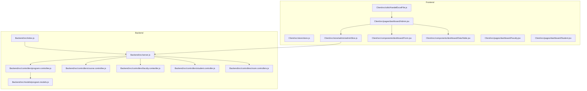
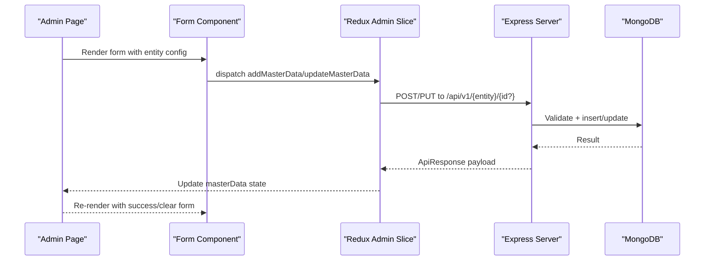
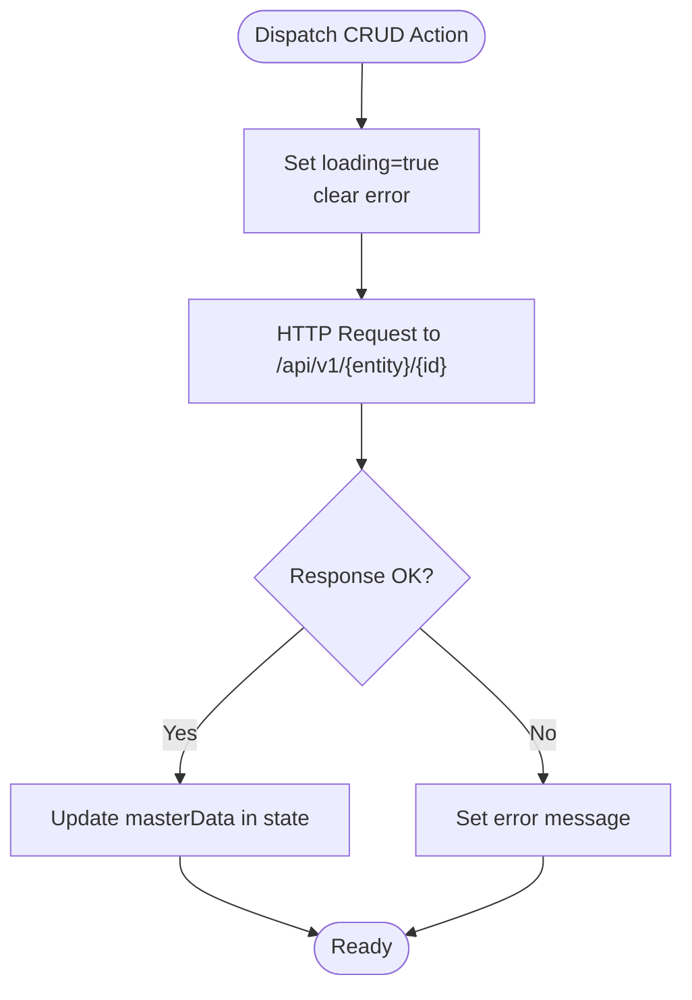
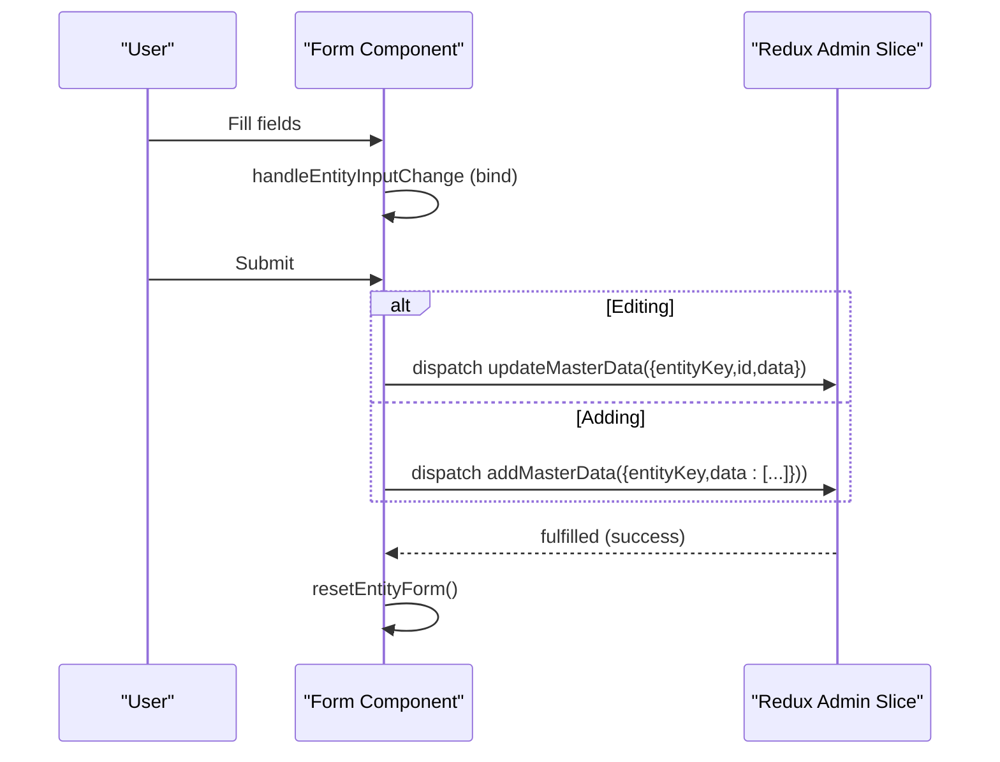
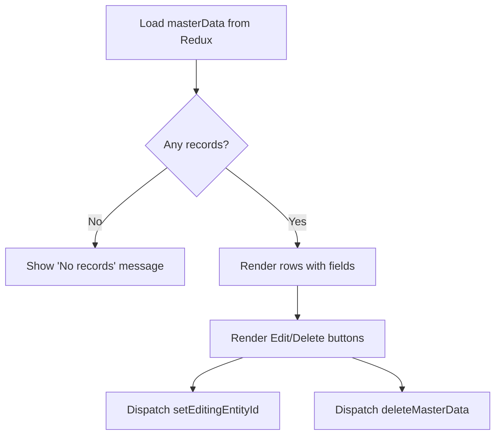
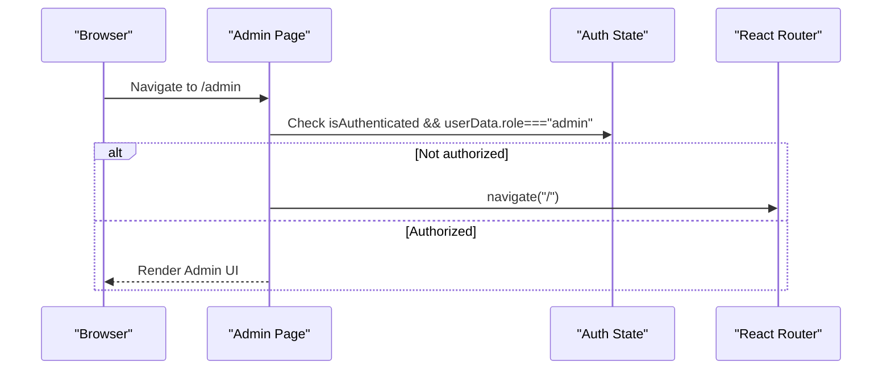
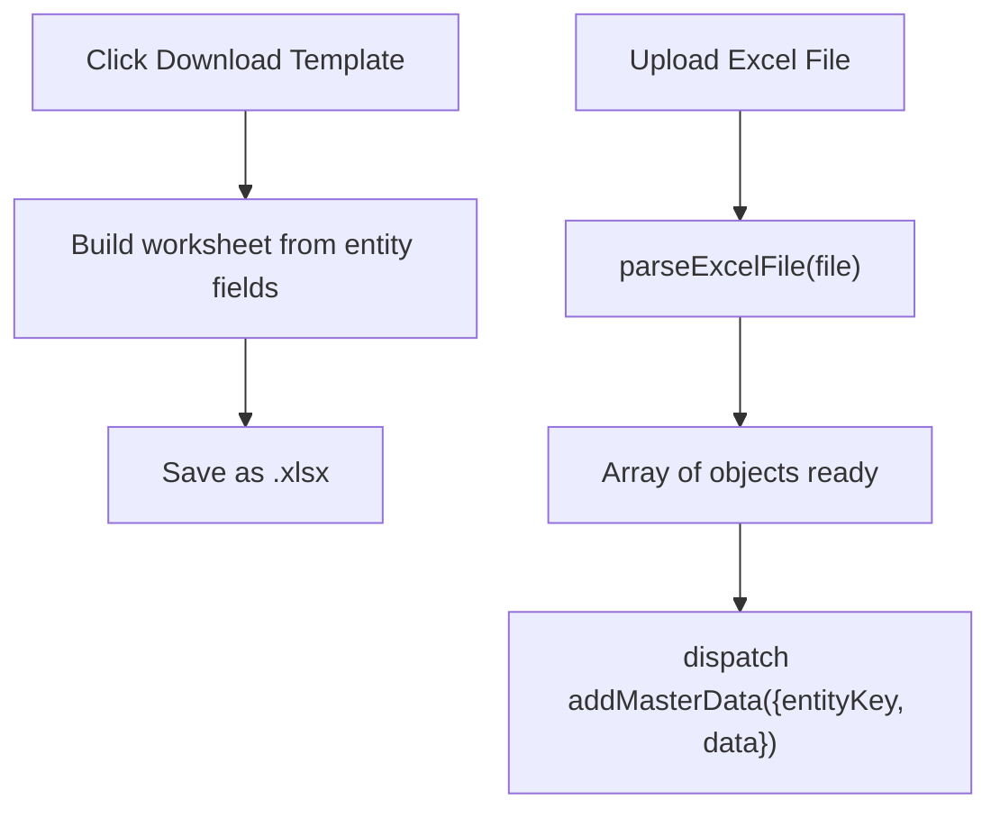
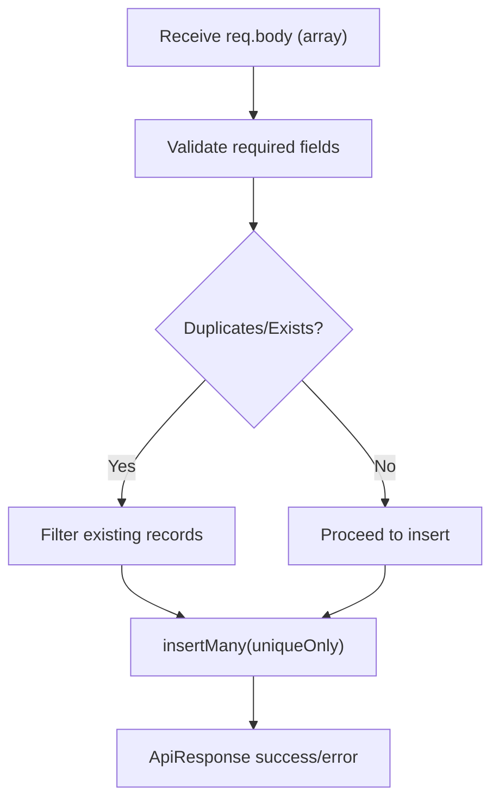
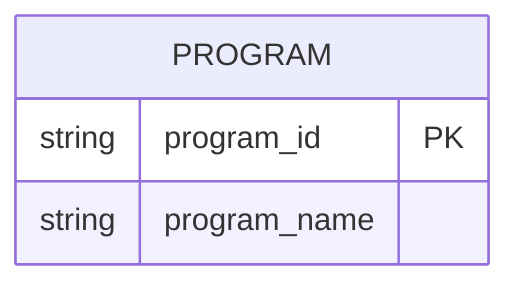
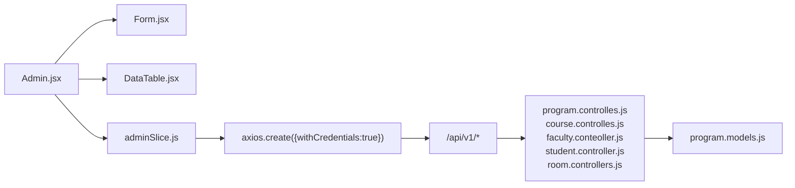

# Master Data Management

<cite>
**Referenced Files in This Document**
- [index.js](file://Backend/src/index.js)
- [server.js](file://Backend/src/server.js)
- [store.js](file://Client/src/store/store.js)
- [adminSlice.js](file://Client/src/store/admin/adminSlice.js)
- [formSlice.js](file://Client/src/store/formSlice.js)
- [Form.jsx](file://Client/src/components/deshboard/Form.jsx)
- [DataTable.jsx](file://Client/src/components/deshboard/DataTable.jsx)
- [Admin.jsx](file://Client/src/pages/dashboard/Admin.jsx)
- [Faculty.jsx](file://Client/src/pages/dashboard/Faculty.jsx)
- [Student.jsx](file://Client/src/pages/dashboard/Student.jsx)
- [HandelExcelFile.js](file://Client/src/utils/HandelExcelFile.js)
- [program.controlles.js](file://Backend/src/controllers/program.controlles.js)
- [course.controlles.js](file://Backend/src/controllers/course.controlles.js)
- [faculty.conteoller.js](file://Backend/src/controllers/faculty.conteoller.js)
- [student.controller.js](file://Backend/src/controllers/student.controller.js)
- [room.controllers.js](file://Backend/src/controllers/room.controllers.js)
- [program.models.js](file://Backend/src/models/program.models.js)
</cite>

## Table of Contents
1. [Introduction](#introduction)
2. [Project Structure](#project-structure)
3. [Core Components](#core-components)
4. [Architecture Overview](#architecture-overview)
5. [Detailed Component Analysis](#detailed-component-analysis)
6. [Dependency Analysis](#dependency-analysis)
7. [Performance Considerations](#performance-considerations)
8. [Troubleshooting Guide](#troubleshooting-guide)
9. [Conclusion](#conclusion)
10. [Appendices](#appendices)

## Introduction
This document describes the Master Data Management system for academic entities such as programs, courses, rooms, students, and faculty. It explains CRUD operations, form handling with validation and submission, the data table component for listing and managing records, role-based dashboards, Redux state management, and CSV import/export capabilities. It also outlines validation rules, conflict resolution strategies, and audit trail considerations.

## Project Structure
The system comprises:
- Backend: Express server with controllers, models, and routes for master data entities.
- Frontend: React application with Redux slices for state management, reusable components for forms and tables, and role-specific dashboards.

**Diagram sources**
- [index.js:1-18](file://Backend/src/index.js#L1-L18)
- [server.js](file://Backend/src/server.js)
- [program.controlles.js:1-131](file://Backend/src/controllers/program.controlles.js#L1-L131)
- [course.controlles.js:1-136](file://Backend/src/controllers/course.controlles.js#L1-L136)
- [faculty.conteoller.js:1-229](file://Backend/src/controllers/faculty.conteoller.js#L1-L229)
- [student.controller.js:1-209](file://Backend/src/controllers/student.controller.js#L1-L209)
- [room.controllers.js:1-133](file://Backend/src/controllers/room.controllers.js#L1-L133)
- [program.models.js:1-24](file://Backend/src/models/program.models.js#L1-L24)
- [store.js:1-15](file://Client/src/store/store.js#L1-L15)
- [adminSlice.js:1-173](file://Client/src/store/admin/adminSlice.js#L1-L173)
- [Form.jsx:1-127](file://Client/src/components/deshboard/Form.jsx#L1-L127)
- [DataTable.jsx:1-86](file://Client/src/components/deshboard/DataTable.jsx#L1-L86)
- [Admin.jsx:1-617](file://Client/src/pages/dashboard/Admin.jsx#L1-L617)
- [Faculty.jsx:1-22](file://Client/src/pages/dashboard/Faculty.jsx#L1-L22)
- [Student.jsx:1-23](file://Client/src/pages/dashboard/Student.jsx#L1-L23)
- [HandelExcelFile.js:1-35](file://Client/src/utils/HandelExcelFile.js#L1-L35)

**Section sources**
- [index.js:1-18](file://Backend/src/index.js#L1-L18)
- [store.js:1-15](file://Client/src/store/store.js#L1-L15)

## Core Components
- Redux Store: Centralizes auth, theme, admin, and form state.
- Admin Slice: Manages CRUD operations via async thunks and updates local lists.
- Form Component: Dynamic form rendering driven by entity configuration with validation and submission.
- Data Table Component: Displays records with edit/delete actions.
- Role Dashboards: Admin page orchestrates master data operations; faculty and student pages enforce role checks.

**Section sources**
- [store.js:1-15](file://Client/src/store/store.js#L1-L15)
- [adminSlice.js:1-173](file://Client/src/store/admin/adminSlice.js#L1-L173)
- [Form.jsx:1-127](file://Client/src/components/deshboard/Form.jsx#L1-L127)
- [DataTable.jsx:1-86](file://Client/src/components/deshboard/DataTable.jsx#L1-L86)
- [Admin.jsx:1-617](file://Client/src/pages/dashboard/Admin.jsx#L1-L617)
- [Faculty.jsx:1-22](file://Client/src/pages/dashboard/Faculty.jsx#L1-L22)
- [Student.jsx:1-23](file://Client/src/pages/dashboard/Student.jsx#L1-L23)

## Architecture Overview
The frontend communicates with backend endpoints through Redux async thunks. The backend enforces validation and conflict resolution, returning structured responses consumed by the frontend.

**Diagram sources**
- [adminSlice.js:24-78](file://Client/src/store/admin/adminSlice.js#L24-L78)
- [Form.jsx:37-50](file://Client/src/components/deshboard/Form.jsx#L37-L50)
- [Admin.jsx:28-38](file://Client/src/pages/dashboard/Admin.jsx#L28-L38)

## Detailed Component Analysis

### Redux State Management (Admin Slice)
The admin slice encapsulates:
- Async thunks for fetching, adding, updating, and deleting master data.
- Local state for active entity, editing ID, loading, and errors.
- Endpoint mapping for each entity.

**Diagram sources**
- [adminSlice.js:104-168](file://Client/src/store/admin/adminSlice.js#L104-L168)

**Section sources**
- [adminSlice.js:1-173](file://Client/src/store/admin/adminSlice.js#L1-L173)
- [store.js:1-15](file://Client/src/store/store.js#L1-L15)

### Form Handling System
The dynamic form:
- Reads entity configuration to render fields.
- Binds input changes to state.
- Submits either add or update based on editing mode.
- Clears form and resets editing state after success.

**Diagram sources**
- [Form.jsx:23-50](file://Client/src/components/deshboard/Form.jsx#L23-L50)
- [adminSlice.js:38-78](file://Client/src/store/admin/adminSlice.js#L38-L78)

**Section sources**
- [Form.jsx:1-127](file://Client/src/components/deshboard/Form.jsx#L1-L127)
- [adminSlice.js:1-173](file://Client/src/store/admin/adminSlice.js#L1-L173)

### Data Table Component
Displays records with:
- Field labels from entity config.
- Edit/Delete actions mapped to Redux actions.
- Empty-state messaging.

**Diagram sources**
- [DataTable.jsx:5-18](file://Client/src/components/deshboard/DataTable.jsx#L5-L18)
- [adminSlice.js:67-78](file://Client/src/store/admin/adminSlice.js#L67-L78)

**Section sources**
- [DataTable.jsx:1-86](file://Client/src/components/deshboard/DataTable.jsx#L1-L86)
- [adminSlice.js:1-173](file://Client/src/store/admin/adminSlice.js#L1-L173)

### Role-Based Dashboards
- Admin Dashboard: Loads multiple entities, renders form/table, supports CSV upload/download, and enforces admin role.
- Faculty and Student Dashboards: Redirect unauthorized users to login.

**Diagram sources**
- [Admin.jsx:28-44](file://Client/src/pages/dashboard/Admin.jsx#L28-L44)
- [Faculty.jsx:10-14](file://Client/src/pages/dashboard/Faculty.jsx#L10-L14)
- [Student.jsx:10-14](file://Client/src/pages/dashboard/Student.jsx#L10-L14)

**Section sources**
- [Admin.jsx:1-617](file://Client/src/pages/dashboard/Admin.jsx#L1-L617)
- [Faculty.jsx:1-22](file://Client/src/pages/dashboard/Faculty.jsx#L1-L22)
- [Student.jsx:1-23](file://Client/src/pages/dashboard/Student.jsx#L1-L23)

### CSV Import/Export
- Export: Generates an Excel template based on entity fields.
- Import: Parses uploaded Excel files into JSON arrays for bulk creation.

**Diagram sources**
- [Admin.jsx:583-593](file://Client/src/pages/dashboard/Admin.jsx#L583-L593)
- [HandelExcelFile.js:6-34](file://Client/src/utils/HandelExcelFile.js#L6-L34)
- [adminSlice.js:38-50](file://Client/src/store/admin/adminSlice.js#L38-L50)

**Section sources**
- [Admin.jsx:1-617](file://Client/src/pages/dashboard/Admin.jsx#L1-L617)
- [HandelExcelFile.js:1-35](file://Client/src/utils/HandelExcelFile.js#L1-L35)
- [adminSlice.js:1-173](file://Client/src/store/admin/adminSlice.js#L1-L173)

### Backend Controllers and Validation
Controllers implement CRUD with:
- Input validation per entity.
- Conflict detection (duplicate IDs, unique constraints).
- Bulk insert with conflict filtering.
- Structured error/success responses.

**Diagram sources**
- [program.controlles.js:9-45](file://Backend/src/controllers/program.controlles.js#L9-L45)
- [course.controlles.js:8-40](file://Backend/src/controllers/course.controlles.js#L8-L40)
- [faculty.conteoller.js:14-103](file://Backend/src/controllers/faculty.conteoller.js#L14-L103)
- [student.controller.js:13-91](file://Backend/src/controllers/student.controller.js#L13-L91)
- [room.controllers.js:10-46](file://Backend/src/controllers/room.controllers.js#L10-L46)

**Section sources**
- [program.controlles.js:1-131](file://Backend/src/controllers/program.controlles.js#L1-L131)
- [course.controlles.js:1-136](file://Backend/src/controllers/course.controlles.js#L1-L136)
- [faculty.conteoller.js:1-229](file://Backend/src/controllers/faculty.conteoller.js#L1-L229)
- [student.controller.js:1-209](file://Backend/src/controllers/student.controller.js#L1-L209)
- [room.controllers.js:1-133](file://Backend/src/controllers/room.controllers.js#L1-L133)

### Data Models (Selected)
Models define schema-level constraints and enums for validation.

**Diagram sources**
- [program.models.js:1-24](file://Backend/src/models/program.models.js#L1-L24)

**Section sources**
- [program.models.js:1-24](file://Backend/src/models/program.models.js#L1-L24)

## Dependency Analysis
- Frontend depends on Redux slices for state and axios client for API calls.
- Admin page composes Form and DataTable components and orchestrates CSV handling.
- Backend controllers depend on Mongoose models and shared response/error utilities.

**Diagram sources**
- [Admin.jsx:1-617](file://Client/src/pages/dashboard/Admin.jsx#L1-L617)
- [Form.jsx:1-127](file://Client/src/components/deshboard/Form.jsx#L1-L127)
- [DataTable.jsx:1-86](file://Client/src/components/deshboard/DataTable.jsx#L1-L86)
- [adminSlice.js:1-173](file://Client/src/store/admin/adminSlice.js#L1-L173)
- [program.controlles.js:1-131](file://Backend/src/controllers/program.controlles.js#L1-L131)
- [course.controlles.js:1-136](file://Backend/src/controllers/course.controlles.js#L1-L136)
- [faculty.conteoller.js:1-229](file://Backend/src/controllers/faculty.conteoller.js#L1-L229)
- [student.controller.js:1-209](file://Backend/src/controllers/student.controller.js#L1-L209)
- [room.controllers.js:1-133](file://Backend/src/controllers/room.controllers.js#L1-L133)
- [program.models.js:1-24](file://Backend/src/models/program.models.js#L1-L24)

**Section sources**
- [adminSlice.js:1-173](file://Client/src/store/admin/adminSlice.js#L1-L173)
- [Admin.jsx:1-617](file://Client/src/pages/dashboard/Admin.jsx#L1-L617)

## Performance Considerations
- Bulk operations: Backend filters duplicates before insertion to reduce write conflicts.
- Pagination: Not implemented in current table; consider virtualized lists or server-side pagination for large datasets.
- Network: Async thunks manage loading states; debounce frequent fetches if needed.
- Validation: Client-side placeholders and required flags improve UX; server-side validation ensures data integrity.

## Troubleshooting Guide
Common issues and remedies:
- Authentication failures: Role checks redirect unauthenticated users to login.
- Duplicate entries: Backend throws explicit errors when duplicates are detected; ensure unique keys before upload.
- Empty results: Confirm entity selection and initial fetch calls.
- Network errors: Inspect rejected payloads from async thunks and surface user-friendly messages.

**Section sources**
- [Faculty.jsx:10-14](file://Client/src/pages/dashboard/Faculty.jsx#L10-L14)
- [Student.jsx:10-14](file://Client/src/pages/dashboard/Student.jsx#L10-L14)
- [program.controlles.js:31-33](file://Backend/src/controllers/program.controlles.js#L31-L33)
- [adminSlice.js:115-118](file://Client/src/store/admin/adminSlice.js#L115-L118)

## Conclusion
The Master Data Management system integrates a robust backend with strict validation and conflict resolution, a flexible frontend form/table system, and role-based dashboards. Redux slices centralize state transitions for CRUD operations, while CSV utilities enable efficient bulk data handling. Extending the system with server-side pagination, comprehensive client-side validation, and audit trails would further enhance scalability and traceability.

## Appendices

### CRUD Operations Matrix
- Programs: Add, List, Get by ID, Update, Delete.
- Courses: Add, List, Get by ID, Update, Delete.
- Rooms: Add, List, Get by ID, Update, Delete.
- Students: Add, List, Get by ID, Update, Delete.
- Faculty: Add, List, Get by ID, Update, Delete.

**Section sources**
- [program.controlles.js:1-131](file://Backend/src/controllers/program.controlles.js#L1-L131)
- [course.controlles.js:1-136](file://Backend/src/controllers/course.controlles.js#L1-L136)
- [room.controllers.js:1-133](file://Backend/src/controllers/room.controllers.js#L1-L133)
- [student.controller.js:1-209](file://Backend/src/controllers/student.controller.js#L1-L209)
- [faculty.conteoller.js:1-229](file://Backend/src/controllers/faculty.conteoller.js#L1-L229)

### Audit Trail Considerations
- Current implementation does not persist audit logs; consider adding fields like created_by, updated_by, timestamps, and change history at the model/controller level for compliance and traceability.