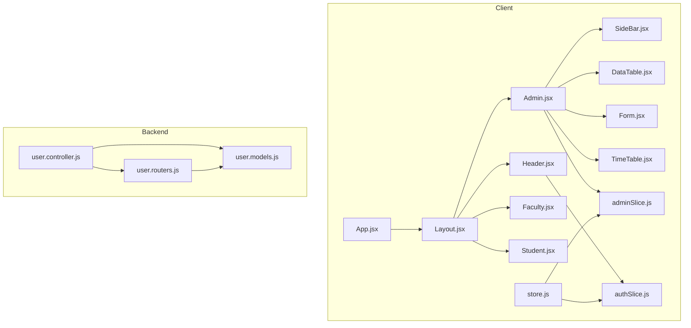
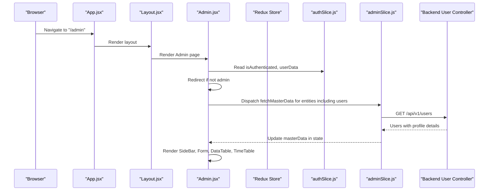
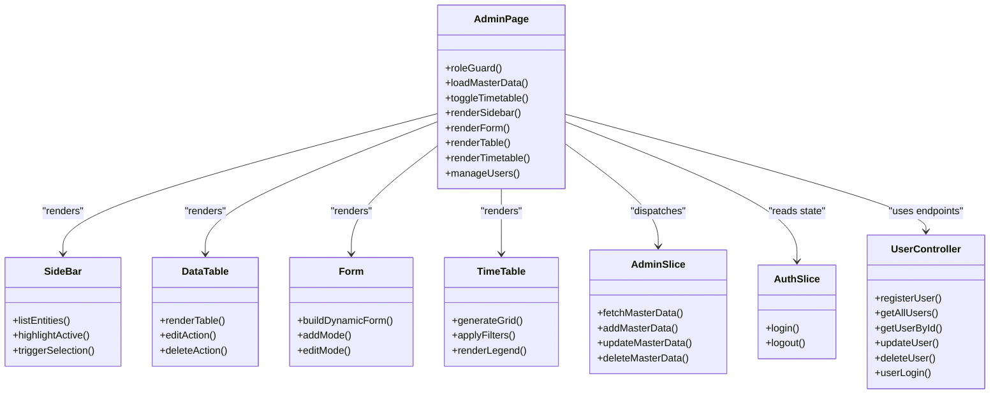
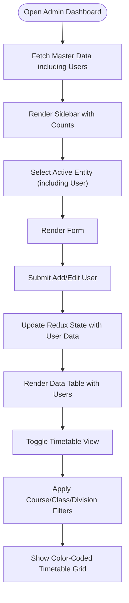
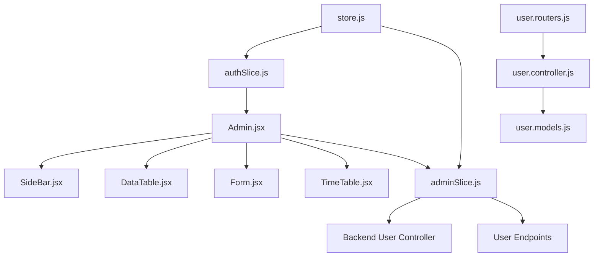

# Role-Based Dashboards

<cite>
**Referenced Files in This Document**
- [Admin.jsx](file://Client/src/pages/dashboard/Admin.jsx)
- [Faculty.jsx](file://Client/src/pages/dashboard/Faculty.jsx)
- [Student.jsx](file://Client/src/pages/dashboard/Student.jsx)
- [SideBar.jsx](file://Client/src/components/deshboard/SideBar.jsx)
- [DataTable.jsx](file://Client/src/components/deshboard/DataTable.jsx)
- [Form.jsx](file://Client/src/components/deshboard/Form.jsx)
- [TimeTable.jsx](file://Client/src/components/deshboard/TimeTable.jsx)
- [adminSlice.js](file://Client/src/store/admin/adminSlice.js)
- [authSlice.js](file://Client/src/store/auth/authSlice.js)
- [App.jsx](file://Client/src/App.jsx)
- [Layout.jsx](file://Client/src/components/Layout.jsx)
- [Header.jsx](file://Client/src/components/Header.jsx)
- [Container.jsx](file://Client/src/components/Container.jsx)
- [store.js](file://Client/src/store/store.js)
- [user.controller.js](file://Backend/src/controllers/user.controller.js)
- [user.models.js](file://Backend/src/models/user.models.js)
- [user.routers.js](file://Backend/src/routes/user.routers.js)
</cite>

## Update Summary
**Changes Made**
- Added comprehensive User entity configuration with full CRUD capabilities
- Integrated user management as a dedicated master data entity
- Enhanced admin dashboard with user creation, editing, deletion, and status management
- Updated backend user controller with complete user management endpoints
- Added user authentication, authorization, and role-based access control
- Implemented user-specific features including password management and account status control
- Expanded entity configuration to include user management fields: user_name, user_id, password, role selection, student_id, faculty_id, and isActive status

## Table of Contents
1. [Introduction](#introduction)
2. [Project Structure](#project-structure)
3. [Core Components](#core-components)
4. [Architecture Overview](#architecture-overview)
5. [Detailed Component Analysis](#detailed-component-analysis)
6. [Dependency Analysis](#dependency-analysis)
7. [Performance Considerations](#performance-considerations)
8. [Troubleshooting Guide](#troubleshooting-guide)
9. [Conclusion](#conclusion)
10. [Appendices](#appendices)

## Introduction
This document describes the role-based dashboard system that provides distinct interfaces for admin, faculty, and student users. The system has been enhanced with comprehensive user management capabilities, allowing administrators to create, edit, delete, and manage user accounts with different roles and statuses. It explains dashboard layouts, component hierarchies, permission-based visibility controls, data filtering mechanisms, navigation patterns, sidebar configurations, and role-specific features. It also documents the integration with authentication state, how user roles determine dashboard capabilities, and practical examples for customization and UX considerations.

## Project Structure
The dashboards are implemented as route-mounted pages under a shared layout. Authentication state is managed via Redux and persisted in localStorage. Admin dashboards leverage a master data management slice backed by asynchronous API calls to the backend. The user management system includes dedicated endpoints for user registration, authentication, and administration.

**Diagram sources**
- [App.jsx:13-38](file://Client/src/App.jsx#L13-L38)
- [Layout.jsx:7-20](file://Client/src/components/Layout.jsx#L7-L20)
- [Header.jsx:8-121](file://Client/src/components/Header.jsx#L8-L121)
- [Admin.jsx:17-950](file://Client/src/pages/dashboard/Admin.jsx#L17-L950)
- [SideBar.jsx:3-49](file://Client/src/components/deshboard/SideBar.jsx#L3-L49)
- [DataTable.jsx:5-537](file://Client/src/components/deshboard/DataTable.jsx#L5-L537)
- [Form.jsx:5-165](file://Client/src/components/deshboard/Form.jsx#L5-L165)
- [TimeTable.jsx:62-370](file://Client/src/components/deshboard/TimeTable.jsx#L62-L370)
- [authSlice.js:1-32](file://Client/src/store/auth/authSlice.js#L1-L32)
- [adminSlice.js:1-201](file://Client/src/store/admin/adminSlice.js#L1-L201)
- [store.js:7-14](file://Client/src/store/store.js#L7-L14)
- [user.controller.js:14-702](file://Backend/src/controllers/user.controller.js#L14-L702)
- [user.models.js:1-105](file://Backend/src/models/user.models.js#L1-L105)
- [user.routers.js:1-41](file://Backend/src/routes/user.routers.js#L1-L41)

**Section sources**
- [App.jsx:13-38](file://Client/src/App.jsx#L13-L38)
- [Layout.jsx:7-20](file://Client/src/components/Layout.jsx#L7-L20)
- [Header.jsx:8-121](file://Client/src/components/Header.jsx#L8-L121)
- [store.js:7-14](file://Client/src/store/store.js#L7-L14)

## Core Components
- Admin dashboard page orchestrates master data management, sidebar navigation, forms, data tables, timetable views, and comprehensive user management.
- Faculty and student dashboards currently serve as placeholders with role-based guards.
- Redux slices manage authentication state and admin master data lifecycle.
- Backend enforces role constraints and supports user login, registration, and profile management.
- User management system includes dedicated endpoints for user CRUD operations with role-based authorization.

Key responsibilities:
- Admin page: loads master entities including users, renders forms and tables, toggles timetable view, handles CSV upload triggers, enforces role checks, and manages user accounts.
- Sidebar: lists master entities with counts and highlights active selections, including the new User entity.
- Data table: displays entities with edit/delete actions, including user management with status indicators.
- Form: supports add/edit flows with validation hints, including user creation with role assignment.
- TimeTable: generates a color-coded weekly schedule with course/class/division filters.
- Auth slice: persists login state and user data with role-based access.
- Admin slice: async CRUD against backend endpoints for all entities including users and manages UI loading/error states.
- Backend user controller: validates and authenticates users, aggregates role-specific profiles, and provides comprehensive user management endpoints.

**Section sources**
- [Admin.jsx:17-950](file://Client/src/pages/dashboard/Admin.jsx#L17-L950)
- [SideBar.jsx:3-49](file://Client/src/components/deshboard/SideBar.jsx#L3-L49)
- [DataTable.jsx:5-537](file://Client/src/components/deshboard/DataTable.jsx#L5-L537)
- [Form.jsx:5-165](file://Client/src/components/deshboard/Form.jsx#L5-L165)
- [TimeTable.jsx:62-370](file://Client/src/components/deshboard/TimeTable.jsx#L62-L370)
- [authSlice.js:1-32](file://Client/src/store/auth/authSlice.js#L1-L32)
- [adminSlice.js:1-201](file://Client/src/store/admin/adminSlice.js#L1-L201)
- [user.controller.js:14-702](file://Backend/src/controllers/user.controller.js#L14-L702)

## Architecture Overview
The client-side dashboards are protected by route guards that check authentication and role. Admin dashboards use Redux to orchestrate asynchronous data fetching and updates. The backend enforces role constraints and exposes comprehensive user-related endpoints including authentication, authorization, and user management.

**Diagram sources**
- [App.jsx:27-34](file://Client/src/App.jsx#L27-L34)
- [Admin.jsx:28-44](file://Client/src/pages/dashboard/Admin.jsx#L28-L44)
- [authSlice.js:14-25](file://Client/src/store/auth/authSlice.js#L14-L25)
- [adminSlice.js:24-36](file://Client/src/store/admin/adminSlice.js#L24-L36)
- [user.controller.js:136-263](file://Backend/src/controllers/user.controller.js#L136-L263)

## Detailed Component Analysis

### Admin Dashboard Page
Responsibilities:
- Enforce role-based access: redirects non-admin users.
- Load master data for multiple entities including the new User entity on mount.
- Manage active entity and editing state, including user management.
- Toggle between master data view and timetable view.
- Provide CSV upload trigger for current entity.
- Render sidebar, form, data table, and timetable.

Permission and visibility:
- Role guard ensures only admin users can access the page.
- Timetable toggle button switches views; CSV upload button is visible only in master data mode.
- User entity is accessible only to admin users.

Data flow:
- Uses admin slice to fetch, add, update, and delete master data including users.
- Loads multiple entities concurrently during initial load, including users.
- Integrates user management with the existing master data infrastructure.

UI composition:
- Header with timetable toggle and optional CSV upload button.
- Sidebar for entity navigation including the new User entity.
- Main content area rendering form and table for the active entity.
- Optional timetable overlay.

**Section sources**
- [Admin.jsx:17-950](file://Client/src/pages/dashboard/Admin.jsx#L17-L950)
- [adminSlice.js:6-16](file://Client/src/store/admin/adminSlice.js#L6-L16)
- [adminSlice.js:24-78](file://Client/src/store/admin/adminSlice.js#L24-L78)

### Sidebar Navigation
Responsibilities:
- List master entities with counts derived from loaded data, including the new User entity.
- Highlight active entity.
- Trigger selection of active entity and reset editing state.

Behavior:
- Generates empty arrays for all master entities initially.
- Updates active entity selection and clears editing state.
- Includes User entity in the sidebar navigation with count display.

**Section sources**
- [SideBar.jsx:3-49](file://Client/src/components/deshboard/SideBar.jsx#L3-L49)
- [Admin.jsx:408-412](file://Client/src/pages/dashboard/Admin.jsx#L408-L412)

### Data Table Component
Responsibilities:
- Render a paginated-like table of entities for the active master entity, including users.
- Provide inline edit and delete actions.
- Display boolean fields as Yes/No or Active/Inactive status indicators.

Behavior:
- Reads entities from Redux state, including user data.
- Dispatches editing ID and deletion actions for user management.
- Displays user status with visual indicators (Active/Inactive).

**Section sources**
- [DataTable.jsx:5-537](file://Client/src/components/deshboard/DataTable.jsx#L5-L537)
- [adminSlice.js:91-102](file://Client/src/store/admin/adminSlice.js#L91-L102)

### Form Component
Responsibilities:
- Build dynamic forms based on entity configuration, including user management.
- Support add and edit modes for user creation and modification.
- Persist form state and submit to Redux for user management operations.

Behavior:
- Populates form from selected entity when editing user accounts.
- Submits either add or update based on presence of editing ID.
- Handles user-specific fields like password, role assignment, and status management.

**Section sources**
- [Form.jsx:5-165](file://Client/src/components/deshboard/Form.jsx#L5-L165)
- [adminSlice.js:91-102](file://Client/src/store/admin/adminSlice.js#L91-L102)

### TimeTable Component
Responsibilities:
- Generate a weekly timetable grid with color-coded subjects.
- Provide filters for course, class, and division.
- Compute subject-to-color mapping and filter dependent lists.

Behavior:
- Uses memoized computations for filtered classes and divisions.
- Generates sample timetable data for demonstration.
- Renders legend and timetable grid with break indicators.

**Section sources**
- [TimeTable.jsx:62-370](file://Client/src/components/deshboard/TimeTable.jsx#L62-L370)

### Authentication and Role Guards
Responsibilities:
- Persist login state and user data with role information.
- Guard routes by checking authentication and role.
- Provide logout and theme toggle actions.
- Support user authentication and session management.

Behavior:
- On login, sets authenticated flag and stores user data with role.
- On logout, clears state and navigates home.
- Admin/Faculty/Student pages redirect unauthenticated or unauthorized users.
- User authentication includes password validation and account status checks.

**Section sources**
- [authSlice.js:14-25](file://Client/src/store/auth/authSlice.js#L14-L25)
- [Faculty.jsx:10-14](file://Client/src/pages/dashboard/Faculty.jsx#L10-L14)
- [Student.jsx:10-14](file://Client/src/pages/dashboard/Student.jsx#L10-L14)
- [Admin.jsx:40-44](file://Client/src/pages/dashboard/Admin.jsx#L40-L44)

### Backend User Management System
Responsibilities:
- Define supported roles and enforce role enums including admin, faculty, student, coordinator, and hod.
- Authenticate users with password validation and account status checks.
- Aggregate role-specific profile data for user management.
- Expose comprehensive user management endpoints including registration, authentication, and administration.

Behavior:
- Role enum includes admin, faculty, student, coordinator, hod.
- Login aggregates student or faculty profile data based on matching identifiers.
- User management includes CRUD operations with role-based authorization.
- Password hashing and validation for security.

**Section sources**
- [user.models.js:19-28](file://Backend/src/models/user.models.js#L19-L28)
- [user.controller.js:14-702](file://Backend/src/controllers/user.controller.js#L14-L702)
- [user.routers.js:1-41](file://Backend/src/routes/user.routers.js#L1-L41)

## Architecture Overview

**Diagram sources**
- [Admin.jsx:17-950](file://Client/src/pages/dashboard/Admin.jsx#L17-L950)
- [SideBar.jsx:3-49](file://Client/src/components/deshboard/SideBar.jsx#L3-L49)
- [DataTable.jsx:5-537](file://Client/src/components/deshboard/DataTable.jsx#L5-L537)
- [Form.jsx:5-165](file://Client/src/components/deshboard/Form.jsx#L5-L165)
- [TimeTable.jsx:62-370](file://Client/src/components/deshboard/TimeTable.jsx#L62-L370)
- [authSlice.js:14-25](file://Client/src/store/auth/authSlice.js#L14-L25)
- [adminSlice.js:24-78](file://Client/src/store/admin/adminSlice.js#L24-L78)
- [user.controller.js:14-702](file://Backend/src/controllers/user.controller.js#L14-L702)

## Detailed Component Analysis

### Admin Dashboard Layout and Navigation
- Layout composes Header and Outlet for nested routes.
- Header provides theme toggle and login/logout actions.
- App mounts Admin/Faculty/Student pages under a shared Layout.

Navigation patterns:
- Links to dashboards are declared but commented out in Header; routing is handled by App.
- Admin page includes a timetable toggle button to switch views.
- User entity is accessible through sidebar navigation.

Sidebar configuration:
- Sidebar lists master entities including the new User entity and shows counts from Redux state.
- Clicking an entity sets active entity and resets editing state.
- User entity appears alongside other master data entities.

**Section sources**
- [Layout.jsx:7-20](file://Client/src/components/Layout.jsx#L7-L20)
- [Header.jsx:30-115](file://Client/src/components/Header.jsx#L30-L115)
- [App.jsx:27-34](file://Client/src/App.jsx#L27-L34)
- [SideBar.jsx:19-44](file://Client/src/components/deshboard/SideBar.jsx#L19-L44)
- [Admin.jsx:550-613](file://Client/src/pages/dashboard/Admin.jsx#L550-L613)

### Permission-Based Visibility Controls
- Admin page enforces role check on mount and renders nothing until redirection completes.
- Faculty and Student pages enforce role checks and redirect to login otherwise.
- CSV upload button is conditionally rendered only in master data mode.
- User management is restricted to admin users only.

**Section sources**
- [Admin.jsx:40-49](file://Client/src/pages/dashboard/Admin.jsx#L40-L49)
- [Faculty.jsx:10-19](file://Client/src/pages/dashboard/Faculty.jsx#L10-L19)
- [Student.jsx:10-19](file://Client/src/pages/dashboard/Student.jsx#L10-L19)
- [Admin.jsx:582-594](file://Client/src/pages/dashboard/Admin.jsx#L582-L594)

### Data Filtering Mechanisms
- TimeTable applies filters for course, class, and division using memoized computations.
- Sidebar shows counts per entity to reflect filtered datasets, including user counts.
- Admin slice manages loading and error states during async operations for user management.
- User data filtering includes role-based and status-based filtering.

Filtering flow:

**Diagram sources**
- [adminSlice.js:24-78](file://Client/src/store/admin/adminSlice.js#L24-L78)
- [TimeTable.jsx:82-105](file://Client/src/components/deshboard/TimeTable.jsx#L82-L105)
- [SideBar.jsx:23-43](file://Client/src/components/deshboard/SideBar.jsx#L23-L43)

**Section sources**
- [TimeTable.jsx:82-105](file://Client/src/components/deshboard/TimeTable.jsx#L82-L105)
- [adminSlice.js:104-168](file://Client/src/store/admin/adminSlice.js#L104-L168)

### Role-Specific Features
- Admin: Full CRUD over all master entities including comprehensive user management, timetable generation, CSV upload support, and user account administration.
- Faculty: Placeholder page with role guard; future enhancements can include personal schedules and class management.
- Student: Placeholder page with role guard; future enhancements can include personal timetable and grades.

Integration with authentication:
- Auth slice persists login state and user data with role information.
- Pages redirect unauthorized users to login.
- User management includes password security and account status control.

**Section sources**
- [Admin.jsx:52-406](file://Client/src/pages/dashboard/Admin.jsx#L52-L406)
- [Faculty.jsx:5-21](file://Client/src/pages/dashboard/Faculty.jsx#L5-L21)
- [Student.jsx:5-23](file://Client/src/pages/dashboard/Student.jsx#L5-L23)
- [authSlice.js:14-25](file://Client/src/store/auth/authSlice.js#L14-L25)

### Dashboard Customization Examples
- Entity configuration: Add new fields, labels, placeholders, and required flags for any master entity including users.
- Timetable customization: Adjust time slots, days, and color palette; modify filter logic for course/class/division.
- UI customization: Change header actions, button styles, and layout containers.
- User management customization: Configure user-specific fields, role assignments, and status management options.

Practical examples:
- To add a new master entity, define its configuration in Admin page and wire endpoints in admin slice.
- To refine filters, adjust memoized selectors in TimeTable and corresponding backend queries.
- To change permissions, update role guards and restrict route access accordingly.
- To customize user management, modify the User entity configuration in Admin page.

**Section sources**
- [Admin.jsx:52-406](file://Client/src/pages/dashboard/Admin.jsx#L52-L406)
- [TimeTable.jsx:62-370](file://Client/src/components/deshboard/TimeTable.jsx#L62-L370)
- [adminSlice.js:6-16](file://Client/src/store/admin/adminSlice.js#L6-L16)

### Role Permission Matrix
- Admin: Can view and manage all master entities including users, generate timetables, and upload CSVs. Has full user management capabilities.
- Faculty: Can view personal schedule and class details (placeholder). Has limited user access for profile management.
- Student: Can view personal timetable and related information (placeholder). Has basic user profile access.

Note: Current implementation enforces role checks at the UI level; backend routes should also enforce role-based access for robustness.

**Section sources**
- [Admin.jsx:40-44](file://Client/src/pages/dashboard/Admin.jsx#L40-L44)
- [Faculty.jsx:10-14](file://Client/src/pages/dashboard/Faculty.jsx#L10-L14)
- [Student.jsx:10-14](file://Client/src/pages/dashboard/Student.jsx#L10-L14)
- [user.models.js:19-28](file://Backend/src/models/user.models.js#L19-L28)

### User Management System
**Updated** The admin dashboard now includes comprehensive user management capabilities with dedicated User entity configuration.

The user management system provides:
- User creation with automatic user_id generation based on role and identifier
- Role assignment (admin, faculty, student, coordinator, hod)
- Password management with hashing and validation
- Account status management (active/inactive)
- User authentication and session management
- Profile aggregation for different user types
- Bulk user registration capabilities
- User search and filtering capabilities
- Audit trail for user activities

User entity configuration includes fields for user identification, authentication, role assignment, and status management. The system integrates seamlessly with the existing master data infrastructure and provides full CRUD operations for user administration.

**Section sources**
- [Admin.jsx:688-738](file://Client/src/pages/dashboard/Admin.jsx#L688-L738)
- [user.controller.js:14-132](file://Backend/src/controllers/user.controller.js#L14-L132)
- [user.models.js:4-63](file://Backend/src/models/user.models.js#L4-L63)
- [user.routers.js:18-38](file://Backend/src/routes/user.routers.js#L18-L38)

### User Experience Considerations
- Role guards prevent accidental navigation to unauthorized dashboards.
- Loading and error states improve feedback during async operations including user management.
- Timetable toggle and CSV upload affordances streamline admin tasks.
- Memoized computations reduce re-renders for filtered lists and grids.
- Theme toggle enhances accessibility and user preference support.
- User management provides visual status indicators and clear action affordances.

**Section sources**
- [Admin.jsx:481-531](file://Client/src/pages/dashboard/Admin.jsx#L481-L531)
- [TimeTable.jsx:107-110](file://Client/src/components/deshboard/TimeTable.jsx#L107-L110)
- [Header.jsx:25-28](file://Client/src/components/Header.jsx#L25-L28)

## Dependency Analysis

**Diagram sources**
- [authSlice.js:14-25](file://Client/src/store/auth/authSlice.js#L14-L25)
- [Admin.jsx:17-950](file://Client/src/pages/dashboard/Admin.jsx#L17-L950)
- [SideBar.jsx:3-49](file://Client/src/components/deshboard/SideBar.jsx#L3-L49)
- [DataTable.jsx:5-537](file://Client/src/components/deshboard/DataTable.jsx#L5-L537)
- [Form.jsx:5-165](file://Client/src/components/deshboard/Form.jsx#L5-L165)
- [TimeTable.jsx:62-370](file://Client/src/components/deshboard/TimeTable.jsx#L62-L370)
- [adminSlice.js:24-78](file://Client/src/store/admin/adminSlice.js#L24-L78)
- [store.js:7-14](file://Client/src/store/store.js#L7-L14)
- [user.controller.js:14-702](file://Backend/src/controllers/user.controller.js#L14-L702)
- [user.models.js:19-28](file://Backend/src/models/user.models.js#L19-L28)
- [user.routers.js:1-41](file://Backend/src/routes/user.routers.js#L1-L41)

**Section sources**
- [store.js:7-14](file://Client/src/store/store.js#L7-L14)
- [adminSlice.js:18-22](file://Client/src/store/admin/adminSlice.js#L18-L22)

## Performance Considerations
- Use memoization for computed lists (e.g., filtered classes and divisions) to avoid unnecessary re-computation.
- Batch async requests for initial data load to reduce round trips, including user data.
- Debounce filter inputs to minimize frequent recomputations.
- Lazy-load heavy components only when needed (e.g., timetable view).
- Keep Redux state normalized to avoid deep equality churn.
- Implement caching for frequently accessed user data.
- Optimize user data fetching with pagination for large user bases.

## Troubleshooting Guide
Common issues and resolutions:
- Unauthorized access attempts: Ensure role guards are active and redirect to login.
- Empty master data: Verify async thunk endpoints and error handling in admin slice.
- Timetable not rendering: Confirm course/class/division filters are set appropriately.
- Form submission failures: Check backend validation and error messages returned by thunks.
- User management errors: Verify user authentication, password validation, and role assignments.
- User login failures: Check password validation, account status, and user existence.

**Section sources**
- [Admin.jsx:40-49](file://Client/src/pages/dashboard/Admin.jsx#L40-L49)
- [adminSlice.js:104-168](file://Client/src/store/admin/adminSlice.js#L104-L168)
- [TimeTable.jsx:102-105](file://Client/src/components/deshboard/TimeTable.jsx#L102-L105)
- [user.controller.js:360-471](file://Backend/src/controllers/user.controller.js#L360-L471)

## Conclusion
The role-based dashboard system provides a clear separation of concerns between UI pages, shared layout, and Redux slices. Admin dashboards are fully functional with comprehensive user management capabilities, master data management, forms, tables, and timetable generation. The addition of dedicated user management features allows administrators to create, edit, delete, and manage user accounts with different roles and statuses. Role guards ensure appropriate access, while Redux async thunks handle backend integration. Future enhancements can expand faculty and student dashboards with role-specific features and strengthen backend authorization.

## Appendices

### Appendix A: Role Permission Matrix
- Admin: Full CRUD, timetable generation, CSV upload, comprehensive user management.
- Faculty: Personal schedule and class details (placeholder), limited user profile access.
- Student: Personal timetable and related info (placeholder), basic user profile access.

**Section sources**
- [Admin.jsx:52-406](file://Client/src/pages/dashboard/Admin.jsx#L52-L406)
- [Faculty.jsx:5-21](file://Client/src/pages/dashboard/Faculty.jsx#L5-L21)
- [Student.jsx:5-23](file://Client/src/pages/dashboard/Student.jsx#L5-L23)

### Appendix B: User Management Features
**Updated** Comprehensive user management capabilities include:
- User creation with automatic user_id generation
- Role assignment and management
- Password hashing and validation
- Account status control (active/inactive)
- User authentication and session management
- Profile aggregation for different user types
- Bulk user registration
- User search and filtering
- Audit trail for user activities

**Section sources**
- [Admin.jsx:688-738](file://Client/src/pages/dashboard/Admin.jsx#L688-L738)
- [user.controller.js:14-702](file://Backend/src/controllers/user.controller.js#L14-L702)
- [user.models.js:4-63](file://Backend/src/models/user.models.js#L4-L63)
- [user.routers.js:18-38](file://Backend/src/routes/user.routers.js#L18-L38)