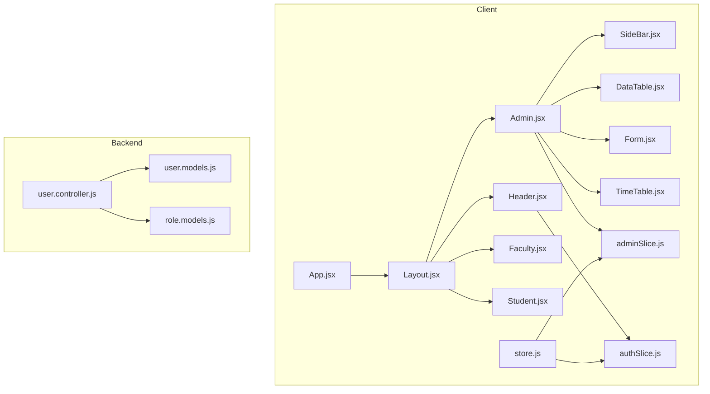
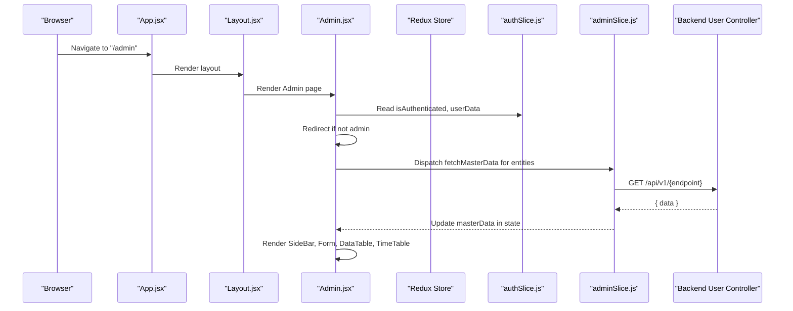
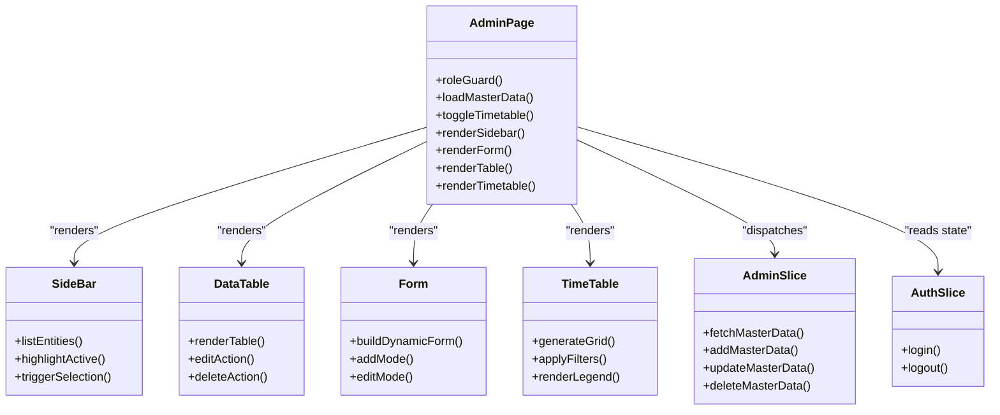
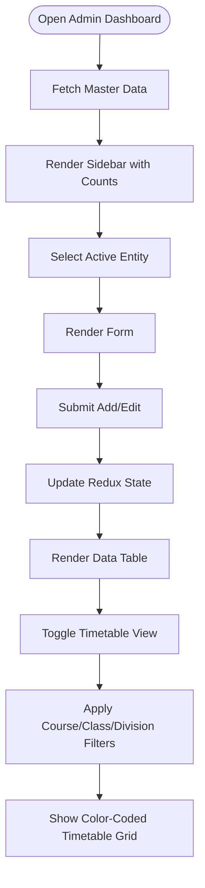
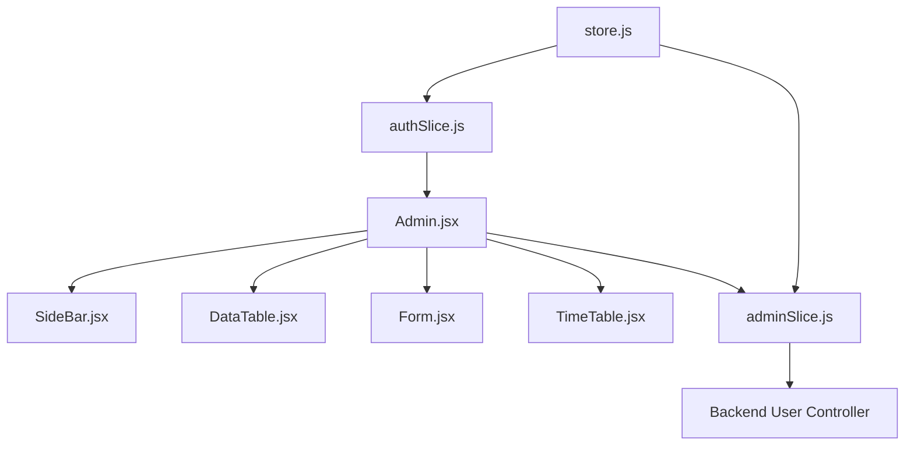

# Role-Based Dashboards

<cite>
**Referenced Files in This Document**
- [Admin.jsx](file://Client/src/pages/dashboard/Admin.jsx)
- [Faculty.jsx](file://Client/src/pages/dashboard/Faculty.jsx)
- [Student.jsx](file://Client/src/pages/dashboard/Student.jsx)
- [SideBar.jsx](file://Client/src/components/deshboard/SideBar.jsx)
- [DataTable.jsx](file://Client/src/components/deshboard/DataTable.jsx)
- [Form.jsx](file://Client/src/components/deshboard/Form.jsx)
- [TimeTable.jsx](file://Client/src/components/deshboard/TimeTable.jsx)
- [adminSlice.js](file://Client/src/store/admin/adminSlice.js)
- [authSlice.js](file://Client/src/store/auth/authSlice.js)
- [App.jsx](file://Client/src/App.jsx)
- [Layout.jsx](file://Client/src/components/Layout.jsx)
- [Header.jsx](file://Client/src/components/Header.jsx)
- [Container.jsx](file://Client/src/components/Container.jsx)
- [store.js](file://Client/src/store/store.js)
- [user.controller.js](file://Backend/src/controllers/user.controller.js)
- [user.models.js](file://Backend/src/models/user.models.js)
- [role.models.js](file://Backend/src/models/role.models.js)
</cite>

## Table of Contents
1. [Introduction](#introduction)
2. [Project Structure](#project-structure)
3. [Core Components](#core-components)
4. [Architecture Overview](#architecture-overview)
5. [Detailed Component Analysis](#detailed-component-analysis)
6. [Dependency Analysis](#dependency-analysis)
7. [Performance Considerations](#performance-considerations)
8. [Troubleshooting Guide](#troubleshooting-guide)
9. [Conclusion](#conclusion)
10. [Appendices](#appendices)

## Introduction
This document describes the role-based dashboard system that provides distinct interfaces for admin, faculty, and student users. It explains dashboard layouts, component hierarchies, permission-based visibility controls, data filtering mechanisms, navigation patterns, sidebar configurations, and role-specific features. It also documents the integration with authentication state, how user roles determine dashboard capabilities, and practical examples for customization and UX considerations.

## Project Structure
The dashboards are implemented as route-mounted pages under a shared layout. Authentication state is managed via Redux and persisted in localStorage. Admin dashboards leverage a master data management slice backed by asynchronous API calls to the backend.

**Diagram sources**
- [App.jsx:13-38](file://Client/src/App.jsx#L13-L38)
- [Layout.jsx:7-20](file://Client/src/components/Layout.jsx#L7-L20)
- [Header.jsx:8-121](file://Client/src/components/Header.jsx#L8-L121)
- [Admin.jsx:17-617](file://Client/src/pages/dashboard/Admin.jsx#L17-L617)
- [SideBar.jsx:3-49](file://Client/src/components/deshboard/SideBar.jsx#L3-L49)
- [DataTable.jsx:5-86](file://Client/src/components/deshboard/DataTable.jsx#L5-L86)
- [Form.jsx:5-127](file://Client/src/components/deshboard/Form.jsx#L5-L127)
- [TimeTable.jsx:62-370](file://Client/src/components/deshboard/TimeTable.jsx#L62-L370)
- [authSlice.js:1-32](file://Client/src/store/auth/authSlice.js#L1-L32)
- [adminSlice.js:1-173](file://Client/src/store/admin/adminSlice.js#L1-L173)
- [store.js:7-14](file://Client/src/store/store.js#L7-L14)
- [user.controller.js:280-355](file://Backend/src/controllers/user.controller.js#L280-L355)
- [user.models.js:19-28](file://Backend/src/models/user.models.js#L19-L28)
- [role.models.js:5-11](file://Backend/src/models/role.models.js#L5-L11)

**Section sources**
- [App.jsx:13-38](file://Client/src/App.jsx#L13-L38)
- [Layout.jsx:7-20](file://Client/src/components/Layout.jsx#L7-L20)
- [Header.jsx:8-121](file://Client/src/components/Header.jsx#L8-L121)
- [store.js:7-14](file://Client/src/store/store.js#L7-L14)

## Core Components
- Admin dashboard page orchestrates master data management, sidebar navigation, forms, data tables, and timetable views.
- Faculty and student dashboards currently serve as placeholders with role-based guards.
- Redux slices manage authentication state and admin master data lifecycle.
- Backend enforces role constraints and supports user login and profile aggregation.

Key responsibilities:
- Admin page: loads master entities, renders forms and tables, toggles timetable view, handles CSV upload triggers, and enforces role checks.
- Sidebar: lists master entities with counts and highlights active selections.
- Data table: displays entities with edit/delete actions.
- Form: supports add/edit flows with validation hints.
- TimeTable: generates a color-coded weekly schedule with course/class/division filters.
- Auth slice: persists login state and user data.
- Admin slice: async CRUD against backend endpoints and manages UI loading/error states.
- Backend user controller: validates and authenticates users, aggregates role-specific profiles.

**Section sources**
- [Admin.jsx:17-617](file://Client/src/pages/dashboard/Admin.jsx#L17-L617)
- [SideBar.jsx:3-49](file://Client/src/components/deshboard/SideBar.jsx#L3-L49)
- [DataTable.jsx:5-86](file://Client/src/components/deshboard/DataTable.jsx#L5-L86)
- [Form.jsx:5-127](file://Client/src/components/deshboard/Form.jsx#L5-L127)
- [TimeTable.jsx:62-370](file://Client/src/components/deshboard/TimeTable.jsx#L62-L370)
- [authSlice.js:1-32](file://Client/src/store/auth/authSlice.js#L1-L32)
- [adminSlice.js:1-173](file://Client/src/store/admin/adminSlice.js#L1-L173)
- [user.controller.js:280-355](file://Backend/src/controllers/user.controller.js#L280-L355)

## Architecture Overview
The client-side dashboards are protected by route guards that check authentication and role. Admin dashboards use Redux to orchestrate asynchronous data fetching and updates. The backend enforces role constraints and exposes user-related endpoints.

**Diagram sources**
- [App.jsx:27-34](file://Client/src/App.jsx#L27-L34)
- [Admin.jsx:28-44](file://Client/src/pages/dashboard/Admin.jsx#L28-L44)
- [authSlice.js:14-25](file://Client/src/store/auth/authSlice.js#L14-L25)
- [adminSlice.js:24-36](file://Client/src/store/admin/adminSlice.js#L24-L36)
- [user.controller.js:280-355](file://Backend/src/controllers/user.controller.js#L280-L355)

## Detailed Component Analysis

### Admin Dashboard Page
Responsibilities:
- Enforce role-based access: redirects non-admin users.
- Load master data for multiple entities on mount.
- Manage active entity and editing state.
- Toggle between master data view and timetable view.
- Provide CSV upload trigger for current entity.
- Render sidebar, form, data table, and timetable.

Permission and visibility:
- Role guard ensures only admin users can access the page.
- Timetable toggle button switches views; CSV upload button is visible only in master data mode.

Data flow:
- Uses admin slice to fetch, add, update, and delete master data.
- Loads multiple entities concurrently during initial load.

UI composition:
- Header with timetable toggle and optional CSV upload button.
- Sidebar for entity navigation.
- Main content area rendering form and table for the active entity.
- Optional timetable overlay.

**Section sources**
- [Admin.jsx:17-617](file://Client/src/pages/dashboard/Admin.jsx#L17-L617)
- [adminSlice.js:6-16](file://Client/src/store/admin/adminSlice.js#L6-L16)
- [adminSlice.js:24-78](file://Client/src/store/admin/adminSlice.js#L24-L78)

### Sidebar Navigation
Responsibilities:
- List master entities with counts derived from loaded data.
- Highlight active entity.
- Trigger selection of active entity and reset editing state.

Behavior:
- Generates empty arrays for all master entities initially.
- Updates active entity selection and clears editing state.

**Section sources**
- [SideBar.jsx:3-49](file://Client/src/components/deshboard/SideBar.jsx#L3-L49)
- [Admin.jsx:408-412](file://Client/src/pages/dashboard/Admin.jsx#L408-L412)

### Data Table Component
Responsibilities:
- Render a paginated-like table of entities for the active master entity.
- Provide inline edit and delete actions.
- Display boolean fields as Yes/No.

Behavior:
- Reads entities from Redux state.
- Dispatches editing ID and deletion actions.

**Section sources**
- [DataTable.jsx:5-86](file://Client/src/components/deshboard/DataTable.jsx#L5-L86)
- [adminSlice.js:91-102](file://Client/src/store/admin/adminSlice.js#L91-L102)

### Form Component
Responsibilities:
- Build dynamic forms based on entity configuration.
- Support add and edit modes.
- Persist form state and submit to Redux.

Behavior:
- Populates form from selected entity when editing.
- Submits either add or update based on presence of editing ID.

**Section sources**
- [Form.jsx:5-127](file://Client/src/components/deshboard/Form.jsx#L5-L127)
- [adminSlice.js:91-102](file://Client/src/store/admin/adminSlice.js#L91-L102)

### TimeTable Component
Responsibilities:
- Generate a weekly timetable grid with color-coded subjects.
- Provide filters for course, class, and division.
- Compute subject-to-color mapping and filter dependent lists.

Behavior:
- Uses memoized computations for filtered classes and divisions.
- Generates sample timetable data for demonstration.
- Renders legend and timetable grid with break indicators.

**Section sources**
- [TimeTable.jsx:62-370](file://Client/src/components/deshboard/TimeTable.jsx#L62-L370)

### Authentication and Role Guards
Responsibilities:
- Persist login state and user data.
- Guard routes by checking authentication and role.
- Provide logout and theme toggle actions.

Behavior:
- On login, sets authenticated flag and stores user data.
- On logout, clears state and navigates home.
- Admin/Faculty/Student pages redirect unauthenticated or unauthorized users.

**Section sources**
- [authSlice.js:14-25](file://Client/src/store/auth/authSlice.js#L14-L25)
- [Faculty.jsx:10-14](file://Client/src/pages/dashboard/Faculty.jsx#L10-L14)
- [Student.jsx:10-14](file://Client/src/pages/dashboard/Student.jsx#L10-L14)
- [Admin.jsx:40-44](file://Client/src/pages/dashboard/Admin.jsx#L40-L44)

### Backend Role Model and User Controller
Responsibilities:
- Define supported roles and enforce role enums.
- Authenticate users and aggregate role-specific profile data.
- Expose user registration and management endpoints.

Behavior:
- Role enum includes admin, faculty, student, coordinator, hod.
- Login aggregates student or faculty profile data based on matching identifiers.

**Section sources**
- [user.models.js:19-28](file://Backend/src/models/user.models.js#L19-L28)
- [user.controller.js:280-355](file://Backend/src/controllers/user.controller.js#L280-L355)

## Architecture Overview

**Diagram sources**
- [Admin.jsx:17-617](file://Client/src/pages/dashboard/Admin.jsx#L17-L617)
- [SideBar.jsx:3-49](file://Client/src/components/deshboard/SideBar.jsx#L3-L49)
- [DataTable.jsx:5-86](file://Client/src/components/deshboard/DataTable.jsx#L5-L86)
- [Form.jsx:5-127](file://Client/src/components/deshboard/Form.jsx#L5-L127)
- [TimeTable.jsx:62-370](file://Client/src/components/deshboard/TimeTable.jsx#L62-L370)
- [authSlice.js:14-25](file://Client/src/store/auth/authSlice.js#L14-L25)
- [adminSlice.js:24-78](file://Client/src/store/admin/adminSlice.js#L24-L78)

## Detailed Component Analysis

### Admin Dashboard Layout and Navigation
- Layout composes Header and Outlet for nested routes.
- Header provides theme toggle and login/logout actions.
- App mounts Admin/Faculty/Student pages under a shared Layout.

Navigation patterns:
- Links to dashboards are declared but commented out in Header; routing is handled by App.
- Admin page includes a timetable toggle button to switch views.

Sidebar configuration:
- Sidebar lists master entities and shows counts from Redux state.
- Clicking an entity sets active entity and resets editing state.

**Section sources**
- [Layout.jsx:7-20](file://Client/src/components/Layout.jsx#L7-L20)
- [Header.jsx:30-115](file://Client/src/components/Header.jsx#L30-L115)
- [App.jsx:27-34](file://Client/src/App.jsx#L27-L34)
- [SideBar.jsx:19-44](file://Client/src/components/deshboard/SideBar.jsx#L19-L44)
- [Admin.jsx:550-613](file://Client/src/pages/dashboard/Admin.jsx#L550-L613)

### Permission-Based Visibility Controls
- Admin page enforces role check on mount and renders nothing until redirection completes.
- Faculty and Student pages enforce role checks and redirect to login otherwise.
- CSV upload button is conditionally rendered only in master data mode.

**Section sources**
- [Admin.jsx:40-49](file://Client/src/pages/dashboard/Admin.jsx#L40-L49)
- [Faculty.jsx:10-19](file://Client/src/pages/dashboard/Faculty.jsx#L10-L19)
- [Student.jsx:10-19](file://Client/src/pages/dashboard/Student.jsx#L10-L19)
- [Admin.jsx:582-594](file://Client/src/pages/dashboard/Admin.jsx#L582-L594)

### Data Filtering Mechanisms
- TimeTable applies filters for course, class, and division using memoized computations.
- Sidebar shows counts per entity to reflect filtered datasets.
- Admin slice manages loading and error states during async operations.

Filtering flow:

**Diagram sources**
- [adminSlice.js:24-78](file://Client/src/store/admin/adminSlice.js#L24-L78)
- [TimeTable.jsx:82-105](file://Client/src/components/deshboard/TimeTable.jsx#L82-L105)
- [SideBar.jsx:23-43](file://Client/src/components/deshboard/SideBar.jsx#L23-L43)

**Section sources**
- [TimeTable.jsx:82-105](file://Client/src/components/deshboard/TimeTable.jsx#L82-L105)
- [adminSlice.js:104-168](file://Client/src/store/admin/adminSlice.js#L104-L168)

### Role-Specific Features
- Admin: Full CRUD over master entities, timetable generation, CSV upload support.
- Faculty: Placeholder page with role guard; future enhancements can include personal schedules and class management.
- Student: Placeholder page with role guard; future enhancements can include personal timetable and grades.

Integration with authentication:
- Auth slice persists login state and user data.
- Pages redirect unauthorized users to login.

**Section sources**
- [Admin.jsx:52-406](file://Client/src/pages/dashboard/Admin.jsx#L52-L406)
- [Faculty.jsx:5-21](file://Client/src/pages/dashboard/Faculty.jsx#L5-L21)
- [Student.jsx:5-23](file://Client/src/pages/dashboard/Student.jsx#L5-L23)
- [authSlice.js:14-25](file://Client/src/store/auth/authSlice.js#L14-L25)

### Dashboard Customization Examples
- Entity configuration: Add new fields, labels, placeholders, and required flags for any master entity.
- Timetable customization: Adjust time slots, days, and color palette; modify filter logic for course/class/division.
- UI customization: Change header actions, button styles, and layout containers.

Practical examples:
- To add a new master entity, define its configuration in Admin page and wire endpoints in admin slice.
- To refine filters, adjust memoized selectors in TimeTable and corresponding backend queries.
- To change permissions, update role guards and restrict route access accordingly.

**Section sources**
- [Admin.jsx:52-406](file://Client/src/pages/dashboard/Admin.jsx#L52-L406)
- [TimeTable.jsx:62-370](file://Client/src/components/deshboard/TimeTable.jsx#L62-L370)
- [adminSlice.js:6-16](file://Client/src/store/admin/adminSlice.js#L6-L16)

### Role Permission Matrix
- Admin: Can view and manage all master entities, generate timetables, and upload CSVs.
- Faculty: Can view personal schedule and class details (placeholder).
- Student: Can view personal timetable and related information (placeholder).

Note: Current implementation enforces role checks at the UI level; backend routes should also enforce role-based access for robustness.

**Section sources**
- [Admin.jsx:40-44](file://Client/src/pages/dashboard/Admin.jsx#L40-L44)
- [Faculty.jsx:10-14](file://Client/src/pages/dashboard/Faculty.jsx#L10-L14)
- [Student.jsx:10-14](file://Client/src/pages/dashboard/Student.jsx#L10-L14)
- [user.models.js:19-28](file://Backend/src/models/user.models.js#L19-L28)

### User Experience Considerations
- Role guards prevent accidental navigation to unauthorized dashboards.
- Loading and error states improve feedback during async operations.
- Timetable toggle and CSV upload affordances streamline admin tasks.
- Memoized computations reduce re-renders for filtered lists and grids.
- Theme toggle enhances accessibility and user preference support.

**Section sources**
- [Admin.jsx:481-531](file://Client/src/pages/dashboard/Admin.jsx#L481-L531)
- [TimeTable.jsx:107-110](file://Client/src/components/deshboard/TimeTable.jsx#L107-L110)
- [Header.jsx:25-28](file://Client/src/components/Header.jsx#L25-L28)

## Dependency Analysis

**Diagram sources**
- [authSlice.js:14-25](file://Client/src/store/auth/authSlice.js#L14-L25)
- [Admin.jsx:17-617](file://Client/src/pages/dashboard/Admin.jsx#L17-L617)
- [SideBar.jsx:3-49](file://Client/src/components/deshboard/SideBar.jsx#L3-L49)
- [DataTable.jsx:5-86](file://Client/src/components/deshboard/DataTable.jsx#L5-L86)
- [Form.jsx:5-127](file://Client/src/components/deshboard/Form.jsx#L5-L127)
- [TimeTable.jsx:62-370](file://Client/src/components/deshboard/TimeTable.jsx#L62-L370)
- [adminSlice.js:24-78](file://Client/src/store/admin/adminSlice.js#L24-L78)
- [store.js:7-14](file://Client/src/store/store.js#L7-L14)
- [user.controller.js:280-355](file://Backend/src/controllers/user.controller.js#L280-L355)

**Section sources**
- [store.js:7-14](file://Client/src/store/store.js#L7-L14)
- [adminSlice.js:18-22](file://Client/src/store/admin/adminSlice.js#L18-L22)

## Performance Considerations
- Use memoization for computed lists (e.g., filtered classes and divisions) to avoid unnecessary re-computation.
- Batch async requests for initial data load to reduce round trips.
- Debounce filter inputs to minimize frequent recomputations.
- Lazy-load heavy components only when needed (e.g., timetable view).
- Keep Redux state normalized to avoid deep equality churn.

## Troubleshooting Guide
Common issues and resolutions:
- Unauthorized access attempts: Ensure role guards are active and redirect to login.
- Empty master data: Verify async thunk endpoints and error handling in admin slice.
- Timetable not rendering: Confirm course/class/division filters are set appropriately.
- Form submission failures: Check backend validation and error messages returned by thunks.

**Section sources**
- [Admin.jsx:40-49](file://Client/src/pages/dashboard/Admin.jsx#L40-L49)
- [adminSlice.js:104-168](file://Client/src/store/admin/adminSlice.js#L104-L168)
- [TimeTable.jsx:102-105](file://Client/src/components/deshboard/TimeTable.jsx#L102-L105)

## Conclusion
The role-based dashboard system provides a clear separation of concerns between UI pages, shared layout, and Redux slices. Admin dashboards are fully functional with master data management, forms, tables, and timetable generation. Role guards ensure appropriate access, while Redux async thunks handle backend integration. Future enhancements can expand faculty and student dashboards with role-specific features and strengthen backend authorization.

## Appendices

### Appendix A: Role Permission Matrix
- Admin: Full CRUD, timetable generation, CSV upload.
- Faculty: Personal schedule and class details (placeholder).
- Student: Personal timetable and related info (placeholder).

**Section sources**
- [Admin.jsx:52-406](file://Client/src/pages/dashboard/Admin.jsx#L52-L406)
- [Faculty.jsx:5-21](file://Client/src/pages/dashboard/Faculty.jsx#L5-L21)
- [Student.jsx:5-23](file://Client/src/pages/dashboard/Student.jsx#L5-L23)