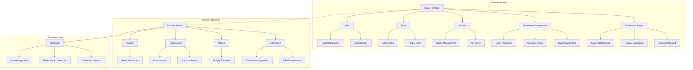
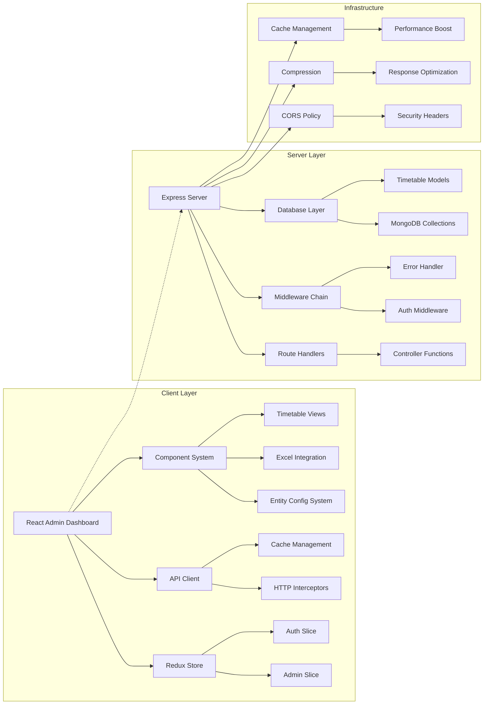
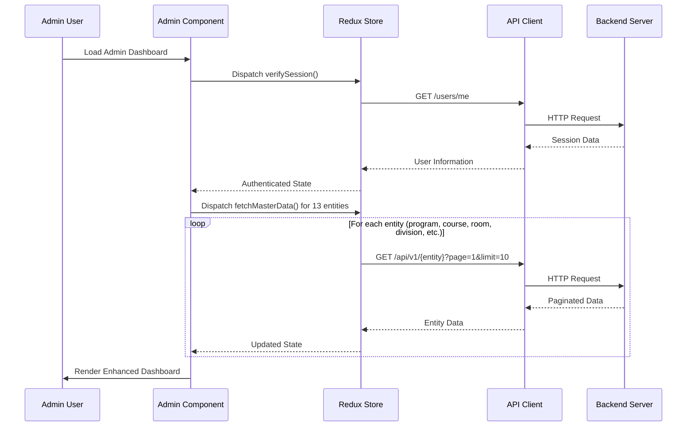
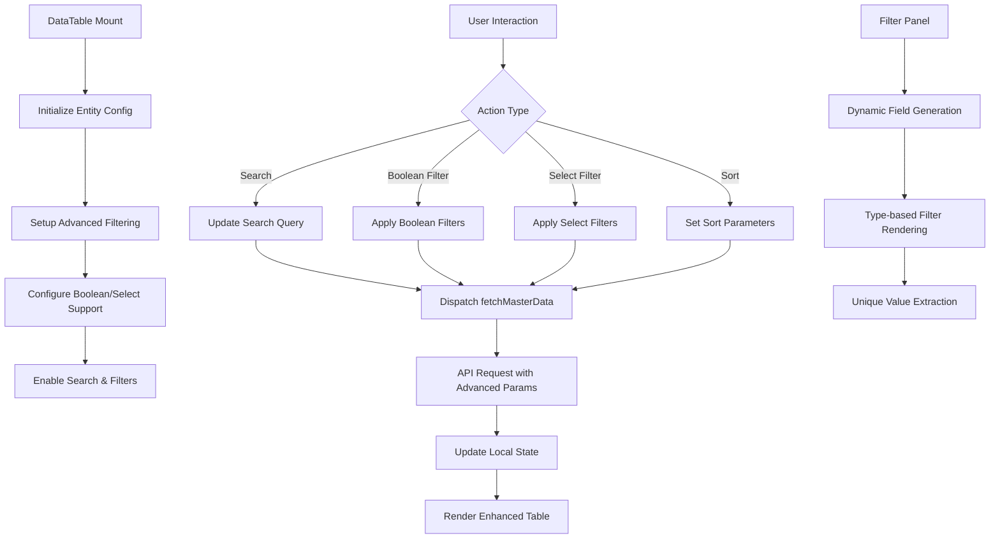
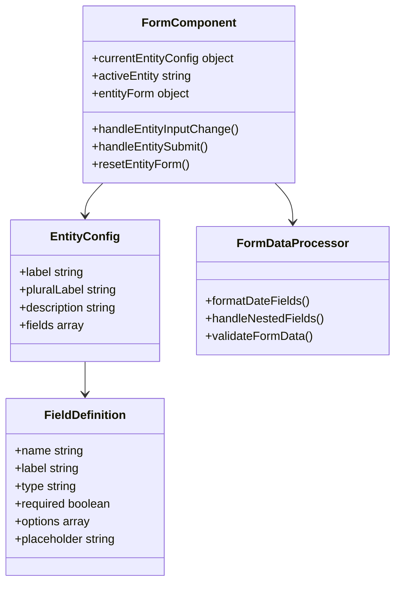
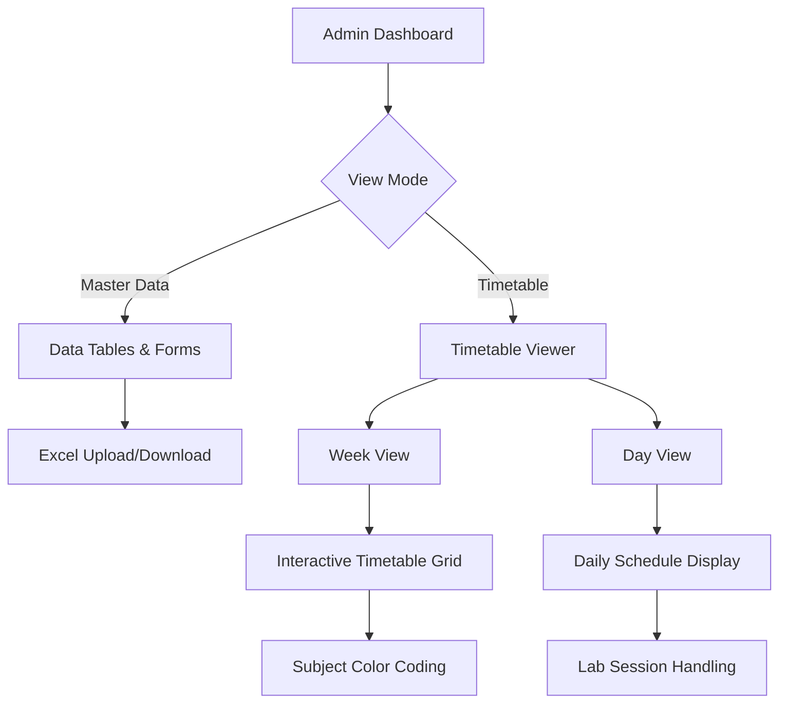
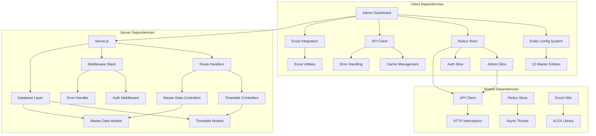

# Enhanced Admin Dashboard

<cite>
**Referenced Files in This Document**
- [Admin.jsx](file://Client/src/pages/dashboard/Admin.jsx)
- [DataTable.jsx](file://Client/src/components/deshboard/DataTable.jsx)
- [Form.jsx](file://Client/src/components/deshboard/Form.jsx)
- [SideBar.jsx](file://Client/src/components/deshboard/SideBar.jsx)
- [TimeTable.jsx](file://Client/src/components/deshboard/TimeTable.jsx)
- [adminSlice.js](file://Client/src/store/admin/adminSlice.js)
- [apiClient.js](file://Client/src/services/apiClient.js)
- [HandelExcelFile.js](file://Client/src/utils/HandelExcelFile.js)
- [ExcelHendelButton.jsx](file://Client/src/components/ExcelHendelButton.jsx)
- [timetable.controllers.js](file://Backend/src/controllers/timetable.controllers.js)
- [timeTableEntry.controllers.js](file://Backend/src/controllers/timeTableEntry.controllers.js)
- [timetable.models.js](file://Backend/src/models/timetable.models.js)
- [timeTableEntry.models.js](file://Backend/src/models/timeTableEntry.models.js)
- [auth.middleware.js](file://Backend/src/middlewares/auth.middleware.js)
- [errorHandler.middleware.js](file://Backend/src/middlewares/errorHandler.middleware.js)
- [main.jsx](file://Client/src/main.jsx)
- [server.js](file://Backend/src/server.js)
- [db/index.js](file://Backend/src/db/index.js)
- [faculty.models.js](file://Backend/src/models/faculty.models.js)
- [faculty.conteoller.js](file://Backend/src/controllers/faculty.conteoller.js)
</cite>

## Update Summary
**Changes Made**
- Updated faculty registration form configuration to align with backend validation enforcement
- Adjusted date_of_birth field to be optional (required: false) in client-side form configuration
- Enhanced backend validation logic to support flexible date_of_birth handling
- Improved form validation consistency between frontend and backend systems

## Table of Contents
1. [Introduction](#introduction)
2. [Project Structure](#project-structure)
3. [Core Components](#core-components)
4. [Architecture Overview](#architecture-overview)
5. [Detailed Component Analysis](#detailed-component-analysis)
6. [Entity Configuration System](#entity-configuration-system)
7. [Advanced Features](#advanced-features)
8. [Dependency Analysis](#dependency-analysis)
9. [Performance Considerations](#performance-considerations)
10. [Troubleshooting Guide](#troubleshooting-guide)
11. [Conclusion](#conclusion)

## Introduction
The Enhanced Admin Dashboard represents a comprehensive educational institution management system built with modern MERN stack architecture. This sophisticated platform provides administrators with centralized control over timetable operations, academic data management, and institutional workflows. The system emphasizes real-time synchronization, robust security, and an intuitive user experience through advanced React patterns, Redux Toolkit state management, and comprehensive entity configuration management.

Key enhancements include automatic data initialization, comprehensive entity configuration system, boolean/select field support, timetable toggle functionality, and improved role verification mechanisms.

## Project Structure
The project maintains a clean separation of concerns with modular frontend and backend components:



**Diagram sources**
- [main.jsx:1-19](file://Client/src/main.jsx#L1-L19)
- [server.js:1-106](file://Backend/src/server.js#L1-L106)
- [db/index.js:1-21](file://Backend/src/db/index.js#L1-L21)

**Section sources**
- [main.jsx:1-19](file://Client/src/main.jsx#L1-L19)
- [server.js:1-106](file://Backend/src/server.js#L1-L106)
- [Admin.jsx:1-1007](file://Client/src/pages/dashboard/Admin.jsx#L1-L1007)

## Core Components
The enhanced dashboard introduces several sophisticated components working in harmony:

### Comprehensive Entity Configuration System
The system now features a complete entity configuration management system supporting 13 different master entities with dynamic field definitions:

- **Program Management**: Academic programs with duration and active status tracking
- **Course Catalog**: Course definitions with credit hours and activity status
- **Room Management**: Physical classroom and facility allocation
- **Division Control**: Class sections and batch management
- **Faculty Directory**: Staff profiles with specialization and qualification tracking
- **Student Records**: Complete student information management
- **Timetable Operations**: Advanced scheduling with lab session support
- **User Management**: Multi-role access control system

### Advanced Data Management Interface
Enhanced components provide sophisticated data manipulation capabilities:

- **Intelligent DataTable**: Dynamic filtering, sorting, and pagination with boolean/select support
- **Smart Form System**: Dynamic form generation with nested field support and validation
- **Excel Integration**: Bulk data upload/download with template generation
- **Timetable Viewer**: Interactive timetable display with week/day views and export capabilities

### Enhanced State Management
Redux Toolkit integration provides centralized state management with:

- **Automatic Cache Invalidation**: Smart cache management for data consistency
- **Real-time Updates**: Seamless state synchronization across components
- **Error Handling**: Comprehensive error management with user feedback
- **Loading States**: Optimistic UI updates with loading indicators

**Section sources**
- [Admin.jsx:101-791](file://Client/src/pages/dashboard/Admin.jsx#L101-L791)
- [DataTable.jsx:1-565](file://Client/src/components/deshboard/DataTable.jsx#L1-L565)
- [Form.jsx:1-171](file://Client/src/components/deshboard/Form.jsx#L1-L171)
- [adminSlice.js:1-201](file://Client/src/store/admin/adminSlice.js#L1-L201)

## Architecture Overview
The system implements a sophisticated client-server architecture with comprehensive real-time synchronization:



**Diagram sources**
- [server.js:1-106](file://Backend/src/server.js#L1-L106)
- [apiClient.js:1-268](file://Client/src/services/apiClient.js#L1-L268)
- [auth.middleware.js:1-121](file://Backend/src/middlewares/auth.middleware.js#L1-L121)

The architecture emphasizes:
- **Modular Design**: Clear separation between client and server concerns
- **Real-time Synchronization**: Automatic cache invalidation and state updates
- **Comprehensive Error Handling**: Consistent error responses and recovery mechanisms
- **Security Implementation**: Multi-layered authentication and authorization

## Detailed Component Analysis

### Enhanced Admin Dashboard Component
The Admin component now serves as a comprehensive orchestration hub with automatic initialization:



**Diagram sources**
- [Admin.jsx:29-54](file://Client/src/pages/dashboard/Admin.jsx#L29-L54)
- [adminSlice.js:21-33](file://Client/src/store/admin/adminSlice.js#L21-L33)

The enhanced component now includes:
- **Automatic Entity Initialization**: Concurrent loading of all 13 master entities
- **Improved Role Verification**: Enhanced authentication with proper redirect handling
- **Timetable Toggle Integration**: Seamless switching between master data and timetable views
- **Excel Integration**: Automatic template generation and data upload handling

### Advanced Data Table Component
The DataTable component now supports sophisticated filtering and formatting:



**Diagram sources**
- [DataTable.jsx:58-82](file://Client/src/components/deshboard/DataTable.jsx#L58-L82)
- [DataTable.jsx:315-364](file://Client/src/components/deshboard/DataTable.jsx#L315-L364)

Key enhancements include:
- **Boolean Field Support**: Specialized rendering for active/inactive status
- **Select Field Integration**: Dynamic dropdown generation from entity options
- **Nested Field Handling**: Support for complex data structures like ltpHours
- **Advanced Formatting**: Type-aware cell rendering with proper styling

### Smart Form System
The Form component now provides comprehensive dynamic form generation:



**Diagram sources**
- [Form.jsx:5-32](file://Client/src/components/deshboard/Form.jsx#L5-L32)
- [Admin.jsx:101-791](file://Client/src/pages/dashboard/Admin.jsx#L101-L791)

**Section sources**
- [Admin.jsx:1-1007](file://Client/src/pages/dashboard/Admin.jsx#L1-L1007)
- [DataTable.jsx:1-565](file://Client/src/components/deshboard/DataTable.jsx#L1-L565)
- [Form.jsx:1-171](file://Client/src/components/deshboard/Form.jsx#L1-L171)
- [SideBar.jsx:1-49](file://Client/src/components/deshboard/SideBar.jsx#L1-L49)
- [adminSlice.js:1-201](file://Client/src/store/admin/adminSlice.js#L1-L201)
- [apiClient.js:1-268](file://Client/src/services/apiClient.js#L1-L268)

## Entity Configuration System
The enhanced dashboard introduces a comprehensive entity configuration system supporting 13 different master entities:

### Master Entity Categories
The system organizes entities into logical categories:

**Academic Entities**
- Program: Academic program definitions with duration and status
- Course: Course catalog with credit hours and activity tracking
- Division: Class sections and batch management
- Specialization: Program specializations and concentrations

**Institutional Entities**
- Room: Classroom and facility allocation
- Faculty: Staff directory with qualifications and experience
- Student: Student information and enrollment tracking
- Qualification Type: Academic qualification definitions

**Operational Entities**
- Subject Allocation: Course-faculty assignment management
- Time Slot: Class period and schedule definitions
- Timetable: Master schedule generation and management
- Timetable Entry: Individual class schedule entries

**System Entities**
- User: Multi-role user management with authentication

### Configuration Structure
Each entity configuration includes comprehensive metadata:

```javascript
const ENTITY_CONFIG = {
  program: {
    label: "Program",
    pluralLabel: "Programs", 
    description: "Define academic programs like B.Tech CSE, BBA, etc.",
    fields: [
      {
        name: "program_id",
        label: "Program Code",
        placeholder: "e.g. UG-CSE",
        type: "text",
        required: true,
      },
      {
        name: "program_name", 
        label: "Program Name",
        placeholder: "e.g. Undergraduate Computer Science",
        type: "text",
        required: true,
      },
      {
        name: "program_duration",
        label: "Duration (years)",
        placeholder: "e.g. 4",
        type: "number", 
        required: true,
      },
      {
        name: "isActive",
        label: "Active",
        type: "boolean",
        required: false,
      },
    ],
  }
}
```

### Faculty Registration Form Configuration
**Updated** The faculty registration form now includes enhanced date_of_birth field configuration with flexible validation:

The faculty entity configuration includes comprehensive field definitions with the date_of_birth field now configured as optional:

```javascript
faculty: {
  label: "Faculty",
  pluralLabel: "Faculty",
  description: "Add faculty details to map classes and subjects.",
  fields: [
    // ... other fields
    {
      name: "date_of_birth",
      label: "Date of Birth",
      placeholder: "e.g. 1980-05-20",
      type: "date",
      required: false,  // Updated to be optional
    },
    // ... other fields
  ],
}
```

This configuration change aligns with the backend validation enforcement, allowing administrators to register faculty members without requiring the date_of_birth field while maintaining data integrity.

**Section sources**
- [Admin.jsx:101-791](file://Client/src/pages/dashboard/Admin.jsx#L101-L791)
- [faculty.models.js:65-67](file://Backend/src/models/faculty.models.js#L65-L67)
- [faculty.conteoller.js:39-41](file://Backend/src/controllers/faculty.conteoller.js#L39-L41)

## Advanced Features

### Timetable Toggle Functionality
The dashboard now includes integrated timetable viewing capabilities:



**Diagram sources**
- [Admin.jsx:827-938](file://Client/src/pages/dashboard/Admin.jsx#L827-L938)
- [TimeTable.jsx:472-722](file://Client/src/components/deshboard/TimeTable.jsx#L472-L722)

### Excel Integration System
Comprehensive Excel handling for bulk data management:

- **Template Generation**: Automatic Excel template creation based on entity fields
- **Bulk Upload**: Support for uploading multiple records via Excel files
- **Data Validation**: Automatic validation against entity configurations
- **Error Handling**: Comprehensive error reporting for invalid data

### Enhanced Role Verification
Improved authentication and authorization system:

- **Multi-layered Authentication**: JWT token management with HTTP-only cookies
- **Role-based Access Control**: Automatic redirection based on user roles
- **Session Management**: Automatic token refresh and session validation
- **Protected Routes**: Comprehensive route protection with role verification

**Section sources**
- [Admin.jsx:56-64](file://Client/src/pages/dashboard/Admin.jsx#L56-L64)
- [TimeTable.jsx:1-722](file://Client/src/components/deshboard/TimeTable.jsx#L1-L722)
- [ExcelHendelButton.jsx:1-85](file://Client/src/components/ExcelHendelButton.jsx#L1-L85)

## Dependency Analysis
The enhanced system maintains excellent modularity with sophisticated dependency relationships:



**Diagram sources**
- [Admin.jsx:1-1007](file://Client/src/pages/dashboard/Admin.jsx#L1-L1007)
- [server.js:46-76](file://Backend/src/server.js#L46-L76)
- [store.js:1-15](file://Client/src/store/store.js#L1-L15)

**Section sources**
- [store.js:1-15](file://Client/src/store/store.js#L1-L15)
- [auth.middleware.js:1-121](file://Backend/src/middlewares/auth.middleware.js#L1-L121)
- [errorHandler.middleware.js:1-88](file://Backend/src/middlewares/errorHandler.middleware.js#L1-L88)

## Performance Considerations
The enhanced system implements comprehensive performance optimization strategies:

### Client-Side Optimizations
- **Automatic Entity Loading**: Concurrent initialization of all 13 master entities
- **Intelligent Caching**: Smart cache invalidation preventing stale data
- **Virtual Scrolling**: Efficient rendering of large datasets
- **Optimized State Updates**: Selective updates preventing unnecessary re-renders
- **Excel Processing**: Asynchronous file processing with progress indication

### Server-Side Optimizations
- **Connection Pooling**: Efficient database connection management
- **Query Optimization**: Indexes and optimized queries for fast data retrieval
- **Response Compression**: Automatic compression reducing payload sizes
- **Pagination Support**: Built-in pagination for all master data endpoints
- **Filter Optimization**: Advanced filtering with database-level query optimization

### Cache Management
- **Smart Cache Invalidation**: Automatic cache clearing on data mutations
- **Retry Logic**: Automatic retry with exponential backoff for transient failures
- **Cache Statistics**: Monitoring helping optimize cache hit ratios
- **Entity-specific Cache**: Isolated cache management per entity type

## Troubleshooting Guide

### Common Issues and Solutions

#### Authentication Problems
**Issue**: Users unable to access admin dashboard
**Solution**: Verify JWT token validity and user role permissions

#### Data Loading Failures  
**Issue**: Dashboard shows empty data or loading indefinitely
**Solution**: Check API connectivity and verify database availability

#### Excel Upload Issues
**Issue**: Excel templates not downloading or uploads failing
**Solution**: Verify file format compatibility and check browser console for errors

#### Performance Issues
**Issue**: Slow page loads or unresponsive UI
**Solution**: Monitor cache effectiveness and optimize network requests

#### Timetable Display Problems
**Issue**: Timetable not displaying correctly or showing incorrect data
**Solution**: Check timetable generation process and verify data integrity

#### Faculty Registration Validation Errors
**Issue**: Faculty registration fails with date_of_birth validation errors
**Solution**: Verify that date_of_birth field is optional and properly formatted

### Error Handling
The system provides comprehensive error handling through:
- **Dedicated Middleware**: Standardized error responses and graceful degradation
- **User Feedback**: Toast notifications for all error conditions
- **Retry Logic**: Automatic retry mechanisms for transient failures
- **Logging**: Comprehensive error logging for debugging and monitoring

**Section sources**
- [errorHandler.middleware.js:1-88](file://Backend/src/middlewares/errorHandler.middleware.js#L1-L88)
- [auth.middleware.js:1-121](file://Backend/src/middlewares/auth.middleware.js#L1-L121)
- [apiClient.js:120-207](file://Client/src/services/apiClient.js#L120-L207)

## Conclusion
The Enhanced Admin Dashboard represents a significant advancement in educational institution management systems, combining modern web technologies with robust architectural patterns. The system's comprehensive feature set, including automatic data initialization, entity configuration management, boolean/select field support, timetable toggle functionality, and improved role verification, provides a solid foundation for institutional administration.

Key achievements include:
- **Scalable Architecture**: Clean separation of concerns enabling easy maintenance and extension
- **Comprehensive Entity Management**: Support for 13 different master entities with dynamic configuration
- **Advanced Data Manipulation**: Sophisticated filtering, sorting, and Excel integration capabilities
- **Enhanced User Experience**: Intuitive dashboards with powerful data manipulation and timetable visualization
- **Robust Security**: Multi-layered authentication and authorization mechanisms
- **Performance Optimization**: Advanced caching, lazy loading, and efficient state management
- **Developer Experience**: Well-structured codebase with comprehensive documentation and testing

The platform provides educational institutions with a flexible, extensible solution for managing complex timetable operations while maintaining the ability to adapt to changing institutional needs and requirements.

**Updated** Recent enhancements include improved faculty registration form validation with flexible date_of_birth handling, ensuring better alignment between frontend and backend validation systems while maintaining data integrity and user experience.