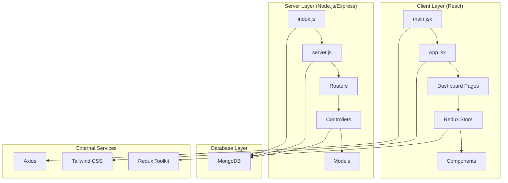
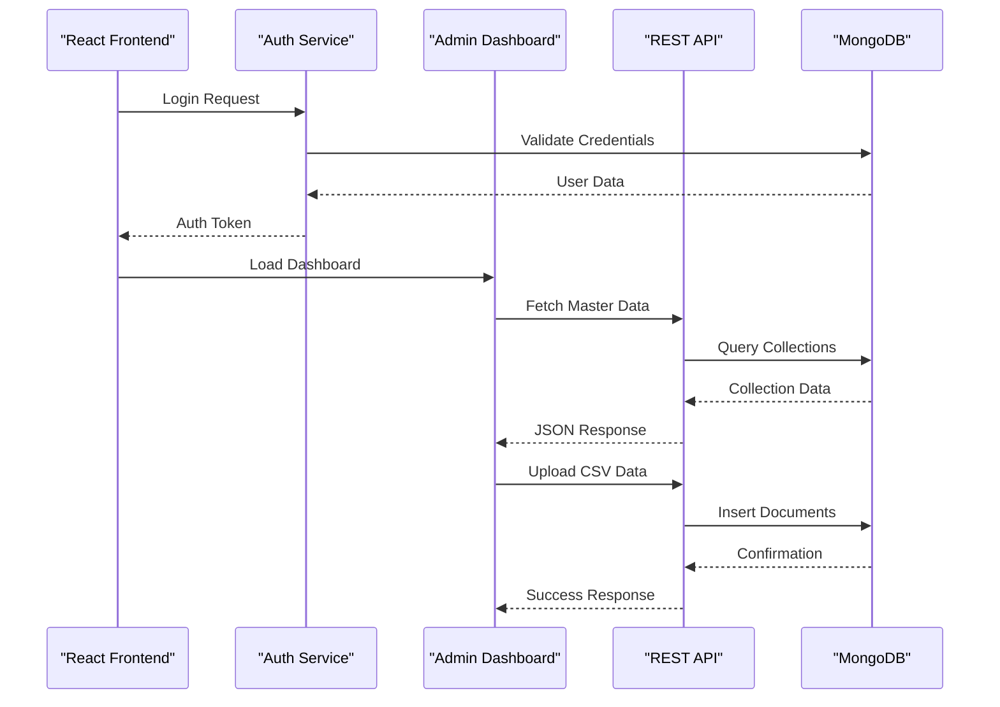
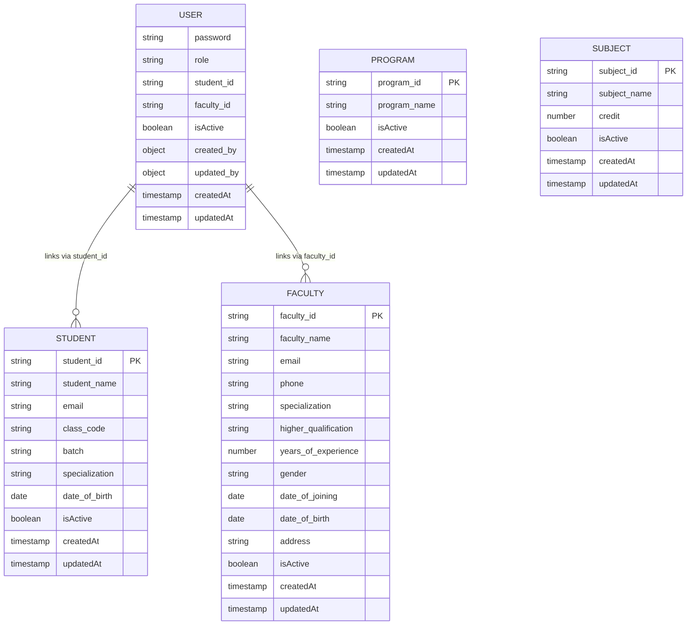
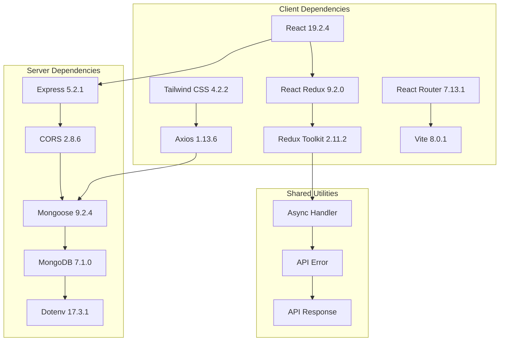

# Project Overview

<cite>
**Referenced Files in This Document**
- [Backend package.json](file://Backend/package.json)
- [Client package.json](file://Client/package.json)
- [Backend index.js](file://Backend/src/index.js)
- [Backend server.js](file://Backend/src/server.js)
- [Backend user.controller.js](file://Backend/src/controllers/user.controller.js)
- [Backend user.models.js](file://Backend/src/models/user.models.js)
- [Backend student.controller.js](file://Backend/src/controllers/student.controller.js)
- [Backend faculty.conteoller.js](file://Backend/src/controllers/faculty.conteoller.js)
- [Backend ApiError.js](file://Backend/src/utils/ApiError.js)
- [Client main.jsx](file://Client/src/main.jsx)
- [Client App.jsx](file://Client/src/App.jsx)
- [Client store.js](file://Client/src/store/store.js)
- [Client Admin.jsx](file://Client/src/pages/dashboard/Admin.jsx)
- [Client Faculty.jsx](file://Client/src/pages/dashboard/Faculty.jsx)
- [Client Student.jsx](file://Client/src/pages/dashboard/Student.jsx)
</cite>

## Table of Contents
1. [Introduction](#introduction)
2. [Project Structure](#project-structure)
3. [Core Components](#core-components)
4. [Architecture Overview](#architecture-overview)
5. [Detailed Component Analysis](#detailed-component-analysis)
6. [Dependency Analysis](#dependency-analysis)
7. [Performance Considerations](#performance-considerations)
8. [Troubleshooting Guide](#troubleshooting-guide)
9. [Conclusion](#conclusion)

## Introduction
The Timetable Management System is an educational institution scheduling solution designed to streamline academic administration. It serves three primary user groups:
- Administrators: Manage academic programs, courses, rooms, classes, divisions, subjects, specializations, faculty, and students
- Faculty members: View their teaching schedules and related information
- Students: Access their personal timetables and course schedules

The system's core value proposition lies in automating manual scheduling processes through digital master data management, automated timetable generation, and efficient CSV data operations for bulk uploads.

## Project Structure
The project follows a clean modular architecture with clear separation between client and server layers:



**Diagram sources**
- [Backend index.js:1-18](file://Backend/src/index.js#L1-L18)
- [Backend server.js:1-54](file://Backend/src/server.js#L1-L54)
- [Client main.jsx:1-18](file://Client/src/main.jsx#L1-L18)

The architecture consists of:
- **Frontend**: React 18 application with Vite bundler, Redux Toolkit for state management, and Tailwind CSS for styling
- **Backend**: Node.js/Express server with modular routing and MongoDB/Mongoose integration
- **Database**: MongoDB for storing all institutional data including users, students, faculty, and timetable-related entities

**Section sources**
- [Backend package.json:1-22](file://Backend/package.json#L1-L22)
- [Client package.json:1-36](file://Client/package.json#L1-L36)
- [Backend index.js:1-18](file://Backend/src/index.js#L1-L18)
- [Backend server.js:1-54](file://Backend/src/server.js#L1-L54)

## Core Components
The system provides comprehensive functionality through specialized components:

### Authentication & Authorization
- User registration with role-based access control
- Secure login with credential validation
- Session management through JWT tokens
- Role-specific dashboard navigation

### Master Data Management
- Academic programs and courses administration
- Room and classroom management
- Student and faculty enrollment
- Subject and specialization tracking
- Class and division organization

### Timetable Generation
- Automated schedule creation based on constraints
- Conflict detection and resolution
- Resource allocation optimization
- Export functionality for printable timetables

### Data Operations
- Bulk CSV upload for master data
- Real-time data synchronization
- Validation and error handling
- Audit trail for all modifications

**Section sources**
- [Backend user.controller.js:1-355](file://Backend/src/controllers/user.controller.js#L1-L355)
- [Backend student.controller.js:1-209](file://Backend/src/controllers/student.controller.js#L1-L209)
- [Backend faculty.conteoller.js:1-229](file://Backend/src/controllers/faculty.conteoller.js#L1-L229)

## Architecture Overview
The system implements a full-stack architecture with clear separation of concerns:



**Diagram sources**
- [Client App.jsx:13-38](file://Client/src/App.jsx#L13-L38)
- [Backend server.js:25-50](file://Backend/src/server.js#L25-L50)
- [Backend user.controller.js:280-354](file://Backend/src/controllers/user.controller.js#L280-L354)

The architecture ensures:
- **Scalability**: Modular design allows independent scaling of frontend and backend
- **Maintainability**: Clear separation between presentation, business logic, and data layers
- **Extensibility**: Plugin-style router system supports easy addition of new entities
- **Reliability**: Comprehensive error handling and validation throughout the stack

## Detailed Component Analysis

### Technology Stack Summary
The system leverages modern web technologies for optimal performance and developer experience:

**Frontend Technologies:**
- **React 18**: Latest React features with concurrent rendering and automatic batching
- **Redux Toolkit**: Predictable state management with slice-based architecture
- **Tailwind CSS**: Utility-first styling framework for rapid UI development
- **Axios**: Promise-based HTTP client for API communications
- **React Router**: Declarative routing for single-page application navigation

**Backend Technologies:**
- **Node.js/Express**: Lightweight server-side framework with middleware support
- **MongoDB**: Flexible NoSQL database for diverse academic data structures
- **Mongoose**: ODM for schema-based data modeling and validation
- **CORS**: Cross-origin resource sharing for secure API communication

**Development Tools:**
- **Vite**: Fast build tool and development server
- **ESLint**: Code quality and consistency enforcement
- **Nodemon**: Automatic server restart during development

### Data Model Architecture
The system uses a normalized relational-like structure within MongoDB collections:



**Diagram sources**
- [Backend user.models.js:1-61](file://Backend/src/models/user.models.js#L1-L61)
- [Backend student.controller.js:1-209](file://Backend/src/controllers/student.controller.js#L1-L209)
- [Backend faculty.conteoller.js:1-229](file://Backend/src/controllers/faculty.conteoller.js#L1-L229)

### API Endpoint Structure
The backend follows RESTful conventions with organized routing:

```mermaid
graph LR
subgraph "API Endpoints"
A[/api/v1/users] --> A1[Register/Get Users]
B[/api/v1/students] --> B1[Manage Student Records]
C[/api/v1/faculties] --> C1[Manage Faculty Records]
D[/api/v1/classes] --> D1[Class Scheduling]
E[/api/v1/courses] --> E1[Course Catalog]
F[/api/v1/programmes] --> F1[Academic Programs]
G[/api/v1/rooms] --> G1[Room Management]
H[/api/v1/sections] --> H1[Section Organization]
I[/api/v1/semesters] --> I1[Semester Planning]
J[/api/v1/subjects] --> J1[Subject Catalog]
K[/api/v1/specializations] --> K1[Specialization Tracking]
end
```

**Diagram sources**
- [Backend server.js:39-50](file://Backend/src/server.js#L39-L50)

**Section sources**
- [Backend server.js:1-54](file://Backend/src/server.js#L1-L54)
- [Backend user.models.js:1-61](file://Backend/src/models/user.models.js#L1-L61)

## Dependency Analysis
The system maintains loose coupling between components through well-defined interfaces:



**Diagram sources**
- [Client package.json:12-34](file://Client/package.json#L12-L34)
- [Backend package.json:14-20](file://Backend/package.json#L14-L20)

Key dependency characteristics:
- **Frontend**: Modern React ecosystem with focus on developer experience
- **Backend**: Minimal but powerful stack emphasizing performance and reliability
- **Shared**: Consistent error handling and response formatting across boundaries

**Section sources**
- [Client package.json:1-36](file://Client/package.json#L1-L36)
- [Backend package.json:1-22](file://Backend/package.json#L1-L22)

## Performance Considerations
The system is designed with several performance optimization strategies:

### Frontend Performance
- **Code Splitting**: Route-based lazy loading reduces initial bundle size
- **State Optimization**: Redux Toolkit with selective re-renders minimizes unnecessary updates
- **Component Memoization**: React.memo usage for expensive components
- **Efficient Rendering**: Virtualized lists for large datasets

### Backend Performance
- **Connection Pooling**: Mongoose manages database connections efficiently
- **Query Optimization**: Aggregation pipelines for complex data joins
- **Caching Strategy**: Redis-compatible caching for frequently accessed master data
- **Load Balancing**: Horizontal scaling support for increased user loads

### Database Optimization
- **Indexing Strategy**: Strategic indexes on frequently queried fields
- **Data Normalization**: Balanced normalization to prevent redundancy
- **Batch Operations**: Bulk insert/update operations for CSV imports
- **Connection Management**: Optimized connection pooling for concurrent requests

## Troubleshooting Guide
Common issues and their solutions:

### Authentication Issues
- **Login Failures**: Verify user credentials match stored records
- **Token Expiration**: Implement automatic token refresh mechanisms
- **Role-Based Access**: Ensure proper role assignment in user records

### Data Import Problems
- **CSV Validation**: Check file format matches expected column structure
- **Duplicate Records**: Review unique constraints on student_id and faculty_id
- **Missing Dependencies**: Ensure prerequisite entities exist before creating dependents

### API Communication Errors
- **CORS Configuration**: Verify CORS origins match frontend deployment
- **Database Connectivity**: Check MongoDB connection string and network accessibility
- **Response Handling**: Implement proper error catching for all API calls

**Section sources**
- [Backend ApiError.js:1-21](file://Backend/src/utils/ApiError.js#L1-L21)
- [Backend user.controller.js:14-29](file://Backend/src/controllers/user.controller.js#L14-L29)

## Conclusion
The Timetable Management System represents a comprehensive solution for educational institution scheduling needs. Its modern full-stack architecture, combined with robust data management and user-friendly interfaces, provides administrators with powerful tools for academic planning while delivering convenient access to schedules for faculty and students.

The system's modular design ensures maintainability and scalability, while its technology choices balance performance with developer productivity. The integration of CSV operations and automated timetable generation addresses real-world challenges faced by academic institutions seeking to digitize their scheduling processes.

Future enhancements could include advanced conflict resolution algorithms, mobile application support, and integration with external calendar systems for broader ecosystem compatibility.