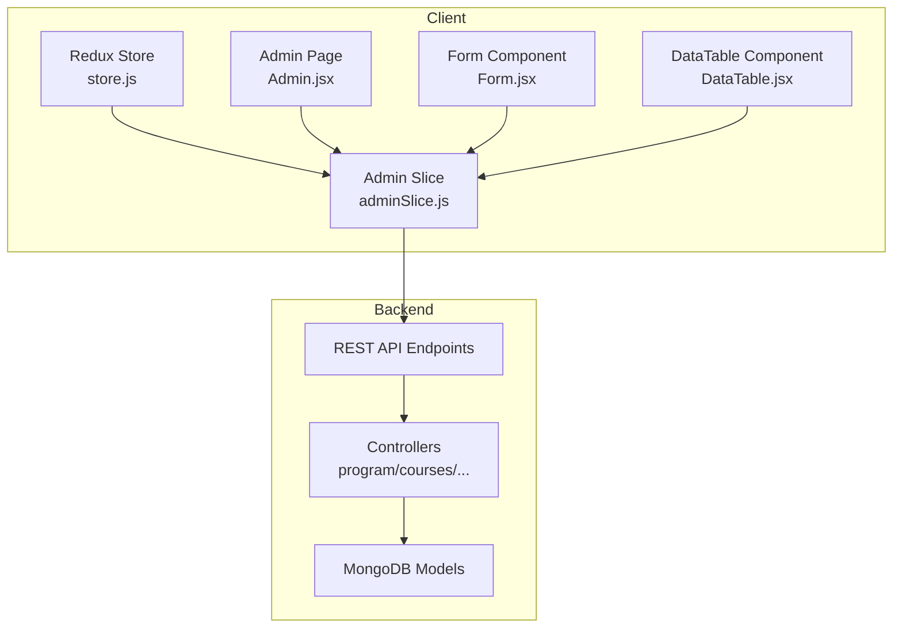
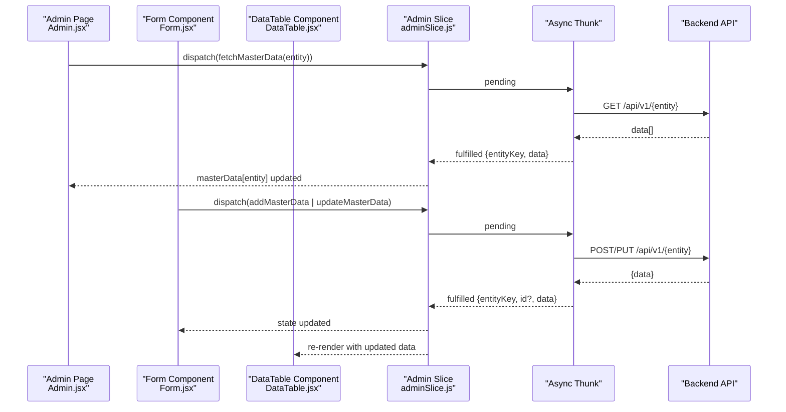
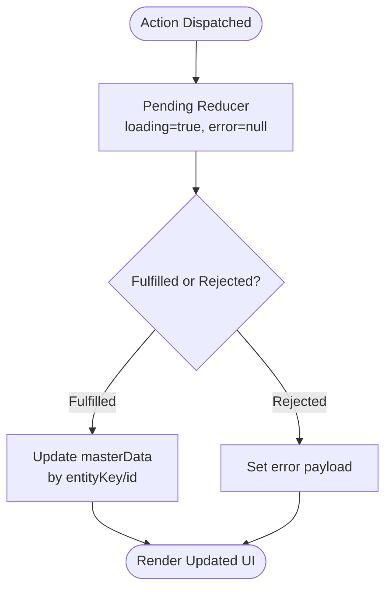
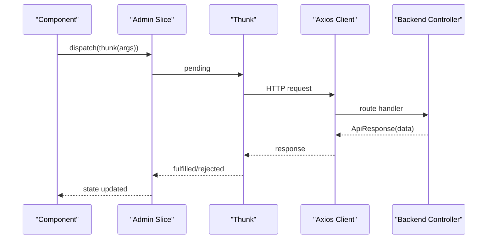
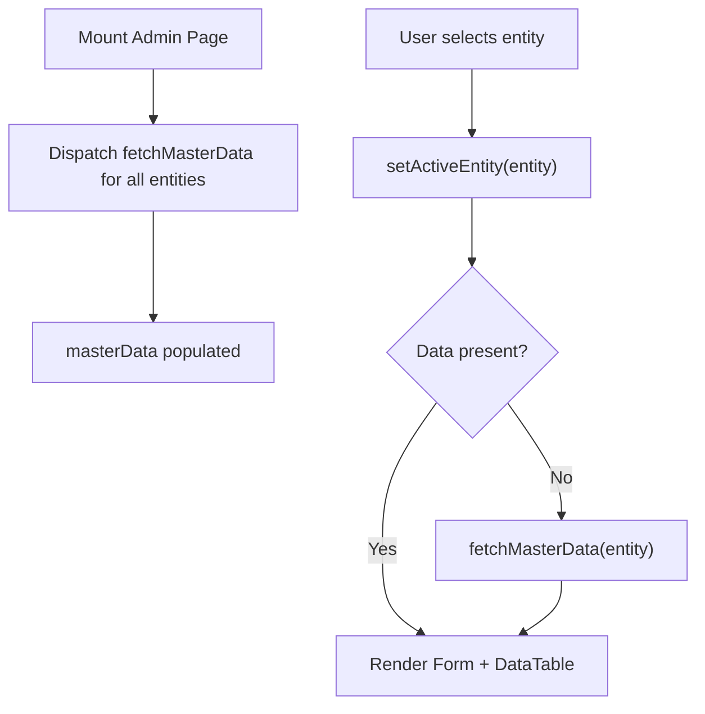
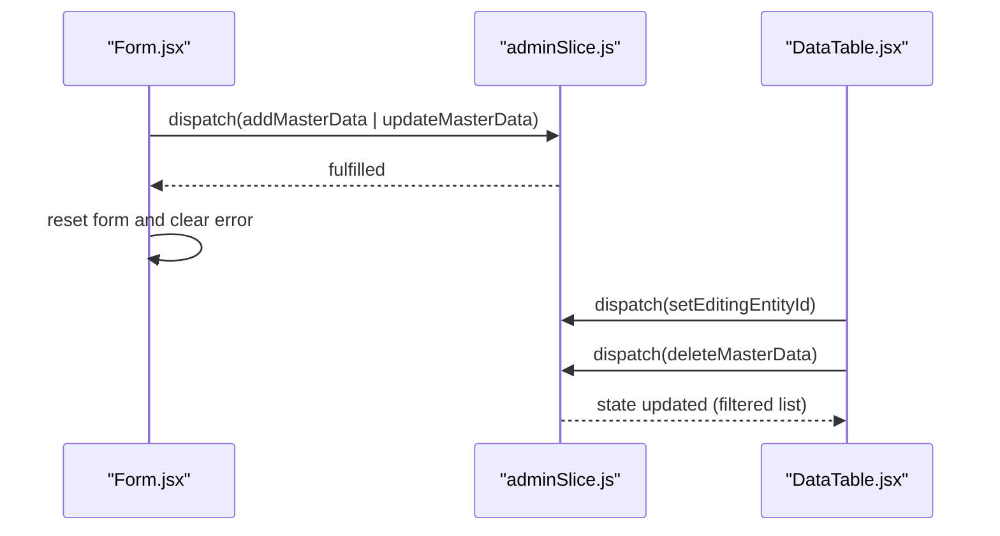
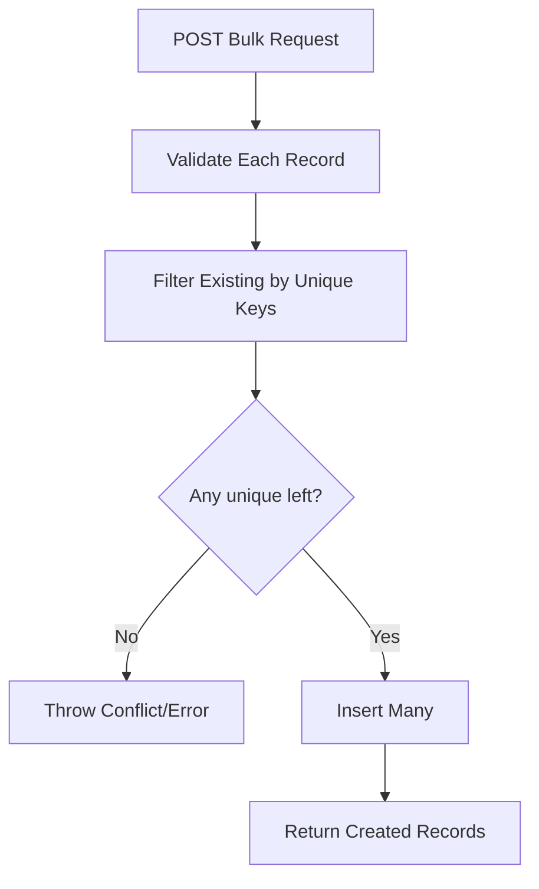
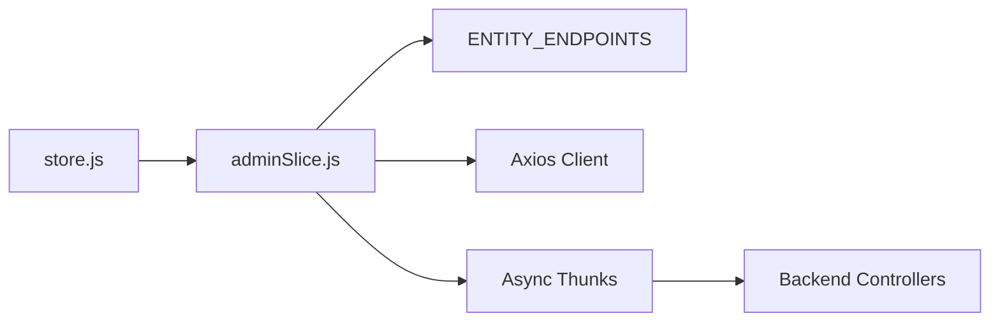

# Admin Data Slice

<cite>
**Referenced Files in This Document**
- [adminSlice.js](file://Client/src/store/admin/adminSlice.js)
- [store.js](file://Client/src/store/store.js)
- [Admin.jsx](file://Client/src/pages/dashboard/Admin.jsx)
- [Form.jsx](file://Client/src/components/deshboard/Form.jsx)
- [DataTable.jsx](file://Client/src/components/deshboard/DataTable.jsx)
- [program.controlles.js](file://Backend/src/controllers/program.controlles.js)
- [course.controlles.js](file://Backend/src/controllers/course.controlles.js)
- [student.controller.js](file://Backend/src/controllers/student.controller.js)
- [faculty.conteoller.js](file://Backend/src/controllers/faculty.conteoller.js)
- [room.controllers.js](file://Backend/src/controllers/room.controllers.js)
- [class.controllers.js](file://Backend/src/controllers/class.controllers.js)
- [subject.controllers.js](file://Backend/src/controllers/subject.controllers.js)
- [specialization.controllers.js](file://Backend/src/controllers/specialization.controllers.js)
</cite>

## Table of Contents
1. [Introduction](#introduction)
2. [Project Structure](#project-structure)
3. [Core Components](#core-components)
4. [Architecture Overview](#architecture-overview)
5. [Detailed Component Analysis](#detailed-component-analysis)
6. [Dependency Analysis](#dependency-analysis)
7. [Performance Considerations](#performance-considerations)
8. [Troubleshooting Guide](#troubleshooting-guide)
9. [Conclusion](#conclusion)

## Introduction
This document explains the admin data slice responsible for managing academic master data. It covers the Redux slice state, CRUD reducers, async thunks for API calls, loading and error handling, state normalization patterns, entity relationships, caching strategies, pagination and filtering, bulk operations, validation and conflict resolution, and practical usage in forms and data tables. It also provides performance optimization techniques for large datasets.

## Project Structure
The admin data flow spans the client Redux store and the backend REST API:
- Client-side Redux store composes the admin slice with other slices.
- The admin slice defines async thunks for CRUD operations against backend endpoints.
- Frontend pages and components consume the slice to render forms and tables.

**Diagram sources**
- [store.js:1-15](file://Client/src/store/store.js#L1-L15)
- [adminSlice.js:1-173](file://Client/src/store/admin/adminSlice.js#L1-L173)
- [Admin.jsx:1-617](file://Client/src/pages/dashboard/Admin.jsx#L1-L617)
- [Form.jsx:1-127](file://Client/src/components/deshboard/Form.jsx#L1-L127)
- [DataTable.jsx:1-86](file://Client/src/components/deshboard/DataTable.jsx#L1-L86)
- [program.controlles.js:1-131](file://Backend/src/controllers/program.controlles.js#L1-L131)
- [course.controlles.js:1-136](file://Backend/src/controllers/course.controlles.js#L1-L136)
- [student.controller.js:1-209](file://Backend/src/controllers/student.controller.js#L1-L209)
- [faculty.conteoller.js:1-229](file://Backend/src/controllers/faculty.conteoller.js#L1-L229)
- [room.controllers.js:1-133](file://Backend/src/controllers/room.controllers.js#L1-L133)
- [class.controllers.js:1-179](file://Backend/src/controllers/class.controllers.js#L1-L179)
- [subject.controllers.js:1-130](file://Backend/src/controllers/subject.controllers.js#L1-L130)
- [specialization.controllers.js:1-121](file://Backend/src/controllers/specialization.controllers.js#L1-L121)

**Section sources**
- [store.js:1-15](file://Client/src/store/store.js#L1-L15)
- [adminSlice.js:1-173](file://Client/src/store/admin/adminSlice.js#L1-L173)

## Core Components
- Admin slice state:
  - masterData: normalized dictionary keyed by entity (e.g., program, course, room, classes, section, subject, Specialization, faculty, student).
  - activeEntity: currently selected entity key.
  - editingEntityId: ID of the entity being edited.
  - loading: global loading flag for async operations.
  - error: last error message.
- Async thunks:
  - fetchMasterData(entityKey): GET list for an entity.
  - addMasterData({ entityKey, data }): POST bulk or single entity.
  - updateMasterData({ entityKey, id, data }): PUT update entity.
  - deleteMasterData({ entityKey, id }): DELETE entity.
- Reducers:
  - setActiveEntity(entityKey): sets active entity and clears editing and error.
  - setEditingEntityId(id): sets editing ID.
  - clearError(): clears error.

Key behaviors:
- Normalization: masterData stores arrays per entity key.
- Conflict handling: backend filters duplicates and validates required fields before insert.
- Error propagation: async thunks return rejectWithValue payload; reducers set error.

**Section sources**
- [adminSlice.js:80-173](file://Client/src/store/admin/adminSlice.js#L80-L173)

## Architecture Overview
The admin slice orchestrates CRUD operations via async thunks and updates normalized state. Components subscribe to the slice to render forms and tables.

**Diagram sources**
- [Admin.jsx:28-38](file://Client/src/pages/dashboard/Admin.jsx#L28-L38)
- [Form.jsx:37-50](file://Client/src/components/deshboard/Form.jsx#L37-L50)
- [DataTable.jsx:10-18](file://Client/src/components/deshboard/DataTable.jsx#L10-L18)
- [adminSlice.js:24-78](file://Client/src/store/admin/adminSlice.js#L24-L78)
- [adminSlice.js:104-168](file://Client/src/store/admin/adminSlice.js#L104-L168)

## Detailed Component Analysis

### Admin Slice State and Reducers
- State shape:
  - masterData: dictionary of arrays keyed by entity.
  - activeEntity: string.
  - editingEntityId: string | number.
  - loading: boolean.
  - error: string | null.
- Reducers:
  - setActiveEntity: resets editing and error, selects entity.
  - setEditingEntityId: sets current edit target.
  - clearError: clears error message.
- Extra reducers:
  - Pending: set loading true and clear error.
  - Fulfilled: update masterData for the entity; add for creation, replace for update, filter for deletion.
  - Rejected: set loading false and error payload.

**Diagram sources**
- [adminSlice.js:104-168](file://Client/src/store/admin/adminSlice.js#L104-L168)

**Section sources**
- [adminSlice.js:80-173](file://Client/src/store/admin/adminSlice.js#L80-L173)

### Async Thunks Implementation
- fetchMasterData(entityKey):
  - Validates entity key against endpoints map.
  - Performs GET to /api/v1/{entity}.
  - Returns { entityKey, data }.
- addMasterData({ entityKey, data }):
  - Performs POST to /api/v1/{entity} with array payload.
  - Returns { entityKey, data } appended to list.
- updateMasterData({ entityKey, id, data }):
  - Performs PUT to /api/v1/{entity}/{id}.
  - Replaces item in list by matching id.
- deleteMasterData({ entityKey, id }):
  - Performs DELETE to /api/v1/{entity}/{id}.
  - Filters item from list by id.

**Diagram sources**
- [adminSlice.js:24-78](file://Client/src/store/admin/adminSlice.js#L24-L78)
- [adminSlice.js:104-168](file://Client/src/store/admin/adminSlice.js#L104-L168)

**Section sources**
- [adminSlice.js:6-16](file://Client/src/store/admin/adminSlice.js#L6-L16)
- [adminSlice.js:24-78](file://Client/src/store/admin/adminSlice.js#L24-L78)

### Entity Configuration and Usage in Admin Page
- Admin page initializes multiple entities on mount.
- Maintains ENTITY_CONFIG with labels, plural labels, and field definitions for each entity.
- Uses setActiveEntity to switch the active entity and triggers lazy fetch if needed.
- Renders Form and DataTable for the active entity.

**Diagram sources**
- [Admin.jsx:28-38](file://Client/src/pages/dashboard/Admin.jsx#L28-L38)
- [Admin.jsx:408-412](file://Client/src/pages/dashboard/Admin.jsx#L408-L412)
- [Admin.jsx:52-406](file://Client/src/pages/dashboard/Admin.jsx#L52-L406)

**Section sources**
- [Admin.jsx:24-617](file://Client/src/pages/dashboard/Admin.jsx#L24-L617)

### Forms and Data Tables
- Form component:
  - Subscribes to editingEntityId and masterData to prefill edit form.
  - On submit, dispatches addMasterData (bulk array) or updateMasterData.
  - Resets form and clears error after successful submission.
- DataTable component:
  - Displays current entity list.
  - Provides Edit and Delete actions.
  - Edit sets editingEntityId; Delete dispatches deleteMasterData with confirmation.

**Diagram sources**
- [Form.jsx:37-50](file://Client/src/components/deshboard/Form.jsx#L37-L50)
- [DataTable.jsx:10-18](file://Client/src/components/deshboard/DataTable.jsx#L10-L18)
- [adminSlice.js:140-162](file://Client/src/store/admin/adminSlice.js#L140-L162)

**Section sources**
- [Form.jsx:1-127](file://Client/src/components/deshboard/Form.jsx#L1-L127)
- [DataTable.jsx:1-86](file://Client/src/components/deshboard/DataTable.jsx#L1-L86)

### Backend Endpoints and Validation
- Program:
  - Bulk insert validates required fields and filters duplicates by program_id.
  - Returns created records or throws conflict errors.
- Course:
  - Bulk insert validates course_id, course_name, course_duration.
  - Filters duplicates by course_id.
- Student:
  - Bulk insert validates student_id, student_name, email, class, batch, date_of_birth, specialization.
  - Filters duplicates by student_id or email.
- Faculty:
  - Bulk insert validates multiple fields including contact info and personal details.
  - Filters duplicates by faculty_id, email, or phone.
- Room:
  - Bulk insert validates room_no, floor_no, wing; checks uniqueness and absence in DB.
- Class:
  - Bulk insert validates class_id and year; filters duplicates by class_id.
  - Aggregation joins with program and course for richer reads.
- Subject:
  - Bulk insert validates subject_id, subject_name, credit; filters duplicates.
- Specialization:
  - Bulk insert validates specilization_name, program_id, course_id; filters duplicates.

**Diagram sources**
- [program.controlles.js:9-45](file://Backend/src/controllers/program.controlles.js#L9-L45)
- [course.controlles.js:8-40](file://Backend/src/controllers/course.controlles.js#L8-L40)
- [student.controller.js:13-91](file://Backend/src/controllers/student.controller.js#L13-L91)
- [faculty.conteoller.js:14-103](file://Backend/src/controllers/faculty.conteoller.js#L14-L103)
- [room.controllers.js:10-46](file://Backend/src/controllers/room.controllers.js#L10-L46)
- [class.controllers.js:9-37](file://Backend/src/controllers/class.controllers.js#L9-L37)
- [subject.controllers.js:11-41](file://Backend/src/controllers/subject.controllers.js#L11-L41)
- [specialization.controllers.js:9-41](file://Backend/src/controllers/specialization.controllers.js#L9-L41)

**Section sources**
- [program.controlles.js:1-131](file://Backend/src/controllers/program.controlles.js#L1-L131)
- [course.controlles.js:1-136](file://Backend/src/controllers/course.controlles.js#L1-L136)
- [student.controller.js:1-209](file://Backend/src/controllers/student.controller.js#L1-L209)
- [faculty.conteoller.js:1-229](file://Backend/src/controllers/faculty.conteoller.js#L1-L229)
- [room.controllers.js:1-133](file://Backend/src/controllers/room.controllers.js#L1-L133)
- [class.controllers.js:1-179](file://Backend/src/controllers/class.controllers.js#L1-L179)
- [subject.controllers.js:1-130](file://Backend/src/controllers/subject.controllers.js#L1-L130)
- [specialization.controllers.js:1-121](file://Backend/src/controllers/specialization.controllers.js#L1-L121)

## Dependency Analysis
- Client store composition includes the admin slice alongside auth, theme, and form slices.
- Admin slice depends on:
  - Axios client configured with base URL and credentials.
  - ENTITY_ENDPOINTS mapping for entity keys to backend routes.
  - Redux Toolkit createAsyncThunk and createSlice.

**Diagram sources**
- [store.js:7-14](file://Client/src/store/store.js#L7-L14)
- [adminSlice.js:6-22](file://Client/src/store/admin/adminSlice.js#L6-L22)
- [adminSlice.js:24-78](file://Client/src/store/admin/adminSlice.js#L24-L78)

**Section sources**
- [store.js:1-15](file://Client/src/store/store.js#L1-L15)
- [adminSlice.js:1-173](file://Client/src/store/admin/adminSlice.js#L1-L173)

## Performance Considerations
- State normalization:
  - Store arrays per entity key to enable O(n) lookup and updates.
- Efficient updates:
  - Replace item by id match; avoid unnecessary re-renders by updating references minimally.
- Bulk operations:
  - Backend inserts use bulk operations to reduce round trips.
- Pagination and search:
  - Current implementation loads full lists. For large datasets, introduce:
    - Pagination: limit and skip parameters in backend queries and slice state.
    - Filtering and search: add filters to thunks and reducers; cache filtered views.
- Memoization:
  - Use selectors with memoization to prevent redundant computations in components.
- Debounced search:
  - Debounce input handlers to reduce frequent API calls.
- Virtualized lists:
  - Render only visible rows in data tables for large datasets.

[No sources needed since this section provides general guidance]

## Troubleshooting Guide
Common issues and resolutions:
- Invalid entity key:
  - Symptom: Error thrown during fetch.
  - Resolution: Ensure entity key matches ENTITY_ENDPOINTS.
- Duplicate entries:
  - Symptom: Conflict error on bulk insert.
  - Resolution: Backend filters duplicates; remove duplicates from input.
- Missing required fields:
  - Symptom: Validation error on insert.
  - Resolution: Ensure required fields per entity are present.
- Update failures:
  - Symptom: 404 not found.
  - Resolution: Verify id exists; check id field presence in entity.
- Network errors:
  - Symptom: Error shown in UI.
  - Resolution: Check backend connectivity and credentials; inspect rejected thunk payload.

**Section sources**
- [adminSlice.js:26-34](file://Client/src/store/admin/adminSlice.js#L26-L34)
- [program.controlles.js:14-33](file://Backend/src/controllers/program.controlles.js#L14-L33)
- [course.controlles.js:13-32](file://Backend/src/controllers/course.controlles.js#L13-L32)
- [student.controller.js:18-70](file://Backend/src/controllers/student.controller.js#L18-L70)
- [faculty.conteoller.js:19-86](file://Backend/src/controllers/faculty.conteoller.js#L19-L86)
- [room.controllers.js:14-38](file://Backend/src/controllers/room.controllers.js#L14-L38)
- [class.controllers.js:14-28](file://Backend/src/controllers/class.controllers.js#L14-L28)
- [subject.controllers.js:15-28](file://Backend/src/controllers/subject.controllers.js#L15-L28)
- [specialization.controllers.js:13-30](file://Backend/src/controllers/specialization.controllers.js#L13-L30)

## Conclusion
The admin data slice provides a normalized, asynchronous Redux layer for managing academic entities. It integrates cleanly with frontend components to support CRUD operations, bulk uploads, and conflict-free data ingestion. Extending the slice with pagination, filtering, and virtualization will further improve performance for large datasets while maintaining a responsive UI.