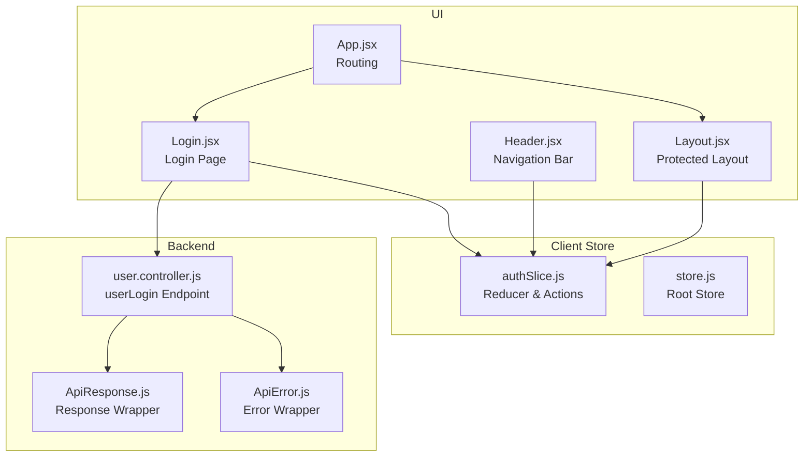
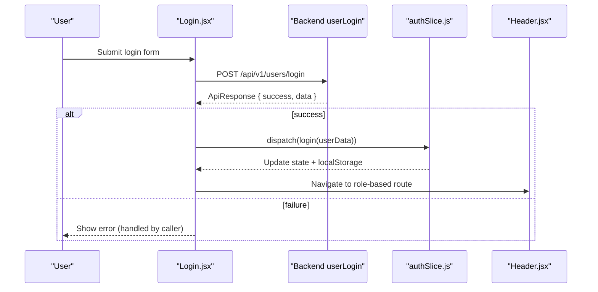
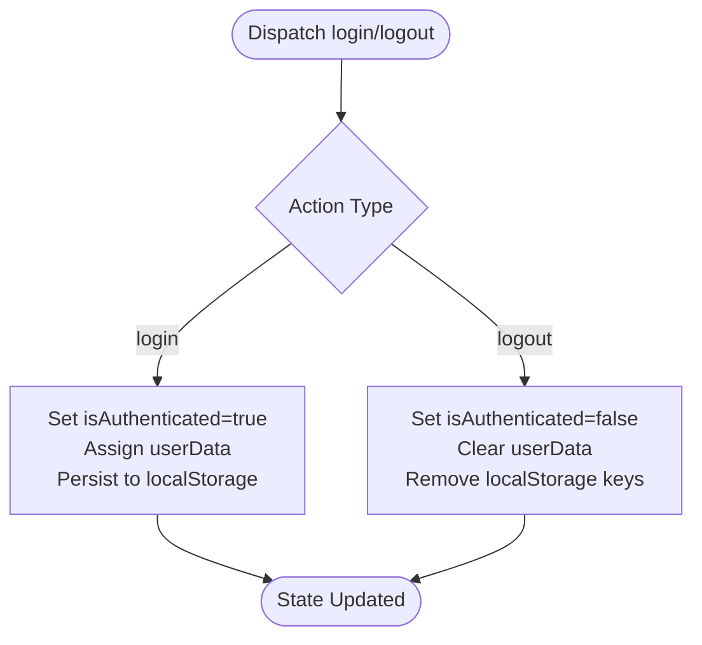
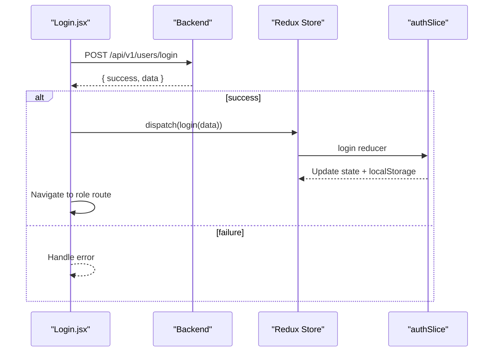
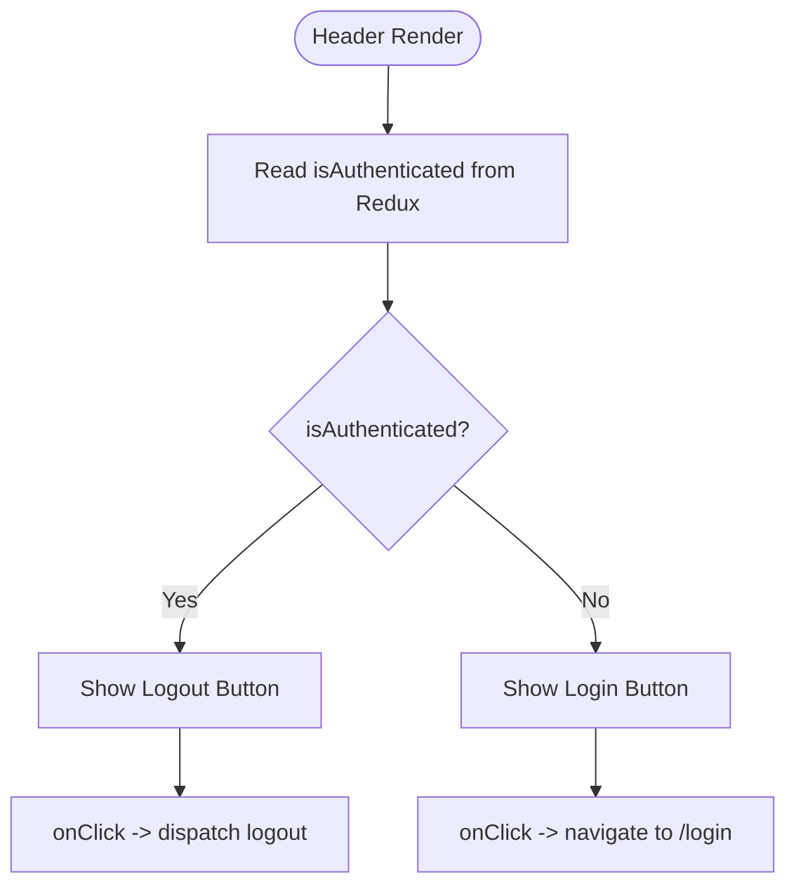
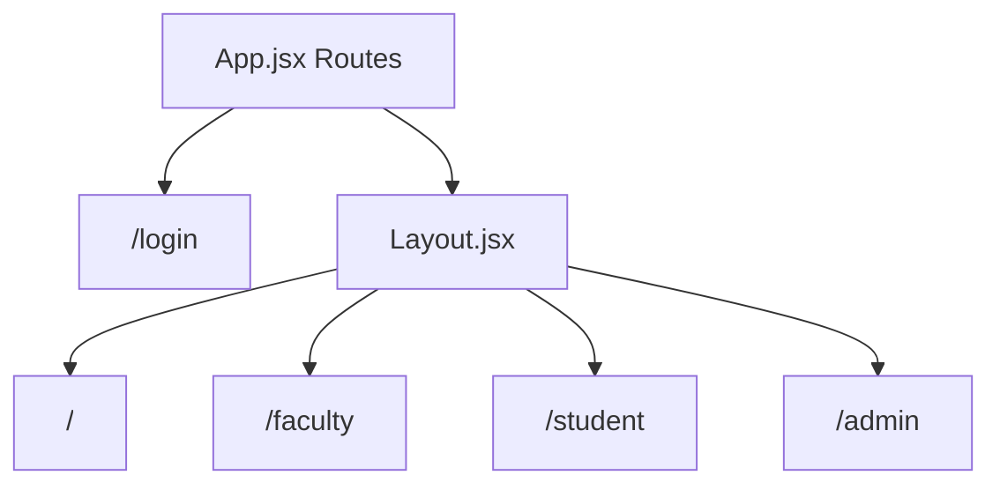
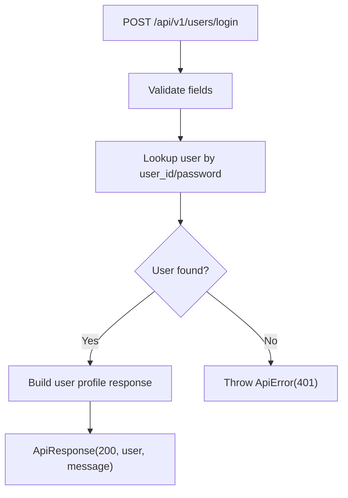
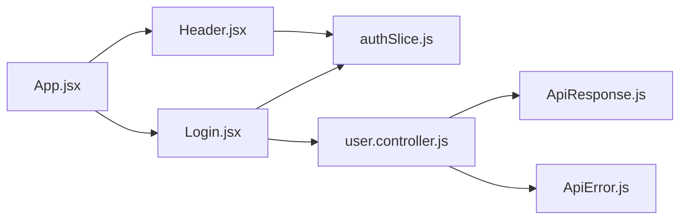

# Authentication Slice

<cite>
**Referenced Files in This Document**
- [authSlice.js](file://Client/src/store/auth/authSlice.js)
- [store.js](file://Client/src/store/store.js)
- [Login.jsx](file://Client/src/pages/Login.jsx)
- [App.jsx](file://Client/src/App.jsx)
- [Header.jsx](file://Client/src/components/Header.jsx)
- [Layout.jsx](file://Client/src/components/Layout.jsx)
- [user.controller.js](file://Backend/src/controllers/user.controller.js)
- [ApiResponse.js](file://Backend/src/utils/ApiResponse.js)
- [ApiError.js](file://Backend/src/utils/ApiError.js)
</cite>

## Table of Contents
1. [Introduction](#introduction)
2. [Project Structure](#project-structure)
3. [Core Components](#core-components)
4. [Architecture Overview](#architecture-overview)
5. [Detailed Component Analysis](#detailed-component-analysis)
6. [Dependency Analysis](#dependency-analysis)
7. [Performance Considerations](#performance-considerations)
8. [Troubleshooting Guide](#troubleshooting-guide)
9. [Conclusion](#conclusion)
10. [Appendices](#appendices)

## Introduction
This document explains the authentication slice implementation in the client-side React application. It covers the Redux slice structure, action creators, state shape, login/logout flows, and integration with the backend authentication controller. It also documents selectors, JWT token handling considerations, session management, security best practices, and protected route handling.

## Project Structure
The authentication logic is implemented in the Redux store under the auth slice and is consumed by UI components and pages. The backend provides a user login endpoint that returns a structured response used by the frontend to populate authentication state.

**Diagram sources**
- [authSlice.js:1-32](file://Client/src/store/auth/authSlice.js#L1-L32)
- [store.js:1-15](file://Client/src/store/store.js#L1-L15)
- [Login.jsx:1-116](file://Client/src/pages/Login.jsx#L1-L116)
- [Header.jsx:1-122](file://Client/src/components/Header.jsx#L1-L122)
- [Layout.jsx:1-22](file://Client/src/components/Layout.jsx#L1-L22)
- [App.jsx:1-41](file://Client/src/App.jsx#L1-L41)
- [user.controller.js:280-355](file://Backend/src/controllers/user.controller.js#L280-L355)
- [ApiResponse.js:1-10](file://Backend/src/utils/ApiResponse.js#L1-L10)
- [ApiError.js:1-21](file://Backend/src/utils/ApiError.js#L1-L21)

**Section sources**
- [authSlice.js:1-32](file://Client/src/store/auth/authSlice.js#L1-L32)
- [store.js:1-15](file://Client/src/store/store.js#L1-L15)
- [Login.jsx:1-116](file://Client/src/pages/Login.jsx#L1-L116)
- [Header.jsx:1-122](file://Client/src/components/Header.jsx#L1-L122)
- [Layout.jsx:1-22](file://Client/src/components/Layout.jsx#L1-L22)
- [App.jsx:1-41](file://Client/src/App.jsx#L1-L41)
- [user.controller.js:280-355](file://Backend/src/controllers/user.controller.js#L280-L355)
- [ApiResponse.js:1-10](file://Backend/src/utils/ApiResponse.js#L1-L10)
- [ApiError.js:1-21](file://Backend/src/utils/ApiError.js#L1-L21)

## Core Components
- Authentication slice reducer and actions:
  - Reducer initializes state from localStorage and exposes login and logout actions.
  - Actions persist authentication state to localStorage for persistence across page reloads.
- Root store configuration wires the auth reducer into the Redux store.
- UI integration:
  - Login page triggers authentication flow and dispatches login action upon successful API response.
  - Header reads authentication state to show Login or Logout and dispatches logout action.
  - Protected layout renders child routes under a layout wrapper.

Key implementation references:
- [authSlice.js:3-8](file://Client/src/store/auth/authSlice.js#L3-L8) — Initial state hydration from localStorage
- [authSlice.js:14-25](file://Client/src/store/auth/authSlice.js#L14-L25) — login and logout reducers
- [store.js:7-14](file://Client/src/store/store.js#L7-L14) — Store wiring
- [Login.jsx:15-44](file://Client/src/pages/Login.jsx#L15-L44) — Login handler and dispatch
- [Header.jsx:12-18](file://Client/src/components/Header.jsx#L12-L18) — Logout handler and selector usage

**Section sources**
- [authSlice.js:1-32](file://Client/src/store/auth/authSlice.js#L1-L32)
- [store.js:1-15](file://Client/src/store/store.js#L1-L15)
- [Login.jsx:1-116](file://Client/src/pages/Login.jsx#L1-L116)
- [Header.jsx:1-122](file://Client/src/components/Header.jsx#L1-L122)

## Architecture Overview
The authentication flow connects the frontend UI to the backend login endpoint. On successful login, the frontend updates Redux state and persists it to localStorage. The header uses this state to conditionally render Login or Logout.

**Diagram sources**
- [Login.jsx:15-44](file://Client/src/pages/Login.jsx#L15-L44)
- [user.controller.js:280-355](file://Backend/src/controllers/user.controller.js#L280-L355)
- [authSlice.js:14-25](file://Client/src/store/auth/authSlice.js#L14-L25)

## Detailed Component Analysis

### Authentication Slice: State Shape and Reducers
- State shape:
  - isAuthenticated: boolean indicating login status
  - userData: object containing user profile data or null
- Initialization:
  - Reads persisted values from localStorage on startup
- Reducers:
  - login: sets isAuthenticated to true, assigns userData payload, persists to localStorage
  - logout: clears authentication state and removes persisted keys

**Diagram sources**
- [authSlice.js:3-8](file://Client/src/store/auth/authSlice.js#L3-L8)
- [authSlice.js:14-25](file://Client/src/store/auth/authSlice.js#L14-L25)

**Section sources**
- [authSlice.js:1-32](file://Client/src/store/auth/authSlice.js#L1-L32)

### Login Page: Async Authentication Flow
- Collects form data and posts to the backend login endpoint.
- On success, navigates to a role-based route and dispatches login action to update Redux state and localStorage.
- Uses selectors to access theme state for UI toggling.

**Diagram sources**
- [Login.jsx:15-44](file://Client/src/pages/Login.jsx#L15-L44)
- [user.controller.js:280-355](file://Backend/src/controllers/user.controller.js#L280-L355)
- [authSlice.js:14-25](file://Client/src/store/auth/authSlice.js#L14-L25)

**Section sources**
- [Login.jsx:1-116](file://Client/src/pages/Login.jsx#L1-L116)
- [user.controller.js:280-355](file://Backend/src/controllers/user.controller.js#L280-L355)

### Header: Authentication State Consumption
- Uses selectors to read isAuthenticated and theme.
- Provides conditional navigation and logout handler that dispatches logout action.

**Diagram sources**
- [Header.jsx:12-18](file://Client/src/components/Header.jsx#L12-L18)
- [authSlice.js:20-25](file://Client/src/store/auth/authSlice.js#L20-L25)

**Section sources**
- [Header.jsx:1-122](file://Client/src/components/Header.jsx#L1-L122)

### Protected Routes and Layout
- App defines routes including Login and protected routes under Layout.
- Layout renders child routes and uses theme state for styling.
- Authentication state is used in Header to decide navigation.

**Diagram sources**
- [App.jsx:27-36](file://Client/src/App.jsx#L27-L36)
- [Layout.jsx:10-19](file://Client/src/components/Layout.jsx#L10-L19)

**Section sources**
- [App.jsx:1-41](file://Client/src/App.jsx#L1-L41)
- [Layout.jsx:1-22](file://Client/src/components/Layout.jsx#L1-L22)

### Backend Authentication Controller
- userLogin endpoint validates credentials and returns a structured response.
- Uses ApiResponse wrapper to standardize success flag and data payload.
- Throws ApiError on invalid credentials.

**Diagram sources**
- [user.controller.js:280-355](file://Backend/src/controllers/user.controller.js#L280-L355)
- [ApiResponse.js:1-10](file://Backend/src/utils/ApiResponse.js#L1-L10)
- [ApiError.js:1-21](file://Backend/src/utils/ApiError.js#L1-L21)

**Section sources**
- [user.controller.js:280-355](file://Backend/src/controllers/user.controller.js#L280-L355)
- [ApiResponse.js:1-10](file://Backend/src/utils/ApiResponse.js#L1-L10)
- [ApiError.js:1-21](file://Backend/src/utils/ApiError.js#L1-L21)

## Dependency Analysis
- authSlice depends on Redux Toolkit’s createSlice.
- Login.jsx depends on react-router and react-redux hooks.
- Header.jsx depends on react-router and react-redux hooks.
- App.jsx defines routing and integrates with Layout.
- Backend userLogin depends on ApiResponse and ApiError wrappers.

**Diagram sources**
- [Login.jsx:1-116](file://Client/src/pages/Login.jsx#L1-L116)
- [Header.jsx:1-122](file://Client/src/components/Header.jsx#L1-L122)
- [App.jsx:1-41](file://Client/src/App.jsx#L1-L41)
- [authSlice.js:1-32](file://Client/src/store/auth/authSlice.js#L1-L32)
- [user.controller.js:280-355](file://Backend/src/controllers/user.controller.js#L280-L355)
- [ApiResponse.js:1-10](file://Backend/src/utils/ApiResponse.js#L1-L10)
- [ApiError.js:1-21](file://Backend/src/utils/ApiError.js#L1-L21)

**Section sources**
- [Login.jsx:1-116](file://Client/src/pages/Login.jsx#L1-L116)
- [Header.jsx:1-122](file://Client/src/components/Header.jsx#L1-L122)
- [App.jsx:1-41](file://Client/src/App.jsx#L1-L41)
- [authSlice.js:1-32](file://Client/src/store/auth/authSlice.js#L1-L32)
- [user.controller.js:280-355](file://Backend/src/controllers/user.controller.js#L280-L355)
- [ApiResponse.js:1-10](file://Backend/src/utils/ApiResponse.js#L1-L10)
- [ApiError.js:1-21](file://Backend/src/utils/ApiError.js#L1-L21)

## Performance Considerations
- LocalStorage usage for persistence is synchronous and can block the UI thread on large payloads. Keep userData minimal.
- Avoid frequent re-renders by selecting only necessary parts of the auth state in components.
- Consider debouncing or caching repeated login attempts to reduce network overhead.

## Troubleshooting Guide
Common issues and resolutions:
- Login succeeds but UI does not reflect authentication:
  - Verify that login action is dispatched with the correct payload and that the reducer updates state and localStorage.
  - Confirm that Header reads isAuthenticated from Redux and that navigation occurs after dispatch.
- Role-based routing not triggered:
  - Ensure the backend response includes a role field and that the login handler checks and navigates accordingly.
- Logout does not clear state:
  - Confirm that logout reducer clears state and removes localStorage entries.
- Backend error handling:
  - The backend throws ApiError on invalid credentials; ensure the frontend handles non-success responses appropriately.

**Section sources**
- [authSlice.js:14-25](file://Client/src/store/auth/authSlice.js#L14-L25)
- [Login.jsx:37-44](file://Client/src/pages/Login.jsx#L37-L44)
- [Header.jsx:14-18](file://Client/src/components/Header.jsx#L14-L18)
- [user.controller.js:348-350](file://Backend/src/controllers/user.controller.js#L348-L350)
- [ApiError.js:1-21](file://Backend/src/utils/ApiError.js#L1-L21)

## Conclusion
The authentication slice provides a straightforward, localStorage-backed mechanism for managing user login state. The Login page coordinates with the backend userLogin endpoint and updates Redux state accordingly. The Header consumes authentication state to enable navigation and logout. While the current implementation focuses on state persistence and basic UI integration, extending it to handle JWT tokens and secure cookies would improve security posture and align with modern authentication patterns.

## Appendices

### Authentication State Shape
- isAuthenticated: boolean
- userData: object or null

**Section sources**
- [authSlice.js:3-8](file://Client/src/store/auth/authSlice.js#L3-L8)

### Action Creators
- login(payload): sets authenticated state and persists user data
- logout(): clears authentication state and localStorage

**Section sources**
- [authSlice.js:29-31](file://Client/src/store/auth/authSlice.js#L29-L31)
- [authSlice.js:14-25](file://Client/src/store/auth/authSlice.js#L14-L25)

### Selectors
- useSelector(state => state.auth.isAuthenticated)
- useSelector(state => state.auth.userData)

**Section sources**
- [Header.jsx:12](file://Client/src/components/Header.jsx#L12)
- [Login.jsx:11](file://Client/src/pages/Login.jsx#L11)

### JWT Token Handling and Security Considerations
- Current implementation stores user data in localStorage; it does not manage JWT tokens.
- Recommendations:
  - Store JWT tokens in httpOnly cookies to mitigate XSS risks.
  - Implement token refresh mechanisms and expiration handling.
  - Enforce CSRF protection for cookie-based sessions.
  - Sanitize and validate all incoming data on the backend.
  - Use HTTPS and secure headers to protect tokens.

[No sources needed since this section provides general guidance]