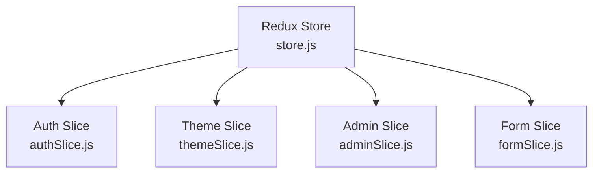
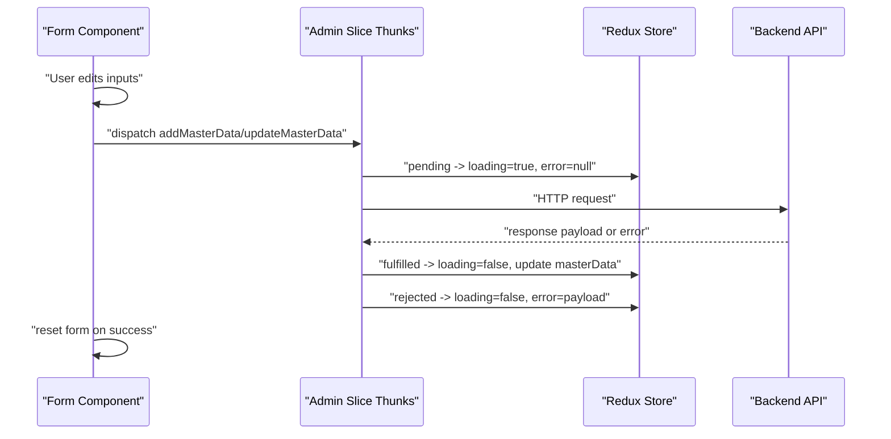
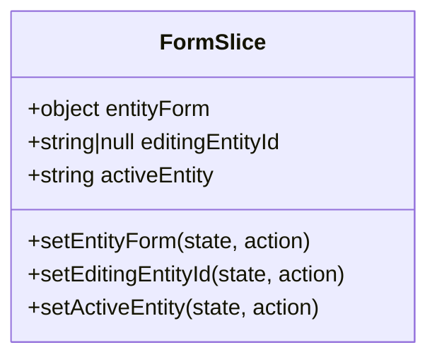
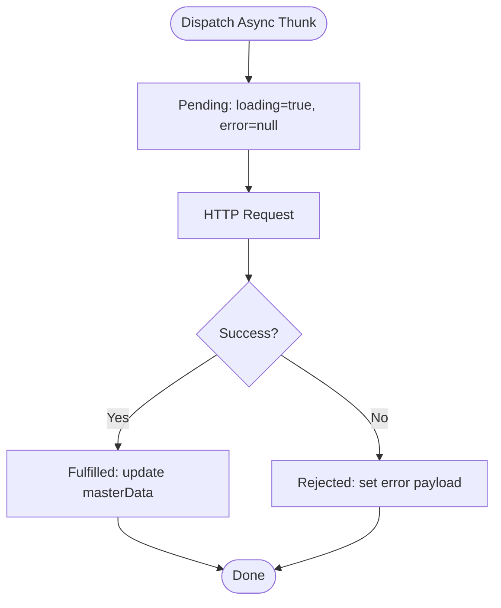
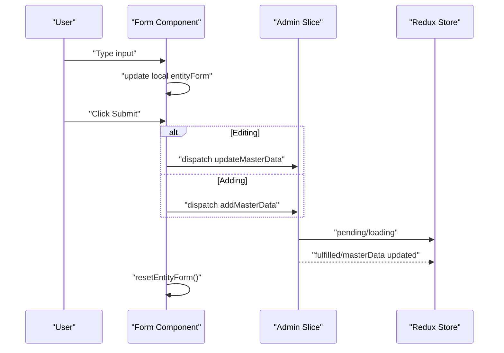
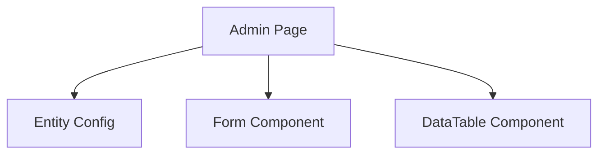
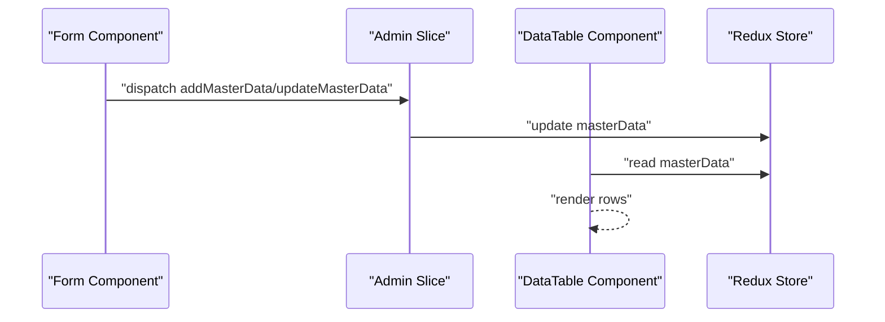
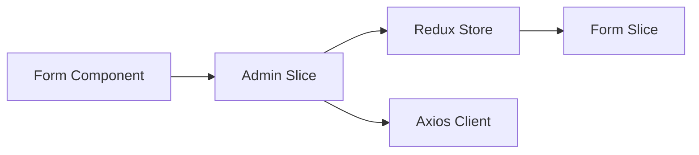

# Form State Slice

<cite>
**Referenced Files in This Document**
- [formSlice.js](file://Client/src/store/formSlice.js)
- [store.js](file://Client/src/store/store.js)
- [adminSlice.js](file://Client/src/store/admin/adminSlice.js)
- [Form.jsx](file://Client/src/components/deshboard/Form.jsx)
- [Admin.jsx](file://Client/src/pages/dashboard/Admin.jsx)
- [DataTable.jsx](file://Client/src/components/deshboard/DataTable.jsx)
- [authSlice.js](file://Client/src/store/auth/authSlice.js)
- [themeSlice.js](file://Client/src/store/theme/themeSlice.js)
</cite>

## Table of Contents
1. [Introduction](#introduction)
2. [Project Structure](#project-structure)
3. [Core Components](#core-components)
4. [Architecture Overview](#architecture-overview)
5. [Detailed Component Analysis](#detailed-component-analysis)
6. [Dependency Analysis](#dependency-analysis)
7. [Performance Considerations](#performance-considerations)
8. [Troubleshooting Guide](#troubleshooting-guide)
9. [Conclusion](#conclusion)
10. [Appendices](#appendices)

## Introduction
This document explains the form state slice and its integration with the broader application. It focuses on how form data and validation states are managed, how reducers handle form inputs and submission states, and how async thunks manage loading and error propagation. It also covers reset mechanisms, default value handling, controlled component integration, and practical usage patterns in React components.

The current implementation centers around a dedicated form slice for managing entity forms and editing state, and integrates tightly with an admin slice that handles CRUD operations via async thunks. Validation and error messaging are handled at the admin slice level, while the form slice provides a lightweight bridge for form-level state.

## Project Structure
The form state is part of a Redux Toolkit store that includes slices for authentication, theme, admin, and form. The form slice is minimal and complements the admin slice’s async operations.

**Diagram sources**
- [store.js:1-15](file://Client/src/store/store.js#L1-L15)
- [authSlice.js:1-32](file://Client/src/store/auth/authSlice.js#L1-L32)
- [themeSlice.js:1-29](file://Client/src/store/theme/themeSlice.js#L1-L29)
- [adminSlice.js:1-173](file://Client/src/store/admin/adminSlice.js#L1-L173)
- [formSlice.js:1-24](file://Client/src/store/formSlice.js#L1-L24)

**Section sources**
- [store.js:1-15](file://Client/src/store/store.js#L1-L15)
- [formSlice.js:1-24](file://Client/src/store/formSlice.js#L1-L24)

## Core Components
- Form Slice: Manages form-level state including entityForm, editingEntityId, and activeEntity.
- Admin Slice: Manages master data, loading, error, and editing state; exposes async thunks for add/update/delete operations.
- Form Component: Controlled component that binds inputs to local state and dispatches actions to the admin slice.
- DataTable Component: Displays existing records and triggers edit/delete actions.

Key responsibilities:
- Form Slice: Provides reducers to set form data and editing state; intended to coordinate with admin slice for persistence.
- Admin Slice: Centralizes CRUD operations with async thunks, loading/error states, and updates to master data.
- Form Component: Handles user input, submit logic, and reset/cancel actions; integrates with admin slice for persistence.

**Section sources**
- [formSlice.js:3-21](file://Client/src/store/formSlice.js#L3-L21)
- [adminSlice.js:88-173](file://Client/src/store/admin/adminSlice.js#L88-L173)
- [Form.jsx:5-50](file://Client/src/components/deshboard/Form.jsx#L5-L50)
- [DataTable.jsx:5-18](file://Client/src/components/deshboard/DataTable.jsx#L5-L18)

## Architecture Overview
The form state architecture separates concerns:
- Controlled form inputs update local state in the Form component.
- Submit triggers async thunks in the admin slice.
- Async thunks update the Redux store with loading/error states and master data.
- The form slice remains a lightweight coordinator for form-level state.

**Diagram sources**
- [Form.jsx:37-50](file://Client/src/components/deshboard/Form.jsx#L37-L50)
- [adminSlice.js:24-78](file://Client/src/store/admin/adminSlice.js#L24-L78)
- [adminSlice.js:104-168](file://Client/src/store/admin/adminSlice.js#L104-L168)

## Detailed Component Analysis

### Form Slice
The form slice defines a minimal state shape and reducers for form-level coordination:
- entityForm: Current form data snapshot.
- editingEntityId: ID of the entity being edited.
- activeEntity: Currently selected entity type.

Reducers:
- setEntityForm: Replaces the current form data.
- setEditingEntityId: Sets the editing target.
- setActiveEntity: Switches the active entity.

**Diagram sources**
- [formSlice.js:3-21](file://Client/src/store/formSlice.js#L3-L21)

**Section sources**
- [formSlice.js:3-21](file://Client/src/store/formSlice.js#L3-L21)

### Admin Slice (Async Thunks and Reducers)
The admin slice manages:
- State: masterData, activeEntity, editingEntityId, loading, error.
- Async Thunks: fetchMasterData, addMasterData, updateMasterData, deleteMasterData.
- Reducers: setActiveEntity, setEditingEntityId, clearError.

Async thunk lifecycle:
- Pending: sets loading=true and clears error.
- Fulfilled: updates masterData for the given entity key.
- Rejected: sets loading=false and stores error payload.

**Diagram sources**
- [adminSlice.js:104-168](file://Client/src/store/admin/adminSlice.js#L104-L168)

**Section sources**
- [adminSlice.js:80-173](file://Client/src/store/admin/adminSlice.js#L80-L173)

### Form Component (Controlled Inputs and Submission)
The Form component:
- Maintains local state for entityForm.
- Synchronizes with admin editing state to prefill edit mode.
- Updates entityForm on input change.
- Submits via addMasterData or updateMasterData depending on editingEntityId.
- Resets form and clears error on success.

**Diagram sources**
- [Form.jsx:12-21](file://Client/src/components/deshboard/Form.jsx#L12-L21)
- [Form.jsx:23-29](file://Client/src/components/deshboard/Form.jsx#L23-L29)
- [Form.jsx:37-50](file://Client/src/components/deshboard/Form.jsx#L37-L50)
- [adminSlice.js:38-78](file://Client/src/store/admin/adminSlice.js#L38-L78)

**Section sources**
- [Form.jsx:5-50](file://Client/src/components/deshboard/Form.jsx#L5-L50)

### Admin Page Integration
The Admin page:
- Defines entity configurations with field metadata.
- Uses the Form component to render dynamic forms.
- Uses the DataTable component to display and edit records.
- Dispatches fetchMasterData on mount and when switching entities.

**Diagram sources**
- [Admin.jsx:52-406](file://Client/src/pages/dashboard/Admin.jsx#L52-L406)
- [Admin.jsx:534-547](file://Client/src/pages/dashboard/Admin.jsx#L534-L547)

**Section sources**
- [Admin.jsx:17-617](file://Client/src/pages/dashboard/Admin.jsx#L17-L617)

### Data Flow Between Components
- Form component controls local entityForm and dispatches admin async thunks.
- Admin slice updates global state with loading/error and masterData.
- DataTable reads masterData and triggers edit/delete actions.

**Diagram sources**
- [Form.jsx:37-50](file://Client/src/components/deshboard/Form.jsx#L37-L50)
- [adminSlice.js:104-168](file://Client/src/store/admin/adminSlice.js#L104-L168)
- [DataTable.jsx:5-18](file://Client/src/components/deshboard/DataTable.jsx#L5-L18)

**Section sources**
- [DataTable.jsx:5-86](file://Client/src/components/deshboard/DataTable.jsx#L5-L86)

## Dependency Analysis
- Form component depends on admin slice for async operations and editing state.
- Admin slice depends on axios client and backend endpoints.
- Store composes all slices, including form and admin.

**Diagram sources**
- [Form.jsx:3-3](file://Client/src/components/deshboard/Form.jsx#L3-L3)
- [adminSlice.js:19-22](file://Client/src/store/admin/adminSlice.js#L19-L22)
- [store.js:7-14](file://Client/src/store/store.js#L7-L14)
- [formSlice.js:1-1](file://Client/src/store/formSlice.js#L1-L1)

**Section sources**
- [store.js:1-15](file://Client/src/store/store.js#L1-L15)
- [adminSlice.js:1-173](file://Client/src/store/admin/adminSlice.js#L1-L173)

## Performance Considerations
- Local form state minimizes unnecessary re-renders until submit.
- Async thunks batch updates to the store, reducing intermediate renders.
- Avoid deep cloning of large objects in reducers; keep entityForm flat where possible.
- Debounce auto-save if implemented later to reduce network requests.

## Troubleshooting Guide
Common issues and resolutions:
- Form not resetting after submit:
  - Ensure resetEntityForm is called after unwrap success.
  - Verify setEditingEntityId is dispatched to null.
- Edit mode not prefilling:
  - Confirm masterData[activeEntity] exists and contains the entity.
  - Ensure editingEntityId matches _id or id.
- Async thunk errors not displayed:
  - Check rejected branch sets error payload.
  - Ensure error is rendered in Admin page UI.
- Checkbox values not updating:
  - Verify handleEntityInputChange checks type and uses checked.

**Section sources**
- [Form.jsx:31-35](file://Client/src/components/deshboard/Form.jsx#L31-L35)
- [Form.jsx:12-21](file://Client/src/components/deshboard/Form.jsx#L12-L21)
- [adminSlice.js:149-152](file://Client/src/store/admin/adminSlice.js#L149-L152)
- [DataTable.jsx:10-18](file://Client/src/components/deshboard/DataTable.jsx#L10-L18)

## Conclusion
The form state slice provides a focused layer for coordinating form-level state alongside the admin slice’s robust async operations. Together, they enable controlled form inputs, seamless CRUD workflows, and clear error handling. Extending the system with built-in validation and persisted form snapshots would further enhance reliability and user experience.

## Appendices

### Form State Structure
- entityForm: Object representing current form values.
- editingEntityId: Identifier for the entity being edited.
- activeEntity: String indicating the current entity type.

**Section sources**
- [formSlice.js:5-9](file://Client/src/store/formSlice.js#L5-L9)

### Async Thunks and Loading/Error Propagation
- Pending: loading=true, error=null.
- Fulfilled: update masterData for the entity key.
- Rejected: loading=false, error=payload.

**Section sources**
- [adminSlice.js:104-168](file://Client/src/store/admin/adminSlice.js#L104-L168)

### Controlled Component Integration
- Local state entityForm mirrors form inputs.
- handleEntityInputChange updates entityForm on change.
- Form submits via addMasterData or updateMasterData.

**Section sources**
- [Form.jsx:10](file://Client/src/components/deshboard/Form.jsx#L10)
- [Form.jsx:23-29](file://Client/src/components/deshboard/Form.jsx#L23-L29)
- [Form.jsx:37-50](file://Client/src/components/deshboard/Form.jsx#L37-L50)

### Reset Mechanisms and Defaults
- resetEntityForm clears local form state, resets editingEntityId, and clears error.
- Default value handling relies on initial empty object for entityForm.

**Section sources**
- [Form.jsx:31-35](file://Client/src/components/deshboard/Form.jsx#L31-L35)

### Multi-Step Forms
- Not currently implemented in the codebase.
- Recommended approach: Split entityForm into steps and persist each step in Redux or local storage.

[No sources needed since this section provides general guidance]

### Validation Patterns and Error Messaging
- Validation is not implemented in the current codebase.
- Recommended approach: Add Yup/Zod schema, validate on submit, and surface errors via Redux state.

[No sources needed since this section provides general guidance]

### Persistence and Auto-Save
- Not implemented in the current codebase.
- Recommended approach: Persist entityForm periodically and merge with backend on submit.

[No sources needed since this section provides general guidance]

### Best Practices for Form Handling
- Keep entityForm flat and normalized.
- Use async thunks for side effects and centralize error handling.
- Provide clear user feedback for loading and error states.
- Reset form state after successful submit.

[No sources needed since this section provides general guidance]