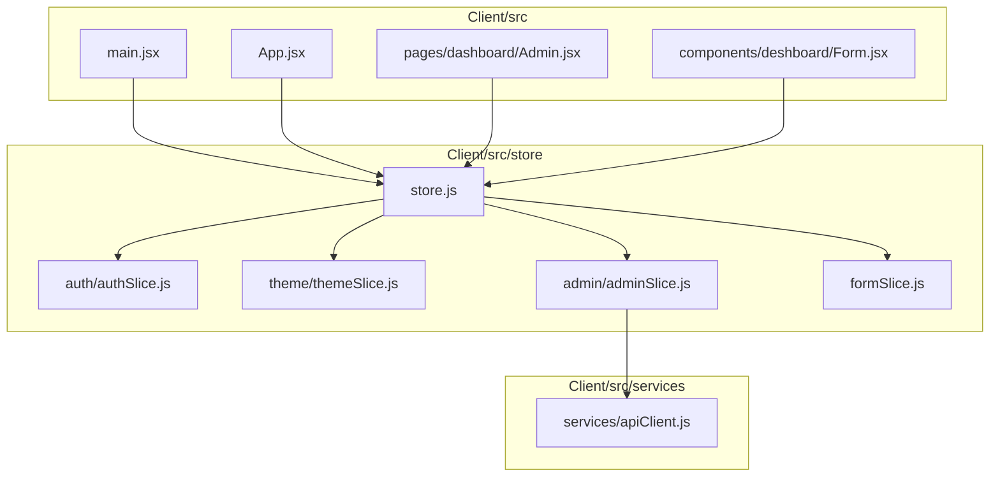
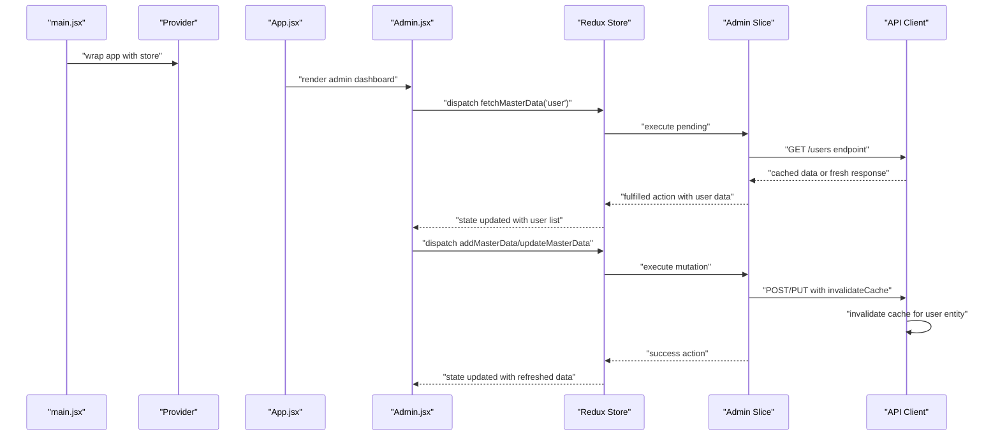
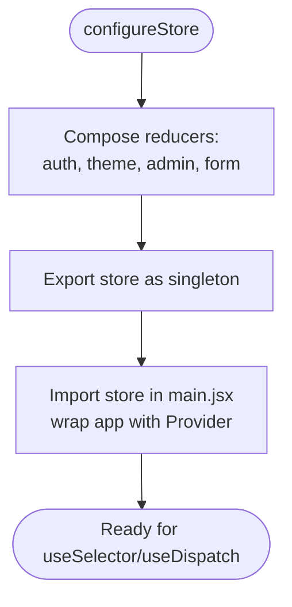
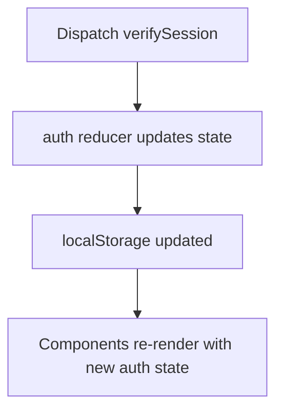
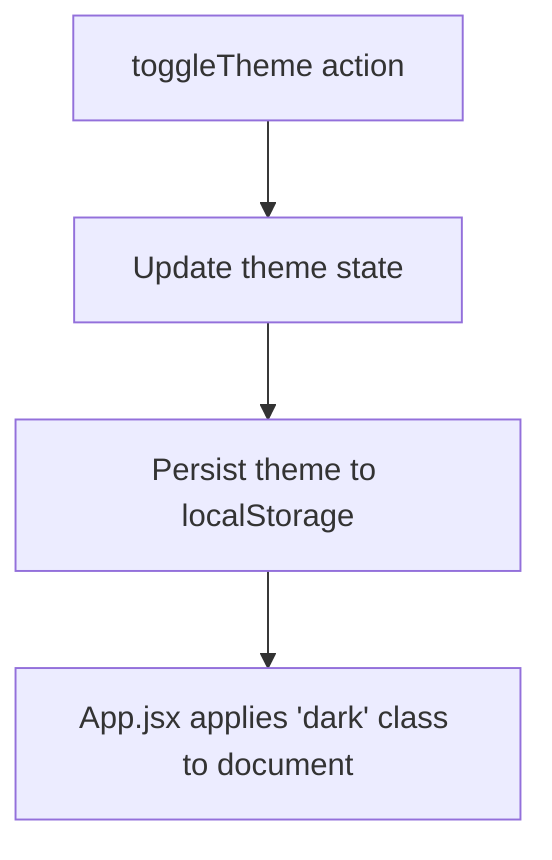
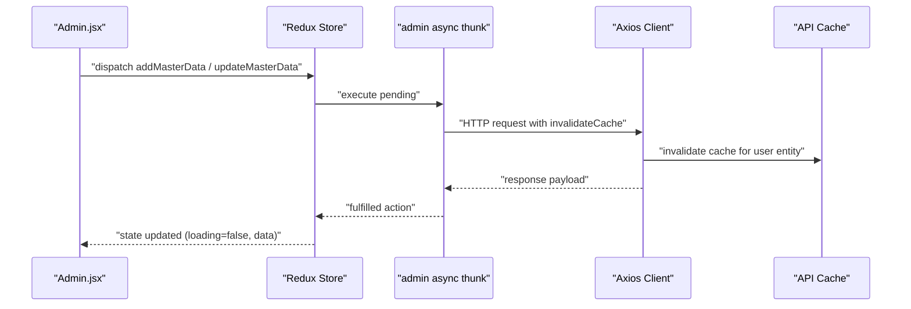
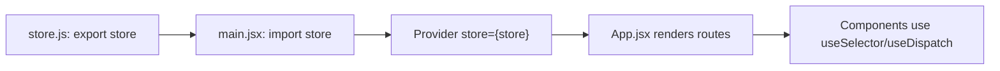
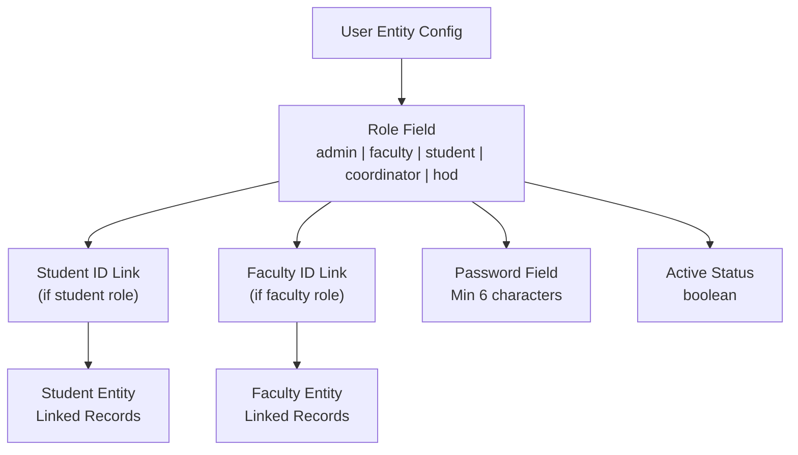
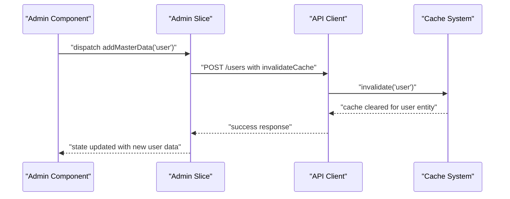
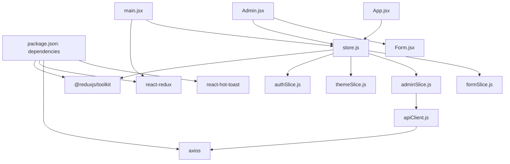

# Redux Store Configuration

<cite>
**Referenced Files in This Document**
- [store.js](file://Client/src/store/store.js)
- [authSlice.js](file://Client/src/store/auth/authSlice.js)
- [themeSlice.js](file://Client/src/store/theme/themeSlice.js)
- [adminSlice.js](file://Client/src/store/admin/adminSlice.js)
- [formSlice.js](file://Client/src/store/formSlice.js)
- [main.jsx](file://Client/src/main.jsx)
- [App.jsx](file://Client/src/App.jsx)
- [Admin.jsx](file://Client/src/pages/dashboard/Admin.jsx)
- [Form.jsx](file://Client/src/components/deshboard/Form.jsx)
- [apiClient.js](file://Client/src/services/apiClient.js)
- [package.json](file://Client/package.json)
</cite>

## Update Summary
**Changes Made**
- Added comprehensive documentation for user management functionality in the admin dashboard
- Updated admin slice documentation to reflect user entity endpoints and cache invalidation mechanisms
- Enhanced store architecture overview to include user data synchronization
- Added new sections covering user entity CRUD operations and cache management
- Updated troubleshooting guide with user-specific scenarios

## Table of Contents
1. [Introduction](#introduction)
2. [Project Structure](#project-structure)
3. [Core Components](#core-components)
4. [Architecture Overview](#architecture-overview)
5. [Detailed Component Analysis](#detailed-component-analysis)
6. [User Management System](#user-management-system)
7. [Cache Invalidation Mechanisms](#cache-invalidation-mechanisms)
8. [Dependency Analysis](#dependency-analysis)
9. [Performance Considerations](#performance-considerations)
10. [Troubleshooting Guide](#troubleshooting-guide)
11. [Conclusion](#conclusion)

## Introduction
This document explains the Redux store configuration and setup for the client-side application. It covers the store creation via configureStore, reducer composition, and initialization. It documents the store structure with auth, theme, admin, and form reducers, and details how the store integrates with the React application using Provider. The store now includes comprehensive user management functionality with dedicated user entity endpoints and sophisticated cache invalidation mechanisms for real-time data synchronization. Best practices for middleware setup, development tools integration, performance considerations, debugging setup, and store enhancers are addressed. The relationship between the store configuration and individual slices is explained, along with practical guidance for maintainable Redux usage.

## Project Structure
The Redux store is centralized under Client/src/store. The store composes four domain-specific reducers:
- auth: user authentication state and actions with session verification
- theme: light/dark theme preference
- admin: master data CRUD operations and async flows including user management
- form: form state for dynamic forms

The store is exported as a singleton and consumed by wrapping the React application with Provider in main.jsx. The admin slice now includes comprehensive user management capabilities with dedicated endpoints for user CRUD operations and cache invalidation for real-time data synchronization.

**Diagram sources**
- [store.js:1-15](file://Client/src/store/store.js#L1-L15)
- [authSlice.js:1-61](file://Client/src/store/auth/authSlice.js#L1-L61)
- [themeSlice.js:1-29](file://Client/src/store/theme/themeSlice.js#L1-L29)
- [adminSlice.js:1-192](file://Client/src/store/admin/adminSlice.js#L1-L192)
- [formSlice.js:1-24](file://Client/src/store/formSlice.js#L1-L24)
- [main.jsx:1-18](file://Client/src/main.jsx#L1-L18)
- [App.jsx:1-119](file://Client/src/App.jsx#L1-L119)
- [Admin.jsx:1-956](file://Client/src/pages/dashboard/Admin.jsx#L1-L956)
- [Form.jsx:1-165](file://Client/src/components/deshboard/Form.jsx#L1-L165)
- [apiClient.js:1-213](file://Client/src/services/apiClient.js#L1-L213)

**Section sources**
- [store.js:1-15](file://Client/src/store/store.js#L1-L15)
- [main.jsx:1-18](file://Client/src/main.jsx#L1-L18)

## Core Components
- Store configuration: The store is created with configureStore and composed of four reducers: auth, theme, admin, and form. No middleware or enhancers are configured in the store file.
- Authentication slice: Provides login/logout actions, session verification via `/users/me` endpoint, and persists state to localStorage.
- Theme slice: Manages theme selection with persistence and prefers OS theme by default.
- Admin slice: Implements async CRUD operations via createAsyncThunk for multiple entities including user management with cache invalidation support.
- Form slice: Centralizes form state for dynamic forms and active entity selection.

**Section sources**
- [store.js:7-14](file://Client/src/store/store.js#L7-L14)
- [authSlice.js:12-22](file://Client/src/store/auth/authSlice.js#L12-L22)
- [themeSlice.js:15-28](file://Client/src/store/theme/themeSlice.js#L15-L28)
- [adminSlice.js:21-74](file://Client/src/store/admin/adminSlice.js#L21-L74)
- [formSlice.js:3-24](file://Client/src/store/formSlice.js#L3-L24)

## Architecture Overview
The store is initialized once and exported as a singleton. The React application is wrapped with Provider so components can access state and dispatch actions. Components use useSelector to read slices and useDispatch to trigger actions. Async flows in the admin slice integrate with an API client configured for credentials and include sophisticated cache invalidation mechanisms for real-time data synchronization. The user management system provides comprehensive CRUD operations with automatic cache updates.

**Diagram sources**
- [main.jsx:6-16](file://Client/src/main.jsx#L6-L16)
- [App.jsx:14-24](file://Client/src/App.jsx#L14-L24)
- [Admin.jsx:29-46](file://Client/src/pages/dashboard/Admin.jsx#L29-L46)
- [adminSlice.js:21-74](file://Client/src/store/admin/adminSlice.js#L21-L74)
- [apiClient.js:182-210](file://Client/src/services/apiClient.js#L182-L210)

## Detailed Component Analysis

### Store Composition and Initialization
- configureStore is used to create the store with a reducer map containing auth, theme, admin, and form keys.
- The store is exported as a singleton for global access across the app.
- No middleware or enhancers are configured in the store file.

**Diagram sources**
- [store.js:7-14](file://Client/src/store/store.js#L7-L14)
- [main.jsx:6-7](file://Client/src/main.jsx#L6-L7)

**Section sources**
- [store.js:1-15](file://Client/src/store/store.js#L1-L15)
- [main.jsx:1-18](file://Client/src/main.jsx#L1-L18)

### Authentication Slice
- Purpose: Manage authentication state and persist user data and authentication flag to localStorage.
- Actions: login and logout update state and synchronize localStorage.
- Session Verification: Uses `/users/me` endpoint for automatic session verification on app load.
- Integration: Used by pages and components that require user session awareness.

**Diagram sources**
- [authSlice.js:12-22](file://Client/src/store/auth/authSlice.js#L12-L22)

**Section sources**
- [authSlice.js:12-22](file://Client/src/store/auth/authSlice.js#L12-L22)

### Theme Slice
- Purpose: Track and toggle theme preference with persistence and OS preference fallback.
- Actions: toggleTheme switches between light and dark themes and saves to localStorage.
- Integration: App.jsx reads theme to apply CSS classes to the document element.

**Diagram sources**
- [themeSlice.js:19-22](file://Client/src/store/theme/themeSlice.js#L19-L22)
- [App.jsx:16-24](file://Client/src/App.jsx#L16-L24)

**Section sources**
- [themeSlice.js:15-28](file://Client/src/store/theme/themeSlice.js#L15-L28)
- [App.jsx:14-24](file://Client/src/App.jsx#L14-L24)

### Admin Slice (Enhanced with User Management)
- Purpose: Manage master data CRUD operations for multiple entities including user management via async thunks.
- Async Thunks: fetchMasterData, addMasterData, updateMasterData, deleteMasterData with cache invalidation support.
- State Management: Tracks loading, error, active entity, editing ID, and masterData map keyed by entity.
- User Management: Comprehensive CRUD operations for user entities with role-based access control.
- Cache Invalidation: Automatic cache clearing and refresh mechanisms for real-time data synchronization.
- Integration: Components dispatch thunks and read state to render lists and forms.

**Diagram sources**
- [Admin.jsx:760-762](file://Client/src/pages/dashboard/Admin.jsx#L760-L762)
- [adminSlice.js:35-74](file://Client/src/store/admin/adminSlice.js#L35-L74)
- [adminSlice.js:109-115](file://Client/src/store/admin/adminSlice.js#L109-L115)
- [apiClient.js:182-210](file://Client/src/services/apiClient.js#L182-L210)

**Section sources**
- [adminSlice.js:5-19](file://Client/src/store/admin/adminSlice.js#L5-L19)
- [adminSlice.js:21-74](file://Client/src/store/admin/adminSlice.js#L21-L74)
- [adminSlice.js:76-192](file://Client/src/store/admin/adminSlice.js#L76-L192)
- [Admin.jsx:694-744](file://Client/src/pages/dashboard/Admin.jsx#L694-L744)

### Form Slice
- Purpose: Centralize form state for dynamic forms, including entityForm, editingEntityId, and activeEntity.
- Integration: Used by form components to manage transient UI state without persisting to localStorage.

**Section sources**
- [formSlice.js:3-24](file://Client/src/store/formSlice.js#L3-L24)

### Store Export Pattern and React Integration
- Export pattern: The store is created once and exported as a named constant for reuse across the app.
- React integration: main.jsx wraps the application with Provider and passes the store instance.
- Consumption: Components import useSelector and useDispatch to connect to the store.

**Diagram sources**
- [store.js:7-14](file://Client/src/store/store.js#L7-L14)
- [main.jsx:6-7](file://Client/src/main.jsx#L6-L7)
- [App.jsx:14-24](file://Client/src/App.jsx#L14-L24)

**Section sources**
- [store.js:7-14](file://Client/src/store/store.js#L7-L14)
- [main.jsx:1-18](file://Client/src/main.jsx#L1-L18)
- [App.jsx:1-119](file://Client/src/App.jsx#L1-L119)

## User Management System

### User Entity Configuration
The admin dashboard now includes comprehensive user management functionality with dedicated entity configuration:

- **User Roles**: Supports multiple roles including admin, faculty, student, coordinator, and hod
- **User Fields**: Comprehensive user profile management with username, user_id, password, role assignment, and role-specific identifiers
- **Role-Based Access Control**: Automatic redirection based on user roles to appropriate dashboards
- **User CRUD Operations**: Full create, read, update, and delete operations for user accounts

### User Management Features
- **Role Assignment**: Users can be assigned specific roles with appropriate permissions
- **Profile Management**: Complete user profile management with validation
- **Account Status**: Active/inactive status control for user accounts
- **Integration with Other Entities**: User accounts linked to faculty or student records when applicable

**Diagram sources**
- [Admin.jsx:694-744](file://Client/src/pages/dashboard/Admin.jsx#L694-L744)

**Section sources**
- [Admin.jsx:694-744](file://Client/src/pages/dashboard/Admin.jsx#L694-L744)
- [adminSlice.js:5-19](file://Client/src/store/admin/adminSlice.js#L5-L19)

## Cache Invalidation Mechanisms

### Cache Management Architecture
The admin slice implements sophisticated cache invalidation mechanisms for real-time data synchronization:

- **Automatic Cache Invalidation**: Cache clearing on successful mutations (POST, PUT, DELETE)
- **Entity-Specific Cache Management**: Targeted cache invalidation for specific entities
- **Cache Statistics**: Built-in cache monitoring and statistics collection
- **Duplicate Request Handling**: Prevention of duplicate requests during cache operations

### Cache Invalidation Flow
When user data is modified, the system automatically invalidates the cache for the user entity to ensure real-time data synchronization across all components:

**Diagram sources**
- [adminSlice.js:35-74](file://Client/src/store/admin/adminSlice.js#L35-L74)
- [apiClient.js:182-210](file://Client/src/services/apiClient.js#L182-L210)
- [apiClient.js:155-180](file://Client/src/services/apiClient.js#L155-L180)

**Section sources**
- [adminSlice.js:99-115](file://Client/src/store/admin/adminSlice.js#L99-L115)
- [apiClient.js:155-180](file://Client/src/services/apiClient.js#L155-L180)
- [apiClient.js:182-210](file://Client/src/services/apiClient.js#L182-L210)

## Dependency Analysis
- Internal dependencies:
  - store.js depends on each slice's reducer export.
  - main.jsx depends on store.js and react-redux Provider.
  - App.jsx and Admin.jsx depend on the store for state and actions.
  - Admin.jsx depends on Form.jsx for user management interface.
  - adminSlice.js depends on apiClient.js for HTTP operations.
- External dependencies:
  - @reduxjs/toolkit for configureStore and createSlice/createAsyncThunk.
  - react-redux for Provider and hooks.
  - axios for admin async thunks with custom cache management.
  - react-hot-toast for user feedback notifications.

**Diagram sources**
- [package.json:12-22](file://Client/package.json#L12-L22)
- [store.js:1-5](file://Client/src/store/store.js#L1-L5)
- [main.jsx:6-7](file://Client/src/main.jsx#L6-L7)
- [App.jsx:5](file://Client/src/App.jsx#L5)
- [Admin.jsx:1-16](file://Client/src/pages/dashboard/Admin.jsx#L1-L16)
- [Form.jsx:1-4](file://Client/src/components/deshboard/Form.jsx#L1-L4)
- [adminSlice.js:1-4](file://Client/src/store/admin/adminSlice.js#L1-L4)
- [apiClient.js:1-2](file://Client/src/services/apiClient.js#L1-L2)

**Section sources**
- [package.json:12-22](file://Client/package.json#L12-L22)
- [store.js:1-5](file://Client/src/store/store.js#L1-L5)
- [main.jsx:6-7](file://Client/src/main.jsx#L6-L7)
- [App.jsx:5](file://Client/src/App.jsx#L5)
- [Admin.jsx:1-16](file://Client/src/pages/dashboard/Admin.jsx#L1-L16)
- [Form.jsx:1-4](file://Client/src/components/deshboard/Form.jsx#L1-L4)
- [adminSlice.js:1-4](file://Client/src/store/admin/adminSlice.js#L1-L4)
- [apiClient.js:1-2](file://Client/src/services/apiClient.js#L1-L2)

## Performance Considerations
- Keep slices focused: Each slice manages a single domain (auth, theme, admin, form). This improves readability and reduces unnecessary re-renders.
- Normalize async data: The admin slice stores arrays per entity key in masterData. Consider normalizing deeply nested data if lists grow large to minimize object churn.
- Avoid excessive localStorage writes: The auth and theme slices write to localStorage on every change. Batch writes or throttle if frequent toggles occur.
- Memoized selectors: Use memoized selectors (e.g., createSelector) for derived computations to avoid recomputation.
- Minimize deep object mutations: Prefer immutable updates in reducers to prevent accidental shared references.
- Lazy loading and chunking: For large admin lists, consider pagination or virtualization in UI components to reduce rendering overhead.
- Cache optimization: The API client implements intelligent caching with cache invalidation to balance performance and data freshness.
- Network efficiency: Duplicate request prevention and exponential backoff for failed requests improve network efficiency.

## Troubleshooting Guide
- Symptom: Theme not applying on initial load
  - Verify theme slice initializes from localStorage or OS preference and App.jsx applies the 'dark' class accordingly.
  - Check localStorage key for theme and confirm App.jsx effect runs on theme changes.
- Symptom: Admin async operations fail silently
  - Confirm async thunks dispatch pending/fulfilled/rejected actions and that error payloads are handled in components.
  - Ensure API base URL and credentials are correctly configured in the axios client.
- Symptom: Form not resetting after submit
  - Verify dispatch of setEditingEntityId(null) and clearError() after successful unwrap.
- Symptom: Missing Provider in main.jsx
  - Ensure Provider wraps the application and the imported store is passed correctly.
- Symptom: User data not updating after modifications
  - Check that cache invalidation is working correctly for user entity operations.
  - Verify that invalidateCache option is being used in POST/PUT/DELETE requests.
- Symptom: User role assignments not working
  - Ensure user entity configuration includes proper role field definitions.
  - Verify that role-based navigation is functioning correctly in the admin dashboard.
- Symptom: Cache not clearing properly
  - Check cache invalidation logic in admin slice reducers.
  - Verify that apiCache.invalidate is being called with correct entity keys.

**Section sources**
- [themeSlice.js:3-9](file://Client/src/store/theme/themeSlice.js#L3-L9)
- [App.jsx:16-24](file://Client/src/App.jsx#L16-L24)
- [adminSlice.js:109-115](file://Client/src/store/admin/adminSlice.js#L109-L115)
- [Form.jsx:54-58](file://Client/src/components/deshboard/Form.jsx#L54-L58)
- [main.jsx:6-7](file://Client/src/main.jsx#L6-L7)
- [Admin.jsx:694-744](file://Client/src/pages/dashboard/Admin.jsx#L694-L744)
- [apiClient.js:155-180](file://Client/src/services/apiClient.js#L155-L180)

## Conclusion
The Redux store is configured as a minimal, focused setup using configureStore with four domain-specific reducers. The store is exported as a singleton and integrated with the React application via Provider. The auth and theme slices demonstrate persistence and UI synchronization, while the admin slice handles complex async flows with clear loading and error handling. The form slice centralizes transient form state. 

**Updated** The store now includes comprehensive user management functionality with dedicated user entity endpoints and sophisticated cache invalidation mechanisms for real-time data synchronization. The admin slice supports full CRUD operations for user accounts with role-based access control, automatic cache management, and seamless integration with the existing master data management system. For future enhancements, consider adding middleware for async flows, store enhancers for development tools, and memoized selectors for performance. The current structure supports maintainability and scalability across the application with robust user management capabilities.