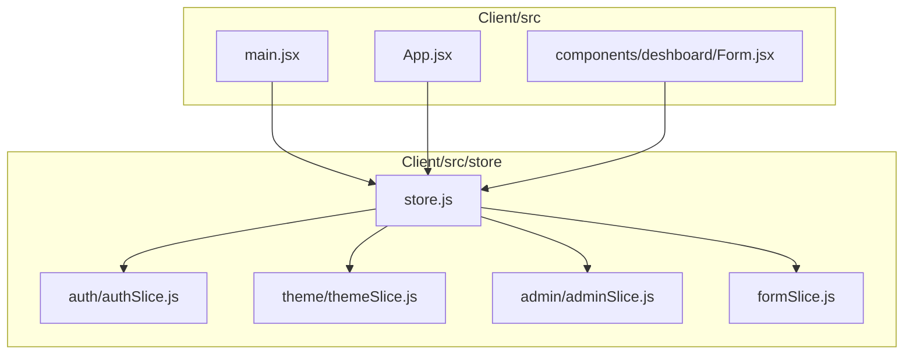
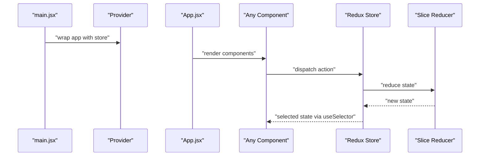
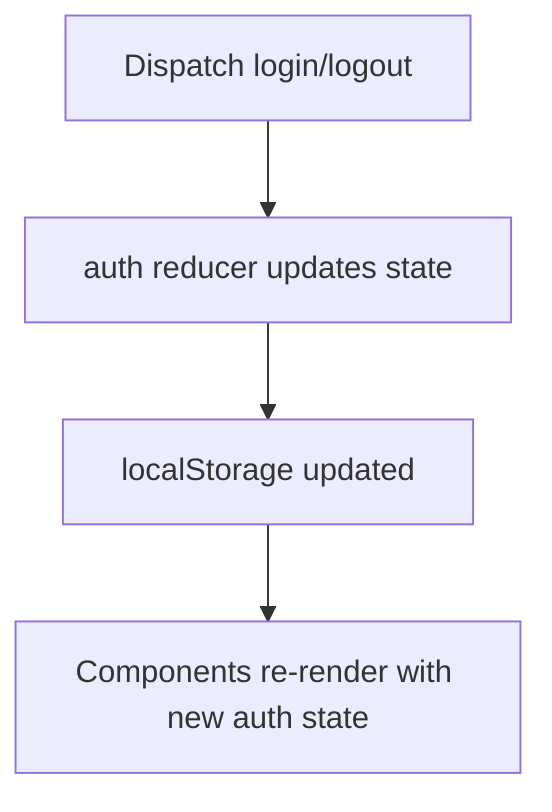
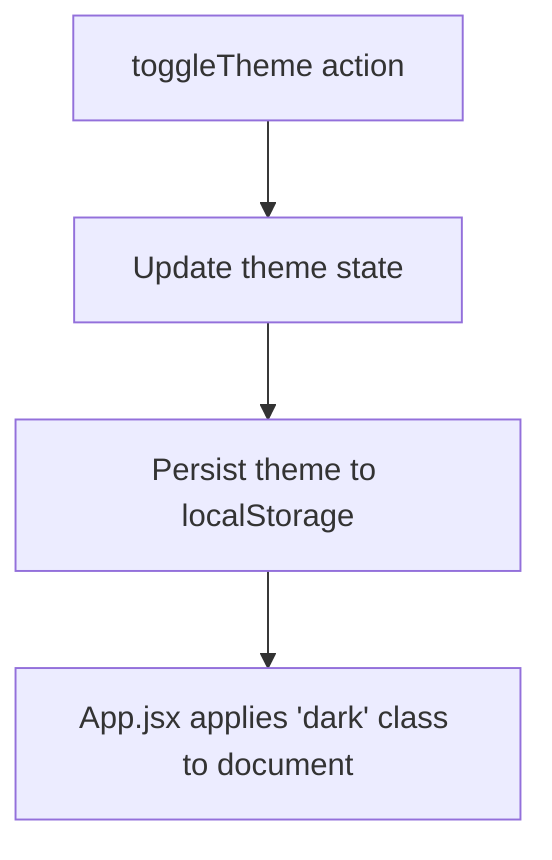
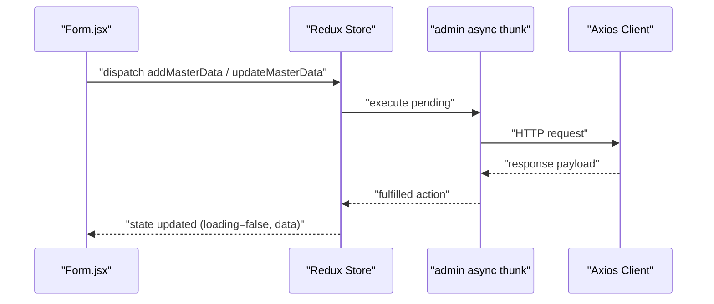
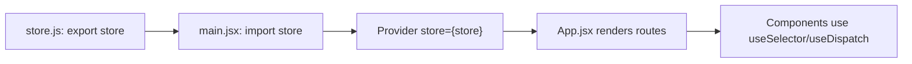
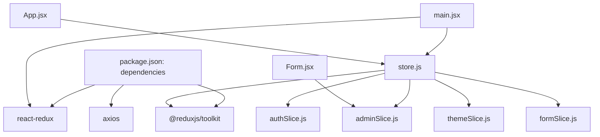

# Redux Store Configuration

<cite>
**Referenced Files in This Document**
- [store.js](file://Client/src/store/store.js)
- [authSlice.js](file://Client/src/store/auth/authSlice.js)
- [themeSlice.js](file://Client/src/store/theme/themeSlice.js)
- [adminSlice.js](file://Client/src/store/admin/adminSlice.js)
- [formSlice.js](file://Client/src/store/formSlice.js)
- [main.jsx](file://Client/src/main.jsx)
- [App.jsx](file://Client/src/App.jsx)
- [Form.jsx](file://Client/src/components/deshboard/Form.jsx)
- [package.json](file://Client/package.json)
</cite>

## Table of Contents
1. [Introduction](#introduction)
2. [Project Structure](#project-structure)
3. [Core Components](#core-components)
4. [Architecture Overview](#architecture-overview)
5. [Detailed Component Analysis](#detailed-component-analysis)
6. [Dependency Analysis](#dependency-analysis)
7. [Performance Considerations](#performance-considerations)
8. [Troubleshooting Guide](#troubleshooting-guide)
9. [Conclusion](#conclusion)

## Introduction
This document explains the Redux store configuration and setup for the client-side application. It covers the store creation via configureStore, reducer composition, and initialization. It documents the store structure with auth, theme, admin, and form reducers, and details how the store integrates with the React application using Provider. Best practices for middleware setup, development tools integration, performance considerations, debugging setup, and store enhancers are addressed. The relationship between the store configuration and individual slices is explained, along with practical guidance for maintainable Redux usage.

## Project Structure
The Redux store is centralized under Client/src/store. The store composes four domain-specific reducers:
- auth: user authentication state and actions
- theme: light/dark theme preference
- admin: master data CRUD operations and async flows
- form: form state for dynamic forms

The store is exported as a singleton and consumed by wrapping the React application with Provider in main.jsx.

**Diagram sources**
- [store.js:1-15](file://Client/src/store/store.js#L1-L15)
- [authSlice.js:1-32](file://Client/src/store/auth/authSlice.js#L1-L32)
- [themeSlice.js:1-29](file://Client/src/store/theme/themeSlice.js#L1-L29)
- [adminSlice.js:1-173](file://Client/src/store/admin/adminSlice.js#L1-L173)
- [formSlice.js:1-24](file://Client/src/store/formSlice.js#L1-L24)
- [main.jsx:1-18](file://Client/src/main.jsx#L1-L18)
- [App.jsx:1-41](file://Client/src/App.jsx#L1-L41)
- [Form.jsx:1-127](file://Client/src/components/deshboard/Form.jsx#L1-L127)

**Section sources**
- [store.js:1-15](file://Client/src/store/store.js#L1-L15)
- [main.jsx:1-18](file://Client/src/main.jsx#L1-L18)

## Core Components
- Store configuration: The store is created with configureStore and composed of four reducers: auth, theme, admin, and form. No middleware or enhancers are configured in the store file.
- Authentication slice: Provides login/logout actions and persists state to localStorage.
- Theme slice: Manages theme selection with persistence and prefers OS theme by default.
- Admin slice: Implements async CRUD operations via createAsyncThunk and manages loading/error states.
- Form slice: Centralizes form state for dynamic forms and active entity selection.

**Section sources**
- [store.js:7-14](file://Client/src/store/store.js#L7-L14)
- [authSlice.js:10-31](file://Client/src/store/auth/authSlice.js#L10-L31)
- [themeSlice.js:15-28](file://Client/src/store/theme/themeSlice.js#L15-L28)
- [adminSlice.js:88-173](file://Client/src/store/admin/adminSlice.js#L88-L173)
- [formSlice.js:3-24](file://Client/src/store/formSlice.js#L3-L24)

## Architecture Overview
The store is initialized once and exported as a singleton. The React application is wrapped with Provider so components can access state and dispatch actions. Components use useSelector to read slices and useDispatch to trigger actions. Async flows in the admin slice integrate with an API client configured for credentials.

**Diagram sources**
- [main.jsx:6-16](file://Client/src/main.jsx#L6-L16)
- [App.jsx:14-24](file://Client/src/App.jsx#L14-L24)
- [store.js:7-14](file://Client/src/store/store.js#L7-L14)

## Detailed Component Analysis

### Store Composition and Initialization
- configureStore is used to create the store with a reducer map containing auth, theme, admin, and form keys.
- The store is exported as a singleton for global access across the app.
- No middleware or enhancers are configured in the store file.

**Diagram sources**
- [store.js:7-14](file://Client/src/store/store.js#L7-L14)
- [main.jsx:6-7](file://Client/src/main.jsx#L6-L7)

**Section sources**
- [store.js:1-15](file://Client/src/store/store.js#L1-L15)
- [main.jsx:1-18](file://Client/src/main.jsx#L1-L18)

### Authentication Slice
- Purpose: Manage authentication state and persist user data and authentication flag to localStorage.
- Actions: login and logout update state and synchronize localStorage.
- Integration: Used by pages and components that require user session awareness.

**Diagram sources**
- [authSlice.js:14-26](file://Client/src/store/auth/authSlice.js#L14-L26)

**Section sources**
- [authSlice.js:10-31](file://Client/src/store/auth/authSlice.js#L10-L31)

### Theme Slice
- Purpose: Track and toggle theme preference with persistence and OS preference fallback.
- Actions: toggleTheme switches between light and dark themes and saves to localStorage.
- Integration: App.jsx reads theme to apply CSS classes to the document element.

**Diagram sources**
- [themeSlice.js:19-22](file://Client/src/store/theme/themeSlice.js#L19-L22)
- [App.jsx:16-24](file://Client/src/App.jsx#L16-L24)

**Section sources**
- [themeSlice.js:15-28](file://Client/src/store/theme/themeSlice.js#L15-L28)
- [App.jsx:14-24](file://Client/src/App.jsx#L14-L24)

### Admin Slice (Async CRUD)
- Purpose: Manage master data CRUD operations for multiple entities via async thunks.
- Async Thunks: fetchMasterData, addMasterData, updateMasterData, deleteMasterData.
- State Management: Tracks loading, error, active entity, editing ID, and masterData map keyed by entity.
- Integration: Components dispatch thunks and read state to render lists and forms.

**Diagram sources**
- [Form.jsx:37-50](file://Client/src/components/deshboard/Form.jsx#L37-L50)
- [adminSlice.js:24-78](file://Client/src/store/admin/adminSlice.js#L24-L78)
- [adminSlice.js:104-168](file://Client/src/store/admin/adminSlice.js#L104-L168)

**Section sources**
- [adminSlice.js:18-22](file://Client/src/store/admin/adminSlice.js#L18-L22)
- [adminSlice.js:24-78](file://Client/src/store/admin/adminSlice.js#L24-L78)
- [adminSlice.js:80-173](file://Client/src/store/admin/adminSlice.js#L80-L173)
- [Form.jsx:1-127](file://Client/src/components/deshboard/Form.jsx#L1-L127)

### Form Slice
- Purpose: Centralize form state for dynamic forms, including entityForm, editingEntityId, and activeEntity.
- Integration: Used by form components to manage transient UI state without persisting to localStorage.

**Section sources**
- [formSlice.js:3-24](file://Client/src/store/formSlice.js#L3-L24)

### Store Export Pattern and React Integration
- Export pattern: The store is created once and exported as a named constant for reuse across the app.
- React integration: main.jsx wraps the application with Provider and passes the store instance.
- Consumption: Components import useSelector and useDispatch to connect to the store.

**Diagram sources**
- [store.js:7-14](file://Client/src/store/store.js#L7-L14)
- [main.jsx:6-7](file://Client/src/main.jsx#L6-L7)
- [App.jsx:14-24](file://Client/src/App.jsx#L14-L24)

**Section sources**
- [store.js:7-14](file://Client/src/store/store.js#L7-L14)
- [main.jsx:1-18](file://Client/src/main.jsx#L1-L18)
- [App.jsx:1-41](file://Client/src/App.jsx#L1-L41)

## Dependency Analysis
- Internal dependencies:
  - store.js depends on each slice’s reducer export.
  - main.jsx depends on store.js and react-redux Provider.
  - App.jsx and Form.jsx depend on the store for state and actions.
- External dependencies:
  - @reduxjs/toolkit for configureStore and createSlice/createAsyncThunk.
  - react-redux for Provider and hooks.
  - axios for admin async thunks.

**Diagram sources**
- [package.json:12-22](file://Client/package.json#L12-L22)
- [store.js:1-5](file://Client/src/store/store.js#L1-L5)
- [main.jsx:6-7](file://Client/src/main.jsx#L6-L7)
- [App.jsx:5](file://Client/src/App.jsx#L5)
- [Form.jsx:2-3](file://Client/src/components/deshboard/Form.jsx#L2-L3)

**Section sources**
- [package.json:12-22](file://Client/package.json#L12-L22)
- [store.js:1-5](file://Client/src/store/store.js#L1-L5)
- [main.jsx:6-7](file://Client/src/main.jsx#L6-L7)
- [App.jsx:5](file://Client/src/App.jsx#L5)
- [Form.jsx:2-3](file://Client/src/components/deshboard/Form.jsx#L2-L3)

## Performance Considerations
- Keep slices focused: Each slice manages a single domain (auth, theme, admin, form). This improves readability and reduces unnecessary re-renders.
- Normalize async data: The admin slice stores arrays per entity key in masterData. Consider normalizing deeply nested data if lists grow large to minimize object churn.
- Avoid excessive localStorage writes: The auth and theme slices write to localStorage on every change. Batch writes or throttle if frequent toggles occur.
- Memoized selectors: Use memoized selectors (e.g., createSelector) for derived computations to avoid recomputation.
- Minimize deep object mutations: Prefer immutable updates in reducers to prevent accidental shared references.
- Lazy loading and chunking: For large admin lists, consider pagination or virtualization in UI components to reduce rendering overhead.

## Troubleshooting Guide
- Symptom: Theme not applying on initial load
  - Verify theme slice initializes from localStorage or OS preference and App.jsx applies the 'dark' class accordingly.
  - Check localStorage key for theme and confirm App.jsx effect runs on theme changes.
- Symptom: Admin async operations fail silently
  - Confirm async thunks dispatch pending/fulfilled/rejected actions and that error payloads are handled in components.
  - Ensure API base URL and credentials are correctly configured in the axios client.
- Symptom: Form not resetting after submit
  - Verify dispatch of setEditingEntityId(null) and clearError() after successful unwrap.
- Symptom: Missing Provider in main.jsx
  - Ensure Provider wraps the application and the imported store is passed correctly.

**Section sources**
- [themeSlice.js:3-9](file://Client/src/store/theme/themeSlice.js#L3-L9)
- [App.jsx:16-24](file://Client/src/App.jsx#L16-L24)
- [adminSlice.js:104-168](file://Client/src/store/admin/adminSlice.js#L104-L168)
- [Form.jsx:31-35](file://Client/src/components/deshboard/Form.jsx#L31-L35)
- [main.jsx:6-7](file://Client/src/main.jsx#L6-L7)

## Conclusion
The Redux store is configured as a minimal, focused setup using configureStore with four domain-specific reducers. The store is exported as a singleton and integrated with the React application via Provider. The auth and theme slices demonstrate persistence and UI synchronization, while the admin slice handles complex async flows with clear loading and error handling. The form slice centralizes transient form state. For future enhancements, consider adding middleware for async flows, store enhancers for development tools, and memoized selectors for performance. The current structure supports maintainability and scalability across the application.