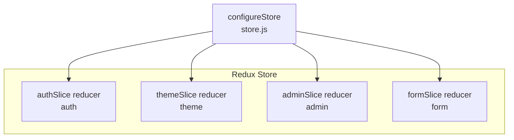
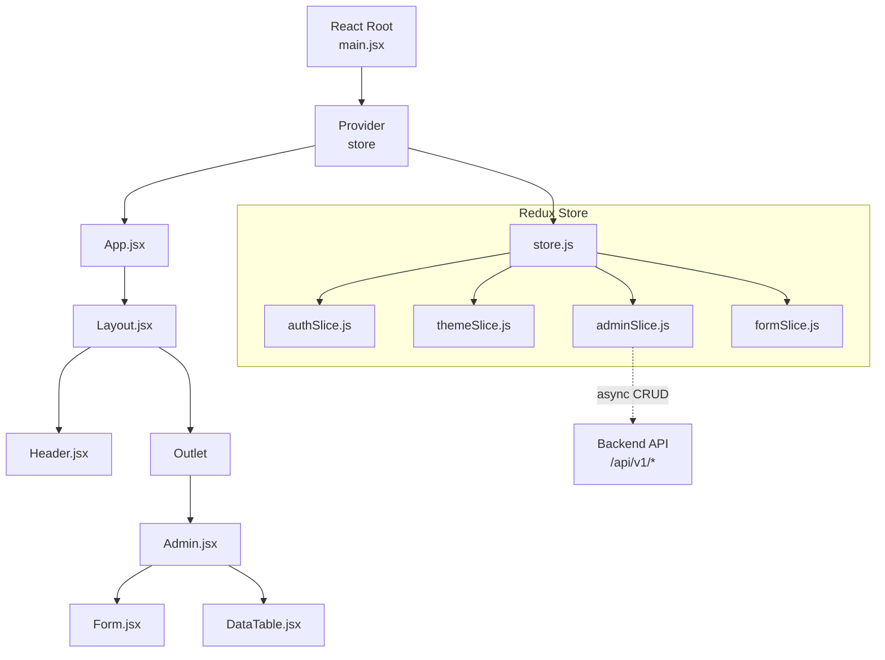
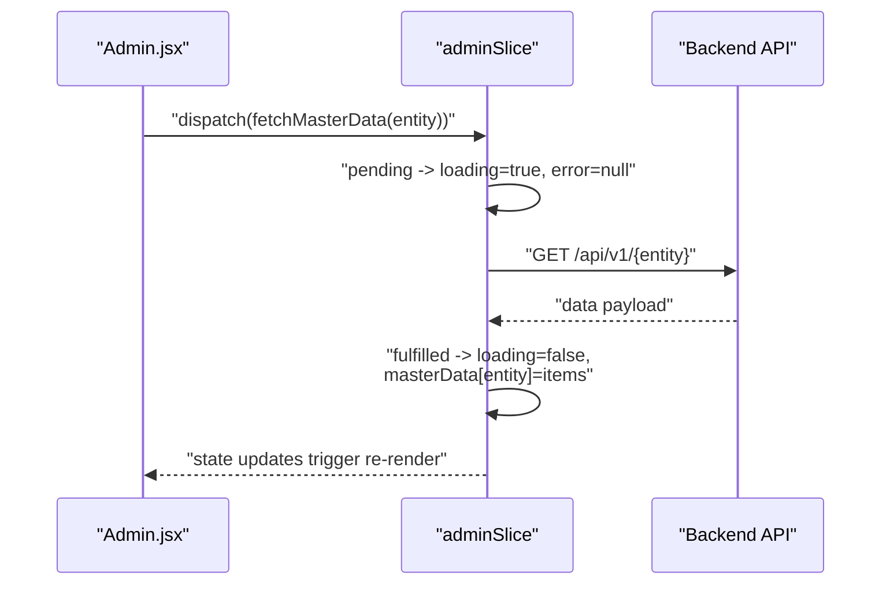
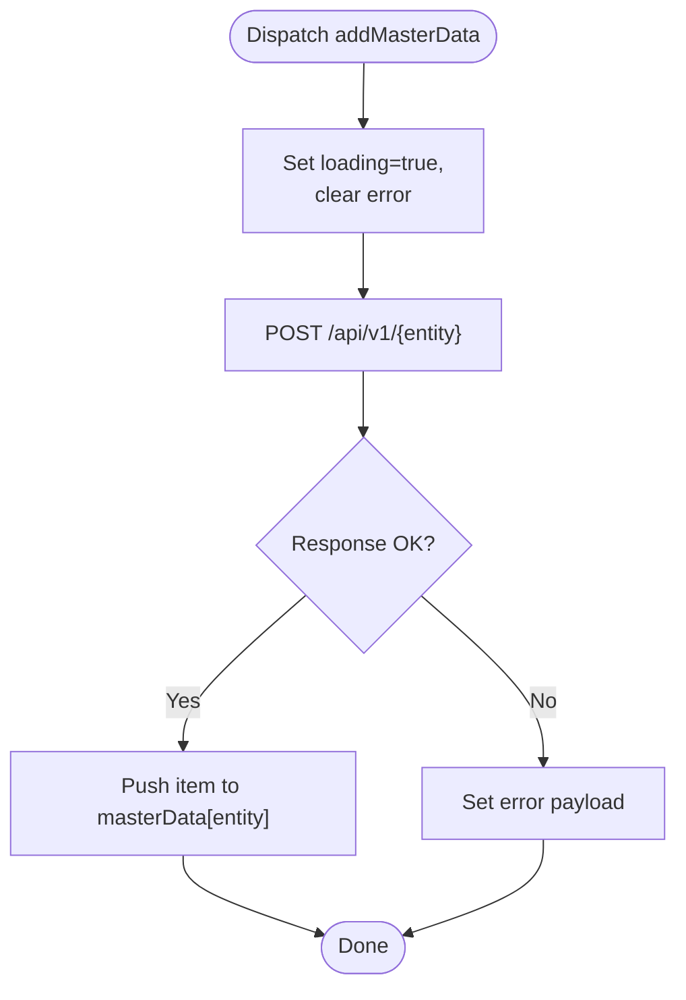
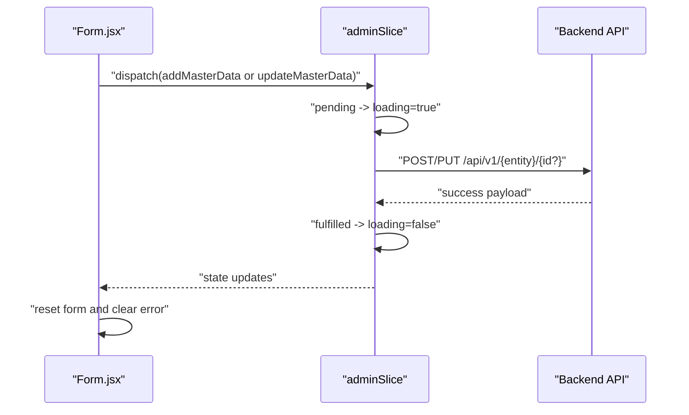
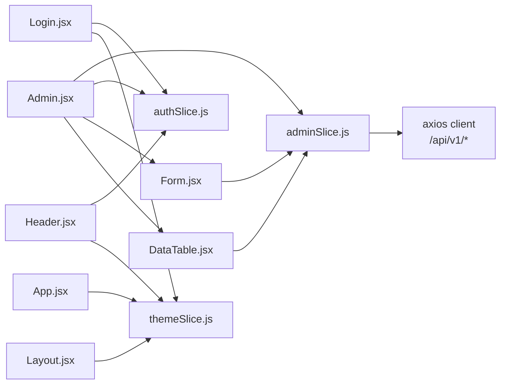

# State Management

<cite>
**Referenced Files in This Document**
- [store.js](file://Client/src/store/store.js)
- [adminSlice.js](file://Client/src/store/admin/adminSlice.js)
- [authSlice.js](file://Client/src/store/auth/authSlice.js)
- [themeSlice.js](file://Client/src/store/theme/themeSlice.js)
- [formSlice.js](file://Client/src/store/formSlice.js)
- [main.jsx](file://Client/src/main.jsx)
- [App.jsx](file://Client/src/App.jsx)
- [Admin.jsx](file://Client/src/pages/dashboard/Admin.jsx)
- [Form.jsx](file://Client/src/components/deshboard/Form.jsx)
- [DataTable.jsx](file://Client/src/components/deshboard/DataTable.jsx)
- [Layout.jsx](file://Client/src/components/Layout.jsx)
- [Header.jsx](file://Client/src/components/Header.jsx)
- [Login.jsx](file://Client/src/pages/Login.jsx)
</cite>

## Table of Contents
1. [Introduction](#introduction)
2. [Project Structure](#project-structure)
3. [Core Components](#core-components)
4. [Architecture Overview](#architecture-overview)
5. [Detailed Component Analysis](#detailed-component-analysis)
6. [Dependency Analysis](#dependency-analysis)
7. [Performance Considerations](#performance-considerations)
8. [Troubleshooting Guide](#troubleshooting-guide)
9. [Conclusion](#conclusion)
10. [Appendices](#appendices)

## Introduction
This document explains the Redux Toolkit state management implementation for the timetable project. It covers store configuration, slice organization, reducer patterns, async thunks for API operations, loading/error handling, selector usage, state normalization, performance techniques, best practices, and integration with React via hooks and context. It documents four primary slices: adminSlice for master data operations, authSlice for authentication state, themeSlice for UI preferences, and formSlice for form state management.

## Project Structure
The client-side state management is organized under Client/src/store with a single store that composes multiple slices. The store is provided to the React app via the Redux Provider at the root.

**Diagram sources**
- [store.js:7-14](file://Client/src/store/store.js#L7-L14)
- [authSlice.js:10-27](file://Client/src/store/auth/authSlice.js#L10-L27)
- [themeSlice.js:15-23](file://Client/src/store/theme/themeSlice.js#L15-L23)
- [adminSlice.js:88-169](file://Client/src/store/admin/adminSlice.js#L88-L169)
- [formSlice.js:3-21](file://Client/src/store/formSlice.js#L3-L21)

**Section sources**
- [store.js:1-15](file://Client/src/store/store.js#L1-L15)

## Core Components
- Store configuration: Centralized in store.js using configureStore with reducers for auth, theme, admin, and form.
- Slices:
  - adminSlice: Manages master data CRUD operations via async thunks and local UI state (activeEntity, editingEntityId).
  - authSlice: Tracks authentication state and persists user data to localStorage.
  - themeSlice: Tracks and toggles UI theme preference with localStorage persistence.
  - formSlice: Holds transient form state for UI-driven entity forms.

**Section sources**
- [store.js:7-14](file://Client/src/store/store.js#L7-L14)
- [adminSlice.js:80-86](file://Client/src/store/admin/adminSlice.js#L80-L86)
- [authSlice.js:3-8](file://Client/src/store/auth/authSlice.js#L3-L8)
- [themeSlice.js:11-13](file://Client/src/store/theme/themeSlice.js#L11-L13)
- [formSlice.js:5-9](file://Client/src/store/formSlice.js#L5-L9)

## Architecture Overview
The Redux store integrates with React through the Provider at the root. Components use useSelector to read state and useDispatch to dispatch actions. Async operations are handled by adminSlice thunks that communicate with backend endpoints.

**Diagram sources**
- [main.jsx:9-16](file://Client/src/main.jsx#L9-L16)
- [store.js:7-14](file://Client/src/store/store.js#L7-L14)
- [adminSlice.js:24-78](file://Client/src/store/admin/adminSlice.js#L24-L78)
- [Admin.jsx:17-49](file://Client/src/pages/dashboard/Admin.jsx#L17-L49)
- [Form.jsx:3-50](file://Client/src/components/deshboard/Form.jsx#L3-L50)
- [DataTable.jsx:3-18](file://Client/src/components/deshboard/DataTable.jsx#L3-L18)

## Detailed Component Analysis

### Store Configuration
- Composes reducers for auth, theme, admin, and form.
- Exports a singleton store instance for global use.

Best practices:
- Keep reducers pure and synchronous; delegate side effects to thunks.
- Avoid unnecessary nesting; keep slices focused and cohesive.

**Section sources**
- [store.js:1-15](file://Client/src/store/store.js#L1-L15)

### Slice: adminSlice (Master Data Operations)
Responsibilities:
- Manage activeEntity and editingEntityId for UI state.
- Fetch, add, update, and delete master data entries via async thunks.
- Normalize masterData by entityKey; support arrays per entity.

Async Thunks and Patterns:
- fetchMasterData: Loads lists for multiple entities; sets loading/error states; stores normalized arrays keyed by entity.
- addMasterData: Appends new records to the appropriate entity list.
- updateMasterData: Replaces an existing record by matching id (_id or id).
- deleteMasterData: Removes a record by id.

Loading and Error Handling:
- Pending: Set loading true and clear error.
- Fulfilled: Stop loading and update state with returned payload.
- Rejected: Stop loading and set error payload.

State Normalization:
- masterData is an object keyed by entity (e.g., program, course, room).
- Each entity’s value is an array of items.
- Editing and selection state is separate for UI control.

Selectors and Usage:
- Components read activeEntity, masterData, loading, and error from state.
- Dispatch thunks to perform CRUD operations.

**Diagram sources**
- [Admin.jsx:28-38](file://Client/src/pages/dashboard/Admin.jsx#L28-L38)
- [adminSlice.js:24-36](file://Client/src/store/admin/adminSlice.js#L24-L36)
- [adminSlice.js:104-118](file://Client/src/store/admin/adminSlice.js#L104-L118)

**Diagram sources**
- [adminSlice.js:38-50](file://Client/src/store/admin/adminSlice.js#L38-L50)
- [adminSlice.js:119-134](file://Client/src/store/admin/adminSlice.js#L119-L134)

**Section sources**
- [adminSlice.js:6-16](file://Client/src/store/admin/adminSlice.js#L6-L16)
- [adminSlice.js:19-22](file://Client/src/store/admin/adminSlice.js#L19-L22)
- [adminSlice.js:24-78](file://Client/src/store/admin/adminSlice.js#L24-L78)
- [adminSlice.js:80-86](file://Client/src/store/admin/adminSlice.js#L80-L86)
- [adminSlice.js:104-168](file://Client/src/store/admin/adminSlice.js#L104-L168)

### Slice: authSlice (Authentication State)
Responsibilities:
- Track isAuthenticated and userData.
- Persist state to localStorage on login/logout.

Patterns:
- Pure reducers update state immutably.
- localStorage sync ensures persistence across reloads.

Integration:
- Used in Admin page to guard access and in Header/Login to control navigation.

**Section sources**
- [authSlice.js:3-8](file://Client/src/store/auth/authSlice.js#L3-L8)
- [authSlice.js:10-27](file://Client/src/store/auth/authSlice.js#L10-L27)
- [Admin.jsx:40-44](file://Client/src/pages/dashboard/Admin.jsx#L40-L44)
- [Header.jsx:10-18](file://Client/src/components/Header.jsx#L10-L18)
- [Login.jsx:15-44](file://Client/src/pages/Login.jsx#L15-L44)

### Slice: themeSlice (UI Preferences)
Responsibilities:
- Track current theme (light/dark).
- Toggle theme and persist to localStorage.
- Initialize theme from localStorage or prefers-color-scheme.

Integration:
- App.jsx applies theme to document element.
- Header/Login buttons toggle theme.

**Section sources**
- [themeSlice.js:3-9](file://Client/src/store/theme/themeSlice.js#L3-L9)
- [themeSlice.js:11-13](file://Client/src/store/theme/themeSlice.js#L11-L13)
- [themeSlice.js:15-23](file://Client/src/store/theme/themeSlice.js#L15-L23)
- [App.jsx:14-24](file://Client/src/App.jsx#L14-L24)
- [Header.jsx:25-28](file://Client/src/components/Header.jsx#L25-L28)
- [Login.jsx:49-64](file://Client/src/pages/Login.jsx#L49-L64)

### Slice: formSlice (Form State Management)
Responsibilities:
- Hold entityForm data for the active entity.
- Track editingEntityId and activeEntity for UI-driven forms.

Usage:
- Admin page passes activeEntity and currentEntityConfig to Form and DataTable.
- Form.jsx reads and writes entityForm; dispatches add/update and clears errors.

**Section sources**
- [formSlice.js:3-9](file://Client/src/store/formSlice.js#L3-L9)
- [formSlice.js:10-21](file://Client/src/store/formSlice.js#L10-L21)
- [Admin.jsx:408-412](file://Client/src/pages/dashboard/Admin.jsx#L408-L412)
- [Form.jsx:5-50](file://Client/src/components/deshboard/Form.jsx#L5-L50)
- [DataTable.jsx:5-18](file://Client/src/components/deshboard/DataTable.jsx#L5-L18)

### React Integration Patterns
- Provider at root: Wraps the app with store and routing.
- Hooks:
  - useSelector to read state (auth, theme, admin, form).
  - useDispatch to dispatch actions (login, logout, toggleTheme, CRUD).
- Components:
  - Admin.jsx orchestrates fetching and CRUD operations.
  - Form.jsx handles form input and submission.
  - DataTable.jsx renders lists and triggers edit/delete.
  - Layout.jsx and Header.jsx apply theme and handle navigation.

**Diagram sources**
- [Form.jsx:37-50](file://Client/src/components/deshboard/Form.jsx#L37-L50)
- [adminSlice.js:38-78](file://Client/src/store/admin/adminSlice.js#L38-L78)
- [adminSlice.js:119-167](file://Client/src/store/admin/adminSlice.js#L119-L167)

**Section sources**
- [main.jsx:9-16](file://Client/src/main.jsx#L9-L16)
- [Admin.jsx:17-26](file://Client/src/pages/dashboard/Admin.jsx#L17-L26)
- [Form.jsx:5-50](file://Client/src/components/deshboard/Form.jsx#L5-L50)
- [DataTable.jsx:5-18](file://Client/src/components/deshboard/DataTable.jsx#L5-L18)
- [Layout.jsx:7-19](file://Client/src/components/Layout.jsx#L7-L19)
- [Header.jsx:8-28](file://Client/src/components/Header.jsx#L8-L28)
- [Login.jsx:9-44](file://Client/src/pages/Login.jsx#L9-L44)

## Dependency Analysis
- Store depends on four slice reducers.
- Components depend on specific slices for state and actions.
- adminSlice depends on backend endpoints via axios client.
- UI components depend on theme and auth slices for behavior and rendering.

**Diagram sources**
- [Admin.jsx:1-50](file://Client/src/pages/dashboard/Admin.jsx#L1-L50)
- [Form.jsx:1-50](file://Client/src/components/deshboard/Form.jsx#L1-L50)
- [DataTable.jsx:1-18](file://Client/src/components/deshboard/DataTable.jsx#L1-L18)
- [adminSlice.js:19-22](file://Client/src/store/admin/adminSlice.js#L19-L22)
- [Login.jsx:6-7](file://Client/src/pages/Login.jsx#L6-L7)
- [Header.jsx:5-6](file://Client/src/components/Header.jsx#L5-L6)
- [App.jsx:14](file://Client/src/App.jsx#L14)
- [Layout.jsx:8](file://Client/src/components/Layout.jsx#L8)

**Section sources**
- [store.js:1-15](file://Client/src/store/store.js#L1-L15)
- [adminSlice.js:19-22](file://Client/src/store/admin/adminSlice.js#L19-L22)
- [Admin.jsx:1-50](file://Client/src/pages/dashboard/Admin.jsx#L1-L50)
- [Login.jsx:6-7](file://Client/src/pages/Login.jsx#L6-L7)
- [Header.jsx:5-6](file://Client/src/components/Header.jsx#L5-L6)
- [App.jsx:14](file://Client/src/App.jsx#L14)
- [Layout.jsx:8](file://Client/src/components/Layout.jsx#L8)

## Performance Considerations
- Prefer normalized state: adminSlice already normalizes per entity; avoid deep nested structures to reduce re-renders.
- Memoization: Use shallow equality checks for object identity; rely on Redux Toolkit’s built-in immutability.
- Conditional fetching: Admin.jsx fetches multiple entities initially; consider lazy-loading per activeEntity to minimize initial payload.
- Local storage caching: authSlice and themeSlice cache to localStorage to avoid recomputation on mount.
- Avoid unnecessary re-renders: Keep UI state (editingEntityId, activeEntity) separate from data to limit scope of updates.
- Batch updates: Group related UI state changes (e.g., clearing error after successful add/update) to prevent flicker.

[No sources needed since this section provides general guidance]

## Troubleshooting Guide
Common issues and resolutions:
- Authentication redirects: Admin.jsx checks isAuthenticated and role; ensure login sets auth state and redirects accordingly.
- Theme not applying: App.jsx adds/removes dark class on html; verify themeSlice persists and App.jsx reacts to theme changes.
- Async thunk errors: adminSlice thunks return rejectWithValue; check error payload and display messages in UI.
- ID mismatches: adminSlice update/delete supports both _id and id; ensure backend returns consistent identifiers.
- Form resets: After successful add/update, Form.jsx resets form and clears error; confirm unwrap() usage and dispatch order.

**Section sources**
- [Admin.jsx:40-49](file://Client/src/pages/dashboard/Admin.jsx#L40-L49)
- [App.jsx:16-24](file://Client/src/App.jsx#L16-L24)
- [adminSlice.js:52-64](file://Client/src/store/admin/adminSlice.js#L52-L64)
- [adminSlice.js:67-77](file://Client/src/store/admin/adminSlice.js#L67-L77)
- [Form.jsx:37-50](file://Client/src/components/deshboard/Form.jsx#L37-L50)

## Conclusion
The Redux Toolkit implementation cleanly separates concerns across four focused slices, uses async thunks for API interactions, and integrates tightly with React via hooks. The store is configured centrally, and components consume state and dispatch actions in a predictable pattern. With normalized state, explicit loading/error handling, and localStorage persistence, the system balances simplicity and scalability.

[No sources needed since this section summarizes without analyzing specific files]

## Appendices

### Best Practices Checklist
- Keep reducers pure; use createSlice for concise reducers.
- Encapsulate side effects in createAsyncThunk; return rejectWithValue for errors.
- Normalize data by entity keys; avoid deeply nested structures.
- Persist critical UI state to localStorage (auth, theme).
- Use useSelector to pick minimal state; avoid subscribing to unrelated branches.
- Guard routes using auth state; redirect unauthorized users.
- Apply theme via document class toggling; keep theme logic centralized.

[No sources needed since this section provides general guidance]