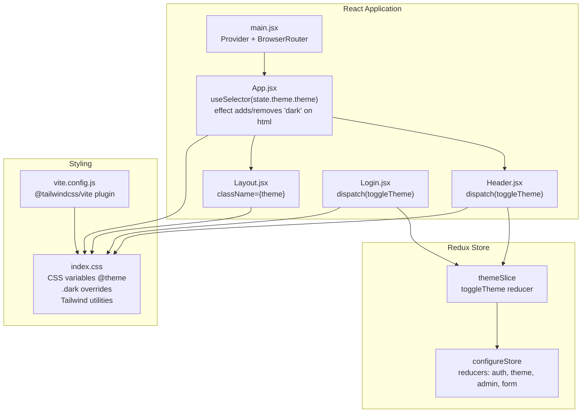
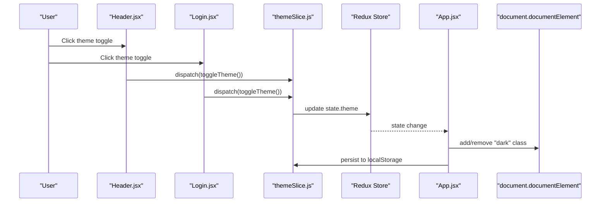
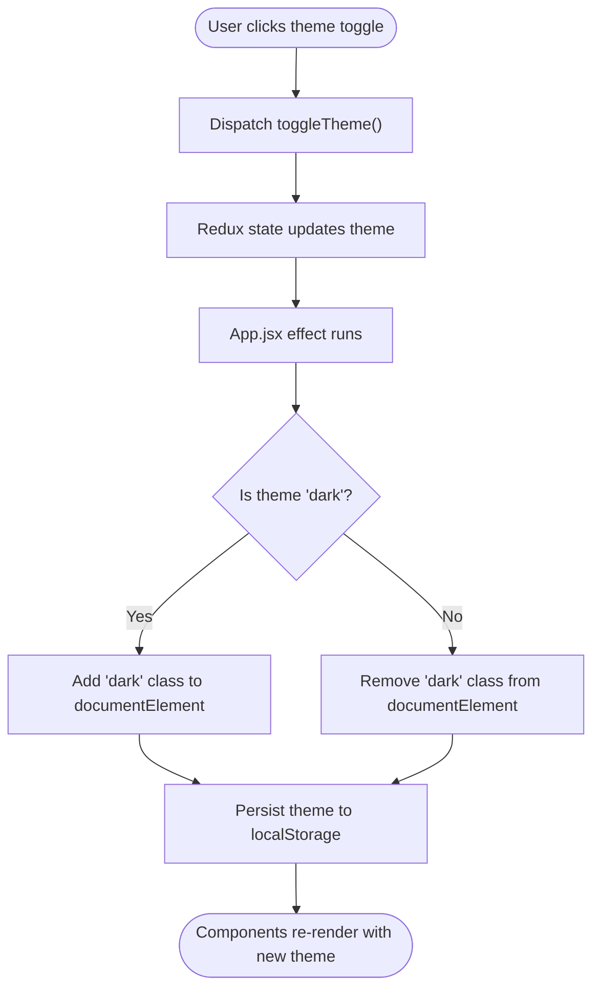
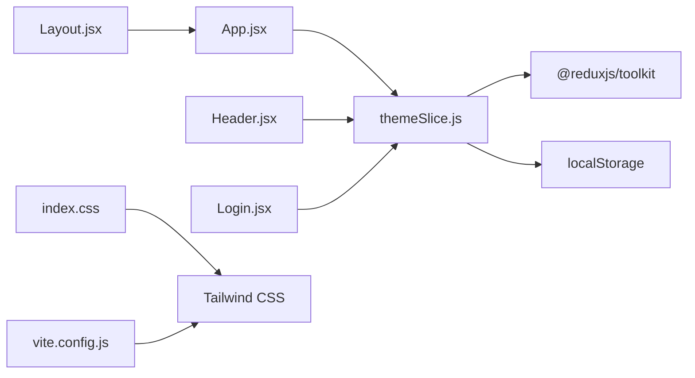

# UI Theme Slice

<cite>
**Referenced Files in This Document**
- [themeSlice.js](file://Client/src/store/theme/themeSlice.js)
- [store.js](file://Client/src/store/store.js)
- [App.jsx](file://Client/src/App.jsx)
- [index.css](file://Client/src/index.css)
- [Header.jsx](file://Client/src/components/Header.jsx)
- [Layout.jsx](file://Client/src/components/Layout.jsx)
- [Login.jsx](file://Client/src/pages/Login.jsx)
- [main.jsx](file://Client/src/main.jsx)
- [vite.config.js](file://Client/vite.config.js)
- [package.json](file://Client/package.json)
</cite>

## Table of Contents
1. [Introduction](#introduction)
2. [Project Structure](#project-structure)
3. [Core Components](#core-components)
4. [Architecture Overview](#architecture-overview)
5. [Detailed Component Analysis](#detailed-component-analysis)
6. [Dependency Analysis](#dependency-analysis)
7. [Performance Considerations](#performance-considerations)
8. [Troubleshooting Guide](#troubleshooting-guide)
9. [Conclusion](#conclusion)
10. [Appendices](#appendices)

## Introduction
This document explains the UI theme slice that manages application styling and visual preferences, focusing on dark/light mode switching, color scheme management, Redux state persistence, and Tailwind CSS integration. It covers the theme state structure, reducers, selectors, computed styles, dynamic class application, responsive design considerations, accessibility features, cross-browser compatibility, synchronization across components, and performance optimization strategies.

## Project Structure
The theme system spans Redux slices, global CSS variables, React components, and Vite/Tailwind configuration. The Redux store integrates the theme slice alongside other domain slices. Global CSS defines light/dark color tokens and applies them via CSS variables and Tailwind utilities. React components consume the theme state and trigger theme toggles.

**Diagram sources**
- [store.js:7-14](file://Client/src/store/store.js#L7-L14)
- [themeSlice.js:15-24](file://Client/src/store/theme/themeSlice.js#L15-L24)
- [main.jsx:9-17](file://Client/src/main.jsx#L9-L17)
- [App.jsx:13-24](file://Client/src/App.jsx#L13-L24)
- [Layout.jsx:7-20](file://Client/src/components/Layout.jsx#L7-L20)
- [Header.jsx:8-28](file://Client/src/components/Header.jsx#L8-L28)
- [Login.jsx:9-54](file://Client/src/pages/Login.jsx#L9-L54)
- [index.css:1-42](file://Client/src/index.css#L1-L42)
- [vite.config.js:1-17](file://Client/vite.config.js#L1-L17)

**Section sources**
- [store.js:1-15](file://Client/src/store/store.js#L1-L15)
- [themeSlice.js:1-29](file://Client/src/store/theme/themeSlice.js#L1-L29)
- [main.jsx:1-18](file://Client/src/main.jsx#L1-L18)
- [App.jsx:1-41](file://Client/src/App.jsx#L1-L41)
- [index.css:1-42](file://Client/src/index.css#L1-L42)
- [vite.config.js:1-17](file://Client/vite.config.js#L1-L17)

## Core Components
- Theme slice state and reducer
  - State shape: theme string with values "light" or "dark".
  - Initializer reads persisted theme from localStorage; falls back to system preference detection.
  - Reducer toggles between "light" and "dark", persisting the new value to localStorage.
- Redux store integration
  - The theme reducer is registered under the "theme" key.
- Global CSS and Tailwind integration
  - CSS variables define semantic tokens mapped via @theme.
  - :root defines light defaults; .dark overrides tokens for dark mode.
  - Tailwind utilities consume CSS variables for consistent theming.
- React components consuming theme
  - App.jsx applies "dark" class to document.documentElement based on state.
  - Layout.jsx applies the current theme as a className to its container.
  - Header.jsx and Login.jsx render theme toggle controls and dispatch toggleTheme.

Key implementation references:
- [themeSlice.js:3-9](file://Client/src/store/theme/themeSlice.js#L3-L9) initial theme resolution
- [themeSlice.js:11-24](file://Client/src/store/theme/themeSlice.js#L11-L24) reducer and persistence
- [store.js:7-14](file://Client/src/store/store.js#L7-L14) store registration
- [index.css:4-13](file://Client/src/index.css#L4-L13) CSS variable mapping
- [index.css:15-35](file://Client/src/index.css#L15-L35) light/dark token overrides
- [App.jsx:16-24](file://Client/src/App.jsx#L16-L24) documentElement class management
- [Layout.jsx:10-11](file://Client/src/components/Layout.jsx#L10-L11) component-level theme class
- [Header.jsx:25-28](file://Client/src/components/Header.jsx#L25-L28) toggle handler
- [Login.jsx:49-54](file://Client/src/pages/Login.jsx#L49-L54) toggle button

**Section sources**
- [themeSlice.js:1-29](file://Client/src/store/theme/themeSlice.js#L1-L29)
- [store.js:1-15](file://Client/src/store/store.js#L1-L15)
- [index.css:1-42](file://Client/src/index.css#L1-L42)
- [App.jsx:1-41](file://Client/src/App.jsx#L1-L41)
- [Layout.jsx:1-22](file://Client/src/components/Layout.jsx#L1-L22)
- [Header.jsx:1-122](file://Client/src/components/Header.jsx#L1-L122)
- [Login.jsx:1-116](file://Client/src/pages/Login.jsx#L1-L116)

## Architecture Overview
The theme architecture combines Redux for state management, localStorage for persistence, and CSS variables for styling. The toggle action updates the Redux state, which triggers effects to synchronize the DOM and persist the selection. Tailwind utilities consume CSS variables to apply consistent colors across components.

**Diagram sources**
- [Header.jsx:25-28](file://Client/src/components/Header.jsx#L25-L28)
- [Login.jsx:50-51](file://Client/src/pages/Login.jsx#L50-L51)
- [themeSlice.js:19-22](file://Client/src/store/theme/themeSlice.js#L19-L22)
- [App.jsx:16-24](file://Client/src/App.jsx#L16-L24)

## Detailed Component Analysis

### Theme Slice: State, Reducers, and Persistence
- State initialization
  - Reads "theme" from localStorage if present.
  - Falls back to system preference detection via media query.
- Reducer
  - Toggles between "light" and "dark".
  - Persists the new theme immediately after mutation.
- Exported selector
  - Exposes toggleTheme action creator for dispatching.

Implementation references:
- [themeSlice.js:3-9](file://Client/src/store/theme/themeSlice.js#L3-L9) initial theme resolution
- [themeSlice.js:11-13](file://Client/src/store/theme/themeSlice.js#L11-L13) initialState
- [themeSlice.js:19-22](file://Client/src/store/theme/themeSlice.js#L19-L22) toggleTheme reducer
- [themeSlice.js:26](file://Client/src/store/theme/themeSlice.js#L26) export action

**Section sources**
- [themeSlice.js:1-29](file://Client/src/store/theme/themeSlice.js#L1-L29)

### Redux Store Integration
- The theme reducer is registered under the "theme" key.
- Other slices (auth, admin, form) are also integrated for a cohesive state tree.

References:
- [store.js:7-14](file://Client/src/store/store.js#L7-L14)

**Section sources**
- [store.js:1-15](file://Client/src/store/store.js#L1-L15)

### Global Styling and Tailwind Integration
- CSS variables
  - Semantic tokens mapped via @theme for consistent theming.
  - :root defines light-mode defaults.
  - .dark overrides tokens for dark mode.
- Tailwind utilities
  - Utilities like bg-background, text-text, border-border consume CSS variables.
  - Responsive variants and transitions are applied in components.
- Vite/Tailwind plugin
  - @tailwindcss/vite plugin enables CSS compilation and JIT processing.

References:
- [index.css:4-13](file://Client/src/index.css#L4-L13)
- [index.css:15-35](file://Client/src/index.css#L15-L35)
- [vite.config.js:1-17](file://Client/vite.config.js#L1-L17)
- [package.json:12-22](file://Client/package.json#L12-L22)

**Section sources**
- [index.css:1-42](file://Client/src/index.css#L1-L42)
- [vite.config.js:1-17](file://Client/vite.config.js#L1-L17)
- [package.json:1-36](file://Client/package.json#L1-L36)

### App-Level Theme Synchronization
- Effect listens to theme changes and synchronizes documentElement with "dark" class.
- Ensures Tailwind's .dark variant activates consistently across the app.
- Persists the resolved theme to localStorage during effect execution.

References:
- [App.jsx:16-24](file://Client/src/App.jsx#L16-L24)

**Section sources**
- [App.jsx:1-41](file://Client/src/App.jsx#L1-L41)

### Component-Level Theme Application
- Layout.jsx
  - Applies the current theme as a className to its root div.
  - Enables per-route theme scoping if desired.
- Header.jsx
  - Renders a theme toggle button with icons for light/dark modes.
  - Uses semantic color classes and transitions for smooth UX.
- Login.jsx
  - Provides a floating theme toggle button with accessible titles.
  - Uses Tailwind utilities for layout, colors, and focus states.

References:
- [Layout.jsx:10-11](file://Client/src/components/Layout.jsx#L10-L11)
- [Header.jsx:38-106](file://Client/src/components/Header.jsx#L38-L106)
- [Login.jsx:48-64](file://Client/src/pages/Login.jsx#L48-L64)

**Section sources**
- [Layout.jsx:1-22](file://Client/src/components/Layout.jsx#L1-L22)
- [Header.jsx:1-122](file://Client/src/components/Header.jsx#L1-L122)
- [Login.jsx:1-116](file://Client/src/pages/Login.jsx#L1-L116)

### Theme Toggle Flow

**Diagram sources**
- [Header.jsx:25-28](file://Client/src/components/Header.jsx#L25-L28)
- [Login.jsx:50-51](file://Client/src/pages/Login.jsx#L50-L51)
- [themeSlice.js:19-22](file://Client/src/store/theme/themeSlice.js#L19-L22)
- [App.jsx:16-24](file://Client/src/App.jsx#L16-L24)

## Dependency Analysis
- Internal dependencies
  - themeSlice.js depends on Redux Toolkit and localStorage APIs.
  - App.jsx depends on React hooks and Redux selectors.
  - Components depend on Redux actions and selectors.
- External dependencies
  - Tailwind CSS and @tailwindcss/vite plugin for CSS processing.
  - React and React Router for routing and component composition.

**Diagram sources**
- [themeSlice.js:1](file://Client/src/store/theme/themeSlice.js#L1)
- [App.jsx:14](file://Client/src/App.jsx#L14)
- [Layout.jsx:7](file://Client/src/components/Layout.jsx#L7)
- [Header.jsx:5](file://Client/src/components/Header.jsx#L5)
- [Login.jsx:7](file://Client/src/pages/Login.jsx#L7)
- [index.css:1](file://Client/src/index.css#L1)
- [vite.config.js:3](file://Client/vite.config.js#L3)

**Section sources**
- [themeSlice.js:1-29](file://Client/src/store/theme/themeSlice.js#L1-L29)
- [App.jsx:1-41](file://Client/src/App.jsx#L1-L41)
- [Layout.jsx:1-22](file://Client/src/components/Layout.jsx#L1-L22)
- [Header.jsx:1-122](file://Client/src/components/Header.jsx#L1-L122)
- [Login.jsx:1-116](file://Client/src/pages/Login.jsx#L1-L116)
- [index.css:1-42](file://Client/src/index.css#L1-L42)
- [vite.config.js:1-17](file://Client/vite.config.js#L1-L17)

## Performance Considerations
- Efficient DOM updates
  - Applying/removing a single "dark" class on documentElement is inexpensive.
- Minimal re-renders
  - Use useSelector to select only the theme field to avoid unnecessary re-renders in components.
- CSS variable usage
  - CSS variables reduce style recalculation overhead compared to recalculating derived values.
- Lazy initialization
  - Initial theme resolution reads localStorage once at startup, avoiding repeated IO.
- Tailwind JIT
  - Vite with @tailwindcss/vite optimizes CSS generation and purging unused styles.

Recommendations:
- Keep theme toggling synchronous and lightweight.
- Avoid frequent theme changes in rapid succession; debounce if needed.
- Prefer CSS transitions for smooth theme switches.

[No sources needed since this section provides general guidance]

## Troubleshooting Guide
- Theme does not persist across browser sessions
  - Verify localStorage availability and absence of storage errors.
  - Confirm toggleTheme persists the new theme after each toggle.
  - References: [themeSlice.js:19-22](file://Client/src/store/theme/themeSlice.js#L19-L22)
- Dark mode not applying to components
  - Ensure documentElement receives "dark" class when theme is "dark".
  - Verify .dark token overrides are defined and loaded.
  - References: [App.jsx:16-24](file://Client/src/App.jsx#L16-L24), [index.css:26-35](file://Client/src/index.css#L26-L35)
- Tailwind utilities not reflecting theme changes
  - Confirm CSS variables are defined and used in utilities.
  - Ensure @tailwind directives and @tailwindcss/vite plugin are configured.
  - References: [index.css:4-13](file://Client/src/index.css#L4-L13), [vite.config.js:3](file://Client/vite.config.js#L3)
- Theme toggle button not visible or interactive
  - Check component imports and dispatch wiring.
  - References: [Header.jsx:25-28](file://Client/src/components/Header.jsx#L25-L28), [Login.jsx:50-51](file://Client/src/pages/Login.jsx#L50-L51)

**Section sources**
- [themeSlice.js:19-22](file://Client/src/store/theme/themeSlice.js#L19-L22)
- [App.jsx:16-24](file://Client/src/App.jsx#L16-L24)
- [index.css:4-13](file://Client/src/index.css#L4-L13)
- [index.css:26-35](file://Client/src/index.css#L26-L35)
- [vite.config.js:3](file://Client/vite.config.js#L3)
- [Header.jsx:25-28](file://Client/src/components/Header.jsx#L25-L28)
- [Login.jsx:50-51](file://Client/src/pages/Login.jsx#L50-L51)

## Conclusion
The theme slice provides a concise, efficient mechanism for managing dark/light mode with persistent state and seamless Tailwind integration. By applying a single class to documentElement and leveraging CSS variables, the system ensures consistent theming across components while remaining responsive, accessible, and cross-browser compatible. Following the best practices outlined here will help maintain a coherent and performant UI design system.

[No sources needed since this section summarizes without analyzing specific files]

## Appendices

### Best Practices for Maintaining Consistent UI Design
- Centralize color tokens in CSS variables and reference them via Tailwind utilities.
- Use semantic class names (e.g., bg-background, text-text) to ensure consistent theming.
- Provide accessible titles and ARIA attributes for interactive elements like theme toggles.
- Test theme changes across browsers and devices to confirm CSS variable support and Tailwind rendering.
- Keep theme toggles discoverable and clearly labeled for accessibility.

[No sources needed since this section provides general guidance]