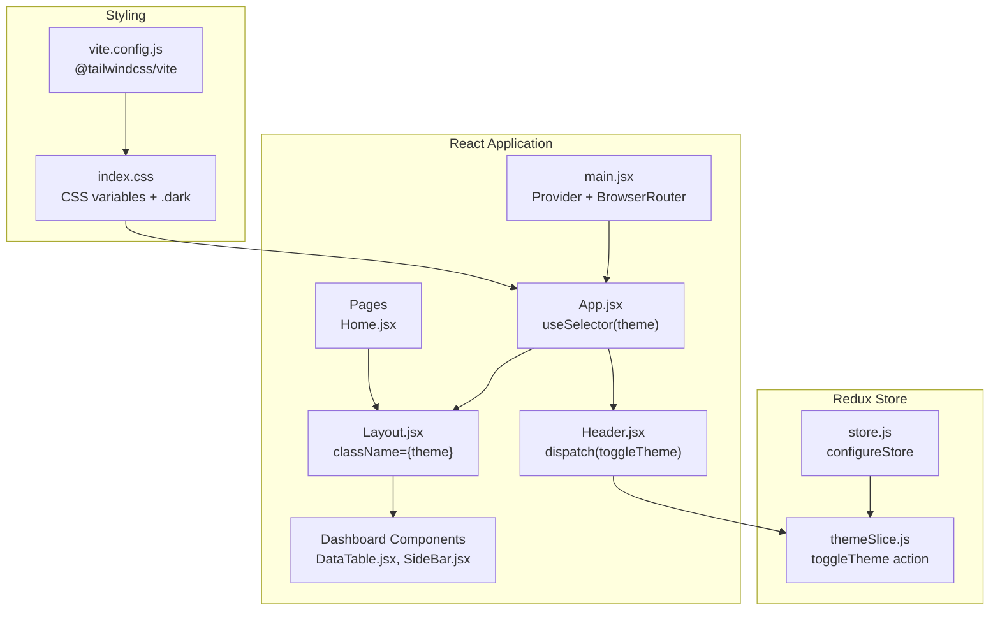
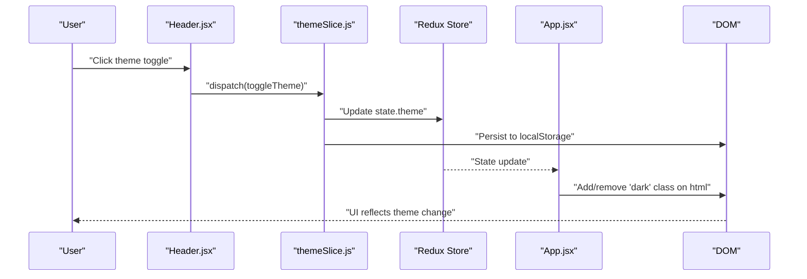
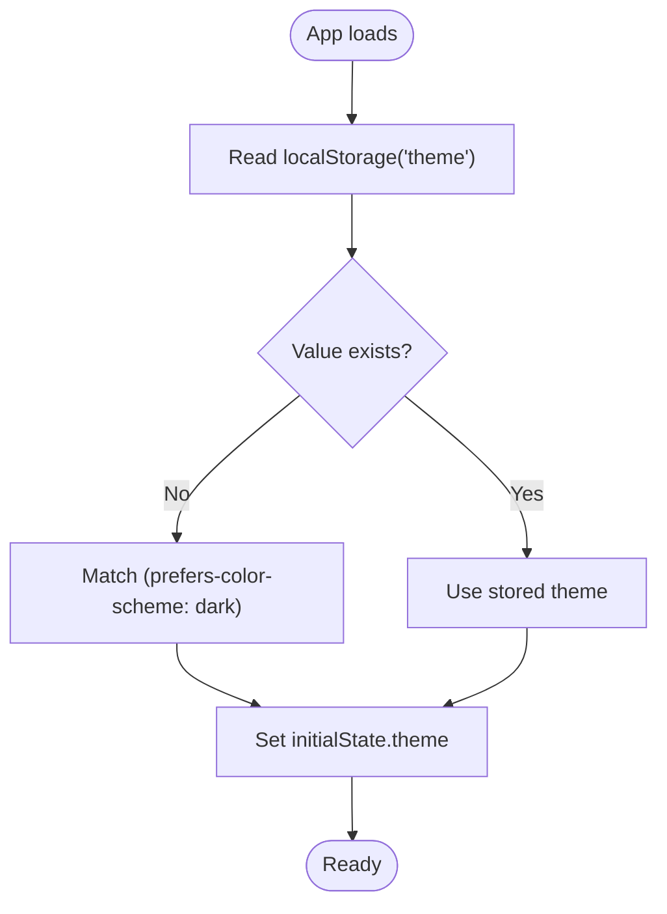
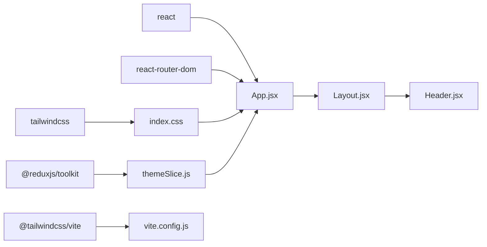

# Theme & Styling System

<cite>
**Referenced Files in This Document**
- [themeSlice.js](file://Client/src/store/theme/themeSlice.js)
- [store.js](file://Client/src/store/store.js)
- [App.jsx](file://Client/src/App.jsx)
- [index.css](file://Client/src/index.css)
- [vite.config.js](file://Client/vite.config.js)
- [Layout.jsx](file://Client/src/components/Layout.jsx)
- [Header.jsx](file://Client/src/components/Header.jsx)
- [Container.jsx](file://Client/src/components/Container.jsx)
- [DataTable.jsx](file://Client/src/components/deshboard/DataTable.jsx)
- [SideBar.jsx](file://Client/src/components/deshboard/SideBar.jsx)
- [Home.jsx](file://Client/src/pages/Home.jsx)
- [main.jsx](file://Client/src/main.jsx)
- [package.json](file://Client/package.json)
</cite>

## Table of Contents
1. [Introduction](#introduction)
2. [Project Structure](#project-structure)
3. [Core Components](#core-components)
4. [Architecture Overview](#architecture-overview)
5. [Detailed Component Analysis](#detailed-component-analysis)
6. [Dependency Analysis](#dependency-analysis)
7. [Performance Considerations](#performance-considerations)
8. [Troubleshooting Guide](#troubleshooting-guide)
9. [Conclusion](#conclusion)
10. [Appendices](#appendices)

## Introduction
This document explains the theme and styling system used in the client application. It covers the dark/light theme toggle mechanism, Redux-based state management, Tailwind CSS configuration and utility usage, responsive design patterns, CSS architecture, and component-specific styling approaches. It also provides guidelines for extending the theme system, customizing styles, and maintaining design consistency while addressing performance, accessibility, and browser compatibility.

## Project Structure
The theme and styling system spans several layers:
- Redux store configuration and theme slice for state management
- Global CSS with CSS variables and Tailwind integration
- Vite plugin setup for Tailwind processing
- React components that consume theme state and apply Tailwind utilities
- Dashboard components that demonstrate theme-aware UI patterns



**Diagram sources**
- [store.js:1-15](file://Client/src/store/store.js#L1-L15)
- [themeSlice.js:1-29](file://Client/src/store/theme/themeSlice.js#L1-L29)
- [main.jsx:1-18](file://Client/src/main.jsx#L1-L18)
- [App.jsx:1-41](file://Client/src/App.jsx#L1-L41)
- [Layout.jsx:1-22](file://Client/src/components/Layout.jsx#L1-L22)
- [Header.jsx:1-122](file://Client/src/components/Header.jsx#L1-L122)
- [DataTable.jsx:1-86](file://Client/src/components/deshboard/DataTable.jsx#L1-L86)
- [SideBar.jsx:1-49](file://Client/src/components/deshboard/SideBar.jsx#L1-L49)
- [Home.jsx:1-14](file://Client/src/pages/Home.jsx#L1-L14)
- [index.css:1-42](file://Client/src/index.css#L1-L42)
- [vite.config.js:1-17](file://Client/vite.config.js#L1-L17)

**Section sources**
- [store.js:1-15](file://Client/src/store/store.js#L1-L15)
- [themeSlice.js:1-29](file://Client/src/store/theme/themeSlice.js#L1-L29)
- [main.jsx:1-18](file://Client/src/main.jsx#L1-L18)
- [App.jsx:1-41](file://Client/src/App.jsx#L1-L41)
- [Layout.jsx:1-22](file://Client/src/components/Layout.jsx#L1-L22)
- [Header.jsx:1-122](file://Client/src/components/Header.jsx#L1-L122)
- [DataTable.jsx:1-86](file://Client/src/components/deshboard/DataTable.jsx#L1-L86)
- [SideBar.jsx:1-49](file://Client/src/components/deshboard/SideBar.jsx#L1-L49)
- [Home.jsx:1-14](file://Client/src/pages/Home.jsx#L1-L14)
- [index.css:1-42](file://Client/src/index.css#L1-L42)
- [vite.config.js:1-17](file://Client/vite.config.js#L1-L17)

## Core Components
- Theme Redux slice: Manages the current theme value, persists it to localStorage, and toggles between light and dark modes.
- App component: Subscribes to theme state and applies the "dark" class to the root HTML element for Tailwind dark mode.
- Layout component: Applies the theme class to the root container div.
- Header component: Provides the theme toggle UI and dispatches the toggle action.
- Global CSS: Defines CSS variables for theme tokens and a .dark class variant for Tailwind’s JIT-driven dark mode.
- Vite + Tailwind plugin: Processes Tailwind directives and CSS variables during development and build.

Key implementation references:
- Theme slice and initial theme detection: [themeSlice.js:1-29](file://Client/src/store/theme/themeSlice.js#L1-L29)
- Redux store composition: [store.js:1-15](file://Client/src/store/store.js#L1-L15)
- Root app effect and dark class management: [App.jsx:16-24](file://Client/src/App.jsx#L16-L24)
- Layout theme class binding: [Layout.jsx:10-11](file://Client/src/components/Layout.jsx#L10-L11)
- Header theme toggle button: [Header.jsx:66-106](file://Client/src/components/Header.jsx#L66-L106)
- CSS variables and .dark variant: [index.css:4-35](file://Client/src/index.css#L4-L35)
- Tailwind plugin registration: [vite.config.js:3](file://Client/vite.config.js#L3)

**Section sources**
- [themeSlice.js:1-29](file://Client/src/store/theme/themeSlice.js#L1-L29)
- [store.js:1-15](file://Client/src/store/store.js#L1-L15)
- [App.jsx:16-24](file://Client/src/App.jsx#L16-L24)
- [Layout.jsx:10-11](file://Client/src/components/Layout.jsx#L10-L11)
- [Header.jsx:66-106](file://Client/src/components/Header.jsx#L66-L106)
- [index.css:4-35](file://Client/src/index.css#L4-L35)
- [vite.config.js:3](file://Client/vite.config.js#L3)

## Architecture Overview
The theme system follows a unidirectional data flow:
- UI triggers a toggle action via the Header component.
- The theme slice updates the Redux state and persists the selection to localStorage.
- The App component listens to the theme state and toggles the "dark" class on the root element.
- Tailwind JIT applies dark-mode variants based on the presence of the "dark" class.



**Diagram sources**
- [Header.jsx:25-28](file://Client/src/components/Header.jsx#L25-L28)
- [themeSlice.js:18-22](file://Client/src/store/theme/themeSlice.js#L18-L22)
- [store.js:7-14](file://Client/src/store/store.js#L7-L14)
- [App.jsx:16-24](file://Client/src/App.jsx#L16-L24)

## Detailed Component Analysis

### Theme State Management (Redux)
The theme slice encapsulates:
- Initial theme resolution from localStorage or prefers-color-scheme media query
- A toggle reducer that flips between "light" and "dark"
- Persistence of the selected theme to localStorage



**Diagram sources**
- [themeSlice.js:3-9](file://Client/src/store/theme/themeSlice.js#L3-L9)

Implementation highlights:
- Initial theme determination: [themeSlice.js:3-9](file://Client/src/store/theme/themeSlice.js#L3-L9)
- Toggle reducer and persistence: [themeSlice.js:18-22](file://Client/src/store/theme/themeSlice.js#L18-L22)
- Store composition: [store.js:7-14](file://Client/src/store/store.js#L7-L14)

**Section sources**
- [themeSlice.js:1-29](file://Client/src/store/theme/themeSlice.js#L1-L29)
- [store.js:1-15](file://Client/src/store/store.js#L1-L15)

### Theme Propagation Through the Component Tree
- App component subscribes to theme state and manipulates the root HTML element class to enable Tailwind dark mode.
- Layout component applies the theme class to its root div, ensuring child components inherit the theme context.
- Header component displays the appropriate icon and tooltip based on the current theme and dispatches the toggle action.

```mermaid
classDiagram
class App {
+useSelector(state.theme)
+useEffect(add/remove "dark")
}
class Layout {
+useSelector(state.theme)
+className={theme}
}
class Header {
+dispatch(toggleTheme)
+useSelector(state.theme)
}
class themeSlice {
+toggleTheme()
}
App --> Layout : "renders"
App --> Header : "renders"
Header --> themeSlice : "dispatches"
```

**Diagram sources**
- [App.jsx:14-24](file://Client/src/App.jsx#L14-L24)
- [Layout.jsx:7-11](file://Client/src/components/Layout.jsx#L7-L11)
- [Header.jsx:10-28](file://Client/src/components/Header.jsx#L10-L28)
- [themeSlice.js:18-22](file://Client/src/store/theme/themeSlice.js#L18-L22)

**Section sources**
- [App.jsx:14-24](file://Client/src/App.jsx#L14-L24)
- [Layout.jsx:7-11](file://Client/src/components/Layout.jsx#L7-L11)
- [Header.jsx:10-28](file://Client/src/components/Header.jsx#L10-L28)

### Tailwind CSS Configuration and Utilities
- CSS variables define semantic tokens for text, background, primary, secondary, accent, surface, surface-hover, and border.
- A .dark class variant remaps these variables for dark mode.
- Tailwind is integrated via the @tailwindcss/vite plugin in Vite.
- Components use Tailwind utilities with dynamic color references and responsive modifiers.

Key references:
- CSS variables and .dark variant: [index.css:4-35](file://Client/src/index.css#L4-L35)
- Tailwind plugin registration: [vite.config.js:3](file://Client/vite.config.js#L3)
- Responsive utilities in Header: [Header.jsx:38-40](file://Client/src/components/Header.jsx#L38-L40)
- Dynamic color tokens in Header and DataTable: [Header.jsx:42-44](file://Client/src/components/Header.jsx#L42-L44), [DataTable.jsx:28-39](file://Client/src/components/deshboard/DataTable.jsx#L28-L39)

**Section sources**
- [index.css:1-42](file://Client/src/index.css#L1-L42)
- [vite.config.js:1-17](file://Client/vite.config.js#L1-L17)
- [Header.jsx:38-44](file://Client/src/components/Header.jsx#L38-L44)
- [DataTable.jsx:28-39](file://Client/src/components/deshboard/DataTable.jsx#L28-L39)

### Responsive Design Patterns
- Mobile-first approach using Tailwind responsive prefixes (sm, lg).
- Navigation adapts from a stacked layout on small screens to a horizontal layout on medium screens and above.
- Tables use overflow-x-auto for narrow viewports in dashboard components.

Examples:
- Responsive padding and spacing: [Header.jsx:38-40](file://Client/src/components/Header.jsx#L38-L40)
- Mobile breakpoint for navigation: [Header.jsx:47-116](file://Client/src/components/Header.jsx#L47-L116)
- Horizontal scrolling for tables: [DataTable.jsx:27](file://Client/src/components/deshboard/DataTable.jsx#L27)

**Section sources**
- [Header.jsx:38-116](file://Client/src/components/Header.jsx#L38-L116)
- [DataTable.jsx:27](file://Client/src/components/deshboard/DataTable.jsx#L27)

### Component-Specific Styling Approaches
- Header: Uses CSS variable tokens for backgrounds, borders, and text, with dynamic icons and tooltips reflecting the current theme.
- DataTable: Employs semantic tokens for table headers, body, borders, and hover states; includes dark mode variants for destructive actions.
- Sidebar: Leverages tokens for active/inactive states and counts badges; maintains readability across themes.

References:
- Header styling and theme-dependent iconography: [Header.jsx:37-120](file://Client/src/components/Header.jsx#L37-L120)
- DataTable theme-aware rows and actions: [DataTable.jsx:27-81](file://Client/src/components/deshboard/DataTable.jsx#L27-L81)
- Sidebar active state and counts: [SideBar.jsx:19-44](file://Client/src/components/deshboard/SideBar.jsx#L19-L44)

**Section sources**
- [Header.jsx:37-120](file://Client/src/components/Header.jsx#L37-L120)
- [DataTable.jsx:27-81](file://Client/src/components/deshboard/DataTable.jsx#L27-L81)
- [SideBar.jsx:19-44](file://Client/src/components/deshboard/SideBar.jsx#L19-L44)

### Adding New Themes and Extending the System
Guidelines:
- Extend CSS variables in :root and .dark blocks to introduce new semantic tokens.
- Add new theme options in the theme slice initial state and toggle logic.
- Persist the new theme to localStorage alongside existing logic.
- Update components to consume new tokens or derive new variants from existing ones.
- Keep responsive utilities consistent across new theme variants.

References for extension points:
- CSS variable definitions: [index.css:15-35](file://Client/src/index.css#L15-L35)
- Theme initialization and toggle: [themeSlice.js:3-22](file://Client/src/store/theme/themeSlice.js#L3-L22)

**Section sources**
- [index.css:15-35](file://Client/src/index.css#L15-L35)
- [themeSlice.js:3-22](file://Client/src/store/theme/themeSlice.js#L3-L22)

## Dependency Analysis
The theme system depends on:
- Redux Toolkit for state management
- Tailwind CSS for utility classes and JIT processing
- @tailwindcss/vite plugin for Vite integration
- React and React Router for component rendering and routing



**Diagram sources**
- [package.json:12-22](file://Client/package.json#L12-L22)
- [themeSlice.js:1](file://Client/src/store/theme/themeSlice.js#L1)
- [App.jsx:3-14](file://Client/src/App.jsx#L3-L14)
- [index.css:1](file://Client/src/index.css#L1)
- [vite.config.js:3](file://Client/vite.config.js#L3)

**Section sources**
- [package.json:12-22](file://Client/package.json#L12-L22)
- [themeSlice.js:1](file://Client/src/store/theme/themeSlice.js#L1)
- [App.jsx:3-14](file://Client/src/App.jsx#L3-L14)
- [index.css:1](file://Client/src/index.css#L1)
- [vite.config.js:3](file://Client/vite.config.js#L3)

## Performance Considerations
- CSS variables minimize repeated color definitions and reduce CSS payload.
- Tailwind JIT compiles only used utilities, reducing bundle size.
- Using the "dark" class on the root element ensures efficient dark mode application without per-component checks.
- Avoid excessive re-renders by keeping theme logic in a single place (App component) and deriving component classes from props/state minimally.

Recommendations:
- Prefer CSS variables for theme tokens to leverage caching and JIT optimization.
- Consolidate theme-related logic in the App component to avoid redundant computations.
- Use responsive utilities judiciously to prevent generating unnecessary variants.

[No sources needed since this section provides general guidance]

## Troubleshooting Guide
Common issues and resolutions:
- Theme does not persist across reloads: Verify localStorage persistence in the toggle reducer and initial theme retrieval logic.
  - References: [themeSlice.js:18-22](file://Client/src/store/theme/themeSlice.js#L18-L22), [themeSlice.js:3-9](file://Client/src/store/theme/themeSlice.js#L3-L9)
- Dark mode not applying: Ensure the "dark" class is added/removed on the root HTML element and Tailwind is configured for dark mode.
  - References: [App.jsx:16-24](file://Client/src/App.jsx#L16-L24), [index.css:26-35](file://Client/src/index.css#L26-L35)
- Styles not updating after theme change: Confirm Tailwind plugin is active and CSS variables are correctly defined.
  - References: [vite.config.js:3](file://Client/vite.config.js#L3), [index.css:4-13](file://Client/src/index.css#L4-L13)
- Responsive layout glitches: Review responsive prefixes and ensure containers wrap content appropriately.
  - References: [Header.jsx:38-40](file://Client/src/components/Header.jsx#L38-L40), [DataTable.jsx:27](file://Client/src/components/deshboard/DataTable.jsx#L27)

**Section sources**
- [themeSlice.js:3-22](file://Client/src/store/theme/themeSlice.js#L3-L22)
- [App.jsx:16-24](file://Client/src/App.jsx#L16-L24)
- [index.css:4-13](file://Client/src/index.css#L4-L13)
- [vite.config.js:3](file://Client/vite.config.js#L3)
- [Header.jsx:38-40](file://Client/src/components/Header.jsx#L38-L40)
- [DataTable.jsx:27](file://Client/src/components/deshboard/DataTable.jsx#L27)

## Conclusion
The theme and styling system leverages Redux for centralized state management, CSS variables for maintainable tokens, and Tailwind CSS with a "dark" class strategy for efficient dark mode support. The architecture is modular, easy to extend, and optimized for performance through JIT compilation and minimal re-renders. Following the provided guidelines ensures consistent theming across components and facilitates future enhancements.

[No sources needed since this section summarizes without analyzing specific files]

## Appendices

### Accessibility Considerations
- Ensure sufficient color contrast for text and interactive elements in both light and dark modes.
- Provide focus indicators for keyboard navigation.
- Use semantic HTML and ARIA attributes where necessary for interactive controls like buttons and menus.

[No sources needed since this section provides general guidance]

### Browser Compatibility
- Tailwind CSS and @tailwindcss/vite are compatible with modern browsers.
- CSS variables are supported in all modern browsers; consider polyfills if legacy browser support is required.

[No sources needed since this section provides general guidance]