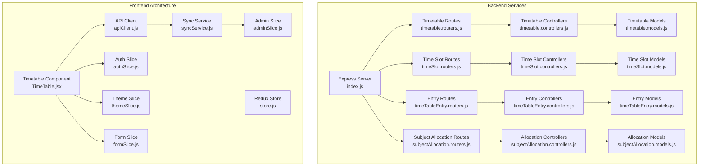
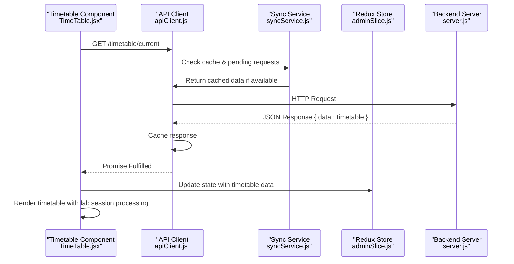
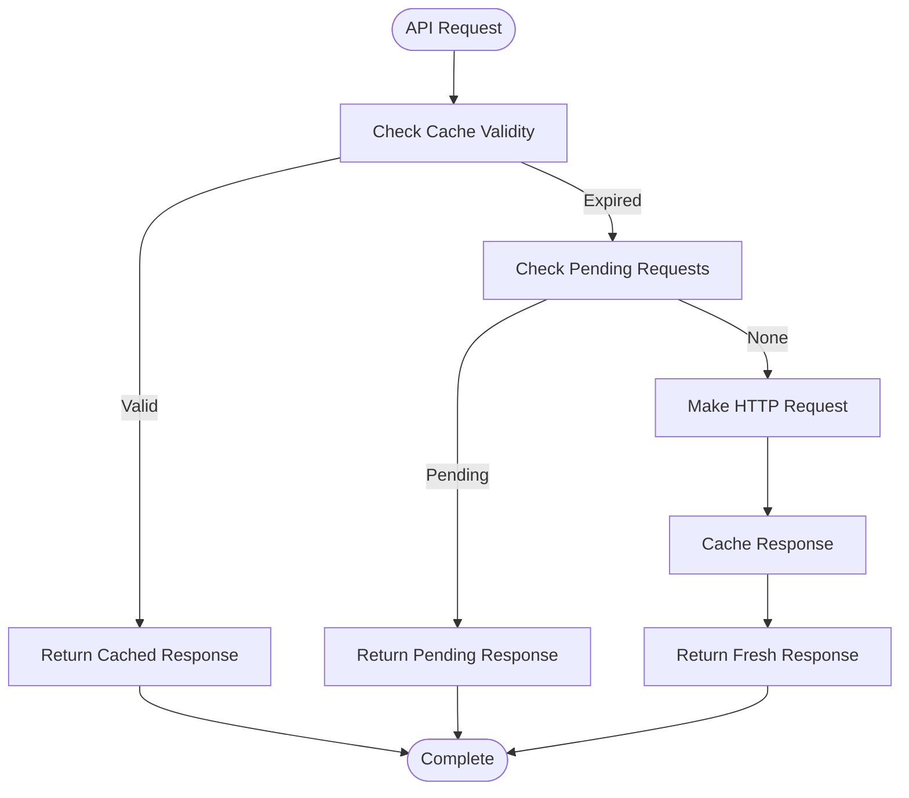
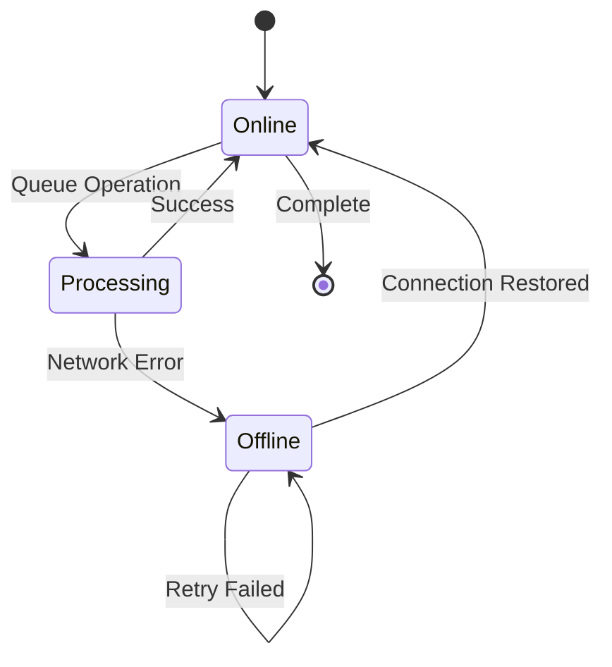
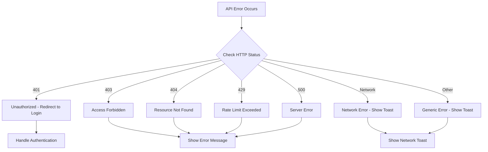
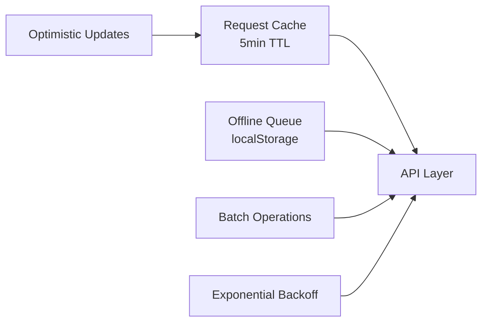
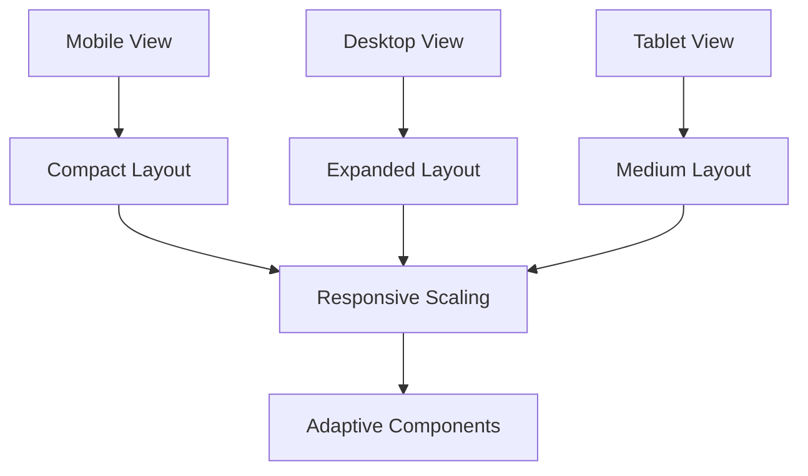
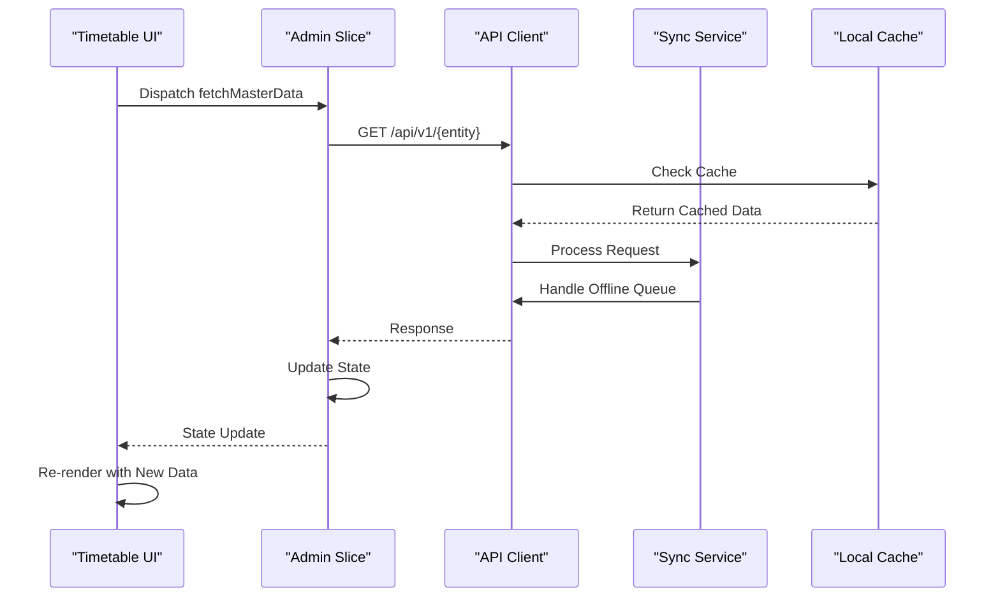

# Data Integration & API Connectivity

<cite>
**Referenced Files in This Document**
- [index.js](file://Backend/src/index.js)
- [server.js](file://Backend/src/server.js)
- [timetable.routers.js](file://Backend/src/routes/timetable.routers.js)
- [timeSlot.routers.js](file://Backend/src/routes/timeSlot.routers.js)
- [timeTableEntry.routers.js](file://Backend/src/routes/timeTableEntry.routers.js)
- [subjectAllocation.routers.js](file://Backend/src/routes/subjectAllocation.routers.js)
- [timetable.controllers.js](file://Backend/src/controllers/timetable.controllers.js)
- [timeSlot.controllers.js](file://Backend/src/controllers/timeSlot.controllers.js)
- [timeTableEntry.controllers.js](file://Backend/src/controllers/timeTableEntry.controllers.js)
- [subjectAllocation.controllers.js](file://Backend/src/controllers/subjectAllocation.controllers.js)
- [timetable.models.js](file://Backend/src/models/timetable.models.js)
- [timeSlot.models.js](file://Backend/src/models/timeSlot.models.js)
- [timeTableEntry.models.js](file://Backend/src/models/timeTableEntry.models.js)
- [subjectAllocation.models.js](file://Backend/src/models/subjectAllocation.models.js)
- [store.js](file://Client/src/store/store.js)
- [adminSlice.js](file://Client/src/store/admin/adminSlice.js)
- [authSlice.js](file://Client/src/store/auth/authSlice.js)
- [themeSlice.js](file://Client/src/store/theme/themeSlice.js)
- [formSlice.js](file://Client/src/store/formSlice.js)
- [apiClient.js](file://Client/src/services/apiClient.js)
- [syncService.js](file://Client/src/services/syncService.js)
- [TimeTable.jsx](file://Client/src/components/deshboard/TimeTable.jsx)
</cite>

## Update Summary
**Changes Made**
- Enhanced API client with comprehensive caching, retry, and offline synchronization capabilities
- Added real-time data synchronization service with optimistic updates and conflict resolution
- Expanded backend API endpoints for timetable generation, time slots, and subject allocations
- Implemented comprehensive error handling with user feedback and graceful degradation
- Added responsive design considerations and performance optimizations for large datasets
- Integrated offline-first architecture with automatic retry and queue management

## Table of Contents
1. [Introduction](#introduction)
2. [Project Structure](#project-structure)
3. [Core Components](#core-components)
4. [Architecture Overview](#architecture-overview)
5. [Enhanced API Integration](#enhanced-api-integration)
6. [Real-Time Synchronization](#real-time-synchronization)
7. [Comprehensive Error Handling](#comprehensive-error-handling)
8. [Performance Optimization](#performance-optimization)
9. [Responsive Design Implementation](#responsive-design-implementation)
10. [Data Flow Analysis](#data-flow-analysis)
11. [Troubleshooting Guide](#troubleshooting-guide)
12. [Conclusion](#conclusion)

## Introduction
This document explains the enhanced data integration between frontend timetable components and backend scheduling services. The system now features comprehensive API connectivity with real-time data updates, sophisticated caching strategies, offline synchronization capabilities, and responsive design considerations for the advanced timetable system.

## Project Structure
The enhanced system comprises:
- **Backend**: Express server with comprehensive REST endpoints for timetable management, time slots, subject allocations, and real-time synchronization
- **Frontend**: React application with advanced Redux Toolkit integration, caching mechanisms, offline-first architecture, and responsive design
- **API Layer**: Sophisticated client with request/response interceptors, caching, retry logic, and offline queue management
- **Synchronization Service**: Advanced service handling batch operations, optimistic updates, and conflict resolution

**Diagram sources**
- [index.js:1-18](file://Backend/src/index.js#L1-L18)
- [server.js:47-76](file://Backend/src/server.js#L47-L76)
- [timetable.routers.js:1-21](file://Backend/src/routes/timetable.routers.js#L1-L21)
- [timeSlot.routers.js:1-21](file://Backend/src/routes/timeSlot.routers.js#L1-L21)
- [timeTableEntry.routers.js:1-21](file://Backend/src/routes/timeTableEntry.routers.js#L1-L21)
- [subjectAllocation.routers.js:1-21](file://Backend/src/routes/subjectAllocation.routers.js#L1-L21)
- [apiClient.js:14-23](file://Client/src/services/apiClient.js#L14-L23)
- [syncService.js:7-20](file://Client/src/services/syncService.js#L7-L20)
- [store.js:7-14](file://Client/src/store/store.js#L7-L14)

**Section sources**
- [index.js:1-18](file://Backend/src/index.js#L1-L18)
- [server.js:47-76](file://Backend/src/server.js#L47-L76)
- [store.js:7-14](file://Client/src/store/store.js#L7-L14)

## Core Components
- **Enhanced Backend API**: Comprehensive REST endpoints for timetable generation, time slot management, subject allocation, and real-time synchronization
- **Advanced API Client**: Axios-based client with request/response interceptors, intelligent caching, retry logic, and offline queue management
- **Real-Time Synchronization**: Sophisticated service handling batch operations, optimistic updates, conflict resolution, and automatic retry
- **Redux Integration**: Enhanced state management with caching controls, error handling, and real-time updates
- **Responsive Timetable Component**: Advanced rendering with lab session handling, color mapping, and multiple view modes

**Section sources**
- [apiClient.js:14-23](file://Client/src/services/apiClient.js#L14-L23)
- [syncService.js:7-20](file://Client/src/services/syncService.js#L7-L20)
- [adminSlice.js:76-82](file://Client/src/store/admin/adminSlice.js#L76-L82)
- [TimeTable.jsx:472-489](file://Client/src/components/deshboard/TimeTable.jsx#L472-L489)

## Architecture Overview
The enhanced architecture implements a three-tier approach: robust backend services, intelligent frontend API layer, and sophisticated synchronization mechanisms. The system supports real-time updates, offline-first operations, and comprehensive error handling with user feedback.

**Diagram sources**
- [TimeTable.jsx:666-683](file://Client/src/components/deshboard/TimeTable.jsx#L666-L683)
- [apiClient.js:39-80](file://Client/src/services/apiClient.js#L39-L80)
- [syncService.js:92-134](file://Client/src/services/syncService.js#L92-L134)

## Enhanced API Integration

### Advanced API Client Features
The API client implements sophisticated caching, retry logic, and offline-first architecture:

- **Intelligent Caching**: Request/response caching with configurable TTL (5 minutes), cache invalidation on mutations
- **Retry Logic**: Exponential backoff retry (1s, 2s, 4s) for transient network failures
- **Duplicate Request Prevention**: Pending request deduplication to prevent redundant API calls
- **Performance Monitoring**: Request timing tracking in development mode
- **Offline Queue Management**: Automatic queuing of failed requests with retry capabilities

### Cache Management System

**Diagram sources**
- [apiClient.js:25-80](file://Client/src/services/apiClient.js#L25-L80)

**Section sources**
- [apiClient.js:14-23](file://Client/src/services/apiClient.js#L14-L23)
- [apiClient.js:155-180](file://Client/src/services/apiClient.js#L155-L180)

### Backend API Endpoints
Enhanced backend services provide comprehensive timetable management:

- **Timetable Management**: CRUD operations for timetable generation and management
- **Time Slot Configuration**: Flexible time slot definition with break handling
- **Subject Allocation**: Dynamic subject-to-class allocation system
- **Real-Time Updates**: WebSocket-ready architecture for future real-time synchronization

**Section sources**
- [timetable.routers.js:12-18](file://Backend/src/routes/timetable.routers.js#L12-L18)
- [timeSlot.routers.js:12-18](file://Backend/src/routes/timeSlot.routers.js#L12-L18)
- [timeTableEntry.routers.js:12-18](file://Backend/src/routes/timeTableEntry.routers.js#L12-L18)
- [subjectAllocation.routers.js:12-18](file://Backend/src/routes/subjectAllocation.routers.js#L12-L18)

## Real-Time Synchronization

### Offline-First Architecture
The synchronization service implements a comprehensive offline-first approach:

- **Automatic Online Detection**: Monitors network connectivity and switches between online/offline modes
- **Operation Queueing**: Persists pending operations to localStorage for later processing
- **Batch Operations**: Efficient batch processing for improved performance
- **Conflict Resolution**: Optimistic updates with rollback capabilities on failure

### Sync Service Capabilities

**Diagram sources**
- [syncService.js:33-46](file://Client/src/services/syncService.js#L33-L46)
- [syncService.js:92-134](file://Client/src/services/syncService.js#L92-L134)

**Section sources**
- [syncService.js:7-20](file://Client/src/services/syncService.js#L7-L20)
- [syncService.js:158-189](file://Client/src/services/syncService.js#L158-L189)

### Optimistic Updates
The system supports immediate UI updates with automatic rollback on failure:

- **Immediate Feedback**: User actions update the interface instantly
- **Automatic Rollback**: Failed operations revert to previous state
- **Retry Mechanism**: Failed operations are automatically queued for retry
- **Conflict Detection**: Handles concurrent modifications gracefully

**Section sources**
- [syncService.js:191-231](file://Client/src/services/syncService.js#L191-L231)
- [adminSlice.js:150-169](file://Client/src/store/admin/adminSlice.js#L150-L169)

## Comprehensive Error Handling

### Multi-Layer Error Handling
The system implements comprehensive error handling across all layers:

- **Network Errors**: Automatic retry with exponential backoff
- **Server Errors**: Specific handling for 401, 403, 404, 429, 500 status codes
- **Validation Errors**: Structured error responses with user-friendly messages
- **Offline Errors**: Graceful degradation with cached data and queueing

### User-Friendly Error Feedback

**Diagram sources**
- [apiClient.js:105-152](file://Client/src/services/apiClient.js#L105-L152)

**Section sources**
- [apiClient.js:105-152](file://Client/src/services/apiClient.js#L105-L152)
- [adminSlice.js:120-131](file://Client/src/store/admin/adminSlice.js#L120-L131)

### Graceful Degradation
The system maintains functionality even during partial failures:

- **Fallback Data**: Uses cached data when API calls fail
- **Progressive Enhancement**: Adds features progressively based on connectivity
- **User Feedback**: Provides clear indication of offline/online status
- **Data Integrity**: Ensures data consistency across all operations

**Section sources**
- [TimeTable.jsx:666-683](file://Client/src/components/deshboard/TimeTable.jsx#L666-L683)
- [syncService.js:33-46](file://Client/src/services/syncService.js#L33-L46)

## Performance Optimization

### Frontend Performance Enhancements
The system implements multiple performance optimization strategies:

- **Intelligent Caching**: Request/response caching with cache invalidation on mutations
- **Memoization**: React.memo and useMemo for expensive computations
- **Virtualization**: Potential implementation for large timetable rendering
- **Debounced Operations**: Debounced filter operations to reduce re-renders
- **Lazy Loading**: On-demand loading of timetable data

### Backend Performance Considerations

**Diagram sources**
- [apiClient.js:155-180](file://Client/src/services/apiClient.js#L155-L180)
- [syncService.js:158-189](file://Client/src/services/syncService.js#L158-L189)

**Section sources**
- [apiClient.js:155-180](file://Client/src/services/apiClient.js#L155-L180)
- [syncService.js:158-189](file://Client/src/services/syncService.js#L158-L189)

### Data Loading Strategies
- **Parallel Loading**: Multiple entities loaded concurrently when possible
- **Progressive Loading**: Timetable data loaded progressively as needed
- **Prefetching**: Intelligent prefetching of likely next actions
- **Pagination**: Support for large dataset pagination

**Section sources**
- [adminSlice.js:21-33](file://Client/src/store/admin/adminSlice.js#L21-L33)
- [TimeTable.jsx:228-263](file://Client/src/components/deshboard/TimeTable.jsx#L228-L263)

## Responsive Design Implementation

### Adaptive Timetable Rendering
The timetable component adapts to different screen sizes and view modes:

- **Multi-View Support**: Week view and day view with responsive layouts
- **Lab Session Handling**: Special rendering for lab sessions spanning multiple periods
- **Break Management**: Visual distinction for break periods
- **Color Accessibility**: High contrast color schemes for different subjects

### Mobile-First Design

**Diagram sources**
- [TimeTable.jsx:266-351](file://Client/src/components/deshboard/TimeTable.jsx#L266-L351)
- [TimeTable.jsx:354-444](file://Client/src/components/deshboard/TimeTable.jsx#L354-L444)

**Section sources**
- [TimeTable.jsx:266-351](file://Client/src/components/deshboard/TimeTable.jsx#L266-L351)
- [TimeTable.jsx:354-444](file://Client/src/components/deshboard/TimeTable.jsx#L354-L444)

### Performance Considerations
- **CSS-in-JS**: Dynamic styling for responsive layouts
- **Component Splitting**: Separate components for different view modes
- **State Management**: Efficient state updates for view switching
- **Memory Management**: Proper cleanup of event listeners and timers

**Section sources**
- [TimeTable.jsx:148-219](file://Client/src/components/deshboard/TimeTable.jsx#L148-L219)
- [TimeTable.jsx:447-469](file://Client/src/components/deshboard/TimeTable.jsx#L447-L469)

## Data Flow Analysis

### Enhanced Redux Integration
The admin slice now includes comprehensive state management for the enhanced system:

- **Entity Management**: Centralized management of all timetable entities
- **Loading States**: Detailed loading indicators for all operations
- **Error Propagation**: Comprehensive error handling and user feedback
- **Cache Control**: Direct cache invalidation and refresh capabilities

### State Synchronization

**Diagram sources**
- [adminSlice.js:117-187](file://Client/src/store/admin/adminSlice.js#L117-L187)
- [apiClient.js:39-80](file://Client/src/services/apiClient.js#L39-L80)
- [syncService.js:92-134](file://Client/src/services/syncService.js#L92-L134)

**Section sources**
- [adminSlice.js:117-187](file://Client/src/store/admin/adminSlice.js#L117-L187)
- [store.js:7-14](file://Client/src/store/store.js#L7-L14)

### Data Transformation Pipeline
The system implements a comprehensive data transformation pipeline:

- **Backend Response Normalization**: Consistent data structure across all endpoints
- **Frontend Processing**: Lab session detection and time slot processing
- **Rendering Optimization**: Efficient rendering with memoization
- **State Synchronization**: Real-time updates across all components

**Section sources**
- [TimeTable.jsx:228-263](file://Client/src/components/deshboard/TimeTable.jsx#L228-L263)
- [adminSlice.js:124-127](file://Client/src/store/admin/adminSlice.js#L124-L127)

## Troubleshooting Guide

### Common Issues and Solutions
- **API Connectivity Problems**: Check network connectivity, verify CORS configuration, review API client settings
- **Cache Invalidation**: Use cache invalidation methods or wait for TTL expiration
- **Offline Mode Issues**: Check localStorage availability, verify sync queue persistence
- **Performance Problems**: Monitor cache hit rates, check for memory leaks, optimize rendering
- **Authentication Failures**: Verify cookie-based authentication, check session validity

### Debugging Tools
- **Cache Statistics**: Monitor cache hit rates and pending requests
- **Request Logging**: Development mode request timing and status logging
- **Sync Queue Monitoring**: Track pending operations and retry counts
- **State Inspection**: Redux DevTools integration for state debugging

**Section sources**
- [apiClient.js:174-179](file://Client/src/services/apiClient.js#L174-L179)
- [syncService.js:234-241](file://Client/src/services/syncService.js#L234-L241)

### Performance Monitoring
- **Cache Efficiency**: Monitor cache hit rates and TTL effectiveness
- **Network Performance**: Track request durations and retry patterns
- **Memory Usage**: Monitor component memory and state growth
- **User Experience**: Track loading times and user interaction patterns

**Section sources**
- [apiClient.js:97-100](file://Client/src/services/apiClient.js#L97-L100)
- [syncService.js:234-241](file://Client/src/services/syncService.js#L234-L241)

## Conclusion
The enhanced data integration system provides comprehensive API connectivity with real-time data updates, sophisticated caching mechanisms, offline-first architecture, and responsive design considerations. The system successfully addresses the requirements for an advanced timetable management solution with robust error handling, performance optimization, and user experience enhancements. The integration patterns demonstrate best practices for modern web applications requiring reliable data synchronization and offline capabilities.