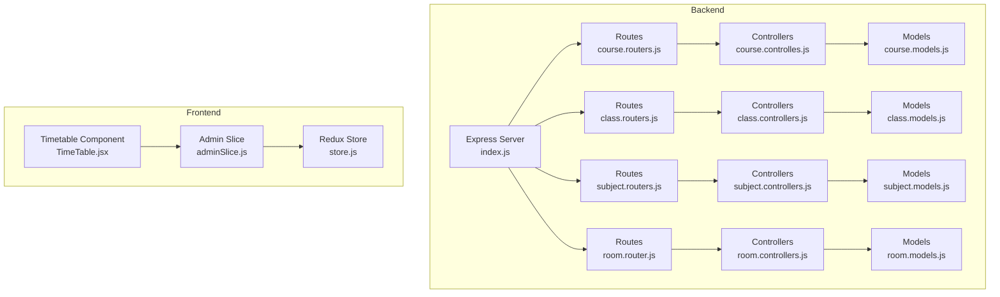
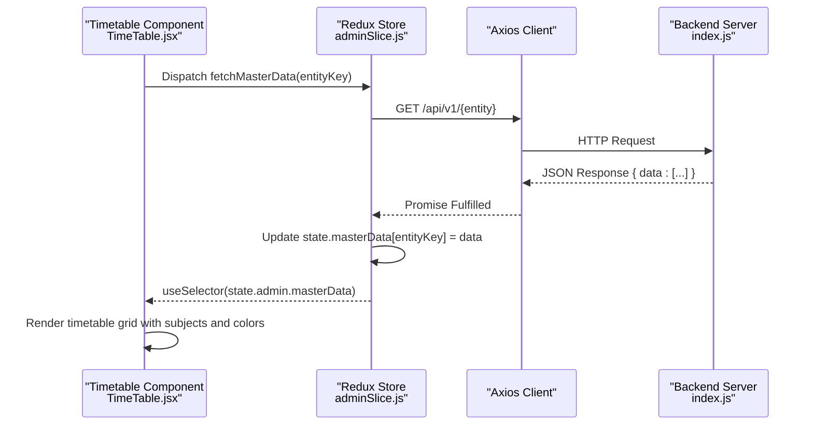
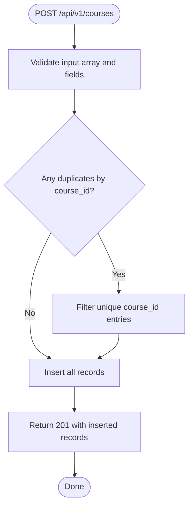
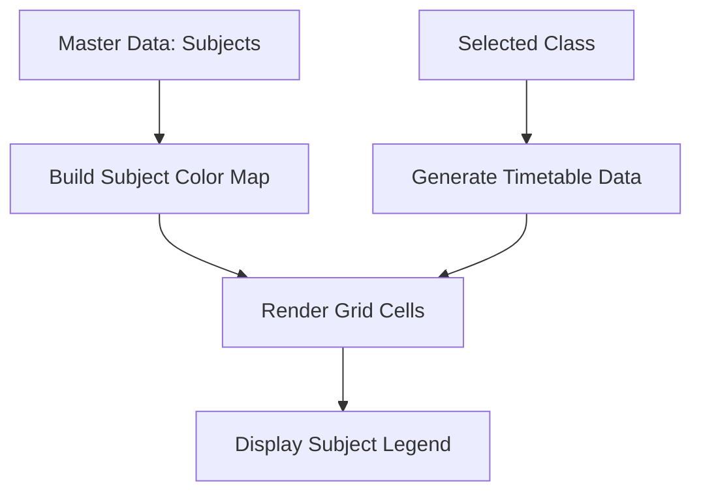
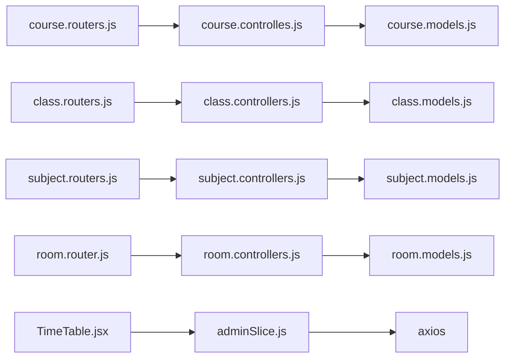

# Data Integration & API Connectivity

<cite>
**Referenced Files in This Document**
- [index.js](file://Backend/src/index.js)
- [server.js](file://Backend/src/server.js)
- [course.routers.js](file://Backend/src/routes/course.routers.js)
- [class.routers.js](file://Backend/src/routes/class.routers.js)
- [subject.routers.js](file://Backend/src/routes/subject.routers.js)
- [room.router.js](file://Backend/src/routes/room.router.js)
- [course.controlles.js](file://Backend/src/controllers/course.controlles.js)
- [class.controllers.js](file://Backend/src/controllers/class.controllers.js)
- [subject.controllers.js](file://Backend/src/controllers/subject.controllers.js)
- [room.controllers.js](file://Backend/src/controllers/room.controllers.js)
- [course.models.js](file://Backend/src/models/course.models.js)
- [class.models.js](file://Backend/src/models/class.models.js)
- [subject.models.js](file://Backend/src/models/subject.models.js)
- [room.models.js](file://Backend/src/models/room.models.js)
- [store.js](file://Client/src/store/store.js)
- [adminSlice.js](file://Client/src/store/admin/adminSlice.js)
- [TimeTable.jsx](file://Client/src/components/deshboard/TimeTable.jsx)
</cite>

## Table of Contents
1. [Introduction](#introduction)
2. [Project Structure](#project-structure)
3. [Core Components](#core-components)
4. [Architecture Overview](#architecture-overview)
5. [Detailed Component Analysis](#detailed-component-analysis)
6. [Dependency Analysis](#dependency-analysis)
7. [Performance Considerations](#performance-considerations)
8. [Troubleshooting Guide](#troubleshooting-guide)
9. [Conclusion](#conclusion)

## Introduction
This document explains how the frontend timetable components integrate with backend scheduling services. It covers Redux store integration for managing master data, filters, and user selections; documents the API endpoints for fetching courses, classes, subjects, and rooms; details data transformation from backend responses to frontend display formats; describes real-time synchronization and caching strategies; outlines error handling and fallback mechanisms; and provides performance optimization techniques for large datasets.

## Project Structure
The system comprises:
- Backend: Express server exposing REST endpoints for master data entities (courses, classes, subjects, rooms), with Mongoose models and controllers implementing CRUD operations.
- Frontend: React application using Redux Toolkit to manage master data, loading states, and errors. The timetable component renders filtered views based on Redux state and displays a grid layout.



**Diagram sources**
- [index.js:1-18](file://Backend/src/index.js#L1-L18)
- [course.routers.js:1-24](file://Backend/src/routes/course.routers.js#L1-L24)
- [class.routers.js:1-24](file://Backend/src/routes/class.routers.js#L1-L24)
- [subject.routers.js:1-24](file://Backend/src/routes/subject.routers.js#L1-L24)
- [room.router.js:1-23](file://Backend/src/routes/room.router.js#L1-L23)
- [course.controlles.js:1-136](file://Backend/src/controllers/course.controlles.js#L1-L136)
- [class.controllers.js:1-179](file://Backend/src/controllers/class.controllers.js#L1-L179)
- [subject.controllers.js:1-130](file://Backend/src/controllers/subject.controllers.js#L1-L130)
- [room.controllers.js:1-133](file://Backend/src/controllers/room.controllers.js#L1-L133)
- [course.models.js:1-33](file://Backend/src/models/course.models.js#L1-L33)
- [class.models.js:1-32](file://Backend/src/models/class.models.js#L1-L32)
- [subject.models.js:1-33](file://Backend/src/models/subject.models.js#L1-L33)
- [room.models.js:1-28](file://Backend/src/models/room.models.js#L1-L28)
- [store.js:1-15](file://Client/src/store/store.js#L1-L15)
- [adminSlice.js:1-173](file://Client/src/store/admin/adminSlice.js#L1-L173)
- [TimeTable.jsx:1-370](file://Client/src/components/deshboard/TimeTable.jsx#L1-L370)

**Section sources**
- [index.js:1-18](file://Backend/src/index.js#L1-L18)
- [store.js:1-15](file://Client/src/store/store.js#L1-L15)

## Core Components
- Backend server initialization and port binding.
- REST endpoints for master data entities:
  - Courses: create, list, get by id, get by course_id, update, delete.
  - Classes: create, list, get by id, get by class_id, update, delete.
  - Subjects: create, list, get by id, get by subject_id, update, delete.
  - Rooms: create, list, get by id, update, delete.
- Frontend Redux store with an admin slice handling asynchronous CRUD actions against the backend and maintaining master data in state.
- Timetable component rendering a grid based on selected filters and subject color mapping.

**Section sources**
- [index.js:1-18](file://Backend/src/index.js#L1-L18)
- [course.routers.js:1-24](file://Backend/src/routes/course.routers.js#L1-L24)
- [class.routers.js:1-24](file://Backend/src/routes/class.routers.js#L1-L24)
- [subject.routers.js:1-24](file://Backend/src/routes/subject.routers.js#L1-L24)
- [room.router.js:1-23](file://Backend/src/routes/room.router.js#L1-L23)
- [store.js:1-15](file://Client/src/store/store.js#L1-L15)
- [adminSlice.js:1-173](file://Client/src/store/admin/adminSlice.js#L1-L173)
- [TimeTable.jsx:1-370](file://Client/src/components/deshboard/TimeTable.jsx#L1-L370)

## Architecture Overview
The frontend integrates with backend APIs via Redux Thunk actions. The admin slice defines async thunks to fetch, add, update, and delete master data. Responses populate the Redux store under a masterData map keyed by entity type. The timetable component subscribes to Redux state to render filtered views and color-coded subjects.



**Diagram sources**
- [adminSlice.js:24-78](file://Client/src/store/admin/adminSlice.js#L24-L78)
- [adminSlice.js:104-168](file://Client/src/store/admin/adminSlice.js#L104-L168)
- [index.js:1-18](file://Backend/src/index.js#L1-L18)

## Detailed Component Analysis

### Backend API Endpoints and Controllers
- Courses
  - Endpoints: POST /api/v1/courses, GET /api/v1/courses, GET /api/v1/courses/:id, GET /api/v1/courses/:course_id, PUT /api/v1/courses/:id, DELETE /api/v1/courses/:id.
  - Controller responsibilities: validate input arrays, deduplicate by course_id, insert unique records, handle updates/deletes, and return standardized responses.
- Classes
  - Endpoints: POST /api/v1/classes, GET /api/v1/classes, GET /api/v1/classes/:id, GET /api/v1/classes/:class_id, PUT /api/v1/classes/:id, DELETE /api/v1/classes/:id.
  - Controller responsibilities: aggregation joins with program and course collections, deduplicate by class_id, and return enriched documents.
- Subjects
  - Endpoints: POST /api/v1/subjects, GET /api/v1/subjects, GET /api/v1/subjects/:id, GET /api/v1/subjects/subject/:subject_id, PUT /api/v1/subjects/:id, DELETE /api/v1/subjects/:id.
  - Controller responsibilities: validate required fields, ensure uniqueness, and support CRUD operations.
- Rooms
  - Endpoints: POST /api/v1/rooms, GET /api/v1/rooms, GET /api/v1/rooms/:id, PUT /api/v1/rooms/:id, DELETE /api/v1/rooms/:id.
  - Controller responsibilities: validate presence of room_no, floor_no, and wing; enforce uniqueness; and support CRUD operations.



**Diagram sources**
- [course.controlles.js:5-40](file://Backend/src/controllers/course.controlles.js#L5-L40)

**Section sources**
- [course.routers.js:1-24](file://Backend/src/routes/course.routers.js#L1-L24)
- [course.controlles.js:1-136](file://Backend/src/controllers/course.controlles.js#L1-L136)
- [class.routers.js:1-24](file://Backend/src/routes/class.routers.js#L1-L24)
- [class.controllers.js:1-179](file://Backend/src/controllers/class.controllers.js#L1-L179)
- [subject.routers.js:1-24](file://Backend/src/routes/subject.routers.js#L1-L24)
- [subject.controllers.js:1-130](file://Backend/src/controllers/subject.controllers.js#L1-L130)
- [room.router.js:1-23](file://Backend/src/routes/room.router.js#L1-L23)
- [room.controllers.js:1-133](file://Backend/src/controllers/room.controllers.js#L1-L133)

### Frontend Redux Integration (Admin Slice)
- Async thunks:
  - fetchMasterData(entityKey): GET /api/v1/{entity}, stores normalized data under state.masterData[entityKey].
  - addMasterData({ entityKey, data }): POST /api/v1/{entity}.
  - updateMasterData({ entityKey, id, data }): PUT /api/v1/{entity}/{id}.
  - deleteMasterData({ entityKey, id }): DELETE /api/v1/{entity}/{id}.
- Reducer updates:
  - pending: set loading true and clear error.
  - fulfilled: update masterData, append new item on add, replace on update, remove on delete.
  - rejected: set loading false and capture error message.
- Axios client configured with credentials and base URL /api/v1.

```mermaid
classDiagram
class AdminSlice {
+masterData : Map
+activeEntity : string
+editingEntityId : string
+loading : boolean
+error : string
+setActiveEntity(payload)
+setEditingEntityId(payload)
+clearError()
}
class Thunks {
+fetchMasterData(entityKey)
+addMasterData({entityKey,data})
+updateMasterData({entityKey,id,data})
+deleteMasterData({entityKey,id})
}
AdminSlice <.. Thunks : "extraReducers handle"
```

**Diagram sources**
- [adminSlice.js:80-173](file://Client/src/store/admin/adminSlice.js#L80-L173)

**Section sources**
- [adminSlice.js:1-173](file://Client/src/store/admin/adminSlice.js#L1-L173)

### Timetable Component and Data Transformation
- Filters:
  - Course filter drives Class dropdown; Class filter drives Division dropdown.
  - Selected values are stored locally in component state and used to compute filtered lists from Redux masterData.
- Subject Color Mapping:
  - A fixed palette is mapped per subject_id for consistent display.
- Timetable Generation:
  - A sample generator creates a grid of days and time slots, assigning subjects and rooms for demonstration.
  - Actual timetable generation would consume backend-provided class schedules and room allocations.
- Rendering:
  - Displays a responsive grid with theory periods and break placeholders.
  - Uses subject color map for cell styling and a legend for quick identification.



**Diagram sources**
- [TimeTable.jsx:62-110](file://Client/src/components/deshboard/TimeTable.jsx#L62-L110)

**Section sources**
- [TimeTable.jsx:1-370](file://Client/src/components/deshboard/TimeTable.jsx#L1-L370)

### Real-Time Synchronization and Caching Strategies
- Current state:
  - The admin slice fetches master data via async thunks and stores it in Redux state. There is no explicit polling or WebSocket integration in the provided code.
- Recommended strategies:
  - Caching: Use Redux state as cache; invalidate on add/update/delete actions.
  - Background refresh: Periodically re-fetch master data on visibility change or idle detection.
  - Optimistic updates: Apply UI changes immediately on add/update/delete and reconcile with server response.
  - Conflict resolution: On update, merge server-side changes with local optimistic updates.

[No sources needed since this section provides general guidance]

### Error Handling and Fallback Mechanisms
- Backend:
  - Controllers throw structured errors for missing fields, duplicates, not found, and validation failures; responses use ApiResponse/ApiError utilities.
- Frontend:
  - Async thunks catch errors and dispatch rejected actions with messages; reducers set loading false and persist error text.
  - Timetable component gracefully handles empty selections and displays guidance.

**Section sources**
- [course.controlles.js:8-40](file://Backend/src/controllers/course.controlles.js#L8-L40)
- [class.controllers.js:6-37](file://Backend/src/controllers/class.controllers.js#L6-L37)
- [subject.controllers.js:11-41](file://Backend/src/controllers/subject.controllers.js#L11-L41)
- [room.controllers.js:10-46](file://Backend/src/controllers/room.controllers.js#L10-L46)
- [adminSlice.js:24-78](file://Client/src/store/admin/adminSlice.js#L24-L78)
- [adminSlice.js:104-168](file://Client/src/store/admin/adminSlice.js#L104-L168)
- [TimeTable.jsx:213-235](file://Client/src/components/deshboard/TimeTable.jsx#L213-L235)

### Integration Patterns Between Timetable Generation and Master Data
- Master data flow:
  - Courses, Classes, Subjects, Rooms are fetched independently and stored under entity keys.
  - The timetable component composes filters from these entities to narrow down visible data.
- Data transformation:
  - Backend returns normalized documents; frontend reducers store arrays keyed by entity.
  - The component transforms these into dropdown options and color maps for rendering.

**Section sources**
- [adminSlice.js:6-16](file://Client/src/store/admin/adminSlice.js#L6-L16)
- [TimeTable.jsx:63-105](file://Client/src/components/deshboard/TimeTable.jsx#L63-L105)

## Dependency Analysis
- Backend dependencies:
  - Routes depend on controllers; controllers depend on models and utility handlers; server initialization connects to the database and listens on a port.
- Frontend dependencies:
  - Admin slice depends on axios for HTTP requests and Redux for state management.
  - Timetable component depends on Redux selectors and memoized computations for performance.



**Diagram sources**
- [course.routers.js:1-24](file://Backend/src/routes/course.routers.js#L1-L24)
- [class.routers.js:1-24](file://Backend/src/routes/class.routers.js#L1-L24)
- [subject.routers.js:1-24](file://Backend/src/routes/subject.routers.js#L1-L24)
- [room.router.js:1-23](file://Backend/src/routes/room.router.js#L1-L23)
- [course.controlles.js:1-136](file://Backend/src/controllers/course.controlles.js#L1-L136)
- [class.controllers.js:1-179](file://Backend/src/controllers/class.controllers.js#L1-L179)
- [subject.controllers.js:1-130](file://Backend/src/controllers/subject.controllers.js#L1-L130)
- [room.controllers.js:1-133](file://Backend/src/controllers/room.controllers.js#L1-L133)
- [course.models.js:1-33](file://Backend/src/models/course.models.js#L1-L33)
- [class.models.js:1-32](file://Backend/src/models/class.models.js#L1-L32)
- [subject.models.js:1-33](file://Backend/src/models/subject.models.js#L1-L33)
- [room.models.js:1-28](file://Backend/src/models/room.models.js#L1-L28)
- [adminSlice.js:18-22](file://Client/src/store/admin/adminSlice.js#L18-L22)
- [TimeTable.jsx:1-370](file://Client/src/components/deshboard/TimeTable.jsx#L1-L370)

**Section sources**
- [index.js:1-18](file://Backend/src/index.js#L1-L18)
- [store.js:1-15](file://Client/src/store/store.js#L1-L15)

## Performance Considerations
- Frontend
  - Memoization: Use useMemo for derived lists (e.g., filtered classes, divisions) and color maps to avoid unnecessary recalculations.
  - Virtualization: For large grids, consider virtualizing rows/columns to reduce DOM nodes.
  - Debounced filters: Debounce rapid filter changes to limit re-renders.
- Backend
  - Indexing: Ensure unique and frequently queried fields are indexed (e.g., course_id, class_id, subject_id).
  - Aggregation pipeline: Use $lookup and $unwind efficiently; limit projection and pagination for large collections.
  - Batch operations: Accept arrays for bulk inserts to minimize round trips.
- Caching
  - Client-side: Keep masterData in Redux; invalidate on mutations.
  - Server-side: Consider Redis for hot master data sets if traffic grows.

[No sources needed since this section provides general guidance]

## Troubleshooting Guide
- API connectivity
  - Verify backend server is running and listening on the expected port.
  - Confirm axios base URL matches backend route prefixes.
- Authentication and cookies
  - Ensure credentials are enabled for cross-origin requests if applicable.
- Data shape mismatches
  - Normalize backend responses to match frontend expectations; reducers currently accept either data or nested data fields.
- Validation errors
  - Backend throws explicit errors for missing fields or duplicates; inspect error messages returned by thunks.
- UI not updating
  - Ensure reducers correctly update arrays and objects; confirm useSelector subscriptions are active.

**Section sources**
- [index.js:13-15](file://Backend/src/index.js#L13-L15)
- [adminSlice.js:18-22](file://Client/src/store/admin/adminSlice.js#L18-L22)
- [adminSlice.js:111-118](file://Client/src/store/admin/adminSlice.js#L111-L118)
- [course.controlles.js:8-18](file://Backend/src/controllers/course.controlles.js#L8-L18)
- [class.controllers.js:9-16](file://Backend/src/controllers/class.controllers.js#L9-L16)
- [subject.controllers.js:11-19](file://Backend/src/controllers/subject.controllers.js#L11-L19)
- [room.controllers.js:10-17](file://Backend/src/controllers/room.controllers.js#L10-L17)

## Conclusion
The frontend-backend integration leverages Redux Thunk actions to manage master data lifecycle and the timetable component to present filtered, color-coded timetables. While the current implementation focuses on static master data retrieval, extending it with optimistic updates, background refresh, and virtualization will improve responsiveness and scalability for larger datasets.