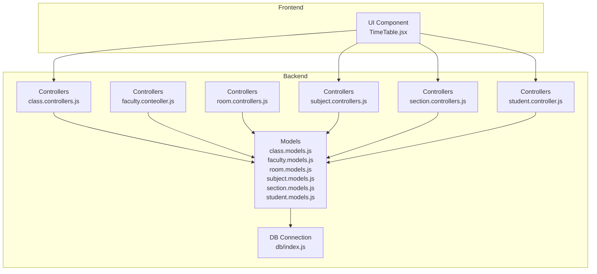
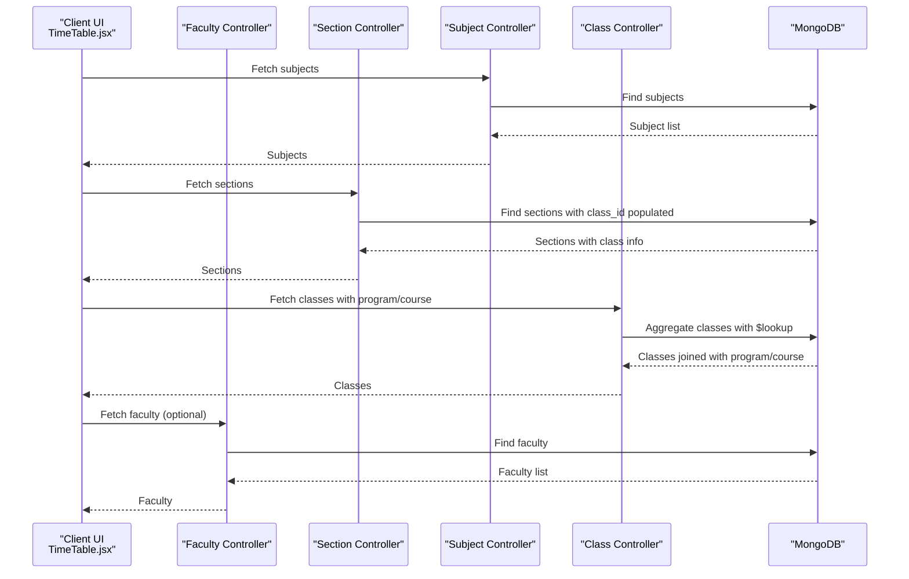
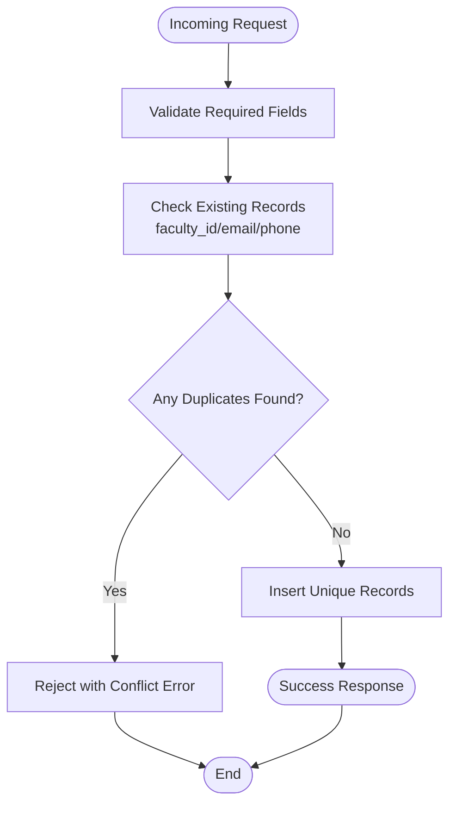
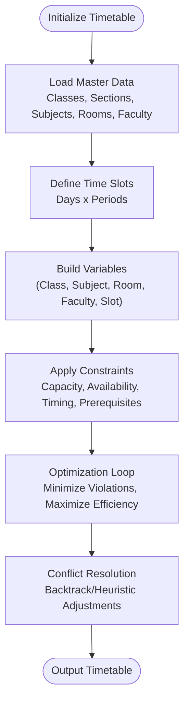
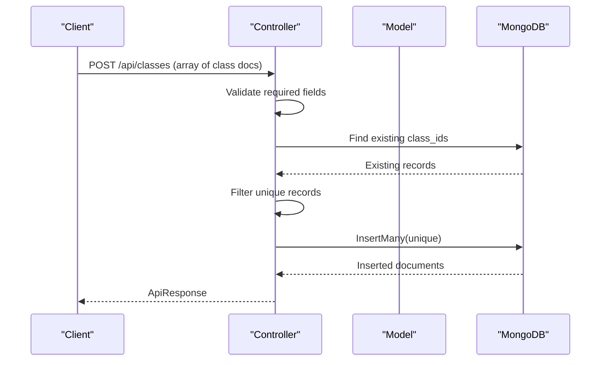
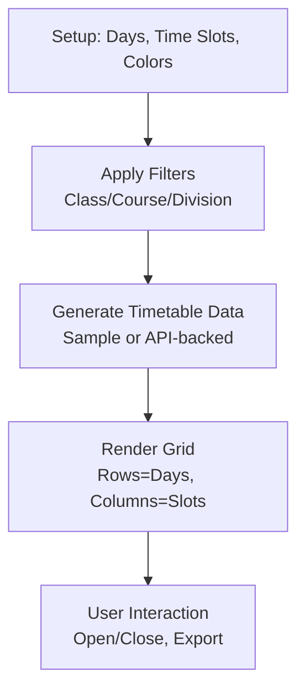
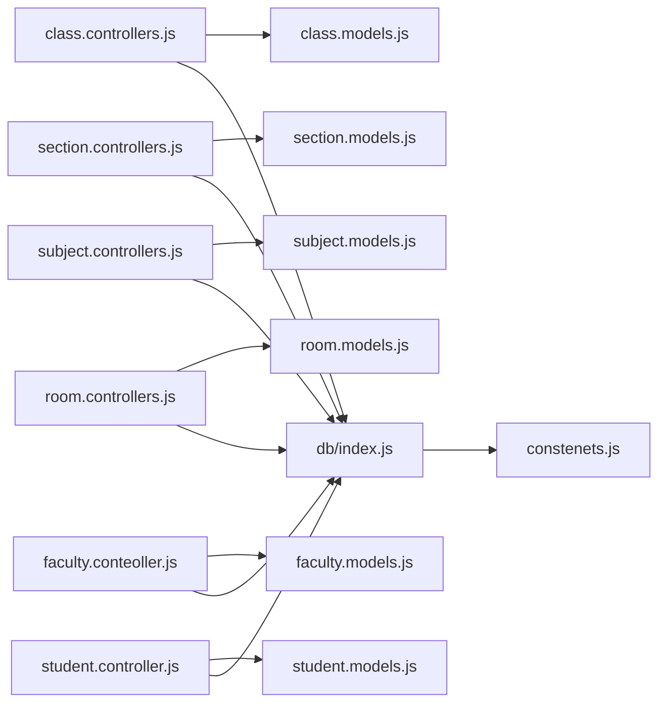

# Scheduling Algorithm & Constraint Management

<cite>
**Referenced Files in This Document**
- [class.controllers.js](file://Backend/src/controllers/class.controllers.js)
- [class.models.js](file://Backend/src/models/class.models.js)
- [faculty.conteoller.js](file://Backend/src/controllers/faculty.conteoller.js)
- [faculty.models.js](file://Backend/src/models/faculty.models.js)
- [room.controllers.js](file://Backend/src/controllers/room.controllers.js)
- [room.models.js](file://Backend/src/models/room.models.js)
- [subject.controllers.js](file://Backend/src/controllers/subject.controllers.js)
- [subject.models.js](file://Backend/src/models/subject.models.js)
- [section.controllers.js](file://Backend/src/controllers/section.controllers.js)
- [section.models.js](file://Backend/src/models/section.models.js)
- [student.controller.js](file://Backend/src/controllers/student.controller.js)
- [student.models.js](file://Backend/src/models/student.models.js)
- [db/index.js](file://Backend/src/db/index.js)
- [constenets.js](file://Backend/src/constenets.js)
- [TimeTable.jsx](file://Client/src/components/deshboard/TimeTable.jsx)
</cite>

## Table of Contents
1. [Introduction](#introduction)
2. [Project Structure](#project-structure)
3. [Core Components](#core-components)
4. [Architecture Overview](#architecture-overview)
5. [Detailed Component Analysis](#detailed-component-analysis)
6. [Dependency Analysis](#dependency-analysis)
7. [Performance Considerations](#performance-considerations)
8. [Troubleshooting Guide](#troubleshooting-guide)
9. [Conclusion](#conclusion)
10. [Appendices](#appendices)

## Introduction
This document explains the timetable scheduling algorithm and constraint management system implemented in the backend and visualized in the frontend. It focuses on how classes, subjects, rooms, faculty, and student groups are modeled, validated, and integrated into a scheduling pipeline. The current backend provides robust CRUD controllers and models for master data, while the frontend demonstrates a weekly timetable grid with time slots and color-coded subjects. The scheduling logic and constraint validation are designed to avoid conflicts among rooms, faculty, and student groups, and to respect room capacity, faculty availability, subject prerequisites, and timing constraints.

## Project Structure
The backend follows a layered architecture:
- Controllers handle HTTP requests and orchestrate data retrieval/updates.
- Models define Mongoose schemas for entities such as Classes, Subjects, Rooms, Faculty, Sections, and Students.
- Database connection is centralized and environment-aware.
- Routes wire controllers to endpoints.
- The frontend renders a weekly timetable grid and supports filtering by class/course/division.



**Diagram sources**
- [class.controllers.js:1-179](file://Backend/src/controllers/class.controllers.js#L1-L179)
- [faculty.conteoller.js:1-229](file://Backend/src/controllers/faculty.conteoller.js#L1-L229)
- [room.controllers.js:1-133](file://Backend/src/controllers/room.controllers.js#L1-L133)
- [subject.controllers.js:1-130](file://Backend/src/controllers/subject.controllers.js#L1-L130)
- [section.controllers.js:1-137](file://Backend/src/controllers/section.controllers.js#L1-L137)
- [student.controller.js:1-209](file://Backend/src/controllers/student.controller.js#L1-L209)
- [class.models.js:1-32](file://Backend/src/models/class.models.js#L1-L32)
- [faculty.models.js:1-77](file://Backend/src/models/faculty.models.js#L1-L77)
- [room.models.js:1-28](file://Backend/src/models/room.models.js#L1-L28)
- [subject.models.js:1-33](file://Backend/src/models/subject.models.js#L1-L33)
- [section.models.js:1-31](file://Backend/src/models/section.models.js#L1-L31)
- [student.models.js:1-66](file://Backend/src/models/student.models.js#L1-L66)
- [db/index.js:1-19](file://Backend/src/db/index.js#L1-L19)
- [TimeTable.jsx:1-267](file://Client/src/components/deshboard/TimeTable.jsx#L1-L267)

**Section sources**
- [class.controllers.js:1-179](file://Backend/src/controllers/class.controllers.js#L1-L179)
- [faculty.conteoller.js:1-229](file://Backend/src/controllers/faculty.conteoller.js#L1-L229)
- [room.controllers.js:1-133](file://Backend/src/controllers/room.controllers.js#L1-L133)
- [subject.controllers.js:1-130](file://Backend/src/controllers/subject.controllers.js#L1-L130)
- [section.controllers.js:1-137](file://Backend/src/controllers/section.controllers.js#L1-L137)
- [student.controller.js:1-209](file://Backend/src/controllers/student.controller.js#L1-L209)
- [class.models.js:1-32](file://Backend/src/models/class.models.js#L1-L32)
- [faculty.models.js:1-77](file://Backend/src/models/faculty.models.js#L1-L77)
- [room.models.js:1-28](file://Backend/src/models/room.models.js#L1-L28)
- [subject.models.js:1-33](file://Backend/src/models/subject.models.js#L1-L33)
- [section.models.js:1-31](file://Backend/src/models/section.models.js#L1-L31)
- [student.models.js:1-66](file://Backend/src/models/student.models.js#L1-L66)
- [db/index.js:1-19](file://Backend/src/db/index.js#L1-L19)
- [constenets.js:1-1](file://Backend/src/constenets.js#L1-L1)
- [TimeTable.jsx:1-267](file://Client/src/components/deshboard/TimeTable.jsx#L1-L267)

## Core Components
This section outlines the core entities and their roles in the scheduling ecosystem:
- Classes: Represent academic cohorts with program and course linkage.
- Sections: Subgroups within classes (e.g., divisions).
- Subjects: Courses with credits and identifiers.
- Rooms: Physical locations with floor and wing metadata.
- Faculty: Instructors with specialization and availability attributes.
- Students: Learners grouped by class, batch, and specialization.

Key backend controllers and models:
- Class controller and model manage class registration, retrieval, updates, and deletion.
- Section controller and model manage section creation and population.
- Subject controller and model manage subject lifecycle.
- Room controller and model manage room addition and updates.
- Faculty controller and model manage faculty registration and updates.
- Student controller and model manage student enrollment and updates.

Validation and uniqueness:
- Controllers enforce presence checks and uniqueness constraints for identifiers and contact details.
- Aggregation joins are used to enrich class data with program and course details.

**Section sources**
- [class.controllers.js:1-179](file://Backend/src/controllers/class.controllers.js#L1-L179)
- [class.models.js:1-32](file://Backend/src/models/class.models.js#L1-L32)
- [section.controllers.js:1-137](file://Backend/src/controllers/section.controllers.js#L1-L137)
- [section.models.js:1-31](file://Backend/src/models/section.models.js#L1-L31)
- [subject.controllers.js:1-130](file://Backend/src/controllers/subject.controllers.js#L1-L130)
- [subject.models.js:1-33](file://Backend/src/models/subject.models.js#L1-L33)
- [room.controllers.js:1-133](file://Backend/src/controllers/room.controllers.js#L1-L133)
- [room.models.js:1-28](file://Backend/src/models/room.models.js#L1-L28)
- [faculty.conteoller.js:1-229](file://Backend/src/controllers/faculty.conteoller.js#L1-L229)
- [faculty.models.js:1-77](file://Backend/src/models/faculty.models.js#L1-L77)
- [student.controller.js:1-209](file://Backend/src/controllers/student.controller.js#L1-L209)
- [student.models.js:1-66](file://Backend/src/models/student.models.js#L1-L66)

## Architecture Overview
The scheduling architecture integrates frontend visualization with backend data management:
- Frontend: Renders a weekly timetable grid with fixed time slots and days, color-coding subjects, and filter controls for class/course/division.
- Backend: Provides REST endpoints for master data CRUD operations and aggregation queries to join related entities.



**Diagram sources**
- [TimeTable.jsx:1-267](file://Client/src/components/deshboard/TimeTable.jsx#L1-L267)
- [subject.controllers.js:1-130](file://Backend/src/controllers/subject.controllers.js#L1-L130)
- [section.controllers.js:1-137](file://Backend/src/controllers/section.controllers.js#L1-L137)
- [class.controllers.js:1-179](file://Backend/src/controllers/class.controllers.js#L1-L179)
- [faculty.conteoller.js:1-229](file://Backend/src/controllers/faculty.conteoller.js#L1-L229)

## Detailed Component Analysis

### Data Models Overview
The following diagram shows the core entities and their relationships:

```mermaid
erDiagram
CLASS {
string class_id PK
number year
objectid program_id FK
objectid course_id FK
}
SECTION {
string section_name
objectid class_id FK
string discraption
}
SUBJECT {
string subject_id PK
string subject_name
number credit
boolean isActive
}
ROOM {
string room_no PK
number floor_no
string wing
}
FACULTY {
string faculty_id PK
string faculty_name
string email UK
number phone UK
string specialization
string higher_qualification
number years_of_Experience
string gender
date date_of_joining
date date_of_birth
string address
boolean isActive
}
STUDENT {
string student_id PK
string student_name
string email UK
string class
string batch
string date_of_birth
string specialization
string division
}
CLASS ||--o{ SECTION : "has"
CLASS ||--o{ STUDENT : "enrolls"
SUBJECT ||--o{ CLASS : "offered_in"
ROOM ||--o{ CLASS : "allocated_for"
FACULTY ||--o{ CLASS : "teaches"
```

**Diagram sources**
- [class.models.js:1-32](file://Backend/src/models/class.models.js#L1-L32)
- [section.models.js:1-31](file://Backend/src/models/section.models.js#L1-L31)
- [subject.models.js:1-33](file://Backend/src/models/subject.models.js#L1-L33)
- [room.models.js:1-28](file://Backend/src/models/room.models.js#L1-L28)
- [faculty.models.js:1-77](file://Backend/src/models/faculty.models.js#L1-L77)
- [student.models.js:1-66](file://Backend/src/models/student.models.js#L1-L66)

### Constraint Validation System
The backend enforces constraints at the controller level:
- Uniqueness: Faculty registration prevents duplicates by checking faculty_id, email, and phone across incoming records.
- Presence: Controllers validate required fields before insertion or updates.
- Existence: Aggregation joins ensure related entities (program, course) are present when fetching classes.
- Integrity: Unique room numbers and unique subject identifiers prevent duplication.



**Diagram sources**
- [faculty.conteoller.js:14-94](file://Backend/src/controllers/faculty.conteoller.js#L14-L94)

**Section sources**
- [faculty.conteoller.js:14-94](file://Backend/src/controllers/faculty.conteoller.js#L14-L94)
- [room.controllers.js:10-46](file://Backend/src/controllers/room.controllers.js#L10-L46)
- [subject.controllers.js:11-41](file://Backend/src/controllers/subject.controllers.js#L11-L41)
- [class.controllers.js:9-37](file://Backend/src/controllers/class.controllers.js#L9-L37)
- [section.controllers.js:9-47](file://Backend/src/controllers/section.controllers.js#L9-L47)

### Automated Scheduling Logic and Conflict Resolution
Current implementation highlights:
- Master data management: The backend provides robust CRUD and aggregation for classes, sections, subjects, rooms, faculty, and students.
- Frontend visualization: The UI defines a weekly grid with fixed time slots and days, and color-codes subjects for readability.
- Missing scheduling engine: There is no dedicated CSP solver or genetic algorithm implementation in the provided backend code. The scheduling logic and optimization criteria are not present in the backend controllers or models.

Recommendations for implementing scheduling:
- Define a time slot model with day, start/end times, and break periods.
- Build a constraint satisfaction formulation:
  - Variables: (Class, Subject, Room, Faculty, TimeSlot)
  - Domains: Available rooms, available faculty, feasible time windows
  - Constraints:
    - Room capacity >= student group size
    - Faculty availability per time slot
    - No overlapping classes for the same faculty or room
    - Subject prerequisites satisfied by prior periods
- Optimization criteria:
  - Minimize hard constraint violations
  - Maximize resource utilization efficiency
  - Prefer balanced workloads for faculty
  - Minimize room changes between consecutive classes for the same group



[No sources needed since this diagram shows conceptual workflow, not actual code structure]

### Backend Controller Logic for Scheduling Requests
While a dedicated scheduler is not implemented, the controllers demonstrate request validation and response patterns suitable for integrating scheduling logic:
- Class controller: Validates class_id and year, deduplicates incoming records, and aggregates class data with program/course.
- Section controller: Validates section_name and class_id, filters unique entries, and populates class_id on retrieval.
- Subject controller: Validates subject_id, subject_name, and credit, and inserts unique subjects.
- Room controller: Validates room_no, floor_no, and wing, ensures uniqueness, and inserts rooms.
- Faculty controller: Validates comprehensive faculty fields, deduplicates by faculty_id/email/phone, and inserts records.
- Student controller: Validates student fields, deduplicates by student_id/email, and inserts records.



**Diagram sources**
- [class.controllers.js:6-37](file://Backend/src/controllers/class.controllers.js#L6-L37)

**Section sources**
- [class.controllers.js:6-37](file://Backend/src/controllers/class.controllers.js#L6-L37)
- [section.controllers.js:6-47](file://Backend/src/controllers/section.controllers.js#L6-L47)
- [subject.controllers.js:6-41](file://Backend/src/controllers/subject.controllers.js#L6-L41)
- [room.controllers.js:7-46](file://Backend/src/controllers/room.controllers.js#L7-L46)
- [faculty.conteoller.js:7-103](file://Backend/src/controllers/faculty.conteoller.js#L7-L103)
- [student.controller.js:7-91](file://Backend/src/controllers/student.controller.js#L7-L91)

### Frontend Timetable Visualization
The frontend component defines:
- Days of the week and fixed time slots with breaks.
- Color mapping for subjects to visually distinguish classes.
- Filtering by class, course, and division.
- A grid layout rendering subject, faculty, and room assignments.



**Diagram sources**
- [TimeTable.jsx:24-105](file://Client/src/components/deshboard/TimeTable.jsx#L24-L105)

**Section sources**
- [TimeTable.jsx:24-105](file://Client/src/components/deshboard/TimeTable.jsx#L24-L105)

## Dependency Analysis
The backend controllers depend on:
- Models for schema enforcement and data persistence.
- Utility modules for async handling and standardized responses.
- Database connection module for environment-driven connectivity.



**Diagram sources**
- [class.controllers.js:1-5](file://Backend/src/controllers/class.controllers.js#L1-L5)
- [section.controllers.js:1-4](file://Backend/src/controllers/section.controllers.js#L1-L4)
- [subject.controllers.js:1-4](file://Backend/src/controllers/subject.controllers.js#L1-L4)
- [room.controllers.js:1-5](file://Backend/src/controllers/room.controllers.js#L1-L5)
- [faculty.conteoller.js:1-5](file://Backend/src/controllers/faculty.conteoller.js#L1-L5)
- [student.controller.js:1-4](file://Backend/src/controllers/student.controller.js#L1-L4)
- [class.models.js:1-5](file://Backend/src/models/class.models.js#L1-L5)
- [section.models.js:1-5](file://Backend/src/models/section.models.js#L1-L5)
- [subject.models.js:1-5](file://Backend/src/models/subject.models.js#L1-L5)
- [room.models.js:1-5](file://Backend/src/models/room.models.js#L1-L5)
- [faculty.models.js:1-5](file://Backend/src/models/faculty.models.js#L1-L5)
- [student.models.js:1-5](file://Backend/src/models/student.models.js#L1-L5)
- [db/index.js:1-19](file://Backend/src/db/index.js#L1-L19)
- [constenets.js:1-1](file://Backend/src/constenets.js#L1-L1)

**Section sources**
- [db/index.js:1-19](file://Backend/src/db/index.js#L1-L19)
- [constenets.js:1-1](file://Backend/src/constenets.js#L1-L1)

## Performance Considerations
- Database indexing:
  - Add indexes on frequently queried fields such as subject_id, room_no, faculty_id, student_id, and class_id to speed up lookups.
- Aggregation efficiency:
  - Use pipeline stages judiciously; limit $lookup projections and unwind only when necessary.
- Batch operations:
  - Use insertMany for bulk ingestion of classes, sections, subjects, rooms, faculty, and students to reduce round trips.
- Pagination and filtering:
  - Implement pagination for large datasets and apply filters early in queries to minimize result sets.
- Real-time updates:
  - For dynamic timetables, consider caching hot paths and invalidating caches on writes.
- Frontend rendering:
  - Memoize computed data (e.g., subject-color mapping) and avoid unnecessary re-renders.

[No sources needed since this section provides general guidance]

## Troubleshooting Guide
Common issues and resolutions:
- Duplicate identifiers:
  - Faculty registration rejects duplicates by faculty_id, email, and phone; ensure unique inputs.
  - Room addition rejects duplicate room numbers; ensure unique room_no entries.
  - Subject addition rejects duplicates by subject_id; ensure unique subject identifiers.
- Missing required fields:
  - Controllers validate presence of required fields; ensure all mandatory fields are provided.
- Entity not found:
  - Use appropriate 404 responses when entities are missing during read/update/delete operations.
- Database connectivity:
  - Verify MONGODB_URI and DB_NAME environment configuration; ensure the connection string is correct.

**Section sources**
- [faculty.conteoller.js:14-94](file://Backend/src/controllers/faculty.conteoller.js#L14-L94)
- [room.controllers.js:10-46](file://Backend/src/controllers/room.controllers.js#L10-L46)
- [subject.controllers.js:11-41](file://Backend/src/controllers/subject.controllers.js#L11-L41)
- [class.controllers.js:9-37](file://Backend/src/controllers/class.controllers.js#L9-L37)
- [db/index.js:4-16](file://Backend/src/db/index.js#L4-L16)

## Conclusion
The backend provides a solid foundation for timetable scheduling through comprehensive master data management and validation. While a dedicated scheduling engine is not yet implemented, the existing controllers and models can serve as building blocks for integrating constraint satisfaction or heuristic-based algorithms. The frontend offers a practical visualization of weekly timetables with color-coded subjects and filter controls. Future enhancements should focus on implementing the scheduling algorithm, optimizing performance for large calendars, and enabling real-time updates.

## Appendices
- API endpoint patterns:
  - Classes: POST /api/classes, GET /api/classes, GET /api/classes/:id, PUT /api/classes/:id, DELETE /api/classes/:id
  - Sections: POST /api/sections, GET /api/sections, GET /api/sections/:id, PUT /api/sections/:id, DELETE /api/sections/:id
  - Subjects: POST /api/subjects, GET /api/subjects, GET /api/subjects/:id, PUT /api/subjects/:id, DELETE /api/subjects/:id
  - Rooms: POST /api/rooms, GET /api/rooms, GET /api/rooms/:id, PUT /api/rooms/:id, DELETE /api/rooms/:id
  - Faculty: POST /api/faculty, GET /api/faculty, GET /api/faculty/:id, PUT /api/faculty/:id, DELETE /api/faculty/:id
  - Students: POST /api/students, GET /api/students, GET /api/students/:id, PUT /api/students/:id, DELETE /api/students/:id

[No sources needed since this section summarizes without analyzing specific files]