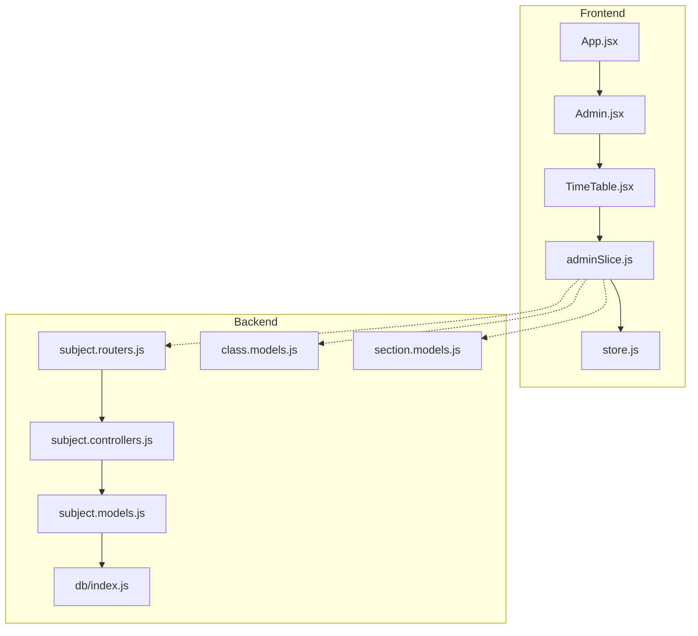
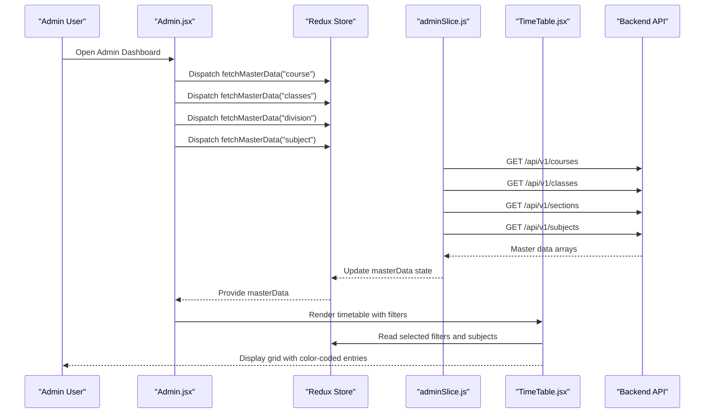
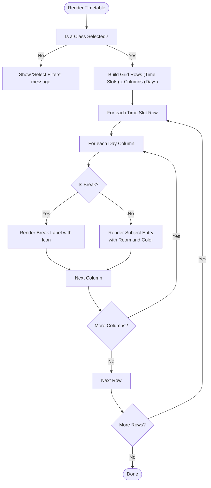
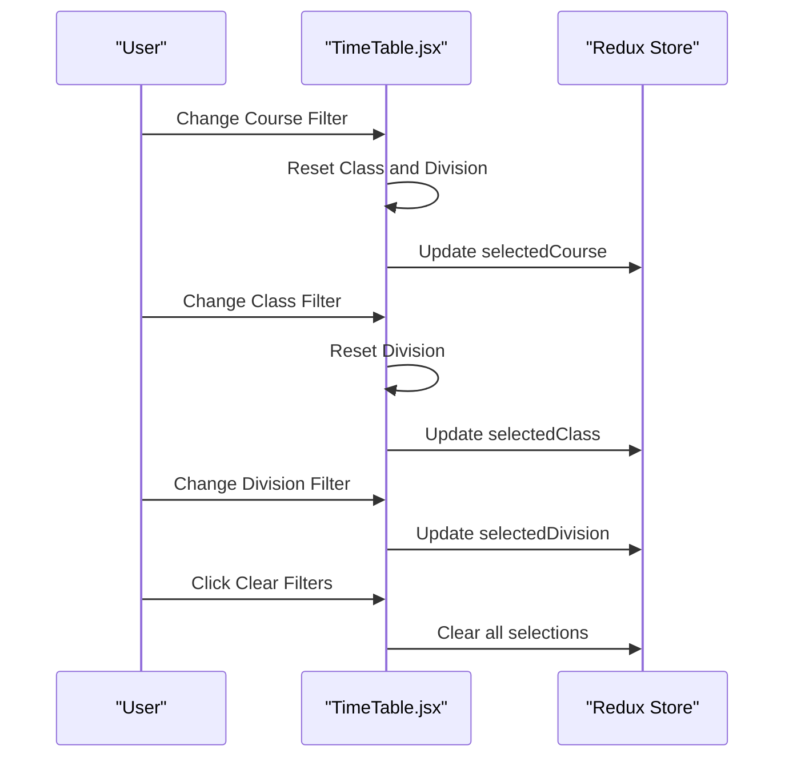
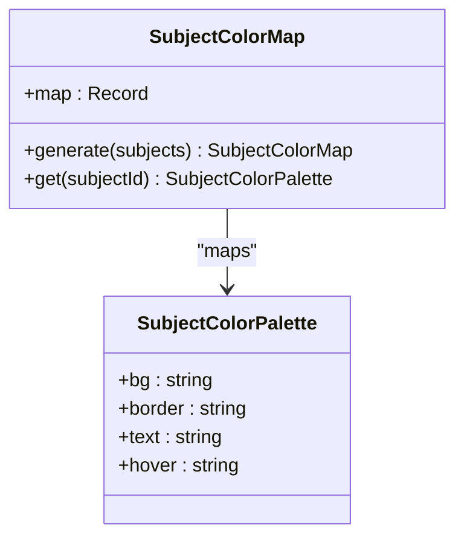
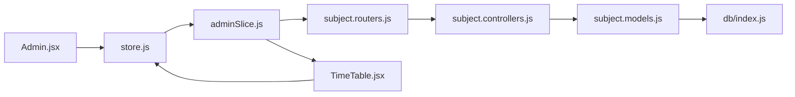

# Time Slot Management & Grid System

<cite>
**Referenced Files in This Document**
- [TimeTable.jsx](file://Client/src/components/deshboard/TimeTable.jsx)
- [adminSlice.js](file://Client/src/store/admin/adminSlice.js)
- [store.js](file://Client/src/store/store.js)
- [Admin.jsx](file://Client/src/pages/dashboard/Admin.jsx)
- [App.jsx](file://Client/src/App.jsx)
- [subject.controllers.js](file://Backend/src/controllers/subject.controllers.js)
- [subject.models.js](file://Backend/src/models/subject.models.js)
- [subject.routers.js](file://Backend/src/routes/subject.routers.js)
- [class.models.js](file://Backend/src/models/class.models.js)
- [section.models.js](file://Backend/src/models/section.models.js)
- [db/index.js](file://Backend/src/db/index.js)
</cite>

## Table of Contents
1. [Introduction](#introduction)
2. [Project Structure](#project-structure)
3. [Core Components](#core-components)
4. [Architecture Overview](#architecture-overview)
5. [Detailed Component Analysis](#detailed-component-analysis)
6. [Dependency Analysis](#dependency-analysis)
7. [Performance Considerations](#performance-considerations)
8. [Troubleshooting Guide](#troubleshooting-guide)
9. [Conclusion](#conclusion)

## Introduction
This document explains the time slot management system and grid-based timetable representation used in the university timetable application. It covers the time slot configuration from 9 AM to 5 PM with breaks and lunch periods, the grid layout with days of the week as columns and time periods as rows, the data structures and filtering mechanisms, and the frontend rendering with responsive design and color-coding for subjects, rooms, and faculty. It also outlines how the system integrates with the backend for master data management.

## Project Structure
The timetable system spans a React frontend and a Node.js/Express backend:
- Frontend (React + Redux Toolkit): Provides the timetable grid, filters, and color-coded rendering.
- Backend (Express + MongoDB): Manages master entities such as subjects, classes, and sections, exposing REST endpoints for CRUD operations.



**Diagram sources**
- [App.jsx:13-38](file://Client/src/App.jsx#L13-L38)
- [Admin.jsx:17-614](file://Client/src/pages/dashboard/Admin.jsx#L17-L614)
- [TimeTable.jsx:62-370](file://Client/src/components/deshboard/TimeTable.jsx#L62-L370)
- [store.js:7-14](file://Client/src/store/store.js#L7-L14)
- [adminSlice.js:88-173](file://Client/src/store/admin/adminSlice.js#L88-L173)
- [subject.controllers.js:6-130](file://Backend/src/controllers/subject.controllers.js#L6-L130)
- [subject.models.js:3-33](file://Backend/src/models/subject.models.js#L3-L33)
- [subject.routers.js:11-23](file://Backend/src/routes/subject.routers.js#L11-L23)
- [class.models.js:3-32](file://Backend/src/models/class.models.js#L3-L32)
- [section.models.js:3-31](file://Backend/src/models/section.models.js#L3-L31)
- [db/index.js:4-18](file://Backend/src/db/index.js#L4-L18)

**Section sources**
- [App.jsx:13-38](file://Client/src/App.jsx#L13-L38)
- [Admin.jsx:28-44](file://Client/src/pages/dashboard/Admin.jsx#L28-L44)
- [TimeTable.jsx:62-105](file://Client/src/components/deshboard/TimeTable.jsx#L62-L105)
- [adminSlice.js:24-78](file://Client/src/store/admin/adminSlice.js#L24-L78)
- [subject.routers.js:11-23](file://Backend/src/routes/subject.routers.js#L11-L23)

## Core Components
- Time slot configuration: Defines nine 1-hour periods from 9 AM to 5 PM, including short break and lunch break markers.
- Grid layout: Rows represent time slots; columns represent days of the week.
- Filtering system: Course → Class → Division cascading filters driven by Redux state.
- Color-coding: Unique color palette per subject for visual differentiation.
- Responsive design: Horizontal scrolling for the timetable grid on small screens; responsive filter controls.

**Section sources**
- [TimeTable.jsx:26-37](file://Client/src/components/deshboard/TimeTable.jsx#L26-L37)
- [TimeTable.jsx:23-21](file://Client/src/components/deshboard/TimeTable.jsx#L23-L21)
- [TimeTable.jsx:68-105](file://Client/src/components/deshboard/TimeTable.jsx#L68-L105)
- [TimeTable.jsx:5-21](file://Client/src/components/deshboard/TimeTable.jsx#L5-L21)

## Architecture Overview
The frontend fetches master data via Redux slices and renders a grid-based timetable. The backend exposes REST endpoints for master entities, enabling creation, retrieval, updates, and deletions.



**Diagram sources**
- [Admin.jsx:28-38](file://Client/src/pages/dashboard/Admin.jsx#L28-L38)
- [adminSlice.js:24-78](file://Client/src/store/admin/adminSlice.js#L24-L78)
- [subject.routers.js:13-21](file://Backend/src/routes/subject.routers.js#L13-L21)
- [TimeTable.jsx:62-105](file://Client/src/components/deshboard/TimeTable.jsx#L62-L105)

## Detailed Component Analysis

### Time Slot Configuration and Grid Layout
- Time slots: Nine slots spanning 9 AM to 5 PM with two break markers.
- Grid: Header row lists days as columns; each time slot row lists periods and labels.
- Break handling: Dedicated rows with distinct styling and emoji indicators for short break and lunch break.
- Period labeling: Each slot includes a time range and a human-readable label.



**Diagram sources**
- [TimeTable.jsx:262-333](file://Client/src/components/deshboard/TimeTable.jsx#L262-L333)
- [TimeTable.jsx:282-330](file://Client/src/components/deshboard/TimeTable.jsx#L282-L330)

**Section sources**
- [TimeTable.jsx:26-37](file://Client/src/components/deshboard/TimeTable.jsx#L26-L37)
- [TimeTable.jsx:264-333](file://Client/src/components/deshboard/TimeTable.jsx#L264-L333)

### Filtering System (Course → Class → Division)
- Course filter populates class options; selecting a course resets dependent filters.
- Class filter populates division options; selecting a class resets division.
- Division filter allows final selection within the chosen class.
- Clear filters button resets all selections.



**Diagram sources**
- [TimeTable.jsx:135-208](file://Client/src/components/deshboard/TimeTable.jsx#L135-L208)

**Section sources**
- [TimeTable.jsx:68-99](file://Client/src/components/deshboard/TimeTable.jsx#L68-L99)
- [TimeTable.jsx:135-208](file://Client/src/components/deshboard/TimeTable.jsx#L135-L208)

### Color-Coding System for Subjects
- Unique color palette per subject derived from a predefined list.
- Color map built from Redux master data subjects.
- Applied to subject cells for background, border, text, and hover states.



**Diagram sources**
- [TimeTable.jsx:5-21](file://Client/src/components/deshboard/TimeTable.jsx#L5-L21)
- [TimeTable.jsx:74-80](file://Client/src/components/deshboard/TimeTable.jsx#L74-L80)
- [TimeTable.jsx:108-110](file://Client/src/components/deshboard/TimeTable.jsx#L108-L110)

**Section sources**
- [TimeTable.jsx:5-21](file://Client/src/components/deshboard/TimeTable.jsx#L5-L21)
- [TimeTable.jsx:74-80](file://Client/src/components/deshboard/TimeTable.jsx#L74-L80)
- [TimeTable.jsx:306-325](file://Client/src/components/deshboard/TimeTable.jsx#L306-L325)

### Responsive Design and Mobile Adaptations
- Horizontal scroll container ensures usability on small screens.
- Filter controls adapt to wrap on smaller viewports.
- Typography scales appropriately with text-sm and text-xs classes.

**Section sources**
- [TimeTable.jsx:264-266](file://Client/src/components/deshboard/TimeTable.jsx#L264-L266)
- [TimeTable.jsx:134-208](file://Client/src/components/deshboard/TimeTable.jsx#L134-L208)

### Backend Integration for Master Data
- Redux slice fetches master data from backend endpoints.
- Subject master data is used to build color maps and populate timetable entries.
- Related models (Class, Section) support the filtering hierarchy.

```mermaid
erDiagram
SUBJECT {
string subject_id PK
string subject_name
number credit
boolean isActive
}
CLASS {
string class_id PK
object program_id FK
number year
object course_id FK
}
SECTION {
string section_name PK
object class_id FK
string discraption
}
SUBJECT ||--o{ CLASS : "referenced by course_id"
CLASS ||--o{ SECTION : "has sections"
```

**Diagram sources**
- [subject.models.js:3-33](file://Backend/src/models/subject.models.js#L3-L33)
- [class.models.js:3-32](file://Backend/src/models/class.models.js#L3-L32)
- [section.models.js:3-31](file://Backend/src/models/section.models.js#L3-L31)

**Section sources**
- [adminSlice.js:24-78](file://Client/src/store/admin/adminSlice.js#L24-L78)
- [subject.routers.js:13-21](file://Backend/src/routes/subject.routers.js#L13-L21)
- [subject.controllers.js:44-55](file://Backend/src/controllers/subject.controllers.js#L44-L55)

## Dependency Analysis
- Frontend depends on Redux for state management and axios for API calls.
- Admin page orchestrates fetching of multiple master entities and toggles the timetable view.
- TimeTable component consumes Redux state and renders the grid with filters and color maps.
- Backend provides REST endpoints for subjects and integrates with MongoDB via Mongoose.



**Diagram sources**
- [Admin.jsx:28-38](file://Client/src/pages/dashboard/Admin.jsx#L28-L38)
- [store.js:7-14](file://Client/src/store/store.js#L7-L14)
- [adminSlice.js:24-78](file://Client/src/store/admin/adminSlice.js#L24-L78)
- [subject.routers.js:11-23](file://Backend/src/routes/subject.routers.js#L11-L23)
- [subject.controllers.js:6-130](file://Backend/src/controllers/subject.controllers.js#L6-L130)
- [subject.models.js:3-33](file://Backend/src/models/subject.models.js#L3-L33)
- [db/index.js:4-18](file://Backend/src/db/index.js#L4-L18)
- [TimeTable.jsx:62-105](file://Client/src/components/deshboard/TimeTable.jsx#L62-L105)

**Section sources**
- [Admin.jsx:28-44](file://Client/src/pages/dashboard/Admin.jsx#L28-L44)
- [store.js:7-14](file://Client/src/store/store.js#L7-L14)
- [adminSlice.js:24-78](file://Client/src/store/admin/adminSlice.js#L24-L78)
- [subject.routers.js:11-23](file://Backend/src/routes/subject.routers.js#L11-L23)

## Performance Considerations
- Memoization: Subject color map and filtered lists are computed with useMemo to avoid unnecessary recalculations.
- Conditional rendering: Timetable grid is only rendered when a class is selected, reducing DOM overhead.
- Minimal re-renders: Cascading filters reset dependent selections to keep computations predictable.
- Backend pagination: For large datasets, consider adding pagination or server-side filtering for master data endpoints.

**Section sources**
- [TimeTable.jsx:74-80](file://Client/src/components/deshboard/TimeTable.jsx#L74-L80)
- [TimeTable.jsx:83-99](file://Client/src/components/deshboard/TimeTable.jsx#L83-L99)
- [TimeTable.jsx:102-105](file://Client/src/components/deshboard/TimeTable.jsx#L102-L105)

## Troubleshooting Guide
- No timetable displayed: Ensure a class is selected; the component hides the grid until a selection is made.
- Filters not updating: Verify that course selection clears class and division; class selection clears division.
- Color mismatch: Confirm that subject IDs in timetable entries match keys in the subject color map.
- Backend errors: Check Redux error state and network tab for failed requests to master data endpoints.
- Theme not applying: Confirm theme reducer updates the document class and local storage.

**Section sources**
- [TimeTable.jsx:213-236](file://Client/src/components/deshboard/TimeTable.jsx#L213-L236)
- [TimeTable.jsx:135-208](file://Client/src/components/deshboard/TimeTable.jsx#L135-L208)
- [adminSlice.js:104-168](file://Client/src/store/admin/adminSlice.js#L104-L168)
- [App.jsx:16-24](file://Client/src/App.jsx#L16-L24)

## Conclusion
The timetable system combines a structured time slot configuration with a responsive grid layout, robust filtering, and a color-coded rendering scheme. The frontend leverages Redux for state management and integrates with backend REST endpoints to manage master data. The modular design supports easy extension for room and faculty allocations and future enhancements such as real-time data synchronization and advanced filtering.