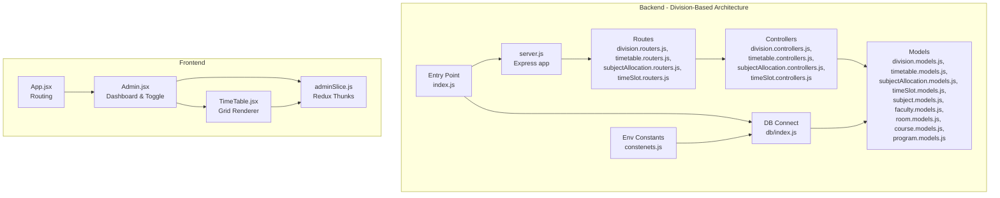
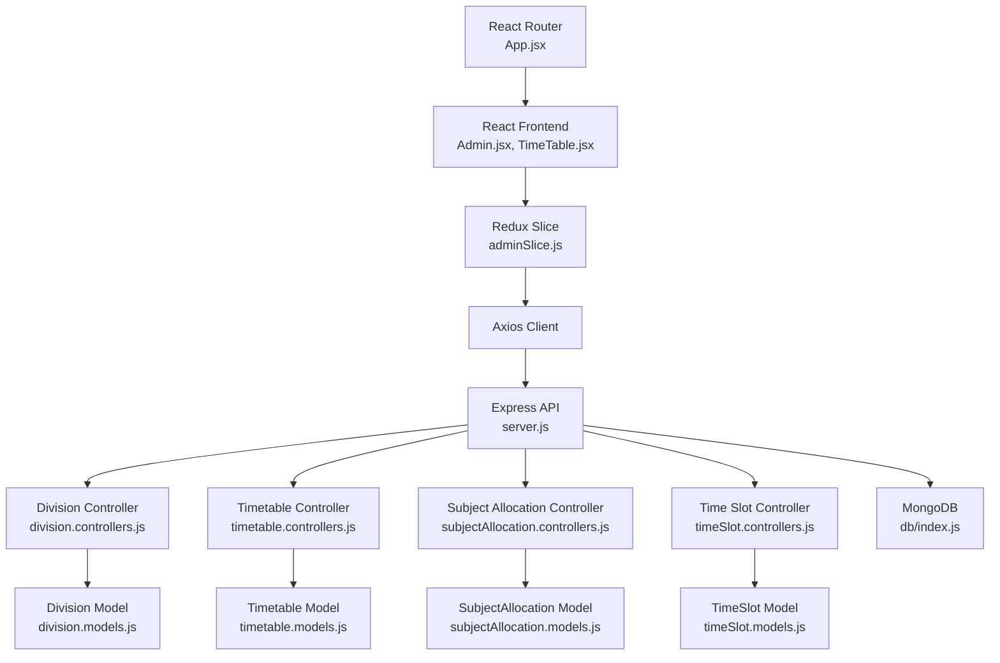
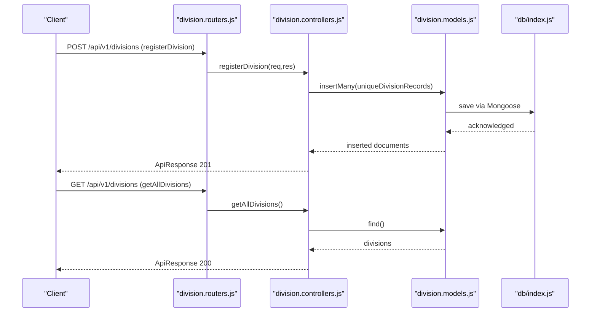
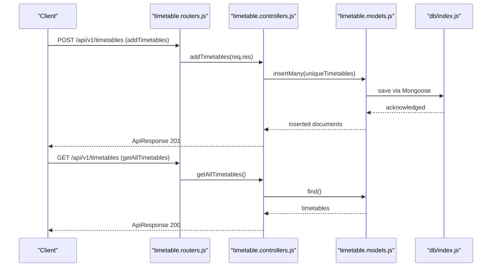
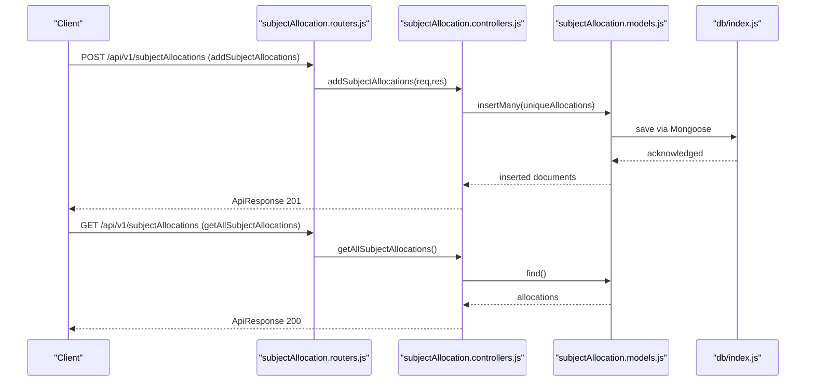
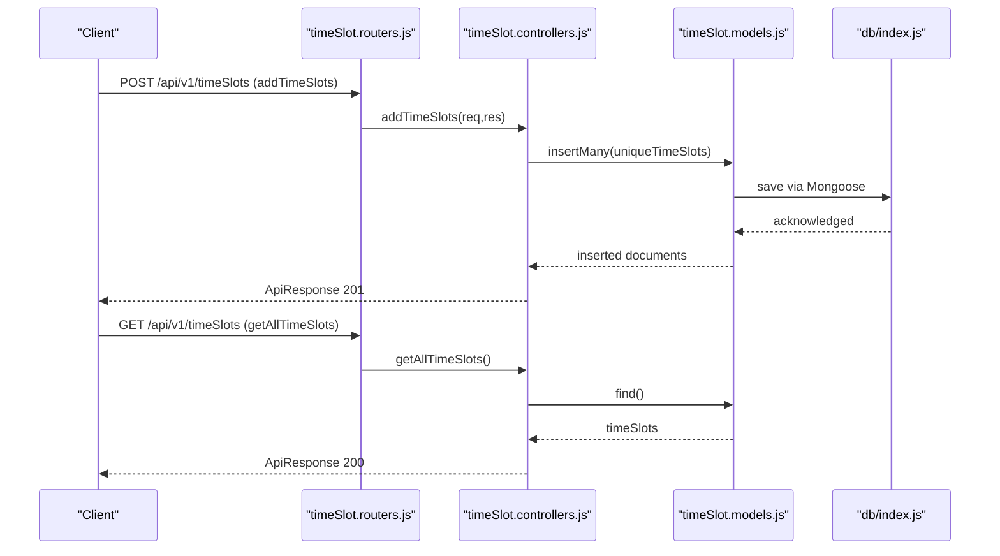
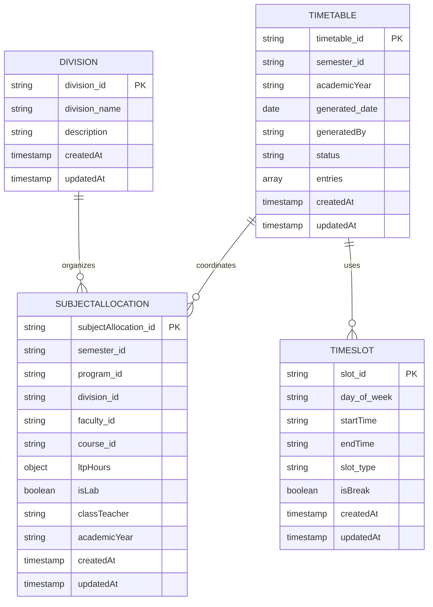
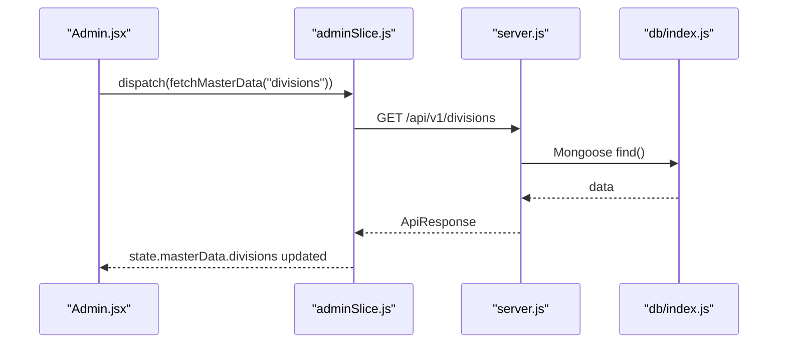
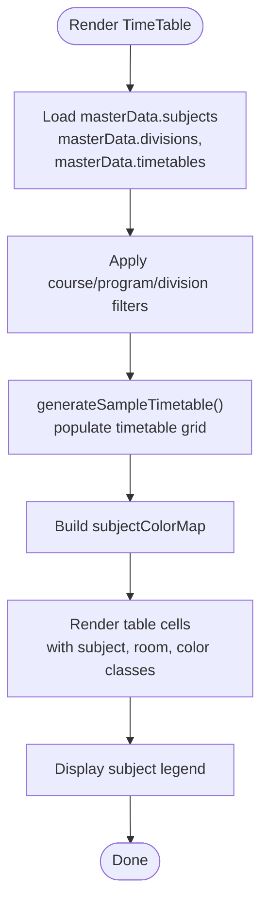
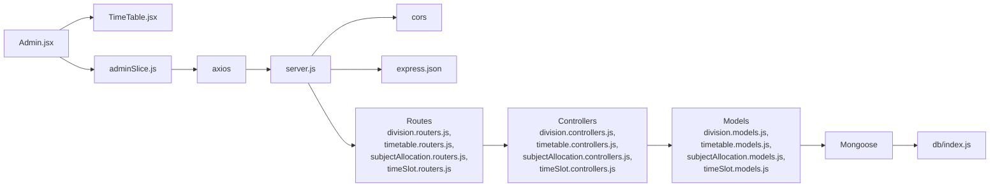

# Timetable Generation System

<cite>
**Referenced Files in This Document**
- [index.js](file://Backend/src/index.js)
- [server.js](file://Backend/src/server.js)
- [db/index.js](file://Backend/src/db/index.js)
- [constenets.js](file://Backend/src/constenets.js)
- [division.controllers.js](file://Backend/src/controllers/division.controllers.js)
- [division.routers.js](file://Backend/src/routes/division.routers.js)
- [division.models.js](file://Backend/src/models/division.models.js)
- [timetable.controllers.js](file://Backend/src/controllers/timetable.controllers.js)
- [timetable.models.js](file://Backend/src/models/timetable.models.js)
- [subjectAllocation.controllers.js](file://Backend/src/controllers/subjectAllocation.controllers.js)
- [subjectAllocation.models.js](file://Backend/src/models/subjectAllocation.models.js)
- [timeSlot.controllers.js](file://Backend/src/controllers/timeSlot.controllers.js)
- [timeSlot.models.js](file://Backend/src/models/timeSlot.models.js)
- [subject.models.js](file://Backend/src/models/subject.models.js)
- [faculty.models.js](file://Backend/src/models/faculty.models.js)
- [room.models.js](file://Backend/src/models/room.models.js)
- [course.models.js](file://Backend/src/models/course.models.js)
- [program.models.js](file://Backend/src/models/program.models.js)
- [adminSlice.js](file://Client/src/store/admin/adminSlice.js)
- [App.jsx](file://Client/src/App.jsx)
- [Admin.jsx](file://Client/src/pages/dashboard/Admin.jsx)
- [TimeTable.jsx](file://Client/src/components/deshboard/TimeTable.jsx)
</cite>

## Update Summary
**Changes Made**
- Updated architecture from class-based to division-based timetable management
- Replaced `/api/v1/classes` endpoints with `/api/v1/divisions`
- Added comprehensive timetable management system with dedicated controllers
- Introduced subject allocation system for managing academic assignments
- Implemented time slot management for scheduling grid definition
- Added centralized timetable coordination and entry management

## Table of Contents
1. [Introduction](#introduction)
2. [Project Structure](#project-structure)
3. [Core Components](#core-components)
4. [Architecture Overview](#architecture-overview)
5. [Detailed Component Analysis](#detailed-component-analysis)
6. [Dependency Analysis](#dependency-analysis)
7. [Performance Considerations](#performance-considerations)
8. [Troubleshooting Guide](#troubleshooting-guide)
9. [Conclusion](#conclusion)

## Introduction
This document describes the timetable generation and visualization system with its new division-based architecture. The system now manages academic entities through divisions instead of traditional classes, providing a more granular approach to timetable generation. The backend implements a comprehensive timetable management system with dedicated controllers for divisions, timetables, subject allocations, and time slots. The frontend maintains its grid-based visualization capabilities with enhanced filtering and color-coding features.

**Updated** The system has migrated from a class-based approach to a division-based architecture, replacing `/api/v1/classes` with `/api/v1/divisions` and introducing centralized timetable coordination.

## Project Structure
The system follows a modern split between a Node.js/Express backend and a React/Redux frontend. The backend now implements a division-centric architecture with specialized controllers for timetable management, subject allocation, and time slot coordination. The frontend maintains its state management and visualization components while adapting to the new data model.

**Diagram sources**
- [server.js:1-54](file://Backend/src/server.js#L1-L54)
- [division.routers.js](file://Backend/src/routes/division.routers.js)
- [timetable.routers.js](file://Backend/src/routes/timetable.routers.js)
- [subjectAllocation.routers.js](file://Backend/src/routes/subjectAllocation.routers.js)
- [timeSlot.routers.js](file://Backend/src/routes/timeSlot.routers.js)
- [division.controllers.js:1-123](file://Backend/src/controllers/division.controllers.js#L1-L123)
- [timetable.controllers.js:1-114](file://Backend/src/controllers/timetable.controllers.js#L1-L114)
- [subjectAllocation.controllers.js:1-119](file://Backend/src/controllers/subjectAllocation.controllers.js#L1-L119)
- [timeSlot.controllers.js:1-115](file://Backend/src/controllers/timeSlot.controllers.js#L1-L115)
- [division.models.js:1-27](file://Backend/src/models/division.models.js#L1-L27)
- [timetable.models.js:1-48](file://Backend/src/models/timetable.models.js#L1-L48)
- [subjectAllocation.models.js:1-68](file://Backend/src/models/subjectAllocation.models.js#L1-L68)
- [timeSlot.models.js:1-44](file://Backend/src/models/timeSlot.models.js#L1-L44)
- [db/index.js:1-19](file://Backend/src/db/index.js#L1-L19)
- [constenets.js:1-1](file://Backend/src/constenets.js#L1-L1)
- [index.js:1-18](file://Backend/src/index.js#L1-L18)
- [App.jsx:1-41](file://Client/src/App.jsx#L1-L41)
- [Admin.jsx:1-617](file://Client/src/pages/dashboard/Admin.jsx#L1-L617)
- [TimeTable.jsx:1-370](file://Client/src/components/deshboard/TimeTable.jsx#L1-L370)
- [adminSlice.js:1-173](file://Client/src/store/admin/adminSlice.js#L1-L173)

**Section sources**
- [index.js:1-18](file://Backend/src/index.js#L1-L18)
- [server.js:1-54](file://Backend/src/server.js#L1-L54)
- [db/index.js:1-19](file://Backend/src/db/index.js#L1-L19)
- [constenets.js:1-1](file://Backend/src/constenets.js#L1-L1)
- [division.routers.js](file://Backend/src/routes/division.routers.js)
- [timetable.routers.js](file://Backend/src/routes/timetable.routers.js)
- [subjectAllocation.routers.js](file://Backend/src/routes/subjectAllocation.routers.js)
- [timeSlot.routers.js](file://Backend/src/routes/timeSlot.routers.js)
- [division.controllers.js:1-123](file://Backend/src/controllers/division.controllers.js#L1-L123)
- [timetable.controllers.js:1-114](file://Backend/src/controllers/timetable.controllers.js#L1-L114)
- [subjectAllocation.controllers.js:1-119](file://Backend/src/controllers/subjectAllocation.controllers.js#L1-L119)
- [timeSlot.controllers.js:1-115](file://Backend/src/controllers/timeSlot.controllers.js#L1-L115)
- [division.models.js:1-27](file://Backend/src/models/division.models.js#L1-L27)
- [timetable.models.js:1-48](file://Backend/src/models/timetable.models.js#L1-L48)
- [subjectAllocation.models.js:1-68](file://Backend/src/models/subjectAllocation.models.js#L1-L68)
- [timeSlot.models.js:1-44](file://Backend/src/models/timeSlot.models.js#L1-L44)
- [adminSlice.js:1-173](file://Client/src/store/admin/adminSlice.js#L1-L173)
- [App.jsx:1-41](file://Client/src/App.jsx#L1-L41)
- [Admin.jsx:1-617](file://Client/src/pages/dashboard/Admin.jsx#L1-L617)
- [TimeTable.jsx:1-370](file://Client/src/components/deshboard/TimeTable.jsx#L1-L370)

## Core Components
- Backend entry and database connection:
  - The backend initializes environment variables, connects to MongoDB, and starts the Express server with division-based routing.
  - See [index.js:1-18](file://Backend/src/index.js#L1-L18), [db/index.js:1-19](file://Backend/src/db/index.js#L1-L19), [constenets.js:1-1](file://Backend/src/constenets.js#L1-L1).
- REST API surface with division-based architecture:
  - Routes are mounted under `/api/v1/divisions`, `/api/v1/timetables`, `/api/v1/subjectAllocations`, and `/api/v1/timeSlots` for comprehensive timetable management.
  - Division routes handle CRUD operations for academic divisions with validation and duplicate prevention.
  - Timetable routes manage timetable creation, status tracking, and centralized coordination.
  - Subject allocation routes handle academic assignment management with LTP hour tracking.
  - Time slot routes define the scheduling grid with day/time specifications.
  - See [server.js:40-50](file://Backend/src/server.js#L40-L50), [division.routers.js](file://Backend/src/routes/division.routers.js), [timetable.routers.js](file://Backend/src/routes/timetable.routers.js), [subjectAllocation.routers.js](file://Backend/src/routes/subjectAllocation.routers.js), [timeSlot.routers.js](file://Backend/src/routes/timeSlot.routers.js).
- Division-centric controllers and models:
  - Division controller handles CRUD operations with validation for division_id, division_name, and description.
  - Timetable controller manages timetable lifecycle with status tracking (draft, published, archived).
  - Subject allocation controller coordinates academic assignments with LTP hour breakdowns.
  - Time slot controller defines scheduling periods with day-of-week and time-range specifications.
  - Models define schemas for divisions, timetables, subject allocations, and time slots with appropriate validation.
  - See [division.controllers.js:1-123](file://Backend/src/controllers/division.controllers.js#L1-L123), [timetable.controllers.js:1-114](file://Backend/src/controllers/timetable.controllers.js#L1-L114), [subjectAllocation.controllers.js:1-119](file://Backend/src/controllers/subjectAllocation.controllers.js#L1-L119), [timeSlot.controllers.js:1-115](file://Backend/src/controllers/timeSlot.controllers.js#L1-L115).
- Frontend state and data fetching:
  - Redux slice orchestrates asynchronous CRUD actions against backend endpoints and stores master data keyed by entity.
  - State consolidation supports division-based filtering and timetable visualization.
  - See [adminSlice.js:1-173](file://Client/src/store/admin/adminSlice.js#L1-L173).
- Timetable visualization:
  - A grid component renders a weekly timetable with days and time slots, color-coding subjects and supporting filters for course/program/division.
  - Enhanced filtering capabilities accommodate the new division-based hierarchy.
  - See [TimeTable.jsx:1-370](file://Client/src/components/deshboard/TimeTable.jsx#L1-L370).
- Routing and navigation:
  - React Router routes and layout integrate the timetable toggle within the admin dashboard.
  - Navigation adapts to division-based entity management.
  - See [App.jsx:1-41](file://Client/src/App.jsx#L1-L41), [Admin.jsx:1-617](file://Client/src/pages/dashboard/Admin.jsx#L1-L617).

**Updated** The core components have been updated to reflect the migration from class-based to division-based architecture, with new controllers and models for timetable management, subject allocation, and time slot coordination.

**Section sources**
- [index.js:1-18](file://Backend/src/index.js#L1-L18)
- [server.js:1-54](file://Backend/src/server.js#L1-L54)
- [division.routers.js](file://Backend/src/routes/division.routers.js)
- [timetable.routers.js](file://Backend/src/routes/timetable.routers.js)
- [subjectAllocation.routers.js](file://Backend/src/routes/subjectAllocation.routers.js)
- [timeSlot.routers.js](file://Backend/src/routes/timeSlot.routers.js)
- [division.controllers.js:1-123](file://Backend/src/controllers/division.controllers.js#L1-L123)
- [timetable.controllers.js:1-114](file://Backend/src/controllers/timetable.controllers.js#L1-L114)
- [subjectAllocation.controllers.js:1-119](file://Backend/src/controllers/subjectAllocation.controllers.js#L1-L119)
- [timeSlot.controllers.js:1-115](file://Backend/src/controllers/timeSlot.controllers.js#L1-L115)
- [division.models.js:1-27](file://Backend/src/models/division.models.js#L1-L27)
- [timetable.models.js:1-48](file://Backend/src/models/timetable.models.js#L1-L48)
- [subjectAllocation.models.js:1-68](file://Backend/src/models/subjectAllocation.models.js#L1-L68)
- [timeSlot.models.js:1-44](file://Backend/src/models/timeSlot.models.js#L1-L44)
- [adminSlice.js:1-173](file://Client/src/store/admin/adminSlice.js#L1-L173)
- [TimeTable.jsx:1-370](file://Client/src/components/deshboard/TimeTable.jsx#L1-L370)
- [App.jsx:1-41](file://Client/src/App.jsx#L1-L41)
- [Admin.jsx:1-617](file://Client/src/pages/dashboard/Admin.jsx#L1-L617)

## Architecture Overview
The system architecture now implements a division-centric approach with centralized timetable coordination:
- Presentation Layer (React):
  - Admin dashboard manages both master data and timetable visualization with division-based filtering.
  - Timetable component renders a grid with enhanced academic hierarchy support.
- Application Layer (Redux):
  - Thunks perform HTTP requests to division-based endpoints and update state with timetable coordination.
- Domain Layer (MongoDB):
  - Entities stored as collections with division as the primary organizational unit.
  - Timetable entries reference divisions, subjects, and time slots for coordinated scheduling.
- Infrastructure Layer (Express/Mongoose):
  - REST endpoints expose CRUD operations for divisions, timetables, subject allocations, and time slots.
  - Centralized timetable coordination manages scheduling conflicts and resource allocation.

**Updated** The architecture now centers around division-based management with specialized controllers for timetable coordination, subject allocation, and time slot management.

**Diagram sources**
- [App.jsx:1-41](file://Client/src/App.jsx#L1-L41)
- [Admin.jsx:1-617](file://Client/src/pages/dashboard/Admin.jsx#L1-L617)
- [TimeTable.jsx:1-370](file://Client/src/components/deshboard/TimeTable.jsx#L1-L370)
- [adminSlice.js:1-173](file://Client/src/store/admin/adminSlice.js#L1-L173)
- [server.js:1-54](file://Backend/src/server.js#L1-L54)
- [division.controllers.js:1-123](file://Backend/src/controllers/division.controllers.js#L1-L123)
- [timetable.controllers.js:1-114](file://Backend/src/controllers/timetable.controllers.js#L1-L114)
- [subjectAllocation.controllers.js:1-119](file://Backend/src/controllers/subjectAllocation.controllers.js#L1-L119)
- [timeSlot.controllers.js:1-115](file://Backend/src/controllers/timeSlot.controllers.js#L1-L115)
- [division.models.js:1-27](file://Backend/src/models/division.models.js#L1-L27)
- [timetable.models.js:1-48](file://Backend/src/models/timetable.models.js#L1-L48)
- [subjectAllocation.models.js:1-68](file://Backend/src/models/subjectAllocation.models.js#L1-L68)
- [timeSlot.models.js:1-44](file://Backend/src/models/timeSlot.models.js#L1-L44)
- [db/index.js:1-19](file://Backend/src/db/index.js#L1-L19)

## Detailed Component Analysis

### Backend: Division Management
The division module implements comprehensive CRUD operations with validation and duplicate prevention:
- Validation ensures division_id, division_name, and description are provided for all divisions.
- Duplicate prevention checks existing records before insertion using batch processing.
- CRUD operations support individual and bulk division management with proper error handling.
- Timestamp tracking provides audit trail for division modifications.

**Updated** The division management system replaces the previous class-based approach with a more granular division hierarchy, enabling better timetable organization and resource allocation.

**Diagram sources**
- [division.routers.js](file://Backend/src/routes/division.routers.js)
- [division.controllers.js:1-123](file://Backend/src/controllers/division.controllers.js#L1-L123)
- [division.models.js:1-27](file://Backend/src/models/division.models.js#L1-L27)
- [db/index.js:1-19](file://Backend/src/db/index.js#L1-L19)

**Section sources**
- [division.controllers.js:1-123](file://Backend/src/controllers/division.controllers.js#L1-L123)
- [division.routers.js](file://Backend/src/routes/division.routers.js)
- [division.models.js:1-27](file://Backend/src/models/division.models.js#L1-L27)

### Backend: Timetable Management System
The timetable module provides centralized coordination for academic scheduling:
- Timetable creation validates essential fields: timetable_id, semester_id, academicYear, and generatedBy.
- Status tracking enables draft, published, and archived states for timetable lifecycle management.
- Centralized entry management coordinates subject allocations, time slots, and resource utilization.
- Academic year tracking ensures proper scheduling alignment across institutional cycles.

**Updated** The timetable management system introduces centralized coordination for academic scheduling, replacing the previous class-based approach with division-centric timetable generation.

**Diagram sources**
- [timetable.routers.js](file://Backend/src/routes/timetable.routers.js)
- [timetable.controllers.js:1-114](file://Backend/src/controllers/timetable.controllers.js#L1-L114)
- [timetable.models.js:1-48](file://Backend/src/models/timetable.models.js#L1-L48)
- [db/index.js:1-19](file://Backend/src/db/index.js#L1-L19)

**Section sources**
- [timetable.controllers.js:1-114](file://Backend/src/controllers/timetable.controllers.js#L1-L114)
- [timetable.routers.js](file://Backend/src/routes/timetable.routers.js)
- [timetable.models.js:1-48](file://Backend/src/models/timetable.models.js#L1-L48)

### Backend: Subject Allocation System
The subject allocation module coordinates academic assignments with detailed LTP hour tracking:
- Comprehensive validation ensures all allocation fields are provided: subjectAllocation_id, semester_id, program_id, division_id, faculty_id, course_id, ltpHours, classTeacher, and academicYear.
- LTP (Lecture-Tutorial-Practical) hour breakdown enables precise workload distribution.
- Class teacher assignment facilitates academic responsibility tracking.
- Academic year integration ensures proper scheduling alignment across institutional cycles.

**Updated** The subject allocation system provides detailed academic assignment management with LTP hour tracking, replacing previous class-based allocation methods.

**Diagram sources**
- [subjectAllocation.routers.js](file://Backend/src/routes/subjectAllocation.routers.js)
- [subjectAllocation.controllers.js:1-119](file://Backend/src/controllers/subjectAllocation.controllers.js#L1-L119)
- [subjectAllocation.models.js:1-68](file://Backend/src/models/subjectAllocation.models.js#L1-L68)
- [db/index.js:1-19](file://Backend/src/db/index.js#L1-L19)

**Section sources**
- [subjectAllocation.controllers.js:1-119](file://Backend/src/controllers/subjectAllocation.controllers.js#L1-L119)
- [subjectAllocation.routers.js](file://Backend/src/routes/subjectAllocation.routers.js)
- [subjectAllocation.models.js:1-68](file://Backend/src/models/subjectAllocation.models.js#L1-L68)

### Backend: Time Slot Management
The time slot module defines the scheduling grid with comprehensive day/time specifications:
- Day-of-week enumeration ensures proper scheduling across the academic week.
- Start and end time validation prevents scheduling conflicts and ensures logical time progression.
- Slot type classification enables different scheduling categories: lecture, lab, break, lunch.
- Break detection facilitates proper scheduling of rest periods and meal times.

**Updated** The time slot management system provides comprehensive scheduling grid definition with day/time specifications, replacing previous class-based time slot approaches.

**Diagram sources**
- [timeSlot.routers.js](file://Backend/src/routes/timeSlot.routers.js)
- [timeSlot.controllers.js:1-115](file://Backend/src/controllers/timeSlot.controllers.js#L1-L115)
- [timeSlot.models.js:1-44](file://Backend/src/models/timeSlot.models.js#L1-L44)
- [db/index.js:1-19](file://Backend/src/db/index.js#L1-L19)

**Section sources**
- [timeSlot.controllers.js:1-115](file://Backend/src/controllers/timeSlot.controllers.js#L1-L115)
- [timeSlot.routers.js](file://Backend/src/routes/timeSlot.routers.js)
- [timeSlot.models.js:1-44](file://Backend/src/models/timeSlot.models.js#L1-L44)

### Backend: Data Models
The models define the domain schema for the new division-based architecture:
- Division: division_id, division_name, and description with timestamp tracking.
- Timetable: timetable_id, semester_id, academicYear, generatedBy, status, and entries array.
- SubjectAllocation: comprehensive academic assignment with LTP hour breakdown and faculty-course relationships.
- TimeSlot: day-of-week, start/end times, slot_type, and break detection.
- Subject, Faculty, Room, Course, and Program models maintain backward compatibility for visualization.

**Updated** The data models now reflect the division-based architecture with centralized timetable coordination and subject allocation management.

**Diagram sources**
- [division.models.js:1-27](file://Backend/src/models/division.models.js#L1-L27)
- [timetable.models.js:1-48](file://Backend/src/models/timetable.models.js#L1-L48)
- [subjectAllocation.models.js:1-68](file://Backend/src/models/subjectAllocation.models.js#L1-L68)
- [timeSlot.models.js:1-44](file://Backend/src/models/timeSlot.models.js#L1-L44)

**Section sources**
- [division.models.js:1-27](file://Backend/src/models/division.models.js#L1-L27)
- [timetable.models.js:1-48](file://Backend/src/models/timetable.models.js#L1-L48)
- [subjectAllocation.models.js:1-68](file://Backend/src/models/subjectAllocation.models.js#L1-L68)
- [timeSlot.models.js:1-44](file://Backend/src/models/timeSlot.models.js#L1-L44)

### Frontend: Redux Master Data Management
The Redux slice coordinates asynchronous operations with division-based entity management:
- fetchMasterData retrieves lists for divisions, timetables, subject allocations, and time slots.
- addMasterData, updateMasterData, and deleteMasterData manage division-centric entity lifecycle.
- State consolidation supports division-based filtering and timetable visualization.
- Enhanced filtering capabilities accommodate the new academic hierarchy.

**Updated** The frontend state management has been adapted to support division-based entity management with enhanced filtering and timetable coordination.

**Diagram sources**
- [adminSlice.js:1-173](file://Client/src/store/admin/adminSlice.js#L1-L173)
- [server.js:1-54](file://Backend/src/server.js#L1-L54)
- [db/index.js:1-19](file://Backend/src/db/index.js#L1-L19)

**Section sources**
- [adminSlice.js:1-173](file://Client/src/store/admin/adminSlice.js#L1-L173)
- [server.js:1-54](file://Backend/src/server.js#L1-L54)

### Frontend: Timetable Visualization
The timetable component renders a grid with enhanced academic hierarchy support:
- Days and time slots with proper break handling and meal period identification.
- Color-coded subject blocks using a predefined palette mapped by subject_id.
- Advanced filtering by course, program, and division, driven by Redux master data.
- Responsive table layout with legends and academic year metadata.
- Enhanced academic hierarchy integration with division-based organization.

**Updated** The timetable visualization has been enhanced to support the new division-based academic hierarchy with improved filtering and color-coding capabilities.

**Diagram sources**
- [TimeTable.jsx:1-370](file://Client/src/components/deshboard/TimeTable.jsx#L1-L370)

**Section sources**
- [TimeTable.jsx:1-370](file://Client/src/components/deshboard/TimeTable.jsx#L1-L370)

### Conceptual Overview
The new division-based timetable system provides comprehensive academic scheduling with centralized coordination:
- Division-centric organization enables better resource allocation and timetable management.
- Centralized timetable coordination manages scheduling conflicts and resource utilization.
- Subject allocation system with LTP hour tracking ensures proper workload distribution.
- Time slot management defines the scheduling grid with comprehensive day/time specifications.
- Academic year tracking ensures proper scheduling alignment across institutional cycles.
- To implement automated scheduling:
  - Define constraints: room capacity, faculty availability, subject load, and prohibited combinations.
  - Implement constraint satisfaction problem (CSP) or genetic algorithm for timetable generation.
  - Integrate backend endpoints to compute and persist schedules with division-based coordination.
  - Extend the frontend to visualize computed results and support manual overrides.

**Updated** The system now operates on a division-based architecture with centralized timetable coordination, subject allocation management, and comprehensive time slot definitions.

## Dependency Analysis
- Backend dependencies:
  - Express middleware for CORS and JSON parsing.
  - Mongoose for MongoDB connectivity and division-based models.
  - Environment constants for database configuration.
- Frontend dependencies:
  - React Router for navigation.
  - Redux Toolkit for state management and async thunks.
  - Axios for HTTP communication with division-based endpoints.
- Division-based architecture dependencies:
  - Centralized timetable coordination requires proper synchronization between divisions, timetables, subject allocations, and time slots.
  - Academic hierarchy integration depends on proper foreign key relationships and validation.

**Updated** The dependency graph now reflects the division-based architecture with specialized controllers and models for timetable coordination.

**Diagram sources**
- [server.js:1-54](file://Backend/src/server.js#L1-L54)
- [db/index.js:1-19](file://Backend/src/db/index.js#L1-L19)
- [division.routers.js](file://Backend/src/routes/division.routers.js)
- [timetable.routers.js](file://Backend/src/routes/timetable.routers.js)
- [subjectAllocation.routers.js](file://Backend/src/routes/subjectAllocation.routers.js)
- [timeSlot.routers.js](file://Backend/src/routes/timeSlot.routers.js)
- [division.controllers.js:1-123](file://Backend/src/controllers/division.controllers.js#L1-L123)
- [timetable.controllers.js:1-114](file://Backend/src/controllers/timetable.controllers.js#L1-L114)
- [subjectAllocation.controllers.js:1-119](file://Backend/src/controllers/subjectAllocation.controllers.js#L1-L119)
- [timeSlot.controllers.js:1-115](file://Backend/src/controllers/timeSlot.controllers.js#L1-L115)
- [division.models.js:1-27](file://Backend/src/models/division.models.js#L1-L27)
- [timetable.models.js:1-48](file://Backend/src/models/timetable.models.js#L1-L48)
- [subjectAllocation.models.js:1-68](file://Backend/src/models/subjectAllocation.models.js#L1-L68)
- [timeSlot.models.js:1-44](file://Backend/src/models/timeSlot.models.js#L1-L44)
- [Admin.jsx:1-617](file://Client/src/pages/dashboard/Admin.jsx#L1-L617)
- [TimeTable.jsx:1-370](file://Client/src/components/deshboard/TimeTable.jsx#L1-L370)
- [adminSlice.js:1-173](file://Client/src/store/admin/adminSlice.js#L1-L173)

**Section sources**
- [server.js:1-54](file://Backend/src/server.js#L1-L54)
- [db/index.js:1-19](file://Backend/src/db/index.js#L1-L19)
- [division.routers.js](file://Backend/src/routes/division.routers.js)
- [timetable.routers.js](file://Backend/src/routes/timetable.routers.js)
- [subjectAllocation.routers.js](file://Backend/src/routes/subjectAllocation.routers.js)
- [timeSlot.routers.js](file://Backend/src/routes/timeSlot.routers.js)
- [division.controllers.js:1-123](file://Backend/src/controllers/division.controllers.js#L1-L123)
- [timetable.controllers.js:1-114](file://Backend/src/controllers/timetable.controllers.js#L1-L114)
- [subjectAllocation.controllers.js:1-119](file://Backend/src/controllers/subjectAllocation.controllers.js#L1-L119)
- [timeSlot.controllers.js:1-115](file://Backend/src/controllers/timeSlot.controllers.js#L1-L115)
- [division.models.js:1-27](file://Backend/src/models/division.models.js#L1-L27)
- [timetable.models.js:1-48](file://Backend/src/models/timetable.models.js#L1-L48)
- [subjectAllocation.models.js:1-68](file://Backend/src/models/subjectAllocation.models.js#L1-L68)
- [timeSlot.models.js:1-44](file://Backend/src/models/timeSlot.models.js#L1-L44)
- [Admin.jsx:1-617](file://Client/src/pages/dashboard/Admin.jsx#L1-L617)
- [TimeTable.jsx:1-370](file://Client/src/components/deshboard/TimeTable.jsx#L1-L370)
- [adminSlice.js:1-173](file://Client/src/store/admin/adminSlice.js#L1-L173)

## Performance Considerations
- Backend:
  - Use pagination or limit large aggregations to reduce payload sizes for division-based queries.
  - Index frequently queried fields (e.g., division_id, timetable_id, subjectAllocation_id) in models.
  - Batch inserts for bulk division and timetable uploads to minimize round trips.
  - Implement proper indexing on academic hierarchy fields (semester_id, academicYear, program_id) for efficient querying.
  - Centralized timetable coordination requires optimized queries for conflict detection and resource allocation.
- Frontend:
  - Memoize derived data (e.g., subjectColorMap, filtered divisions) to avoid unnecessary re-renders.
  - Virtualize large tables if the timetable grid grows significantly with division-based filtering.
  - Debounce filter inputs (course, program, division) to reduce re-computation frequency.
  - Implement efficient state normalization for division-centric entity relationships.
- Real-time updates:
  - Implement WebSocket or polling for live schedule changes in the new division-based system.
  - Normalize state to minimize deep updates and improve Redux performance with division hierarchies.
  - Consider implementing optimistic updates for division-based timetable modifications.

**Updated** Performance considerations now account for the new division-based architecture with centralized timetable coordination and enhanced filtering capabilities.

## Troubleshooting Guide
- Database connection failures:
  - Verify MONGODB_URI and DB_NAME environment variables.
  - Confirm MongoDB is reachable and credentials are correct.
  - Check that division-based collections (divisions, timetables, subjectAllocations, timeSlots) are properly indexed.
  - See [db/index.js:1-19](file://Backend/src/db/index.js#L1-L19), [index.js:1-18](file://Backend/src/index.js#L1-L18).
- API errors with division-based endpoints:
  - Inspect ApiResponse and ApiError utilities for standardized responses.
  - Check controller validations for division_id, timetable_id, subjectAllocation_id, and slot_id formats.
  - Verify proper error propagation for division-based business logic.
  - See [division.controllers.js:1-123](file://Backend/src/controllers/division.controllers.js#L1-L123), [timetable.controllers.js:1-114](file://Backend/src/controllers/timetable.controllers.js#L1-L114), [subjectAllocation.controllers.js:1-119](file://Backend/src/controllers/subjectAllocation.controllers.js#L1-L119), [timeSlot.controllers.js:1-115](file://Backend/src/controllers/timeSlot.controllers.js#L1-L115).
- Frontend state issues with division-based data:
  - Monitor Redux loading and error states during async operations with division-centric entities.
  - Validate entity keys match division-based backend endpoints.
  - Check that division hierarchy relationships are properly maintained in state.
  - See [adminSlice.js:1-173](file://Client/src/store/admin/adminSlice.js#L1-L173).
- Timetable generation conflicts:
  - Verify that division-based timetable coordination resolves scheduling conflicts appropriately.
  - Check subject allocation LTP hour calculations and faculty workload balancing.
  - Ensure time slot availability is properly validated against division-specific requirements.
  - Review centralized timetable status tracking (draft/published/archived) for proper workflow management.

**Updated** Troubleshooting guidance now covers division-based architecture issues, centralized timetable coordination problems, and enhanced filtering capabilities.

**Section sources**
- [db/index.js:1-19](file://Backend/src/db/index.js#L1-L19)
- [index.js:1-18](file://Backend/src/index.js#L1-L18)
- [division.controllers.js:1-123](file://Backend/src/controllers/division.controllers.js#L1-L123)
- [timetable.controllers.js:1-114](file://Backend/src/controllers/timetable.controllers.js#L1-L114)
- [subjectAllocation.controllers.js:1-119](file://Backend/src/controllers/subjectAllocation.controllers.js#L1-L119)
- [timeSlot.controllers.js:1-115](file://Backend/src/controllers/timeSlot.controllers.js#L1-L115)
- [adminSlice.js:1-173](file://Client/src/store/admin/adminSlice.js#L1-L173)

## Conclusion
The repository has successfully transitioned from a class-based to a division-based timetable management system. The new architecture provides comprehensive academic scheduling with centralized coordination, subject allocation management, and time slot definitions. The backend implements specialized controllers for division management, timetable coordination, subject allocation, and time slot management, while the frontend maintains its responsive visualization capabilities with enhanced filtering and color-coding. This migration enables better resource allocation, improved timetable organization, and more granular academic hierarchy management. The system now supports automated scheduling through constraint satisfaction algorithms while maintaining manual override capabilities for administrative control.