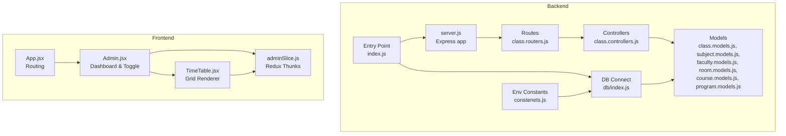
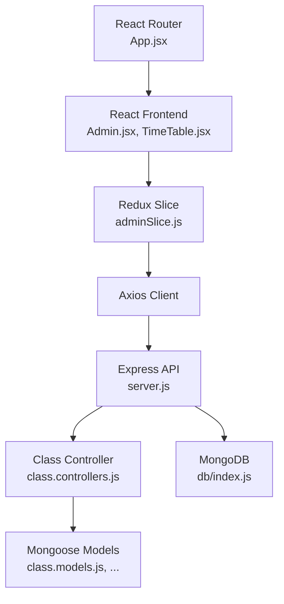
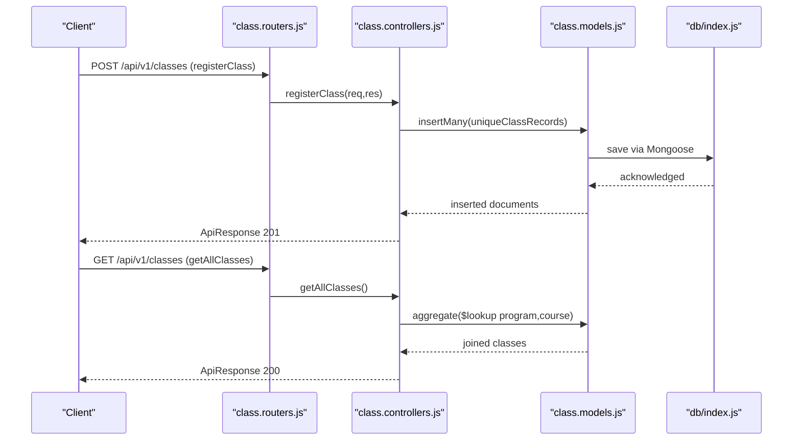
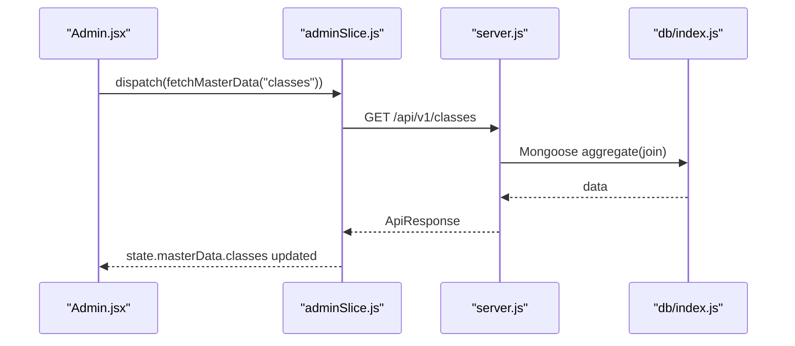
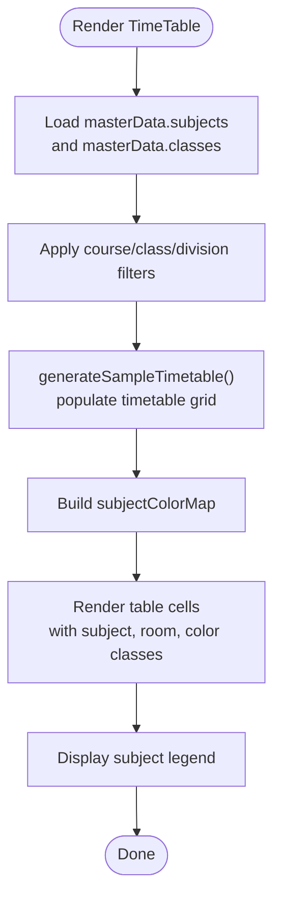
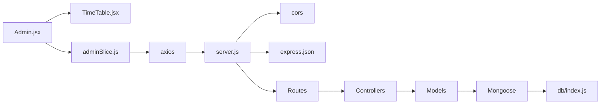

# Timetable Generation System

<cite>
**Referenced Files in This Document**
- [index.js](file://Backend/src/index.js)
- [server.js](file://Backend/src/server.js)
- [db/index.js](file://Backend/src/db/index.js)
- [constenets.js](file://Backend/src/constenets.js)
- [class.controllers.js](file://Backend/src/controllers/class.controllers.js)
- [class.routers.js](file://Backend/src/routes/class.routers.js)
- [class.models.js](file://Backend/src/models/class.models.js)
- [subject.models.js](file://Backend/src/models/subject.models.js)
- [faculty.models.js](file://Backend/src/models/faculty.models.js)
- [room.models.js](file://Backend/src/models/room.models.js)
- [course.models.js](file://Backend/src/models/course.models.js)
- [program.models.js](file://Backend/src/models/program.models.js)
- [adminSlice.js](file://Client/src/store/admin/adminSlice.js)
- [App.jsx](file://Client/src/App.jsx)
- [Admin.jsx](file://Client/src/pages/dashboard/Admin.jsx)
- [TimeTable.jsx](file://Client/src/components/deshboard/TimeTable.jsx)
</cite>

## Table of Contents
1. [Introduction](#introduction)
2. [Project Structure](#project-structure)
3. [Core Components](#core-components)
4. [Architecture Overview](#architecture-overview)
5. [Detailed Component Analysis](#detailed-component-analysis)
6. [Dependency Analysis](#dependency-analysis)
7. [Performance Considerations](#performance-considerations)
8. [Troubleshooting Guide](#troubleshooting-guide)
9. [Conclusion](#conclusion)

## Introduction
This document describes the timetable generation and visualization system. It explains how the backend manages academic entities (classes, courses, subjects, rooms, faculty) and exposes REST APIs, and how the frontend renders a grid-based timetable with filtering, color-coded subjects, and interactive controls. The current implementation focuses on visualization and master data management; the automated scheduling algorithm is not present in the repository and would require additional development to support constraint-driven allocation of classes to time slots.

## Project Structure
The system follows a classic split between a Node.js/Express backend and a React/Redux frontend. The backend connects to MongoDB via Mongoose and exposes REST endpoints grouped by entity. The frontend uses Redux Toolkit for state management and React Router for navigation, integrating with the backend through Axios.



**Diagram sources**
- [server.js:1-54](file://Backend/src/server.js#L1-L54)
- [class.routers.js:1-24](file://Backend/src/routes/class.routers.js#L1-L24)
- [class.controllers.js:1-179](file://Backend/src/controllers/class.controllers.js#L1-L179)
- [class.models.js:1-32](file://Backend/src/models/class.models.js#L1-L32)
- [subject.models.js:1-33](file://Backend/src/models/subject.models.js#L1-L33)
- [faculty.models.js:1-77](file://Backend/src/models/faculty.models.js#L1-L77)
- [room.models.js:1-28](file://Backend/src/models/room.models.js#L1-L28)
- [course.models.js:1-33](file://Backend/src/models/course.models.js#L1-L33)
- [program.models.js:1-24](file://Backend/src/models/program.models.js#L1-L24)
- [db/index.js:1-19](file://Backend/src/db/index.js#L1-L19)
- [constenets.js:1-1](file://Backend/src/constenets.js#L1-L1)
- [index.js:1-18](file://Backend/src/index.js#L1-L18)
- [App.jsx:1-41](file://Client/src/App.jsx#L1-L41)
- [Admin.jsx:1-617](file://Client/src/pages/dashboard/Admin.jsx#L1-L617)
- [TimeTable.jsx:1-370](file://Client/src/components/deshboard/TimeTable.jsx#L1-L370)
- [adminSlice.js:1-173](file://Client/src/store/admin/adminSlice.js#L1-L173)

**Section sources**
- [index.js:1-18](file://Backend/src/index.js#L1-L18)
- [server.js:1-54](file://Backend/src/server.js#L1-L54)
- [db/index.js:1-19](file://Backend/src/db/index.js#L1-L19)
- [constenets.js:1-1](file://Backend/src/constenets.js#L1-L1)
- [class.routers.js:1-24](file://Backend/src/routes/class.routers.js#L1-L24)
- [class.controllers.js:1-179](file://Backend/src/controllers/class.controllers.js#L1-L179)
- [class.models.js:1-32](file://Backend/src/models/class.models.js#L1-L32)
- [subject.models.js:1-33](file://Backend/src/models/subject.models.js#L1-L33)
- [faculty.models.js:1-77](file://Backend/src/models/faculty.models.js#L1-L77)
- [room.models.js:1-28](file://Backend/src/models/room.models.js#L1-L28)
- [course.models.js:1-33](file://Backend/src/models/course.models.js#L1-L33)
- [program.models.js:1-24](file://Backend/src/models/program.models.js#L1-L24)
- [adminSlice.js:1-173](file://Client/src/store/admin/adminSlice.js#L1-L173)
- [App.jsx:1-41](file://Client/src/App.jsx#L1-L41)
- [Admin.jsx:1-617](file://Client/src/pages/dashboard/Admin.jsx#L1-L617)
- [TimeTable.jsx:1-370](file://Client/src/components/deshboard/TimeTable.jsx#L1-L370)

## Core Components
- Backend entry and database connection:
  - The backend initializes environment variables, connects to MongoDB, and starts the Express server.
  - See [index.js:1-18](file://Backend/src/index.js#L1-L18), [db/index.js:1-19](file://Backend/src/db/index.js#L1-L19), [constenets.js:1-1](file://Backend/src/constenets.js#L1-L1).
- REST API surface:
  - Routes are mounted under /api/v1/* for users, students, faculties, classes, courses, programs, rooms, sections, semesters, subjects, specializations.
  - Example class route registration is shown in [server.js:40-50](file://Backend/src/server.js#L40-L50) and [class.routers.js:1-24](file://Backend/src/routes/class.routers.js#L1-L24).
- Controllers and models:
  - Class controller handles CRUD operations for classes with aggregation joins to programs and courses.
  - Models define schemas for classes, subjects, faculty, rooms, courses, and programs.
  - See [class.controllers.js:1-179](file://Backend/src/controllers/class.controllers.js#L1-L179), [class.models.js:1-32](file://Backend/src/models/class.models.js#L1-L32), [subject.models.js:1-33](file://Backend/src/models/subject.models.js#L1-L33), [faculty.models.js:1-77](file://Backend/src/models/faculty.models.js#L1-L77), [room.models.js:1-28](file://Backend/src/models/room.models.js#L1-L28), [course.models.js:1-33](file://Backend/src/models/course.models.js#L1-L33), [program.models.js:1-24](file://Backend/src/models/program.models.js#L1-L24).
- Frontend state and data fetching:
  - Redux slice orchestrates asynchronous CRUD actions against backend endpoints and stores master data keyed by entity.
  - See [adminSlice.js:1-173](file://Client/src/store/admin/adminSlice.js#L1-L173).
- Timetable visualization:
  - A grid component renders a weekly timetable with days and time slots, color-coding subjects and supporting filters for course/class/division.
  - See [TimeTable.jsx:1-370](file://Client/src/components/deshboard/TimeTable.jsx#L1-L370).
- Routing and navigation:
  - React Router routes and layout integrate the timetable toggle within the admin dashboard.
  - See [App.jsx:1-41](file://Client/src/App.jsx#L1-L41), [Admin.jsx:1-617](file://Client/src/pages/dashboard/Admin.jsx#L1-L617).

**Section sources**
- [index.js:1-18](file://Backend/src/index.js#L1-L18)
- [server.js:1-54](file://Backend/src/server.js#L1-L54)
- [class.routers.js:1-24](file://Backend/src/routes/class.routers.js#L1-L24)
- [class.controllers.js:1-179](file://Backend/src/controllers/class.controllers.js#L1-L179)
- [class.models.js:1-32](file://Backend/src/models/class.models.js#L1-L32)
- [subject.models.js:1-33](file://Backend/src/models/subject.models.js#L1-L33)
- [faculty.models.js:1-77](file://Backend/src/models/faculty.models.js#L1-L77)
- [room.models.js:1-28](file://Backend/src/models/room.models.js#L1-L28)
- [course.models.js:1-33](file://Backend/src/models/course.models.js#L1-L33)
- [program.models.js:1-24](file://Backend/src/models/program.models.js#L1-L24)
- [adminSlice.js:1-173](file://Client/src/store/admin/adminSlice.js#L1-L173)
- [TimeTable.jsx:1-370](file://Client/src/components/deshboard/TimeTable.jsx#L1-L370)
- [App.jsx:1-41](file://Client/src/App.jsx#L1-L41)
- [Admin.jsx:1-617](file://Client/src/pages/dashboard/Admin.jsx#L1-L617)

## Architecture Overview
The system architecture is layered:
- Presentation Layer (React):
  - Admin dashboard toggles between master data management and timetable visualization.
  - Timetable component renders a grid and applies filters.
- Application Layer (Redux):
  - Thunks perform HTTP requests to backend endpoints and update state.
- Domain Layer (MongoDB):
  - Entities stored as collections with referential relationships (e.g., Class references Program and Course).
- Infrastructure Layer (Express/Mongoose):
  - REST endpoints expose CRUD operations; database connection configured at startup.



**Diagram sources**
- [App.jsx:1-41](file://Client/src/App.jsx#L1-L41)
- [Admin.jsx:1-617](file://Client/src/pages/dashboard/Admin.jsx#L1-L617)
- [TimeTable.jsx:1-370](file://Client/src/components/deshboard/TimeTable.jsx#L1-L370)
- [adminSlice.js:1-173](file://Client/src/store/admin/adminSlice.js#L1-L173)
- [server.js:1-54](file://Backend/src/server.js#L1-L54)
- [class.controllers.js:1-179](file://Backend/src/controllers/class.controllers.js#L1-L179)
- [class.models.js:1-32](file://Backend/src/models/class.models.js#L1-L32)
- [db/index.js:1-19](file://Backend/src/db/index.js#L1-L19)

## Detailed Component Analysis

### Backend: Class Management
The class module demonstrates robust CRUD operations with aggregation joins and validation:
- Validation ensures arrays are provided and required fields exist.
- Duplicate prevention checks existing records before insertion.
- Aggregation joins populate related Program and Course data for listing and retrieval.
- Update and delete operations enforce presence of identifiers.



**Diagram sources**
- [class.routers.js:1-24](file://Backend/src/routes/class.routers.js#L1-L24)
- [class.controllers.js:1-179](file://Backend/src/controllers/class.controllers.js#L1-L179)
- [class.models.js:1-32](file://Backend/src/models/class.models.js#L1-L32)
- [db/index.js:1-19](file://Backend/src/db/index.js#L1-L19)

**Section sources**
- [class.controllers.js:1-179](file://Backend/src/controllers/class.controllers.js#L1-L179)
- [class.routers.js:1-24](file://Backend/src/routes/class.routers.js#L1-L24)
- [class.models.js:1-32](file://Backend/src/models/class.models.js#L1-L32)

### Backend: Data Models
The models define the domain schema for academic entities:
- Class: identifiers, year, and references to Program and Course.
- Subject: subject code, name, credits, and active flag.
- Faculty: personal and professional attributes with validation constraints.
- Room: room number, floor, and wing.
- Course and Program: identifiers and metadata.

```mermaid
erDiagram
CLASS {
string class_id PK
number year
objectid program_id FK
objectid course_id FK
}
PROGRAM {
string program_id PK
string program_name
}
COURSE {
string course_id PK
string course_name
number course_duration
boolean isActive
}
SUBJECT {
string subject_id PK
string subject_name
number credit
boolean isActive
}
FACULTY {
string faculty_id PK
string faculty_name
string email
number phone
string specialization
string higher_qualification
number years_of_Experience
string gender
date date_of_joining
date date_of_birth
string address
boolean isActive
}
ROOM {
string room_no PK
number floor_no
string wing
}
CLASS }o--|| PROGRAM : "references"
CLASS }o--|| COURSE : "references"
```

**Diagram sources**
- [class.models.js:1-32](file://Backend/src/models/class.models.js#L1-L32)
- [program.models.js:1-24](file://Backend/src/models/program.models.js#L1-L24)
- [course.models.js:1-33](file://Backend/src/models/course.models.js#L1-L33)
- [subject.models.js:1-33](file://Backend/src/models/subject.models.js#L1-L33)
- [faculty.models.js:1-77](file://Backend/src/models/faculty.models.js#L1-L77)
- [room.models.js:1-28](file://Backend/src/models/room.models.js#L1-L28)

**Section sources**
- [class.models.js:1-32](file://Backend/src/models/class.models.js#L1-L32)
- [program.models.js:1-24](file://Backend/src/models/program.models.js#L1-L24)
- [course.models.js:1-33](file://Backend/src/models/course.models.js#L1-L33)
- [subject.models.js:1-33](file://Backend/src/models/subject.models.js#L1-L33)
- [faculty.models.js:1-77](file://Backend/src/models/faculty.models.js#L1-L77)
- [room.models.js:1-28](file://Backend/src/models/room.models.js#L1-L28)

### Frontend: Redux Master Data Management
The Redux slice coordinates asynchronous operations:
- fetchMasterData retrieves lists for multiple entities.
- addMasterData, updateMasterData, and deleteMasterData manage entity lifecycle.
- State consolidates masterData keyed by entity and supports loading/error states.



**Diagram sources**
- [adminSlice.js:1-173](file://Client/src/store/admin/adminSlice.js#L1-L173)
- [server.js:1-54](file://Backend/src/server.js#L1-L54)
- [db/index.js:1-19](file://Backend/src/db/index.js#L1-L19)

**Section sources**
- [adminSlice.js:1-173](file://Client/src/store/admin/adminSlice.js#L1-L173)
- [server.js:1-54](file://Backend/src/server.js#L1-L54)

### Frontend: Timetable Visualization
The timetable component renders a grid with:
- Days and time slots (including breaks).
- Color-coded subject blocks using a predefined palette mapped by subject_id.
- Filtering by course, class, and division, driven by Redux master data.
- Responsive table layout with legends and academic year metadata.



**Diagram sources**
- [TimeTable.jsx:1-370](file://Client/src/components/deshboard/TimeTable.jsx#L1-L370)

**Section sources**
- [TimeTable.jsx:1-370](file://Client/src/components/deshboard/TimeTable.jsx#L1-L370)

### Conceptual Overview
The current repository does not include an automated scheduling algorithm. The timetable grid is populated with synthetic data for demonstration. To implement automated scheduling:
- Define constraints: room capacity, faculty availability, subject load, and prohibited combinations.
- Choose an algorithm: constraint satisfaction problem (CSP), genetic algorithm, or local search.
- Integrate backend endpoints to compute and persist schedules.
- Extend the frontend to visualize computed results and support manual overrides.

[No sources needed since this section doesn't analyze specific files]

## Dependency Analysis
- Backend dependencies:
  - Express middleware for CORS and JSON parsing.
  - Mongoose for MongoDB connectivity and models.
  - Environment constants for database name.
- Frontend dependencies:
  - React Router for navigation.
  - Redux Toolkit for state management and async thunks.
  - Axios for HTTP communication.



**Diagram sources**
- [server.js:1-54](file://Backend/src/server.js#L1-L54)
- [db/index.js:1-19](file://Backend/src/db/index.js#L1-L19)
- [Admin.jsx:1-617](file://Client/src/pages/dashboard/Admin.jsx#L1-L617)
- [TimeTable.jsx:1-370](file://Client/src/components/deshboard/TimeTable.jsx#L1-L370)
- [adminSlice.js:1-173](file://Client/src/store/admin/adminSlice.js#L1-L173)

**Section sources**
- [server.js:1-54](file://Backend/src/server.js#L1-L54)
- [db/index.js:1-19](file://Backend/src/db/index.js#L1-L19)
- [Admin.jsx:1-617](file://Client/src/pages/dashboard/Admin.jsx#L1-L617)
- [TimeTable.jsx:1-370](file://Client/src/components/deshboard/TimeTable.jsx#L1-L370)
- [adminSlice.js:1-173](file://Client/src/store/admin/adminSlice.js#L1-L173)

## Performance Considerations
- Backend:
  - Use pagination or limit large aggregations to reduce payload sizes.
  - Index frequently queried fields (e.g., subject_id, class_id) in models.
  - Batch inserts for bulk class uploads to minimize round trips.
- Frontend:
  - Memoize derived data (e.g., subjectColorMap, filtered classes) to avoid unnecessary re-renders.
  - Virtualize large tables if the timetable grows significantly.
  - Debounce filter inputs to reduce re-computation frequency.
- Real-time updates:
  - Implement WebSocket or polling for live schedule changes.
  - Normalize state to minimize deep updates and improve Redux performance.

[No sources needed since this section provides general guidance]

## Troubleshooting Guide
- Database connection failures:
  - Verify MONGODB_URI and DB_NAME environment variables.
  - Confirm MongoDB is reachable and credentials are correct.
  - See [db/index.js:1-19](file://Backend/src/db/index.js#L1-L19), [index.js:1-18](file://Backend/src/index.js#L1-L18).
- API errors:
  - Inspect ApiResponse and ApiError utilities for standardized responses.
  - Check controller validations and error propagation.
  - See [class.controllers.js:1-179](file://Backend/src/controllers/class.controllers.js#L1-L179), [utils/ApiResponse.js:1-10](file://Backend/src/utils/ApiResponse.js#L1-L10), [utils/ApiError.js:1-21](file://Backend/src/utils/ApiError.js#L1-L21).
- Frontend state issues:
  - Monitor Redux loading and error states during async operations.
  - Validate entity keys match backend endpoints.
  - See [adminSlice.js:1-173](file://Client/src/store/admin/adminSlice.js#L1-L173).

**Section sources**
- [db/index.js:1-19](file://Backend/src/db/index.js#L1-L19)
- [index.js:1-18](file://Backend/src/index.js#L1-L18)
- [class.controllers.js:1-179](file://Backend/src/controllers/class.controllers.js#L1-L179)
- [adminSlice.js:1-173](file://Client/src/store/admin/adminSlice.js#L1-L173)

## Conclusion
The repository establishes a solid foundation for a timetable system with a structured backend and a responsive frontend. The backend provides robust entity management and REST endpoints, while the frontend offers a practical timetable visualization with filtering and color coding. To achieve automated scheduling, implement a constraint-driven algorithm, integrate it with backend endpoints, and extend the frontend to render computed schedules with manual override capabilities.