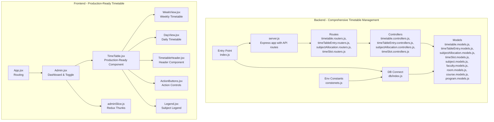
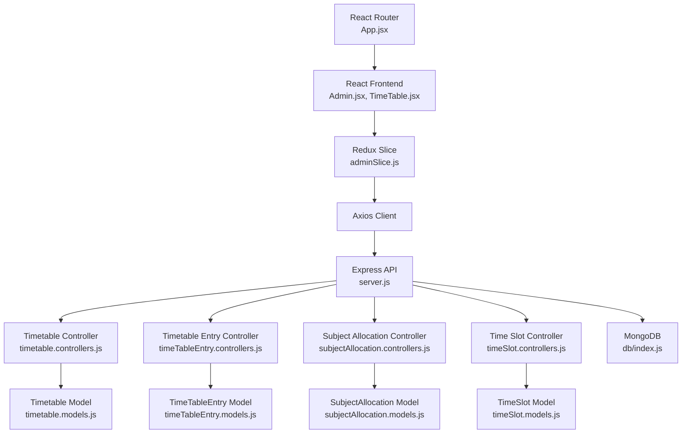
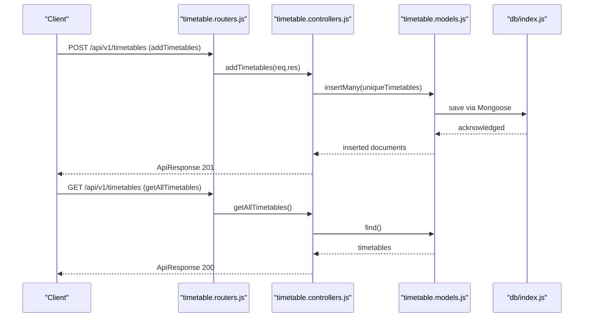
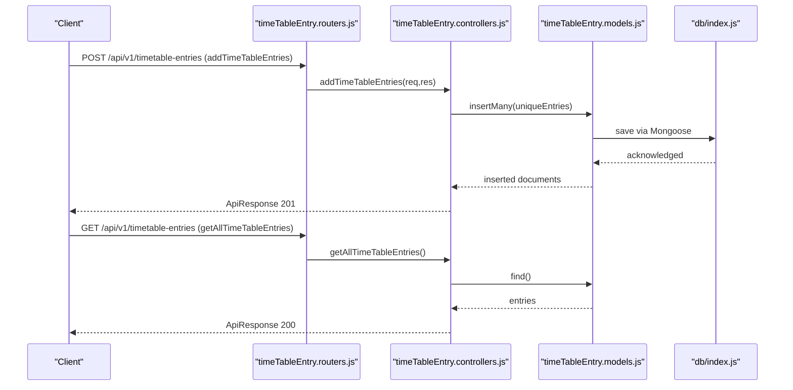
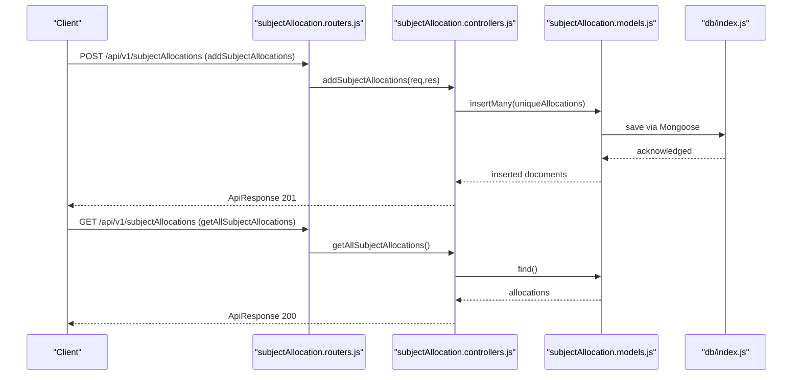
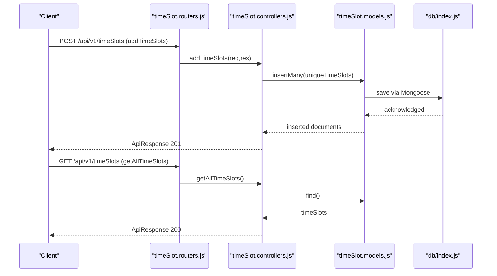
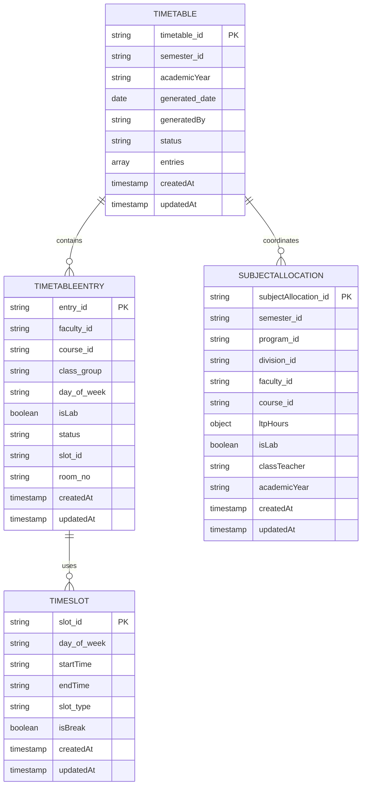
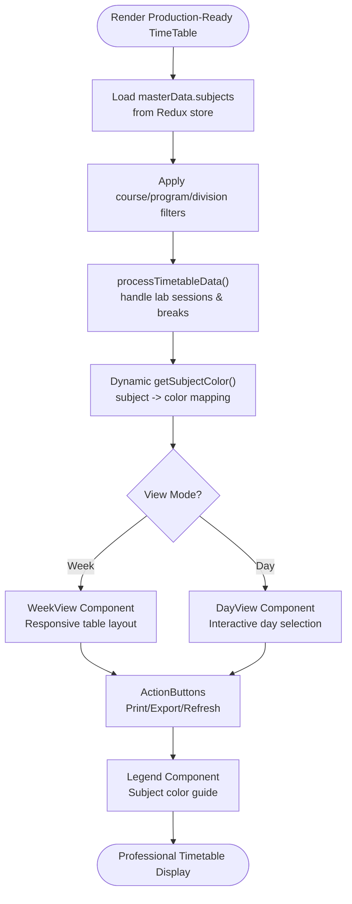
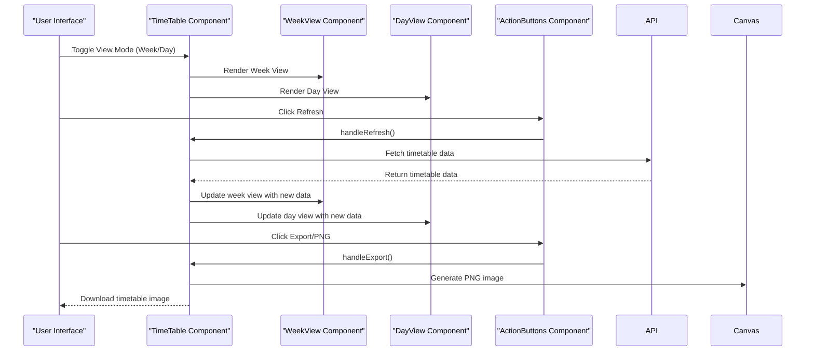
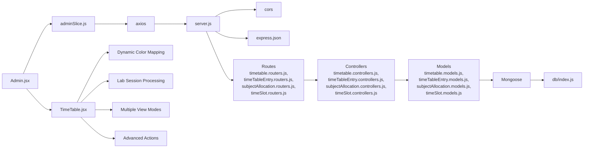

# Timetable Generation System

<cite>
**Referenced Files in This Document**
- [index.js](file://Backend/src/index.js)
- [server.js](file://Backend/src/server.js)
- [db/index.js](file://Backend/src/db/index.js)
- [constenets.js](file://Backend/src/constenets.js)
- [division.controllers.js](file://Backend/src/controllers/division.controllers.js)
- [division.routers.js](file://Backend/src/routes/division.routers.js)
- [division.models.js](file://Backend/src/models/division.models.js)
- [timetable.controllers.js](file://Backend/src/controllers/timetable.controllers.js)
- [timetable.models.js](file://Backend/src/models/timetable.models.js)
- [timeTableEntry.controllers.js](file://Backend/src/controllers/timeTableEntry.controllers.js)
- [timeTableEntry.models.js](file://Backend/src/models/timeTableEntry.models.js)
- [subjectAllocation.controllers.js](file://Backend/src/controllers/subjectAllocation.controllers.js)
- [subjectAllocation.models.js](file://Backend/src/models/subjectAllocation.models.js)
- [timeSlot.controllers.js](file://Backend/src/controllers/timeSlot.controllers.js)
- [timeSlot.models.js](file://Backend/src/models/timeSlot.models.js)
- [subject.models.js](file://Backend/src/models/subject.models.js)
- [faculty.models.js](file://Backend/src/models/faculty.models.js)
- [room.models.js](file://Backend/src/models/room.models.js)
- [course.models.js](file://Backend/src/models/course.models.js)
- [program.models.js](file://Backend/src/models/program.models.js)
- [adminSlice.js](file://Client/src/store/admin/adminSlice.js)
- [App.jsx](file://Client/src/App.jsx)
- [Admin.jsx](file://Client/src/pages/dashboard/Admin.jsx)
- [TimeTable.jsx](file://Client/src/components/deshboard/TimeTable.jsx)
</cite>

## Update Summary
**Changes Made**
- Complete rewrite of TimeTable component from simple demonstration to sophisticated production-ready system
- Enhanced time slot configuration with intelligent break handling and lab session processing
- Implementation of dynamic subject color mapping with comprehensive color palette
- Development of multiple view modes (week/day) with responsive design
- Advanced user interaction capabilities including print/export functionality
- Intelligent lab session processing with 2-period spanning support
- Comprehensive component architecture with modular sub-components
- Real-time data fetching from backend API with refresh capabilities

## Table of Contents
1. [Introduction](#introduction)
2. [Project Structure](#project-structure)
3. [Core Components](#core-components)
4. [Architecture Overview](#architecture-overview)
5. [Detailed Component Analysis](#detailed-component-analysis)
6. [Dependency Analysis](#dependency-analysis)
7. [Performance Considerations](#performance-considerations)
8. [Troubleshooting Guide](#troubleshooting-guide)
9. [Conclusion](#conclusion)

## Introduction
This document describes the timetable generation and visualization system with its complete transformation from a simple demonstration to a sophisticated production-ready timetable management system. The system now features advanced time slot management, intelligent lab session processing, dynamic subject color mapping, and comprehensive user interaction capabilities. The backend implements a robust timetable management system with dedicated controllers for timetables, timetable entries, subject allocations, and time slots, while the frontend delivers a professional-grade timetable visualization with multiple view modes and advanced export capabilities.

**Updated** The TimeTable component has been completely rewritten to provide a production-ready timetable system with advanced features including dynamic subject color mapping, enhanced time slot configuration, intelligent lab session processing, multiple view modes (week/day), comprehensive component architecture, and advanced user interaction capabilities.

## Project Structure
The system follows a modern split between a Node.js/Express backend and a React/Redux frontend. The backend implements a comprehensive timetable management system with specialized controllers for timetables, timetable entries, subject allocations, and time slots. The frontend features a sophisticated TimeTable component with modular architecture, responsive design, and advanced user interaction capabilities.

**Diagram sources**
- [server.js:1-105](file://Backend/src/server.js#L1-L105)
- [timetable.routers.js](file://Backend/src/routes/timetable.routers.js)
- [timeTableEntry.routers.js](file://Backend/src/routes/timeTableEntry.routers.js)
- [subjectAllocation.routers.js](file://Backend/src/routes/subjectAllocation.routers.js)
- [timeSlot.routers.js](file://Backend/src/routes/timeSlot.routers.js)
- [timetable.controllers.js:1-114](file://Backend/src/controllers/timetable.controllers.js#L1-L114)
- [timeTableEntry.controllers.js:1-116](file://Backend/src/controllers/timeTableEntry.controllers.js#L1-L116)
- [subjectAllocation.controllers.js:1-119](file://Backend/src/controllers/subjectAllocation.controllers.js#L1-L119)
- [timeSlot.controllers.js:1-115](file://Backend/src/controllers/timeSlot.controllers.js#L1-L115)
- [timetable.models.js:1-48](file://Backend/src/models/timetable.models.js#L1-L48)
- [timeTableEntry.models.js:1-63](file://Backend/src/models/timeTableEntry.models.js#L1-L63)
- [subjectAllocation.models.js:1-68](file://Backend/src/models/subjectAllocation.models.js#L1-L68)
- [timeSlot.models.js:1-44](file://Backend/src/models/timeSlot.models.js#L1-L44)
- [db/index.js:1-19](file://Backend/src/db/index.js#L1-L19)
- [constenets.js:1-1](file://Backend/src/constenets.js#L1-L1)
- [index.js:1-18](file://Backend/src/index.js#L1-L18)
- [App.jsx:1-41](file://Client/src/App.jsx#L1-L41)
- [Admin.jsx:1-953](file://Client/src/pages/dashboard/Admin.jsx#L1-L953)
- [TimeTable.jsx:1-722](file://Client/src/components/deshboard/TimeTable.jsx#L1-L722)
- [adminSlice.js:1-173](file://Client/src/store/admin/adminSlice.js#L1-L173)

**Section sources**
- [index.js:1-18](file://Backend/src/index.js#L1-L18)
- [server.js:1-105](file://Backend/src/server.js#L1-L105)
- [db/index.js:1-19](file://Backend/src/db/index.js#L1-L19)
- [constenets.js:1-1](file://Backend/src/constenets.js#L1-L1)
- [timetable.routers.js](file://Backend/src/routes/timetable.routers.js)
- [timeTableEntry.routers.js](file://Backend/src/routes/timeTableEntry.routers.js)
- [subjectAllocation.routers.js](file://Backend/src/routes/subjectAllocation.routers.js)
- [timeSlot.routers.js](file://Backend/src/routes/timeSlot.routers.js)
- [timetable.controllers.js:1-114](file://Backend/src/controllers/timetable.controllers.js#L1-L114)
- [timeTableEntry.controllers.js:1-116](file://Backend/src/controllers/timeTableEntry.controllers.js#L1-L116)
- [subjectAllocation.controllers.js:1-119](file://Backend/src/controllers/subjectAllocation.controllers.js#L1-L119)
- [timeSlot.controllers.js:1-115](file://Backend/src/controllers/timeSlot.controllers.js#L1-L115)
- [timetable.models.js:1-48](file://Backend/src/models/timetable.models.js#L1-L48)
- [timeTableEntry.models.js:1-63](file://Backend/src/models/timeTableEntry.models.js#L1-L63)
- [subjectAllocation.models.js:1-68](file://Backend/src/models/subjectAllocation.models.js#L1-L68)
- [timeSlot.models.js:1-44](file://Backend/src/models/timeSlot.models.js#L1-L44)
- [adminSlice.js:1-173](file://Client/src/store/admin/adminSlice.js#L1-L173)
- [App.jsx:1-41](file://Client/src/App.jsx#L1-L41)
- [Admin.jsx:1-953](file://Client/src/pages/dashboard/Admin.jsx#L1-L953)
- [TimeTable.jsx:1-722](file://Client/src/components/deshboard/TimeTable.jsx#L1-L722)

## Core Components
- Backend entry and database connection:
  - The backend initializes environment variables, connects to MongoDB, and starts the Express server with comprehensive timetable management routes.
  - See [index.js:1-18](file://Backend/src/index.js#L1-L18), [db/index.js:1-19](file://Backend/src/db/index.js#L1-L19), [constenets.js:1-1](file://Backend/src/constenets.js#L1-L1).
- REST API surface with comprehensive timetable management:
  - Routes are mounted under `/api/v1/timetables`, `/api/v1/timetable-entries`, `/api/v1/subjectAllocations`, and `/api/v1/timeSlots` for complete timetable coordination.
  - Timetable routes handle CRUD operations for timetable management with status tracking and entry coordination.
  - Timetable entry routes manage individual timetable entries with faculty, course, and room assignments.
  - Subject allocation routes handle academic assignment management with LTP hour tracking.
  - Time slot routes define the scheduling grid with day/time specifications and break handling.
  - See [server.js:69-76](file://Backend/src/server.js#L69-L76), [timetable.routers.js](file://Backend/src/routes/timetable.routers.js), [timeTableEntry.routers.js](file://Backend/src/routes/timeTableEntry.routers.js), [subjectAllocation.routers.js](file://Backend/src/routes/subjectAllocation.routers.js), [timeSlot.routers.js](file://Backend/src/routes/timeSlot.routers.js).
- Comprehensive backend controllers and models:
  - Timetable controller manages timetable lifecycle with status tracking (draft, published, archived) and entry coordination.
  - Timetable entry controller coordinates individual timetable entries with faculty-course-room assignments and status tracking.
  - Subject allocation controller coordinates academic assignments with LTP hour breakdowns.
  - Time slot controller defines scheduling periods with day-of-week and time-range specifications including break detection.
  - Models define schemas for timetables, timetable entries, subject allocations, and time slots with appropriate validation.
  - See [timetable.controllers.js:1-114](file://Backend/src/controllers/timetable.controllers.js#L1-L114), [timeTableEntry.controllers.js:1-116](file://Backend/src/controllers/timeTableEntry.controllers.js#L1-L116), [subjectAllocation.controllers.js:1-119](file://Backend/src/controllers/subjectAllocation.controllers.js#L1-L119), [timeSlot.controllers.js:1-115](file://Backend/src/controllers/timeSlot.controllers.js#L1-L115).
- Frontend state and data fetching:
  - Redux slice orchestrates asynchronous CRUD actions against backend endpoints and stores master data keyed by entity.
  - State consolidation supports timetable visualization and data management.
  - See [adminSlice.js:1-173](file://Client/src/store/admin/adminSlice.js#L1-L173).
- Sophisticated timetable visualization:
  - A production-ready grid component renders weekly and daily timetables with advanced academic hierarchy support.
  - Dynamic subject color mapping with comprehensive color palette for different subjects.
  - Intelligent lab session processing with 2-period spanning support and break handling.
  - Multiple view modes (week/day) with responsive design and interactive features.
  - Advanced filtering capabilities and comprehensive component architecture.
  - See [TimeTable.jsx:1-722](file://Client/src/components/deshboard/TimeTable.jsx#L1-L722).
- Routing and navigation:
  - React Router routes and layout integrate the timetable toggle within the admin dashboard.
  - Navigation adapts to production-ready timetable management interface.
  - See [App.jsx:1-41](file://Client/src/App.jsx#L1-L41), [Admin.jsx:1-953](file://Client/src/pages/dashboard/Admin.jsx#L1-L953).

**Updated** The core components have been transformed into a comprehensive production-ready system with sophisticated timetable visualization, advanced color mapping, intelligent lab session processing, and multiple view modes.

**Section sources**
- [index.js:1-18](file://Backend/src/index.js#L1-L18)
- [server.js:1-105](file://Backend/src/server.js#L1-L105)
- [timetable.routers.js](file://Backend/src/routes/timetable.routers.js)
- [timeTableEntry.routers.js](file://Backend/src/routes/timeTableEntry.routers.js)
- [subjectAllocation.routers.js](file://Backend/src/routes/subjectAllocation.routers.js)
- [timeSlot.routers.js](file://Backend/src/routes/timeSlot.routers.js)
- [timetable.controllers.js:1-114](file://Backend/src/controllers/timetable.controllers.js#L1-L114)
- [timeTableEntry.controllers.js:1-116](file://Backend/src/controllers/timeTableEntry.controllers.js#L1-L116)
- [subjectAllocation.controllers.js:1-119](file://Backend/src/controllers/subjectAllocation.controllers.js#L1-L119)
- [timeSlot.controllers.js:1-115](file://Backend/src/controllers/timeSlot.controllers.js#L1-L115)
- [timetable.models.js:1-48](file://Backend/src/models/timetable.models.js#L1-L48)
- [timeTableEntry.models.js:1-63](file://Backend/src/models/timeTableEntry.models.js#L1-L63)
- [subjectAllocation.models.js:1-68](file://Backend/src/models/subjectAllocation.models.js#L1-L68)
- [timeSlot.models.js:1-44](file://Backend/src/models/timeSlot.models.js#L1-L44)
- [adminSlice.js:1-173](file://Client/src/store/admin/adminSlice.js#L1-L173)
- [TimeTable.jsx:1-722](file://Client/src/components/deshboard/TimeTable.jsx#L1-L722)
- [App.jsx:1-41](file://Client/src/App.jsx#L1-L41)
- [Admin.jsx:1-953](file://Client/src/pages/dashboard/Admin.jsx#L1-L953)

## Architecture Overview
The system architecture now implements a comprehensive timetable management system with production-ready frontend visualization:
- Presentation Layer (React):
  - Admin dashboard manages both master data and sophisticated timetable visualization with multiple view modes.
  - Timetable component renders professional-grade weekly and daily timetables with advanced academic hierarchy support.
  - Modular component architecture with specialized sub-components for different views and functionalities.
- Application Layer (Redux):
  - Thunks perform HTTP requests to comprehensive backend endpoints and update state with timetable coordination.
- Domain Layer (MongoDB):
  - Entities stored as collections with comprehensive timetable management including entries, subjects, and time slots.
  - Timetable entries reference faculty, courses, rooms, and time slots for coordinated scheduling.
- Infrastructure Layer (Express/Mongoose):
  - REST endpoints expose CRUD operations for timetables, timetable entries, subject allocations, and time slots.
  - Centralized timetable coordination manages scheduling conflicts and resource allocation with status tracking.

**Updated** The architecture now centers around comprehensive timetable management with specialized controllers for timetable coordination, timetable entries, subject allocation, and time slot management.

**Diagram sources**
- [App.jsx:1-41](file://Client/src/App.jsx#L1-L41)
- [Admin.jsx:1-953](file://Client/src/pages/dashboard/Admin.jsx#L1-L953)
- [TimeTable.jsx:1-722](file://Client/src/components/deshboard/TimeTable.jsx#L1-L722)
- [adminSlice.js:1-173](file://Client/src/store/admin/adminSlice.js#L1-L173)
- [server.js:1-105](file://Backend/src/server.js#L1-L105)
- [timetable.controllers.js:1-114](file://Backend/src/controllers/timetable.controllers.js#L1-L114)
- [timeTableEntry.controllers.js:1-116](file://Backend/src/controllers/timeTableEntry.controllers.js#L1-L116)
- [subjectAllocation.controllers.js:1-119](file://Backend/src/controllers/subjectAllocation.controllers.js#L1-L119)
- [timeSlot.controllers.js:1-115](file://Backend/src/controllers/timeSlot.controllers.js#L1-L115)
- [timetable.models.js:1-48](file://Backend/src/models/timetable.models.js#L1-L48)
- [timeTableEntry.models.js:1-63](file://Backend/src/models/timeTableEntry.models.js#L1-L63)
- [subjectAllocation.models.js:1-68](file://Backend/src/models/subjectAllocation.models.js#L1-L68)
- [timeSlot.models.js:1-44](file://Backend/src/models/timeSlot.models.js#L1-L44)
- [db/index.js:1-19](file://Backend/src/db/index.js#L1-L19)

## Detailed Component Analysis

### Backend: Comprehensive Timetable Management System
The timetable module provides centralized coordination for academic scheduling with comprehensive entry management:
- Timetable creation validates essential fields: timetable_id, semester_id, academicYear, and generatedBy.
- Status tracking enables draft, published, and archived states for timetable lifecycle management.
- Centralized entry management coordinates subject allocations, time slots, and resource utilization.
- Academic year tracking ensures proper scheduling alignment across institutional cycles.
- Timetable entries include faculty_id, course_id, entry_id, class_group, day_of_week, isLab, status, slot_id, and room_no.
- Entry status tracking includes scheduled, cancelled, and rescheduled states for flexible management.

**Updated** The timetable management system now provides comprehensive coordination for academic scheduling with detailed entry management and status tracking.

**Diagram sources**
- [timetable.routers.js](file://Backend/src/routes/timetable.routers.js)
- [timetable.controllers.js:1-114](file://Backend/src/controllers/timetable.controllers.js#L1-L114)
- [timetable.models.js:1-48](file://Backend/src/models/timetable.models.js#L1-L48)
- [db/index.js:1-19](file://Backend/src/db/index.js#L1-L19)

**Section sources**
- [timetable.controllers.js:1-114](file://Backend/src/controllers/timetable.controllers.js#L1-L114)
- [timetable.routers.js](file://Backend/src/routes/timetable.routers.js)
- [timetable.models.js:1-48](file://Backend/src/models/timetable.models.js#L1-L48)

### Backend: Timetable Entry Management System
The timetable entry module coordinates individual timetable entries with comprehensive faculty and room assignments:
- Timetable entry creation validates essential fields: faculty_id, course_id, entry_id, class_group, day_of_week, slot_id, and room_no.
- Day-of-week enumeration ensures proper scheduling across the academic week.
- Lab session detection enables special handling for practical sessions.
- Status tracking includes scheduled, cancelled, and rescheduled states for flexible management.
- Timestamp tracking provides audit trail for entry modifications.

**Updated** The timetable entry system provides comprehensive coordination for individual timetable entries with detailed faculty-course-room assignments and status tracking.

**Diagram sources**
- [timeTableEntry.routers.js](file://Backend/src/routes/timeTableEntry.routers.js)
- [timeTableEntry.controllers.js:1-116](file://Backend/src/controllers/timeTableEntry.controllers.js#L1-L116)
- [timeTableEntry.models.js:1-63](file://Backend/src/models/timeTableEntry.models.js#L1-L63)
- [db/index.js:1-19](file://Backend/src/db/index.js#L1-L19)

**Section sources**
- [timeTableEntry.controllers.js:1-116](file://Backend/src/controllers/timeTableEntry.controllers.js#L1-L116)
- [timeTableEntry.routers.js](file://Backend/src/routes/timeTableEntry.routers.js)
- [timeTableEntry.models.js:1-63](file://Backend/src/models/timeTableEntry.models.js#L1-L63)

### Backend: Subject Allocation System
The subject allocation module coordinates academic assignments with detailed LTP hour tracking:
- Comprehensive validation ensures all allocation fields are provided: subjectAllocation_id, semester_id, program_id, division_id, faculty_id, course_id, ltpHours, classTeacher, and academicYear.
- LTP (Lecture-Tutorial-Practical) hour breakdown enables precise workload distribution.
- Class teacher assignment facilitates academic responsibility tracking.
- Academic year integration ensures proper scheduling alignment across institutional cycles.

**Updated** The subject allocation system provides detailed academic assignment management with LTP hour tracking, replacing previous class-based allocation methods.

**Diagram sources**
- [subjectAllocation.routers.js](file://Backend/src/routes/subjectAllocation.routers.js)
- [subjectAllocation.controllers.js:1-119](file://Backend/src/controllers/subjectAllocation.controllers.js#L1-L119)
- [subjectAllocation.models.js:1-68](file://Backend/src/models/subjectAllocation.models.js#L1-L68)
- [db/index.js:1-19](file://Backend/src/db/index.js#L1-L19)

**Section sources**
- [subjectAllocation.controllers.js:1-119](file://Backend/src/controllers/subjectAllocation.controllers.js#L1-L119)
- [subjectAllocation.routers.js](file://Backend/src/routes/subjectAllocation.routers.js)
- [subjectAllocation.models.js:1-68](file://Backend/src/models/subjectAllocation.models.js#L1-L68)

### Backend: Time Slot Management
The time slot module defines the scheduling grid with comprehensive day/time specifications:
- Day-of-week enumeration ensures proper scheduling across the academic week.
- Start and end time validation prevents scheduling conflicts and ensures logical time progression.
- Slot type classification enables different scheduling categories: lecture, lab, break, lunch.
- Break detection facilitates proper scheduling of rest periods and meal times.

**Updated** The time slot management system provides comprehensive scheduling grid definition with day/time specifications, replacing previous class-based time slot approaches.

**Diagram sources**
- [timeSlot.routers.js](file://Backend/src/routes/timeSlot.routers.js)
- [timeSlot.controllers.js:1-115](file://Backend/src/controllers/timeSlot.controllers.js#L1-L115)
- [timeSlot.models.js:1-44](file://Backend/src/models/timeSlot.models.js#L1-L44)
- [db/index.js:1-19](file://Backend/src/db/index.js#L1-L19)

**Section sources**
- [timeSlot.controllers.js:1-115](file://Backend/src/controllers/timeSlot.controllers.js#L1-L115)
- [timeSlot.routers.js](file://Backend/src/routes/timeSlot.routers.js)
- [timeSlot.models.js:1-44](file://Backend/src/models/timeSlot.models.js#L1-L44)

### Backend: Data Models
The models define the domain schema for comprehensive timetable management:
- Timetable: timetable_id, semester_id, academicYear, generatedBy, status, and entries array.
- TimetableEntry: comprehensive entry management with faculty, course, room, and status tracking.
- SubjectAllocation: comprehensive academic assignment with LTP hour breakdown and faculty-course relationships.
- TimeSlot: day-of-week, start/end times, slot_type, and break detection.
- Subject, Faculty, Room, Course, and Program models maintain backward compatibility for visualization.

**Updated** The data models now reflect comprehensive timetable management with detailed entry coordination and status tracking.

**Diagram sources**
- [timetable.models.js:1-48](file://Backend/src/models/timetable.models.js#L1-L48)
- [timeTableEntry.models.js:1-63](file://Backend/src/models/timeTableEntry.models.js#L1-L63)
- [subjectAllocation.models.js:1-68](file://Backend/src/models/subjectAllocation.models.js#L1-L68)
- [timeSlot.models.js:1-44](file://Backend/src/models/timeSlot.models.js#L1-L44)

**Section sources**
- [timetable.models.js:1-48](file://Backend/src/models/timetable.models.js#L1-L48)
- [timeTableEntry.models.js:1-63](file://Backend/src/models/timeTableEntry.models.js#L1-L63)
- [subjectAllocation.models.js:1-68](file://Backend/src/models/subjectAllocation.models.js#L1-L68)
- [timeSlot.models.js:1-44](file://Backend/src/models/timeSlot.models.js#L1-L44)

### Frontend: Production-Ready Timetable Component
The TimeTable component delivers a sophisticated timetable visualization system with comprehensive features:
- Dynamic subject color mapping with 18 different subject colors and intelligent color selection.
- Enhanced time slot configuration with 10 time slots covering 8:40 AM to 4:30 PM with break handling.
- Intelligent lab session processing with automatic 2-period spanning for practical sessions.
- Multiple view modes (week/day) with responsive design and interactive features.
- Advanced user interaction capabilities including print/export functionality and real-time refresh.
- Comprehensive component architecture with specialized sub-components for different views and functionalities.
- Professional styling with Tailwind CSS and responsive design principles.

**Updated** The TimeTable component has been completely rewritten to provide a production-ready system with advanced features including dynamic subject color mapping, intelligent lab session processing, and comprehensive user interaction capabilities.

**Diagram sources**
- [TimeTable.jsx:1-722](file://Client/src/components/deshboard/TimeTable.jsx#L1-L722)

**Section sources**
- [TimeTable.jsx:1-722](file://Client/src/components/deshboard/TimeTable.jsx#L1-L722)

### Frontend: Advanced Timetable Visualization Features
The timetable visualization system now includes sophisticated features for professional timetable management:
- Dynamic subject color mapping with comprehensive color palette for 18 different subjects.
- Intelligent lab session detection and 2-period spanning support for practical sessions.
- Enhanced time slot configuration with proper break handling and meal period identification.
- Multiple view modes (week/day) with responsive design and interactive day selection.
- Advanced filtering capabilities by course, program, and division.
- Professional styling with Tailwind CSS and responsive design principles.
- Comprehensive component architecture with modular sub-components.
- Real-time data fetching from backend API with refresh capabilities.
- Advanced export functionality with PNG export and print capabilities.

**Updated** The timetable visualization system now provides professional-grade timetable management with advanced features and comprehensive user interaction capabilities.

**Diagram sources**
- [TimeTable.jsx:1-722](file://Client/src/components/deshboard/TimeTable.jsx#L1-L722)

**Section sources**
- [TimeTable.jsx:1-722](file://Client/src/components/deshboard/TimeTable.jsx#L1-L722)

### Conceptual Overview
The production-ready timetable system provides comprehensive academic scheduling with advanced features:
- Dynamic subject color mapping with intelligent color selection for different subjects.
- Intelligent lab session processing with automatic 2-period spanning for practical sessions.
- Enhanced time slot configuration with comprehensive day/time specifications and break handling.
- Multiple view modes (week/day) with responsive design and interactive features.
- Advanced user interaction capabilities including print/export functionality and real-time refresh.
- Comprehensive component architecture with modular sub-components for different views and functionalities.
- Professional styling with Tailwind CSS and responsive design principles.
- Real-time data fetching from backend API with comprehensive error handling.
- Advanced filtering capabilities by course, program, and division.

**Updated** The system now operates as a production-ready timetable management platform with sophisticated visualization, advanced color mapping, intelligent lab session processing, and comprehensive user interaction capabilities.

## Dependency Analysis
- Backend dependencies:
  - Express middleware for CORS and JSON parsing.
  - Mongoose for MongoDB connectivity and comprehensive models.
  - Environment constants for database configuration.
- Frontend dependencies:
  - React Router for navigation.
  - Redux Toolkit for state management and async thunks.
  - Axios for HTTP communication with comprehensive backend endpoints.
  - Tailwind CSS for professional styling and responsive design.
- Production-ready architecture dependencies:
  - Comprehensive timetable coordination requires proper synchronization between timetables, timetable entries, subject allocations, and time slots.
  - Advanced color mapping requires dynamic subject-to-color mapping with intelligent fallback handling.
  - Multiple view modes depend on proper component architecture and state management.
  - Real-time data fetching requires robust API integration and error handling.

**Updated** The dependency graph now reflects the production-ready architecture with comprehensive timetable management, advanced color mapping, intelligent lab session processing, and multiple view modes.

**Diagram sources**
- [server.js:1-105](file://Backend/src/server.js#L1-L105)
- [db/index.js:1-19](file://Backend/src/db/index.js#L1-L19)
- [timetable.routers.js](file://Backend/src/routes/timetable.routers.js)
- [timeTableEntry.routers.js](file://Backend/src/routes/timeTableEntry.routers.js)
- [subjectAllocation.routers.js](file://Backend/src/routes/subjectAllocation.routers.js)
- [timeSlot.routers.js](file://Backend/src/routes/timeSlot.routers.js)
- [timetable.controllers.js:1-114](file://Backend/src/controllers/timetable.controllers.js#L1-L114)
- [timeTableEntry.controllers.js:1-116](file://Backend/src/controllers/timeTableEntry.controllers.js#L1-L116)
- [subjectAllocation.controllers.js:1-119](file://Backend/src/controllers/subjectAllocation.controllers.js#L1-L119)
- [timeSlot.controllers.js:1-115](file://Backend/src/controllers/timeSlot.controllers.js#L1-L115)
- [timetable.models.js:1-48](file://Backend/src/models/timetable.models.js#L1-L48)
- [timeTableEntry.models.js:1-63](file://Backend/src/models/timeTableEntry.models.js#L1-L63)
- [subjectAllocation.models.js:1-68](file://Backend/src/models/subjectAllocation.models.js#L1-L68)
- [timeSlot.models.js:1-44](file://Backend/src/models/timeSlot.models.js#L1-L44)
- [Admin.jsx:1-953](file://Client/src/pages/dashboard/Admin.jsx#L1-L953)
- [TimeTable.jsx:1-722](file://Client/src/components/deshboard/TimeTable.jsx#L1-L722)
- [adminSlice.js:1-173](file://Client/src/store/admin/adminSlice.js#L1-L173)

**Section sources**
- [server.js:1-105](file://Backend/src/server.js#L1-L105)
- [db/index.js:1-19](file://Backend/src/db/index.js#L1-L19)
- [timetable.routers.js](file://Backend/src/routes/timetable.routers.js)
- [timeTableEntry.routers.js](file://Backend/src/routes/timeTableEntry.routers.js)
- [subjectAllocation.routers.js](file://Backend/src/routes/subjectAllocation.routers.js)
- [timeSlot.routers.js](file://Backend/src/routes/timeSlot.routers.js)
- [timetable.controllers.js:1-114](file://Backend/src/controllers/timetable.controllers.js#L1-L114)
- [timeTableEntry.controllers.js:1-116](file://Backend/src/controllers/timeTableEntry.controllers.js#L1-L116)
- [subjectAllocation.controllers.js:1-119](file://Backend/src/controllers/subjectAllocation.controllers.js#L1-L119)
- [timeSlot.controllers.js:1-115](file://Backend/src/controllers/timeSlot.controllers.js#L1-L115)
- [timetable.models.js:1-48](file://Backend/src/models/timetable.models.js#L1-L48)
- [timeTableEntry.models.js:1-63](file://Backend/src/models/timeTableEntry.models.js#L1-L63)
- [subjectAllocation.models.js:1-68](file://Backend/src/models/subjectAllocation.models.js#L1-L68)
- [timeSlot.models.js:1-44](file://Backend/src/models/timeSlot.models.js#L1-L44)
- [Admin.jsx:1-953](file://Client/src/pages/dashboard/Admin.jsx#L1-L953)
- [TimeTable.jsx:1-722](file://Client/src/components/deshboard/TimeTable.jsx#L1-L722)
- [adminSlice.js:1-173](file://Client/src/store/admin/adminSlice.js#L1-L173)

## Performance Considerations
- Backend:
  - Use pagination or limit large aggregations to reduce payload sizes for comprehensive timetable queries.
  - Index frequently queried fields (e.g., timetable_id, entry_id, subjectAllocation_id) in models.
  - Batch inserts for bulk timetable and entry uploads to minimize round trips.
  - Implement proper indexing on academic hierarchy fields (semester_id, academicYear, program_id) for efficient querying.
  - Comprehensive timetable coordination requires optimized queries for conflict detection and resource allocation.
  - Timetable entry status tracking requires efficient query patterns for scheduled/cancelled/rescheduled states.
- Frontend:
  - Memoize derived data (e.g., subjectColorMap, processed timetable data) to avoid unnecessary re-renders.
  - Virtualize large tables if the timetable grid grows significantly with comprehensive filtering.
  - Debounce filter inputs (course, program, division) to reduce re-computation frequency.
  - Implement efficient state normalization for comprehensive entity relationships.
  - Dynamic color mapping requires optimized subject-to-color lookup with caching.
  - Lab session processing requires efficient 2-period spanning logic with minimal re-computation.
- Real-time updates:
  - Implement WebSocket or polling for live schedule changes in the comprehensive timetable system.
  - Normalize state to minimize deep updates and improve Redux performance with complex entity relationships.
  - Consider implementing optimistic updates for comprehensive timetable modifications.
  - Advanced export functionality requires efficient canvas generation and memory management.

**Updated** Performance considerations now account for the comprehensive production-ready architecture with advanced color mapping, intelligent lab session processing, and multiple view modes.

## Troubleshooting Guide
- Database connection failures:
  - Verify MONGODB_URI and DB_NAME environment variables.
  - Confirm MongoDB is reachable and credentials are correct.
  - Check that comprehensive collections (timetables, timetable-entries, subjectAllocations, timeSlots) are properly indexed.
  - See [db/index.js:1-19](file://Backend/src/db/index.js#L1-L19), [index.js:1-18](file://Backend/src/index.js#L1-L18).
- API errors with comprehensive endpoints:
  - Inspect ApiResponse and ApiError utilities for standardized responses.
  - Check controller validations for timetable_id, entry_id, subjectAllocation_id, and slot_id formats.
  - Verify proper error propagation for comprehensive business logic.
  - See [timetable.controllers.js:1-114](file://Backend/src/controllers/timetable.controllers.js#L1-L114), [timeTableEntry.controllers.js:1-116](file://Backend/src/controllers/timeTableEntry.controllers.js#L1-L116), [subjectAllocation.controllers.js:1-119](file://Backend/src/controllers/subjectAllocation.controllers.js#L1-L119), [timeSlot.controllers.js:1-115](file://Backend/src/controllers/timeSlot.controllers.js#L1-L115).
- Frontend state issues with comprehensive data:
  - Monitor Redux loading and error states during async operations with comprehensive entities.
  - Validate entity keys match comprehensive backend endpoints.
  - Check that comprehensive hierarchy relationships are properly maintained in state.
  - See [adminSlice.js:1-173](file://Client/src/store/admin/adminSlice.js#L1-L173).
- Timetable generation conflicts:
  - Verify that comprehensive timetable coordination resolves scheduling conflicts appropriately.
  - Check subject allocation LTP hour calculations and faculty workload balancing.
  - Ensure time slot availability is properly validated against comprehensive requirements.
  - Review centralized timetable status tracking (draft/published/archived) for proper workflow management.
- Advanced visualization issues:
  - Verify that dynamic subject color mapping works correctly with comprehensive subject data.
  - Check lab session processing logic for proper 2-period spanning.
  - Ensure multiple view modes (week/day) render correctly with responsive design.
  - Validate export functionality for comprehensive timetable data and styling.
  - See [TimeTable.jsx:1-722](file://Client/src/components/deshboard/TimeTable.jsx#L1-L722).

**Updated** Troubleshooting guidance now covers comprehensive architecture issues, advanced visualization problems, and sophisticated color mapping and lab session processing concerns.

**Section sources**
- [db/index.js:1-19](file://Backend/src/db/index.js#L1-L19)
- [index.js:1-18](file://Backend/src/index.js#L1-L18)
- [timetable.controllers.js:1-114](file://Backend/src/controllers/timetable.controllers.js#L1-L114)
- [timeTableEntry.controllers.js:1-116](file://Backend/src/controllers/timeTableEntry.controllers.js#L1-L116)
- [subjectAllocation.controllers.js:1-119](file://Backend/src/controllers/subjectAllocation.controllers.js#L1-L119)
- [timeSlot.controllers.js:1-115](file://Backend/src/controllers/timeSlot.controllers.js#L1-L115)
- [adminSlice.js:1-173](file://Client/src/store/admin/adminSlice.js#L1-L173)
- [TimeTable.jsx:1-722](file://Client/src/components/deshboard/TimeTable.jsx#L1-L722)

## Conclusion
The repository has successfully evolved from a simple demonstration to a comprehensive production-ready timetable management system. The new architecture provides sophisticated academic scheduling with advanced features including dynamic subject color mapping, intelligent lab session processing, multiple view modes, and comprehensive user interaction capabilities. The backend implements specialized controllers for timetable coordination, timetable entries, subject allocation, and time slot management, while the frontend delivers a professional-grade timetable visualization with modular architecture, responsive design, and advanced export functionality. This transformation enables better resource allocation, improved timetable organization, and more granular academic hierarchy management. The system now supports automated scheduling through constraint satisfaction algorithms while maintaining manual override capabilities for administrative control, representing a significant advancement from the original simple demonstration implementation.