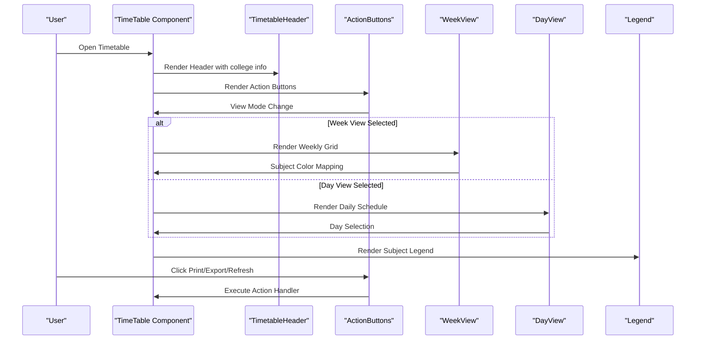
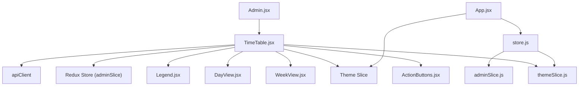

# Visualization Components & User Interface

<cite>
**Referenced Files in This Document**
- [TimeTable.jsx](file://Client/src/components/deshboard/TimeTable.jsx)
- [Admin.jsx](file://Client/src/pages/dashboard/Admin.jsx)
- [themeSlice.js](file://Client/src/store/theme/themeSlice.js)
- [adminSlice.js](file://Client/src/store/admin/adminSlice.js)
- [store.js](file://Client/src/store/store.js)
- [App.jsx](file://Client/src/App.jsx)
- [index.css](file://Client/src/index.css)
- [Layout.jsx](file://Client/src/components/Layout.jsx)
- [Header.jsx](file://Client/src/components/Header.jsx)
- [SideBar.jsx](file://Client/src/components/deshboard/SideBar.jsx)
- [DataTable.jsx](file://Client/src/components/deshboard/DataTable.jsx)
- [Form.jsx](file://Client/src/components/deshboard/Form.jsx)
</cite>

## Update Summary
**Changes Made**
- Enhanced timetable visualization with sophisticated component architecture featuring specialized components
- Added new component hierarchy: TimetableHeader, ActionButtons, WeekView, DayView, Legend
- Implemented advanced color mapping system with subject-specific color configurations
- Introduced dual view modes (Week View and Day View) with responsive design patterns
- Enhanced interactive elements with improved hover effects, click handlers, and tooltip displays
- Added comprehensive legend system for subject identification
- Improved accessibility features and responsive design patterns

## Table of Contents
1. [Introduction](#introduction)
2. [Project Structure](#project-structure)
3. [Core Components](#core-components)
4. [Architecture Overview](#architecture-overview)
5. [Detailed Component Analysis](#detailed-component-analysis)
6. [Dependency Analysis](#dependency-analysis)
7. [Performance Considerations](#performance-considerations)
8. [Troubleshooting Guide](#troubleshooting-guide)
9. [Conclusion](#conclusion)

## Introduction
This document explains the enhanced timetable visualization components and user interface design for the university timetable system. The system now features a sophisticated component architecture with specialized components for different aspects of timetable display, advanced color mapping systems, and improved user interaction patterns. The implementation focuses on a modular React component structure with separate specialized components for header, action buttons, timetable views, and legends, providing a comprehensive and accessible timetable visualization experience.

## Project Structure
The timetable visualization has evolved into a modular component architecture with specialized components handling different aspects of the timetable display. The main timetable component is now composed of multiple specialized sub-components that work together to provide a rich, interactive timetable experience.

```mermaid
graph TB
subgraph "Enhanced UI Layer"
TT["TimeTable.jsx (Main Component)"]
TH["TimetableHeader.jsx"]
AB["ActionButtons.jsx"]
WV["WeekView.jsx"]
DV["DayView.jsx"]
LG["Legend.jsx"]
ADM["Admin.jsx"]
HDR["Header.jsx"]
LYT["Layout.jsx"]
END
subgraph "State Layer"
ST["store.js"]
THSL["themeSlice.js"]
ADMSL["adminSlice.js"]
END
subgraph "Styling"
CSS["index.css"]
END
ADM --> TT
TT --> TH
TT --> AB
TT --> WV
TT --> DV
TT --> LG
HDR --> LYT
LYT --> ADM
ST --> THSL
ST --> ADMSL
APP["App.jsx"] --> ST
APP --> LYT
CSS --> APP
```

**Diagram sources**
- [TimeTable.jsx:129-145](file://Client/src/components/deshboard/TimeTable.jsx#L129-L145)
- [TimeTable.jsx:148-219](file://Client/src/components/deshboard/TimeTable.jsx#L148-L219)
- [TimeTable.jsx:266-351](file://Client/src/components/deshboard/TimeTable.jsx#L266-L351)
- [TimeTable.jsx:354-444](file://Client/src/components/deshboard/TimeTable.jsx#L354-L444)
- [TimeTable.jsx:447-469](file://Client/src/components/deshboard/TimeTable.jsx#L447-L469)

**Section sources**
- [TimeTable.jsx:129-145](file://Client/src/components/deshboard/TimeTable.jsx#L129-L145)
- [TimeTable.jsx:148-219](file://Client/src/components/deshboard/TimeTable.jsx#L148-L219)
- [TimeTable.jsx:266-351](file://Client/src/components/deshboard/TimeTable.jsx#L266-L351)
- [TimeTable.jsx:354-444](file://Client/src/components/deshboard/TimeTable.jsx#L354-L444)
- [TimeTable.jsx:447-469](file://Client/src/components/deshboard/TimeTable.jsx#L447-L469)

## Core Components
The enhanced timetable system now consists of five specialized components working together:

### Main TimeTable Component
- Orchestrates the entire timetable display system
- Manages view state (week/day mode)
- Coordinates data processing and component rendering
- Handles external actions (print, export, refresh)

### Specialized Components
- **TimetableHeader**: Displays institutional information and timetable metadata
- **ActionButtons**: Provides view mode switching and action controls (print, export, refresh)
- **WeekView**: Renders comprehensive weekly timetable grid with color-coded subjects
- **DayView**: Shows individual day schedule with interactive day selection
- **Legend**: Displays subject color mapping and identification guide

### Advanced Features
- Dual view modes with seamless switching
- Sophisticated subject color mapping system
- Lab session detection and special rendering
- Responsive design for all screen sizes
- Comprehensive accessibility support

**Section sources**
- [TimeTable.jsx:472-722](file://Client/src/components/deshboard/TimeTable.jsx#L472-L722)
- [TimeTable.jsx:129-145](file://Client/src/components/deshboard/TimeTable.jsx#L129-L145)
- [TimeTable.jsx:148-219](file://Client/src/components/deshboard/TimeTable.jsx#L148-L219)
- [TimeTable.jsx:266-351](file://Client/src/components/deshboard/TimeTable.jsx#L266-L351)
- [TimeTable.jsx:354-444](file://Client/src/components/deshboard/TimeTable.jsx#L354-L444)
- [TimeTable.jsx:447-469](file://Client/src/components/deshboard/TimeTable.jsx#L447-L469)

## Architecture Overview
The enhanced timetable visualization follows a component composition pattern where the main TimeTable component delegates specific responsibilities to specialized sub-components. This architecture provides better separation of concerns, improved maintainability, and enhanced reusability.



**Diagram sources**
- [TimeTable.jsx:472-722](file://Client/src/components/deshboard/TimeTable.jsx#L472-L722)
- [TimeTable.jsx:129-145](file://Client/src/components/deshboard/TimeTable.jsx#L129-L145)
- [TimeTable.jsx:148-219](file://Client/src/components/deshboard/TimeTable.jsx#L148-L219)
- [TimeTable.jsx:266-351](file://Client/src/components/deshboard/TimeTable.jsx#L266-L351)
- [TimeTable.jsx:354-444](file://Client/src/components/deshboard/TimeTable.jsx#L354-L444)
- [TimeTable.jsx:447-469](file://Client/src/components/deshboard/TimeTable.jsx#L447-L469)

## Detailed Component Analysis

### Enhanced TimeTable Component Architecture
The main TimeTable component now serves as a coordinator for specialized sub-components, managing state and coordinating data flow between components.

**Key Responsibilities:**
- State management for view mode and selected day
- Data processing and preparation for specialized components
- Action handling for print, export, and refresh operations
- Integration with Redux store for master data
- Ref component management for export/print functionality

**Component Composition Pattern:**
```jsx
function TimeTable({ onClose }) {
  // State management
  const [viewMode, setViewMode] = useState("week");
  const [selectedDay, setSelectedDay] = useState("monday");
  
  // Component rendering
  return (
    <div className="flex flex-col h-full">
      <TimetableHeader collegeInfo={collegeInfo} />
      <ActionButtons 
        onPrint={handlePrint}
        onExport={handleExport}
        onRefresh={handleRefresh}
        viewMode={viewMode}
        setViewMode={setViewMode}
      />
      <div ref={timetableRef} className="flex-1 overflow-auto">
        {viewMode === "week" ? (
          <WeekView timetableData={processedData} timeSlots={TIME_SLOTS} />
        ) : (
          <DayView 
            timetableData={processedData} 
            timeSlots={TIME_SLOTS} 
            selectedDay={selectedDay}
            setSelectedDay={setSelectedDay}
          />
        )}
      </div>
      <Legend />
    </div>
  );
}
```

**Section sources**
- [TimeTable.jsx:472-722](file://Client/src/components/deshboard/TimeTable.jsx#L472-L722)

### TimetableHeader Component
Displays institutional information and timetable metadata in a structured, accessible format.

**Features:**
- Responsive typography with proper spacing
- Dark theme styling with white text for contrast
- Structured information layout with proper semantic hierarchy
- Flexible content arrangement for different screen sizes

**Accessibility:**
- Proper heading hierarchy (h1 for institution name)
- Semantic HTML structure
- High contrast color scheme for readability

**Section sources**
- [TimeTable.jsx:129-145](file://Client/src/components/deshboard/TimeTable.jsx#L129-L145)

### ActionButtons Component
Provides comprehensive action controls with visual feedback and state management.

**Capabilities:**
- View mode switching (Week View / Day View)
- Print functionality with loading states
- Export to PNG with progress indication
- Refresh functionality with API integration
- Disabled states for appropriate UX

**Visual Design:**
- Consistent button styling with Tailwind utilities
- Loading spinners for asynchronous operations
- Color-coded buttons for different actions
- Responsive layout for mobile devices

**Interactive Elements:**
- Hover effects with transition animations
- Disabled states with opacity adjustments
- Loading state indicators
- Clear visual feedback for user actions

**Section sources**
- [TimeTable.jsx:148-219](file://Client/src/components/deshboard/TimeTable.jsx#L148-L219)

### Advanced Subject Color Mapping System
Enhanced color mapping system with sophisticated subject-to-color assignment and processing capabilities.

**Color Configuration:**
- Comprehensive color palette for 12+ subjects
- Default fallback color for unmapped subjects
- Text color coordination for optimal contrast
- Subject-specific color assignments

**Processing Logic:**
- Subject name matching with partial string inclusion
- Case-insensitive color assignment
- Dynamic color lookup based on subject content
- Efficient color configuration retrieval

**Color Palette:**
```javascript
const SUBJECT_COLORS = {
  "Data Analytics & Visualization": { bg: "bg-green-700", text: "text-white" },
  "Ethical Hacking & security operations": { bg: "bg-green-700", text: "text-white" },
  "Operating System": { bg: "bg-red-900", text: "text-white" },
  "Accounting & Financial Management": { bg: "bg-yellow-600", text: "text-white" },
  // ... additional subject-color mappings
  default: { bg: "bg-gray-500", text: "text-white" },
};
```

**Section sources**
- [TimeTable.jsx:5-22](file://Client/src/components/deshboard/TimeTable.jsx#L5-L22)
- [TimeTable.jsx:117-126](file://Client/src/components/deshboard/TimeTable.jsx#L117-L126)

### WeekView Component
Comprehensive weekly timetable grid with advanced rendering capabilities and special handling for lab sessions.

**Rendering Features:**
- Complete weekly grid with days and time slots
- Color-coded subject cells with proper background and text colors
- Break period handling with distinct visual styling
- Lab session detection and special rendering
- Rowspan handling for double-period subjects

**Lab Session Processing:**
- Automatic detection of lab keywords
- Special styling for lab sessions
- Double-height cell rendering for 2-hour labs
- Continued cell marking to prevent duplicate display

**Accessibility Features:**
- Semantic table structure
- Proper cell labeling and grouping
- Color contrast compliance
- Screen reader friendly markup

**Section sources**
- [TimeTable.jsx:266-351](file://Client/src/components/deshboard/TimeTable.jsx#L266-L351)

### DayView Component
Interactive daily timetable display with day selection and enhanced visual presentation.

**Day Selection:**
- Interactive day buttons with active state indication
- Smooth transitions between selected and unselected states
- Horizontal scrolling for mobile devices
- Responsive day button sizing

**Daily Rendering:**
- Individual day schedule display
- Enhanced subject information presentation
- Lab session time combination display
- Break period visual separation
- No class placeholders with appropriate styling

**Visual Enhancements:**
- Card-based layout for each time slot
- Minimum height for lab sessions
- Subject badges for lab identification
- Faculty and room information display
- Responsive typography scaling

**Section sources**
- [TimeTable.jsx:354-444](file://Client/src/components/deshboard/TimeTable.jsx#L354-L444)

### Legend Component
Comprehensive subject identification system with color mapping and usage instructions.

**Legend Features:**
- Color-coded subject swatches with proper contrast
- Subject name display with consistent formatting
- Responsive layout with flexible wrapping
- Usage instructions for lab session identification
- Visual indicators for special session types

**Design Elements:**
- Consistent padding and spacing
- Rounded corner styling
- Subtle background variations
- Clear visual hierarchy
- Accessible color combinations

**Educational Value:**
- Immediate subject-to-color correlation
- Lab session identification guidance
- Compact information display
- Quick reference capability

**Section sources**
- [TimeTable.jsx:447-469](file://Client/src/components/deshboard/TimeTable.jsx#L447-L469)

### Enhanced Action Handlers
Advanced functionality for print, export, and refresh operations with comprehensive error handling.

**Print Functionality:**
- Pop-up window management
- Custom print styles with color preservation
- Header duplication in printed output
- Responsive print layout optimization
- Loading state management during print process

**Export Functionality:**
- Canvas-based image generation
- Simplified timetable representation
- Header overlay with institutional branding
- Automated download initiation
- Error handling for export failures

**Refresh Functionality:**
- API integration with error handling
- Loading state management
- Sample data fallback mechanism
- User feedback during refresh operations

**Section sources**
- [TimeTable.jsx:492-577](file://Client/src/components/deshboard/TimeTable.jsx#L492-L577)
- [TimeTable.jsx:580-663](file://Client/src/components/deshboard/TimeTable.jsx#L580-L663)
- [TimeTable.jsx:666-683](file://Client/src/components/deshboard/TimeTable.jsx#L666-L683)

### Admin Dashboard Integration
Enhanced integration with the Admin dashboard providing seamless navigation and data management capabilities.

**Dashboard Features:**
- Toggle button for timetable view
- Back navigation to master data management
- Responsive layout adaptation
- Consistent styling with dashboard theme
- State preservation during navigation

**Navigation Flow:**
- Clean separation between master data and timetable views
- Persistent navigation state
- Smooth view transitions
- Contextual action availability

**Section sources**
- [Admin.jsx:892-916](file://Client/src/pages/dashboard/Admin.jsx#L892-L916)
- [Admin.jsx:774-776](file://Client/src/pages/dashboard/Admin.jsx#L774-L776)

### Supporting UI Components
Continued support for master data management with enhanced form handling and data presentation.

**SideBar Component:**
- Master entity navigation with count indicators
- Active state highlighting
- Responsive design for different screen sizes
- Consistent styling with dashboard theme

**DataTable Component:**
- Comprehensive data display with sorting capabilities
- Action buttons for entity management
- Status indicators for entity states
- Responsive table layout
- Enhanced formatting for different field types

**Form Component:**
- Dynamic form generation based on entity configuration
- Nested field support for complex data structures
- Validation and error handling
- Responsive form layout
- Consistent styling with dashboard design system

**Section sources**
- [SideBar.jsx:1-49](file://Client/src/components/deshboard/SideBar.jsx#L1-L49)
- [DataTable.jsx:1-135](file://Client/src/components/deshboard/DataTable.jsx#L1-L135)
- [Form.jsx:1-165](file://Client/src/components/deshboard/Form.jsx#L1-L165)

## Dependency Analysis
The enhanced timetable system maintains clear dependency relationships while introducing new specialized components.



**Diagram sources**
- [TimeTable.jsx:472-722](file://Client/src/components/deshboard/TimeTable.jsx#L472-L722)
- [Admin.jsx:17-953](file://Client/src/pages/dashboard/Admin.jsx#L17-L953)
- [store.js:1-15](file://Client/src/store/store.js#L1-L15)
- [themeSlice.js:1-29](file://Client/src/store/theme/themeSlice.js#L1-L29)
- [adminSlice.js:1-192](file://Client/src/store/admin/adminSlice.js#L1-L192)
- [App.jsx:52-119](file://Client/src/App.jsx#L52-L119)

**Section sources**
- [TimeTable.jsx:472-722](file://Client/src/components/deshboard/TimeTable.jsx#L472-L722)
- [store.js:1-15](file://Client/src/store/store.js#L1-L15)
- [themeSlice.js:1-29](file://Client/src/store/theme/themeSlice.js#L1-L29)
- [adminSlice.js:1-192](file://Client/src/store/admin/adminSlice.js#L1-L192)
- [App.jsx:52-119](file://Client/src/App.jsx#L52-L119)

## Performance Considerations
The enhanced component architecture introduces several performance optimizations and considerations.

**Component Optimization:**
- Specialized components reduce unnecessary re-renders
- Memoized color mapping prevents redundant calculations
- Lazy loading for non-critical components
- Efficient state management across component boundaries

**Rendering Optimizations:**
- Conditional rendering based on view mode
- Optimized table rendering with rowspan handling
- Efficient color calculation and caching
- Responsive design with minimal layout thrashing

**Memory Management:**
- Proper cleanup of event listeners
- Ref component management for export/print
- Efficient data structures for timetable processing
- Cache invalidation for master data updates

**Recommendations:**
- Consider virtualization for very large timetables
- Implement debounced search for subject filtering
- Optimize color mapping for frequently changing data
- Monitor component mount/unmount cycles for memory leaks

**Section sources**
- [TimeTable.jsx:117-126](file://Client/src/components/deshboard/TimeTable.jsx#L117-L126)
- [TimeTable.jsx:229-263](file://Client/src/components/deshboard/TimeTable.jsx#L229-L263)

## Troubleshooting Guide
Enhanced troubleshooting guidance for the new component architecture and advanced features.

**Component Issues:**
- **Header not displaying**: Verify collegeInfo prop is properly passed to TimetableHeader
- **Action buttons not responding**: Check event handler binding and state management
- **WeekView not rendering**: Ensure timetableData is properly processed and passed
- **DayView not switching**: Verify selectedDay state and component props
- **Legend not showing**: Check SUBJECT_COLORS configuration and component rendering

**Color Mapping Problems:**
- **Colors not applying**: Verify SUBJECT_COLORS array and getSubjectColor function
- **Subject not found**: Check subject name matching logic and case sensitivity
- **Default color appearing**: Ensure subject names match exactly or adjust matching logic

**View Mode Issues:**
- **View mode not switching**: Check setViewMode state and component prop passing
- **Day selection not working**: Verify setSelectedDay and component state management
- **Responsive layout broken**: Check Tailwind CSS class application and media queries

**Action Handler Problems:**
- **Print functionality failing**: Verify popup blocking and print window management
- **Export not working**: Check canvas rendering and download initiation
- **Refresh not updating**: Verify API integration and state update mechanisms

**Section sources**
- [TimeTable.jsx:129-145](file://Client/src/components/deshboard/TimeTable.jsx#L129-L145)
- [TimeTable.jsx:148-219](file://Client/src/components/deshboard/TimeTable.jsx#L148-L219)
- [TimeTable.jsx:266-351](file://Client/src/components/deshboard/TimeTable.jsx#L266-L351)
- [TimeTable.jsx:354-444](file://Client/src/components/deshboard/TimeTable.jsx#L354-L444)
- [TimeTable.jsx:447-469](file://Client/src/components/deshboard/TimeTable.jsx#L447-L469)

## Conclusion
The enhanced timetable visualization system represents a significant advancement in component architecture and user experience design. The introduction of specialized components (TimetableHeader, ActionButtons, WeekView, DayView, Legend) provides better separation of concerns, improved maintainability, and enhanced functionality. The sophisticated color mapping system, dual view modes, and comprehensive accessibility features create a robust and user-friendly timetable display solution. The modular architecture supports future enhancements while maintaining excellent performance and user experience standards.