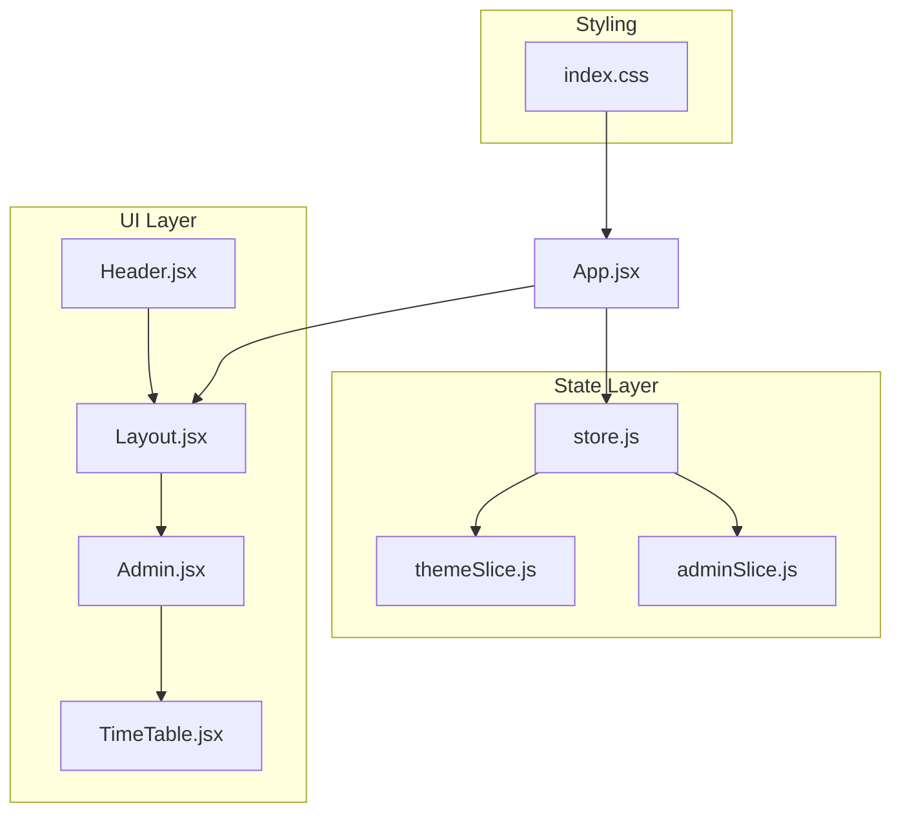
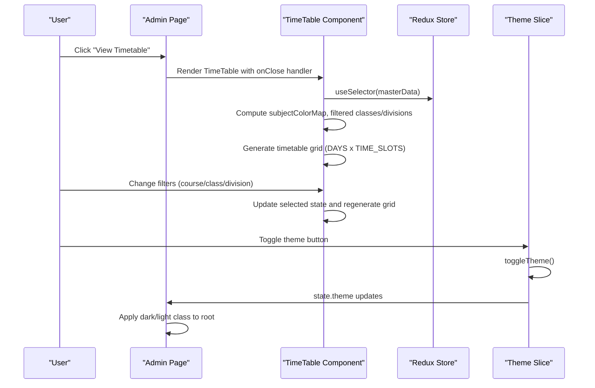
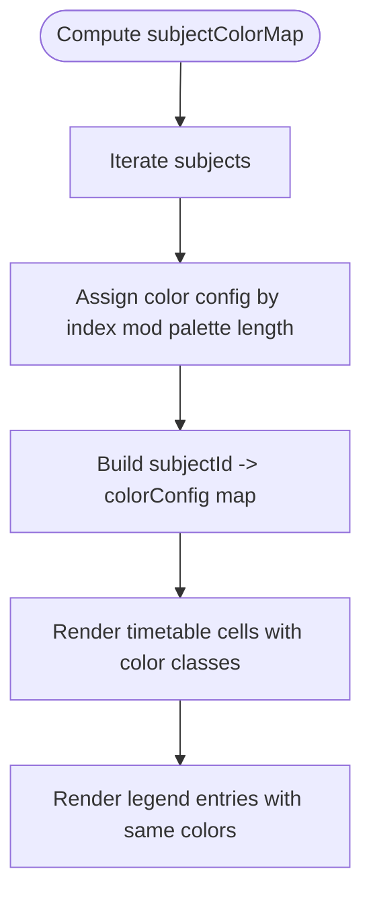
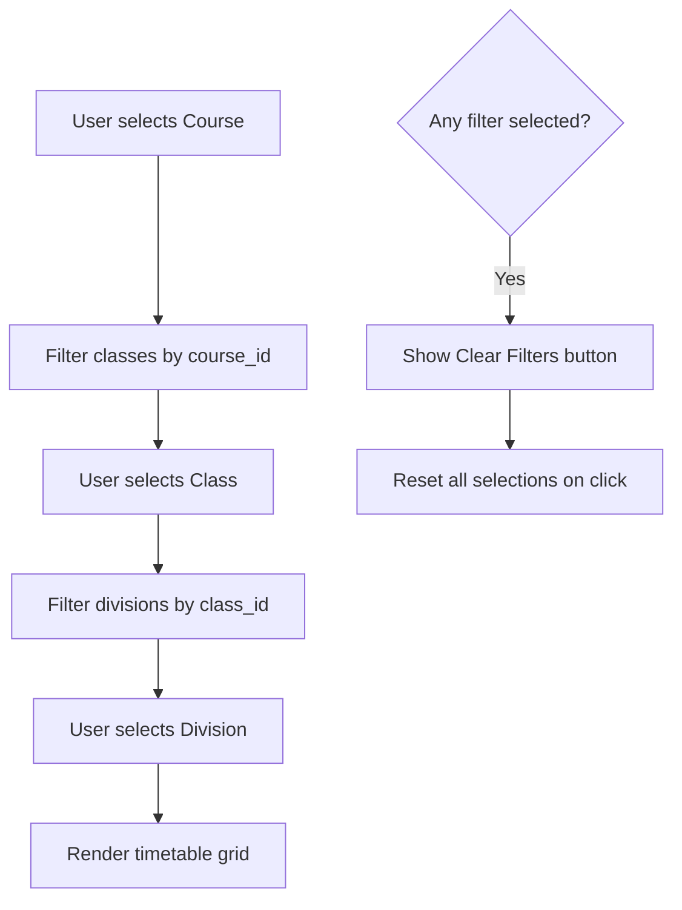
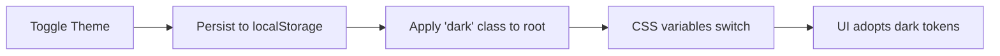
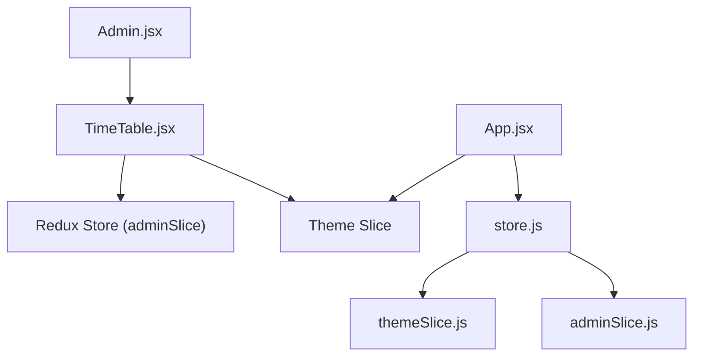

# Visualization Components & User Interface

<cite>
**Referenced Files in This Document**
- [TimeTable.jsx](file://Client/src/components/deshboard/TimeTable.jsx)
- [Admin.jsx](file://Client/src/pages/dashboard/Admin.jsx)
- [themeSlice.js](file://Client/src/store/theme/themeSlice.js)
- [adminSlice.js](file://Client/src/store/admin/adminSlice.js)
- [store.js](file://Client/src/store/store.js)
- [App.jsx](file://Client/src/App.jsx)
- [index.css](file://Client/src/index.css)
- [Layout.jsx](file://Client/src/components/Layout.jsx)
- [Header.jsx](file://Client/src/components/Header.jsx)
- [SideBar.jsx](file://Client/src/components/deshboard/SideBar.jsx)
- [DataTable.jsx](file://Client/src/components/deshboard/DataTable.jsx)
- [Form.jsx](file://Client/src/components/deshboard/Form.jsx)
</cite>

## Table of Contents
1. [Introduction](#introduction)
2. [Project Structure](#project-structure)
3. [Core Components](#core-components)
4. [Architecture Overview](#architecture-overview)
5. [Detailed Component Analysis](#detailed-component-analysis)
6. [Dependency Analysis](#dependency-analysis)
7. [Performance Considerations](#performance-considerations)
8. [Troubleshooting Guide](#troubleshooting-guide)
9. [Conclusion](#conclusion)

## Introduction
This document explains the timetable visualization components and user interface design for the university timetable system. It focuses on the React component architecture for rendering a grid-based timetable, the subject color mapping system, the filter pipeline for course, class, and division selection, and the responsive design and theme support. It also documents interactive elements, the legend system, and styling strategies using Tailwind CSS and component composition patterns.

## Project Structure
The timetable visualization lives within the client-side React application. The main timetable component is integrated into the Admin dashboard page, which orchestrates master data fetching and navigation. Theme and Redux stores manage global state for theme switching and master data.

**Diagram sources**
- [Admin.jsx:17-617](file://Client/src/pages/dashboard/Admin.jsx#L17-L617)
- [TimeTable.jsx:62-370](file://Client/src/components/deshboard/TimeTable.jsx#L62-L370)
- [Header.jsx:1-122](file://Client/src/components/Header.jsx#L1-L122)
- [Layout.jsx:1-22](file://Client/src/components/Layout.jsx#L1-L22)
- [store.js:1-15](file://Client/src/store/store.js#L1-L15)
- [themeSlice.js:1-29](file://Client/src/store/theme/themeSlice.js#L1-L29)
- [adminSlice.js:1-173](file://Client/src/store/admin/adminSlice.js#L1-L173)
- [App.jsx:13-41](file://Client/src/App.jsx#L13-L41)
- [index.css:1-42](file://Client/src/index.css#L1-L42)

**Section sources**
- [Admin.jsx:17-617](file://Client/src/pages/dashboard/Admin.jsx#L17-L617)
- [TimeTable.jsx:62-370](file://Client/src/components/deshboard/TimeTable.jsx#L62-L370)
- [store.js:1-15](file://Client/src/store/store.js#L1-L15)
- [App.jsx:13-41](file://Client/src/App.jsx#L13-L41)
- [index.css:1-42](file://Client/src/index.css#L1-L42)

## Core Components
- TimeTable: Renders a responsive grid timetable with filters, subject color mapping, and a subject legend.
- Admin: Hosts the TimeTable view alongside master data management UI and handles navigation and data loading.
- Theme Store: Manages light/dark mode persistence and applies CSS variables accordingly.
- Redux Admin Store: Centralizes master data fetching and CRUD operations for entities used by the timetable.

Key responsibilities:
- Timetable grid generation and break handling
- Dynamic subject color assignment
- Cascading filter pipeline (course → class → division)
- Responsive layout and theme-aware styling
- Interactive elements: hover, click, tooltips via titles and hover states

**Section sources**
- [TimeTable.jsx:62-370](file://Client/src/components/deshboard/TimeTable.jsx#L62-L370)
- [Admin.jsx:17-617](file://Client/src/pages/dashboard/Admin.jsx#L17-L617)
- [themeSlice.js:1-29](file://Client/src/store/theme/themeSlice.js#L1-L29)
- [adminSlice.js:1-173](file://Client/src/store/admin/adminSlice.js#L1-L173)

## Architecture Overview
The timetable visualization is a composed UI built on React and Redux. The Admin page toggles between master data management and the timetable view. The TimeTable component consumes Redux state for master data and computes derived data (filters, color map, timetable grid). Theme changes propagate via CSS variables applied to the root element.

**Diagram sources**
- [Admin.jsx:437-440](file://Client/src/pages/dashboard/Admin.jsx#L437-L440)
- [TimeTable.jsx:62-370](file://Client/src/components/deshboard/TimeTable.jsx#L62-L370)
- [themeSlice.js:18-23](file://Client/src/store/theme/themeSlice.js#L18-L23)
- [App.jsx:16-24](file://Client/src/App.jsx#L16-L24)

## Detailed Component Analysis

### TimeTable Component
Responsibilities:
- Accepts an optional onClose callback to return to the dashboard
- Reads master data from Redux (courses, classes, subjects, divisions)
- Implements cascading filters: course → class → division
- Generates a grid timetable with days and time slots
- Applies subject-specific colors and renders breaks distinctly
- Provides a subject legend for quick identification

Filter pipeline:
- Course filter drives available classes
- Class filter drives available divisions
- Clear filters resets all selections

Grid rendering:
- Header row lists days
- First column lists time slots with labels and break indicators
- Cells display subject info with color classes derived from subjectColorMap
- Break rows are visually distinct

Interactive elements:
- Hover effects via Tailwind hover classes
- Disabled states for dependent selects
- Clear filters button appears when any filter is set

Legend:
- Displays up to a subset of subjects with matching colors and identifiers

Accessibility:
- Uses semantic table markup
- Titles on action buttons for screen readers
- Focus-visible outlines via focus-ring utilities

Styling strategy:
- Tailwind utilities for spacing, colors, borders, and shadows
- CSS variables for theme-aware tokens
- Responsive breakpoints for filter layout and table overflow

**Section sources**
- [TimeTable.jsx:62-370](file://Client/src/components/deshboard/TimeTable.jsx#L62-L370)

#### Subject Color Mapping System
- A fixed palette of color configurations is mapped to subjects
- The mapping is computed via a memoized selector keyed by subjects
- Each subject receives a unique color class for background, border, text, and hover states
- The legend mirrors the same palette for quick association

**Diagram sources**
- [TimeTable.jsx:73-80](file://Client/src/components/deshboard/TimeTable.jsx#L73-L80)
- [TimeTable.jsx:107-110](file://Client/src/components/deshboard/TimeTable.jsx#L107-L110)
- [TimeTable.jsx:338-360](file://Client/src/components/deshboard/TimeTable.jsx#L338-L360)

**Section sources**
- [TimeTable.jsx:4-21](file://Client/src/components/deshboard/TimeTable.jsx#L4-L21)
- [TimeTable.jsx:73-80](file://Client/src/components/deshboard/TimeTable.jsx#L73-L80)
- [TimeTable.jsx:107-110](file://Client/src/components/deshboard/TimeTable.jsx#L107-L110)
- [TimeTable.jsx:338-360](file://Client/src/components/deshboard/TimeTable.jsx#L338-L360)

#### Filter System: Course → Class → Division
- Course filter populates class options
- Class filter populates division options
- Dependent selects are disabled until prerequisites are selected
- Clear filters resets all selections

**Diagram sources**
- [TimeTable.jsx:82-99](file://Client/src/components/deshboard/TimeTable.jsx#L82-L99)
- [TimeTable.jsx:138-207](file://Client/src/components/deshboard/TimeTable.jsx#L138-L207)

**Section sources**
- [TimeTable.jsx:82-99](file://Client/src/components/deshboard/TimeTable.jsx#L82-L99)
- [TimeTable.jsx:138-207](file://Client/src/components/deshboard/TimeTable.jsx#L138-L207)

#### Responsive Design and Theme Support
- Responsive filter layout: flex-wrap allows filters to stack on small screens
- Horizontal scrolling for the timetable table on small viewports
- Theme switching persists in localStorage and reflects on the root element
- CSS variables define theme tokens; dark class toggles color scheme

**Diagram sources**
- [themeSlice.js:18-23](file://Client/src/store/theme/themeSlice.js#L18-L23)
- [App.jsx:16-24](file://Client/src/App.jsx#L16-L24)
- [index.css:26-35](file://Client/src/index.css#L26-L35)

**Section sources**
- [TimeTable.jsx:212-364](file://Client/src/components/deshboard/TimeTable.jsx#L212-L364)
- [themeSlice.js:1-29](file://Client/src/store/theme/themeSlice.js#L1-L29)
- [App.jsx:16-24](file://Client/src/App.jsx#L16-L24)
- [index.css:1-42](file://Client/src/index.css#L1-L42)

#### Accessibility Features
- Semantic table structure for tabular data
- Tooltips via button titles for edit/delete actions
- Focus-visible ring utilities for keyboard navigation
- Sufficient color contrast via theme-aware tokens

**Section sources**
- [TimeTable.jsx:264-333](file://Client/src/components/deshboard/TimeTable.jsx#L264-L333)
- [DataTable.jsx:60-75](file://Client/src/components/deshboard/DataTable.jsx#L60-L75)

#### Legend System
- Displays a horizontal row of colored swatches and subject identifiers
- Mirrors the subjectColorMap for immediate visual correlation
- Limited to a subset of subjects for readability

**Section sources**
- [TimeTable.jsx:335-361](file://Client/src/components/deshboard/TimeTable.jsx#L335-L361)

### Admin Dashboard Integration
- Fetches master data for programs, courses, rooms, classes, sections, subjects, specializations, faculties, and students
- Toggles between master data management and timetable views
- Passes onClose to TimeTable so users can return to the dashboard

**Section sources**
- [Admin.jsx:24-38](file://Client/src/pages/dashboard/Admin.jsx#L24-L38)
- [Admin.jsx:437-440](file://Client/src/pages/dashboard/Admin.jsx#L437-L440)

### Supporting UI Components
- SideBar: Lists master entities with counts and selection state
- DataTable: Renders entity records with edit/delete actions
- Form: Handles entity creation/editing with validation and submission

**Section sources**
- [SideBar.jsx:1-49](file://Client/src/components/deshboard/SideBar.jsx#L1-L49)
- [DataTable.jsx:1-86](file://Client/src/components/deshboard/DataTable.jsx#L1-L86)
- [Form.jsx:1-127](file://Client/src/components/deshboard/Form.jsx#L1-L127)

## Dependency Analysis
The timetable component depends on Redux for master data and on the theme store for theme state. The Admin page composes the TimeTable and manages navigation. The theme store persists and applies theme preferences globally.

**Diagram sources**
- [TimeTable.jsx:62-370](file://Client/src/components/deshboard/TimeTable.jsx#L62-L370)
- [Admin.jsx:17-617](file://Client/src/pages/dashboard/Admin.jsx#L17-L617)
- [store.js:1-15](file://Client/src/store/store.js#L1-L15)
- [themeSlice.js:1-29](file://Client/src/store/theme/themeSlice.js#L1-L29)
- [adminSlice.js:1-173](file://Client/src/store/admin/adminSlice.js#L1-L173)
- [App.jsx:13-41](file://Client/src/App.jsx#L13-L41)

**Section sources**
- [TimeTable.jsx:62-370](file://Client/src/components/deshboard/TimeTable.jsx#L62-L370)
- [store.js:1-15](file://Client/src/store/store.js#L1-L15)
- [themeSlice.js:1-29](file://Client/src/store/theme/themeSlice.js#L1-L29)
- [adminSlice.js:1-173](file://Client/src/store/admin/adminSlice.js#L1-L173)
- [App.jsx:13-41](file://Client/src/App.jsx#L13-L41)

## Performance Considerations
- Memoization: subjectColorMap and filtered lists are recomputed only when dependencies change
- Conditional rendering: timetable grid is shown only after a class is selected
- Minimal DOM: table-based layout scales linearly with time slots and days
- CSS variables: efficient theme switching without re-rendering components

Recommendations:
- Virtualize long tables if the number of time slots increases significantly
- Debounce filter inputs if data volume grows
- Lazy load master data per entity as needed

**Section sources**
- [TimeTable.jsx:73-105](file://Client/src/components/deshboard/TimeTable.jsx#L73-L105)

## Troubleshooting Guide
Common issues and resolutions:
- Filters not updating: ensure course is selected before enabling class filter; class must be selected before enabling division filter
- Empty timetable grid: select a class; the grid renders only when a class is chosen
- Colors not applied: verify subjectColorMap is populated from Redux masterData.subject
- Theme not switching: confirm theme slice toggle is dispatched and root element class is toggled
- Styling inconsistencies: check Tailwind CSS variable usage and dark class presence on root

**Section sources**
- [TimeTable.jsx:138-207](file://Client/src/components/deshboard/TimeTable.jsx#L138-L207)
- [TimeTable.jsx:212-236](file://Client/src/components/deshboard/TimeTable.jsx#L212-L236)
- [themeSlice.js:18-23](file://Client/src/store/theme/themeSlice.js#L18-L23)
- [App.jsx:16-24](file://Client/src/App.jsx#L16-L24)

## Conclusion
The timetable visualization is a modular, theme-aware, and responsive React component that integrates seamlessly with the Admin dashboard. Its filter pipeline, subject color mapping, and legend system provide a clear, accessible, and visually coherent timetable display. The component composition and Redux-driven data flow enable maintainable and scalable enhancements.