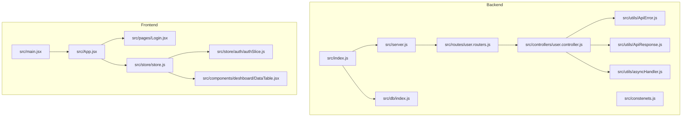
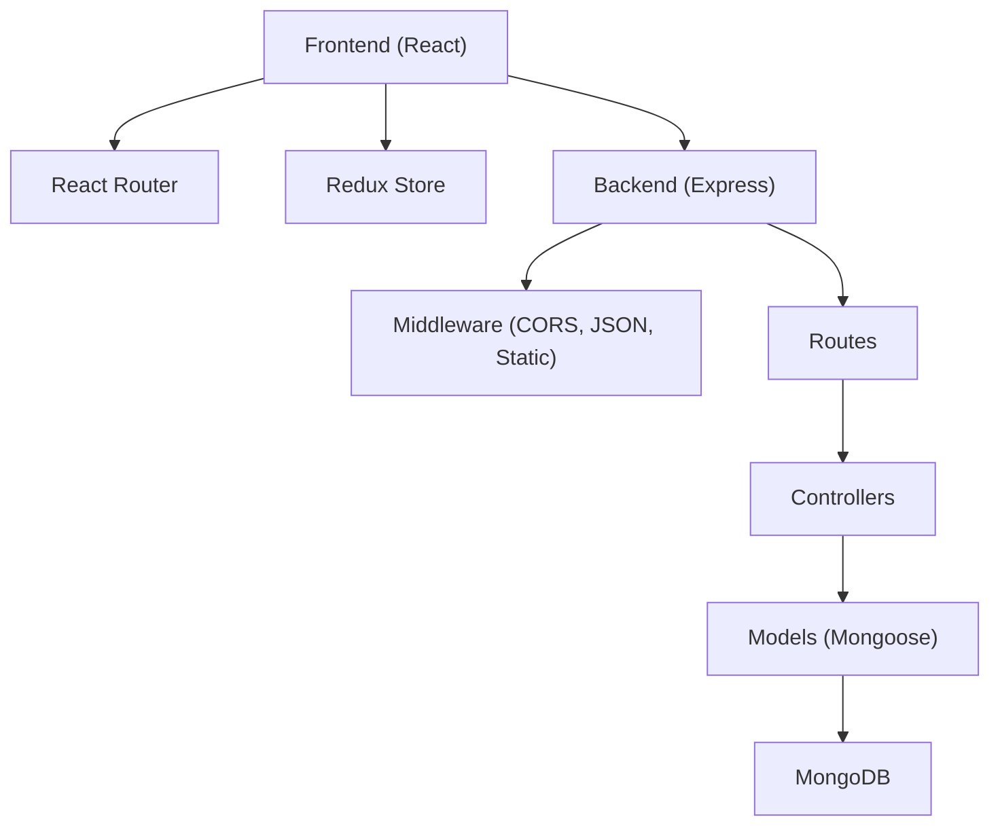
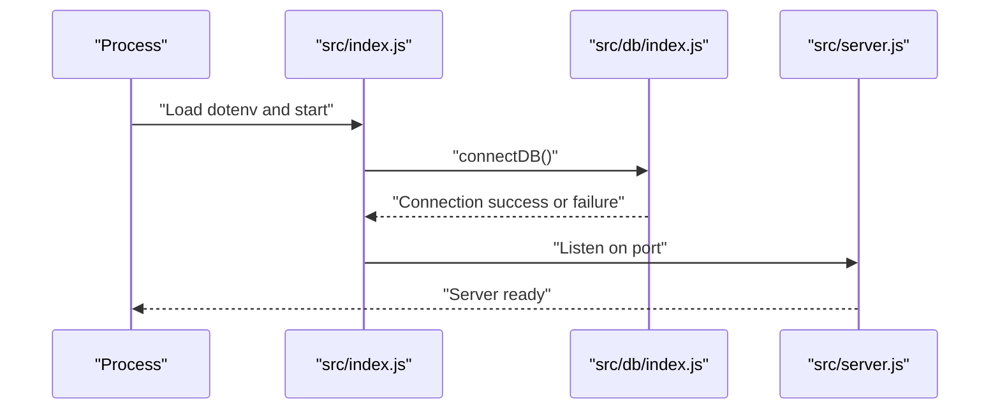
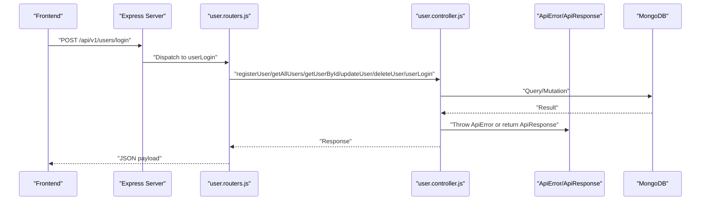
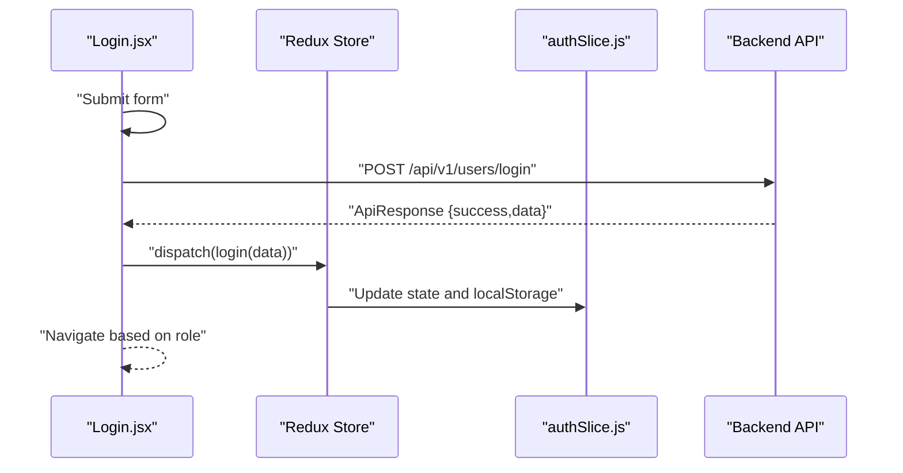
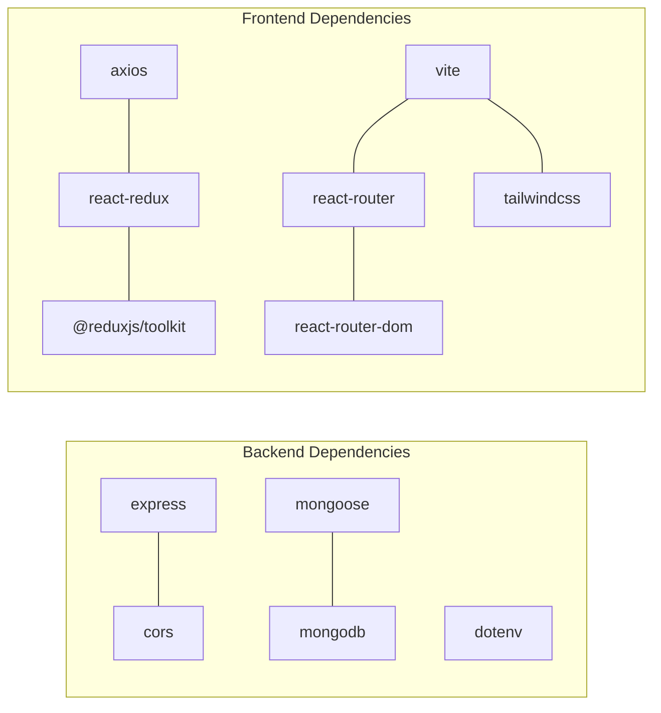

# Troubleshooting & FAQ

<cite>
**Referenced Files in This Document**
- [Backend package.json](file://Backend/package.json)
- [Client package.json](file://Client/package.json)
- [Backend index.js](file://Backend/src/index.js)
- [Backend server.js](file://Backend/src/server.js)
- [Backend db/index.js](file://Backend/src/db/index.js)
- [Backend constenets.js](file://Backend/src/constenets.js)
- [Backend utils/ApiError.js](file://Backend/src/utils/ApiError.js)
- [Backend utils/ApiResponse.js](file://Backend/src/utils/ApiResponse.js)
- [Backend utils/asyncHandler.js](file://Backend/src/utils/asyncHandler.js)
- [Backend routes/user.routers.js](file://Backend/src/routes/user.routers.js)
- [Backend controllers/user.controller.js](file://Backend/src/controllers/user.controller.js)
- [Client main.jsx](file://Client/src/main.jsx)
- [Client App.jsx](file://Client/src/App.jsx)
- [Client Login.jsx](file://Client/src/pages/Login.jsx)
- [Client store/store.js](file://Client/src/store/store.js)
- [Client store/auth/authSlice.js](file://Client/src/store/auth/authSlice.js)
- [Client components/deshboard/DataTable.jsx](file://Client/src/components/deshboard/DataTable.jsx)
</cite>

## Table of Contents
1. [Introduction](#introduction)
2. [Project Structure](#project-structure)
3. [Core Components](#core-components)
4. [Architecture Overview](#architecture-overview)
5. [Detailed Component Analysis](#detailed-component-analysis)
6. [Dependency Analysis](#dependency-analysis)
7. [Performance Considerations](#performance-considerations)
8. [Troubleshooting Guide](#troubleshooting-guide)
9. [Security Considerations](#security-considerations)
10. [FAQ](#faq)
11. [Conclusion](#conclusion)

## Introduction
This document provides comprehensive troubleshooting guidance and frequently asked questions for the Timetable Management System. It covers installation and environment setup, dependency conflicts, debugging techniques for frontend React components and Redux state, backend API issues, error handling and logging patterns, performance diagnostics, security considerations, integration and deployment tips, and production monitoring. The goal is to help developers quickly diagnose and resolve common issues while maintaining a secure, scalable, and observable system.

## Project Structure
The system comprises:
- Backend: Express server with MongoDB/Mongoose, modular routes and controllers, shared utilities for error and response handling, and a centralized database connection module.
- Frontend: React application bootstrapped with Vite, using Redux Toolkit for state management, TailwindCSS for styling, and React Router for navigation.

**Diagram sources**
- [Backend index.js:1-18](file://Backend/src/index.js#L1-L18)
- [Backend server.js:1-54](file://Backend/src/server.js#L1-L54)
- [Backend db/index.js:1-19](file://Backend/src/db/index.js#L1-L19)
- [Backend routes/user.routers.js:1-19](file://Backend/src/routes/user.routers.js#L1-L19)
- [Backend controllers/user.controller.js:1-355](file://Backend/src/controllers/user.controller.js#L1-L355)
- [Backend utils/ApiError.js:1-21](file://Backend/src/utils/ApiError.js#L1-L21)
- [Backend utils/ApiResponse.js:1-10](file://Backend/src/utils/ApiResponse.js#L1-L10)
- [Backend utils/asyncHandler.js:1-4](file://Backend/src/utils/asyncHandler.js#L1-L4)
- [Backend constenets.js:1-2](file://Backend/src/constenets.js#L1-L2)
- [Client main.jsx:1-18](file://Client/src/main.jsx#L1-L18)
- [Client App.jsx:1-41](file://Client/src/App.jsx#L1-L41)
- [Client Login.jsx:1-116](file://Client/src/pages/Login.jsx#L1-L116)
- [Client store/store.js:1-15](file://Client/src/store/store.js#L1-L15)
- [Client store/auth/authSlice.js:1-32](file://Client/src/store/auth/authSlice.js#L1-L32)
- [Client components/deshboard/DataTable.jsx:1-86](file://Client/src/components/deshboard/DataTable.jsx#L1-L86)

**Section sources**
- [Backend package.json:1-22](file://Backend/package.json#L1-L22)
- [Client package.json:1-36](file://Client/package.json#L1-L36)
- [Backend index.js:1-18](file://Backend/src/index.js#L1-L18)
- [Backend server.js:1-54](file://Backend/src/server.js#L1-L54)
- [Backend db/index.js:1-19](file://Backend/src/db/index.js#L1-L19)
- [Backend constenets.js:1-2](file://Backend/src/constenets.js#L1-L2)
- [Client main.jsx:1-18](file://Client/src/main.jsx#L1-L18)
- [Client App.jsx:1-41](file://Client/src/App.jsx#L1-L41)

## Core Components
- Backend server initialization and database connection orchestration.
- Centralized CORS configuration and middleware pipeline.
- Modular routing for user management with CRUD endpoints.
- Controller functions implementing business logic with robust input validation and error propagation via shared utilities.
- Frontend bootstrapping with Redux store configuration and theme persistence.
- Authentication flow using a dedicated slice and local storage for session state.
- Dashboard data table component consuming Redux-managed master data.

Key implementation references:
- Backend server startup and error binding: [Backend index.js:1-18](file://Backend/src/index.js#L1-L18)
- CORS and middleware setup: [Backend server.js:14-24](file://Backend/src/server.js#L14-L24)
- User routes definition: [Backend routes/user.routers.js:1-19](file://Backend/src/routes/user.routers.js#L1-L19)
- User controller operations: [Backend controllers/user.controller.js:1-355](file://Backend/src/controllers/user.controller.js#L1-L355)
- Shared error and response utilities: [Backend utils/ApiError.js:1-21](file://Backend/src/utils/ApiError.js#L1-L21), [Backend utils/ApiResponse.js:1-10](file://Backend/src/utils/ApiResponse.js#L1-L10)
- Async wrapper for route handlers: [Backend utils/asyncHandler.js:1-4](file://Backend/src/utils/asyncHandler.js#L1-L4)
- Frontend store composition: [Client store/store.js:1-15](file://Client/src/store/store.js#L1-L15)
- Authentication slice: [Client store/auth/authSlice.js:1-32](file://Client/src/store/auth/authSlice.js#L1-L32)
- Login page flow: [Client Login.jsx:15-45](file://Client/src/pages/Login.jsx#L15-L45)
- Dashboard table component: [Client components/deshboard/DataTable.jsx:1-86](file://Client/src/components/deshboard/DataTable.jsx#L1-L86)

**Section sources**
- [Backend index.js:1-18](file://Backend/src/index.js#L1-L18)
- [Backend server.js:14-24](file://Backend/src/server.js#L14-L24)
- [Backend routes/user.routers.js:1-19](file://Backend/src/routes/user.routers.js#L1-L19)
- [Backend controllers/user.controller.js:1-355](file://Backend/src/controllers/user.controller.js#L1-L355)
- [Backend utils/ApiError.js:1-21](file://Backend/src/utils/ApiError.js#L1-L21)
- [Backend utils/ApiResponse.js:1-10](file://Backend/src/utils/ApiResponse.js#L1-L10)
- [Backend utils/asyncHandler.js:1-4](file://Backend/src/utils/asyncHandler.js#L1-L4)
- [Client store/store.js:1-15](file://Client/src/store/store.js#L1-L15)
- [Client store/auth/authSlice.js:1-32](file://Client/src/store/auth/authSlice.js#L1-L32)
- [Client Login.jsx:15-45](file://Client/src/pages/Login.jsx#L15-L45)
- [Client components/deshboard/DataTable.jsx:1-86](file://Client/src/components/deshboard/DataTable.jsx#L1-L86)

## Architecture Overview
The system follows a layered architecture:
- Presentation Layer (React): Handles UI, routing, and state via Redux.
- Application Layer (Express): Implements REST endpoints, applies middleware, and delegates to controllers.
- Domain Layer (Controllers): Encapsulates business logic and orchestrates model operations.
- Persistence Layer (MongoDB/Mongoose): Manages data access and schema enforcement.

**Diagram sources**
- [Backend server.js:14-50](file://Backend/src/server.js#L14-L50)
- [Backend routes/user.routers.js:1-19](file://Backend/src/routes/user.routers.js#L1-L19)
- [Backend controllers/user.controller.js:1-355](file://Backend/src/controllers/user.controller.js#L1-L355)
- [Backend db/index.js:1-19](file://Backend/src/db/index.js#L1-L19)
- [Client main.jsx:1-18](file://Client/src/main.jsx#L1-L18)
- [Client store/store.js:1-15](file://Client/src/store/store.js#L1-L15)

## Detailed Component Analysis

### Backend Server Initialization and Database Connection
Common issues:
- Environment variables missing or misconfigured leading to failed MongoDB connection.
- Port binding conflicts or permission errors.
- Uncaught exceptions causing server shutdown.

Diagnostics and fixes:
- Verify environment variables are loaded before connecting to the database.
- Ensure the MongoDB URI and database name constants are correct.
- Confirm the server listens on the intended port and logs startup messages.

**Diagram sources**
- [Backend index.js:1-18](file://Backend/src/index.js#L1-L18)
- [Backend db/index.js:1-19](file://Backend/src/db/index.js#L1-L19)
- [Backend server.js:1-54](file://Backend/src/server.js#L1-L54)

**Section sources**
- [Backend index.js:1-18](file://Backend/src/index.js#L1-L18)
- [Backend db/index.js:1-19](file://Backend/src/db/index.js#L1-L19)
- [Backend constenets.js:1-2](file://Backend/src/constenets.js#L1-L2)

### User Management API
Endpoints and behaviors:
- POST /api/v1/users: Bulk registration with validation and deduplication.
- GET /api/v1/users: Aggregation-based retrieval with joined student/faculty details.
- GET /api/v1/users/:id: Fetch by ObjectId with similar aggregation.
- PATCH /api/v1/users/:id: Update user fields.
- DELETE /api/v1/users/:id: Remove user.
- POST /api/v1/users/login: Authenticate and return user profile.

Common issues:
- Validation failures due to missing fields or invalid IDs.
- Aggregation pipeline errors if related collections are empty or mismatched.
- CORS or content-type mismatches preventing requests.

**Diagram sources**
- [Backend server.js:40-50](file://Backend/src/server.js#L40-L50)
- [Backend routes/user.routers.js:14-16](file://Backend/src/routes/user.routers.js#L14-L16)
- [Backend controllers/user.controller.js:281-354](file://Backend/src/controllers/user.controller.js#L281-L354)
- [Backend utils/ApiError.js:1-21](file://Backend/src/utils/ApiError.js#L1-L21)
- [Backend utils/ApiResponse.js:1-10](file://Backend/src/utils/ApiResponse.js#L1-L10)

**Section sources**
- [Backend server.js:40-50](file://Backend/src/server.js#L40-L50)
- [Backend routes/user.routers.js:14-16](file://Backend/src/routes/user.routers.js#L14-L16)
- [Backend controllers/user.controller.js:8-81](file://Backend/src/controllers/user.controller.js#L8-L81)
- [Backend controllers/user.controller.js:84-161](file://Backend/src/controllers/user.controller.js#L84-L161)
- [Backend controllers/user.controller.js:164-236](file://Backend/src/controllers/user.controller.js#L164-L236)
- [Backend controllers/user.controller.js:239-278](file://Backend/src/controllers/user.controller.js#L239-L278)
- [Backend controllers/user.controller.js:281-354](file://Backend/src/controllers/user.controller.js#L281-L354)
- [Backend utils/ApiError.js:1-21](file://Backend/src/utils/ApiError.js#L1-L21)
- [Backend utils/ApiResponse.js:1-10](file://Backend/src/utils/ApiResponse.js#L1-L10)

### Frontend Authentication Flow
Issues:
- Incorrect base URL for API calls.
- Missing credentials in CORS configuration.
- Redux state not persisting or updating after login.

Diagnostics:
- Verify the frontend makes requests to the correct backend endpoint.
- Ensure CORS allows credentials and matches origin.
- Check Redux devtools to confirm login action updates state and persists to localStorage.

**Diagram sources**
- [Client Login.jsx:15-45](file://Client/src/pages/Login.jsx#L15-L45)
- [Client store/auth/authSlice.js:14-25](file://Client/src/store/auth/authSlice.js#L14-L25)
- [Backend server.js:14-19](file://Backend/src/server.js#L14-L19)
- [Backend routes/user.routers.js:16-16](file://Backend/src/routes/user.routers.js#L16-L16)

**Section sources**
- [Client Login.jsx:15-45](file://Client/src/pages/Login.jsx#L15-L45)
- [Client store/auth/authSlice.js:1-32](file://Client/src/store/auth/authSlice.js#L1-L32)
- [Client store/store.js:1-15](file://Client/src/store/store.js#L1-L15)
- [Backend server.js:14-19](file://Backend/src/server.js#L14-L19)

### Dashboard Data Table Component
Issues:
- Master data not populated in Redux state.
- Entity keys mismatch causing empty lists.
- Action dispatches not triggering re-renders.

Diagnostics:
- Inspect Redux state for the active entity key.
- Confirm the component receives the correct configuration and entity list.
- Verify delete and edit actions update state accordingly.

**Section sources**
- [Client components/deshboard/DataTable.jsx:1-86](file://Client/src/components/deshboard/DataTable.jsx#L1-L86)
- [Client store/store.js:1-15](file://Client/src/store/store.js#L1-L15)

## Dependency Analysis
External dependencies and potential conflicts:
- Backend: Express, Mongoose, MongoDB driver, CORS, dotenv.
- Frontend: React, React Router, Redux Toolkit, Axios, TailwindCSS, Vite.

Common issues:
- Version mismatches between Express and Node.js runtime.
- Mongoose and MongoDB driver compatibility.
- Vite and React version alignment.
- Axios usage in frontend versus native fetch in Login.jsx.

**Diagram sources**
- [Backend package.json:14-20](file://Backend/package.json#L14-L20)
- [Client package.json:12-23](file://Client/package.json#L12-L23)

**Section sources**
- [Backend package.json:14-20](file://Backend/package.json#L14-L20)
- [Client package.json:12-23](file://Client/package.json#L12-L23)

## Performance Considerations
- Database queries:
  - Aggregation pipelines in controllers can be expensive; ensure proper indexing on join fields and filters.
  - Consider pagination or limits for large datasets.
- API response times:
  - Validate payload sizes and enforce reasonable limits in middleware.
  - Monitor latency and consider caching for read-heavy endpoints.
- Frontend rendering:
  - Avoid unnecessary re-renders by normalizing state shape and using selectors effectively.
  - Debounce or batch frequent updates in forms and tables.

[No sources needed since this section provides general guidance]

## Troubleshooting Guide

### Installation and Environment Setup
Symptoms:
- Server fails to start with database connection errors.
- CORS preflight or blocked requests in the browser.
- Missing environment variables causing runtime errors.

Resolutions:
- Ensure environment variables are present and loaded before application start.
- Verify MongoDB URI and database name constants match the target environment.
- Configure CORS origin and credentials appropriately for development and production.

**Section sources**
- [Backend index.js:1-18](file://Backend/src/index.js#L1-L18)
- [Backend db/index.js:1-19](file://Backend/src/db/index.js#L1-L19)
- [Backend constenets.js:1-2](file://Backend/src/constenets.js#L1-L2)
- [Backend server.js:14-19](file://Backend/src/server.js#L14-L19)

### Dependency Conflicts
Symptoms:
- Build failures or runtime errors after installing/updating packages.
- Mismatched peer dependencies causing warnings.

Resolutions:
- Align React and React DOM versions.
- Keep Redux Toolkit and React Redux versions compatible.
- Reinstall dependencies after resolving version conflicts.

**Section sources**
- [Client package.json:12-23](file://Client/package.json#L12-L23)
- [Backend package.json:14-20](file://Backend/package.json#L14-L20)

### Backend API Debugging
Symptoms:
- Unexpected 4xx/5xx responses.
- Empty or incorrect aggregation results.
- Route handler not invoked.

Resolutions:
- Wrap route handlers with the async wrapper to propagate errors to the error-handling middleware.
- Validate request bodies and parameters before invoking controllers.
- Use ApiResponse and ApiError consistently to standardize responses.

**Section sources**
- [Backend utils/asyncHandler.js:1-4](file://Backend/src/utils/asyncHandler.js#L1-L4)
- [Backend utils/ApiError.js:1-21](file://Backend/src/utils/ApiError.js#L1-L21)
- [Backend utils/ApiResponse.js:1-10](file://Backend/src/utils/ApiResponse.js#L1-L10)
- [Backend controllers/user.controller.js:8-81](file://Backend/src/controllers/user.controller.js#L8-L81)

### Frontend React and Redux Debugging
Symptoms:
- Login does not redirect or update state.
- Dashboard table shows no data.
- Theme toggle not persisting.

Resolutions:
- Confirm the login action updates Redux state and localStorage.
- Verify the store includes the auth slice and reducers are composed correctly.
- Ensure the dashboard component reads from the correct entity key in state.

**Section sources**
- [Client Login.jsx:15-45](file://Client/src/pages/Login.jsx#L15-L45)
- [Client store/auth/authSlice.js:1-32](file://Client/src/store/auth/authSlice.js#L1-L32)
- [Client store/store.js:1-15](file://Client/src/store/store.js#L1-L15)
- [Client components/deshboard/DataTable.jsx:1-86](file://Client/src/components/deshboard/DataTable.jsx#L1-L86)
- [Client App.jsx:14-24](file://Client/src/App.jsx#L14-L24)

### Error Handling Patterns and Logging
Patterns:
- Centralized error class for API errors with status codes and messages.
- Standardized response envelope with success flag and data.
- Async wrapper to convert thrown errors into Express error handling.

Recommendations:
- Log structured errors on the server with context (endpoint, user_id, timestamps).
- On the client, log failed responses and retry logic for transient failures.
- Use environment-specific logging levels and avoid sensitive data in logs.

**Section sources**
- [Backend utils/ApiError.js:1-21](file://Backend/src/utils/ApiError.js#L1-L21)
- [Backend utils/ApiResponse.js:1-10](file://Backend/src/utils/ApiResponse.js#L1-L10)
- [Backend utils/asyncHandler.js:1-4](file://Backend/src/utils/asyncHandler.js#L1-L4)

### Security Considerations
Common vulnerabilities and mitigations:
- Insecure defaults:
  - Set strict CORS origin and credentials only when necessary.
  - Enforce HTTPS in production and configure secure cookies if using sessions.
- Input validation:
  - Validate and sanitize all inputs; reject malformed payloads.
  - Limit request sizes and enforce timeouts.
- Authentication:
  - Do not expose passwords in responses; hash and compare securely on the backend.
  - Implement rate limiting for login attempts.
- Frontend:
  - Avoid storing secrets in client-side code.
  - Use secure headers and CSP policies.

**Section sources**
- [Backend server.js:14-19](file://Backend/src/server.js#L14-L19)
- [Backend controllers/user.controller.js:281-354](file://Backend/src/controllers/user.controller.js#L281-L354)

### Integration and Deployment Issues
Symptoms:
- Frontend cannot reach backend during production builds.
- Environment variables not applied in production.

Resolutions:
- Proxy or base URL configuration for development; ensure correct API base in production.
- Provide environment files or secrets management for production deployments.
- Containerize the app with proper networking and health checks.

**Section sources**
- [Client Login.jsx:23-32](file://Client/src/pages/Login.jsx#L23-L32)
- [Backend server.js:14-19](file://Backend/src/server.js#L14-L19)

### Production Monitoring
Recommendations:
- Instrument backend endpoints with metrics (response times, error rates).
- Add structured logging with correlation IDs.
- Monitor frontend performance (bundle sizes, hydration times).
- Set up alerts for database connectivity and critical API failures.

[No sources needed since this section provides general guidance]

## FAQ
Q: Why does the server fail to connect to MongoDB?
A: Ensure the MongoDB URI and database name constants are correct and the environment variables are loaded before connecting. Check network access and firewall rules.

Q: How do I fix CORS errors in development?
A: Set the correct origin and enable credentials in the CORS configuration. Match the frontend origin and protocol.

Q: Why does login not redirect after submission?
A: Verify the login endpoint returns a successful response and the frontend navigates based on role. Confirm Redux state updates and localStorage persistence.

Q: How can I improve API response times?
A: Optimize aggregation pipelines, add indexes, apply pagination, and reduce payload sizes. Monitor slow endpoints and cache where appropriate.

Q: What should I check if the dashboard table is empty?
A: Confirm the Redux store contains data for the active entity key and that the component renders based on the current configuration.

Q: How do I handle uncaught exceptions in routes?
A: Wrap route handlers with the async wrapper so errors are propagated to Express error handling middleware.

Q: How can I debug frontend state issues?
A: Use Redux DevTools to inspect state transitions and verify actions update the store as expected.

Q: What are common causes of dependency conflicts?
A: Version mismatches between React, Redux, and related libraries. Resolve by aligning versions and reinstalling dependencies.

Q: How do I secure the application in production?
A: Enforce HTTPS, configure strict CORS, validate inputs, avoid exposing secrets, and implement rate limiting and secure headers.

Q: How do I monitor performance in production?
A: Collect metrics on API latency and error rates, monitor database query performance, and track frontend bundle sizes and render times.

[No sources needed since this section provides general guidance]

## Conclusion
This guide consolidates practical troubleshooting steps, debugging techniques, and operational best practices for the Timetable Management System. By following the outlined diagnostics and recommendations—covering environment setup, dependency management, backend API stability, frontend state reliability, error handling, security hardening, and performance tuning—you can maintain a robust, scalable, and observable system suitable for production use.