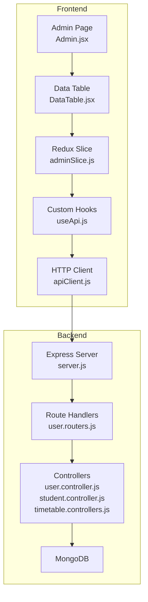
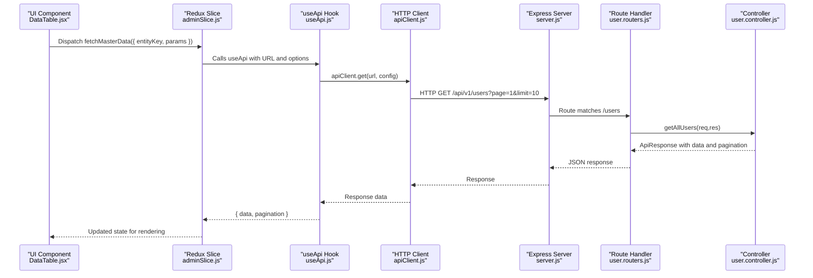
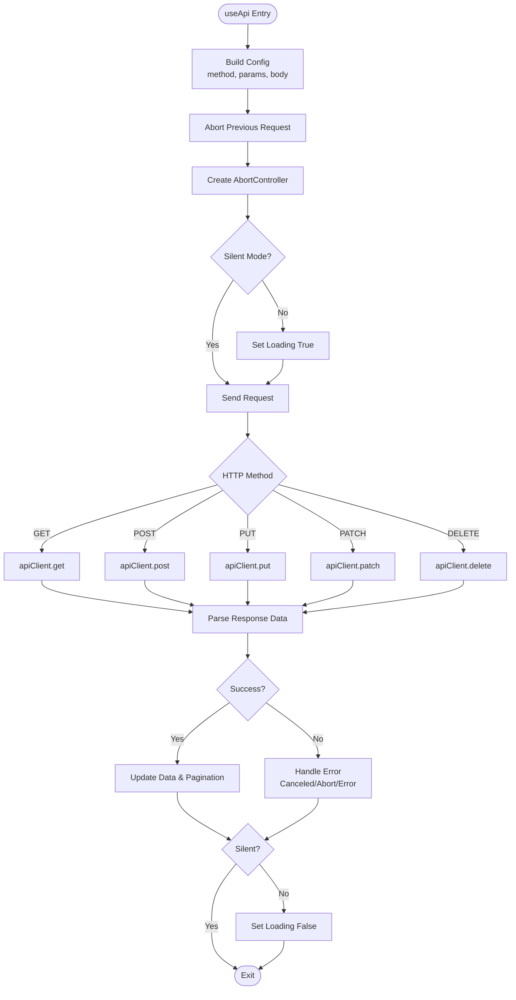
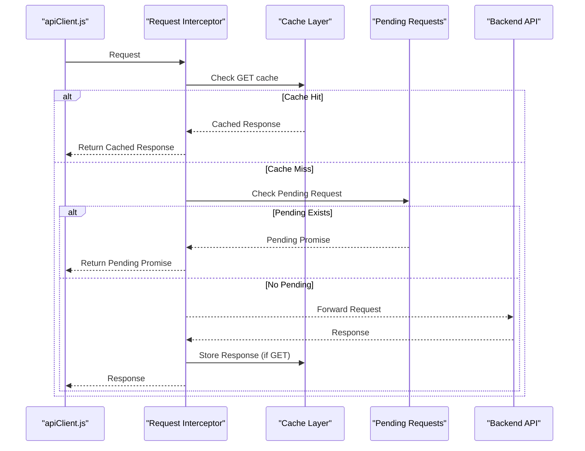
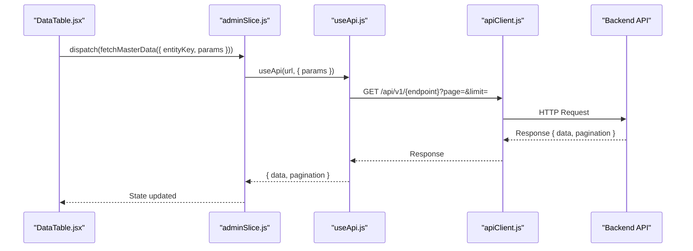
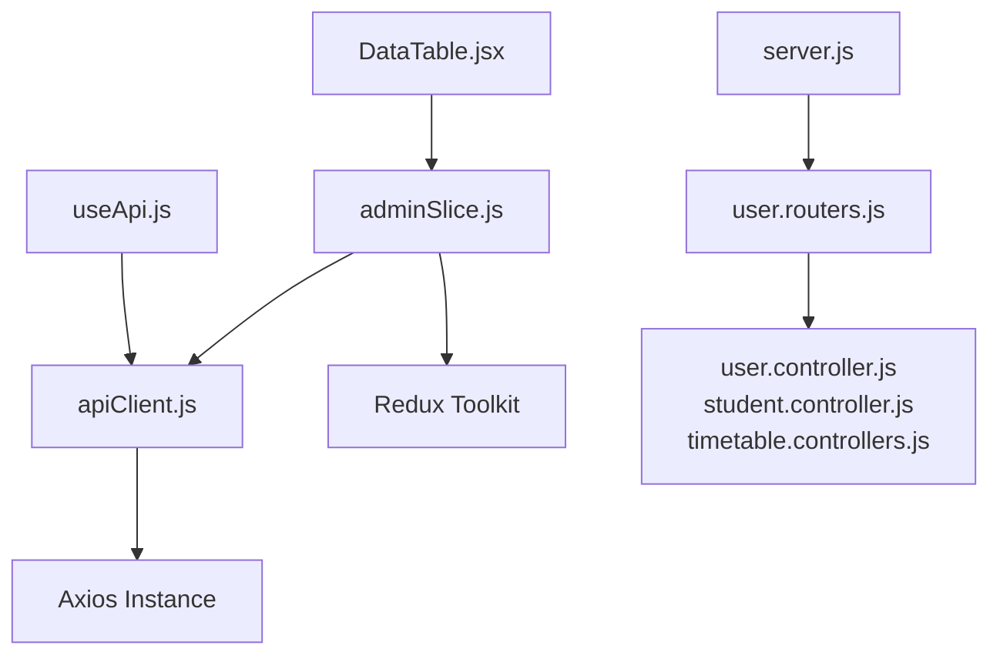

# Use Api Hook

<cite>
**Referenced Files in This Document**
- [useApi.js](file://Client/src/hooks/useApi.js)
- [apiClient.js](file://Client/src/services/apiClient.js)
- [adminSlice.js](file://Client/src/store/admin/adminSlice.js)
- [DataTable.jsx](file://Client/src/components/deshboard/DataTable.jsx)
- [Admin.jsx](file://Client/src/pages/dashboard/Admin.jsx)
- [user.routers.js](file://Backend/src/routes/user.routers.js)
- [user.controller.js](file://Backend/src/controllers/user.controller.js)
- [student.controller.js](file://Backend/src/controllers/student.controller.js)
- [timetable.controllers.js](file://Backend/src/controllers/timetable.controllers.js)
- [server.js](file://Backend/src/server.js)
- [index.js](file://Backend/src/index.js)
</cite>

## Table of Contents
1. [Introduction](#introduction)
2. [Project Structure](#project-structure)
3. [Core Components](#core-components)
4. [Architecture Overview](#architecture-overview)
5. [Detailed Component Analysis](#detailed-component-analysis)
6. [Dependency Analysis](#dependency-analysis)
7. [Performance Considerations](#performance-considerations)
8. [Troubleshooting Guide](#troubleshooting-guide)
9. [Conclusion](#conclusion)

## Introduction
This document explains how the frontend uses API hooks to fetch, cache, and manage data efficiently in the Timetable Management application. It covers the custom React hooks for API operations, the HTTP client with caching and token refresh capabilities, Redux integration for state management, and the backend API endpoints that serve master data and user-related operations.

## Project Structure
The application follows a clear separation of concerns:
- Frontend (React + Redux Toolkit): Provides UI, state management, and API integration via custom hooks and service clients.
- Backend (Express + MongoDB): Serves RESTful endpoints for master data, user management, and timetable operations.

**Diagram sources**
- [Admin.jsx:17-800](file://Client/src/pages/dashboard/Admin.jsx#L17-L800)
- [DataTable.jsx:1-563](file://Client/src/components/deshboard/DataTable.jsx#L1-L563)
- [useApi.js:1-370](file://Client/src/hooks/useApi.js#L1-L370)
- [adminSlice.js:1-201](file://Client/src/store/admin/adminSlice.js#L1-L201)
- [apiClient.js:1-275](file://Client/src/services/apiClient.js#L1-L275)
- [server.js:1-106](file://Backend/src/server.js#L1-L106)
- [user.routers.js:1-41](file://Backend/src/routes/user.routers.js#L1-L41)
- [user.controller.js:1-702](file://Backend/src/controllers/user.controller.js#L1-L702)
- [student.controller.js:1-235](file://Backend/src/controllers/student.controller.js#L1-L235)
- [timetable.controllers.js:1-148](file://Backend/src/controllers/timetable.controllers.js#L1-L148)

**Section sources**
- [Admin.jsx:17-800](file://Client/src/pages/dashboard/Admin.jsx#L17-L800)
- [DataTable.jsx:1-563](file://Client/src/components/deshboard/DataTable.jsx#L1-L563)
- [useApi.js:1-370](file://Client/src/hooks/useApi.js#L1-L370)
- [adminSlice.js:1-201](file://Client/src/store/admin/adminSlice.js#L1-L201)
- [apiClient.js:1-275](file://Client/src/services/apiClient.js#L1-L275)
- [server.js:1-106](file://Backend/src/server.js#L1-L106)

## Core Components
- Custom API hooks:
  - useApi: Optimized data fetching with caching, cancellation, and pagination helpers.
  - usePaginatedApi: Adds pagination controls to useApi.
  - useMutation: Handles mutations (POST/PUT/PATCH/DELETE) with cache invalidation.
  - useBatchOperation: Executes multiple operations with progress tracking.
- HTTP client:
  - apiClient: Axios instance with request/response interceptors, caching, token refresh, and retry logic.
  - api: Wrapper around apiClient for mutations with cache invalidation.
  - apiCache: Cache management utilities (clear, clearByPattern, invalidate, getStats).
- Redux integration:
  - adminSlice: Async thunks for CRUD operations against master data endpoints, with cache invalidation and optimistic updates.
- Backend endpoints:
  - Users: Registration, listing, retrieval, updates, deletion, login, logout, token refresh, current user, and password change.
  - Students: Bulk registration, listing with pagination, retrieval, updates, and deletion.
  - Timetables: Bulk creation, listing with pagination, retrieval, updates, and deletion.

**Section sources**
- [useApi.js:10-144](file://Client/src/hooks/useApi.js#L10-L144)
- [useApi.js:152-217](file://Client/src/hooks/useApi.js#L152-L217)
- [useApi.js:223-291](file://Client/src/hooks/useApi.js#L223-L291)
- [useApi.js:297-367](file://Client/src/hooks/useApi.js#L297-L367)
- [apiClient.js:29-275](file://Client/src/services/apiClient.js#L29-L275)
- [adminSlice.js:21-74](file://Client/src/store/admin/adminSlice.js#L21-L74)

## Architecture Overview
The frontend integrates with the backend through a layered approach:
- UI components trigger Redux actions.
- Redux thunks call the HTTP client for API operations.
- The HTTP client handles caching, retries, token refresh, and cache invalidation.
- Backend routes delegate to controllers that interact with MongoDB.

**Diagram sources**
- [DataTable.jsx:28-46](file://Client/src/components/deshboard/DataTable.jsx#L28-L46)
- [adminSlice.js:21-33](file://Client/src/store/admin/adminSlice.js#L21-L33)
- [useApi.js:37-116](file://Client/src/hooks/useApi.js#L37-L116)
- [apiClient.js:54-95](file://Client/src/services/apiClient.js#L54-L95)
- [server.js:63-76](file://Backend/src/server.js#L63-L76)
- [user.routers.js:26-30](file://Backend/src/routes/user.routers.js#L26-L30)
- [user.controller.js:136-263](file://Backend/src/controllers/user.controller.js#L136-L263)

## Detailed Component Analysis

### Custom API Hooks (useApi, usePaginatedApi, useMutation, useBatchOperation)
- useApi:
  - Supports GET/POST/PUT/PATCH/DELETE with automatic cancellation on unmount or dependency changes.
  - Integrates with apiClient for caching and retry logic.
  - Returns data, loading, error, refetch, clearCache, and setData.
- usePaginatedApi:
  - Extends useApi with page, limit, and pagination controls.
  - Automatically updates pagination state when data changes.
- useMutation:
  - Centralized mutation handler with cache invalidation via api.post/put/patch/delete.
  - Returns mutate, loading, error, data, and reset.
- useBatchOperation:
  - Executes multiple operations sequentially with progress tracking and optional error continuation.

**Diagram sources**
- [useApi.js:37-116](file://Client/src/hooks/useApi.js#L37-L116)
- [useApi.js:119-123](file://Client/src/hooks/useApi.js#L119-L123)
- [useApi.js:126-134](file://Client/src/hooks/useApi.js#L126-L134)

**Section sources**
- [useApi.js:10-144](file://Client/src/hooks/useApi.js#L10-L144)
- [useApi.js:152-217](file://Client/src/hooks/useApi.js#L152-L217)
- [useApi.js:223-291](file://Client/src/hooks/useApi.js#L223-L291)
- [useApi.js:297-367](file://Client/src/hooks/useApi.js#L297-L367)

### HTTP Client (apiClient, api, apiCache)
- Features:
  - Base URL set to /api/v1.
  - Request interceptor: GET caching, deduplication of pending requests, and performance logging.
  - Response interceptor: Cache successful GET responses, token refresh on 401, exponential backoff retries, and centralized error logging.
  - Token refresh: Automatic refresh via /api/v1/users/refresh-token with subscriber notifications.
  - Cache management: Clear cache, clear by pattern, invalidate by entity, and stats.
  - Mutation helpers: api.post/put/patch/delete with invalidateCache option.

**Diagram sources**
- [apiClient.js:54-120](file://Client/src/services/apiClient.js#L54-L120)
- [apiClient.js:217-242](file://Client/src/services/apiClient.js#L217-L242)

**Section sources**
- [apiClient.js:29-275](file://Client/src/services/apiClient.js#L29-L275)

### Redux Integration (adminSlice)
- Entity endpoints mapping for master data CRUD operations.
- Async thunks:
  - fetchMasterData: GET entities with pagination.
  - addMasterData: POST with cache invalidation.
  - updateMasterData: PUT with cache invalidation.
  - deleteMasterData: DELETE with cache invalidation.
- Optimistic updates and error handling via toast notifications.

**Diagram sources**
- [DataTable.jsx:28-46](file://Client/src/components/deshboard/DataTable.jsx#L28-L46)
- [adminSlice.js:21-33](file://Client/src/store/admin/adminSlice.js#L21-L33)
- [useApi.js:37-116](file://Client/src/hooks/useApi.js#L37-L116)
- [apiClient.js:54-95](file://Client/src/services/apiClient.js#L54-L95)

**Section sources**
- [adminSlice.js:1-201](file://Client/src/store/admin/adminSlice.js#L1-L201)

### Backend API Endpoints
- Users:
  - Public: POST /api/v1/users/login, POST /api/v1/users/refresh-token
  - Protected: GET /api/v1/users, GET /api/v1/users/me, POST /api/v1/users/logout, POST /api/v1/users/change-password
  - Admin: POST /api/v1/users (register), GET /api/v1/users/:id, DELETE /api/v1/users/:id, PATCH /api/v1/users/:id
- Students:
  - Bulk registration: POST /api/v1/students
  - Listing with pagination: GET /api/v1/students?page=&limit=&search=&sortBy=&sortOrder=&filter_field=value
  - CRUD: GET /api/v1/students/:id, PUT /api/v1/students/:id, DELETE /api/v1/students/:id
- Timetables:
  - Bulk creation: POST /api/v1/timetables
  - Listing with pagination: GET /api/v1/timetables?page=&limit=&search=&sortBy=&sortOrder=&filter_field=value
  - CRUD: GET /api/v1/timetables/:id, PUT /api/v1/timetables/:id, DELETE /api/v1/timetables/:id

**Section sources**
- [user.routers.js:18-38](file://Backend/src/routes/user.routers.js#L18-L38)
- [user.controller.js:136-263](file://Backend/src/controllers/user.controller.js#L136-L263)
- [student.controller.js:94-137](file://Backend/src/controllers/student.controller.js#L94-L137)
- [timetable.controllers.js:46-89](file://Backend/src/controllers/timetable.controllers.js#L46-L89)

## Dependency Analysis
- Frontend dependencies:
  - React hooks (useState, useEffect, useCallback, useRef) in useApi.js.
  - Axios instance in apiClient.js with interceptors and cache.
  - Redux Toolkit (createSlice, createAsyncThunk) in adminSlice.js.
  - UI components (DataTable.jsx) depend on Redux state and dispatch actions.
- Backend dependencies:
  - Express server with CORS, compression, helmet, cookie-parser, and route handlers.
  - Mongoose models and controllers for data operations.

**Diagram sources**
- [useApi.js:1-370](file://Client/src/hooks/useApi.js#L1-L370)
- [apiClient.js:1-275](file://Client/src/services/apiClient.js#L1-L275)
- [adminSlice.js:1-201](file://Client/src/store/admin/adminSlice.js#L1-L201)
- [DataTable.jsx:1-563](file://Client/src/components/deshboard/DataTable.jsx#L1-L563)
- [server.js:1-106](file://Backend/src/server.js#L1-L106)
- [user.routers.js:1-41](file://Backend/src/routes/user.routers.js#L1-L41)
- [user.controller.js:1-702](file://Backend/src/controllers/user.controller.js#L1-L702)
- [student.controller.js:1-235](file://Backend/src/controllers/student.controller.js#L1-L235)
- [timetable.controllers.js:1-148](file://Backend/src/controllers/timetable.controllers.js#L1-L148)

**Section sources**
- [useApi.js:1-370](file://Client/src/hooks/useApi.js#L1-L370)
- [apiClient.js:1-275](file://Client/src/services/apiClient.js#L1-L275)
- [adminSlice.js:1-201](file://Client/src/store/admin/adminSlice.js#L1-L201)
- [DataTable.jsx:1-563](file://Client/src/components/deshboard/DataTable.jsx#L1-L563)
- [server.js:1-106](file://Backend/src/server.js#L1-L106)

## Performance Considerations
- Caching:
  - GET requests are cached for 5 minutes and deduplicated during pending requests.
  - Cache invalidation occurs on mutations via invalidateCache option.
- Retry logic:
  - Network errors are retried up to three times with exponential backoff.
- Compression and security:
  - Response compression reduces payload sizes.
  - Helmet and CORS enhance security posture.
- Pagination:
  - Backend supports pagination with search and filter parameters to reduce payload sizes.

[No sources needed since this section provides general guidance]

## Troubleshooting Guide
- 401 Unauthorized:
  - The client attempts token refresh automatically. If refresh fails, cache is cleared and the user is redirected to login.
- Network errors:
  - Up to three retry attempts are performed with exponential backoff. Network errors trigger toast notifications.
- Cache issues:
  - Use clearCache or invalidate(entityKey) to refresh stale data.
- Pagination problems:
  - Ensure page and limit parameters are passed correctly; verify backend pagination logic.

**Section sources**
- [apiClient.js:124-168](file://Client/src/services/apiClient.js#L124-L168)
- [apiClient.js:172-183](file://Client/src/services/apiClient.js#L172-L183)
- [apiClient.js:217-242](file://Client/src/services/apiClient.js#L217-L242)

## Conclusion
The API hook system provides a robust, efficient, and maintainable way to integrate frontend UI with backend services. It offers built-in caching, retry mechanisms, token refresh, and seamless Redux integration for state management. The backend endpoints are designed to support master data operations with pagination, search, and filtering, ensuring scalable and responsive user experiences.